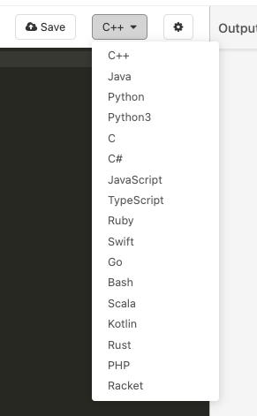
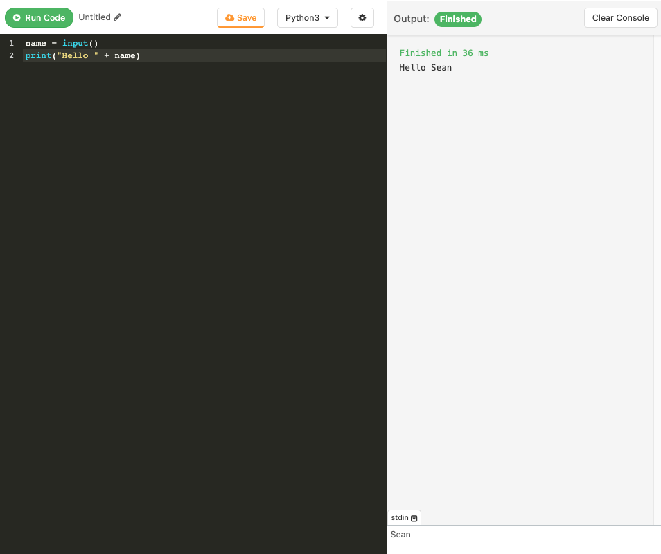
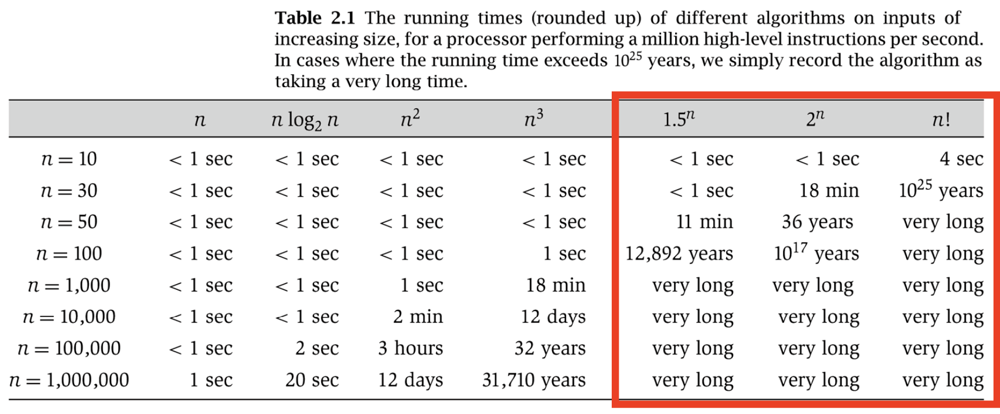
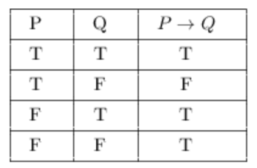

# Algorithm

> Terms

* Vacuous Truth: conditional that is only true because antecedent cannot be satisfied




* Most problems are in korean
* [+] Variety of tags, problems
* [-] Doesn't give solution, wrong test case




* [+] [Online Debugger](https://www.codechef.com/ide)
* [+] Frequent contest, long challenges




* [+] Frequent contest, most popular

* Problems

| Group | Difficulty Range | Group Size |
| ----- | ---------------- | ---------- |
| A     | 500-1000         | 392        |
| B     | 1100-1200        | 415        |
| C     | 1300-1400        | 429        |
| D     | 1500-1600        | 497        |
| E     | 1700-1800        | 503        |
| F     | 1900-2000        | 442        |
| G     | 2100-2200        | 447        |
| H     | 2300-2400        | 473        |
| I     | 2500-2600        | 437        |
| J     | 2700-2800        | 324        |
| K     | 2900-3000        | 190        |
| L     | 3100-3500        | 172        |

* Contest
  * Around 11:00 PM

| Contest     | Difficulty Range | Rating                        |
| ----------- | ---------------- | ----------------------------- |
| Div 3       | 500-2000         | < 1600                        |
| Div 2       | 1500-2600        | < 1900 / 2100 (when no Div 1) |
| Educational | 1300-2800        | < 1900 / 2100 (when no Div 1) |
| Div 1       | 2100-3500        | > 1900                        |




* [+] Create personal contest
* [-] Lack of solution




* [+] [Best Online Debugger](https://leetcode.com/playground/new/empty)
* [+] Contains SQL, concurrency question
* [+] Actual interview problems from interviewees / See by company tags

* Contest
  * Weekly: 11:30 AM - 1:00 PM (KST)
  * Biweekly: 11:30 PM - 1:00 AM (KST)

> Example

* use online Debugger
  1. Select Language
      
  1. Paste input
  1. Run code (command + ')
      




* [+] Contains SQL, shell, AI problems
* [+] Test, online certificate




## Complexity




> Terms

* Big O

| Equation                | Limit                                         | Meaning                                |
| ----------------------- | --------------------------------------------- | -------------------------------------- |
| f(n) ∈ : f < g          |                                               | f(n) ∈ O(g(n)) and f(n) ∉ θ(g(n))      |
| f(n) ∈ O(g(n)) : f <= g | $$ \lim _{n → ∞} \frac{f(n)}{g(n)} \neq ∞ ​$$ | ∃ pos c / k, st f(n) <= cg(n) ∀ n >= k |

* Big Omega

```text
Omega (lower)    f(n) = Ω(g(n))
∃ positive constants c and k such that f(n) >= c * g(n) for all n >= k
```

$$
\lim _{n \rightarrow \infty} \frac{f(n)}{g(n)} \neq 0 \Rightarrow f=\Omega(g)
$$

* Big Theta

```text
θ (average)    f(n) = θ(g(n))
∃ positive constants c1, c2 and k such that c1 * g(n) ≤ f(n) <= c2 * g(n) for all n >= k
```

$$
\lim _{n \rightarrow \infty} \frac{f(n)}{g(n)} \neq 0, \infty \Rightarrow f=\theta(g)
$$

* TIME(f(n)): all decidable languages that have TMs with runtimes that are O(f(n))

* Decision problem: given n, is n prime?
* Search problem: given n, find a factor of n if it exists
* Optimization problem: find the smallest prime factor of n

### PNP


* P (Polynomial Time): (ex: Sorting)

* NP (Nondeterministic Polynomial Time): Verifiable in polynomial time

* NP Complete: set of all decision problems whose solutions can be verified in polynomial time
  * Not closed under union intersection, concatenation, Kleene star
  * NP-complete problems is often denoted by NP-C or NPC
  * transitivity of reduction
  * [ex] SAT (Boolean satisfiability problem) / Hamiltonian path

* NP Hard: Do not have to be decision problems
  * TSP minimum distance
  * May not be verifiable in P time

* Reduction: polynomial time algorithm converting X inputs to equivalent Y inputs
  * Reduction from X to Y
  * Assume you have a black box for Y,  a polynomial time algorithm uses that box to solve X
  * YP|NP →  XP|NP

## Proof

| symbol                                      | Definition              |
| ------------------------------------------- | ----------------------- |
| $$ P \wedge Q $$                            | conjunction (AND)       |
| $$ P \vee Q $$                              | disjunction (OR)        |
| $$ ~ P $$                                   | Negation (NOT)          |
| $$ P \rightarrow Q $$                       | Implication (IF)        |
| $$ P \leftrightarrow Q $$                   | Biconditional (IFF)     |
| $$ ∀𝑥 H 𝑥 → C 𝑥 \equiv ∀𝑥 ¬𝐶 (x) → ¬H(x) $$ | Proof by contrapositive |

> Terms

* Direct proof: start with whatever we are given and work towards the statement we want to prove

### Induction

* Works by showing that result is true for some base
* Then show if result holds for n = k then it also works for n = k + 1 for any (k >= base)

> Example

* Domino falls over
  * First domino falls over
  * If one dimno falls over, next domino will fall over

* Empty room example → No one passed the hallway
  * There was no person in a room
  * I saw noone passing to the hallway -> n people in t + 1 will be same as t

* Arithmetic Sum
  * A(0) = 1, A(1) = 4, A(n) = 3A(n − 1) + 4A(n − 2) for n > 1

  * Question
  $$ \frac{n(n+1)}{2} $$

  * Base
  $$ 1=\frac{1(1+1)}{2} $$

  * Inductive hypothesis
  $$ 1+2+\ldots+k=\frac{k(k+1)}{2} $$

  * Proof
  $$ 1+2+\ldots+(k+1) $$
  $$ = [1+2+3+\ldots+k]+(k+1) $$
  $$ =\frac{k(k+1)}{2}+(k+1) $$
  $$ =\frac{k(k+1)+2(k+1)}{2} $$
  $$ =\frac{(k+1)+(k+2)}{2} $$

### Structural induction

* generalization of mathematical induction over natural numbers and can be further generalized to arbitrary Noetherian induction
* Used to prove that some proposition P(x) holds ∀ x of some sort of recursively defined structure (formulas, lists, trees)

### Strong Induction

* Let F(S) be the number of breaks required for bar size S which is m * n

* Base: F(1) = 0 because we don’t need to break for a bar of size 1
* Strong Inductive Hypothesis: Suppose F(k) = k - 1 true for 1 ≤ k < S
* Inductive Step:
  * For a chocolate bar with the size of S, break it into the size of a and b. where a < S, b < S, and a + b = S
  * F(a) = a - 1 and F(b) = b - 1 by our strong inductive hypothesis
  * Then the total number of break would be 1 + (a - 1) + (b - 1) = S - 1 = m * n - 1

### Contradiction

* Assume the result is not true, show that leads to a contradiction
* Conclude that the original result is true

> Example

* Euclid's theorem
  * Towards contradiction, suppose there are finite number of primes $$ p_1, .., p_t $$
  * Consider the integer, which has no prime
  $$ P=\prod_{i=1}^{n} P_{i} + 1$$
  * There are an infinite number of primes

### Contrapositive



* If $$ p \rightarrow q $$ then $$ \sim q \rightarrow \sim p $$

> Example

* Equality of set
  * A and b are equal
  * Show that $$ A \subseteq B $$
    * then, $$ a \in A \rightarrow a \in B $$
  * similarily $$ B \subseteq A $$
    * then, $$ a \in B \rightarrow b \in A $$

## Adhoc

* question does not require any algorithm, data strucutre or high level mathemtatical concept
* can be solved using basic logical skills or sometimes even by common sense



### Heuristic

* solve a problem more efficiently than traditional methods by sacrificing optimality, accuracy, precision, completeness



## Aho corasick

* string-searching algorithm invented by Alfred V. Aho and Margaret J. Corasick
* dictionary-matching algorithm that locates elements of a finite set of strings (the "dictionary") within an input text



## Constructive

* Generate sciprt that checks / create permutation and see patterns



### Interactive



## Minimax

* recursive algorithm for choosing the next move in an n-​player game



### Sprague Grundy

* every impartial game under the normal play convention is equivalent to a one-heap game of nim



## Mos

* pre-process all queries so that result of one query can be used in next query

* Prerequisite
  * All queries are known beforehead so that they can be preprocessed
  * It cannot work for problems where we have update operations also mixed with sum queries



## Random

* Reservior sampling: Applicable when sample size is unknown




* random
  * uniform_int_distribution()

```cpp
#include <random>
#include <vector>

using namespace std;

int main() {

// 1. random_vector
vector<int> v(10);
generate(v.begin(), v.end(), rand);   // create vector

random_device rd;  // Will be used to obtain a seed for the random number engine
mt19937 gen(rd()); // Standard mersenne_twister_engine seeded with rd()
uniform_int_distribution<> distrib(1, 6);

for (int n=0; n<10; ++n) // `distrib` to transform the random unsigned int generated by gen into an int in [1, 6]
  cout << distrib(gen) << ' ';
cout << '\n';
}
```




* randrange(0, 10): random integer between
* uniform(0, 10): random float between

* numpy.random
  * choices(`opts`, `size`, `prop`): [ex] range(3), size=(2, 2), p=[0.8, 0.19, 0.01]: array([[0, 1], [0, 0]])
  * rand(d0, d1, …, dn): Random values in a given shape
  * randn(d0, d1, …, dn): Standard normal distribution
  * randint(low[, high, size, dtype]): Random integers from [low, high)
  * shuffle(`x`): Modify sequence in-place by shuffling its contents
  * seed([seed]): Seed the generator
  * randint(2, size=10): array([1, 0, 0, 0, 1, 1, 0, 0, 1, 0])






### Randomization



## Simulation


