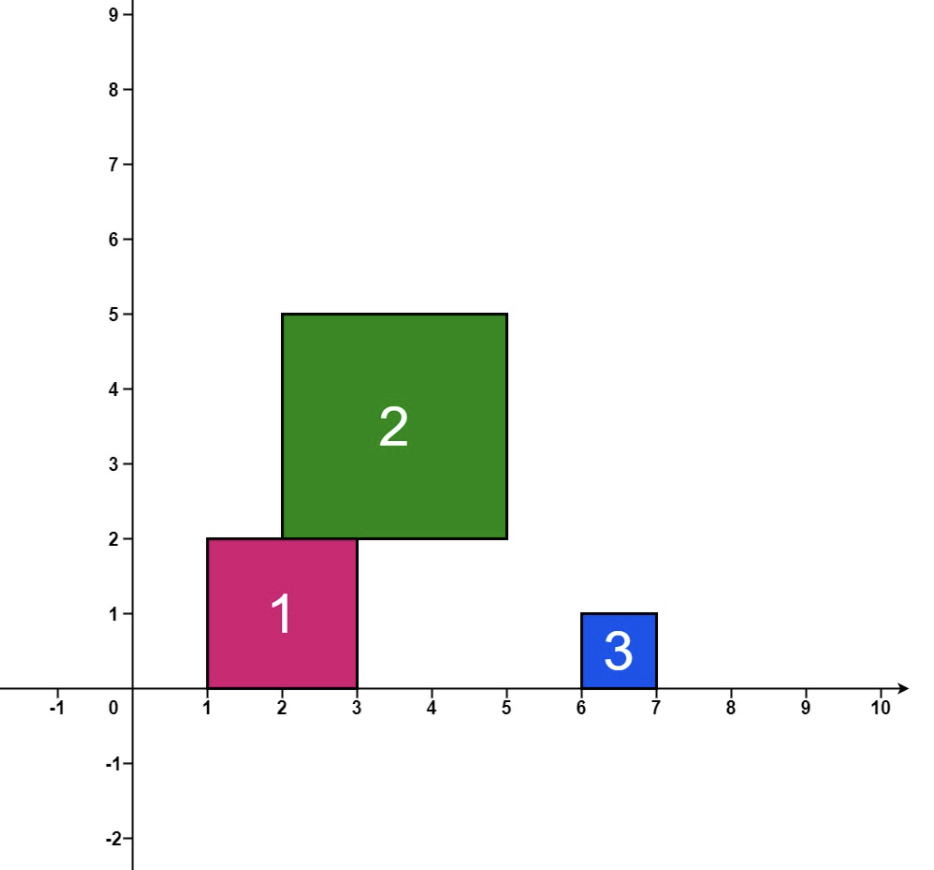




> Question



* After each square is dropped, record height of current tallest stack of squares
* Return an integer array ans where ans[i] represents height described above after dropping ith square

```txt
Input: positions = [[1,2],[2,3],[6,1]]
Output: [2,5,5]
```




```py
def fallingSquares(self, positions: List[List[int]]) -> List[int]:
  height, pos, res = [0], [0], [0]
  for left, side in positions:
    i, j = bisect_right(pos, left), bisect_left(pos, left + side)
    high = max(height[i - 1: j] or [0]) + side
    pos[i:j] = [left, left + side]
    height[i:j] = [high, height[j - 1]]
    res.append(max(res[-1], high))
  return res[1:]
```



