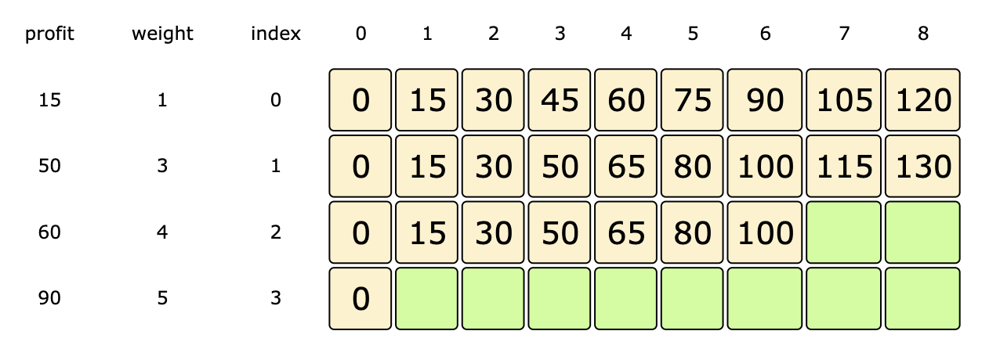
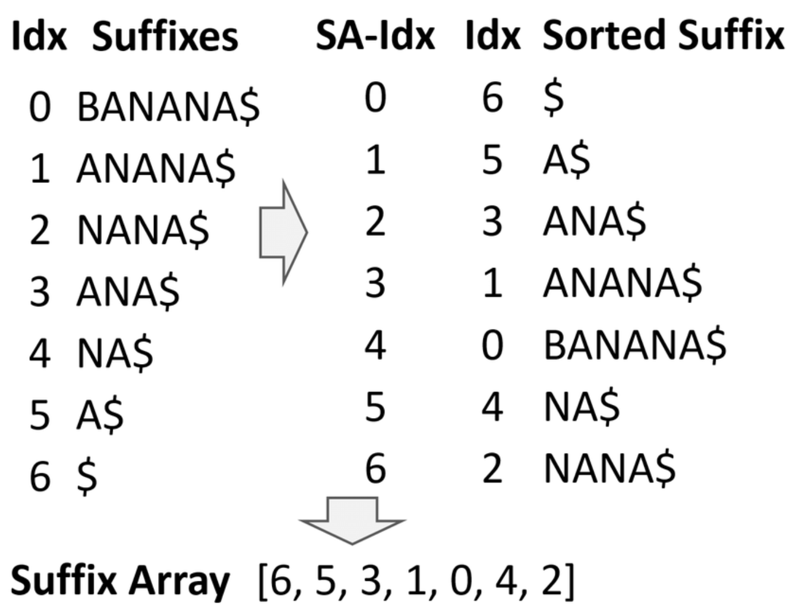

# Dynamic Programming

* an optimization problem on DAGs
* Each subproblem is a vertex and there is a directed edge from u to v that is used to calculate v

* Q. Given a target find minimum / maximum, cost / path / sum to reach the target
* A. Choose min / max among all possible paths before current state, then add value for current state

> Reference

<https://www.educative.io/courses/grokking-dynamic-programming-patterns-for-coding-interviews>

## DP Dimension 0



## DP Dimension 1



## DP Dimension 2



### DP Dimension 2 Area



### DP Dimension 2 Path

* Choose min(max) path among all possible paths before the current state, then add value for the current state
  * routes[i] = min(routes[i-1], routes[i-2], ... , routes[i-k]) + cost[i]



### Tabulation



## DP Bit



## DP Count

* Sum all possible ways to reach the current state
  * routes[i] = routes[i-1] + routes[i-2], ... , + routes[i-k]



## Digit

* How many numbers x are there in the range a to b, where the digit d occurs exactly k times in x?



## Divide concur DP

* Applyes when $$ DP[i] = min_{i\leq j \leq N}F(i, j) $$



## Hash DP



## Longest Increasing Subsequence



## Knapsack

* Given the weights and profits of ‘N’ items, put items in a knapsack that has a capacity ‘C’
* Goal is to get the maximum profit from the items in the knapsack
* [ex] subset sum, target sum

> Term

* **01 knapsack**: Repetition item is not allowed

> Example

* N=number of items, C=knapsack capacity
* DP: dp[idx][cap] = max(dp[idx - 1][cap], profit[idx] + dp[idx][cap - weight[idx]])
  * Time: O(N*C)
  * O(C) for optimized DP

* Memoization
  * Space: O(N*C)



### Unbounded

* Repetetition item is allowed
* [ex] coin change, rod cutting



## Merge



## DP Tree



## Memoization



## DP String

* Usually done in N ** 2



### Z Function

* Z algorithm is a linear time string matching algorithm which runs in complexity



### KMP

* Knuth-Morris-Pratt searches for occurrences of `word` within `text` without re-examination of previously matched chars
* Observe that when a mismatch occurs, the word itself embodies information to determine where the next match begin
* O(n) in worst case
* [+] Easier to implement

> Example

* DNA pattern matching problem



### Suffix Array

* Time
  * O(n^2 Logn): Build Suffix Array
  * O(mlogn):
* Space O(m+n): Suffix Array
* [+] Find substring repetitions

> Example

* Pattern Searching, longest repeated substring, longest common substring, longest palindrome in a string


