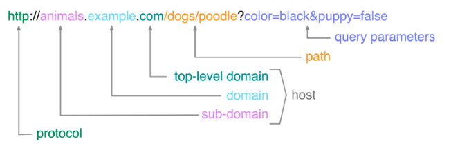
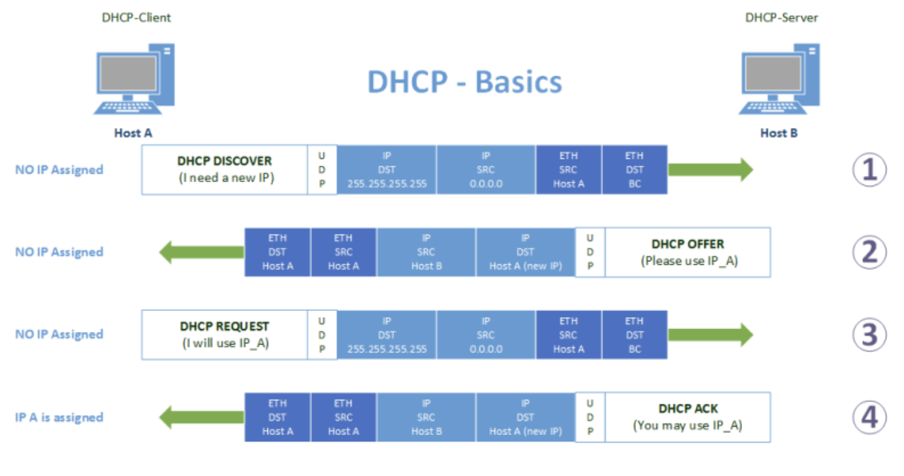
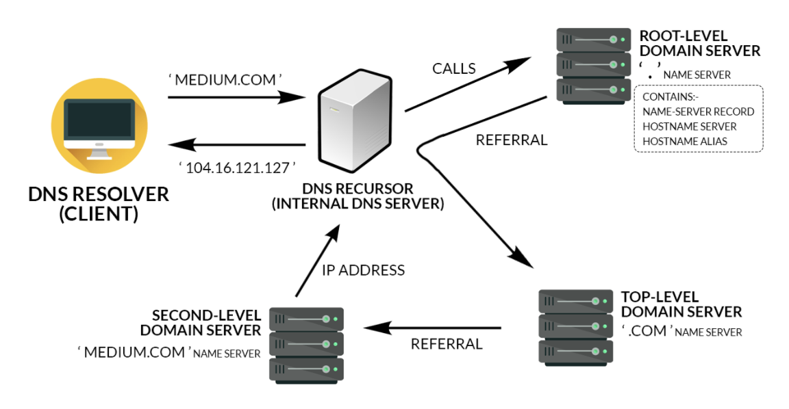
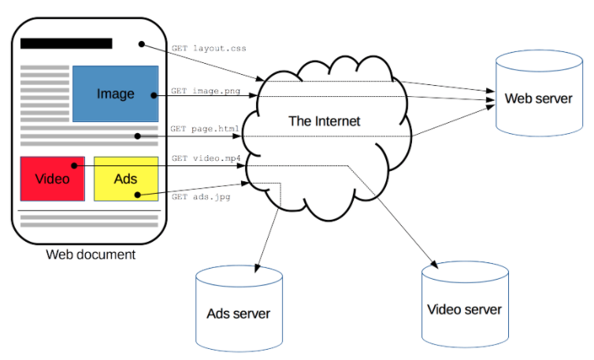
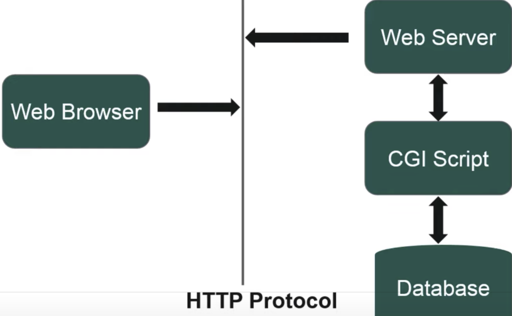
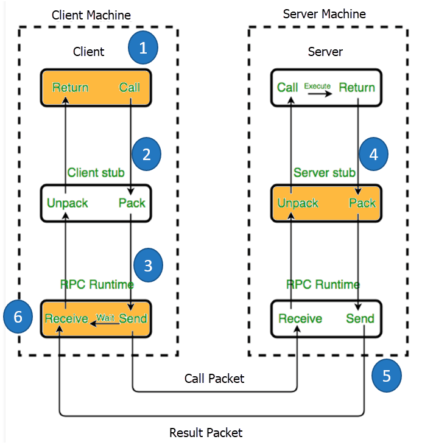

# Application layer



> Terms

* DHCP (Dynamic Host Configuration Protocol)
  * Automates the configuration process of hosts on a network
  * Configure IP addresses for client devices to ensures devices can obtain an IP address when needed
  * Assign the same IP to the same machine each time, if possible
  * discovery: Process a client configured to used DHCP attempts to get network configuration information
    * DHCPOFFER has the field that specifies the MAC address of the client
  

* Name Resolution

## Cookie

* unique string identifiers that can be stored on the client’s browser
* includes Set-cookie: value in the HTTP response
* third-party cookies are cookies set for domains that are not being visited



## Domain

* Domain zones allows for easier control over multiple levels of a domain
* Used to demarcate where control moves from a TLD name server to an authoritative name servers
* Fully qualified domain name (FQDN) combines host, domain, top level domain with dot
* DNS support up to 127 characters / 127 levels of domain in total for a single FQDN
* subdomain is a domain that is part of a larger domain
* www.linkedin.com => 108.174.10.10: forward lookup

> Term

* TLD: Top level domain is top of the hierarchical DNS name resolution system (.com .net)


* CNAME: redirect traffic from one domain to another → naver.com to www.naver.com
  * only need to change on A-record

* Collision Domain: A network segment where only one device can communicate at a time
  * If multiple systems send data at once, electrical pulses sent across cable can interfere with each other

* SSL: Certified Authors: GlobalSign, Cloud Flare (Free), Comodo (Paid/Free), GeoTrust (Free Trial), DigiCert

### DNS



* Domain Name System allows the application to translate a name into a network address
* Caching / Recursive provided by ISP to store known domain name lookups for a certain amount of time
* Recursive name servers → ISP perform full DNS resolution requests
* Root name servers
* TLD name servers
* Authoritative name servers → weather.com

> Term

* Public: name servers specifically set up so that anyone can use them for free
  * Google operates public name servers on the IPs 8.8.8.8 and 8.8.4.4
  * public DNS servers also respond to ICMP echo requests → test general internet connectivity using ping

* DNSSEC: Domain Name System Security Extensions: suite of IETF specifications for securing certain kinds of info
  * provided by DNS as used on IP networks

* Static table lookup for hostnames
  * Ubuntu: /etc/hosts
  * window: \system32\drivers\etc\hosts




* dig: performs DNS lookups and displays the answers that are returned from the name servers

* nslookup: administration CLI tool to obtain domain names, IP address mapping, or other DNS records
  * interactive mode
  * type=MX: resource record type
  * set debug: to display the full response packets
  * server 8.8.8.8: change the DNS server you're using







* gcloud dns
  * --project=seanhwangg
  * record-sets
    * transaction start
      * --zone=MANAGED_ZONE
  * managed-zones
    * create `zone`: create `zone`
      * --description=""
      * --dns-name=`url`: [ex] classroom.icu
      * --visibility="public"
      * --dnssec-state="off"
    * list: show all managed zones




### SEO

> Term

* sitemap.xml: Informs search engines of the site structures
  * provides some meta information about individual pages

* On-site SEO: titles, tags and meta description
  * Make them specific and relevant to user’s keywords. add meat of content in first 150 characters of meta descriptions
  * the actual content on your website: Add Contact Us section, add testimonials etc
  * main elements: By adding the primary keywords in the main elements of your site like headings, titles, footer etc
  * URLs: include primary keywords in the URLs of your website and keep them as simple and shorter as possible
  * XML Sitemap: Generate and submit an XML Sitemap to search engines
    * let the search engine know whenever you make any changes like add a new page, or edit content
  * Robot.txt: placed in root dir of domain that instructs web crawlers which part / index of website can crawl
  

* Off-site SEO: backlinks to your website from other sources such as social media, articles, blogs
  * Look up for websites that already link competitors (ex: Google Adwords and Ahrefs)

## Communication




* ifconfig: configure network interface parameters
  * apt install net-tools

* ip
  * brew install iproute2
  * n: ip neighbor
  * a: ip address
  * address show: show

* ping: test the reachability of a host on an Internet Protocol network
  * apt install iputils-ping (built in on mac)

* speedtest-cli
  * sudo pip3 install speedtest-cli




## http



* Hypertext Transfer Protocol is application-layer protocol for transmitting hypermedia docs with port 80 ([ex] HTML)
* [-] Stateless: no link between two requests being successively carried out on the same connection
* [+] Authentication: [ex] WWW-Authenticate, or specific session using HTTP cookies
* [+] Caching: server can instruct proxies and clients, about what to cache and for how long
* [+] Proxy: hide their true IP address from other computers
* [+] Relaxing origin constraint: allowing document to become a patchwork of information sourced from different domains
* [+] Session: Cookies allow user to carry auth information




* gunicorn: based on the pre-fork worker model → a central master process that manages worker processes
  * master never knows anything about individual clients
  * All requests and responses are handled completely by worker processes
  * Best practice: number of worker
    * DO NOT scale the number of workers to the number of clients you expect to have
    * should only need 4-12 worker processes to handle hundreds or thousands of requests per second
    * recommend (2 x $num_cores) + 1 as the number of workers to start off with
    * Too many processes start thrashing system resources decreasing throughput of entire system
    * gunicorn --bind:8080 --workers 1 --threads 8 page.app:app
  * --chdir




* http.server.HTTPServer
  * serve_forever()
  * python3 -m http.server

* http.server
  * python -m http.server --cgi 8000

* django.http
  * HttpRequest()
  * HttpResponse()
    * content: raw bytes
  * HttpResponseNotFound()
  * get_object_or_404(): prefer over get, only use in views
  * render(`request`, `context`)

```py
from django.shortcuts import render
from django.http import HttpResponse

def index(request):
  return HttpResponse("Hello World!")

# 1. Single paramter
def show_age(request, age):
  return HttpResponse(f"I am {age} years old.")
```




### Apache

> Terms

* Order allow,deny: Deny will win if matched by both directives
* Order deny,allow: allow will win if matched by both directives
* Require all granted: Allow all requests
* Require all denied: Deny all requests
* Require host safe.com: Only from safe.com are allowed

* hostname
* hostnamectl
* httpd: Apache HyperText Transfer Protocol (HTTP) server program
  * sudo brew services restart httpd
  * /usr/local/etc/httpd/httpd.conf: mac
  * /home1/irteam/apps/apache/conf/httpd.conf: server
  * /home1/irteam/apps/apache



* CLI
  * apachectl: wrapper over httpd and just sets some environment variables and adds further functionality
    * -V: show which apache config using
    * cgid_: creates external daemon responsible for forking child processes to run CGI scripts
    * restart




* Mac
  * brew install apache2
  * brew services start httpd




> Error

* 48)Address already in use: AH00072: make_sock: could not bind to address [::]:80
  * sudo launchctl unload -w /System/Library/LaunchDaemons/org.apache.httpd.plist
  * sudo apachectl -k restart

* Internal Server Error
  * server encountered an internal error or misconfiguration and was unable to complete your request

* /usr/local/bin/apachectl: line 95: lynx: command not found
  * sudo tail /var/log/apache2/error_log

> Reference

<https://httpd.apache.org/docs/current/ssl/ssl_howto.html>
<https://www.educative.io/courses/securing-nodejs-apps/qV9MEpkDGjG>



### nginx

* Can couple as a reverse proxy server, host more than one site
* Has async way (not rely on threads) of handling web requests -> higher performance while handling multiple request
* load balancing traffic
* terminate SSL encryption and serve static files




* nginx
  * -s reload: update nignx
  * -t: Check syntax
  * -g: set global configuration directives ([ex] 'daemon off;')

* sudo systemctl
  * status nginx: nginx current status
  * stop nginx: Stop nginx
  * reload nginx: Reload nginx
  * restart nginx: Restart nginx







## HTTPS

* Use port 443 with SSL-encrypted message body
* uses the private and public keys encryption method to encrypt the communication between website and server
* [+] protected from man-in-the-middle attacks, including the session hijacking
* [-] virtual hosts cannot be used with SSL ([ex] shared hosting or running multiple sites on the same server)
* [-] Speed: require SSL handshakes to establish the connection -> subsequent connections are faster so not much issue

> Terms

* Certificate
  * Domain validated: cheap (50$) but do not verify as much information as their counterparts ([ex] let's encrypt)
  * Extended Validation: validate you as domain’s owner and verify identity and legitimacy of domain owner
* /usr/bin/ssl/yourApp.key: RSA Key
* /usr/bin/ssl/yourApp.csr: certificate signing request




* openssl
  * genrsa -out yourApp.key 1024
  * req -new -key yourApp.key -out yourApp.csr




> Reference

<https://letsencrypt.org/>

### Client




* Express: web application framework works on the server-side, running on top of node.js
  * Handle route, accept client requests, retrieve data from DB, prepare views and send back responses

```js
// 1. Rest client
const express = require('express');
const PORT = process.env.HTTP_PORT || 4001;
const app = express();
app.get('/', (req, res) => {
  res.send('flowers smell nice');
});
app.listen(PORT, () => {
  console.log(`Server listening at port ${PORT}.`);
});

// 2. graphql Client
const client = new client("https://myapi.com/graphql");

/* Now, send your query as a string (Note that ` is used to create a multi-line string in javascript).

client.query(`
  query {
    user {
      id
      name
    }
  }`);
```




* Schema()
  * auto_camelcase: [ex] **True**, False
* gcloud.bigQuery
  * Client()
    * project: project id
    * credentials: if not passed from environmnet

```py
import graphine
import os

# 1. graphql

class Query(graphene.ObjectType):
  is_staff = graphene.Boolean()

  def resolve_is_staff(self, info):
    return True

schema = graphene.Schema(query=Query)

result = schema.execute(
  '''
  {
    isStaff
  }
  '''
)
print(dict(result.data.items()))  # {'isStaff': True}

# 2. big query
os.environ['GOOGLE_APPLICATION_CREDENTIALS'] = '/gcloud-credential.json'
client = bigquery.Client()
```




### Server

* graphql: API server then makes calls to a database or other services to fetch the data that the client requested

## Telnet

* client-server protocol, based on a reliable connection-oriented transport
* Use port 23 using TCP protocol, NCP before TCP presents, not secure compared to ssh wo authentication and encryption

> CLI

* telnet: connect destination host:port via a telnet protocol
  * connection establishes means connectivity between two hosts is working fine
  * yum -y install telnet / brew install telnet

## ssh

* Secure shell mostly used in terminal/command line to do something on remote computer with encrypted traffic
* Protocol1 is less secure which can be changed in ssh/config




> Command

* ssh: Forwarding sends data in one port through a SSH and send it to a port on the remote
  * -c: ([ex] blowfish: to increase transfer speed)
  * -i: path to the private key
  * -l: login username (-l gyuseung == gyuseung@)
  * -L `local_port`:`local_host`:`remote_port` `server`: port forwarding
  * -o
    * ProxyCommand="ssh -W %h:%p server1" server2: %h = server2, %p = ssh port in server2
    * StrictHostKeyChecking=no: doesn’t check key
  * -p: port
  * -tt `server1` ssh `server2`: ssh `server1` then ssh `server2` (cons: settings dependent on server1)
  * -v: verbose mode
  * -V: Shoe version

* ssh-add: adds private key identities to the authentication agent
  * -D: Deletes all identities from the agent

* ssh-agent
  * -s: Generate Bourne shell commands on stdout

* ssh-keygen: create public, private key
  * public key ([ex] id_rsa.pub) encrypt messages, server knows a set of public keys it trusts
  * private key ([ex] id_rsa), stored in PC, decrypts messages (mathematical relations with public key)
  * append (id_rsa.pub) to known_hosts in ~/.ssh/authorized_keys
  * -b `num`: Specifies # bits in the key to create ([ex] 4096)
  * -H: hash known hosts file
  * -t `algorithm`: [ex] rsa
  * -f `filename`: specifies `filename` of key file
  * -R `hostname`: removes key belongs to known host files

* ssh-copy-id: cat ~/.ssh/id_rsa.pub | ssh `a`@`b` "cat >> ~/.ssh/authorized_keys"
  * -i identity_file: Use only the key(s) contained in identity_file
  * -n: do a dry run

* sshpass: allows us to supply password to the Linux CLI, helps to supply SSH password in automation scripts
  * -p `password`

* Window
  * Window10 supports native ssh, putty is required in older version of Windows
  * Use Git bash & other terminall programs
* Ubuntu
  * sudo service ssh status: Check ssh status
* Restart ssh
  * sudo launchctl unload  /System/Library/LaunchDaemons/ssh.plist
  * sudo launchctl load -w /System/Library/LaunchDaemons/ssh.plist

```sh
echo $SSH_CONNECTION  # Check ssh ip

# 1. Enable ssh on other machine (ssh-copy-id)
ssh-keygen -t rsa -b 4096
ssh-copy-id user@hostname.example.com

# 2. without password
ssh-keygen -t rsa -b 4096

export USER_AT_HOST="your-user-name-on-host@hostname"
export PUBKEYPATH="$HOME/.ssh/id_rsa.pub"
ssh-copy-id -i "$PUBKEYPATH" "$USER_AT_HOST"  # Linux host
ssh $USER_AT_HOST "powershell New-Item -Force -ItemType Directory -Path \"\$HOME\\.ssh\"; Add-Content -Force \
  -Path \"\$HOME\\.ssh\\authorized_keys\" -Value '$(tr -d '\n\r' < "$PUBKEYPATH")'"  # window host
```

> ssh localhost: sean@localhost: Permission denied (publickey).

```sh
cd ~/.ssh
cat id_rsa.pub >> authorized_keys
chmod 640 authorized_keys
sudo service ssh restart
ssh localhost
```







> gcloud compute CLI

* config-ssh: Create ~/.ssh/config automatically
  * --delete: clear ~/.ssh/config generated by google
* firewall-rules
  * create: [ex] default-allow-ssh
    * --allow tcp:22
  * describe: [ex] default-allow-ssh
    * --project `project`
  * list

> gcloud.compute.ssh) [/usr/bin/ssh] exited with return code [255]

* Add ~/.ssh/google_compute_engine.pub to
  [Metadata](https://console.cloud.google.com/compute/metadata?project=seanhwangg&folder&organizationId)
  [Documentation](cloud.google.com/compute/docs/instances/adding-removing-ssh-keys#edit-ssh-metadata)




> Remote SSH

* Allow connecting to remote
* requires that your local machine have outbound HTTPS (port 443) connectivity to (update.code.visualstudio.com / *.vo.msecnd.net)




### SSH Client

* ~/.ssh/config
  * User: [ex] user
  * Port: [ex] **22**
* ~/.ssh/id_rsa: private key for client
* ~/.ssh/id_rsa.pub: Public key which goes into server's `authorized_keys` file

```sh
# 1. ssh using private key
ssh -i ~/.ssh/test-aws.pem ec2-user@ec2-3-19-20-222.us-east-2.compute.amazonaws.com

# 2. ssh config + with jump
Host base
  User base_id
  HostName base_host
  Port 10122

Host remote
  User remote_id
  HostName remote
  ProxyJump base

Host s2
  HostName server2
  User user2
  IdentityFile ~/.ssh/server2_id_rsa
  ProxyCommand ssh -W server2:22 server1

Host any_name
  HostName hostname
  User host-user
  PreferredAuthentications publickey
  IdentityFile "$HOME/.ssh/id_rsa"

# 3. Enable SSH on System
sudo apt-get install ssh
sudo systemctl ssh start
sudo systemctl ssh enable
service ssh status
```

### SSH Server

* Server must have sshd installed in order for client to connect (/usr/sbin/sshd)
* starts when system boots, master server that listens to incoming connections
* -T: Extended test mode.  Check the validity of the configuration file

* ~/.ssh/authorized_keys: IP encryption_type public_key ([ex] gist.github.com ssh-rsa yZIXA8VJiS5ap43JXiUFFA/...)
* /etc/ssh/sshd_config
  * AllowUsers: [ex] user1
  * AllowGroups: [ex] group1
  * DenyUsers: [ex] user1
  * DenyGroups: [ex] group1
  * LogLevel: [ex] DEBUG321, DEBUG, VERBOSE, **INFO**, ERROR, FATAL, QUITE
  * LoginGraceTime: minutes to complete the connection with exact credentials [ex] 2m
  * MaxAuthTries: max # authentication attempts permitted per connection, if reaches half, failures logged ([ex] **6**)
  * MaxSessions: Specifies the maximum number of open sessions permitted per network connection. ([ex] **10**)
* PermitRootLogin: [ex] **yes**, no
* PermitTunnel: Specifies whether tun device forwarding is allowed ([ex] **no**)
* Port 22
* PasswordAuthentication: Specifies whether password authentication is allowed ([ex] **yes**)
* ServerAliveInterval: [ex] **0**
* ServerAliveCountMax: [ex] **3**




* Mac
  * [Official](https://support.apple.com/guide/mac-help/allow-a-remote-computer-to-access-your-mac-mchlp1066/mac)
  * Settings -> Sharing
  

```sh
# 1. restart the service use load after unload on Linux, Mac
sudo systemctl restart sshd

sudo launchctl unload /System/Library/LaunchDaemons/ssh.plist
sudo launchctl load -w /System/Library/LaunchDaemons/ssh.plist

ssh localhost  # Check if ssh is ope
service sshd status

# 2. Reset sshd
sudo cp /private/etc/ssh/sshd_config ~/.ssh/config
```




> lsof -i:22 is empty

* allow Port22 in /etc/ssh/ssh_config

> sshd re-exec requires execution with an absolute path

* /usr/sbin/sshd

> Unable to load host key: /etc/ssh/ssh_host_rsa_key

* sudo ssh-keygen -t rsa -f /etc/ssh/ssh_host_rsa_key

> @@@@@@@@@@@@@@@@@@@@@@@@@@@@@@@@@@@@@@@@@@@@@@@@@@@@@@@@@@@
@    WARNING: REMOTE HOST IDENTIFICATION HAS CHANGED!     @
@@@@@@@@@@@@@@@@@@@@@@@@@@@@@@@@@@@@@@@@@@@@@@@@@@@@@@@@@@@
IT IS POSSIBLE THAT SOMEONE IS DOING SOMETHING NASTY!
Someone could be eavesdropping on you right now (man-in-the-middle attack)!
It is also possible that a host key has just been changed.
The fingerprint for the ECDSA key sent by the remote host is
SHA256:kxkE5MRHdMciAYqcryrEn6fMRSXFuSuqixJZDU.
Please contact your system administrator.
Add correct host key in /home/sean/.ssh/known_hosts to get rid of this message.
Offending ECDSA key in /home/sean/.ssh/known_hosts:23
  remove with:  sh
  ssh-keygen -f "/home/sean/.ssh/known_hosts" -R "11.11.1.12"
Password authentication is disabled to avoid man-in-the-middle attacks.
Keyboard-interactive authentication is disabled to avoid man-in-the-middle attacks.

* scp -oStrictHostKeyChecking=no
* ssh-keygen -f "/home/sean/.ssh/known_hosts" -R "11.11.1.12"

## Transfer

* scp `src` `dst`
  * `user@remote:/dir` `local`: copy `remote:dir` to `local`
  * `local` `user@remote:/dir`: copy `local` to `remote:dir`
  * -3r `remote1` `remote2`: remote to remote
  * -o: pass option to ssh in format used in ssh_config ([ex] StrictHostKeyChecking=no)
  * -r: recursively copy entire directory
  * -U: remove source files after coping to destination

* rsync: Uses 873 when using server
  * `src` `dst`: copy every `src` to `dst` using delta transfer algorithm and optimization to make copies faster
  * -a: skip newer files on receiver
  * -C: auto-ignore files in the same way CVS does
  * -e
    * 'ssh -p 10022': specify remote shell to use
    * "ssh -o StrictHostKeyChecking=no"
  * --exclude: [ex] {'file1.txt','dir1/*','dir2'}: exclude files / folders
  * --exclude-from: exclude all
  * -h / -p / -g: preserve hard links / permissions / group
  * -L: transform symlink into referent file/dir
  * -n / --dry-run: don’t actually run
  * -r: sync recursively
  * -rav file/ .: copy all config files
  * --update: skip files when the mtimes are identical
  * -v: increase verbosity
  * -u: preserve everything
  * -z: compress data

```sh
# 1. Deploy to remote ecs
rsync -av -e "ssh -i /path/to/your.pem" . ec2-user@ec2-WWW-XXX-YYY-ZZZ.REGION.compute.amazonaws.com:~/app/
rsync -rav --include '*/' --include '*.bin' --exclude='*' . remote:/data: Copy all bin files to remote
rsync -avCL -e "ssh tunnel ssh" cgw01.nlp:/home/data/*.db .: get files through tunnel
```

## NFS

* Network File System is most widely used remote file system protocol developed by Sun
* File system that uses RPC, with client / server architecture
* Writes must be synchronous to disk: clients assume that a write is persistent on return
* [+] File system, OS and architecture independent
* [+] Robust: no reconciliation needs to be done on a server crash / reboot
* [-] Stateless, doesn't keep track of which clients have mounted its files
* [-] Client caching can lead to consistency problems

## RPC

* Remote procedure call



* Have servers export a set of procedures that can be called by clients in run time
* Similar to module interfaces, class definitions
* Client do a procedure call as it they were directly linked with server
* [+] Every language supports them, semantics are well-defined and understood, server independent
* [+] Code re-writing / re-developing effort is minimized
* [-] Not a standard and can be implemented in different ways
* [ex] Java RMI, DCOM, CORBA
  * RMI (Parameter Passing Behavior)

> Terms

* Stub: remove pain of packing function arguments and results in messages by automating it
* Client-side stub: procedure that looks to client as if it were a callable server procedure
  1. Create a message buffer
  1. pack the needed information into message buffer
  1. send message to the destination RPC server
  1. wait for reply
  1. Unpack return code and other arguments
* Server-side stub: looks to server as if a client called it
  1. Unpack the message
  1. Call into the actual function
  1. Package the results, send reply
