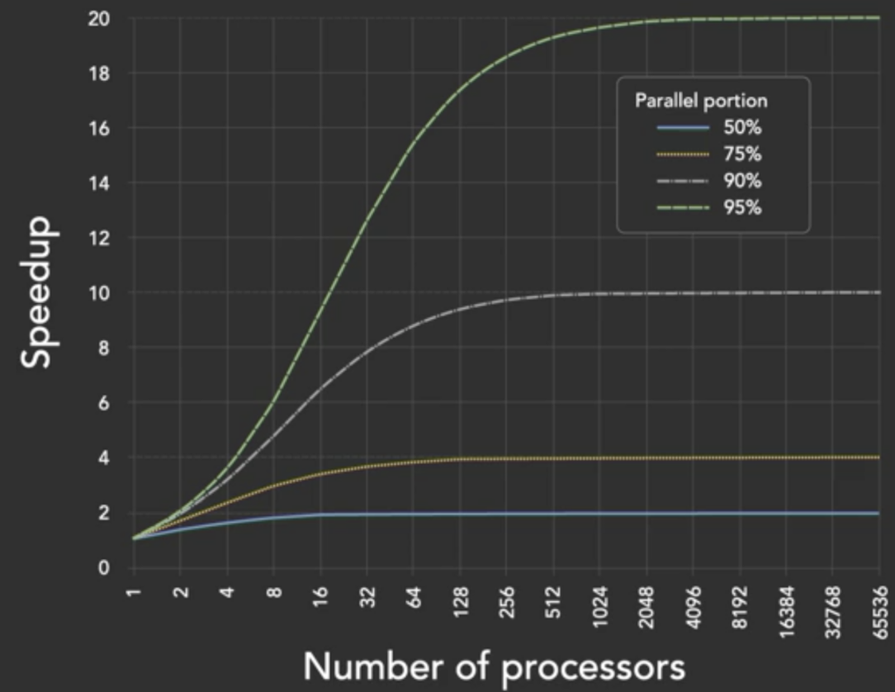
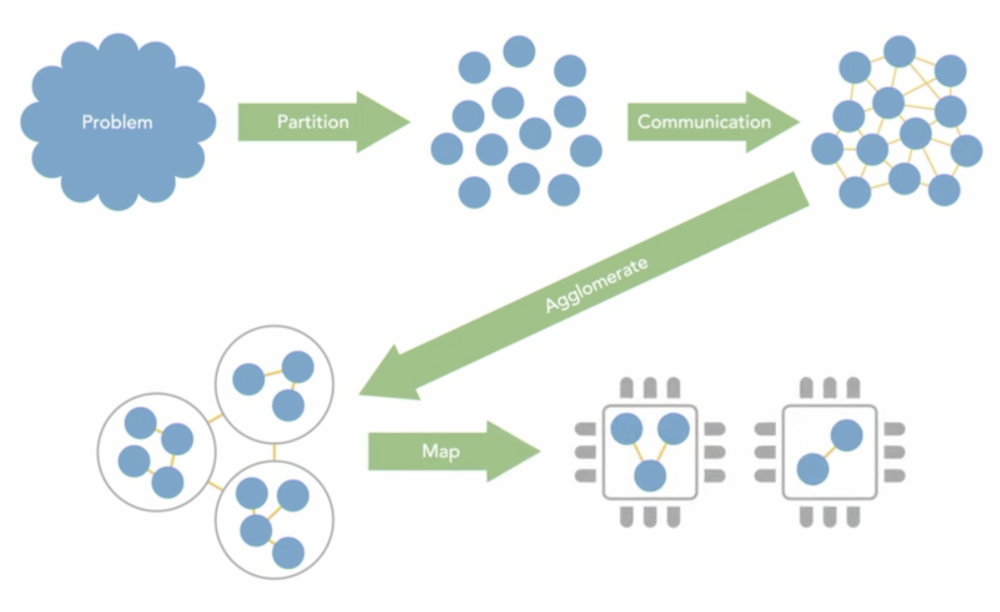
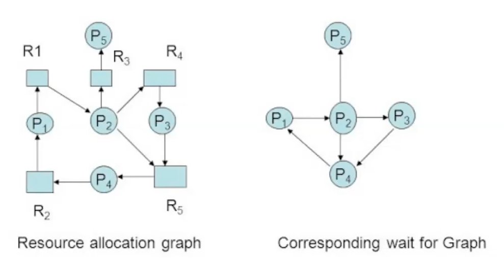
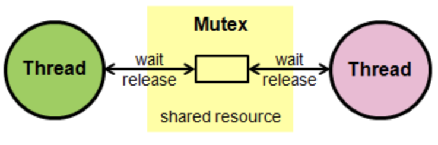
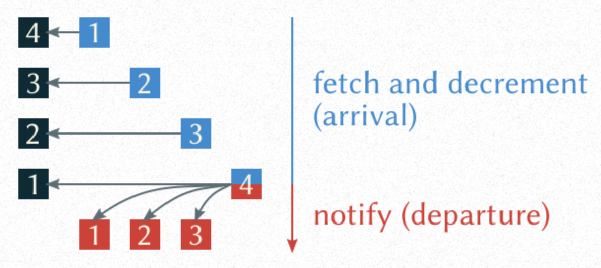
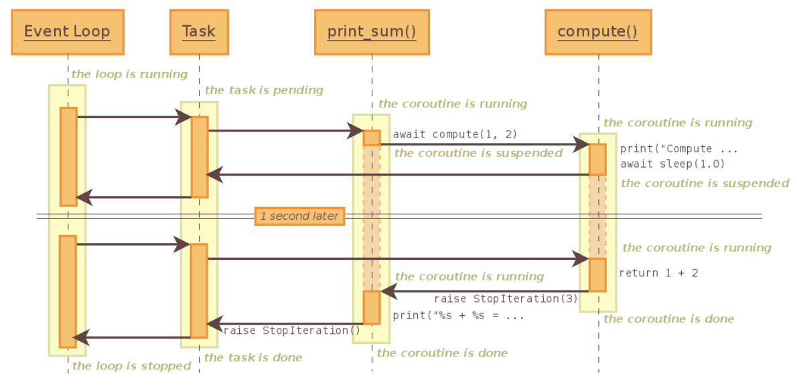
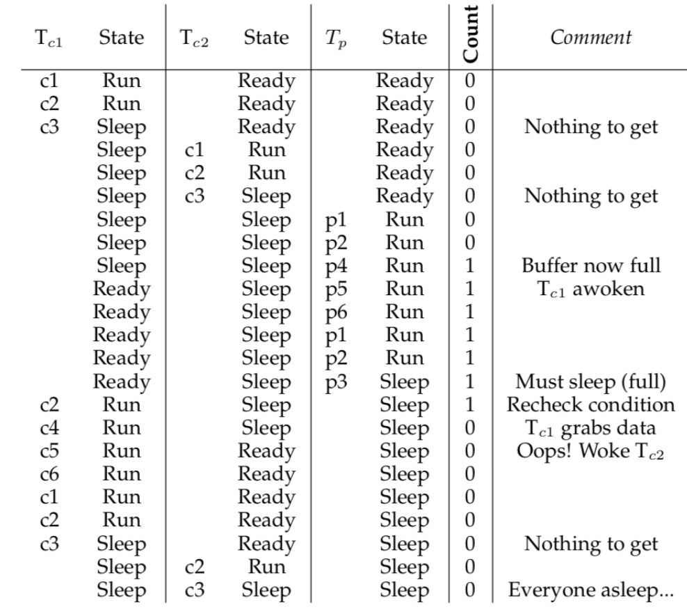
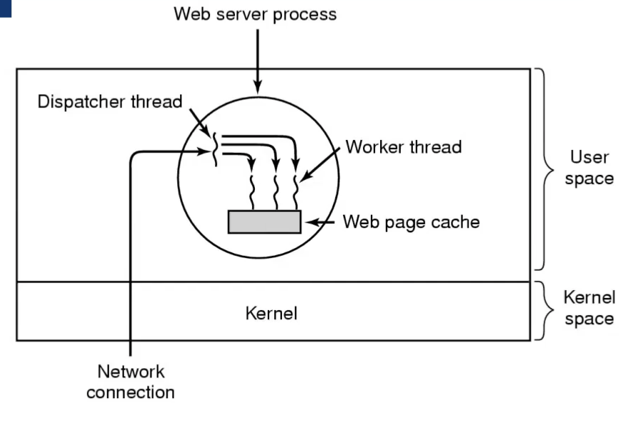
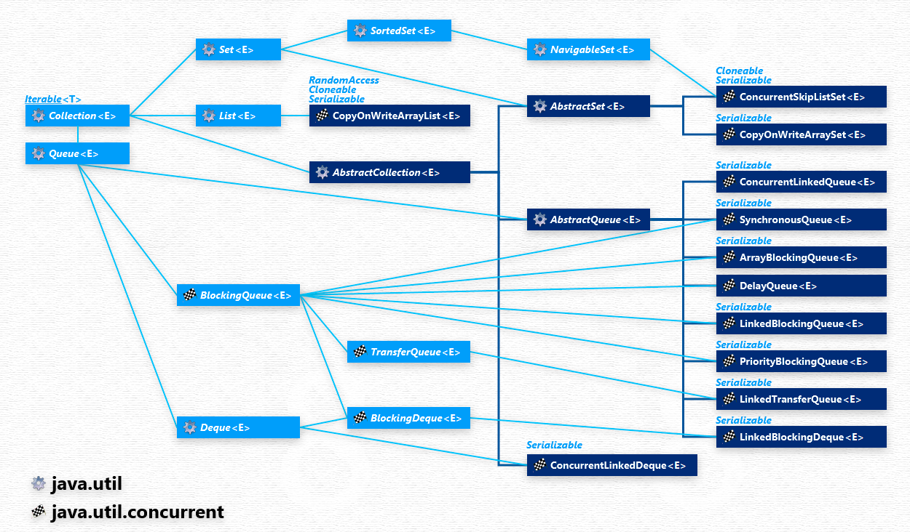
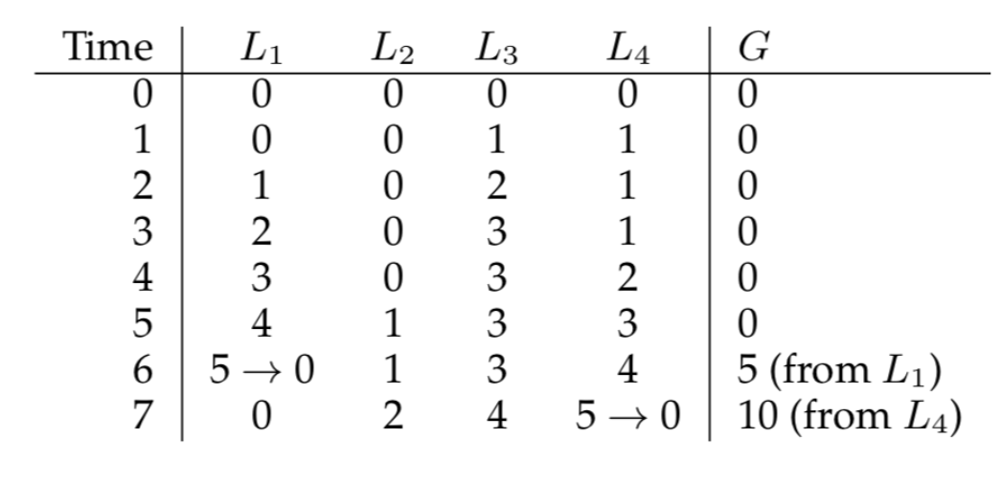

# Concurrency

* Ability of an algorithm or program to be broken into different parts that can be executed out of order
* Simultaneous execution doing multiple things at once
* Concurrence is a program structure dealing with multiple things at once

> Terms

* IPC (Inter-Process Communication)
  * Mutual Exclusion & Coordination
  * Synchronization

* Race Condition: order in which two threads execute their respective operations will change the output
  * Mutex, Barrier

* Starvation: a process/thread is perpetually denied necessary resources to process its work
  * [ex] SJF, Priority based
* synchronization primitives: mechanisms provided by a platform (OS) for supporting thread / process synchronization
* Critical section: Only one thread at a time can execute (locks, semaphores, monitors, messages)
  * no other process must execute within the critical section while a process is in it
  * progress: if multiple processes are trying to get into critical section, entry cannot be postponed indefinitely
  * boundted wait: aprocess requesting entry to CS should only have to wait for bounded number of other processes
  * no assumption: no assumption may be made about speeds or # cpus

* Liveness: properties that require a system to make progress
  * members may have to take turns in critical sections

* Spinning (Busy waiting)
  * process repeatedly checks if a condition is true, such as whether keyboard input or a lock is available

* Strong scaling: Variable number of processors with fixed total problem size
  * Finish same work in less time

* Weak scaling: Variable number of processors with fixed problem size per processor
  * finish more work in the same time

## Concurrent Metric

* Amdahls’s Law
  

* Bandwidth: Amount to data communication per seconds (GB/s)
* Critical path: Sequence of project network activities which add up to the longest overall duration
* Efficiency: efficiency = speedup / # processors
  * How well additional resources are utilized
* granularity: computation / communication
* latency: time / task
* mapping: Only for distributed system → not Single-core processors / automated task scheduling
* overhead: Compute time / resources spent on communication
* speedup: sequential execution time / parallel execution time with N workersk
  * $$ 1 / (1 - P  + P/S) $$
  * P (Portion of program that's parallelizable)
  * S (Speedup of the parallelized portion)
* span: length of the longest series of operations (critical path) to be performed sequentially due to dependencies
* throughput: tasks / time

### Concurrent Design



* Partitioning
  * Domain decomposition: Block decomposition, Cyclic decomposition
  * Functional decomposition: Task parallelism, processes are assigned pieces of code, each works on same data
    assigned to exactly one process

* Communication
  * Point to point communication: sender → receiver
  * collective communication: broadcast, scalability
  * Synchronous blocking communication: tasks wait until entire communication is complete can't do other work while in progress
  * Asynchronous non blocking communication: tasks do not wait for communication to complete

* Agglomeration

* Fine-grained parallelism, Large number of small tasks
  * [+] good distribution of workload (load balancing)
  * [-] low computation to communication ratio

* Coarse-grained parallelism: Small number of large tasks
  * [+] High computation-to-communication ratio
  * [-] Inefficient load balancing

### Deadlock

* processes / threads are unable to continue executing
  * Prioritize locks to acquire in same relative order

* Nessary and sufficient condition
  1. Mutual Exclusion : exclusive control of the resources they require
  1. Hold and Wait : hold resources already allocated to them while waiting for additional resources
  1. No preemption : resources cannot be removed from the processes holding them until used to completion
  1. Circular wait : circular chain of processes exists where each holds 1+ resources requested by next process in chain

* Ostrich algorithm: Don't do anything simply restart the system
* Bankers algorithm: Use avoidance
* RAG (resource allocation graph): explained to us what is the state of the system in terms of processes and resources
  

> Prevention

* Havender's Algorithm
  1. Avoid assigning a resource when it's not necessary
  1. Force each process to request all request at once
  1. If a process holding some reusable resources deny futher request
  1. All resources are numbered, process must request resources in numerical order (no back-edge in tree)

* Two-Phase locking
  1. process tries to lock all records it needs, one at a time, if needed record found locked, start over
  1. performing updates, releasing locks

> By ordering all resources and forcing all requests to follow the ordering

* There cannot be circular wait

### Event driven

* general-purpose scheduler that works well in all cases for all workloads

* [-] multiple CPUs: usual synchronization problems arise again
* [-] Code management: exact semantics of various routines change
* [-] Hard to integrate with a network I/O




> Methods

* struct aiocb()
  * int aio_fildes: File descriptor
  * off_t aio_offset: File offset
  * volatile void *aio_buf: Location of buffer
  * size_t aio_nbytes: Length of transfer

* int select(): Select events from event queue
  * int nfds
  * fd_set *restrict readfds,
  * fd_set *restrict writefds,
  * fd_set *restrict errorfds,
  * struct timeval *restrict timeout
* int poll()

```cpp
#include <stdio.h>
#include <stdlib.h>
#include <sys/time.h>
#include <sys/types.h>
#include <unistd.h>

int main(void) {
// open and set up a bunch of sockets (not shown)
// main loop
while (1) {
  // initialize the fd_set to all zero fd_set readFDs;
  fd_set readFDs;
  FD_ZERO(&readFDs);

  // now set the bits for the descriptors
  // this server is interested in
  // (for simplicity, all of them from min to max)
  int fd;
  for (fd = minFD; fd < maxFD; fd++)
    FD_SET(fd, &readFDs);

  // do the select
  int rc = select(maxFD+1, &readFDs, NULL, NULL, NULL);

  // check which actually have data using FD_ISSET()
  int fd;
  for (fd = minFD; fd < maxFD; fd++)
    if (FD_ISSET(fd, &readFDs))
      processFD(fd);
  }
}
```




## Primitives

### Atomic




```cpp
#include <atomic>
#include <iostream>
#include <thread>

using namespace std;

void count_n_million() {
  atomic<int> counts(0);
  thread threads[3];

  for (int i = 0; i < 3; i++) {
    threads[i] = thread([&]() {
      for (int i = 0; i < 1000000; i++) counts += 1;
    });
  }
  for (int i = 0; i < 3; i++) threads[i].join();

  cout << "total counts \t" << counts.load() << "\n\n";
}
int main() { count_n_million(); }
```




### Lock



* Aka Mutex / Mutual Exclusion
* Critical Section accesses shared variables, must be executed as an atomic action → ASAP
* Atomic operations execute as a single action, relative to other threads
* Can only be acquired/released by the same thread
* can be released by different thread than was used to acquire it
  * Releasing a lock before lock will cause problem

* Abandoned lock: Unexpectedly exit after acquiring thread
  * Put codes try / finally or with

* Livelock: many processes continuously change states in response to changes in other process without any work
  * Use Resource Monitor to investigate the program's CPU usage to determine whether it’s a livelock or deadlock

* Reentrant: can be locked multiple times by the same thread: needs to be released the same number of times
  * must be unlocked the same amount of times needed for recursive section
  * RLock must be released by the same thread that acquired it → should be used for nested lock

* Try: Non-blocking lock/acquire methods for a mutex
  * If the mutex is available, lock it and return True
  * if the mutex is unavailable, immediately return False

* Peterson algorithm: uses two variables, flag and turn

```cpp
/* Thread 1 */
try1 = true;
turn = 2;
while (try2 && turn != 1);    // other haven't started && tie breaker
/* critical section */
try1 = false;

/* Thread 2 */
try2 = true;
turn = 2;
while (try1 && turn != 1);
/* critical section */
try2 = false;
```

> Methods

* acquire() / wait(): before entering the critical secion
* releaese(): after leaving a ciritical secion




```cpp
#include <iostream>
#include <mutex>
#include <queue>
#include <thread>
using namespace std;

// 1. Lock implementation using test-and-set
struct lock { int held = 0; }
void acquire(lock){
  /* while (lock->held); two threads may acquire (lock is shared variable) */
  while (test-and-set(&lock->held));  // make test-and-set atomic instruction, cpu spin -> semaphore
}
void relase(lock) {
  lock->held = 0;
}

// 2. Lock implementation using swap
typedef struct {
  int held = 0;
} Lock;

void Acquire(Lock l) {
  int tmp = 1;
  while (tmp) {
    swap(&tmp, &(l->held))
  };
}

// 3. shared counter
struct Counter {
  int value;
  Counter() : value(0){}
  void increment(){
    // 1st Method
    lock_guard<mutex> guard(mu);
    ++value;

    // 2nd Method : bad when exception is thrown between
    mutex.lock();
    ++value;
    mutex.unlock();
  }
};
int main(){
  Counter counter;

  vector<thread> threads;
  for(int i = 0; i < 5; ++i){
    threads.push_back(thread([&counter](){
      for(int i = 0; i < 100; ++i){ counter.increment(); }
    }));
  }
  for(auto& thread : threads) thread.join();
  cout << counter.value << endl;
  return 0;
}

// 4. count three million
void count_n_million(bool with_lock) {
  mutex count_lock;
  once_flag flag;
  int counts = 0;
  thread threads[3];

  for (int i = 0; i < 3; i++) {
    threads[i] = thread([&]() {
      call_once(flag, []() { cout << "Starting count \n"; });
      if (with_lock) count_lock.lock();
      for (int i = 0; i < 1000000; i++) counts += 1;

      if (with_lock) count_lock.unlock();
    });
  }
  for (int i = 0; i < 3; i++) threads[i].join();

  cout << "total counts \t" << counts << "\n\n";
}

// 5. count for one second
void count_sec() {
  mutex cout_lock;
  bool running = true;

  auto yell = [&](const char *name) {
    unsigned int count = 0;
    cout_lock.lock();
    cout << "yell thread \t" << this_thread::get_id() << "\n";
    cout_lock.unlock();
    while (running) {
      count++;
    }
    cout_lock.lock();
    cout << "Total Counting \t" << count << "\n";
    cout_lock.unlock();
  };

  auto counter = [&]() {
    cout_lock.lock();
    cout << "counter thread \t" << this_thread::get_id() << "\n";
    cout_lock.unlock();
    this_thread::sleep_for(chrono::seconds(1));
    running = false;
  };
  thread watch(counter);
  thread person(yell, "sean");
  watch.detach();
  person.join();
  cout << endl;
}
```




> synchronized

* wait if the object is locked anywhere by another thread
* JVM automatically assigns a lock with each objects -> unless defined as static
* synchronized methods
  * impossible for two invocations of synchronized methods on the same object to interleave
  * when exits, establish a happens-before relationship with subsequent invocation of a synchronized method for same object
  * guarantees that changes to the state of the object are visible to all threads.

```java
// 1. synchronized methods
class Counter {
  int count;
  public synchronized void increment() { count++; }
  public synchronized void decrement() { count--; }
}

public class SyncDemo {
  public static void main(String[] args) {
    Counter c = new Counter();
    Thread t1 = new Thread(new Runnable() {
      public void run() { for (int i = 0; i <= 1000; i++) { c.increment;()} }}
    );
    Thread t2 = new Thread(new Runnable() {
      public void run() { for (int i = 0; i <= 1000; i++) { c.increment;()} }}
    );
    t1.start();
    t1.join();  // wait for complete the job
    t2.start();
    t2.join();  // wait for complete the job

    System.out.println("Count" + c.count);
  }
}

// 2. syncrhnoized
synchronized(this) {  // or put custom Object lock1
  lastname = name;
}
```




> threading

* Lock: factory function which returns instance of efficient version of the concrete Lock class that is supported by platform
  * acquire(blocking=True, timeout=-1)
  * release(): Can be called from any thread, not only thread acquired the lock
  * locked(): Return true if the lock is acquired

```py
# 1. Regular Lock
pencil = threading.Lock()
items_on_notepad = 0

def shopper():
  global items_on_notepad
  name = threading.current_thread().getName()
  items_to_add = 0
  while items_on_notepad <= 20:
    if items_to_add and pencil.acquire(blocking=False): # if blocking is True one write everytime
      print(f"{name} write {items_to_add}, so total become {items_on_notepad}")
      items_on_notepad += items_to_add
      items_to_add = 0
      time.sleep(0.3)
      pencil.release()
    else:
      time.sleep(0.1)
      items_to_add += 1

if __name__ == '__main__':
  sean = threading.Thread(target=shopper, name='sean')
  tom = threading.Thread(target=shopper, name='tom')
  start_time = time.perf_counter()
  sean.start()
  tom.start()
  sean.join()
  tom.join()
  print(f'Elapsed time: {time.perf_counter() - start_time} seconds')
  """
  sean write 1, so total become 0
  tom write 4, so total become 1
  sean write 4, so total become 5
  tom write 4, so total become 9
  sean write 4, so total become 13
  tom write 4, so total become 17
  Elapsed time: 2.104485642630607 seconds
  """

# 2. Reentrant Lock for Nested Thread
total = 0
lock = threading.RLock()  # RLock should be used for nested lock

def count(is_lock):
  global total
  # acquire and release
  with lock if is_lock else nullcontext():
    with lock if is_lock else nullcontext():
      for _ in range(1000000):
        total += 1

if __name__ == '__main__':
  td1 = threading.Thread(target=count, args=(False,))
  td2 = threading.Thread(target=count, args=(False,))

  td1.start()
  td2.start()
  td1.join()
  td2.join()
  print(total)  # 1362632 -> setting is_lock = True prints 2000000

# 3. Thread safe Factory
class ThreadSessionFactory:
  def __init__(self, exit_stack):
    self._lock = threading.Lock()
    self._thread_local = threading.local()
    self._exit_stack = exit_stack

  def __call__(self):
    try:
      session = self._thread_local.session
    except AttributeError:
      with self._lock: # ExitStack might not be thread-safe either
        session = self._exit_stack.enter_context(requests.Session())
      self._thread_local.session = session
    return session
```






### Barrier



* order in which the OS schedules threads to execute is non-deterministic
* Used to control the relative order in which threads execute certain operations
* Threads execute a code before the barrier should call the wait method after executing the code




```java
// 1. using Mesa semantics
Monitor Barrier {
  int called = 0;
  Condition barrier;

  void Done (int needed) {
    called++;
    if (called == needed) {
      called = 0;
      barrier.wakeAll();
    } else {
      barrier.sleep();
    }
  }
}

// 2. using Lock and Condition
class Barrier {
  int called = 0;
  Lock lock;
  Condition barrier;

  Barrier () {
    lock = new Lock();
    barrier = new Condition(lock);
  }

  void Done (int needed) {
    lock.acquire();
    called++;
    if (called == needed) {
      called = 0;
      barrier.wakeAll();
    } else {
      barrier.sleep();
    }
    lock.release();
  }
}
```




* Barrier(parties, action=None, timeout=None)
  * broken
  * parties: n_threads required to pass the barrier
  * n_waiting: n_threads currently waiting in the barrier
  * abort(): Put the barrier into a broken state
  * reset(): Return the barrier to the default
  * wait(timeout=None): Pass the barrier




### Coroutine

* generalize subroutines for non-preemptive multitasking by allowing execution to be suspended and resumed
* [ex] cooperative tasks, exceptions, event loops, iterators, infinite lists, pipes

> Term

* Generator: sometimes referred to as “semicoroutines”, more limited form of coroutine that may only yield to its caller




* C++20 introduced standardized coroutines as stackless functions that can be suspended during execution and resumed
* suspended state of a coroutine is stored on the heap




* [+] error handling: exceptions are quite prevelant even compared to the browser with multiple callbacks
  * undefined side-effects, or forget callback all-together and fail to properly handle or report the exception
  * perhaps you forgot to listen for error event, in which case it becomes uncaught exception and brings down process

```js
// 1. Single callback
function addFood(food, callback) {
  setTimeout(() => {
    foods.push(food);
    resolve();
  }, 1000);
}
addFood("hotdog", getFoods);

// 2. Multiple callback
const promise1 = Promise.resolve(3);
const promise2 = 42;
const promise3 = new Promise((resolve, reject) => {
  setTimeout(resolve, 100, 'foo');
});

Promise.all([promise1, promise2, promise3]).then((values) => {
  console.log(values);
});
```




> Term

* Coroutine: more generalized form of subroutines which can be entered, exited, and resumed at different points
* Coroutine function: function that returns Coroutine object which can be defined with async def with await, async for

* asyncio
  * Future: used to bridge low-level callback-based code with high-level async/await code
    * add_done_callback(callback, *, context=None): Add a callback to be run when the Future is done
    * cancel(msg=None): Cancel the Future and schedule callbacks
    * result(): Return the result of the Future
    * done(): Return True if the Future is done
    * get_loop(): Return the event loop the Future object is bound to
  * async await: good for IO bound application

```py
import aiohttp
import asyncio
import sys
import json
import time
import fire
from random import randint

# 1. Async crawling
async def worker(n, session):
  url = f"https://qrng.anu.edu.au/API/jsonI.php?length={n}&type=uint16"
  response = await session.request(method='GET', url=url)
  value = await response.text()
  value = json.loads(value)
  return sum(value['data'])


async def main():
  async with aiohttp.ClientSession() as session:
    sums = await asyncio.gather(*(worker(5, session) for _ in range(20)))
    print(sums)

if __name__ == "__main__":
  start = time.perf_counter()
  asyncio.run(main())
  print(f'Took {time.perf_counter() - start}s')

# 2. async asleep
async def db_query(delay):
  await asyncio.sleep(delay)
  return randint(1, 10)


async def main():
  task1 = asyncio.create_task(db_query(1))
  task2 = asyncio.create_task(db_query(2))

  start = time.perf_counter()
  await task1
  await task2
  print(f"{time.perf_counter() - start:.2f} s")

  start = time.perf_counter()
  r = await asyncio.gather(*(db_query(2) for _ in range(1000)))
  print(f"{time.perf_counter() - start:.2f} s") # takes roughly 2 seconds
  print(f"finished at {time.strftime('%X')}")

if __name__ == "__main__":
  asyncio.run(main())

# 3. async for
async def x(i):
  print(f"start {i}")
  await asyncio.sleep(1)
  print(f"end {i}")
  return i

# run x(0)..x(10) concurrently and process results as they arrive
for f in asyncio.as_completed([x(i) for i in range(10)]):
  result = await f
  # ... do something with the result ...
```






### Promise

* Placeholder for a result that will be available later
* Mechanism to access the result of an asynchronous operation

> Term

* future: a read-only container for a result that doesn't yet exist
  * result will be set by `someone else` by the result of an asynchronous computation
* promise: can be written (normally only once)
  * result can be set by `you` (anyone) anytime because it has a public setter method




```cpp
#include <condition_variable>
#include <functional>
#include <future>
#include <iostream>
#include <mutex>
#include <queue>
#include <vector>

using namespace std;

// 1. Prime find
bool is_prime(int n) {
  for (int i = 2; i < n; i++)
    if (n % i == 0) return true;
  return false;
}

void prime() {
  promise<void> p;
  future<bool> data = async(is_prime, 444444443);
  while (data.wait_for(chrono::milliseconds(100)) == future_status::timeout) cout << '>' << flush;
  cout << (data.get() ? "prime" : "Not prime") << "\n";
}

// 2. Worker
auto work = [](promise<string> *p) { cout << "worked" << endl; };
promise<string> p;
future<string> data = p.get_future();
thread t(work, &p);
data.wait();

cout << ": " << data.get() << endl;

t.join();

// 3. Multiple runner
void runner(shared_future<void> *whistle) {
  whistle->get();
  cerr << "start!\n";
}

void main() {
  promise<void> p;
  shared_future<void> whistle = p.get_future();

  thread t1(runner, &whistle);
  thread t2(runner, &whistle);
  thread t3(runner, &whistle);
  thread t4(runner, &whistle);

  cerr << "ready...";
  this_thread::sleep_for(chrono::seconds(1));
  cerr << "go!\n";

  p.set_value();

  t1.join();
  t2.join();
  t3.join();
  t4.join();
}
```




```js
// 1. Promise
function addFood(food) {
  return new Promise((resolve, reject) => {
    setTimeout(() => {
      foods.push(food);
      resolve();
    }, 1000);
  });
}

addFood("hotdog").then(getFoods);

Promise.all([promise1, promise2]).then(values=>console.log(values)) // multiple promise

// 2. Timeout
const foods = ["pizza"];
function getFoods() {
  setTimeout(() => {
    foods.forEach(food => { document.body.innerHTML += `<li>${food}</li>`; });
  }, 1000);
}

function addFood(food) {
  setTimeout(() => {
    foods.push(food);
  }, 1000);
}

addFood("hotdog");
getFoods();                // doesn’t render hotdog

// 3. Await
async function init() {
  await addFood("hotdog");
  getFoods();
}
init();
```




```py
```






### Semaphore

* Dijkstra, one of the inventors used Probeer (try) and Verhoog (increment)
* Can be used by multiple threads at the same time
* Includes a counter to track availability
* Can be acquired/released by different threads
* Types
  * binary: mutex, better then lock when critical section is long (building-block of counting)
  * counting: represents a resources with many units available

> Problems

1. Starvation : writer do not get a chance in reader_writer problem only using mutex
    * It's because reader comes later than writer cut in line -> Use same line
2. Deadlock : nested lock producer consumer problem

> Methods

* P / try(): if counter is positive, decrement counter, otherwise wait until available
* V / increment(): increment the counter's value and signal another thread waiting to acquire the semaphore




```cpp
// 1. Semaphore
P (Semaphore s) {
  if (s == 0) blocked in a queue; // wait until s > 0
  s -= 1;
}

V (Semaphore s) {
  s += 1
  if (someone is waiting in a queue) wake one from the queue;
}

Init(Semaphore s, int v) {
  s = v;
}

// 2. Binary semaphore
struct Semaphore { int value, Queue q; } S;
withdraw (account, amount) {
  P(S);
  balance = get_balance(account);
  put_balance(account, balance - amount);
  V(S);
  return balance;
}

// 3. reader writer
int readcount;
Reader {
  // with mutex (also checking readcount)
  readcount++;
  if (readcount == 1) P(w_or_r);

  read();   // it's okay to read

  // with mutex
  readcount--;
  if (readcount == 0) V(w_or_r);
}

Writer {
  P(w_or_r);
  write();
  V(w_or_r);
}

// 4. Producer consumer
Producer {
  while (1) {
    produce_new_resource();
    P(empty);
    P(mutex);
    add_resource_to_empty_buffer();
    V(empty);
    V(full);
  }
}

Consumer {
  while (1) {
    P(full);
    P(mutex);
    remove_resource_from_full_buffer();
    V(mutex);
    V(empty);
    consume_resource;
  }
}
```




* Semaphore(counter=`n`): Track the availability of a limited resource `n` (Not thread-safe)
  * acquire(blocking=True, timeout=None): if counter is positive, decrement, otherwise wait
  * release(): increment counter and signal waiting thread

```py
sem = asyncio.Semaphore(10)          # context
async with sem:
""" await sem.acquire()  Equivalent to above """
try:
  """ work with shared resource """
finally:
  sem.release()
```






### Reader Writer Lock

* Shared read - multiple threads at once
  * Exclusive write - only one thread at a time
  * When many threads need to read a shared variable, but a few threads need to modify its value

> Problem

1. Writer Should have higher priority than reader




```cpp
// 1. reader writer
pthread_rwlock_t rwlock;

void init() {
  pthread_rwlock_init(&rwlock, NULL);
}
void cleanup() {
  pthread_rwlock_destroy(&rwlock);
}

void* writer(void* arg) {
  pthread_rwlock_wrlock(&rwlock);
  write_data(arg);
  pthread_rwlock_unlock(&rwlock);
}

void* reader(void* read) {
  pthread_rwlock_rdlock(&rwlock);
  read_data(arg);
  pthread_rwlock_unlock(&rwlock);
}
```




> readerwriterlock

* RLock
  * RWLockFair: fair priority for readers|writers
  * RWLockRead: readers get priority
  * RWLockWrite: writers get priority

```py
import threading
from readerwriterlock import rwlock

DAYS = ['Sunday', 'Monday', 'Tuesday', 'Wednesday', 'Thursday', 'Friday', 'Saturday']
today = 0
marker = rwlock.RWLockFair()

def calendar_reader(id):
  global today
  read_marker = marker.gen_rlock()
  while today < len(DAYS)-1:
    read_marker.acquire()
    print(f"Reader {id} sees {DAYS[today]}, read count: {read_marker.c_rw_lock.v_read_count}")
    read_marker.release()

def calendar_writer(id):
  global today
  write_marker = marker.gen_wlock()
  while today < len(DAYS) - 1:
    write_marker.acquire()
    today = (today + 1) % 7
    print(f"Writer {id} updated date to {DAYS[today]}")
    write_marker.release()

if __name__ == '__main__':
  for i in range(3):
    threading.Thread(target=calendar_reader, args=(i,)).start()
  for i in range(2):
    threading.Thread(target=calendar_writer, args=(i,)).start()

  """
  Reader0 sees Sunday, read count: 1
  Reader0 sees Sunday, read count: 1
  Reader1 sees Sunday, read count: 2
  Reader0 sees Sunday, read count: 2
  Reader1 sees Sunday, read count: 3
  Reader2 sees Sunday, read count: 3
  Writer 0 updated date to Monday
  Writer 0 updated date to Tuesday
  Writer 0 updated date to Wednesday
  Writer 0 updated date to Thursday
  Reader2 sees Thursday, read count: 1
  Reader0 sees Thursday, read count: 1
  Reader1 sees Thursday, read count: 1
  Writer 1 updated date to Friday
  Writer 1 updated date to Saturday
  Writer 0 updated date to Sunday
  Writer 0 updated date to Monday
  Writer 0 updated date to Tuesday
  Writer 0 updated date to Wednesday
  Writer 0 updated date to Thursday
  Writer 0 updated date to Friday
  Writer 0 updated date to Saturday
  Reader0 sees Saturday, read count: 1
  Reader2 sees Saturday, read count: 2
  Reader1 sees Saturday, read count: 3
  """
```




### Conditional Variable

* aka monitor, Every condition variable has a paired lock
  * Lock before wait / signal -> inifinte sleep problem
* Spin for wating child taks a long time
* Use while around wait

> Types

* Hoare monitors (original): leave less to chance
  * if (empty) wait(condition);
  * signal(`condition`) immediately switches from the caller to a waiting thread
  * condition that the waiter was anticipating is guaranteed to hold when waiter executes
  * Signaler must restore monitor invariants before signaling
* Mesa monitors (Mesa): easy to use more efficient
  * while (counter == 0) wait(condition);
  * signal(`condition`) places a waiter on the ready queue, but signaler continues inside monitor
  * condition is not necessarily true when waiter runs again

> Methods

* wait(`condition`, `lock`): release monitor lock for C/V to be signaled
  * go to sleep and enter waiting queue → reacquire lock when woken up
* signal / notify(`condition`): Wake one thread from condition variable queue → only one thread doesn’t matter which one
  * if no thread in the queue, nothing happen
  * usually safe to wake up threads waiting on CVs at any time
* broadcast / notifyAll(`condition`): Wake up all thread from condition variable queue
* Programming language consturct that controls access to shared data, guarantees mutual exclusion
  * @synchronize in java
* consists of a mutx and conditional variable




> condition_variable

```cpp
#include <condition_variable>
#include <iostream>
#include <mutex>
#include <queue>
#include <thread>

using namespace std;

// 1. conditional variable
int is_done;
mutex_t done_lock;
cond_t done_cond;

// Thread A
mutex_lock(&done_lock);
is_done = 1;
cond_signal(&done_cond);
mutex_unlock(&done_lock);

// Thread B
mutex_lock(&done_lock);
if (!is_done)
  cond_wait(&done_cond, &done_lock);
mutex_unlock(&done_lock);

// 2. Eat in order
void eat_in_order() {
  int soup_servings = 5;
  mutex cooker_lid;
  condition_variable done;
  auto eat = [&](int id) {
    int put_lid_back = 0;
    while (soup_servings > 0) {
      unique_lock<mutex> lid(cooker_lid);
      while (id != soup_servings && (soup_servings > 0)) {
        put_lid_back++;
        done.wait(lid);
      }
      if (soup_servings > 0) {
        soup_servings--;
        lid.unlock();
        done.notify_all();
      }
    }
    printf("Person %d put lid %u times \n", id, put_lid_back);
  };
  thread hungry_threads[5];
  for (int i = 0; i < 5; i++) hungry_threads[i] = thread(eat, i + 1);

  for (auto &ht : hungry_threads) ht.join();
  cout << endl;
}

// 3. Producer Consumer
class ServingLine {
 public:
  ServingLine(){};
  void serve_soup(int i) {
    unique_lock<mutex> ladle_lock(ladle);
    soup_queue.push(i);
    ladle_lock.unlock();
    soup_served.notify_all();
  }

  int take_soup() {
    unique_lock<mutex> ladle_lock(ladle);
    while (soup_queue.empty())
      soup_served.wait(ladle_lock, [this]() { return stop_all; });
    int bowl = soup_queue.size() ? soup_queue.front() : -1;
    soup_queue.pop();
    return bowl;
  }

 private:
  bool stop_all = false;
  queue<int> soup_queue;
  mutex ladle;
  condition_variable soup_served;
};

void producer_consumer() {
  ServingLine serving_line = ServingLine();
  auto soup_producer = [&]() {
    for (int i = 0; i < 10; i++) serving_line.serve_soup(1);
  };
  auto soup_consumer = [&](string name) {
    int soup_eaten = 0;
    while (true) {
      int bowl = serving_line.take_soup();
      if (bowl == -1) {
        printf("Consumer ate %d soup\n", soup_eaten);
        return;
      } else
        soup_eaten += bowl;
      cout << name << " ate" << soup_eaten << "soup" << endl;
    }
  };
  thread cooker(soup_producer);
  thread student(soup_consumer, "student");
  thread teacher(soup_consumer, "teacher");
  cooker.join();
  student.join();
  teacher.join();
}
```






```java
// 1. Account
Monitor account {
  Condition c;

  void enter_monitor() {
    if (extra_property not true) wait(c);
    // do something
    if (extra_propert true) signal(c);
  }

  double balance;
  double withdraw(double amount) {
    balance -= amount;
    return balance;
  }
}

// 2 - 1. Wrong Correct Bounded buffer
cond_t  empty, fill;
mutex_t mutex;
void *producer(void *arg) {
  int i;
  for(i=0;i<loops;i++){
    Pthread_mutex_lock(&mutex);          // p1
    if (count == 1)                      // p2
      Pthread_cond_wait(&empty, &mutex); // p3
    put(i);
    Pthread_cond_signal(&fill);
    Pthread_mutex_unlock(&mutex);
  }
}

void *consumer(void *arg) {
  int i;
  for (i=0;i<loops;i++){
    Pthread_mutex_lock(&mutex);         // c1
    // if (count == 0)
    while (count == 0) {                // c2
      Pthread_cond_wait(&fill, &mutex); // c3
      int tmp = get();                  // c4
      Pthread_cond_signal(&cond);       // c5
      Pthread_mutex_unlock(&mutex);     // c6
    }
    int tmp = get();
    Pthread_cond_signal(&empty);
    Pthread_mutex_unlock(&mutex);
    printf("%d\n", tmp);
  }
}

// 2 - 2. Correct Bounded buffer
cond_t  empty, fill;
mutex_t mutex;

void *producer(void *arg) {
  int i;
  for(i=0;i<loops;i++){
    Pthread_mutex_lock(&mutex);          // p1
    while (count == 1)
      Pthread_cond_wait(&empty, &mutex); // p3
    put(i);
    Pthread_cond_signal(&fill);
    Pthread_mutex_unlock(&mutex);
  }
}

void *consumer(void *arg) {
  int i;
  for (i=0;i<loops;i++){
    Pthread_mutex_lock(&mutex);
    while (count == 0)
      Pthread_cond_wait(&fill, &mutex);
    int tmp = get();
    Pthread_cond_signal(&empty);
    Pthread_mutex_unlock(&mutex);
    printf("%d\n", tmp);
  }
}

// 3. Monitor readers and writer
Monitor RW {
  int nr = 0, nw = 0;
  Condition canRead, canWrite;

  void startRead() {
    while (nw != 0) do wait(canRead);
    nr++;
  }

  void endRead() {
    nr--;
    if (nr == 0) signal(canWrite);
  }

  void startWrite() {
    while (nr != 0 || nw != 0) do wait(canWrite);
    nw++;
  }

  void endWrite() {
    nw--;
    signal(canWrite);
    signal(canRead);
  }
} // end monitor
```




> Threading.Condition

* Condition(lock=None)
  * acquire(*args)
  * release(): calls the corresponding method on the underlying lock; there is no return value
  * wait(timeout=None)
    * RuntimeError, if the calling thread has not acquired the lock when this method is called
  * wait_for(`predicate`, timeout=None): Wait until a `predicate` evaluates to true ([=] while not predicate(): cv.wait())
  * notify(n=1): wake up one thread waiting on this condition
    * RuntimeError If the calling thread has not acquired the lock when this method is called
  * notify_all()
    * RuntimeError If the calling thread has not acquired the lock when this method is called

```py
# 1. Eath in turn
slowcooker_lid = threading.Lock()
soup_servings = 11
soup_taken = threading.Condition(lock=slowcooker_lid)

def hungry_person(person_id):
  global soup_servings
  while soup_servings > 0:
    with slowcooker_lid:
      while (person_id != (soup_servings % 5)) and (soup_servings > 0):
        print(f'Person {person_id} checked... then put the lid back.')
        soup_taken.wait()
      if soup_servings > 0:
        soup_servings -= 1
        print(f'Person {person_id} took soup!, Servings left: {soup_servings}')
        soup_taken.notify_all()

if __name__ == '__main__':
  for person in range(5):
    threading.Thread(target=hungry_person, args=(person,)).start()
  """
  Person 0 checked... then put the lid back.
  Person 1 took soup!, Servings left: 10
  Person 1 checked... then put the lid back.
  Person 2 checked... then put the lid back.
  Person 0 took soup!, Servings left: 9
  Person 0 checked... then put the lid back.
  Person 1 checked... then put the lid back.
  Person 3 checked... then put the lid back.
  Person 2 checked... then put the lid back.
  Person 4 took soup!, Servings left: 8
  Person 4 checked... then put the lid back.
  Person 0 checked... then put the lid back.
  Person 1 checked... then put the lid back.
  Person 3 took soup!, Servings left: 7
  Person 3 checked... then put the lid back.
  Person 2 took soup!, Servings left: 6
  Person 2 checked... then put the lid back.
  Person 0 checked... then put the lid back.
  Person 1 took soup!, Servings left: 5
  Person 1 checked... then put the lid back.
  Person 3 checked... then put the lid back.
  Person 4 checked... then put the lid back.
  Person 2 checked... then put the lid back.
  Person 0 took soup!, Servings left: 4
  Person 0 checked... then put the lid back.
  Person 1 checked... then put the lid back.
  Person 3 checked... then put the lid back.
  Person 4 took soup!, Servings left: 3
  Person 4 checked... then put the lid back.
  Person 2 checked... then put the lid back.
  Person 0 checked... then put the lid back.
  Person 1 checked... then put the lid back.
  Person 3 took soup!, Servings left: 2
  Person 3 checked... then put the lid back.
  Person 4 checked... then put the lid back.
  Person 2 took soup!, Servings left: 1
  Person 2 checked... then put the lid back.
  Person 1 took soup!, Servings left: 0
  """
```






### Thread Queue

> Term

* Thread pool: a software design pattern for achieving concurrency of execution in a computer program
  




```cpp
template<typename T>
class ThreadsafeQueue {
  std::queue<T> queue_;
  mutable std::mutex mutex_;

  // Moved out of public interface to prevent races between this and pop().
  bool empty() const {
    return queue_.empty();
  }

 public:
  ThreadsafeQueue() = default;
  ThreadsafeQueue(const ThreadsafeQueue<T> &) = delete ;
  ThreadsafeQueue& operator=(const ThreadsafeQueue<T> &) = delete ;

  ThreadsafeQueue(ThreadsafeQueue<T>&& other) {
    std::lock_guard<std::mutex> lock(mutex_);
    queue_ = std::move(other.queue_);
  }

  virtual ~ThreadsafeQueue() { }
  unsigned long size() const {
    std::lock_guard<std::mutex> lock(mutex_);
    return queue_.size();
  }

  std::optional<T> pop() {
    std::lock_guard<std::mutex> lock(mutex_);
    if (queue_.empty()) {
      return {};
    }
    T tmp = queue_.front();
    queue_.pop();
    return tmp;
  }

  void push(const T &item) {
    std::lock_guard<std::mutex> lock(mutex_);
    queue_.push(item);
  }
};
```




* ThreadPoolExecutor: reuse threads to reduce required overhead to create a new thread, useful for IO-bound tasks
  * default ThreadPoolExecutor creates up to five times as many threads as processors in the system
  * shutdown(wait=True): Free up ThreadPoolExecutor resources after pending tasks finish
  * max_workers: Number of workers, ([ex] None: set to maximum thread)

```py
import time
import urllib.request
import multiprocessing as mp
import concurrent.futures

# 1. Download image multithreading
""" Returns: total bytes from downloading all images in image_numbers list """
def seq_download_images(image_numbers):
  total_bytes = 0
  for num in image_numbers:
    total_bytes += _download_image(num)
  return total_bytes

def _download_image(image_number):
  image_number = (abs(image_number) % 50) + 1  # force between 1 and 50
  image_url = 'http://699340.youcanlearnit.net/image{:03d}.jpg'.format(image_number)
  try:
    with urllib.request.urlopen(image_url, timeout=60) as conn:
      return len(conn.read())  # number of bytes in downloaded image
  except Exception as e:
    print(e)

def par_download_images(image_numbers):
  total_bytes = 0
  with concurrent.futures.ThreadPoolExecutor() as pool:
    futures = [pool.submit(_download_image, num) for num in image_numbers]
    for f in concurrent.futures.as_completed(futures):
      total_bytes += f.result()
  return total_bytes

if __name__ == '__main__':
  IMAGE_NUMBERS = list(range(1, 50))

  print('Evaluating Sequential Implementation...')
  sequential_result = seq_download_images(IMAGE_NUMBERS)
  sequential_time = 0
  start = time.perf_counter()
  seq_download_images(IMAGE_NUMBERS)
  sequential_time += time.perf_counter() - start

  print('Evaluating Parallel Implementation...')
  parallel_result = par_download_images(IMAGE_NUMBERS)
  parallel_time = 0
  start = time.perf_counter()
  par_download_images(IMAGE_NUMBERS)
  parallel_time += time.perf_counter() - start

  if sequential_result != parallel_result:
    raise Exception('sequential_result and parallel_result do not match.')
  print(f'Average Sequential Time: {sequential_time * 1000:.2f} ms')
  print(f'Average Parallel Time: {parallel_time * 1000:.2f} ms')
  print(f'Speedup: {sequential_time / parallel_time:.2f}')
  print(f'Efficiency: {100 * (sequential_time / parallel_time) / mp.cpu_count():.2f}%')
```






## Concurrent Data structure









### Concurrent Map

* Simple lock (as monitor) isn't scalable
* global Coutner that synchronizes periodically with local Counter






```cpp
// 1. Approximate counting
typedef struct __counter_t {
  int global;                     // global count
  pthread_mutex_t glock;          // global lock
  int local[NUMCPUS];             // per-CPU count
  pthread_mutex_t llock[NUMCPUS]; // ... and locks
  int threshold;                  // update frequency
} counter_t;

// init: record threshold, init locks, init values
// of all local counts and global count
void init(counter_t *c, int threshold) {
  c->threshold = threshold;
  c->global = 0;
  pthread_mutex_init(&c->glock, NULL);
  int i;
  for (i = 0;i < NUMCPUS; i++){
    c->local[i] = 0;
    pthread_mutex_init(&c->llock[i], NULL);
 }
}

// update: usually, just grab local lock and update
// local amount; once local count has risen ’threshold’,
// grab global lock and transfer local values to it
void update(counter_t *c, int threadID, int amt) {
  int cpu = threadID % NUMCPUS;
  pthread_mutex_lock(&c->llock[cpu]);
  c->local[cpu] += amt;
  if (c->local[cpu] >= c->threshold) {
    // transfer to global (assumes amt>0)
    pthread_mutex_lock(&c->glock);
    c->global += c->local[cpu];
    pthread_mutex_unlock(&c->glock);
    c->local[cpu] = 0;
  }
  pthread_mutex_unlock(&c->llock[cpu]);
}

// get: just return global amount (approximate)
int  get(counter_t *c) {
  pthread_mutex_lock(&c->glock);
  int val = c->global;
  pthread_mutex_unlock(&c->glock);
  return val; // only approximate!
}
```




### Concurrent List

* Node based lock would scale up




```cpp
typedef struct __node_t {
  int value;
  struct __node_t *next;
} node_t;

typedef struct __queue_t {
  node_t *head;
  node_t *tail;
  pthread_mutex_t head_lock, tail_lock;
}

void Queue_Init(queue_t *q) {
  node_t *tmp = malloc(sizeof(node_t));
  tmp->next = NULL;
  q->head = q->tail = tmp;
  pthread_mutex_init(&q->head_lock, NULL);
  pthread_mutex_init(&q->tail_lock, NULL);
}

void Queue_Enqueue(queue_t *q, int value) {
  node_t *tmp = malloc(sizeof(node_t));
  assert(tmp != NULL);
  tmp->value = value;
  tmp->next  = NULL;

  pthread_mutex_lock(&q->tail_lock);
  q->tail->next = tmp;
  q->tail = tmp;
  pthread_mutex_unlock(&q->tail_lock);
}

int Queue_Dequeue(queue_t *q, int *value) {
  pthread_mutex_lock(&q->head_lock);
  node_t *tmp = q->head;
  node_t *new_head = tmp->next;
  if (new_head == NULL) {
    pthread_mutex_unlock(&q->head_lock);
    return -1; // queue was empty
  }
  *value = new_head->value;
  q->head = new_head;
  pthread_mutex_unlock(&q->head_lock);
  free(tmp);
  return 0;
}
```




> queue

* thread safe

* Queue(maxsize=0)
* empty()
* get(block=True, timeout=None)
* put(item, block=True, timeout=None)
* qsize()

```py
from queue import PriorityQueue

# 1. Priority CRUD
pq = PriorityQueue(maxsize=3)
pq.put((8, 'top'))
pq.put((1, 'sean'))
pq.put((3, 'top'))
while pq.size():
  print(pq.get())
```




## Mutithreading




```cpp
// 1. Mergesort g++ --std=c++11 merge_sort.cpp && ./a.out
#include <algorithm>
#include <chrono>
#include <cstdlib>
#include <thread>
#include <vector>

using namespace std;
void merge(int *array, int l, int m, int r) {
  int n_left = m - l + 1, n_right = r - m;
  int lefts[n_left], rights[n_right];

  copy(&array[l], &array[m + 1], lefts);
  copy(&array[m + 1], &array[r + 1], rights);

  int left_i = 0, right_i = 0, insert_i = l;

  while ((left_i < n_left) || (right_i < n_right)) {
    if (left_i < n_left && (right_i >= n_right || lefts[left_i] <= rights[right_i])) {
      array[insert_i] = lefts[left_i];
      left_i++;
    } else {
      array[insert_i] = rights[right_i];
      right_i++;
    }
    insert_i++;
  }
}
void sequential_merge_sort(int *array, int l, int r) {
  if (l < r) {
    int m = (l + r) / 2;
    sequential_merge_sort(array, l, m);
    sequential_merge_sort(array, m + 1, r);
    merge(array, l, m, r);
  }
}

void parallel_merge_sort(int *array, int l, int r, int depth = 0) {
  if (depth >= log(thread::hardware_concurrency()))
    sequential_merge_sort(array, l, r);
  else {
    int m = (l + r) / 2;
    thread left_thread = thread(parallel_merge_sort, array, l, m, depth + 1);
    parallel_merge_sort(array, m + 1, r, depth + 1);
    left_thread.join();
    merge(array, l, m, r);
  }
}

int main() {
  const int N = 10000;
  int original_array[N], sequential_result[N], parallel_result[N];
  for (int i = 0; i < N; i++) original_array[i] = rand();

  printf("Evaluating Sequential Implementation...\n");
  chrono::duration<double> sequential_ns(0);
  for (int eval = 0; eval < 10; eval++) {
    copy(&original_array[0], &original_array[N - 1], sequential_result);
    auto start_time = chrono::high_resolution_clock::now();
    sequential_merge_sort(sequential_result, 0, N - 1);
    sequential_ns += (chrono::high_resolution_clock::now() - start_time) / 10.0;
  }

  printf("Evaluating Parallel Implementation...\n");
  chrono::duration<double> parallel_ns(0);
  for (int eval = 0; eval < 10; eval++) {
    copy(&original_array[0], &original_array[N - 1], parallel_result);
    auto start_time = chrono::high_resolution_clock::now();
    parallel_merge_sort(parallel_result, 0, N - 1);
    parallel_ns += (chrono::high_resolution_clock::now() - start_time) / 10.0;
  }

  printf("Average Sequential Time: %.2f ms\n", sequential_ns.count() * 1000);
  printf("Average Parallel Time: %.2f ms\n", parallel_ns.count() * 1000);
  printf("Speedup: %.2f\n", sequential_ns / parallel_ns);
  printf("Efficiency %.2f%%\n", 100 * (sequential_ns / parallel_ns) / thread::hardware_concurrency());
}
```




## Multiprocessisng




* Global Interpreter Lock is a mutex that allows one thread to hold the control of Python interprete
* Does GIL have a negative impact on multi-threaded, I|O-bound programs?
  * IO-bound tasks spend most of their time waiting on external actions - network operations or user input
  * Which doesn’t require GIL while waiting, so the GIL has a minimal impact on IO-intensive application

```py
import multiprocessing as mp
import math
import random
import sys
import time

# 1. Matrix multiply
def par_matrix_multiply(M1, M2):
  # Multiply two 2d array (Efficient after 300 x 300)
  n1, m1, n2, m2 = len(M1), len(M1[0]), len(M2), len(M2[0])

  num_workers = mp.cpu_count()
  chunk_size = math.ceil(n1 / num_workers)
  C_1D = mp.RawArray('d', n1 * m2)  # flat version of matrix C
  workers = []
  for w in range(num_workers):
  row_start_C = min(w * chunk_size, n1)
  row_end_C = min((w + 1) * chunk_size, n1)
  workers.append(mp.Process(target=_par_worker, args=(M1, M2, C_1D, row_start_C, row_end_C)))
  for w in workers:
  w.start()
  for w in workers:
  w.join()

  C_2D = [[0] * m2 for i in range(n1)]
  for i in range(n1):
  for j in range(m2):
    C_2D[i][j] = C_1D[i*m2 + j]
  return C_2D


def _par_worker(M1, M2, C_1D, row_start_C, row_end_C):
  for i in range(row_start_C, row_end_C):  # subset of rows in M1
  for j in range(len(M2[0])):
    for k in range(len(M1[0])):
    C_1D[i*len(M2[0]) + j] += M1[i][k] * M2[k][j]


if __name__ == '__main__':
  A = [[random.random() for i in range(200)] for j in range(200)]
  B = [[random.random() for i in range(200)] for j in range(200)]
  par_matrix_multiply(A, B)

# 2. Merge Sort
def merge(*args):
  # Support explicit left/right args, as well as a two-item tuple which works more cleanly with multiprocessing.
  left, right = args[0] if len(args) == 1 else args
  left_length, right_length = len(left), len(right)
  left_index, right_index = 0, 0
  merged = []
  while left_index < left_length and right_index < right_length:
    if left[left_index] <= right[right_index]:
      merged.append(left[left_index])
      left_index += 1
    else:
      merged.append(right[right_index])
      right_index += 1
  if left_index == left_length:
    merged.extend(right[right_index:])
  else:
    merged.extend(left[left_index:])
  return merged


def merge_sort(data):
  if len(data) <= 1:
    return data
  middle = len(data) // 2
  left = merge_sort(data[:middle])
  right = merge_sort(data[middle:])
  return merge(left, right)


def merge_sort_parallel(data):
  # Split the initial data into partitions, sized equally per worker, and perform a regular merge sort across each partition.
  processes = mp.cpu_count()
  pool = mp.Pool(processes=processes)
  size = int(math.ceil(float(len(data)) / processes))
  data = [data[i * size:(i + 1) * size] for i in range(processes)]
  data = pool.map(merge_sort, data)
  # Each partition is sorted - merge pairs of these together using worker pool, until partitions reduced to a single result
  while len(data) > 1:
    # If partitions remaining is odd, pop and append it back after one iteration of this loop, since pairs need to merge.
    extra = data.pop() if len(data) % 2 == 1 else None
    data = [(data[i], data[i + 1]) for i in range(0, len(data), 2)]
    data = pool.map(merge, data) + ([extra] if extra else [])
  return data[0]


if __name__ == "__main__":
  size = int(sys.argv[-1]) if sys.argv[-1].isdigit() else 1000
  data_unsorted = [random.randint(0, size) for _ in range(size)]
  for sort in merge_sort, merge_sort_parallel:
    start = time.time()
    data_sorted = sort(data_unsorted)
    end = time.time() - start
    print(sort.__name__, sorted(data_unsorted) == data_sorted)

# 3. Parallel Sum
from concurrent.futures import ProcessPoolExecutor, as_completed
import multiprocessing as mp
import time

def seq_sum(lo, hi):
  return sum(range(lo, hi))

def par_sum(lo, hi, pool=None):
  if not pool:
    with ProcessPoolExecutor() as executor:
      futures = par_sum(lo, hi, pool=executor)
      return sum(f.result() for f in as_completed(futures))
  else:
    if hi - lo <= 1000000:
      return [pool.submit(sum, range(lo,hi))]
    else:
      mi = (hi + lo) // 2
      lo = par_sum(lo, mi, pool=pool)
      hi = par_sum(mi, hi, pool=pool)
      return lo + hi

if __name__ == '__main__':
  NUM_EVAL_RUNS = 1
  SUM_VALUE = 100000000

  print('Evaluating Sequential Implementation...')
  sequential_result = seq_sum(1, SUM_VALUE) # "warm up"
  sequential_time = 0
  for i in range(NUM_EVAL_RUNS):
    start = time.perf_counter()
    seq_sum(1, SUM_VALUE)
    sequential_time += time.perf_counter() - start
  sequential_time /= NUM_EVAL_RUNS

  print(f'Evaluating Parallel Implementation... {mp.cpu_count()}')
  parallel_result = par_sum(1, SUM_VALUE)   # "warm up"
  parallel_time = 0
  for i in range(NUM_EVAL_RUNS):
    start = time.perf_counter()
    par_sum(1, SUM_VALUE)
    parallel_time += time.perf_counter() - start
  parallel_time /= NUM_EVAL_RUNS

  assert sequential_result == parallel_result, 'sequential_result and parallel_result do not match.'
  print(f'Average Sequential Time: {sequential_time*1000:.2f} ms')
  print(f'Average Parallel Time: {parallel_time*1000:.2f} ms')
  print(f'Speedup: {sequential_time / parallel_time:.2f}')
  print(f'Efficiency: {(sequential_time / parallel_time) / mp.cpu_count():.2%}')
# Evaluating Sequential Implementation...
# Evaluating Parallel Implementation... 16
# Average Sequential Time: 2069.46 ms
# Average Parallel Time: 561.73 ms
# Speedup: 3.68
# Efficiency: 23.03%
```



