# Hardware

* determine arch or uname -m command
* 64-bit extension of arm

[Abstraction](images/20210402_184739.png)

| Type         | ARM                            | x86                            |
| ------------ | ------------------------------ | ------------------------------ |
| CPU          | Reduced Instruction Set (RISC) | Complex Instruction Set (CISC) |
| Instruction  | Single instruction per cycle   | More than a cycle              |
| Optimization | with software focused          | with hardware focused          |
| Memory       | More (Less Registers)          | Less (More register)           |
| Calculation  | Uses available memory          | Need supplement memory         |
| Usage        | Mobile                         | Game                           |
| Venter       | ARM                            | Intel (80**)                   |

> Terms

* ALU (Arithmetic logic unit): combinational digital circuit that performs arithmetic and bitwise ops on binary numbers
* Bus: carry bytes of information back and forth between the components
* Data processing unit: new class of programmable processor and will join CPUs and GPUs as one of the three pillars of computing
* DMA (Direct memory access): Access data from I/O and memory without CPU
  * designed to transfer fixed-size chunks of bytes known as words
  * bytes in a word (the word size) is a fundamental system parameter that varies across systems (32 bits / 64 bits)
  

* device driver (hardware driver): group of files that enable 1+ hardware devices to communicate with the computer's OS
  * piece of software running inside OS
  * device controller is a system that handles the incoming and outgoing signals of the CPU
* Discipline: intentionally restricting design choices for productivity at a higher level of abstraction
  * Abstraction: hiding details when not important (know + - 1 where you are working at one level of abstraction)
* Hierarchy: dividing system into modules, then further subdivide each until pieces are easy to understand
* Modularity: modules have well-defined functions and interfaces, so that they connect together easily
* Regularity: uniformity among the modules
  * Reduce number of distinct modules that must be designed
* RISC (Reduced instruction set computer)
* MIPS (Microprocessor without Interlocked Pipelined Stages)
* Amdahl's Law: speed up one part of a system, effect on overall system performance also depends on how significant

$$
S= T_{\text {old }} / T_{\text {new }} = \frac{1}{(1-\alpha)+\alpha / k}
$$

* Moore's Law: integrated circuit resources double every 18–24 months
  * 1965 prediction of such growth in IC capacity made by Gordon Moore

* Computer: Absence of cooling, minimize memory and the need to use energy efficiently

| Feature        | PMD        | Desktop    | Server            | Clusters/warehouse-scale computer | Embedded     |
| -------------- | ---------- | ---------- | ----------------- | --------------------------------- | ------------ |
| system         | $100–$1000 | $300–$2500 | $5000–$10,000,000 | $100,000–$200,000,000             | $10–$100,000 |
| microprocessor | $10–$100   | $50–$500   | $200–$2000        | $50–$250                          | $0.01–$100   |

* Burst Mode: Block level data
* Cycle stealing Mode: CPU prioritize DMA, 1cycle break, fast IO

* I/O devices: long-term storage of data
  * Connected to I/O bus by controller or adapter -> transfer information between the I/O bus and an I/O device
  * Controller: chip sets in the device itself, or on the system's main printed circuit board (motherboard)
  * Adater: Card that plugs into a slot on the motherboard

* Mender: open-source project for updating embedded Linux devices (IoT)
  * based on client-server architecture, where server uses the microservices design pattern
    * multiple small and isolated services that make up the server
    * Docker Compose environment brings and connects them to store / control deployment of software updates OTA to device
  * Web UI or REST APIs can be used for device management and also for uploading and deploying updates
  * [+] Roll-back if the update fails
  * [+] Atomic updates (no partial install)
  * [+] Compatibility check (verifies if the artifact was created for that device type)
  * [+] The authenticity of update images (update signature verification)
  * [+] Persistent data storage

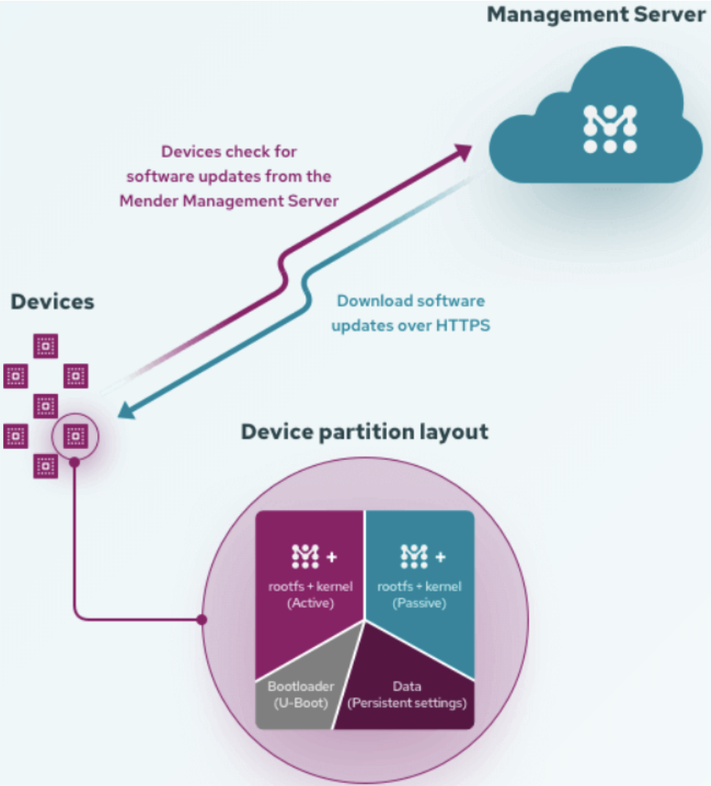

* PMD: Personal mobile device

* Post Processing Engine
  * Bias add, scale, shift + Activation function
  * Programmability

* Yocto project
  * OpenEmbedded Core (oe-core) contains base layer of recipes, classes and files

* Digital circuits: restrict the voltages to discrete ranges 0 and 1
* Microarchitecture: combining logic elements to execute instructions defined by the architecture
* Architecture: computer from the programmer’s perspective
  * intel x87

* Cooling: Heat sink fan majority
  * Thermal compound for cpu fill in the gap
  * Water vs air cool
  * Pump housing
  * More quiet expensive

* Firmware: programs stored in ROM devices

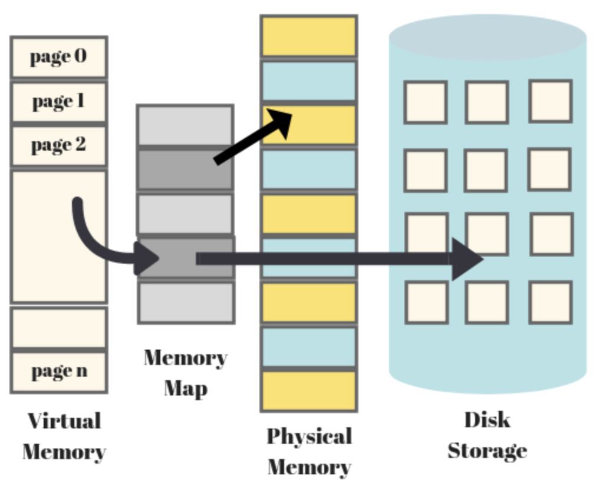

* Motherboard: Heart of computer, where every part sits on or connected to it
  * Cpu memory bus(extra) sata connection m.2
  * North bridge south bridge platform controller chip
  * Network interface chip, integrated sound card
  * Atx
  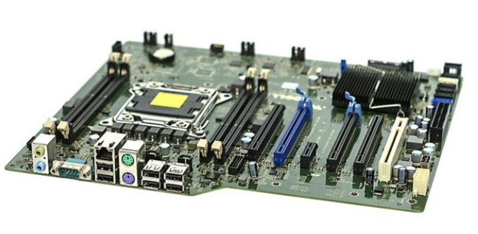

* Optical Drive
  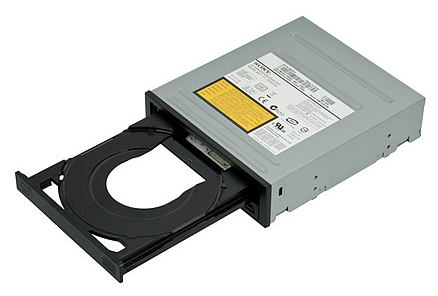

* Paging: OS retrieves data from secondary storage in same-size blocks to the main memory
  * convert virtual frame number into the physical frame number
  * table lookaside buffer gets flushed in context switch

* Power supply: supplys power that computer needs
  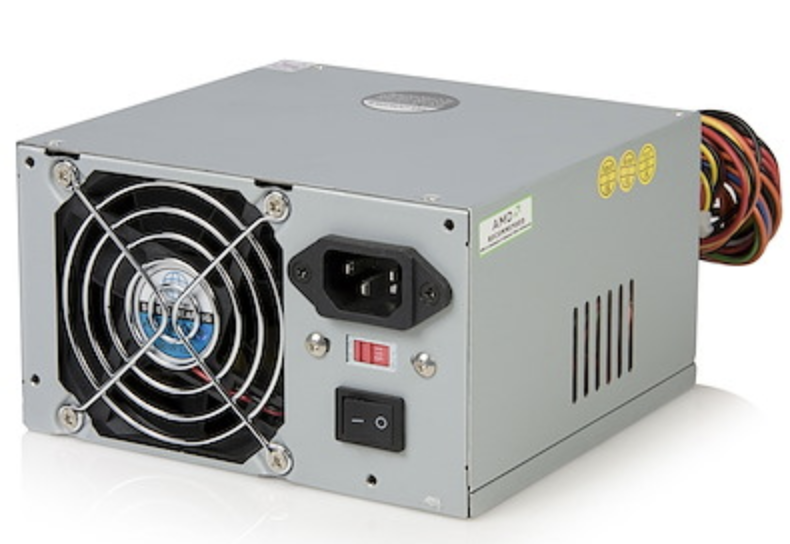

* Video Card: connects to mother board using video card slots
  * create images that appears on monitor accpet either AGP or PCI
  * more than one video cards for single machine

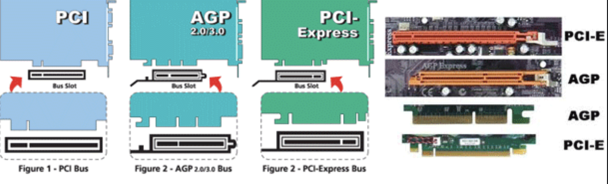

* Register: Memory in cpu (16 registers / each store 64 bit for 64-bit cpu)
  * Register instruction pointer (intel 64)

| Subject             | Building Blocks                  | Theory                       |
| ------------------- | -------------------------------- | ---------------------------- |
| combinational logic | AND, OR, NOT, XOR                | Boolean Algebra              |
| Sequential Network  | AND, OR, NOT, FF                 | Finite State Machine         |
| Standard Modules    | Operators, Interconnects, Memory | Arithmetics, Universal Logic |
| System Design       | Data Paths, Control Paths        | Methodologies                |

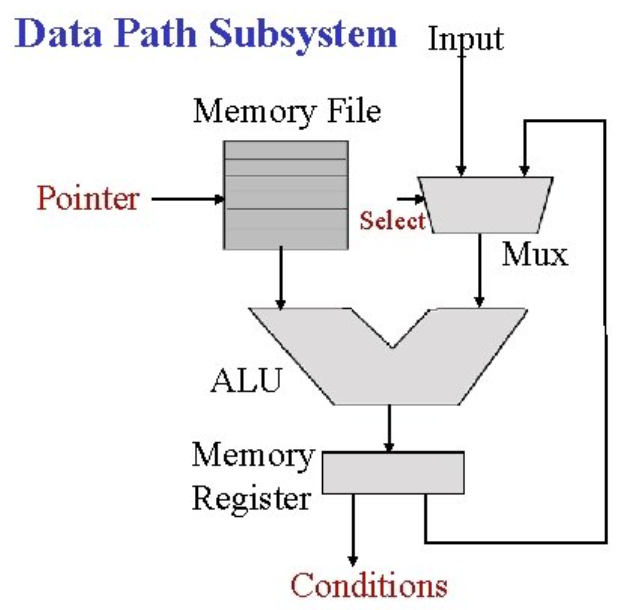

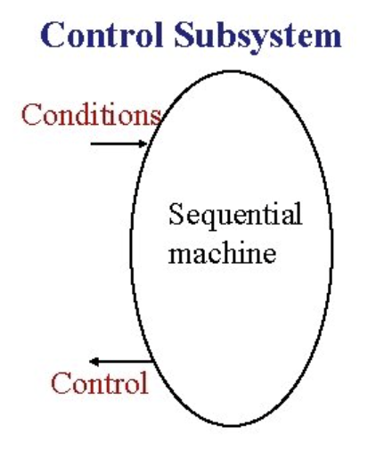

* OS functionality depends on hardware
  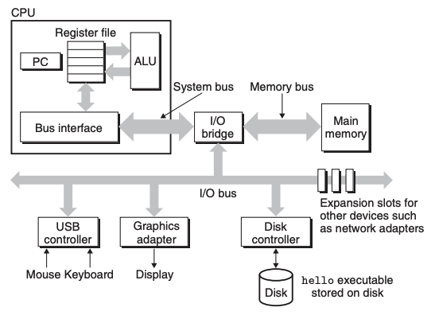

## Processor

* processing unit is digital circuit which performs operations on some external data source, memory or other data stream
* takes form of a microprocessor, which can be implemented on a single metal–oxide–semiconductor integrated circuit chip

> Term

* CPU (Central processing unit): Brain of the computer, interprets / executes instructions stored in main memory
  * its core is a word-size storage device (or register) called the program counter (PC)
  * calculate 1 billion operations per second / 0.3 nano per operation → cooler
  * Load: Copy a byte or a word from main memory into a register, overwriting the previous contents of the register
  * Store: Copy a byte or a word from a register to a location in main memory, overwriting previous contents of that location
  * Operate: Copy contents of two registers to ALU, do operation on overwrite result in a register
  * Jump: Extract a word from instruction and copy that word into program counter (PC), overwriting previous value of PC
* GPU (Graphic processing unit): specialized for graphics
* VPU (Vision processing unit): specialized for visions

## Memory


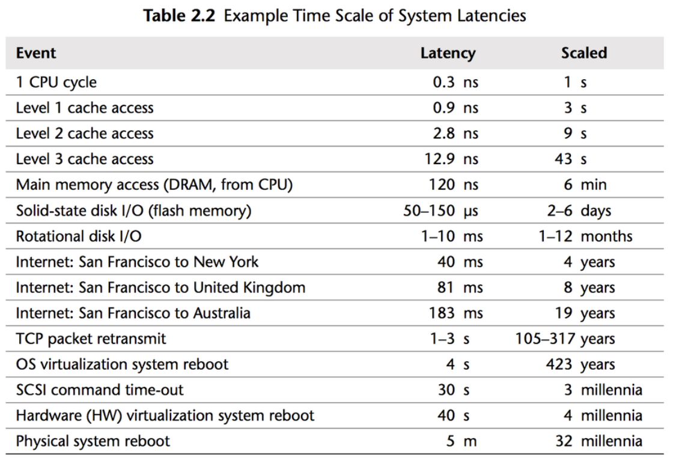

* storage at one level serves as a cache for storage at the next lower level

> Terms

* MMU (Memory management hardware): provides memory protection mechanisms
  * manipulating MMU is previledged instruction

* Units
  * byte = 8 bits
  * kilobyte (K / Kb) = 210 bytes = 1,024 bytes
  * megabyte (M / MB) = 220 bytes = 1,048,576 bytes
  * gigabyte (G / GB) = 230 bytes = 1,073,741,824 bytes
  * terabyte (T / TB) = 240 bytes = 1,099,511,627,776 bytes
  * petabyte (P / PB) = 250 bytes = 1,125,899,906,842,624 bytes
  * exabyte (E / EB) = 260 bytes = 1,152,921,504,606,846,976 bytes

* Main Memory: temporary storage device that holds both a program and data it manipulates while processor is executing program
  * fast, random access, temporary
  * dynamic RAM
  * divided into physical frame number and offset
  * Physically consists of DRAM (dynamic random access memory) chips
  * Logically organized as a linear array of bytes with its unique address starting at zero
  * a few of these simple operations, and they revolve around main memory, register file, and arithmetic/logic unit (ALU)

* RAM (Random Access memory)
  * volatile
  * SRAM, DRAM, SDRAM, PSRAM, DDR SDRAM

| Memory Type | Accesstime         |
| ----------- | ------------------ |
| RAM - CPU   | 0.1 microsecond    |
| SSD         | 50-150 microsecond |
| Hard Disk   | 1000 microseconds  |

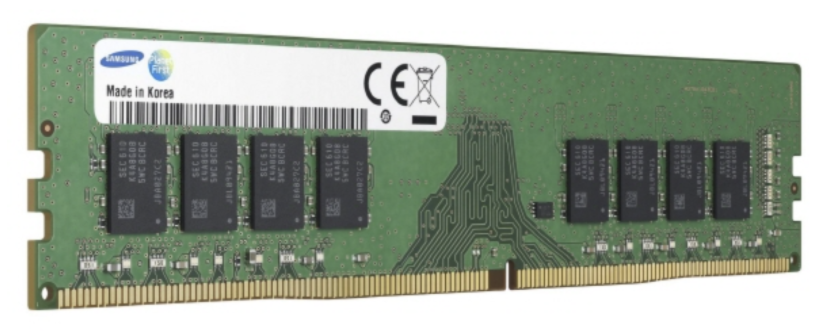

| -           | Internal Hard Disk | External Hard disk |
| ----------- | ------------------ | ------------------ |
| Portability | No                 | Yes                |
| Size        | Big                | Small              |
| Speed       | Fast               | Slow               |
| Cost        | Low                | High               |

### Auxilary Storage

| -           | Hard drive               | Solid State Drive   | CD     | DVD    | Blue ray Disc |
| ----------- | ------------------------ | ------------------- | ------ | ------ | ------------- |
| Performance | Slow                     | Fast                | 1200KB | 10.5MB | 36MD          |
| Price       | Low (x 16 price per gig) | High                | Low    | Low    | High          |
| Reliability | read / write wears HDD   | only write wear SSD |        |        |               |
| Size        |                          |                     | 700 MB | 5-10GB | 50GB          |

> Term

* HDD (Hard disk drive): holds information even powers off
  * Every program has different pagemap (memory map) / page sizes is around 4 KB
  * Destory drive as some software cana undelete

## Charge




* Airpod
  * Green: Fully charged
  * Amber: Charging
    * Flashing: Something wrong




## Combinational Logic

* Combinational circuit: Memory, time steps, with theory boolean algebra
* No memory → input and outputs can only have two discrete values (0v 1v / True False)
  * realizes one or more functions
* CMOS (Complementary Metal Oxide Semiconductor)
  * Invented in 60s but took over in 70’s
  * On means low resistance, off means high resistance

* nMOS: charge is carried by electrons, which flow from negative voltage to positive voltage
  * G = 0: S and D are seperated
  * G = 1: S = 1 -> D = 0.7 (poor 1)
  * Connected to GND
* pMOS: charge is carried by holes, which flow from positive voltage to negative voltage
  * G = 0: S = 0 -> D = 0.3 (poor 0)
  * G = 1: S and D are seperated
  * Connected to Vdd

 | -    | G = 0                         | G = 1                         |
 | ---- | ----------------------------- | ----------------------------- |
 | pMOS | S = D = 1 / S = 0, D = Poor 0 | Disconnected                  |
 | nMOS | Disconnected                  | S = 1, D = Poor 1 / S = D = 0 |

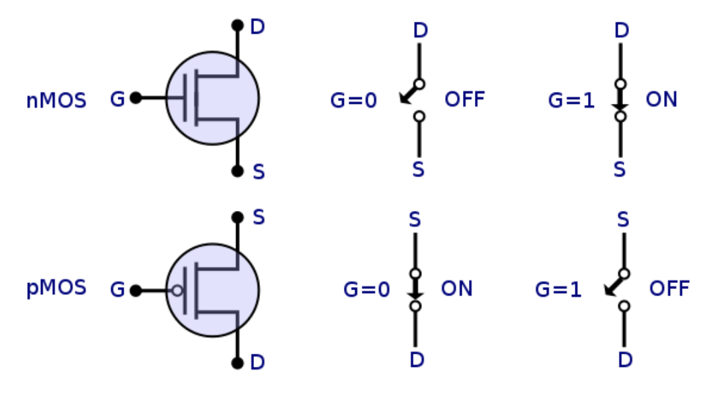

* Sequential Network: theory finite state machine
  * Ex) Flip flop
* Standard Modules: arithmetics, universal logics
  * Operators, interconnects, memory

### CMOS

* PMOS drawing is the dual of your NMOS drawing (if PMOS serial then NMOS parallel, vice versa)

* Inverter

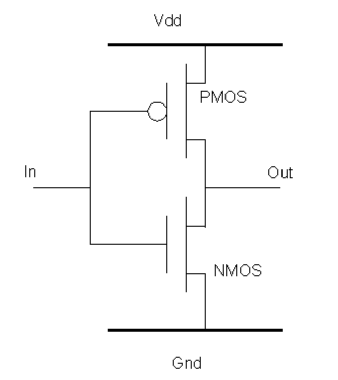

* NAND
  * NMOS gates are in series
  * PMOS gates are in parallel

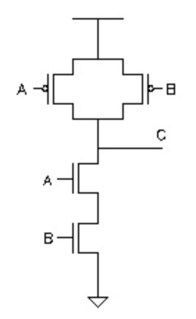
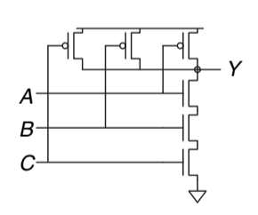

* AND

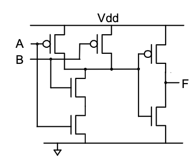

* NOR: only true if both a and b are 0
  * NMOS gates are in parallel
  * PMOS gates are in series

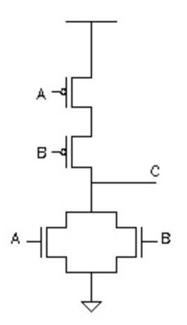

* OR

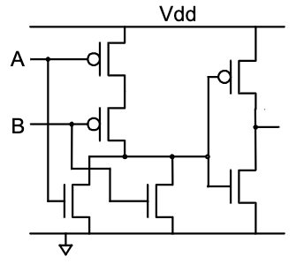

> AB + A'B'

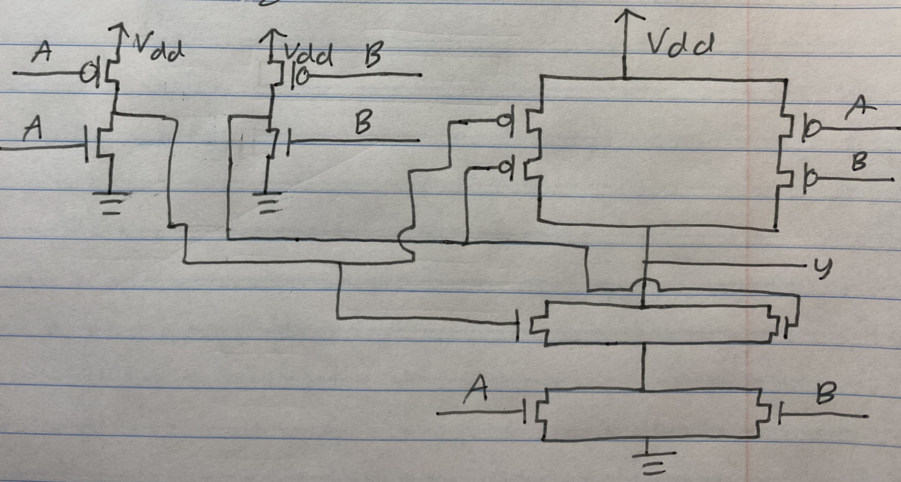

> A'B'C + A'BC' + AB'C' + ABC

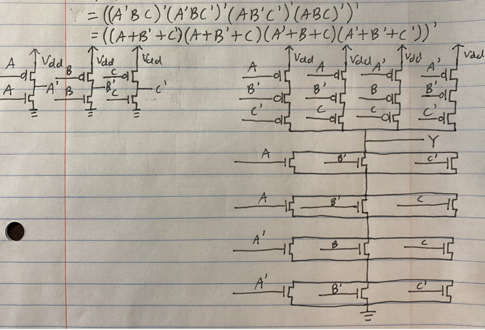

### Number system

> Terms

* Complement
* Endian


* Floating point: represented by sign, exponent, mantissa
  * float: 1 / 8 / 23
  * double: 1 / 11 / 52

$$
10010.101_{(2)}=2^{4}+2^{1}+2^{-1}+2^{-3}=18.6875
$$


* LSB: least significant bits
* MSB: most significant bits

* Size
  * byte: 8 bits
  * nibble: 4 bits

* Twos complement
  * inverting all of the bits in the number, then adding 1 to the least significant bit position
  * No seperate signed zero


* Multiplication
  * Only subtract (twos complement) for last signed bit

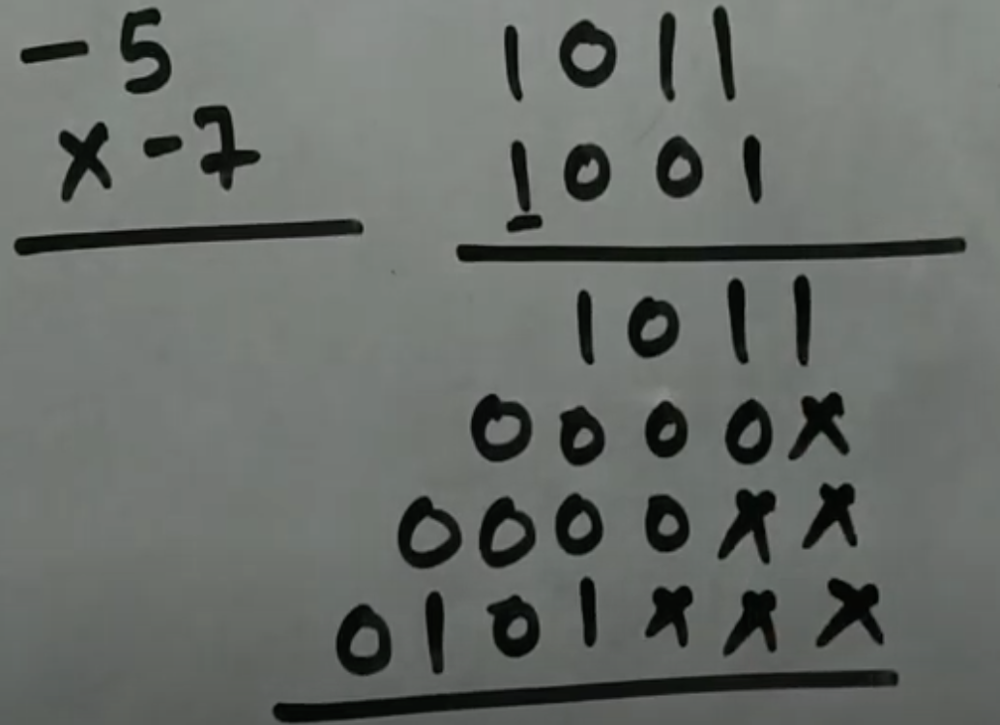

| Term | Meaning      |
| ---- | ------------ |
| A    | Acuumulator  |
| M    | Multiplicant |
| Q    | Multiplier   |

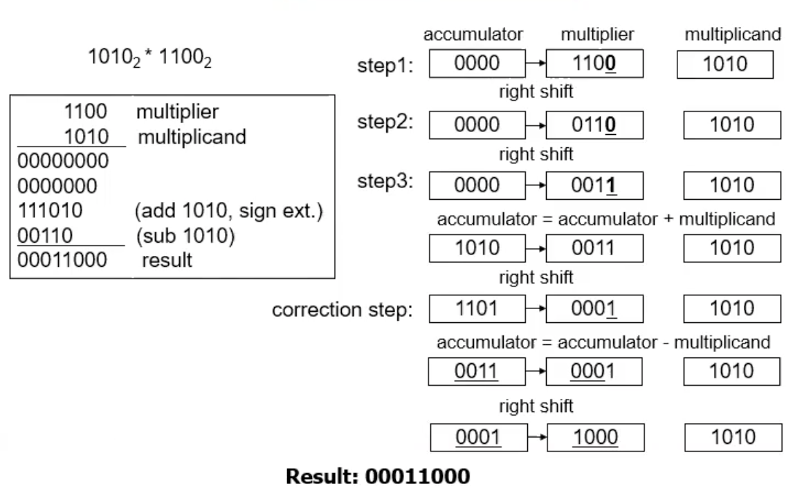




```cpp
int a = 2147483647;
printf("a : %d \n", a);   // 2147483647
a++;
printf("a : %d \n", a);   // -2147483648
unsigned int b = -1;
printf("b  : %u \n", b);  // 4294967295
```




### Boolean Algebra

* created by George Boole: SAT, SMT

| Term        | Meaning                    | equation                           |
| ----------- | -------------------------- | ---------------------------------- |
| Implication | product of literal (and)   | $$A \cdot B \cdot C$$              |
| Implicate   | sum of literals (or)       | $$(A + B + C)$$                    |
| Complement  | negation                   | $$ A' $$                           |
| Literal     | variable or its complement | $$ a'b + ab' + abc $$ (7 Literal)  |
| Operators   | $$ +, \cdot $$             | $$ a'b + ab' + abc $$ (4 Operator) |
| Variable    | number of Term in equation | $$ a'b + ab' + abc $$ (3 Variable) |
| Gate        | $$ +, \cdot $$             | # Operators                        |
| Pin         | Input or output of a gate  | # literal + # operators * 2 - 1    |
| Net         | wire that connects gates   | # variable + # operators           |

> Terms

* Duality: swap `and` with `or` at the same time `0` and `1`
* Literal: variable or its complement
* Multilevel logic: many layers of two level logic with some inverters
* Noise margin: amount of noise that could be added to a worst-case

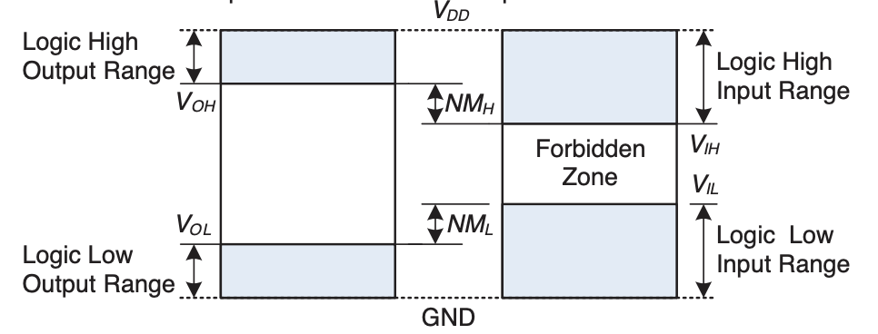

* Switching algebra: subset of boolean algebra conatians only 0, 1
* Two level logic: sum of products, or products of sums
  * \# levels: the longest path
  * length: in terms of \# of gates

* POS: maxterms
* SOP: miniterms

> Operation

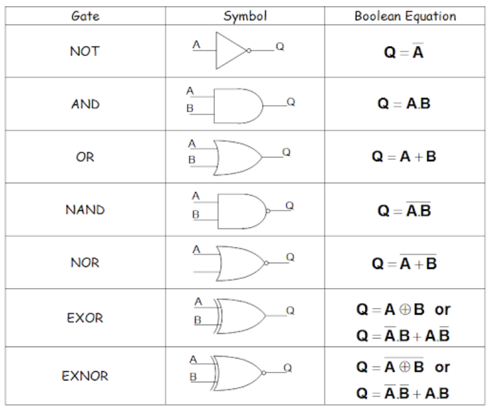

* Buffer (BUF)
  * no effect logical point of view, but in analog point of view
  * deliver large amounts of current to a motor
  * quickly send its output to many gates


| Laws           | And (Multiplication)                               | Or (Addition)                                  |
| -------------- | -------------------------------------------------- | ---------------------------------------------- |
| Associative    | $$ (A \cdot B) ⋅ C = (A + B) \cdot (A + C) $$      | $$ (A + B) + C = A + (B + C) $$                |
| Communative    | $$ A B = B A $$                                    | $$ A + B = B + A$$                             |
| Complement     | $$ AA' = 0 $$                                      | $$ A + A' = 1 $$                               |
| Distributive   | $$ A \cdot (B + C) = A · B + A · C $$              | $$ A + (B · C) = (A + B) \cdot (A + C) $$      |
| Identity law   | $$ A \cdot 1 = A $$                                | $$ A + 0 = A $$                                |
| Idempotent law | $$  A\cdot A = A $$                                | $$ A + A = A $$                                |
| Complementary  | $$ A \cdot A' = 0 $$                               | $$ A + A' = 1 $$                               |
| Dominant Law   | $$ A \cdot 0 = 0 $$                                | $$ A + 1 = 1     $$                            |
| De Morgans Law | $$ (AB)' = A' + B' $$                              | $$ (A + B)' = A'B' $$                          |
| Consensus The  | $$ AB+AC+B'C = AB + B'C $$                         | $$ (A + B)(A + C)(B' + C) = (A + B)(B' + C) $$ |
| Absorption Law | $$ A (A + B) = A $$                                | $$ A + (A \cdot B) = A     $$                  |
| Involution Law | $$ (A')' = x $$                                    |
| Redundance Law | $$ A(AB) = A $$                                    | $$ A + AB = A $$                               |
| Shannon's Exp  | $$ f(x, ..) = (x + f(x=0, ..))(x' + f(x=1, ..)) $$ | $$ f(x, ..) = x f(x=1, ..) + x' f(x=0, ..) $$  |

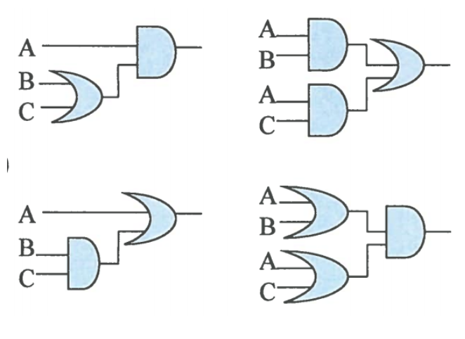

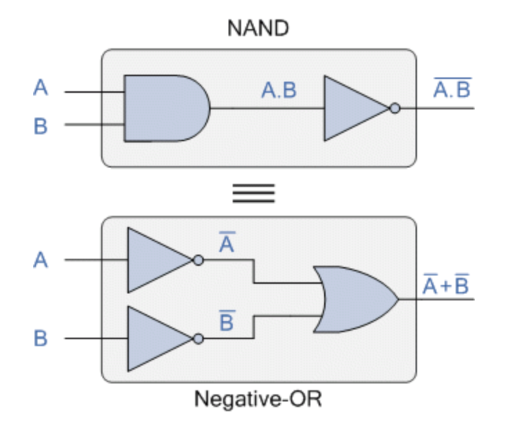

> Proof of Consensus Theorem

$$
\mathrm{AB}+\mathrm{AC}+\mathrm{B}^{\prime} \mathrm{C} \\
=\mathrm{AB}+\mathrm{AC} 1+\mathrm{B}^{\prime} \mathrm{C} \\
=\mathrm{AB}+\mathrm{AC}\left(\mathrm{B}+\mathrm{B}^{\prime}\right)+\mathrm{B}^{\prime} \mathrm{C} \\
=\mathrm{AB}+\mathrm{ABC}+\mathrm{AB}^{\prime} \mathrm{C}+\mathrm{B}^{\prime} \mathrm{C} \\
=\mathrm{AB}(1+\mathrm{C})+(\mathrm{A}+1) \mathrm{B}^{\prime} \mathrm{C} \\
=\mathrm{AB}+\mathrm{B}^{\prime} \mathrm{C}
$$

> Logic Gate $$ ad+b'd + a'bc' + a'b'c+ abc $$

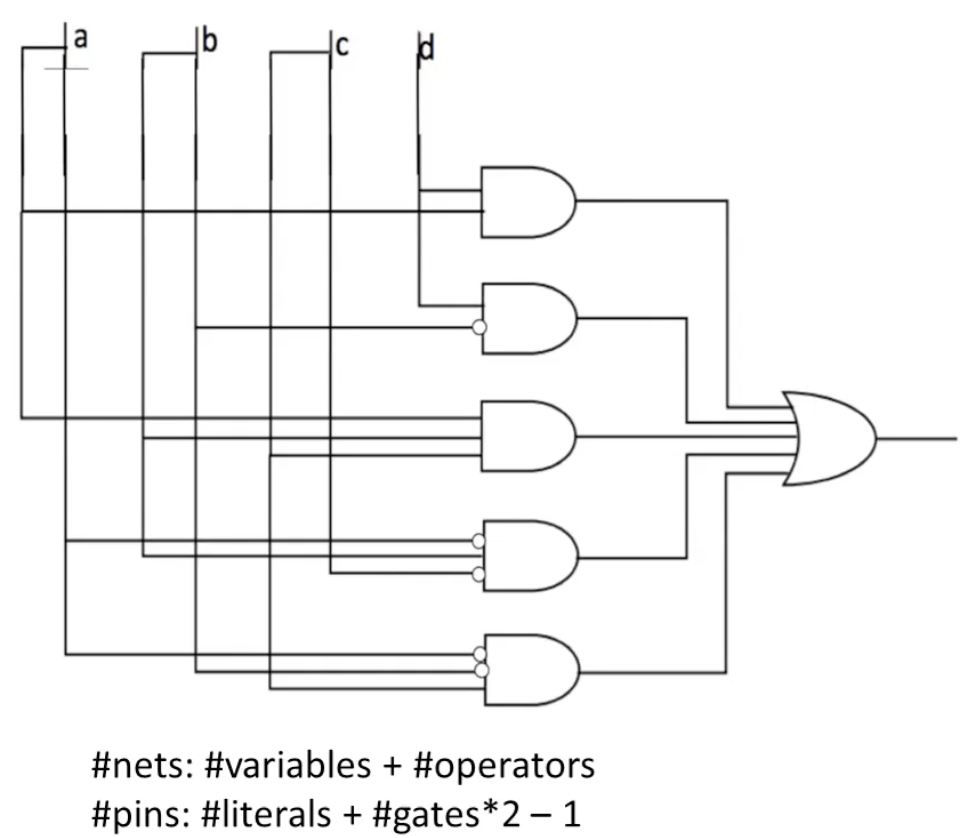

| name      | count |
| --------- | ----- |
| Variable  | 4     |
| Literal   | 13    |
| Operators | 6     |
| Gate      | 6     |
| Nets      | 10    |
| Pins      | 24    |

### KMap

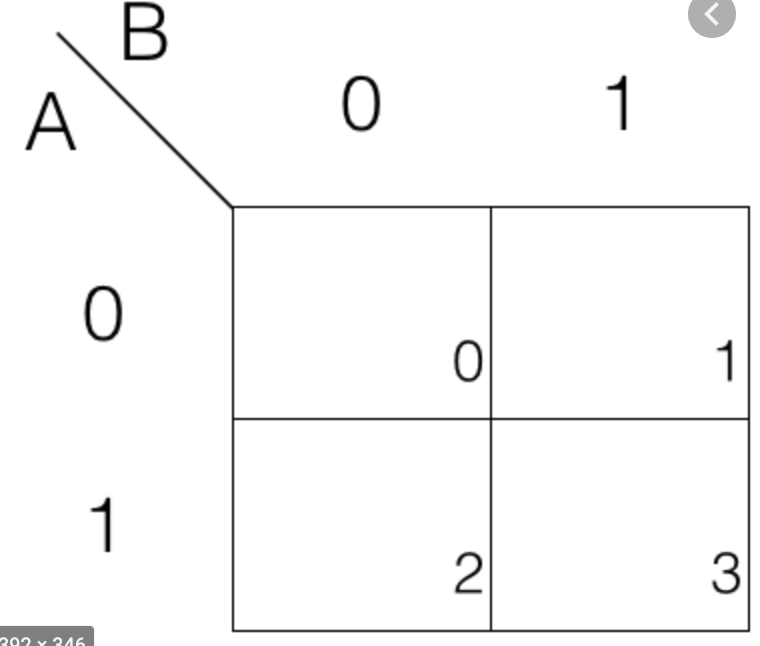
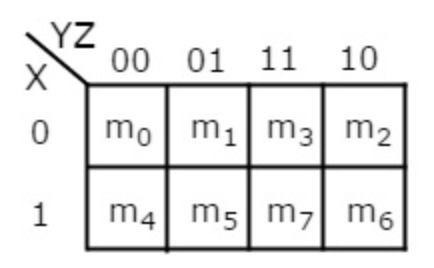
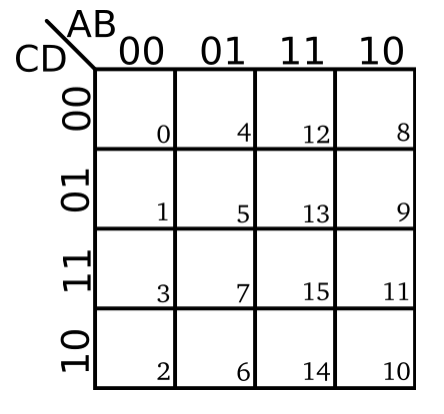
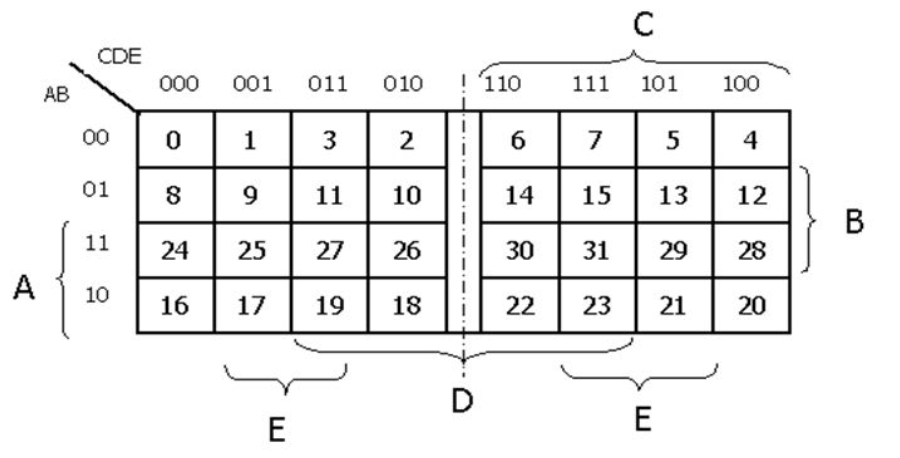

* Karnaugh maps

| Boolean Algebra   | Equivalent in KMap |
| ----------------- | ------------------ |
| Variables         | Planes, rectangels |
| Product terms     | Rectangels         |
| Minterms          | Cells              |
| Consensus Theorem | Adjacency          |

* 2d version of truth table
* Used to minimize boolean algebra
* m indicates necessary, d indicates don't care

> Terms

* Group: loose term for enclosure containing adjacent squares of 1s
  * must be power of 2 (ex: 1, 2, 4)
* Implicant: A product term that has non-empty intersection with on-set F, doesn't intersect with off-set R
  * Prime: that isn't covered by any other implicant
  * Essential prime: Prime implicant that an element in on-set F

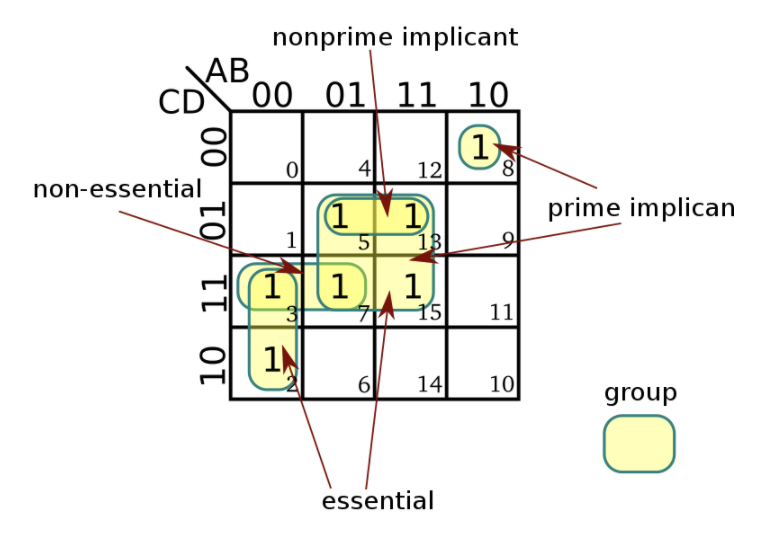

> Question

* Procedure for finding minimal function
  1. Truth table -> kmap
  1. Find product terms p: p covers at least one $$ m_i \in F $$ but no intersection with R (Implicants)
  1. Expand implicant p to its limit (Prime Implicants)
  1. Select prime implicants p that covers and $$ m_i \in F $$ but $$ m_i $$ is not contained in any other prime implicants
  1. Use essential primes and a minimal set of other primes to cover F
  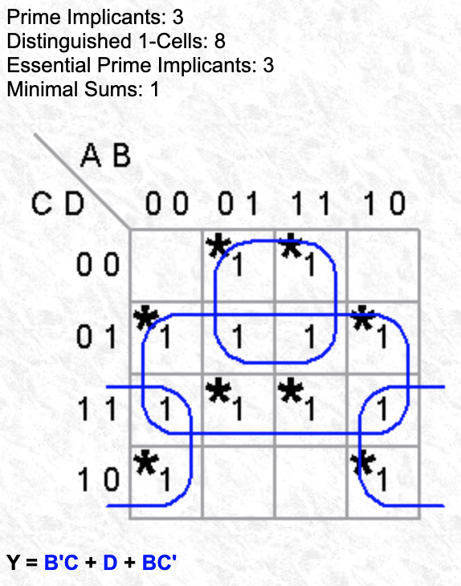

* Minmial sum products of $$ f(a, b, c) = \Sigma m(2, 6, 7) + \Sigma d(1, 4) $$
  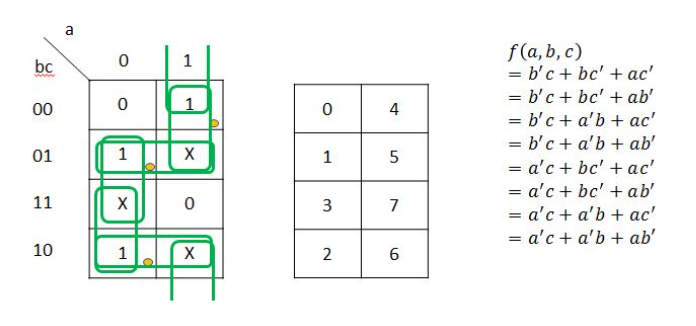

* Product of sums Expansion of $$ f(a, b, c, d) =∑m(1,4,5,9,13,14) +∑d(3,6,11,12,15) $$
  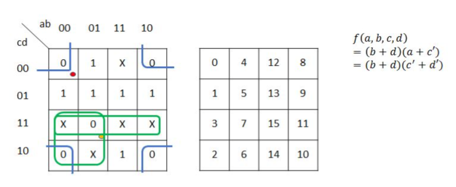

### Universal set

* set of gates s.t. that every swtiching function can be implemented with the gates in this set
* whether set can define AND, OR, NOT
* [ex] AND, NOT / OR, NOR / XOR, AND / { f(x, y) = xy', NOT } / NAND / NOR
* non example: XOR
  * Commutative, associative
  * Not idempotent

| Name       | XOR                   |
| ---------- | --------------------- |
| Definition | $$ xy' + x'y $$       |
| Property 1 | $$ x \oplus x' = 0 $$ |
| Property 2 | $$ x \oplus x = 1 $$  |

> Question

* f(x, y, z) = x + y + z' is universal
  * NOT gate on z: x = y = 0
  * OR gate on x, y: z = 0
  * AND gate on x, y: not (not x or not y)

* If $$ ab= 0 $$, then $$ a \oplus b = a + b $$
  * If $$ ab = 0 $$ then
    * $$ a = a (b + b') = ab + ab' = ab' $$
    * $$ b = b(a + a') = ba + ba' = a'b $$
    * Therefore, $$ a + b = ab' + a'b = a \oplus b$$
  * Thus $$ c_{out} = ab + bc + ac = ab + c(a + b) $$
    * $$ c_{out} = ab + c(a \oplus b) $$

## Sequential Logic

* AKA finite-state machines
* Asynchronous: change state and output whenever a change in input
* Synchronous: changes states and output at fixed points of time (specified by rising / falling edge of clock signal)
* Added state to Combinational logic

$$
y_{i}^{t}=f_{i}\left(x_{1}^{t}, \ldots, x_{n}^{t}, s_{1}^{t}, \ldots, s_{m}^{t}\right) \\
s_{i}^{t+1}=g_{i}\left(x_{1}^{t}, \ldots, x_{n}^{t}, s_{1}^{t}, \ldots, s_{m}^{t}\right)
$$

> Terms

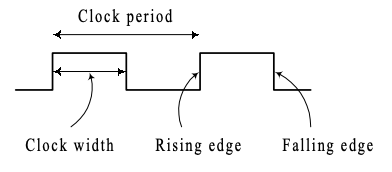

| Vairalbe           | Meaning                                               |
| ------------------ | ----------------------------------------------------- |
| Active low / high  | State changes occurs at clocks' falling / rising edge |
| Duty cycle         | ratio of clock width and clock period                 |
| CLK                | controls when the output changes                      |
| S                  | Press call                                            |
| R                  | Cancle button                                         |
| D                  | Controls what the output changes to                   |
| Q                  | Stored state                                          |
| $$ \overline{Q} $$ | Complement of stored state                            |

* Input: Next state, Output: present state

* Inverter
  * Even number of inverters: memory
  * Odd number of inverters: Chain of 0 -> 1

* Capacitive load: No inputs to control the state
  * Q = 0: $$ \overline{Q} = 1 $$ and $$ Q = 0 $$
  * Q = 1: $$ \overline{Q} = 0 $$ and $$ Q = 1 $$
  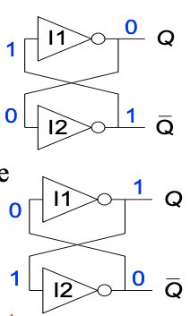

### Hamming code

| P   | D   | T   |
| --- | --- | --- |
| 3   | 4   | 7   |
| 4   | 11  | 15  |
| 5   | 26  | 31  |
| 6   | 57  | 63  |
| 7   | 120 | 7   |

* Higher P is risky because there would be more change for 2+ error bits

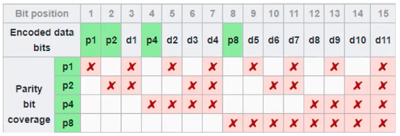

* Developed by R.W. Hammin, easy to implement 7 bit hamming code is common
* Data bits
* Parity bits: set p value so that sum of following 4 are even (p1 = d1 d5 d7 / p2 = d3 d6 d7 / p4 = d5 d6 d7)

> 1011 -> 1**0**10101 (but accidentally sent 1**1**10101

* p2, p4 should be 1, 1 but 0, 0 instead
* We can correct to 1010101 because p2, p4 both checks for d6

### Latches

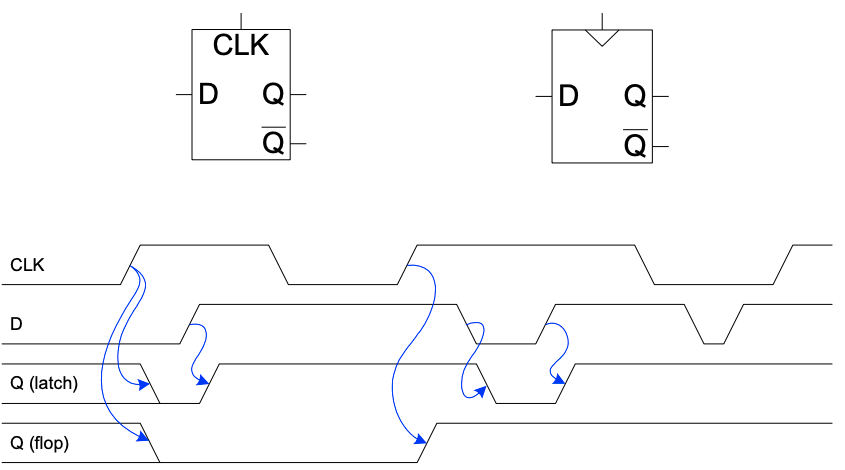

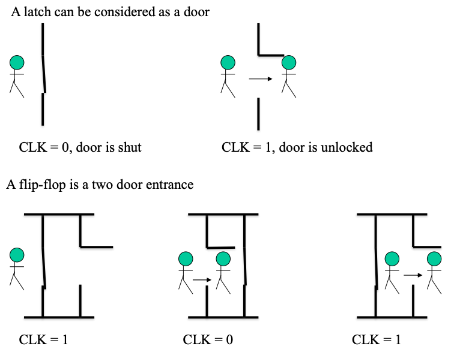

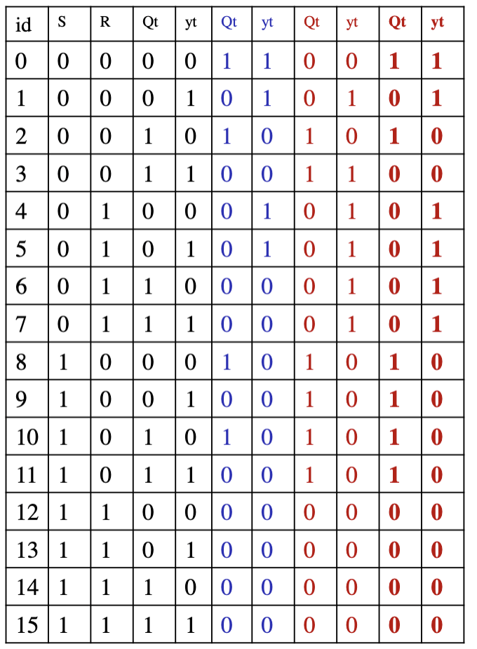

* Metal bolt lock or unlock the door

* Store one bit
* Level sensitive

* SR Latches
  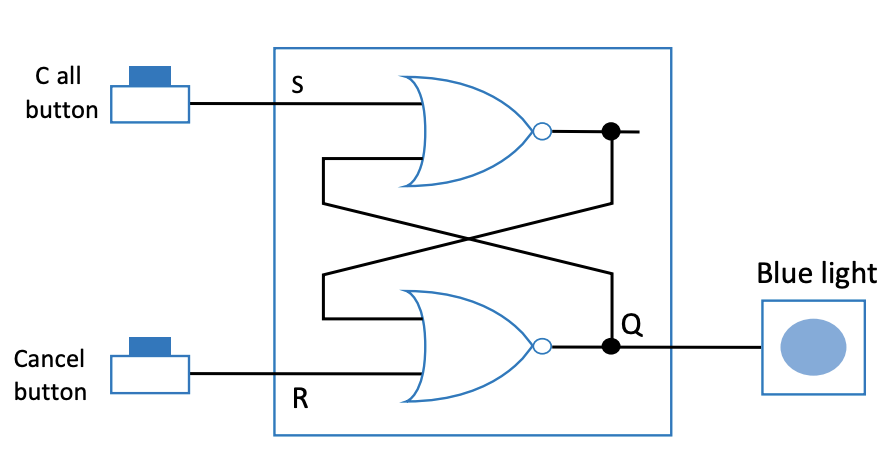
  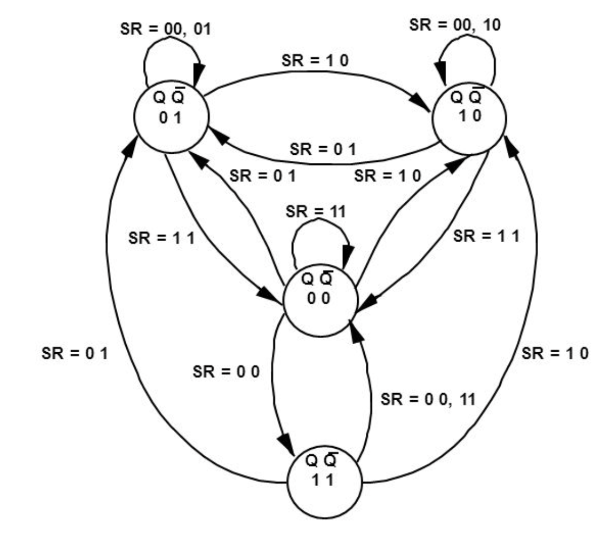
  * S = 1, R = 0: Q = 1 and $$ \overline{Q} $$ = 0
  * S = 0, R = 1: Q = 0 and $$ \overline{Q} $$ = 1
  * S = 0, R = 0: Q stays
  * S = 1, R = 1: Q = 0 and $$ \overline{Q} $$ = 0 (Don't care)

* D Latches
  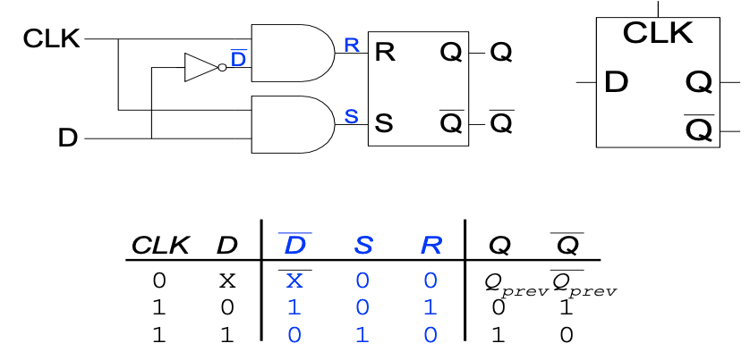

### Flip-Flop

* Double latches: Edge trigger

* Check D when rising edge of the clock

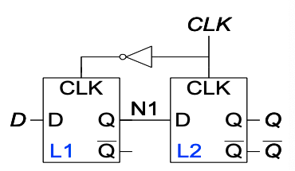

* Shift register
  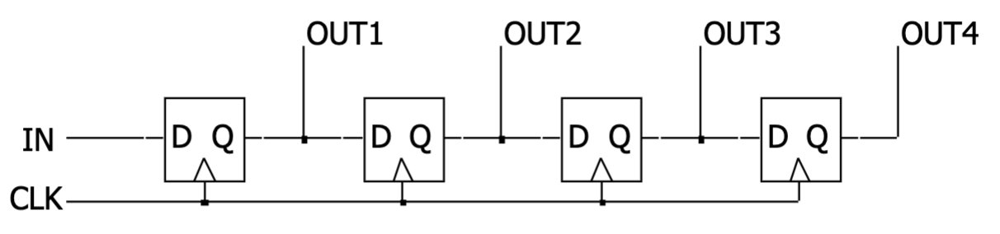
  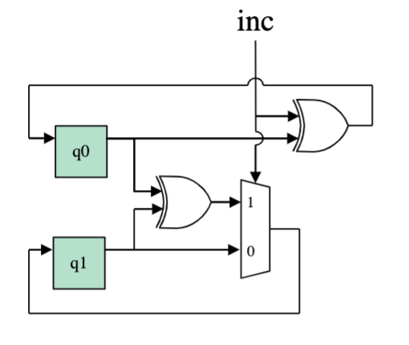
  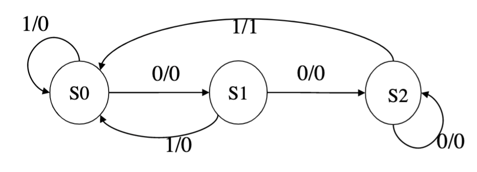

### Mealy & Moore

* Horizontal: Time
* Vertical: Space

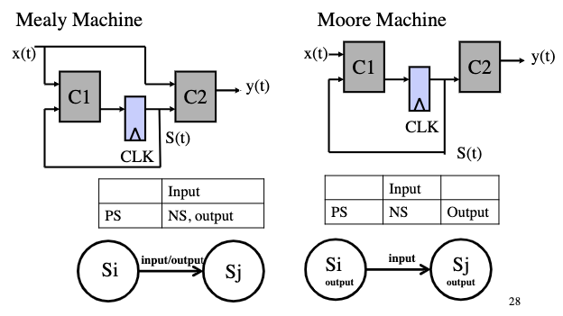

> Question

* Conversion from Mealy to Moore
  * Find distinct NS, y
  * Add new states to represent distinct NS, y
  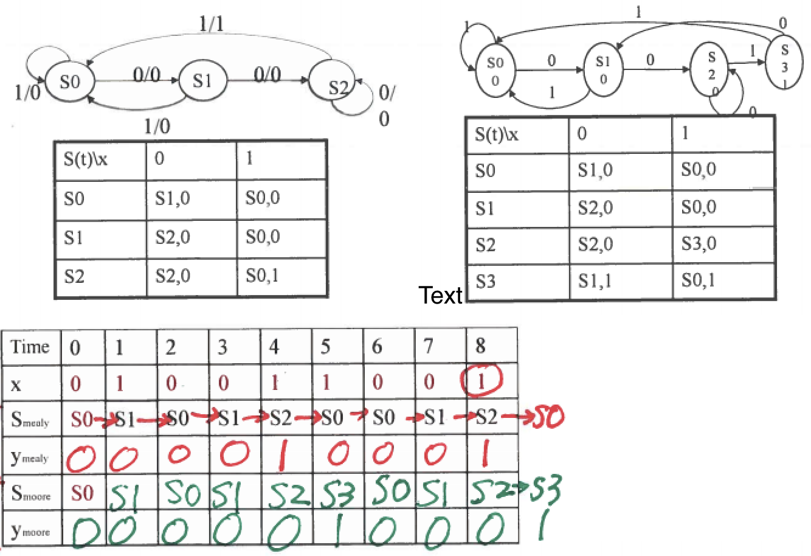

### Timing

* Goldilocks timing: allocate one clock period for signal propagation between registers
  * Late: fail to reach for the setup of the next state
  * Early: race to disturb the holding of the next state

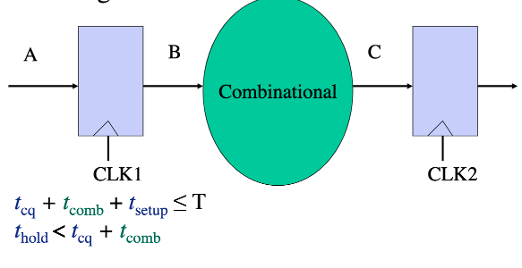

* Gates

| Term         | Meaning                                                                                              |
| ------------ | ---------------------------------------------------------------------------------------------------- |
| $$ t_{cd} $$ | contamination delay (shortest), Min time from input changes to output start to change                |
| $$ t_{pd} $$ | Propagation delay (longest), Max time from when input changes until circuit output reach final value |

* FlipFlop

| Term            | Meaning                                              |
| --------------- | ---------------------------------------------------- |
| $$ t_{cq} $$    | time from rising edge of clock to Q update (CLK1->B) |
| $$ t_{comb} $$  | time of combinational logic delay (B -> C)           |
| $$ t_{setup} $$ | setup time before rising edge of clock (C -> CLK2)   |
| T               | clock period (clk1 -> clk2)                          |

* Calculate set, hold time constraint
  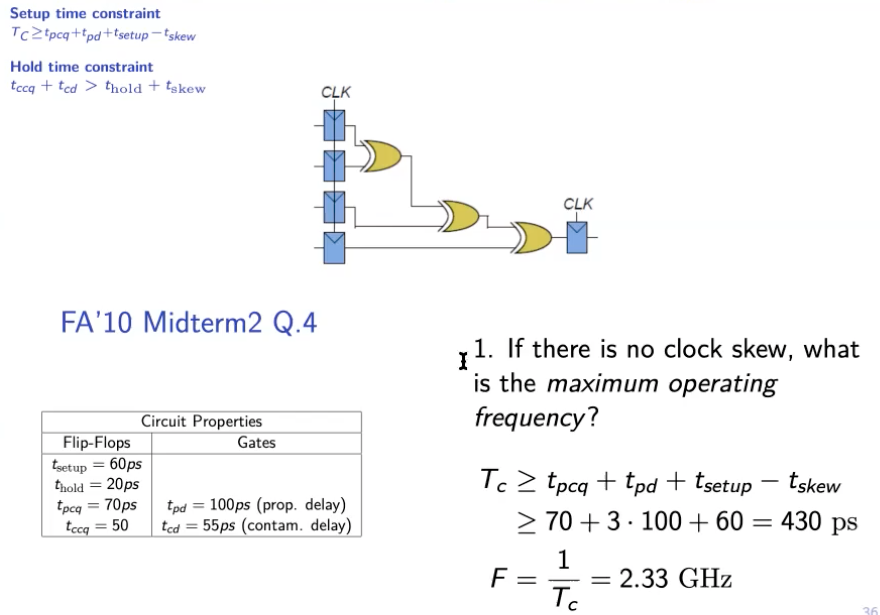
  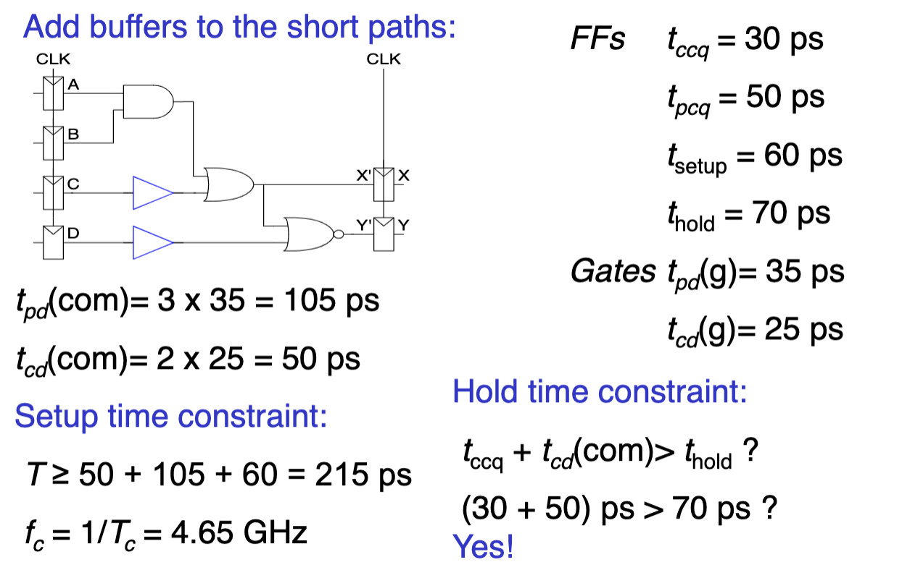
