# Network

* Divide-and-conquer approach → makes divided into small, manageable tasks to reduce complexity
* Modularity → provides the independence of layers, which is easier to understand and implement
* Easy to modify →  ensures independence of layers / implementation change without affecting other layers
* Easy to test →  Each layer of the layered architecture can be analyzed and tested individually

> Terms

* Anycast: to route traffic to different destinations depending on factors like location, congestion or link health
* Autonomous system: collection of networks that all fall under the control of a single network operator
* BGP (Border Gateway Protocol): Routers share data via this protocol, learn about most optimal paths to forward traffic
* Broadband connection: Always on → long lasting connections that don't need to be established with each use
* Dial-UP: connection is established by actually dialing a phone number → phone line at about a 110bps
* Encapsulation: entirety of a packet at one layer becoming payload section at another layer is known
  * IP datagram (packets) encapsulates a TCP segment
* Extranet: may allow other access for a fee for specific purposes ([ex] Azure, AWS, GCP)
  * privately held WAN infra generally owned by one company or organizations
  * can be an intranet with selective business-related access
  * used to carry a wide variety of services like internet
* RFC (request for comments): responsible for keeping the internet running to agree upon the standard requirements
* Root server: 13 were distributed to very specific geographic regions → now, distributed across the globe via anycast
  * 13 authorities that provide route name lookups as a service
  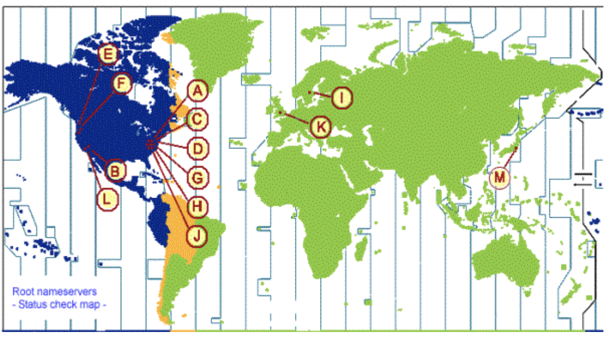
* SOA (Start of Authority): establishes a zone and maintains authority over the zone
  * authority-domain.: trailing dot is important
* Hypervisor: Software that manages VM while offering guests virtual operating platform indistinguishable from hardware
* IANA (Internet Assigned numbers authority): non-profit org that manage IP address allocation
  * Autonomous System number allocation
* ICANN (Internet Corporation for Assigned Names and Numbers)
  * nonprofit org coordinating maintenance of databases related to namespaces and numerical spaces of internet
  * Ensure the network's stable and secure operation

* ICMP (internet control message protocol)
  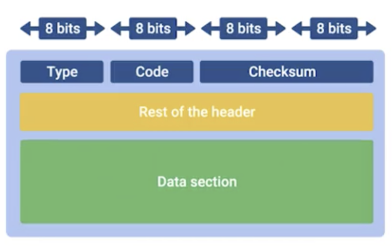

* ICS (Industrial Control System): normally refers to smaller-scale systems
  * Industrial automation
  * [ex] Control system for power plant and factory

* ISP (Internet service provider): X Internet Secure Payment, mostly handles routing issue
  * [ex] KT, SK, LG U+

* Intranet: the privately accessible infrastructure of cables, routers, switches, and servers
  * generally limited to a single company, organization, or group of companies
  * used to carry a wide variety of services like the internet

* Medianet: networks optimized for distributing large video applications and similar technologies
  * uses smart bandwidth detection systems
  * provides smooth video transmission on any platform
  * [ex[ Hulu, Netflix, WebEx, and GoToMeeting

* Non-Routable Address Space
  * 10.0.0.0/8
  * 172.16.0.0/12
  * 192.168.0.0/16

* NTP (Network Time Protocol): used to keep all computers on a network synchronized in time

* ping: Lets you send a special type of ICMP message called an Echo Request
  * If destination is up and running, it sends back and ICMP Echo Reply message
  * how large the ICMP message in bytes
  * how long it took for the round trip communication

* POTS (Plain Old Telephone Service): aka Public Switched Telephone Network or PSTN
  * System they built is known as USENET → increased to 300bps

* Registrar: organization responsible for assigning individual domain names to other orgs or individuals
* SCADA (Supervisory control and data acquisition)
  * refers to networks and technologies used to control industrial application
  * SCADA is a subset of ICS → describes a system that spans large geographic areas
  * [ex] pipelines, power distribution and water
* Service record (SRV): define location of various specific services
  * often used to return the records of services like CalDAV, which has a calendar and scheduling service
* Split horizon: method of preventing a routing loop in a network
* Tracert: discover the path between two nodes, and gives you information about each hop along the way
* Traffic: choose routes that have less traffic to speed up the data getting to the destination it is intended for
* Virtualization: concept of a physical, logical machine to be abstracted away from each other
  * a single physical machine called a host could run many individual virtual instances called guest
* Virtual private cloud (VPU): demand configurable pool of shared resources allocated within a public cloud environment
  * provide a certain level of isolation between different organizations (denoted as users hereafter) using resources
  * LB 80 443
* Zone: contains SOA and NS
  * allow for easier control over multiple levels of a domain by using a hierarchy
  * web, mail, ftp, dns, voip, proxy server should be placed in Demilitarized Zone(DMZ)

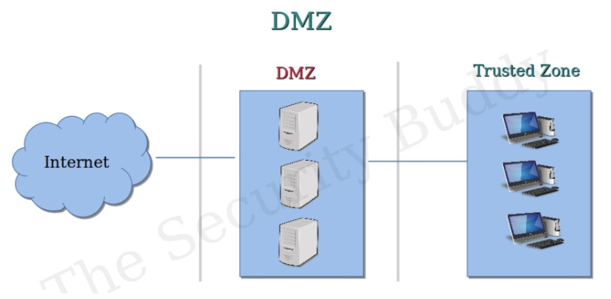

> Connection

* Client-server network: All devices access resources through a central server and devices needing access are clients
  * network management is overseen by server
  * security build around access to the server
  * server allows or restricts access to network resources → goes down, no one cannot access
  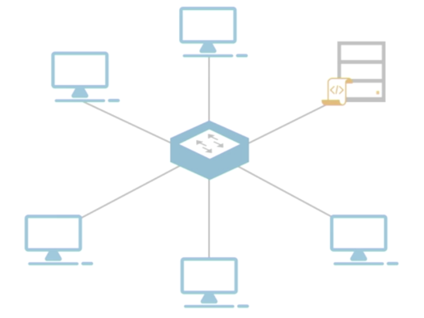

* OSI (Open systems interconnection reference)
  * Mnemonic: all people seem to need data processing / please do not throw sausage pizza away
  * Created as a reference model and teaching aid → not intended to reflect any actual network architecture
  * device to teach how protocols work with networks to carry data
  * model for organizations creating new protocols
  * abstract model: the actual model with its seven layers
  * Set of specifically created protocols → not actually used in any network system
  * Telecommunication standardization sector of the international telecommunications union(ITU-T)
  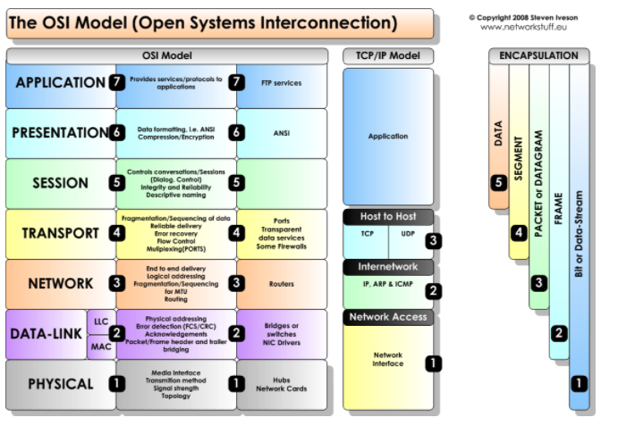
  

* Peer-to-peer: computer responsible for own security and management ([ex] Homegroup, workstation, most home networks)
  * each computer-managed as separate device
  * usually only used for a very small network → Microsoft limits to only 10 systems per network
  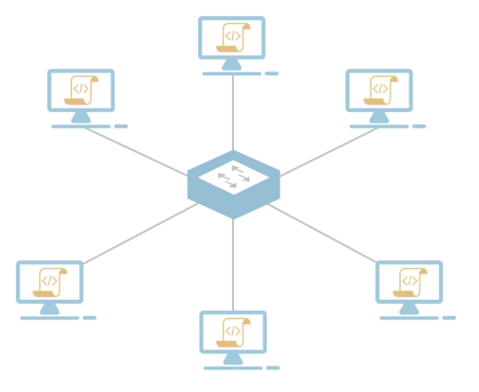

* Point to point: connects two nodes directly to each other with no intervening device
  * [ex] two ends of a WAN connection, computer to switch, switches or routers to each other

* Point-to-Multiple: Crossover cable connecting two computers
  * Often part of a hybrid system

* Topology: Networks can have different physical and logical topologies
  * logical refers to how data moves through the network, patterns of data flow in a network
  * refers to the physical layout of the wires in a network

* Bus: All nodes connect directly to the main cable called the bus → Simple to put together
  * One of the oldest networking topologies
  * Only one node can send a signal at a time → the more nodes active, the more collision on networks
  * contention is used to determine which nodes send signals
  * After the collision, all nodes again contend to send a signal
  * Recommended for 30 nodes or less
  * [-] Single bad node or cable brings down the whole network
  * [-] Not part of current TIA/EIA 568-C standard
  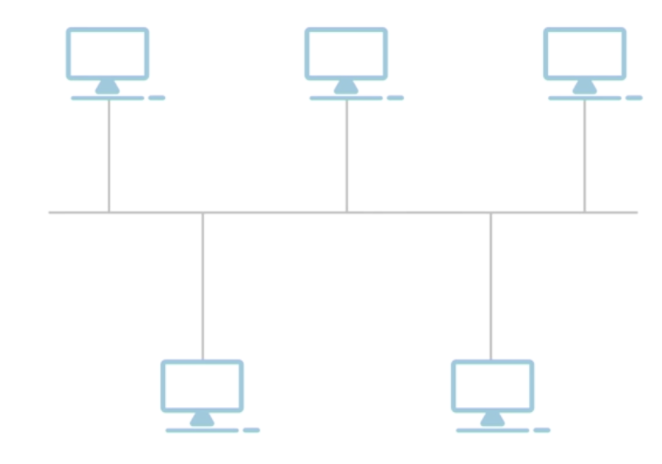

* Ring: Packets move in a ring around a network
  * Each node is given an opportunity to send a signal
  * No contention between nodes
  * Heavy traffic will not bring down the network → slow down

* Full mesh: All devices directly connected to all other devices → most expensive type of topology
  * Provides full redundancy, Requires multiple NICs and cables for each node
  * [ex] WAN environment

* Partial mesh: All devices directly connected to at least two other devices
  * Provides strong redundancy but not full redundancy
  * Multiple NICs and cable runs on each machine
  * WAN environment → internet

* Hybrid: combines normal str with some other topology
  * physical hybrid star vs physical-logical
  * [ex] ring + star / bus + star

* Physical Logical: Network physically looks one way but functions differently
  * [ex] ring networks that look like a star or star using a hub
  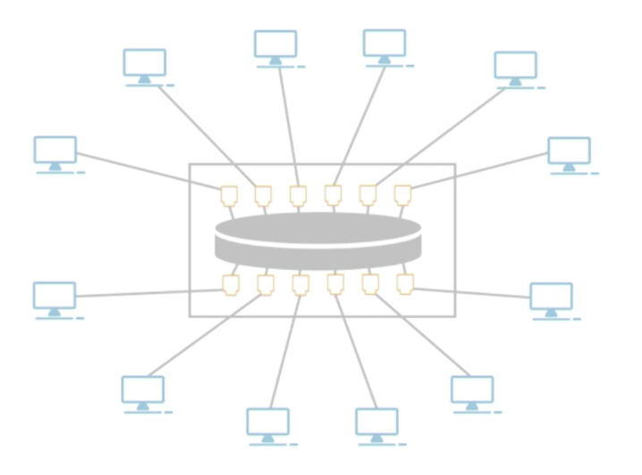

* Star: All nodes connected to a central hub or switch → easily to troubleshoot ([ex] LANs)
  * Won’t bring down the network with one damaged node
  * Susceptible to a single point of failure, recognized in TIA/EIA 568-C standard
  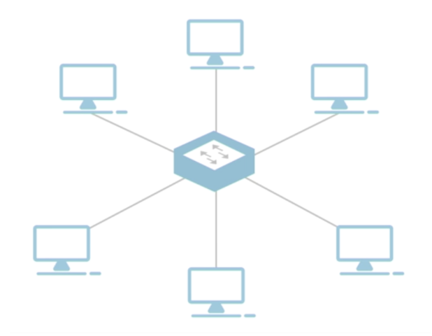

* Metric
  * Hop: number of nodes a packet has to pass through in order to get to its destination
  * Reliability: Keep a long-term log of reliability of different routes
  * Throughput: amount of data that can pass through a link in a specific amount of time

> Question

* How to Internet Troubleshoot
  * Failure → Check other website
  * check other computer
  * check DHCP




* nc
  * -p: source_port
  * google.com 80: try to establish a connection on port 80 to google.com

* local
  * -azvh file backup: save file in backup

* sftp: FTP protocol over ssh port, encrypted
  * put / before every command to see local files
  * bye: exit sftp

* ufw
  * app list: list the ufw application profiles

* ipconfig: Internet Protocol Configuration used in Microsoft Windows operating system
  * view all the current TCP/IP network configurations values of the computer

* iptables: administration tool for IPv4/IPv6 packet filtering and NAT
  * displaying the route and measuring transit delays of packets across an Internet Protocol network

* gpg: OpenPGP encryption and signing tool
  * --keyserver hkp://keys.gnupg.net --recv BCE9D9A42D51784F
  * --verify ecs-cli.asc /usr/local/bin/ecs-cli

* traceroute: [ex] `google.com`

* tracepath: traces path to a network host discovering MTU along this path

```sh
# 1. nc connect
""" in terminal 1 """
docker run -it -p 23456:23456 -p 23457:23457 --name server ubuntu:14.04 bash
nc -lp 23456 | nc -lp 23457

""" in terminal 2  (can talk to terminal 3) """
nc localhost 23456

""" in terminal 3"""
nc localhost 23457
```




## 1: Pysical

* Transmit data in the form of 1s and 0s (bits)
* Encoding methods to transmit data, bits placement on media, and how bits start/stop
* Media usage, kinds of media permitted, media usage, physical connections, pin usages
* Specifies standards that apply to specific types of media
* Simplex, Duplex communication → information can flow in uni/both directions across cable
* Half duplex → only one device can talk at a time
* modulation varies the voltage of charge moving across the cable

* Polar
  

* Bipolar
  

* Unipolar
  

* Pulse Amplitude Modulation: not useful in data communication as pulses are not digital → PCM technique
  

* Pulse Code Modulation

* Modem: Baud rate measure of how many bits can be passed across a phone line in a second → 110bps
  

* Hub: allow connections from many computers at once
  * Older technology falling out of use → Due to collision domain
  * repeater → Message sent by one host is sent to all other hosts
  * logically function as a bus topology
  * too many host causes collision
  * Intelligent hub has network diagnostic abilities
  

* Passive: work like cable splitters
  * the more devices the weaker the signal to each device

* Active: central connecting device in network that regenerates signals on the output side to keep the signal strong
  * need a power source → power added to signal when passed through port
  * prevent weakening of signal by multiple devices being attached
  * repeats signal to all hosts connected to hub
  * No more than 5 segments can be linked
  * 4 linking devices only can be used to form segments
  * 3 segments can be populated by computers


* Cable: Link LED flashes when linked, Activity LED flashes when data flows
  * connect different devices to each other, allowing data to be transmitted over them


* Copper Cable
  * Multiple pairs of copper wires inside plastic insulator
  * Cat5 < Cat5e < Cat6 to reduce crosstalk → One wire accidentally detected on another wire


* Fiber Cable
  * Contain individual optical fibers, which are tiny tubes made out of glass about the width of a human hair
  * Much more expensive and fragile


### Wireless Network

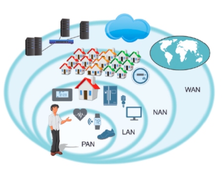

* LAN: used for connecting personal computers through a communication medium (twisted pair, coaxial cable)
  * TIA/EIA 568-C defines characteristics of LANs
  * normally uses twisted-pair cabling to connect devices → can use fiber optic cables to connect switches
  * Should use CAT 6 or 6A in current LAN builds
  * Hierarchical star only topology recognized by 568-C
  * LAN nodes tied together with switches or hubs
  * [ex] buildings, offices, several close buildings
  * [+] Fast transfer with inexpensive hardware (hubs, network adapters, and ethernet cables), Security

* WLAN (Wireless local area networks): (Wi-Fi) defined by IEEE 802.11 standard
  * 802.11ac - most current standard 802.11ax - being developed

* PAN (Personal area networks): defined by IEEE 802.15 standard group, Infrared (IrDA)
  * [+] Limited range of less than 30feet
  * [ex] Bluetooth keyboards and mouse/phones

* MAN (metropolitan area networks)
  * uses the same technology as WANs covers an area of only 50 kilometers or so across
  * A term falling out of use → WAN used to apply to both WANs and MANs

* WAN (wide area networks): one large network that covers a large geographic area ([ex] Internet)
  * can be many smaller networks linked into one large one
  * Use routers and switches to connect up networks

## 2: Data-link

* Provides error-free transmission of frames from one node to the next over physical media
* Establishes, terminates links between nodes → provides media access management
* Traffic control → transmits, receives frames sequentially
* Detects, recovers errors on physical layer →  retransmit unacknowledged frames
* Frame delimiting / duplicate frame receipt

> Terms

* Access points: Devices that allow computers to access the network
  * Commonly used to connect home computers to internet
  * Authentication and encryption
  * Combine role of switches and routers

* Bridge: break up a network into smaller segments
  * Older technology

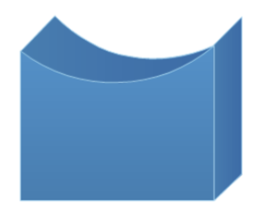

* Mac: Addressing of destination stations (one or groups) / source-station addressing information
  * 48-bit number 6 groups of 2 hex # globally unique identifier attached to an individual network interface
  * Controls the hardware responsible for interaction with the wired, optical or wireless transmission medium

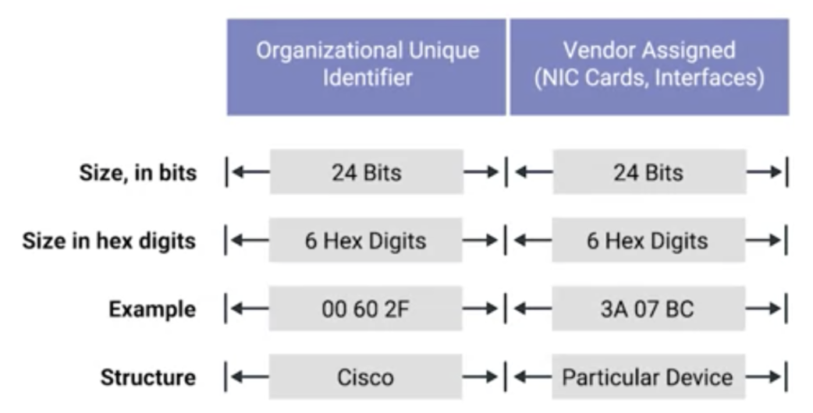

* NIC (network interface card or controller): allows computer or other device to access the network
  * can come in form of an expansion card, USB or built into the motherboard
  * needs to match technology being used → 802.11n Wifi or UTP
  * speed being used → gigabit ethernet speed network
  * network architecture → token ring network / ethernet network

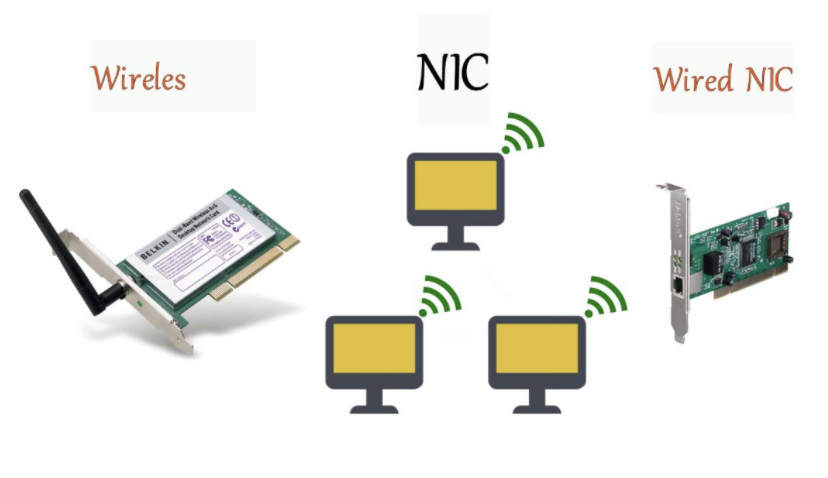

* Switches: connect multiple computers → inspect contents of ethernet protocol data sent in network
  * determine which system data intended and only send that data to one system → reduce collision domain
  * multilayer switch can work on more than 1 layer
  * Multiport bridge → separate larger networks into smaller segments called collision domains

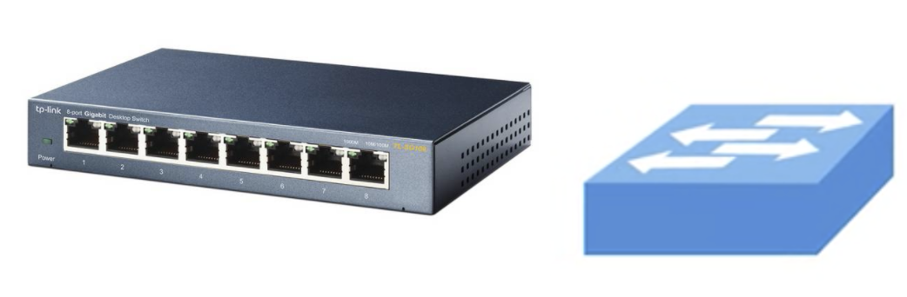

### CSMA

* CSMA/CD
  * Carrier sensing Media Access / Collision Detection
  * Node listens for traffic on a network → if traffic not heard, node releases packet onto the network
  * if two nodes release packets at the same time, the packets hit each other and a collision occurs
  * a collision causes a power spike heard by all nodes and destroys the data contained in the two packets
  * If collision nodes randomly set internal clock → times up, nodes attempt to send a new transmission
  * If no collision, then the transmission was successful  → network freed up for another node to transmit
  * [ex] Ethernet
  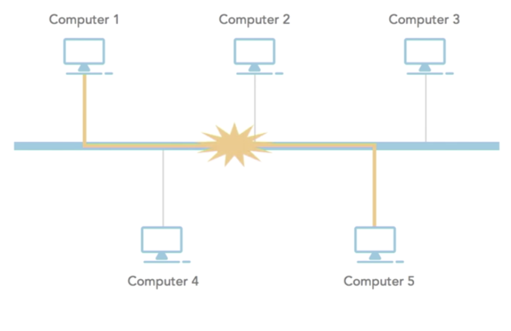

* CSMA/CA
  * Carrier sensing media access / Collision avoidance
  * Releases warning packet before releasing data packet → if warning packet, they won't transmit
  * Once data packet heard, other nodes are able to transmit
  * two warning packets transmitted at the same time cause a collision
  * [ex] WIFI
  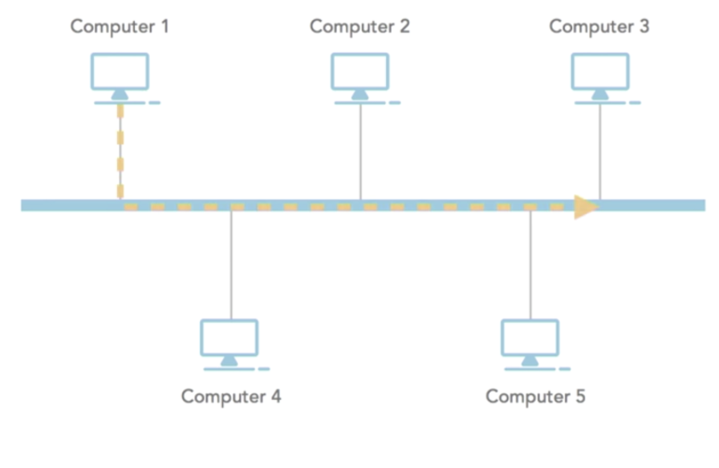

### Ethernet

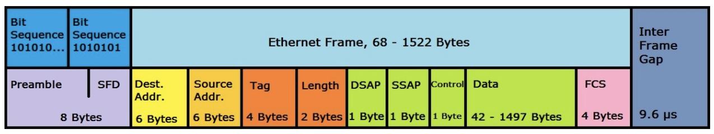


* most widely installed LAN technology. Ethernet is a link layer protocol in the TCP/IP stack
* solve collision domain by using CSMA/CD carrier sense multiple access with collision detection
* uses MAC addresses to ensure data has both and address for vendor and receiver of transmission
* Calculated by performing what's known as a cyclical redundancy check against the frame
* CRC for data integrity, polynomial division to create a number that represent a larger set of data

* Preamble
  * seven bytes alternating 0, 1 → buffer between frames, synch internal clocks
  * SFD signals to a receiving device that the preamble is over

* Dest Address
  * Unicast: least sig bit is 0, intended for one address
  * Multicast: least sig bit is 1, dealing for multiple address
  * Broadcast: All 1

* EtherType
  * describes protocol of the contents of the frame
  * Sometimes VLAN presents, and indicates that frame itself is VLAN frame
  * Technique that lets you have multiple logical LANs operating on the same physical equipment

* Payload
  * Contains all the data from higher layers such as IP, transport, and application layers

## 3: Network

* responsible for packet forwarding including routing through intermediate routers
* Don’t know where a certain MAC address locate → not ideal for communicating across distances
* Controls the operations of the subnetwork it is on
* Determines the best physical path for data using network conditions to choose the best path
* Uses priority of services to determine the best path
* number of hops and steps between source and destination, bandwidth, throughput
* Subnet traffic control → let routers send instructions to throttle frame transmissions when buffered filled

> Terms

* Address mapping: Translate logical address into physical addresses

* ARP: protocol used to discover the hardware address of a node with a certain IP address
  * ARP table list IP addresses and MAC address associated with them

* Datagram
  * Version: IPv4 or IPv6
  * Total Length: Indicates total length of IP datagram it's attached to → max packet size 65535
  * Header Length: usually 20 bytes for IPv4
  * Service types: specify QoS (quality of service)
  * Identification: When larger than max packet, indicate it’s same transmission
  * Flags: Indicate if allowed to be fragmented, or already been fragmented
  * TTL: How many router hops a datagram can traverse before thrown away
  * Protocol: Transport layer protocols are used (e.g. TCP, UDP)
  * Header Checksum: TTL field updates every router that a datagram touches → Checksum changes too
  * Source
  * Destination
  * Options: Optional used to set special characteristics primarily for testing
  * Padding: Series of zeros

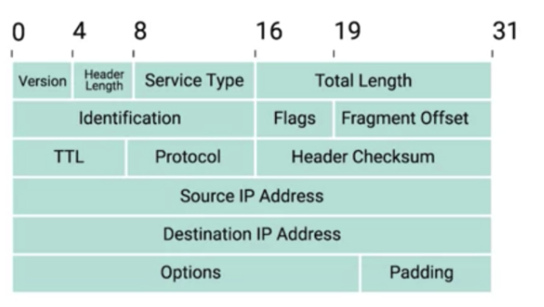

* Frame fragmentation: Determines frame size of routers located downstream → maximum transmission unit size
  * frame into smaller sizes and reassembles the full frame at destination

* Subnet: Divide subnet ID / Host ID (1 for broadcast, 0 for ip address)
  * allows routers to send instructions to sending nodes to throttle frame transmissions when buffered filled
  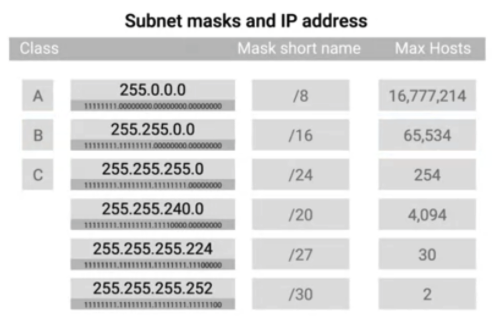

* Subnet usage account: Allows device to keep track of frames forwarded by subnet intermediate systems
  * Uses this to produce billing information

* Communication subnets: Build headers used by network layer on other devices to route packets to destination
  * Relieve higher layers of the need-to-know data transmission and switching technologies
  * Use protocols on lower layers to send data to destinations separated by intermediate nodes
  * Send informations between adjacent nodes

* CIDR: C is too small and B is too large → Classless Inter-Domain Routing
  * demarcation point: to describe where one network or system and another one begins

### IP

* V4: IP address belong to networks not to the devices attached to those networks
  * static IP addresses are reserved for servers and network devices
  * dynamic IP addresses are reserved for clients
  * address class system way of defining how the global IP address space is split up
  * The loopback IP for IPV4 is 127.0.0.1
  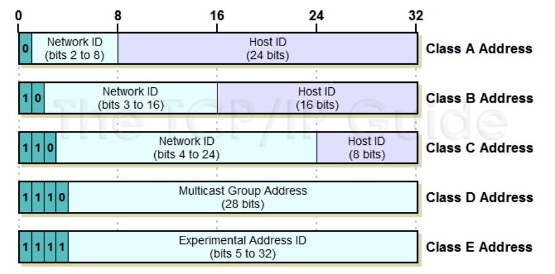

* IPv6: First 16 bytes are network id / host id
  * 2001:0db8:- reserved for education
  * *::1 loop back
  * FF00:: multicast
  * FE80:: Link local unicast → local network segment communications are configured based upon MAC
  * remove any leading 0  /:0:0: → can be shortened to::
  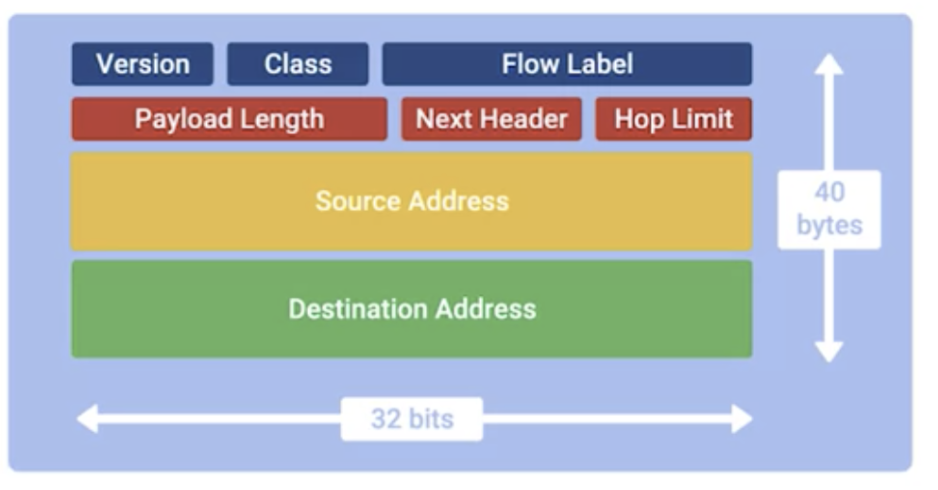

### Internet

* Worldwide publicly accessible infrastructures of cables, routers, switches, servers
* Used to carry a wide variety of services
* Cables -> Routers -> ISP
* [ex] World Wide Web, email, file transfer protocol, VoIP, streaming video, gaming, etc

* History
  * 60-70s: ARPA (Advanced Research Projects Agency) NET connecting UCLA, Stanford, MIT, and University of Utah
    * standardized protocol called Transmission Control Protocol was invented
  * 80s: ARPANET was fully migrated to TCP/IP
  * 90s: Tim Berners-Lee introduced his World Wide Web project to store and retrieve these inter-connected documents
    * browsers such as Mosaic and Netscape allowed combining graphics with web navigation

> Term

* RPC: Requests For Comments is standardization proposal document for interoperability
  * header that contains category of document, its identification number, name of authors, and date
  * document contains its title, a status, and an abstract, then table of contents




* rfkill
  * list: Display all available internets




### Routing

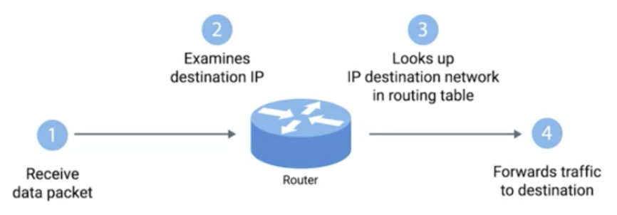

* Routes frames among connected networks
* Router has at least two network interfaces
* Mostly handles routing issue
* Two routing information protocol: Link state routing protocols, Distance-vector protocols

| Static Routing                                                      | Dynamic Routing                              |
| ------------------------------------------------------------------- | -------------------------------------------- |
| when a link or router fails, routing tables must be updated as well | can be computed in a distributed manner      |
| doesn’t adapt to the evolution of the network                       | adapt routing tables with changes in network |

* Router: Move data around large networks WANs → Inspect IP data to determine where to send things
  * Make independent decisions about forward and send data around network
  * Create and update table based on hop, network traffic, reliability
  * Take traffic originating from home to forward it along to the ISP
  * Need configured interfaces, tell connected networks, criteria for what is allowed through routers
  * Can be programmed for multiple protocol
  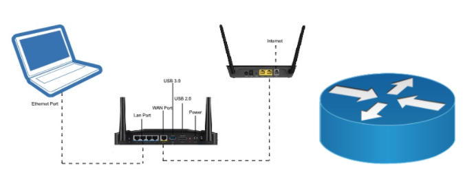

> Algorithm

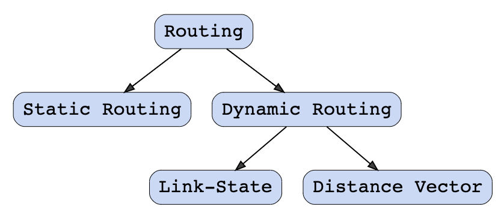

* Distance state protocol: Router B tells A that shortest distance is now B
  * Takes long time in change from far away from it

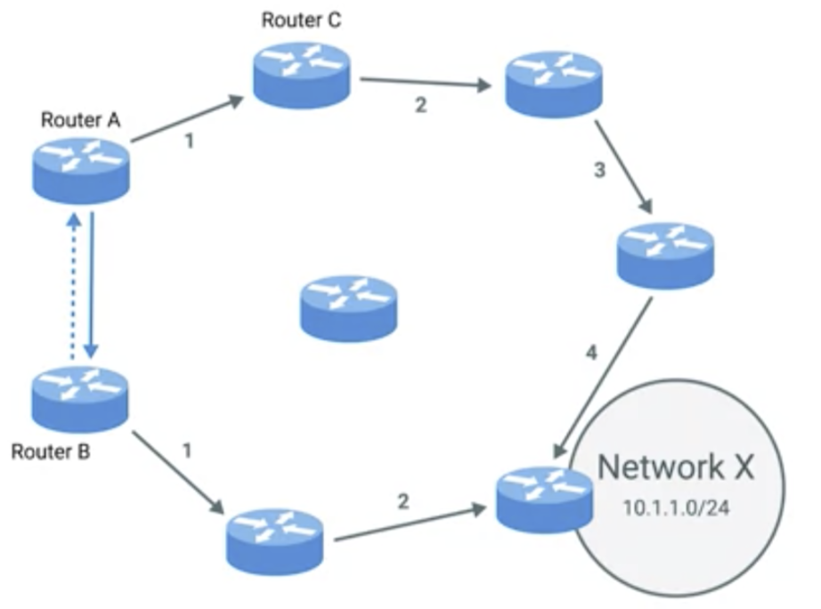

* Link state protocol: Require more memory and processing power
  * Information about each router is propagated to every other router on the autonomous system

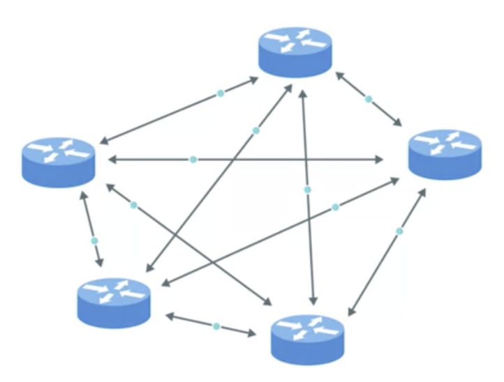

## 4: Trasport

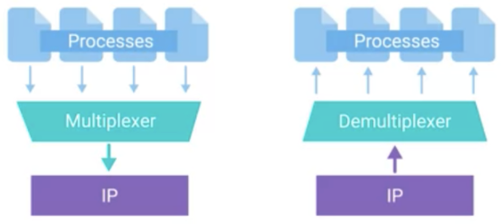

* Ensures error-free / proper sequence / no loss or duplication
* Transport layer handles multiplexing and demultiplexing using port
* Firewall block and allow traffic to various ports

### Port

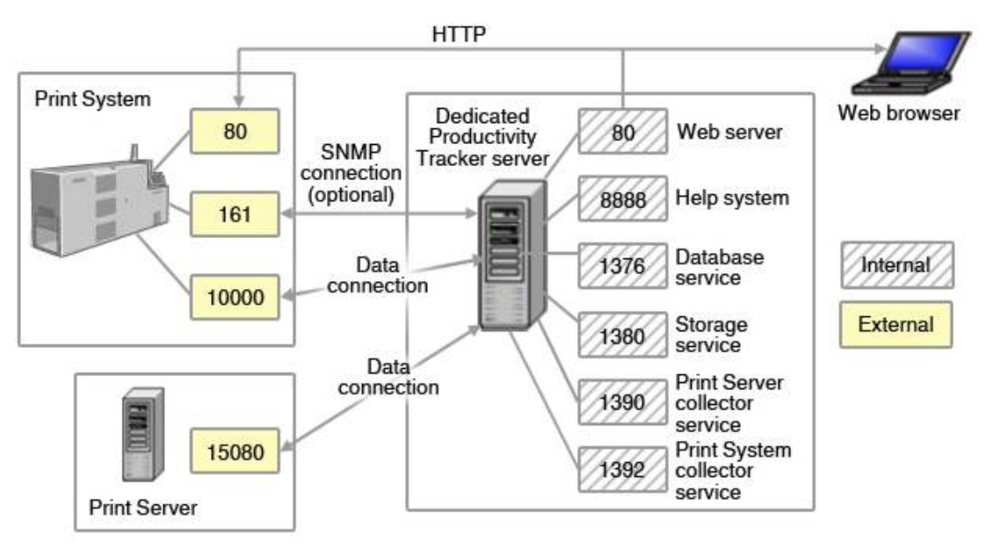

* 16-bit number that's used to direct traffic to specific services running on a networked computer

* 20, 21: File transfer protocol
* 53: domain name system
* 80: HTTP (web service)
* 443: HTTPS
* 1-1023: system ports, standard
* 1024-49151: registered ports
* 49152-65535: dynamic and/or private ports

> Terms

* Forwarding: port preservation source port chosen by a client is the same port used by the router
  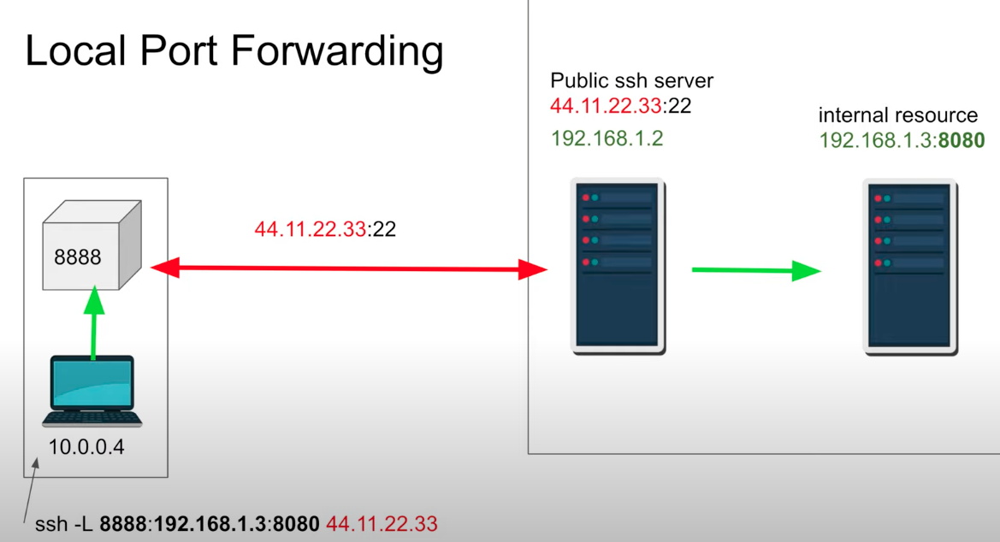
  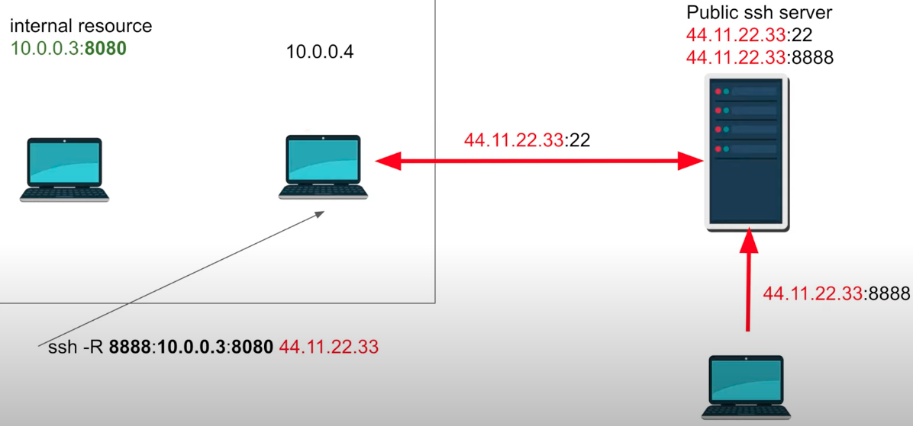
* Preservation: source port chosen by a client is the same port used by the router

* State
  * LISTEN: TCP socket is ready and listening for incoming connections → server only
  * SYN_SENT: Synchronization request has been sent, but no connection yet → client only
  * ESTABLISHED: connection is working order and both sides can send → both
  * FIN_WAIT: FIN has been sent, but corresponding ACK from the other end hasn't been received
  * CLOSE_WAIT: closed at TCP, but application that opened socket hasn't released its hold on the socket
  * CLOSED: Fully terminated

* Segment
  * Source, Destination: communication endpoint (port, ip address)
  * Sequence number: keep track of where in a sequence of TCP segments
  * ACK number: the number of the next expected segmen
  * Header Length: how long the TCP header for this segment is
  * Control flags: URG 1 means urgent → not used in moden network
  * ACK 1 means ack should be examined
  * PSH transmitting device wants receiving device to push currently-buffered data to application on the receiving end ASAP
  * RST one sides in TCP couldn't properly recover from missing / malformed segments
  * SYN make receiving end knowns to examine sequence number field
  * FIN 1 mean transmitting computer doesn’t have any more data
  * Window
  * Checksum: Compared with the header to check data lost / corruption
  * Urgent: Control flag to point out particular segments being important
  * Options: used for more complicated protocol
  * Data payload
  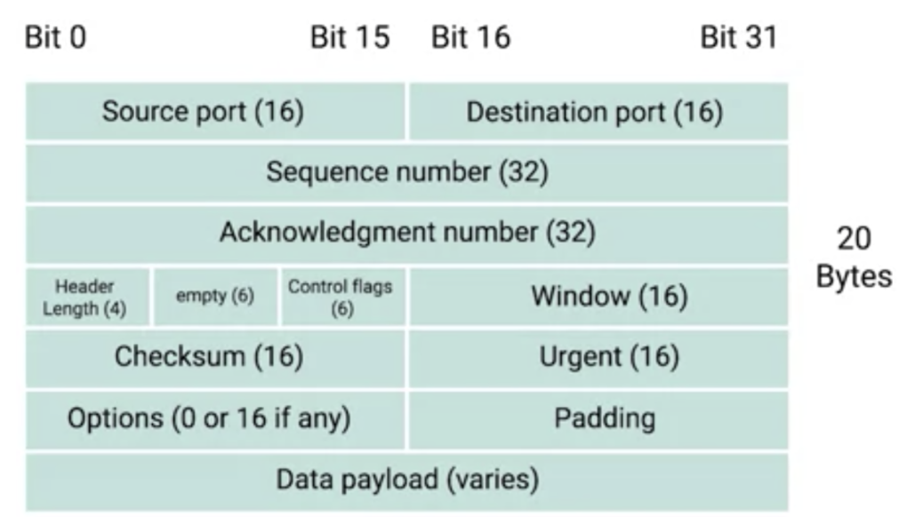




* nmap: show which ports are opened
  * brew install nmap ()

* lsof: list open files
  * -t: terse
  * +L1: select open files that have been unlinked
  * -i:`port`: show what is running on `port`
  * -n: no host names
  * -P: no port names

```sh
# 1. Kill what is running on port
kill -9 $(lsof -ti :80)
```




### Socket

* Interface between application and network
* Once configured the aplication, can pass data to socket for network transmission and recieve data

* UDP (User datagram protocol)
  * uses IP to transport IP datagrams with error correction and protocol port address
  * [+] Performance, useful for messages for not important → streaming video
  * [-] unreliable, no order guarantees
  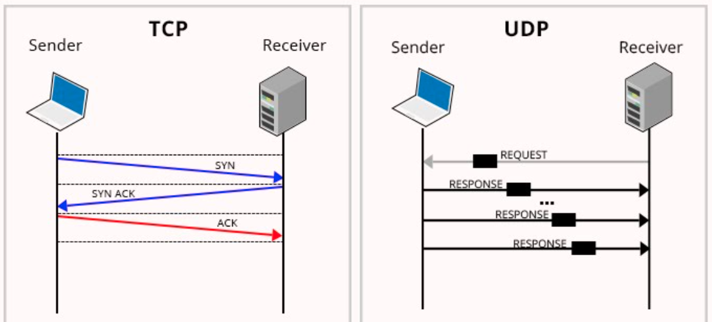

* TCP (Transmission Control Protocol)
  * full duplex P2P connection using 3 / 4 way handshake
  * Error control: can detect errors in segments and make corrections to them
  * Flow control: sender controls the amount of data being sent at once based on the receiver’s specified capacity
  * Congestion Control: in-built mechanisms to control the amount of congestion
  * [+] reliable, connection-oriented protocol to ensure all data is properly transmitted
  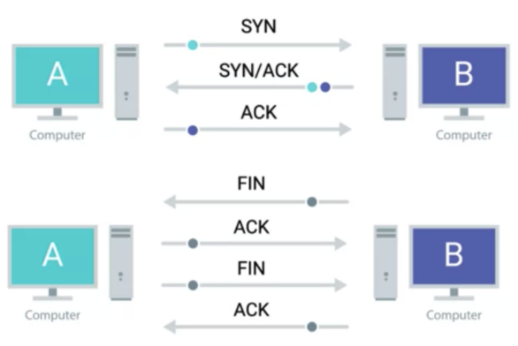




* netstat: review each of your network connections and open sockets
  * -l: only listening sockets
  * -n: Show numerical addresses instead
  * -p: PID / name of program to which each socket belongs
  * -t: tcp
  * -u: udp
  * ESTABLISHED: connection is currently made there
  * LISTEN: socket is waiting for a connection
  * -tupan | grep LISTEN: see open ports

* ss
  * -l: Show listening sockets (22 is opened by SSHD)
  * -p: List process name that opened sockets
  * -n: Don’t resolve service names i.e. don’t use DNS
  * -t / u: Show only TCP / UDP sockets on Linux

```sh
# 1. kill port | kill running on port
netstat -ano | grep :PORT_NUMBER
```




> sys/socket.h

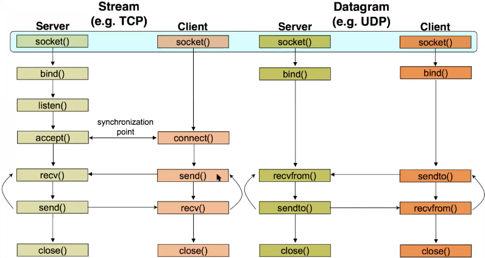

* Internet Protocol family

* SOCK_DGRAM: if only sending, no need to bind
* SOCK_STREAM: destination determined during conn setup
  * don't need to know port sending from

* int accept(int socket, struct sockaddr \*address): blocking waits for connection before returning
  * socklen_t \*address_len: value parameter must be set appropriately before call

* int socket(): Create a socket
  * int domain [PF_INET]: communication domain
  * int type = [SOCKET_STREAM, SOCKET_DGRAM]: communication type
  * int protocol: see files /etc/protocols usually 0

* int bind()
  * int socket: socket id
  * const struct sockaddr *address: ip address and port of the machine
  * socketlen_t address_len: size of the addrport structure

* int connect(int socket, const struct sockaddr \*address, socklen_t address_len)
* int listen(int socket, int backlog)
* ssize_t send(int socket, const void \*message, size_t length, int flags);
* ssize_t recv(int socket, void \*buffer, size_t length, int flags);

```cpp
// 1. Echo server
int socket_desc, client_sock, c, read_size;
struct sockaddr_in server, client;
char client_message[2000];

socket_desc = socket(AF_INET, SOCK_STREAM, 0);
if (socket_desc == -1)
  printf("Couldn't create socket");
puts("Socket created");

server.sin_family = AF_INET;
server.sin_addr.s_addr = INADDR_ANY;
server.sin_port = htons(8888);

if (bind(socket_desc, (struct socketaddr*)& server, sizeof(server)) < 0)
{
  perror("Bind faile,");
  return 1;
}
puts("bind done");

// 2. Echo client
while (1) {
  printf("Enter message : "):
  scanf("%s", message);
  if (send(sock, message, strlen(message), 0) < 0) {
    puts("Send failed");
    return 1;
  }

  if (recv(sock, server_reply, 2000, 0) < 0) {
    puts("recv failed");
    break;
  }

  puts("Server reply : ");
  puts(Server reply);
}
close(sock);
```




## 5: Session

* Facilitating communication between actual application and transport layer
* Takes unencapsulated application layer data from all layers below it, and hands it off to presentation layer

## 6: Presentation

* Making sure that encapsulated application layer data is understood by the application in question
* Encryption or compression of data
* SSL

## 7: [Application](application-layer.md)
