# Operating System

* Availability: make usre system operates correctly and efficiently in an easy-to-use manner
* Resource manager: virtualize resources (CPU, memory, disk) using file, virtual memory, process

* Design Goals
  * abstraction: provide apps with simple, uniform mechanisms
    for manipulating complicated and different low-level hardware devices
  * persistency: stores files persistently, thus making them safe over the long-term
  * concurrency: protection between apps, as well as between the OS and app
  * efficiency: time, memory wise
  * security: protect the hardware from misuse by runaway applications
  * mobility: increasingly important as OSes are run on smaller and smaller device
* Event-driven -> not constantly there monitoring the whole system
  * internal requests (system call), exteneral events (device), exceptions

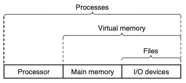

* GNU (Gnu is Not Unix): OS project by Free Software Foundation, first free desktop environment
  * Developed environment with all major components of Unix OS, excep for kernal (LINUX project)

* GNOME (GNU Network Object Model Environment)
  * GTK based linux desktop
  * [+] many keyboard shortcuts
  * [-] limited native function, heaviest resource computer desktop

* GPL (GNU General Public License): software licence

> Types

* Android OS: Linux based operating system without file paging
  * Add battery management
* Java Virtual Machine: Library that abstracts running environment (garbage collection)
  * Not a OS: Cannot control scheduling, hardware resources
* Virtual machine: abstractions of disk, machine
  * Not a OS, disks doesn't understand file system provided by OS

> Terms

* clock cycles
  $$ \text{CPU clock cycles for a program} = \frac{\text{CPU execution time for a program}}{\text{Clock cycle time}} $$

* CPI (clock cycles per instruction): the average number of clock cycles each instruction takes to execute
  $$ CPI = \frac{\text{CPU clock cycles}}{\text{Instruction count}} $$

* CPU Time: the time the CPU spends computing for this task
  * user CPU Time: time spent in the program
  * system CPU time: time spent in the operating system performing tasks on behalf of the program

* DOS (the Disk Operating System)
  * didn’t think memory protection was important -> malicious application could scribble all over memory

* Instruction count: the number of instructions executed by the program

* Kernel: defines handler for each even type
  * Allocate resources, memory, CPU, network
  * Transition from one process to another is managed by the operating system kernel
  * Most applications are not self-contained and make calls (system calls) to Linux kernel and library
  * Kernel time is the time spent in Linux kernel, and user time is time spent in application or library code
  * not a separate process. a collection of code and data structures that the system uses to manage all the processes
  * ex) micro kernel, monolithic kernel, hybrid kernel, exokernel, microkernel
  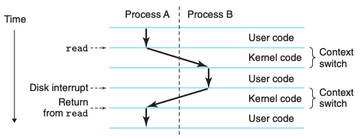

* POSIX: Portable OS Interface, standards specified by the IEEE Computer Society for maintaining compatibility between OS

* Response time (execution time): total time required for the computer to complete a task
  * disk accesses, memory accesses, I/O, operating system overhead, CPU execution

* Throughput (bandwitdh): total amount of work done in a given time, such as megabytes per second for a disk transfer

> Reference

* [Udacity Operating System](https://classroom.udacity.com/courses/ud189)

## Exception

* Any event that can alter normal CPU instruction execution flow

* Kernel may handle unrecoverable faults by killing the user process
  * program fault with no registered handler by the application
  * halt process, write process state to file, destroy process
  * in Unix, default action for many signals (SIGSEGV)
* Faults in the kernel
  * dereference NULL, devide by zero, undefined instructions
  * OS panic: blue screen (kernel is halted, state dumpted to a core file, machine locked)
* Some faults are handled by fixing the exceptional condition and returning to the faulting context
  * page faults cause the OS to place the missing page into memory
* Some faults are handled by notifying the process
  * Fault handler changes the saved context to transfer control
  * Handler must be registered with OS
  * Unix signals or NT user-mode Async Procedure Calls (APCs)
  * [ex] SIGALRM, SIGUP, SIGTERM, SIGSEGV
* [ex] trap, fault (Divide by zero, Segmentation violation) and abort

> Question

* Difference between I/O Interrupt vs Exception
  * external events (serial ports, keyboard) vs instruction faults, (division by zero, undefined opcode)




* unchecked in C++ → compiler doesn’t check if the exceptions are caught or not
* void fun(int a, char b) throw (Exception1, Exception2, ..)

* noexcept: function is declared not to throw any exceptions
  * allows compiler to optimize (Destructor is noexcept by default)

```cpp
#include <iostream>
using namespace std;

// 1. noexcept
int foo() noexcept { throw 1; }
try {
  foo();
} catch (int x) {
  cout << "Error : " << x << std::endl;  # will not be caught
}

// 2. catch child first
class Parent : public exception {
 public:
  virtual const char *what() const noexcept override { return "Parent!\n"; }
};

class Child : public Parent {
 public:
  const char *what() const noexcept override { return "Child!\n"; }  // this function will not be thrown
};

try {
  throw Child();
} catch (Parent &p) {
  cout << "Parent Catch!" << endl;
  cout << p.what();
} catch (Child &c) {
  cout << "Child Catch!" << endl;
  cout << c.what();
} catch (...) {
  cout << "Default Catch!" << std::endl;
}

// 3. Stack rewinding
class Resource {
 public:
  Resource(int id) : id_(id) {}
  ~Resource() { cout << "delete resource " << id_ << endl; }

 private:
  int id_;
};

auto func2 = []() {
  Resource r(2);
  throw runtime_error("Exception from 3!\n");
  return 0;
};
auto func1 = [func2]() {
  Resource r(1);
  func2();
  return 0;
};
try {
  // delete resource 2
  // delete resource 1
  func1();
} catch (exception &e) {
  // Exception : Exception from 3!
  cout << "Exception : " << e.what();
}
cout << endl;
```




* throw
* java.io.IOException: When dealing with I/O in Java
* FileNotFoundException
* printStackTrace();

```java
// 1. Catch all excpetion
try {
  //
} catch (Exception e){
  //
}
```




* Builtins exceptions
  * ImportError
  * NotImplementedError
  * ZeroDivisionError

* sys
  * exc_info(): returns a tuple of three values that give information about the exception

* os
  * environ: dictionary object representing string environment ([ex] environ['HOME'])
  * getenv(): same as os.environ.get() which doesn't raise error if missing

* traceback
  * print_exc()
  * format_exc()

* django
  * APIException
  * MiddlewareNotUsed: in the init function of your middleware to check if used
  * ObjectDoesNotExist: when get doesn't return
  * ValidationError

```py
from django.utils.translation import ugettext_lazy as _
from rest_framework import status
from rest_framework.exceptions import APIException

# 1. Exception trace
import traceback
try:
  raise TypeError("Oups!")
except Exception, err:
  try:
    raise TypeError("Again !?!")
  except:
    pass
  traceback.print_exc()
  var = traceback.format_exc()
  print(var)

# 2. Catch all exception
test_cases = [(1, 0), ('1', 1), (1, 1)]
for x, y in test_cases:
  try:
    z = x / y
  except ZeroDivisionError as e:
    print(e)
  except:         # Catch all exception
    print(sys.exc_info()[0])
  else:
    print("Successful")

# 3. Raise exception
""" Quitely """
class StopExecution(Exception):
  def _render_traceback_(self):
    pass

raise StopExecution

""" Loudly """
def test(a, b):
  try:
    assert a == b
  except AssertionError:
    print(a, b)
    raise

# 4. Raise exception on top of current
try:
  from django.core.management import execute_from_command_line
except ImportError as exc:
  raise ImportError("Couldn't import Django. Are you sure it's installed and "
                    "available on your PYTHONPATH environment variable? Did you "
                    "forget to activate a virtual environment?") from exc

# 5. API Exception
class BadRequest(APIException):
  status_code = status.HTTP_400_BAD_REQUEST
  default_detail = _('Bad Request.')
  default_code = 'Bad Request.'

# 6. Validation function (validator.py)
from django.core.exceptions import ObjectDoesNotExist
from django.core.exceptions import ValidationError
def validate_tasty(value):
  """Raise a ValidationError if the value doesn't start with the word 'Tasty'. """
  if not value.startswith('Tasty'):
    msg = 'Must start with Tasty'
  raise ValidationError(msg)
# title = models.CharField(max_length=255, validators=[validate_tasty])
```




```sh
# 1. Simple try catch
{ # try
    command1 &&
    #save your output

} || { # catch
    # save log for exception
}
```




### Interrupt

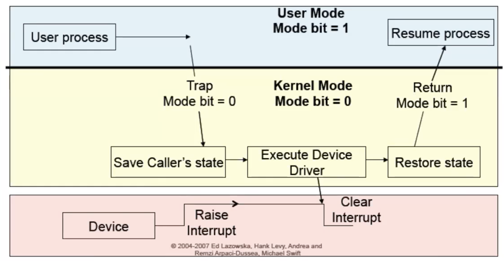


* OS code doesn't have main(), mostly consists of a big list of handlers
* OS can also be interrupted, different interrupt levels
* CPU checks for hardware interrupt signals from APIC after each user mode instructions
* If interrupt signal presents, a kernel routine is called to handle interrupt
  * dispatch routine is compact and fast, coded in assembly language
  * specific handler depends upon the type of interrupt received
* Level-triggered: requested by holding the interrupt signal at its particular (high / low) active logic level
* Edge-triggered: interrupt signaled by a level transition on the interrupt line
* [ex] Timer, Keyboard input

> Terms

* ISR (Interupty Service Routine / Interrupt Handler): special block of code associated with a specific interrupt condition
  * Fast handlers: invoked directly from the IVT whenever interrupt occurs
    * atomic -> uninterruptible, for single-core system temporarily disable interrupts
    * same device might have more data to deliver to the OS, before previous data recieved -> hardware failure
  * Slow handlers: invoked at a later time, lower priority put in OS task queues

* Interrupt Storm: event during which processor receives inordinate # interrupts that consume majority of processor's time
  * live lock (OS perpetually handling interrupts, system is running but appears frozen)

* Interrupt Vector Table: Stores mapping of interrupt type to address of the handler
  * handlers are part of the kernel
  * loaded at booting time
  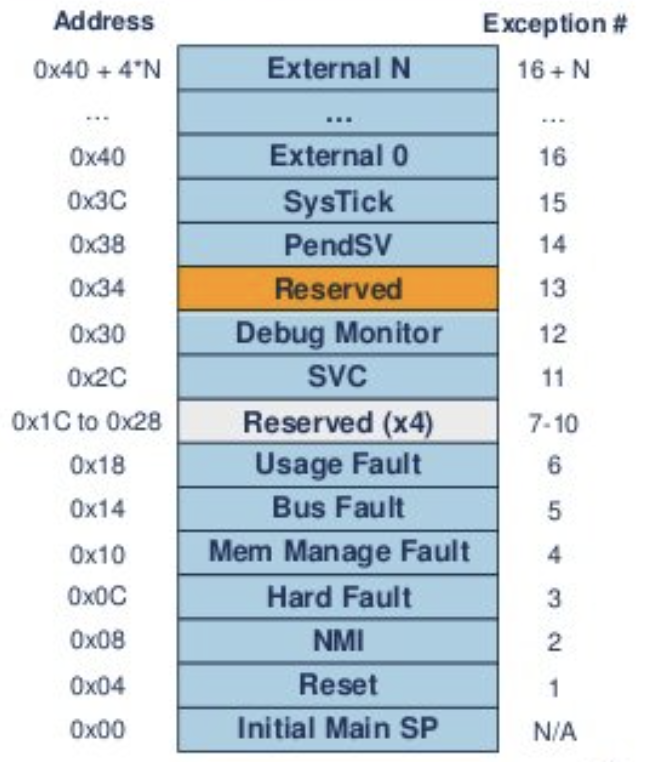

* IDT (Interrupt Descriptor Table): special instructions and data structure to make interupt handle fast
  * First 32 entries are reserved for mapping handlers for CPU faults
  * intel based system

### Process mode

* Hardware must support two modes of operations: kernel mode, user mode

> Terms

* Kernel mode: when it boots and after the operating system is loaded, it executes applications in user mode
  * OS has full access to the resouces
  * Bootstrap
  * System initialization
  * Interrupt and exception
  * Kernel / user mode switching
  * I/O device driver
  * Memory / processor management

* Kernal space: strictly reserved for running a privileged operating system kernel, kernel extensions, and most device drivers

* LDE (Limited direct execution)
  * when boot, initialize trap table, and CPU remembers its location for subsequent use (priviledge instructions)

* Privileged instructions
  * subset of instructions of every CPU restricted only by the OS
  * direct access I/O devices (security, fairness)
  * manipulate memory management state (page table pointer, page protection, TLB management)
  * manipulate protected control registers
  * halt instructions

* Timer: used to prevent a user program from never returning control to the operating system
* Trap instruction: instruction simultaneously jumps into the kernel and raises the privilege level to kernel mode
* Trap table: tell hardware what code to run when exceptional events occur
  * set up in boot time with privileged mode

* User mode: when the operating system is running a user application such as handling a text editor
  * transition to kernel mode occurs when application requests help of OS or an interrupt or a system call occurs
  * mode bit is set to 1 in the user mode
  * ex) instructions to change the program counter (PC) / stack pointer Register
  * ex) load instructions
* User space: memory area where application software and some drivers execute

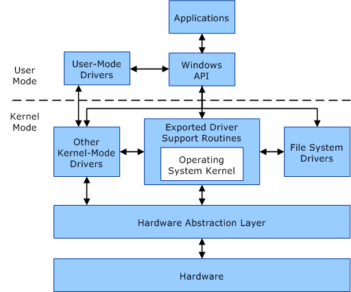

### System call

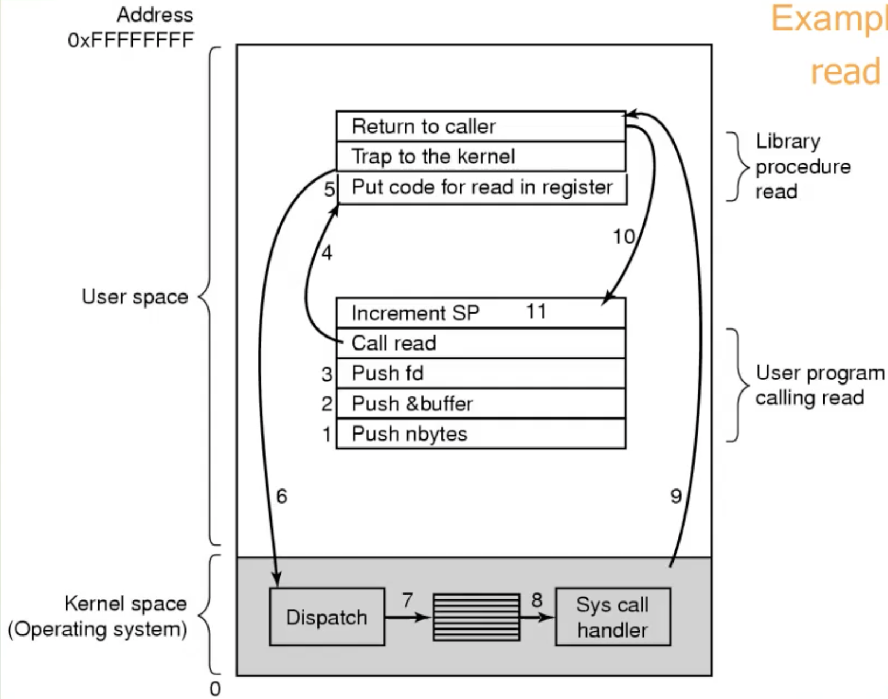

* subroutine built in that allow the kernel to carefully expose certain key pieces of functionality to user programs
* protection: user code cannot specify an exact address to jump to, but rather must request a particular service via number
* system-call number is assigned to each system call
* aka OS provies a standard library to applications (ex: open(), read())

> Blocking

* Doesn't return until the call completes (usually simple job)
* When I/O completes, the process/thread becomes ready
* Example
  * I/O related: File management (CRUD: read(), fread(), getc(), write())

> Non-blocking

* Once the I/O completes an interrupt is delivered to the caller
* The call returns once the I/O is initiated, and the caller continue

* Example
  * Process control: create process, allocate memory
  * Device management: open device, read / write device, mount
  * Information maintenacne: get time, get system data / parameters
  * Communication: create / delete channel, send / receive message

## Process

* Includes code, data, and state information (Knife)
* Independent instance of a running program with Separate address space
* operating system’s abstraction for a running program
  * program appears to have exclusive use of both the processor, main memory, and I/O devices
* sends parents to exit code when exit
* zero is special called init → process that starts the rest
* process information /proc/`PID`/stat file (procfs must be implemented)
* single CPU handles one process at a time (most systems, more processes wait to run than $ CPUs)
* Traditional systems only execute one program at a time, while newer multicore processors can execute several programs simultaneously

> Terms

* Context switching: OS stores state of a process or thread, so later be restored and resume execution
  * Allows multiple processes to share a single central processing unit (CPU)
  * Essential feature of a multitasking operating system
  1. Saves current register values (into the process structure of A)
  2. Restores the registers of Process B (from its process structure entry)
  3. Changes the stack pointer to use B’s kernel stack (and not A’s)
  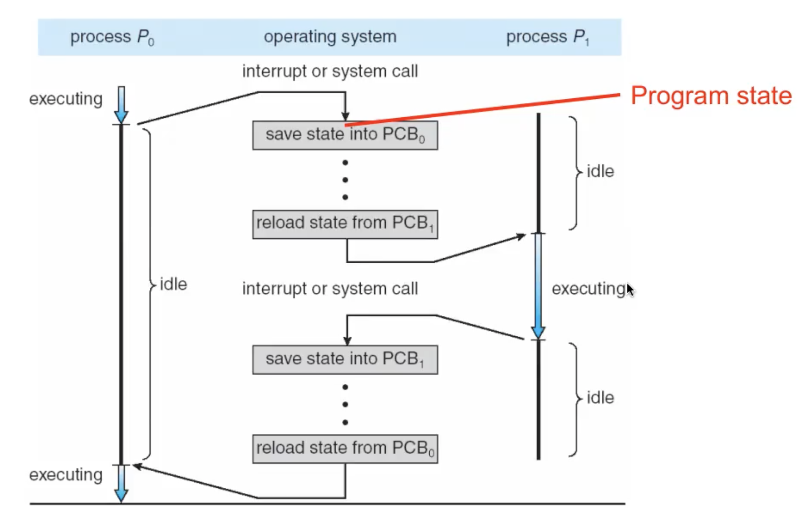

* cooperative approach
  * OS truts the process of the system to behave reasonably
  * the OS regains control of the CPU by waiting for a system call or an illegal operation of some kind to take place
  * [ex] early Mac, old Xerox Alto
  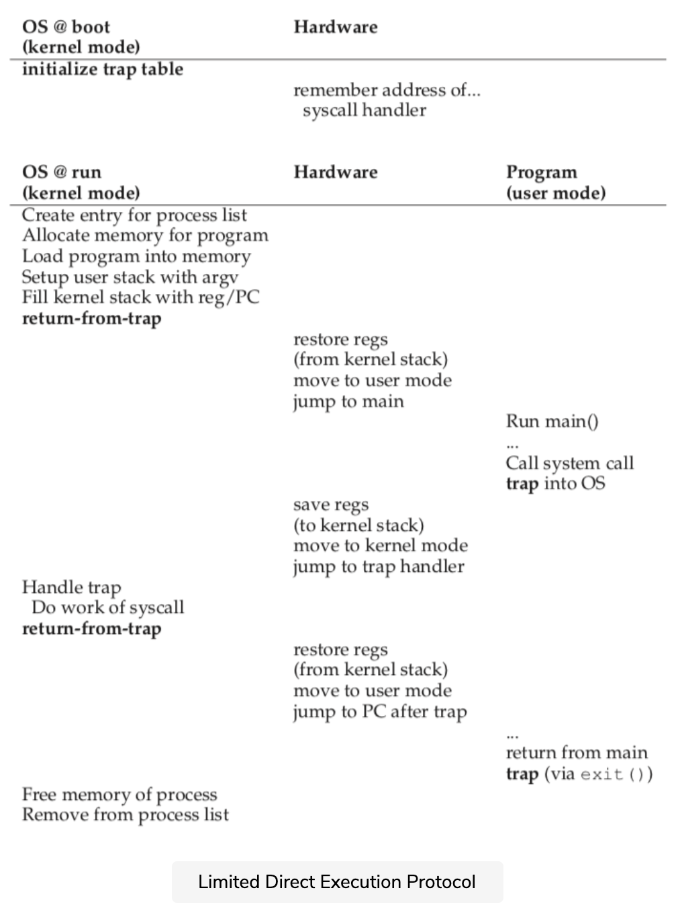

* Non-Cooperative approach
  * A timer device raises an interrupt every so many milliseconds, pre-configured interrupt handler in the OS runs
  * Sceduler: whether to continue running the currently-running process, or switch to a different one
  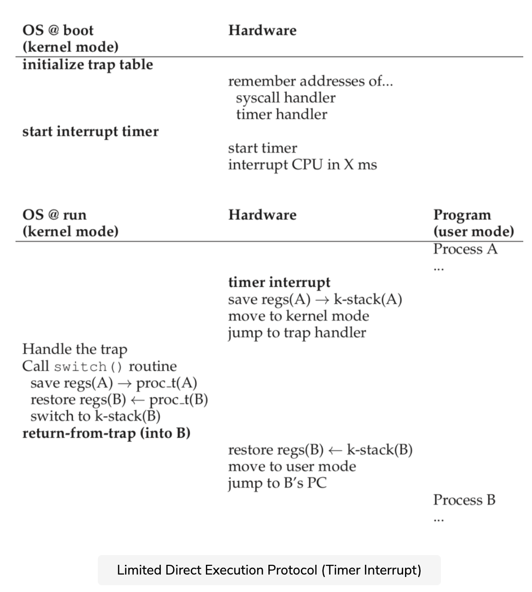

* Daemons: stay in the background

* Inter-process communication: operating system provides to allow the processes to manage shared data
  * sockets and pipes
  * shared memory
  * remote procedure calls

* PCB (Process control block): data structure used by OS to store information about a process
  * When OS stops / run it saves / loads registers in PCB
  * dynamically allocated in OS memory (user process cannot access)
  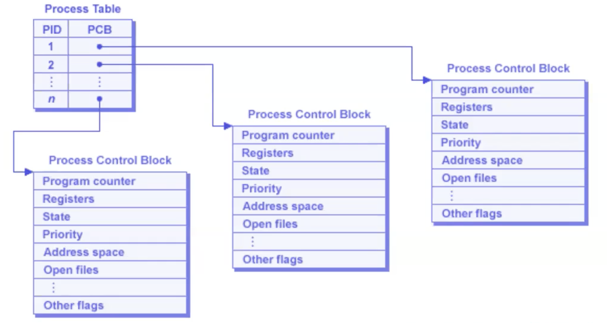

* Process Queue: stores all process

* Component
  * Process State: new, ready, running, waiting, halted
  * PC (Program Counter): address of the next instruction to be executed
  * CPU Registers: index registers, stack pointers, general purpos registers
  * CPU Scheduling information: process priority and pointer
  * Memory Management Information: base/limit information, virtual -> physical mapping
  * Accounting Information: time limits, process number; owner
  * I/O Status information: list of I/O devices allocated to the process
  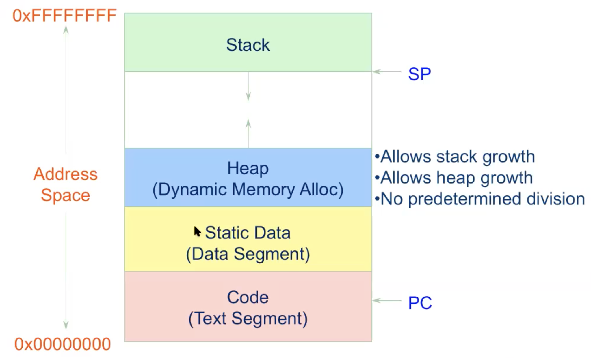

* Status
  * New
  * Running: executing instructions on the cpu
  * Ready: waiting to be assigned to the cpu
  * Waiting: waiting for an envent: I/O completion
  * Halted
  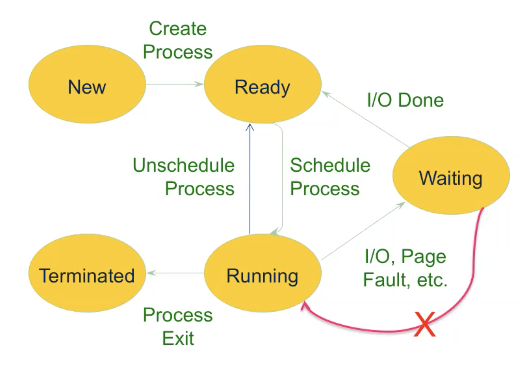




* unistd.h
  * miscellaneous symbolic constants and types, and declares miscellaneous functions
  * seperationg of fork() and exec() is essential in building a UNIX shell
  * pid_t fork(): creates a new child process which is an exact copy of the calling process
    * on success the PID of the child process is returned in to parent's thread and 0 for child's thread
    * child has own unique PID, doesn't inherit parent's memory locks
    * resource utilizations are set to 0
    * child has no signals, zero cpu time
    * errors: not enough memory, excep process limit (RLIMIT_NPROC)
    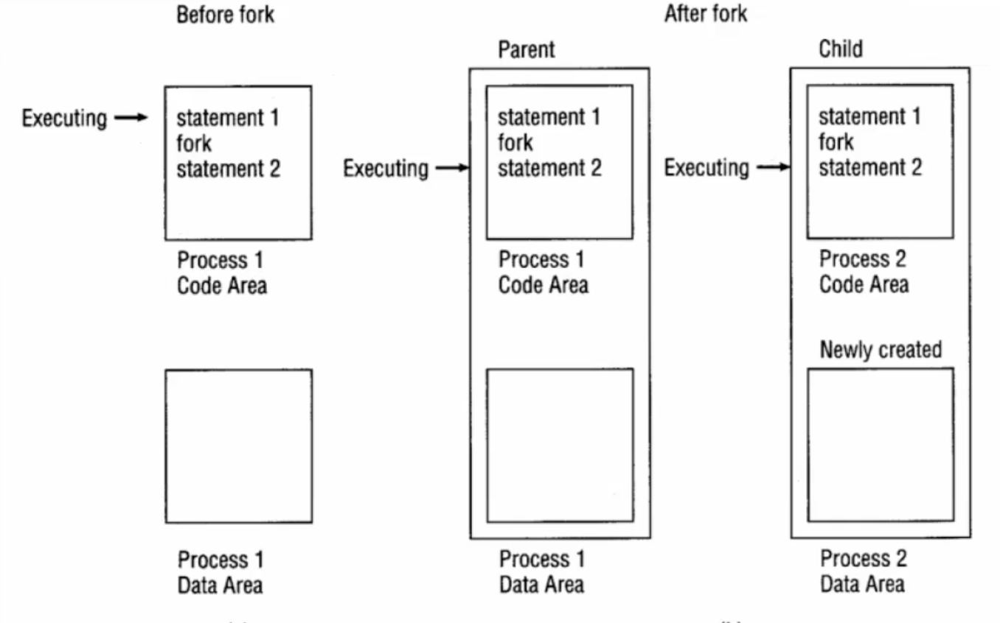
  * getppid(): gets the parent process-id
  * getpid(): get child process-id
  * int execl(): replace the current process image with a new process image
    * const char *path, const char \*arg0
  * int execv(const char \*path, const char *argv[])
  * int execle(const char \*path, const char *arg0)
  * int execve(const char \*path, const char *argv[])
  * int execlp(const char \*file, const char *arg0);
  * int execvp(const char \*file, const char *argv[]);
    * stops the current process, loads the program 'prog' into the process' address space
    * initializes hardware context and args for the new program
    * places the PCB onto the ready queue (doesn't create new process)
    * [error]
    * EACCES: file or a script interpreter is not a regular file
    * ENOMEM: Insufficient kernel memory was available
    * EPERM: The file system is mounted nosuid, the user is not the superuser

  * int unlink(const char *pathname): delete a name and possibly the file it refers to
    * [error]
    * EACCES: Write access to the directory containing pathname isn't allowed for the process's effective UID
    * EBUSY: it is being used by the system
    * ENOMEM: Insufficient kernel memory was available
    * EPERM: system does not allow unlinking of directories, or lack privileges (root)

  * ssize_t read(int fd, void *buf, size_t count);: read from a file descriptor
    * EBADF: fd is not a valid file descriptor or is not open for reading
    * EIO: when the process is in a background process group
    * EINTR: call was interrupted by a signal before any data was read
    * EISDIR: fd refers to a directory

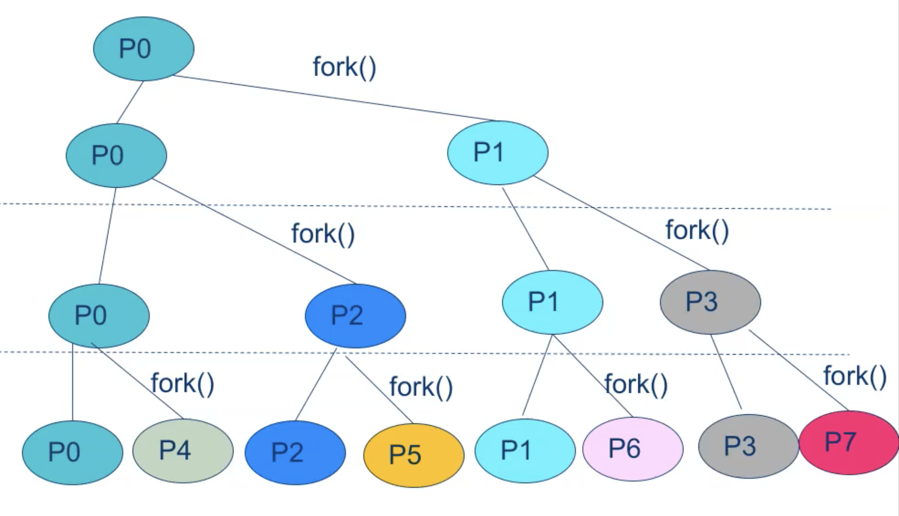
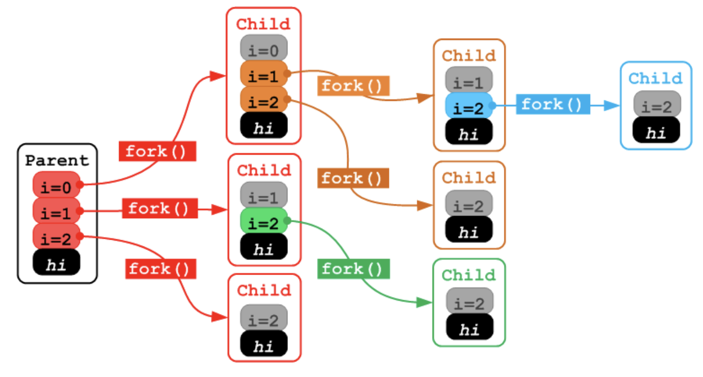

```cpp
// 1: Do child different thing
while (1) {
  int sock = accept()
  if (fork() == 0) // Handle client request
  else             // Close socket
}

// 2: Three fork
fork();
fork();
fork();

// 3: Fork in for
int i;

for (i=0;i<3;i++) {
  fork();
/* [6909][6936] i=0
  [6909][6936] i=1
  [6936][6938] i=1
  [6909][6936] i=2
  [6909][6936] hi
  [6936][6938] i=2
  [6936][6938] hi
  [6938][6940] i=2
  [6938][6940] hi
  [1][6937] i=0
  [1][6939] i=2
  [1][6939] hi
  [1][6937] i=1
  [6937][6941] i=1
  [1][6937] i=2
  [1][6937] hi
  [6937][6941] i=2
  [6937][6941] hi
  [6937][6942] i=2
  [6937][6942] hi
  [1][6943] i=2
  [1][6943] hi */
  printf("[%d] [%d] i=%d\n", getppid(), getpid(), i);
}

printf("[%d] [%d] hi\n", getppid(), getpid());
```




```cpp
#include <stddef.h>
#include <unistd.h>
#include <stdio.h>
#include <stdlib.h>
#include <string.h>
#include <sys/wait.h>
using namespace std;

// 1. print current working directory
char cwd[1024];
getcwd(cwd, sizeof(cwd));
printf("Current working dir: %s\n", cwd);

// 2. run bash in new process using execl
printf("hello world (pid:%d)\n", (int) getpid());
fflush(stdout);
int rc = fork();
if (rc < 0) {
  fprintf(stderr, "fork failed\n");
  exit(1);
} else if (rc == 0) {
  // Write to file
  // close(STDOUT_FILENO);
  // open("./output/p4.output", O_CREAT|O_WRONLY|O_TRUNC, S_IRWXU);
  printf("hello, I am child (pid:%d)\n", (int) getpid());
  fflush(stdout);
  char *myargs[3];
  myargs[0] = strdup("wc");   // program: "wc" (word count)
  myargs[1] = strdup("p3.c"); // argument: file to count
  myargs[2] = NULL;           // marks end of array
  execvp(myargs[0], myargs);  // runs word count
  printf("doesn't print out");
} else { // parent goes down this path (original process)
  int wc = wait(NULL);
  printf("parent of %d (wc:%d) (pid:%d)\n", rc, wc, (int) getpid());
}
// hello world (pid:29383)
// hello, I am child (pid:29384)
//      29     107    1030 p3.c
// hello, I am parent of 29384 (rc_wait:29384) (pid:29383)

// 0: fork if
int main(int argc, char *arg[]) {
  if (fork()) // 1 -> 2
    fork();   // 1 -> 3
  else {
    fork();   // 2 -> 4
    char *argv[2] = {"/bin/ls", NULL};
    execv(argv[0], argv); // 2, 4 calls
    fork(); // never reach
  }
}
```




* Process
  * pid: Return the process ID
  * Process(target=f)
  * start()
  * join(`timeout`): method blocks until the process whose join() method is called terminates

* os
  * getuid(): current process’s real user id
  * getpid(): current process id
  * fork(): an operation whereby a process creates a copy of itself. usually a system call, implemented in the kernel

* concurrent.futures
  * as_completed(fs, timeout=None): returns an iterator over the Future instances
  * ProcessPoolExecutor(initializer=init_globals, initargs=(counter,))
  * submit(fn): returns Future object
  * shutdown(wait=True): free using resources when currently pending futures are done executing
  * cancel()
  * cancelled()
  * running()
  * done()
  * result(): returns the value returned by the call

* shlex
  * split(command_line): split command line into list

* multiprocessing: used for CPU intensive tasks
  * new process has \_\_mp_main\_\_
  * cpu_count(): total number of cpu
  * join(): Wait worker processes to exit, must call close|terminate()
  * imap / map(func, iterable[, chunksize]): use imap to lower memory usage for long iterables
  * starmap(func, iterable[, chunksize]): [(1,2), (3, 4)] ⇒ [func(1,2), func(3,4)]
  * RawArray: Raw cannot be synchronized

* subprocess
  * run(["ls", "-l"]): simplified Popen, execute and wait
    * capture_output=True
    * text=True
  * Popen(args): Execute a child program in a new process
    * stdout=subprocess.PIPE
    * stderr=subprocess.PIPE
    * universal_newlines=False: input/output is accepted as bytes, not Unicode
    * attributes
      * returncode
    * methods
      * communicate() -> Tuple(byte, byte): returns stdout and sterr of output
      * poll(): update return code
      * wait(): Wait for child process to terminate

```py
import os
import subprocess
import time
from collections import deque

def top():
  cpu_usages = [1]
  while True:
    process = subprocess.Popen("ps -a -o %cpu,%mem,cmd".split(), stdout=subprocess.PIPE)
    out, _ = process.communicate()
    try:
      cpu_usages.append(int([line.split()[0] for line in out.decode('utf-8').split('\n') if "_type_" in line][0]))
      print(cpu_usages)
      time.sleep(0.1)
    except Exception as e:
      return sum(cpu_usages) / len(cpu_usages)

def cpu_usage():
  p = subprocess.Popen(['/usr/bin/time'] + ["ls"], stdout=open(os.devnull, 'wb', 0), stderr=subprocess.PIPE)
  with p.stderr:
    q = deque(iter(p.stderr.readline, b''), maxlen=2)
    rc = p.wait()
  return b''.join(q).decode().strip()
```




* $$: PID of the current instance of shell (same in subshell)
* PPID (readonly): The process ID of the shell’s parent process




### IPC

* Inter-process communication is mechanisms an operating system provides to allow the processes to manage shared data




* sys/mman.h
  * mmap: map files or devices into memory
    * PROT_READ | PROT_WRITE
  * unmap

```cpp
#include <sys/mman.h>

int main(int argc, char** argv) {
  int fd = open("./sometext.txt", O_RDONLY, S_IRUSR | S_IWUSR);
  struct stat sb;

  if (fstat(fd, &sb) == -1)
    perror("Couldn't get file size");
  printf("file size is %ld", sb.st_size);
  char *file_in_memory = mmap(NULL, sb.st_size, PROT_READ, MAP_PRIVATE, fd, 0);
  for (int i = 0; i < sb.st_size; i++)
    printf("%c", file_in_memory[i]);
  printf("\n");
  munmap(file_in_memory, sb.st_size);
  close(fd)
}
```




## Thread

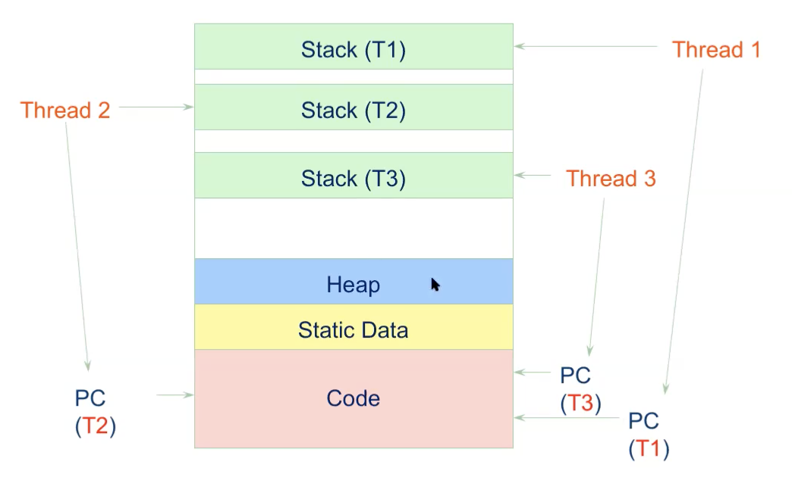

* thread information in /proc/`PID`/stat/task/`thread_id`/stat file (procfs must be implemented)
* defines a sequential execution stream within a single bounded process
* the unit of sceduling: lightweight than process, multithreading make program run faster with mulitple available processors
* shared information created by same process: easier to share data between threads
  * processor info, memory (global data: code, heap, page table, stats)
  * I/O and file: communication ports, directories and file descriptor
* Interfaces
  * create(), fork(): create a new thread of control
  * setstate(): set state of the thread
  * stop(): stop the calling thread, also thread_block
  * start(thread_t): start the given thread
  * yield(): voluntarily give up the processor
  * exit(): terminate the calling thread, alsso thread_block
  * join(): cause the current thread to pause execution until t's thread terminates

* TCB (Thread Control Block): Handle Threadstatus, Stack, name, machineState

> Terms

* Daemon threads
  * a low priority thread (in JVM) that runs in the background to perform tasks (e.g. garbage collection)
  * can exit JVM (if daemon thread is running) when all non-daemon threads finish their execution
  * Threads that should be properly terminated (Writing to file) shouldn’t be Daemon
* Detached threads
* Joinable threads
  * Doesn’t get destroyed when it terminates

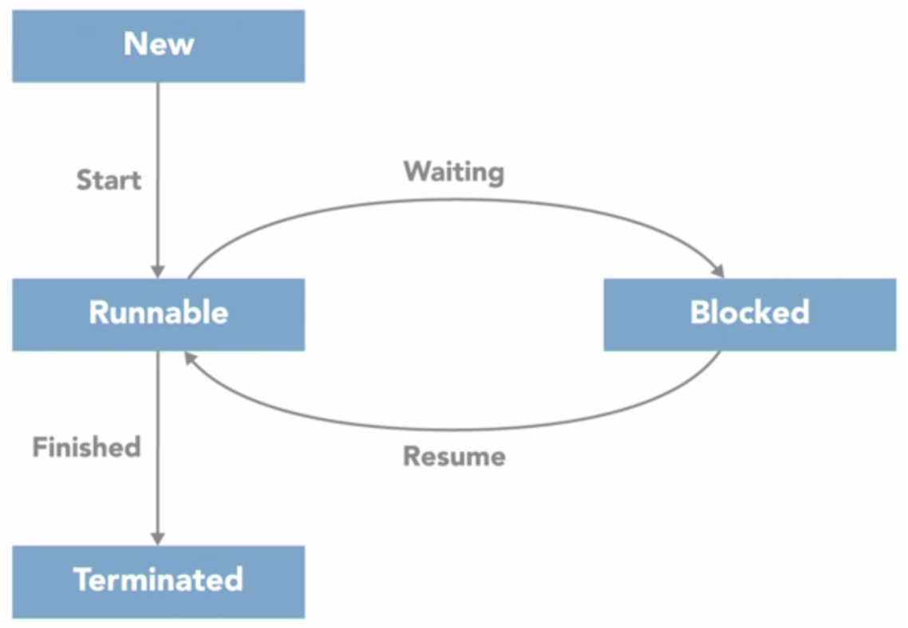

> Question

* Kernel thread vs User thread
  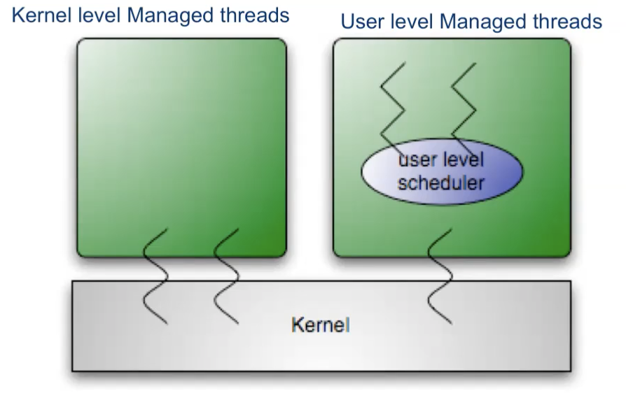
  * User-lvel threads are invisible to the OS -> not well integrated so we can use both
  * Can associate a user-level thread with a kernel level thread
  * Multiplex user-level threads on top of kernel-level threads

| User Level (thread in JVM)               | Kernel Level                                    |
| ---------------------------------------- | ----------------------------------------------- |
| Faster (up to 100x)                      | Slower                                          |
| Thread library (thread control block)    | OS supports creation of Kernel Threads          |
| generic, run on any OS                   | Specific to the OS                              |
| cannot take advantage of multiprocessing | Kernel routines themselves can be multithreaded |




* pthread: Thread is joinable by default in pthread library
  * int ptrhead_create()
    * pthread_t * thread: structure of type pthread_t
    * const pthread_attr_t * attr: specify any attributes this thread might have (pagesize)
    * void *(*start_routine(void*)): which function should this thread start running in
    * void *arg: argument to be passed to the function
  * int pthread_join()
    * ptrhead_t thread: used to specify which thread to wait for
    * void **value_ptr: pointer to the return value you expect to get back

```cpp
#include <pthread.h>
#include <stdio.h>
#include <stdlib.h>
#include <unistd.h>
#include <assert.h>

// 1. agree between two threads
int whos_better;
void* f1(void* arg){
  whos_better = 1;
  while (1)
    printf("Thread 1 thinks %d is better.\n", whos_better);
  return NULL;
}

void* f2(void* arg){
  whos_better = 2;
  while (1)
    printf("Thread 2 thinks %d is better.\n", whos_better);
  return NULL;
}

int main(int argc, char **argv) {
  pthread_t th1, th2;
  pthread_create(&th1, NULL, f1, NULL);
  pthread_create(&th2, NULL, f2, NULL);
  pthread_join(th1, NULL);
  pthread_join(th2, NULL);
  pthread_exit(NULL);
}

// Thread 1 thinks 2 is better.
// Thread 1 thinks 2 is better.
// Thread 2 thinks 2 is better.
// Thread 2 thinks 2 is better.

// 2. thread with argument
typedef struct {
  int a;
  int b;
} myarg_t;

void *mythread(void *arg) {
  myarg_t *args = (myarg_t *) arg;
  printf("%d %d\n", args->a, args->b);
  return NULL;
}

int main(int argc, char *argv[]) {
  pthread_t p;
  myarg_t args = { 10, 20};
  int rc = pthread_create(&p, NULL, mythread, &args);
  assert(rc == 0);
  (void) pthread_join(p, NULL);
  printf("done\n");
  return 0;
}
```




* Runnable: Thread has a consturctor which accepts Runnable instance
  * run(): invoking start() of Thread

```java
// 1. extends class Thread
public class Thread1 extends Thread {
  @Override
  public void run() {
    System.out.println("Thread1 name is " + Thread.currentThread().getName());
    System.out.println("Thread1 id is " + Thread.currentThread().getId());
  }
}

// 2. impement Runnable
public class Thread2 implements Runnable {
  @Override
  public void run() {
    System.out.println("Thread2 ThreadId: " + Thread.currentThread().getId());
  }
}
new Thread(new Thread2()).start()
```




> threading

* Create threads with function or inherit from subclass Thread (\_\_init__, run)
* New threads will inherit daemon status from their parent
* Python thread cannot be turned into a daemon thread after it has been started

* enumerate(): list of all Thread objects currently alive
* current_thread() / main_thread(): current / main Thread (Python interpreter was started)

* Thread(target=f, kwargs={'x': 1}): kwargs
  * is_alive() / isDaemon()
  * get_native_id(): Native integral TID of the current thread assigned by kernel
  * join(timeout=None): Wait until thread terminates
  * start(): must be called at most once per thread object
  * daemon: whether this thread is a daemon
  * name: A string used for identification purposes only
  * native_id: The native integral thread ID of this thread

```py
import os
import time
import threading
from contextlib import nullcontext

# 1. Thread
class MyThread(threading.Thread):
  def __init__(self, name, counter):
    threading.Thread.__init__(self)
    self.name = name
    self.counter = counter

  def run(self):
    print("Starting " + self.name)
    while self.counter:
      time.sleep(1)
      print(f"{self.name} {time.ctime(time.time())}")
      self.counter -= 1
    print("Exiting " + self.name)


if __name__ == "__main__":
  thread1 = MyThread("Thread-1", 2)
  thread2 = MyThread("Thread-2", 3)
  thread1.start()
  thread2.start()
  print("Exiting Main Thread")

# 2. threading
### CPU Water
def cpu_waster():
  while True:
    pass

print('\n  Process ID: ', os.getpid())
print('Thread Count: ', threading.active_count())
for thread in threading.enumerate():
  print(thread)

for i in range(12):
  threading.Thread(target=cpu_waster).start()

print('\n  Process ID: ', os.getpid())
print('Thread Count: ', threading.active_count())
for thread in threading.enumerate():
  print(thread)
```




## Virtual Memory

* Abstraction that the OS will provide for managing memory is VM
* Map Virture page number(VPN) + offset to Page frame numbers(PFN)
* [+] Transparency: program behaves as if it has its own private physical memory
* [+] Efficiency: in terms of time and space -> requires hardware support as OS management algorithms
* [+] Protection: make sure to protect processes from one another as well as the OS itself from processes

> Terms

* Fixed partitions: number of partitions in RAM are fixed and equal size
  * [+] easy to implement, fast context switch
  * [-] internal fragmentation: one process might not fit to a single partition or too small

* Variable partitions: Flexible size of each partition
  * Must use compaction: Use linkedlist or bitmap to find place (similar to garbage collection)
  * Best fit, First fit, Next fit, Worst fit(search for the largest hole), Quick fit (maintains common requested size)
  * [+] efficient memory acllocation for variable size
  * [-] external fragmentation: too small to allocate to any process

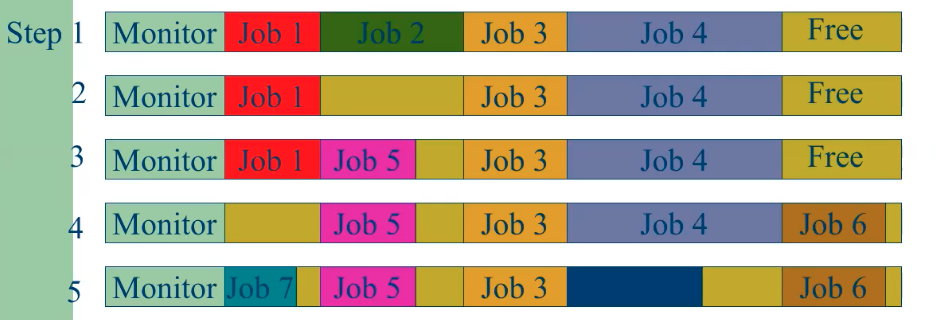

* Virtual address space: Protection is provided as program cannot reference memory outside of tis VAS

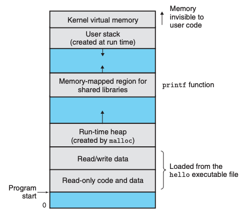




```cpp
#include <unistd.h>
#include <stdio.h>
#include <stdlib.h>

// 1. Memory address
int *p = malloc(sizeof(int));
assert(p != NULL);
printf("(%d) address pointed to by p: %p\n", getpid(), p);
*p = 0; // a3
while (1) {
  Spin(1);
  *p = *p + 1;
  printf("(%d) p: %d\n", getpid(), *p); // a4
}
// ./mem &; ./mem &
// p : 1
// p : 1
// p : 2
// p : 2 ...
```




### Paging

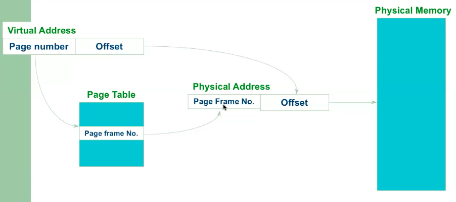

* Stored in memory
* 4k or 8k in (2020s): 20 bits page number, 12 bits offset within a page
* Small pages
  * [+] less fragmentation
  * [-] locality of reference tends to be small
  * [-] require large page tables
  * [-] more TLB misses
* Large pages
  * [+] Small page table, fewer TLB misses
  * [+] I/O transfers have high seek time, so better to transfer more data per seek
  * [-] Harder to support multiple processes
  * [-] Internal fragmentation

* [+] flexibility: system will be able to support the abstraction of an address space effectively
* [+] Simplicity: free-space management
* [-] Memory reference overhead: use a hardware cache of lookups
* [-] Page table size: many processes or huge data, page the page table

> Terms

* Page fault: act of accessing a page that is not in physical memory
* Page fault handler: run to service page fault, and to arrange for the transfer of the desired page from disk to memory
* Swap space: reserve some space on the disk for moving pages back and forth
  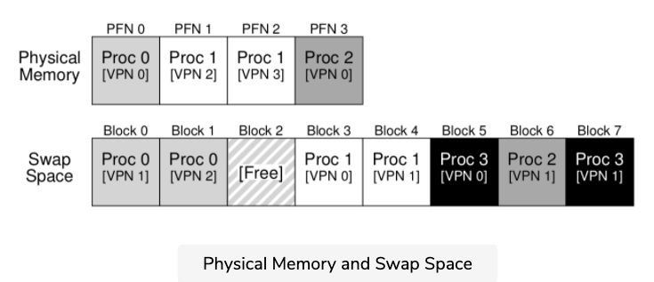

* Working set: number of pages referenced in the interval (t, t - w)
  * size changes with program locality
  * set of pages a process needs in memory to prevent heavy faulting
  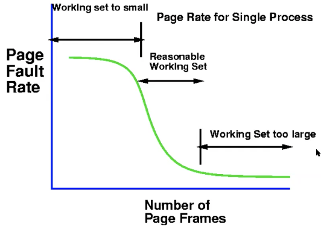

> Question

* 32bit system with 1K pages, offest is 10bits and single level paging
  * How many bits are in the VPN?: 32 - 10 = 22 bits
  * For a virtual address of 0xFFFF, what is virtual page number?
    * 0xFC00 (0x0000FFFF & 0xFFFFFC00) is page address
    * 0x3F (0xFC00 >> 10)
  * What is physical address of the base of physical page number 0x4?
    * 4 \* 1k = 4096
  * If virtual page for 0xFFFF is mapped to physical page number 0x4,
    what's physical address corresponding to virtual address 0xFFFF
    * 0x100 (physical) + 0x3FF (offset) = 0x13FF

* 44bit virtual address, page size is 64K and 4bytes per page table entry
  How many pages are in the virtual address space?
  * \# pages = 2^44 (virtual address space) / 2^16 (page size) = 2^28

* When do most of the operating systems run a background thread to evict pages to free memory space?
  * when they notice​ fewer​ HW pages available than LW pages available

* What would be valid, reference, modified bit immediately after a successful store instruction to a page in memory
  * 1, 1, 1

* What is the most important factor in determining the page size
  * TLB hit rate

* For three page frames, how many page faults would be generated

```cpp
int A[][] = new int[100][100];
// 5000
for (int j = 0; j < 100; j++)
  for (int i = 0; i < 100; i++)
    A[i][j] = 0;
// 50
for (int i = 0; i < 100; i++)
  for (int j = 0; j < 100; j++)
    A[i][j] = 0;
```




```py
# 1. Hardware Flow
VPN = (VirtualAddress & VPN_MASK) >> SHIFT
(Success, TlbEntry) = TLB_Lookup(VPN)
if Success:  # TLB Hit
  if (CanAccess(TlbEntry.ProtectBits) == True)
    Offset = VirtualAddress & OFFSET_MASK
    PhysAddr = (TlbEntry.PFN << SHIFT) | Offset
    Register = AccessMemory(PhysAddr)
  else
      RaiseException(PROTECTION_FAULT)
else:  # TLB Miss
  PTEAddr = PTBR + (VPN * sizeof(PTE))
  PTE = AccessMemory(PTEAddr)
  if not PTE.Valid:
    RaiseException(SEGMENTATION_FAULT)
  else
    if CanAccess(PTE.ProtectBits) == False:
      RaiseException(PROTECTION_FAULT)
    else if (PTE.Present == True)
      # assuming hardware-managed TLB
      TLB_Insert(VPN, PTE.PFN, PTE.ProtectBits)
      RetryInstruction()
    else if (PTE.Present == False)
      RaiseException(PAGE_FAULT)

# 2. Software Flow
PFN = FindFreePhysicalPage()
if (PFN == -1)              # no free page found
  PFN = EvictPage()         # run replacement algorithm
DiskRead(PTE.DiskAddr, PFN) # sleep (waiting for I/O)
PTE.present = True          # update page table with present
PTE.PFN = PFN               # bit and translation (PFN)
RetryInstruction()          # retry instruction
```




### Page Table

* data structure that is used to map virtual addresses to physical address

> Terms

* valid bits: indicate whether the particular translation is valid
* protection bits: whether the page could be read from, written to, or executed from
* present bit: whether this page is in physical memory or on disk

* Page Table Entries: control mapping, indicate protection / page fault (1ms per level)
  * Modify bit (1): whether the page has been written
  * Reference (1): whether page has been accessed
  * Valid (1): whether PTE can be used
  * Protection (2): what operations are allowed on page
  * page frame number (20): determines physical page
  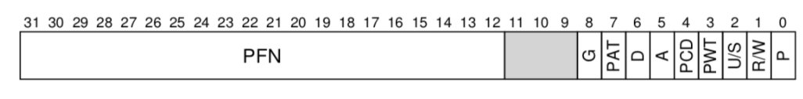

> Question

* Why multilevel page table is used?
  * tables that are in-memory can be smaller than single level page table
* Inverted page table has one entry for each physical page. How is this table stored and used?
  * stored as hash table with {(pid, VPN): PPN}
  * On TLB miss, searched with key to find matching PPN and entries are updated

### Segment

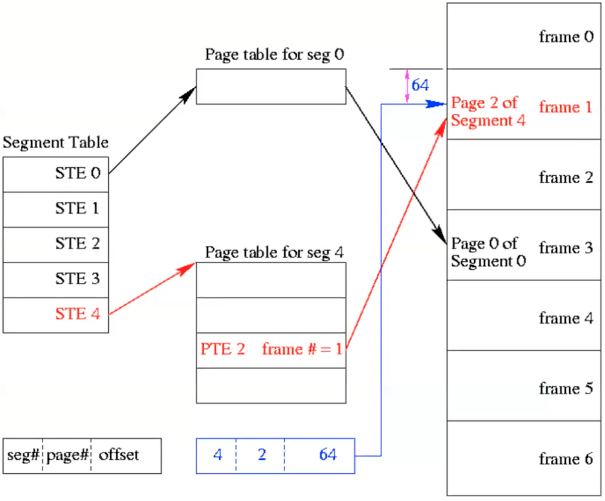

* Wihtin segment, memory are contiguous




```py
SN           = (VirtualAddress & SEG_MASK) >> SN_SHIFT
VPN          = (VirtualAddress & VPN_MASK) >> VPN_SHIFT
AddressOfPTE = Base[SN] + (VPN * sizeof(PTE))
```




### TLB

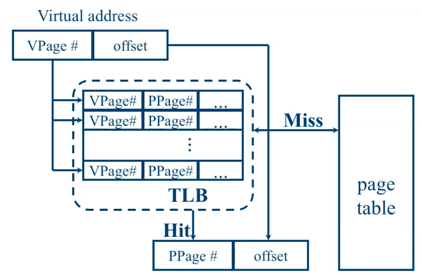

* [-] 2^20 page entry 4 bytes on PTE take 2^22 bytes (4 MB) per process
* [+] TLB miss handling takes 1us
* [+] Use 2 level table 4kb + 4kb if we use multi-level page

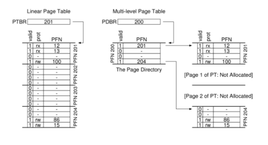

* [+] Inverted page table: entry tells which process is using this page
  which virtual page of that process maps to this physical page

* 32, 64, 128 fully associative cache so entries looked up in parallel, exploiting locality (99%)
* With PTE + offset can directly calculate physical address
* Table Lookaside Buffer (address-translation cache) is part of the chip's memory-management unit (Hardware)
  * Hardware (MMU) loaded: OS maintains tables, HW accesses them directly
  * Software loaded (MIPS, Sparc, Alpha): TLB faults to OS then finds PTE, Table can be in flexible OS (20 - 200cycles)
* Cache of popular virtual page # to PTEs done in a single machine cycle
  * Hit: TLB holds the translation for the requested virtual address
* Thread context switch doesn't require TLB flush
  * ASID (address space identifier) field in TLB so process can share TLB

> Terms

* PDE (page directory entry): conatined in first page with valid bit and PFN (Page Frame Nubmer)
  * Valid: at least one of the pages of the page table that the entry points to valid

* **VPN** (Virtual page number): match with the virtual address
* **Physical page number**: translated address
* **Valid**
* **Access bits**: kernel and user
* process tag, reference, modify, cacheable

> Question

* TLBs are more beneficial with multi-level page tables than with linear (single-level) page tables
  * True; if a TLB hit, able to avoid more memory lookups for page translation (higher cost of a miss).




```py
# 1. Cache Access
VPN = (VirtualAddress & VPN_MASK) >> SHIFT
(Success, TlbEntry) = TLB_Lookup(VPN)

if Success:
  if CanAccess(TlbEntry.ProtectBits):
    Offset   = VirtualAddress & OFFSET_MASK
    PhysAddr = (TlbEntry.PFN << SHIFT) | Offset
    Register = AccessMemory(PhysAddr)
  else:
    RaiseException(PROTECTION_FAULT)
else:
""" 1. Software managed TLB """
  raise TLB_MISS
""" 2. Hardware managed TLB """
  PTEAddr = PTBR + (VPN * sizeof(PTE))
  PTE = AccessMemory(PTEAddr) # hardware accesses the page table to find the translation
  if not PTE.Valid:
    raise SEGMENTATION_FAULT
  elif not CanAccess(PTE.ProtectBits):
    raise PROTECTION_FAULT
  else:
    TLB_Insert(VPN, PTE.PFN, PTE.ProtectBits)
    RetryInstruction()
""" 3. Multilevel TLB """
  PDIndex = (VPN & PD_MASK) >> PD_SHIFT
  PDEAddr = PDBR + (PDIndex * sizeof(PDE))
  PDE = AccessMemory(PDEAddr)
  if not PDE.Valid:
    raise SEGMENTATION_FAULT
  elif not CanAccess(PTE.ProtectBits):
    raise PROTECTION_FAULT
  else:
    PTEAddr = (PDE.PFN << SHIFT) + (PTIndex * sizeof(PTE))
    PDE = AccessMemory(PDEAddr)
    TLB_Insert(VPN, PTE.PFN, PTE.ProtectBits)
    RetryInstruction()
```




## Caching

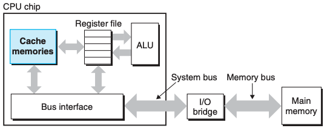

> Terms

* L Cache: implemented using SRAM (static random access memory)
  * temporal/spatial locality
  * L1: * on processor chip accessed nearly as fast as the register file (10,000 bytes)
  * L2: connected to processor by special bus, 5 ~ 10 times slower than L1 (0.1m - 1m bytes)

* Associative Mapping
  * Full associativity mapping searches tag through entire cache
  * locality of reference principle: recently requested data is likely to be requested again
  * main memory: 256 blocks of 128 Kbits
  * cache memory: 16, 32-bit words and capacity of 32k words
* Direct Mapping
  * each block of main memory maps into one unique line of cache
  * bad when a program accesses 2 blocks that map to the same line
  * victim cache doesn't swap data to main memory but places into a specified line of cache

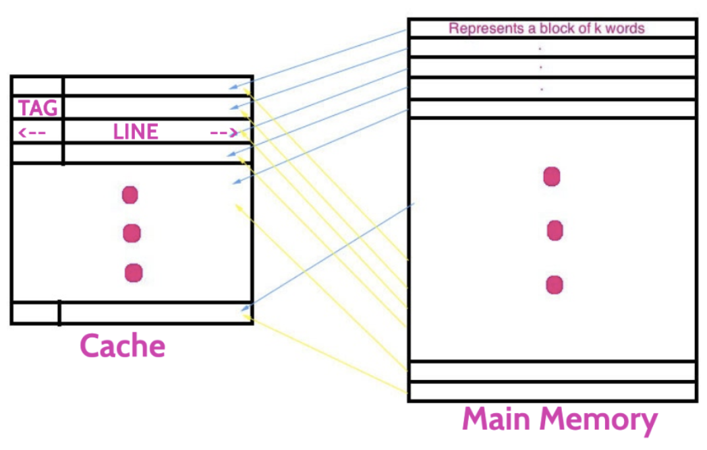

* File buffer cache: system wide used and shared by all processes
  * Reading from cache makes a disk perform like a memory
  * Application exhibit locality for reading and writing

> Question

* 22-bit address space, 512-byte cache, a cache block size of 64 bytes. Bits for index/tag?
  * 3 / 13
  * 2j: associativity
  * 2k: cache entries (indices)
  * 2m: address
  * 2n: block size
  * line: of bits (aka, index)
  * tag: of lines required to uniquely identify a memory address block
  * word: least significant bits which uniquely identify a word on a line of cache




* Redis3, Memcached, Redis 5




```js
import React from 'react';

const App = () => {
  const stories = [
    {
      title: 'React',
      url: 'https://reactjs.org/',
      author: 'Jordan Walke',
      num_comments: 3,
      points: 4,
      objectID: 0,
    },
    {
      title: 'Redux',
      url: 'https://redux.js.org/',
      author: 'Dan Abramov, Andrew Clark',
      num_comments: 2,
      points: 5,
      objectID: 1,
    },
  ];

  const [searchTerm, setSearchTerm] = React.useState(
    localStorage.getItem('search') || 'React'
  );

  React.useEffect(() => {
    localStorage.setItem('search', searchTerm);
  }, [searchTerm]);

  const handleSearch = event => {
    setSearchTerm(event.target.value);
  };

  const searchedStories = stories.filter(story =>
    story.title.toLowerCase().includes(searchTerm.toLowerCase())
  );

  return (
    <div>
      <h1>My Hacker Stories</h1>
      <Search search={searchTerm} onSearch={handleSearch} />
      <hr />
      <List list={searchedStories} />
    </div>
  );
};

const Search = ({ search, onSearch }) => (
  <div>
    <label htmlFor="search">Search: </label>
    <input
      id="search"
      type="text"
      value={search}
      onChange={onSearch}
    />
  </div>
);

const List = ({ list }) =>
  list.map(item => <Item key={item.objectID} item={item} />);

const Item = ({ item }) => (
  <div>
    <span>
      <a href={item.url}>{item.title}</a>
    </span>
    <span>{item.author}</span>
    <span>{item.num_comments}</span>
    <span>{item.points}</span>
  </div>
);

export default App;
```




* django

```py
# 2. Cache in Django
""" settings.py """
CACHES = {
  'default': {
    'BACKEND': 'django.core.cache.backends.locmem.LocMemCache',
    'LOCATION': 'unique-snowflake',
    'TIMEOUT': 300,  # 기본값 300초 = 5분
    'OPTIONS': {
      'MAX_ENTRIES': 300  # 기본값 = 300
    }
  }
}

""" view.html """


  .. sidebar ..

```




### Invalidation

* On a write some application assume that data makes it through the buffer cache and onto the disk
* So, write are often slow even with cache

* Read Policy
  * Read Ahead (prefetch): FS predicts that the process will request next block
    * happen while the process is computing on previous block (overlap I/O with execution)
    * [-] bad when file are scattered across the disk

* Write Policy
  * Write-through: when data hit / use the memory again soon
    * [+] complete data consistency between cache and storage
    * [+] nothing lost in crash, power failure
    * [-] higher latency
  * Write-back: When data hit / doesn’t use the memory again
  * Write-allocate: When data misses / use the memory again soon
  * Write-behind: maintain a queue of uncommitted blocks
    * periodically flush the queue to disk (30s)
    * [-] unreliable, battery backed-up RAM is expensive and log-structure file system is complicated
  * No-write-allocate: When data misses / doesn’t use the memory again

### Replacement


* Kick out less-useful cache and write to swap space

> Terms

* Reference bit: check if it was accessed

* Belady’s anomaly: where increasing # page frames results in an increase in # page faults for a given memory access pattern
  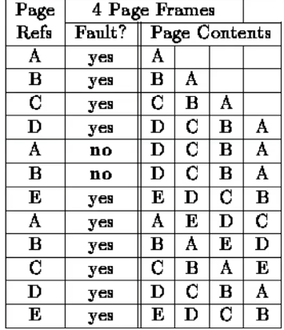

* Belady algorithm: Replace page that will not be used again the farthest time in the future (Principle of optimality)
  * Use as a yard stick

### Redis



## File system

* Directory: unordered list of entries

* OS spends a lot of time walking directory
  * open is seperate from read, write
  * cache prefix lookups for performance)

> Terms

* Access Control list: table defines a computer OS which access rights each user has to a particular system object
  * Highly expressive, but harder to represent in a compact way
  * File system use it because deleting file is more frequent than deleting user
* Capability list: For each subject, maintain a list of objects and their permitted actions (ex: key to a door)
  * compact enough but not very expressive

* Copy on Write: Defer large copies as long as possible
  * OS spend a lot of time copying data

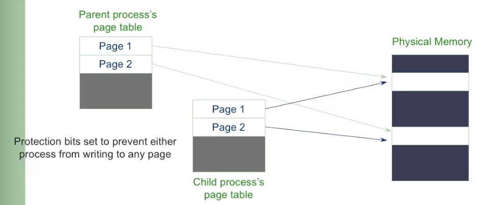

* File allocation table
  * directory entry points to the first block in the file


* Load Balance
  * reduces individual server load to prevents server from becoming a single point of failure
  * improving overall application availability and responsiveness
  * second load balancer can be connected to the first to form a cluster


* Memoy Mapped files: Open read into buffer, operate on buffer
  * Enable processes to do file I/O using loads and stores
  * Bind a file to a virtual memory region: PTE maps virtual address to physical frames holding file data
  * all pages mapped to file are invalid: OS reads a page from file when invalid page is accessed
  * [+] Uniform access for files and memory with less copying (Useful for Fast IO similar to cache)
  * [-] Process has less control over data movement (OS handles faults transparently)
  * [-] Doesn't generalize to stream I/O (pipes, sockets)

* UMA: All processors access the same memory with global address space
  * Responsibility on the programmer to synchronized memory accesses
  * Symmetric multiprocessing (SMP)
  * Cache coherence → have same cache memory
  * most modern multi-core CPUs, cache coherency is usually handled by the processor hardware

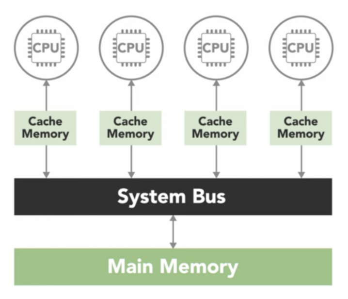

* NUMA: Adding more processor to a shared memory system increase traffic on the shared memory bus

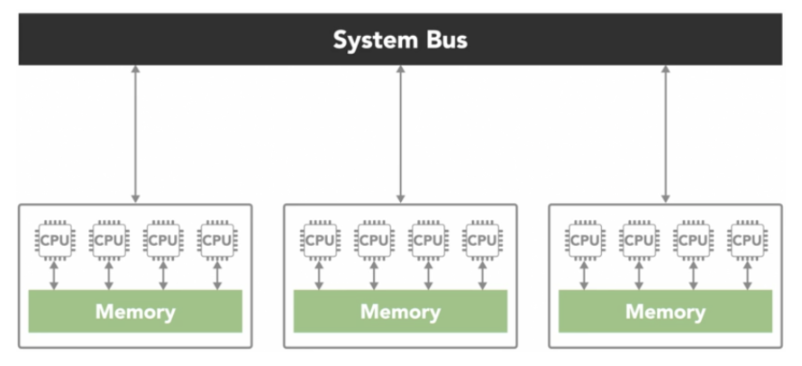

* Distributed Memory
  * Programmer should define how/when data is communicated between the nodes in distributed system
  * Scalable → off-the-shelf computers, networking equipment to build distributed memory systems

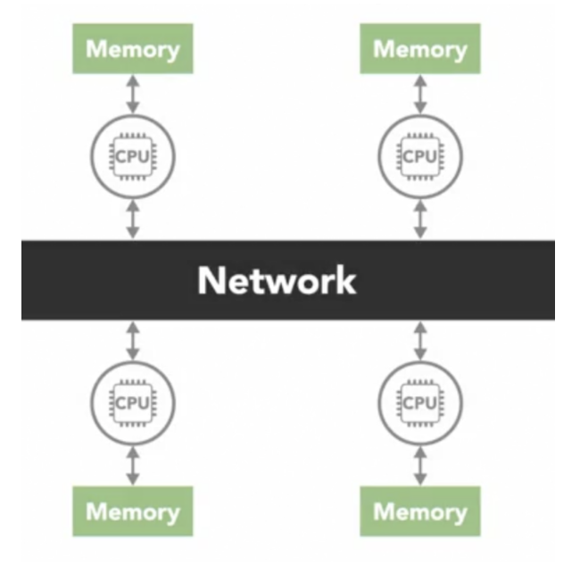

| Type       | preemptive                           | non-preemptive                             |
| ---------- | ------------------------------------ | ------------------------------------------ |
| Overview   | resource allocated to limited time   | can be interrupted                         |
| resource   | allocated until its burst time       | cannot be interrupted                      |
| CPU        | High                                 | Low                                        |
| Overhead   | Yes                                  | No                                         |
| Starvation | Possible                             | Impossible                                 |
| Example    | Round Robin, Shortest Remaining Time | First come First serve, Shortest Job First |

> Which file system works best for videos

* contiguous allocation
  * reading videos require high throughput
  * Since space of the video file will never change, flexibility provided by extent based or random are not needed

### Scheduling

* In multiprogramming system, try to increase CPU utilization and job throughput by operlapping I/O and CPU
* A new process starts
* running process exists or blocked for I/O, faults, mutex, or condition
* I/O or Clock interrupt

> Terms

* FCFS: Long waiting times for long request queues
  * Reasonable when load is slow
* SSTF (Shortest seek time first): Minimize arm movement (seek time), maximize request rate (Favors middle block)
* SCAN: Service requests in one direction until done, then reverse
* C-SCAN: Like SCAN, but only go in one direction

* Least Connection: useful when many persistent client connections that are unevenly distributed between servers

* Least Response Time
  * directs traffic to the server with the fewest active connections and the lowest average response time

* Least Bandwidth
  * selects the server that is serving the least amount of traffic measured in megabits per second (Mbps)

* Round Robin
  * useful when not many persistent connections and the servers are of equal specification

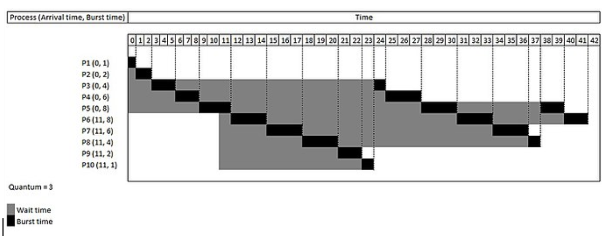

* Weighted Round Robin: Better handle servers with different processing capacities

* IP Hash: hash of the IP address of the client is calculated to redirect the request to a server

> Metric

* fairness with priority: sometimes measured by Jain’s Fairness Index
* performance
  * CPU Utilization (Efficiency): probability that all processes are waiting for I/O
  * turnaround time: $$ T_{turnaround} == T_{completion} − T_{arrival} $$
  * response time: $$ T_{response} == T_{firstrun} − T_{arrival} $$
* Support heavy lodas: for movie FPS
* Adapt to different environment

### Non-preemtive

* long-running thread will take over the CPU, until it calls yield, stop or exit to cause a context switch
* Fewer context switch

* FIFO (First In First Out): evicts first block accessed first without any regard to how often/many times accessed
  * [-] Suffers from Belady's anomaly,  more page frames may increase (3: 3 hit / 4: 2 hit)
  * Used in batch system
  * [-] convoy effect: short consumers of a resource get queued behind a heavyweight resource consumer (Long avg wait)

* SJF (Shortest Job First): optimal when jobs all arriving at the same time (best average waiting time)
  * Not optimal if arrival time is not same -> STCF / PSJF

* LIFO (Last In First Out): evicts block accessed most recently first w/o any regard to how often/many times accessed

* LRU (Least Recently Used): evicts the least recently used items first, assuming temporal locality
  * Use time or revised stack to track recency

* LFU (Least Frequently Used): Counts how often an item is needed. Those that are used least often are discarded first

* MRU (Most Recently Used): Discards, in contrast to LRU, the most recently used items first

* NRU (Not Recently Used): simple implementation, with additional reference bit and page with lowest number in LRU
  * Value may not be unique -> FIFO to resolve conflicts
  * Clock hand used to select LRU candidate -> if ref bit if off, it hasn't been used recently
  * Can control clock speed -> moves quickly when pages are needed

* RR (Random Replacement)
  * Randomly selects a candidate item and discards it to make space when necessary

> Question

* How many page faults would occur for the following replacement
  1, 2, 3, 4, 2, 1, 5, 6, 2, 1, 2, 3, 7, 6, 3, 2, 1, 2, 3, 6.

| Number of frames | LRU | FIFO | Optimal |
| ---------------- | --- | ---- | ------- |
| 1                | 20  | 20   | 20      |
| 2                | 18  | 18   | 15      |
| 3                | 15  | 16   | 11      |
| 4                | 10  | 14   | 8       |
| 5                | 8   | 10   | 7       |
| 6                | 7   | 10   | 7       |
| 7                | 7   | 7    | 7       |

### Preemtive

* Need some waay to regain control of processor asynchronously
* Priority inversion: risk unless all resources are jointly scheduled (break on car)
* priority inheritance

> Term

* STCF (Shortest Time-to-Completion First) / PSJF (Preemptive Shortest Job First)
  * determines which of the jobs has the least time left, and schedules that one
  * [-] starvation for long job (bad response time)

* RR (Round Robin): run time slice (scheduling quantum) and then switches to the next job in the queue
  * length of a time slice must be a multiple of the timer-interrupt period
  * [-] Time slice too large: Response time (heuristic: 7~80 % jobs within slice / 50 ms)
  * [-] Time slice too small: Context switch, bad turnaround time
  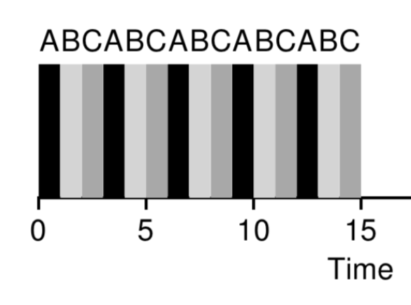

* MLFQ (Multi-level Feedback Queue): Have multiple ready queues which use different algorithm for each
  * Move processes among queus based upon execution history
  * optimize turnaround time without knowing job length




```py
import sys
import random
import operator
import argparse

parser = argparse.ArgumentPaser()
parser.add_option("-s", "--seed", default=0, help="the random seed", action="store", type="int", dest="seed")
parser.add_option("-j", "--jobs", default=3, help="number of jobs in the system", action="store", type="int", dest="jobs")
parser.add_option("-l", "--jlist", default="", help="provide a comma-separated list of run times",
  action="store", type="string", dest="jlist")
parser.add_option("-m", "--maxlen", default=10, help="max length of job", action="store", type="int", dest="maxlen")
parser.add_option("-p", "--policy", default="FIFO", help="sched policy to use: SJF, FIFO, RR",
  action="store", type="string", dest="policy")
parser.add_option("-q", "--quantum", help="length of time slice for RR policy", default=1,
  action="store", type="int", dest="quantum")
parser.add_option("-c", help="compute answers for me", action="store_true", default=False, dest="solve")

(options, args) = parser.parse_args()

random.seed(options.seed)

print('ARG policy', options.policy)
if options.jlist == '':
  print('ARG jobs', options.jobs)
  print('ARG maxlen', options.maxlen)
  print('ARG seed', options.seed)
else:
  print('ARG jlist', options.jlist)

print('Here is the job list, with the run time of each job: ')

joblist = []
if options.jlist == '':
  for jobnum in range(0,options.jobs):
    runtime = int(options.maxlen * random.random()) + 1
    joblist.append([jobnum, runtime])
    print(f'  Job {jobnum} ( length = {runtime}  )')
else:
  jobnum = 0
  for runtime in options.jlist.split(','):
    joblist.append([jobnum, float(runtime)])
    jobnum += 1
  for job in joblist:
    print(f'  Job {job[0]} (length = {job[1]})')
print('\n')

if options.solve == True:
  print '** Solutions **\n'
  if options.policy == 'SJF':
    joblist = sorted(joblist, key=operator.itemgetter(1))
    options.policy = 'FIFO'
  if options.policy == 'FIFO':
    thetime = 0
    print('Execution trace:')
    for job in joblist:
      print('  [ time %3d ] Run job %d for %.2f secs ( DONE at %.2f )' % (thetime, job[0], job[1], thetime + job[1]))
      thetime += job[1]

    print('\nFinal statistics:')
    t     = 0.0
    count = 0
    turnaroundSum = waitSum = responseSum = 0
    for jobnum, runtime in joblist:
      response   = t
      turnaround = t + runtime
      wait       = t
      print('  Job %3d -- Response: %3.2f  Turnaround %3.2f  Wait %3.2f' % (jobnum, response, turnaround, wait))
      responseSum   += response
      turnaroundSum += turnaround
      waitSum       += wait
      t += runtime
      count = count + 1
    print('\n  Average -- Response: %3.2f  Turnaround %3.2f  Wait %3.2f\n' % (responseSum/count, turnaroundSum/count, waitSum/count))
  if options.policy == 'RR':
    print('Execution trace:')
    turnaround, response, lastran, wait = {}, {}, {}, {}
    quantum  = float(options.quantum)
    jobcount = len(joblist)
    for i in range(0,jobcount):
      lastran[i] = wait[i] = turnaround[i] = 0
      response[i] = -1

    runlist = []
    for e in joblist:
      runlist.append(e)

    thetime  = 0.0
    while jobcount > 0:
      jobnum, runtime = runlist.pop(0)
      if response[jobnum] == -1:
        response[jobnum] = thetime
      currwait = thetime - lastran[jobnum]
      wait[jobnum] += currwait
      if runtime > quantum:
        runtime -= quantum
        ranfor = quantum
        print('  [ time %3d ] Run job %3d for %.2f secs' % (thetime, jobnum, ranfor))
        runlist.append([jobnum, runtime])
      else:
        ranfor = runtime
        print('  [ time %3d ] Run job %3d for %.2f secs ( DONE at %.2f )' % (thetime, jobnum, ranfor, thetime + ranfor))
        turnaround[jobnum] = thetime + ranfor
        jobcount -= 1
      thetime += ranfor
      lastran[jobnum] = thetime

    print '\nFinal statistics:'
    turnaroundSum = waitSum = responseSum = 0
    for i in range(len(joblist)):
      turnaroundSum += turnaround[i]
      responseSum += response[i]
      waitSum += wait[i]
      print(f'  Job {i} -- Response: {response[i]:.2f}  Turnaround {turnaround[i]:.2f}  Wait {wait[i]:.2f}'
    count = len(joblist)
    print(f'\n  Average -- Response: {responseSum / count:.2f}  Turnaround {turnaroundSum / count:.2f}  Wait {waitSum / count:.2f}\n')

  if options.policy != 'FIFO' and options.policy != 'SJF' and options.policy != 'RR':
    raise "Policy, options.policy, is not available."
else:
  print('Compute the turnaround time, response time, and wait time for each job.')
  print('When you are done, run this program again, with the same arguments,')
  print('but with -c, which will thus provide you with the answers. You can use')
  print('-s <somenumber> or your own job list (-l 10,15,20 for example)')
  print('to generate different problems for yourself.')
```




### Disk

* In order to access a particular byte, track #, sector #, offset needed
* Each block usually contains 512 bytes
* Data must be brought to main memory (RAM)
* Hard Disc: slow, Sequential access, permanent

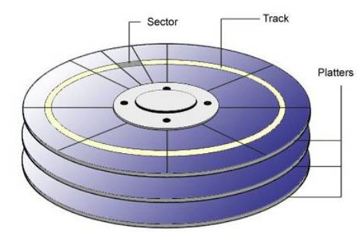

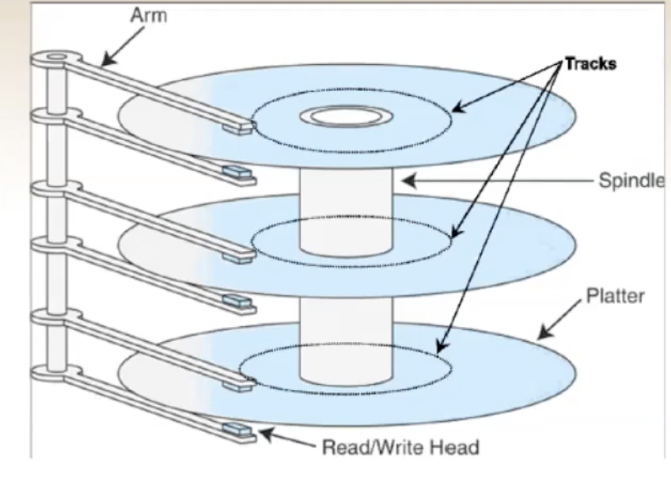

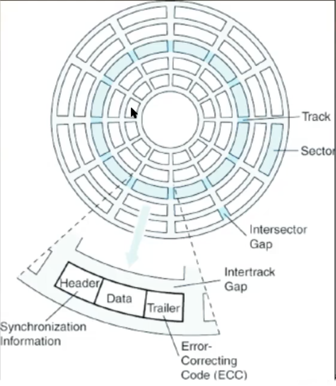

> Terms

* Seek: Moving the disk arm to the correct cylinder (Slow)
* Rotation: Waiting for the sector to rotate under the head
* Transfer: Transferring data from surface into disk controller elctronics, sending it back to the host
* Components: Platters, Surfaces, Tracks, Sectors, Cylinders, Arm, Heads
* Physical disk (surface)
* Logical disk (disk block #)
* Logical file (file block, record, or byte #)

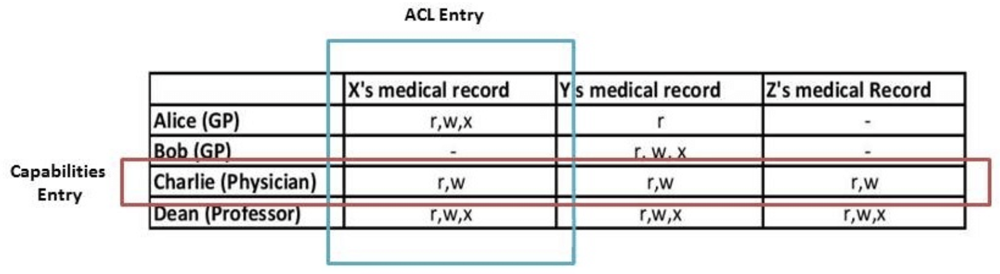

* Contiguous Allocation
  * [+] state required per file is start block and size
  * [+] entire file can be read with one seek
  * [-] fragmentation, external is bigger problem
  * [-] Hard for a file to dynamically grow, user doesn't know size of file

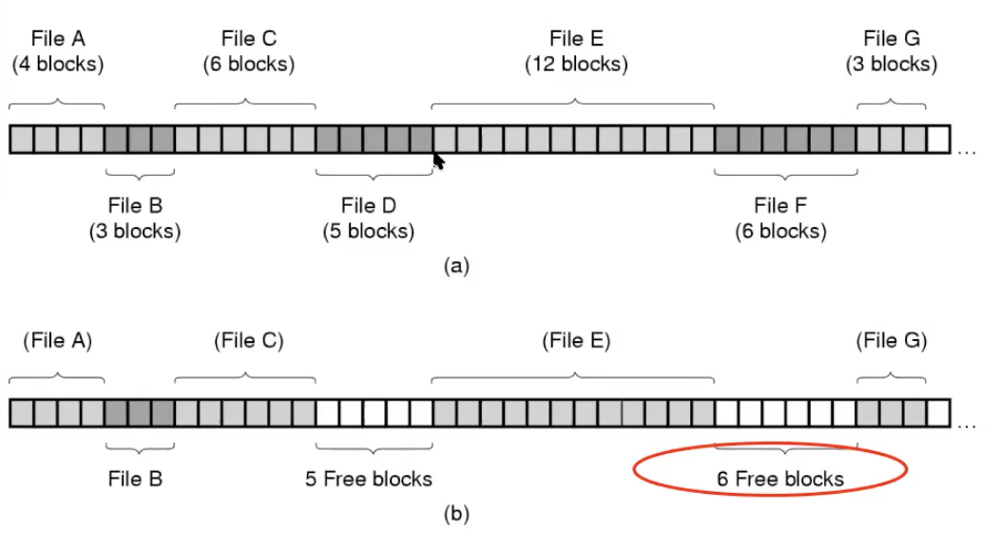

* Linked List Allocation: Each file is stored as linked list
  * [+] No space lost to external fragmentation
  * [+] Disk only stores first block of each file
  * [-] Random access is costly

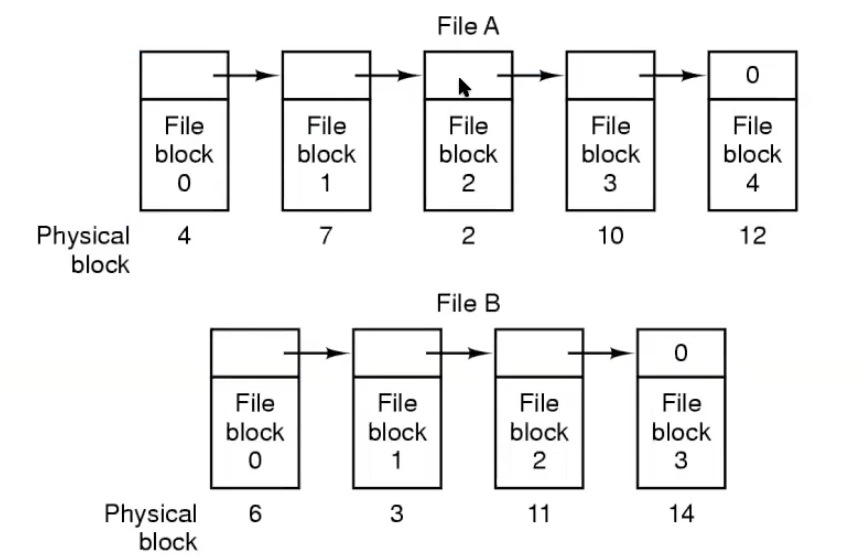

* FAT (File Allocation Table): Take pointer away from blocks, store in this table
  * [+] Entire block is available for data, faster random saccess than linked list
  * [-] Many file seeks unless entire FAT is in memory (20 GB disk, 1KB block size, FAT has 20 m entries)

* Inode structure: structure in a Unix-style file system that describes a file-system object (file or directory)
  * Each inode stores attributes and disk block locations of object's data, 15 blocks (12, single, double, triple indirect)
  * If data block are 4K (48K reachable from the inode, 4MB available for single indirect, 4GB / 4TB for double, triple)
  * Implemented using linkedlist and bitmap


* Link
  * Hard link: share same inode, cannot delete a file permanently becuase some hardlink points to that direction
  * Soft (symbolic) link: shortcut, more secure but little slower

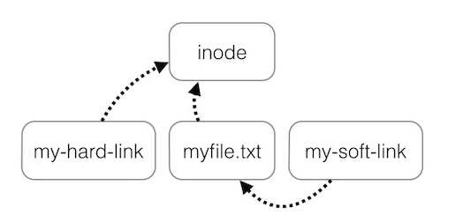

* UFS (Unix File System): Inodes are numbered sequentially, starting at 0


> How many disk access for /user/a.ppt

* 6 inode / content of '/', inode / content of '/user', inode / 1'st block of '/user/a.ppt'

### SSD

* uses IC assemblies to store data persistently
* typically using flash memory, acting as secondary storage in hierarchy of computer storage
* Server-based SSDs serves as a cache server or as persistent storage
* fast scratch disk for frequently accessed data

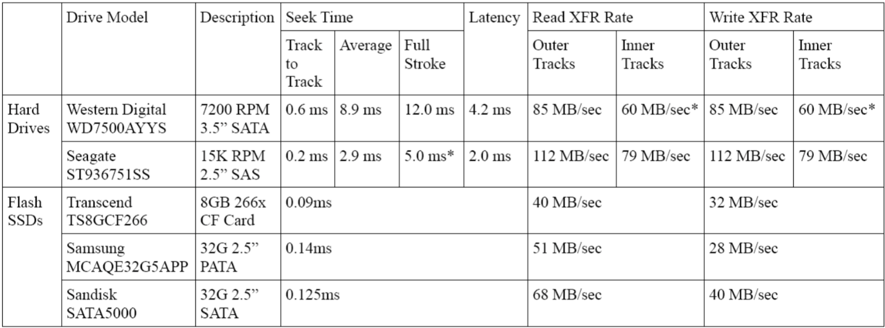

* [+] Reliability in portable environments and no noise
* [+] Faster start up, low read latency (Deterministic read performance)
* [-] Cost more per unit capacity, higher power requirements
* [-] Slower write speeds because of erase blocks are becoming larger (limited 100000 writes for SLC)


## Distributed System

* [+] Reliability and fault tolerance, parallelism across multiple nodes
* [+] Scalability
* [ex] Google file systems, BigTable, MapReduce, hadoop, AI algorithms

> Terms

* IDL (Interface definition language): specifies names, parameters and types for all client callable server procedures
  * Stub compiler reads IDL and produces two stub procedures for each server procedure (client, server)
  * Stubs are responsible for managing all details of remote communication between client and server

* Messages: initally programmers handcoded to send requests and response
  * [-] format, packing and unpacking, often asynchronous
  * [-] server decode and dispatch to handlers
  * [-] not a natural programming model

> Terms

* Binding: process of connecting client to server
  * server when it starts up exports its interface
  * client before issuing any calls, imports server
  * import and export operations are explicit in server and client programs

* Marshalling: packing of procedure parameters into a message packet
  * stubs call type-specific procedures to marshal / unmarshal the parameters to a call

* Mounting: Before a client can access files on a sever, client must mount file systme on sever
  * Servers maintain ACLs of clients that can mount their directories
  * Can be cascaded: can mount a remote file system on a remote file system

## Flynn's Taxonomy

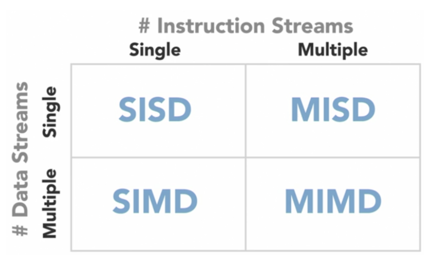

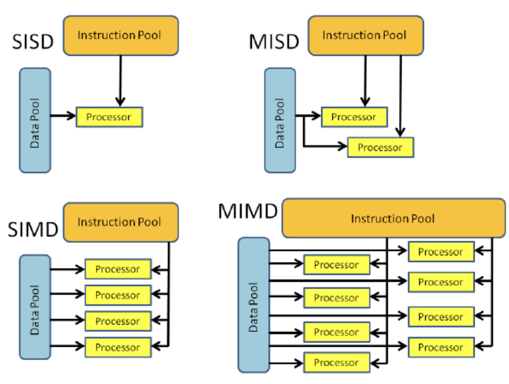

* SISD: A sequential computer which exploits no parallelism in either the instruction or data streams
  * Single control unit (CU) fetches single instruction stream (IS) from memory

* MISD: Not a commonly used architecture → fault tolerance

* SIMD: Image processing, GPU

* MIMD: Multicore PC

* SPMD
  

* MPMD
  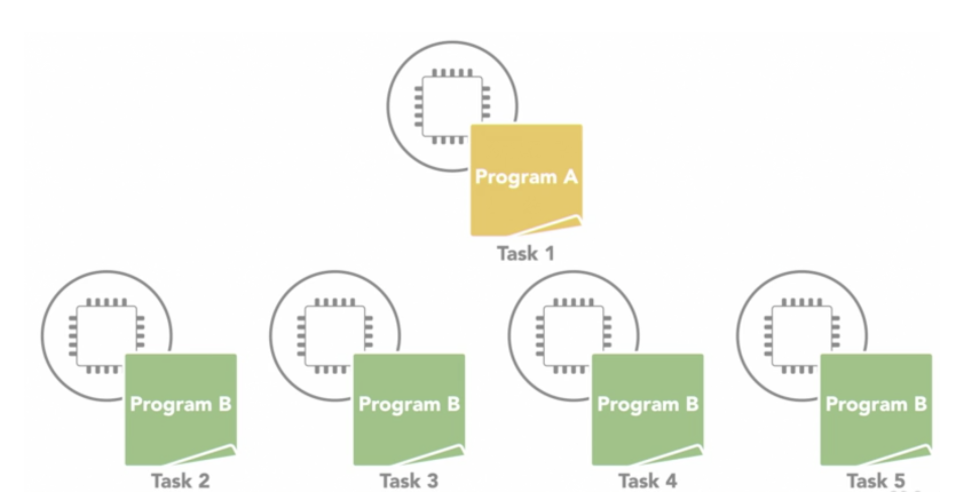
