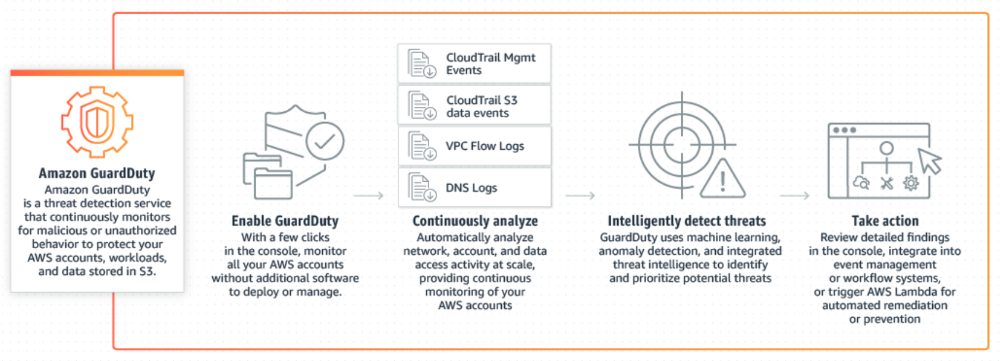
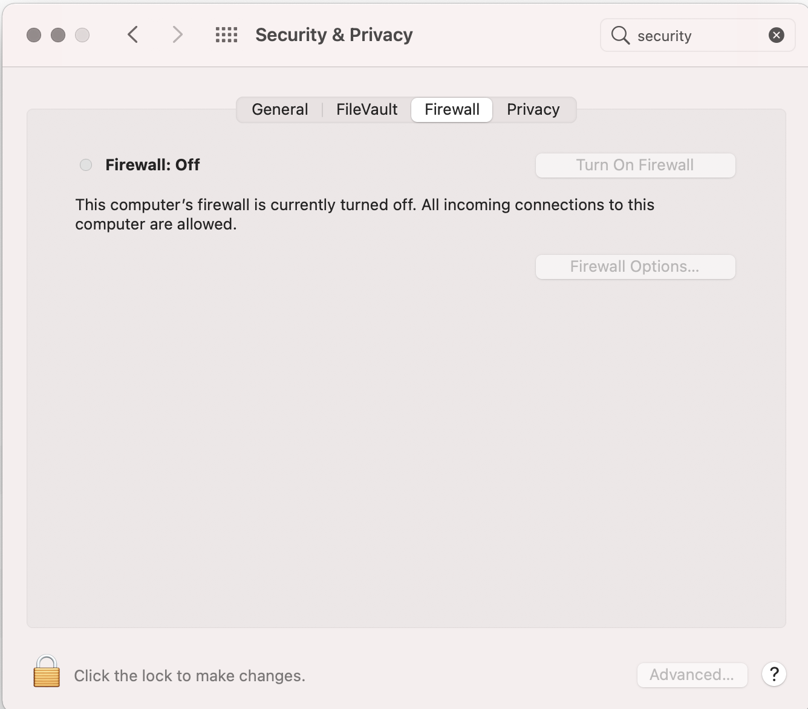
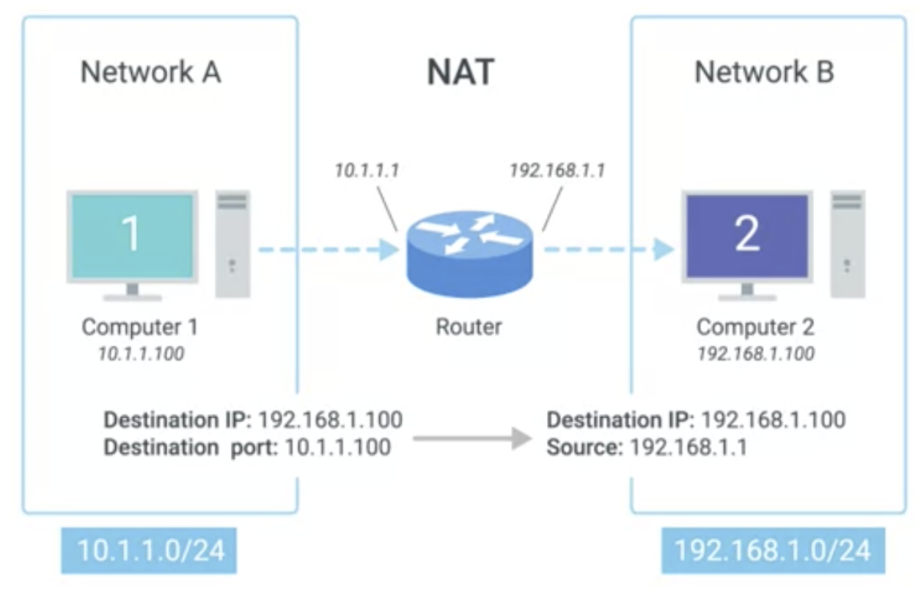
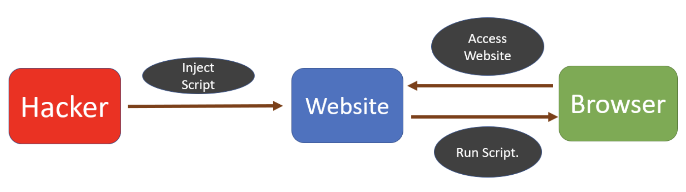
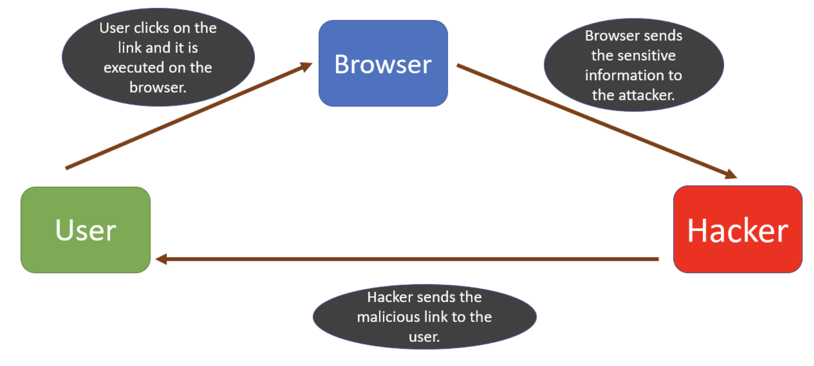
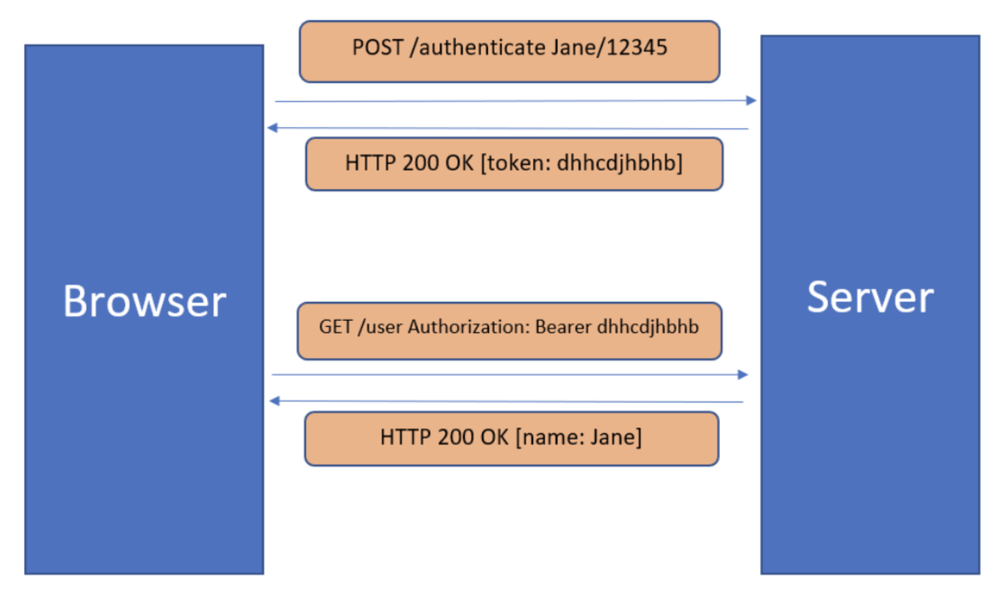
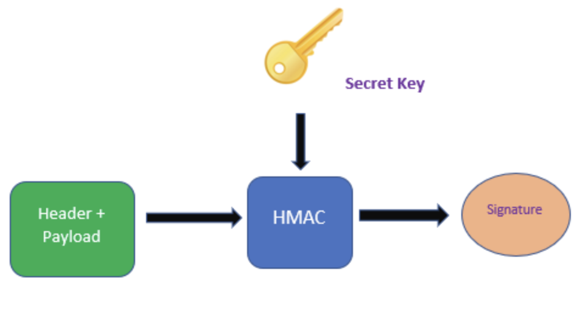
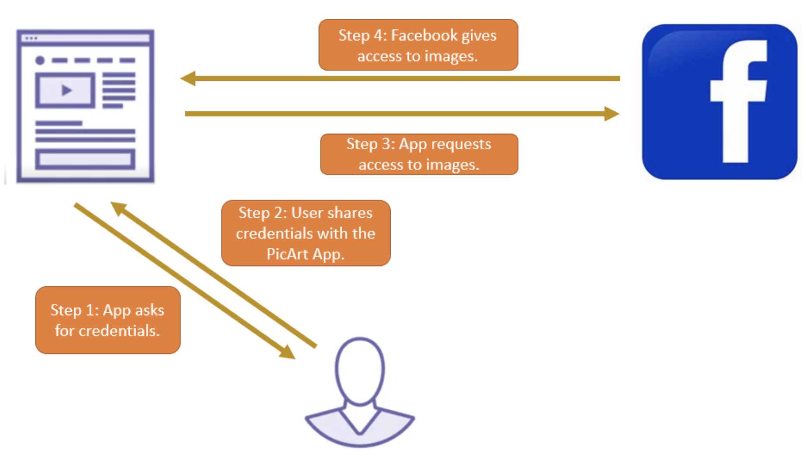

# Security




* GuardDuty is a threat detection service that continuously monitors for malicious activity and unauthorized behavior
* to protect your AWS accounts, workloads, and data stored in S3




## Firewall

* Filtering access control list
  * Port number: [ex] only DNS server of a company should receive UDP segments whose destination port is set to 53
  * Host-based: [ex] black lists
  * Network-based
* external interface connected to the global Internet
* internal interface connected to a trusted network

> Term

* dmz: physical, logical subnetwork that contains, exposes organization's external-facing services to untrusted network
  * Add additional layer of security to an organization's LAN

* Network-based: Hardware based and generally deployed on network
  [+] Easy to scale and simple to maintain
* Host-based: deployed on end-systems
* Stateless: doesn't maintain state of flows passing through
* Stateful: See first packet in flow that is allowed by the configured security rules it creates a session state for it
  * [+] Filtering is more efficient




* ufw: Uncomplicated firewall for linux ([ex] default)
  * status
  * allow/deny: [ex] port 22, outgoing, incoming
  * disable: disable firewall
  * enable: enable firewall

* Mac
  




### NAT

* Network address translation allows a gateway (router, firewall) to rewrite source IP of outgoing IP datagram
* retaining the original IP in order to rewrite it into the response
* to solve IPv4 exhaustion by using non-routable address space in the late 80s to early 90s
* One to many NAT masquerade IP
* [-] Not easily possible for external hosts to open TCP connections with hosts behind NAT
* [-] NAT breaks the end-to-end transparency of the network

## XSS

* Cross-site Scripting attack: aka XSS attack, a malicious script is added to a website
  * Installing browser-based Keyloggers to capture keystrokes of the victim
  * Capturing session cookies of the user, which can be used to trigger some other kind of attack, like a CSRF attack
  * Redirecting users to other malicious websites
  * inputs are validated before they are stored into the database
  

* Reflected Cross-site Scripting Attack: attacker tricks user into clicking a link that contains the malicious script
  

## DOS

* denial of service attack is attacker tries to crash app so that legitimate users are not able to access app
* main purpose of this attack is to harm an organization
* first DoS attack was done by 13-year old David Dennis in 1974

## JWT

* Store user information in encrypted format which can be stored on client side

1. The client sends a request to the server with a username/password
1. The application validates the credentials and generates a secure, signed token for the client
1. The token is sent back to the client and stored there
1. When the client needs to access something new on the server, it sends the token through the HTTP header.
1. The server decodes and verifies the attached token. If it is valid, the server sends a response to the client.
1. When the client logs out, the token is destroyed.

* [+] more secure than cookies and scalable as server does not store any client information
* [+] token generation process can be done on a separate server or by a different company

> Term

* HMAC: Hashing for Message Authentication code
  

* Payload
  * iss: identifies principal that issued JWT
  * sub: identifies principal that is subject of JWT
  * aud: identifies recipients that JWT is intended for
  * exp: identifies expiration time at or after which JWT MUST NOT be accepted for processing
  * nbf: identifies time before which JWT MUST NOT be accepted for processing
  * iat: identifies time at which JWT was issued
  * jti: The JWT ID is a unique identifier for the JWT

## Oauth

* 2.0 focuses on client developer simplicity while providing specific authorization flows for web, desktop, IoT apps

### OpenID

* extension of OAuth
* Identity token
  * iss - Client must validate that the issuer of this token is the Authorization Server.
  * aud - Client must validate that the token is meant for the client itself.
  * exp - Client must validate that the token is not expired

## Wireless

* WEP: wired equivalent privacy is earlieset wireless security protocol, 40 bit encryption key is easily hackable
* WPA: wifi-protected access, uses TKIP (temporal key integrity protocol) has some vulnerability
* WPA2: adopted by US govnernment, require to use stronger encryption uses AES (advanced encryption stnadard)
  * Some allows mixed options with WPA for compatibility with risk
* WPA3: introduced 2018, increased protections from password guessing
* WPS: Designed to make as easy as possible for devices to join a secrue wireless
