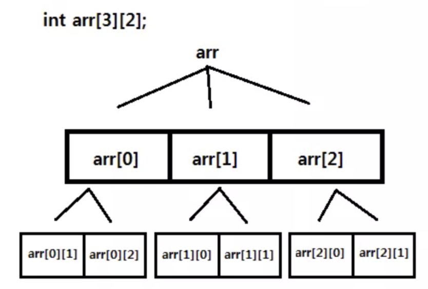

# List

* data organization, management, and storage format that enables efficient access and modification




* vector
  * iterator insert (const_iterator position, const value_type& val);

```cpp
#include <iostream>
#include <vector>

// 1. Merge vector
AB.reserve( A.size() + B.size() );         // preallocate memory
AB.insert( AB.end(), A.begin(), A.end() );
AB.insert( AB.end(), B.begin(), B.end() );

// 2. Split string
vector<int> stringToVector(string input) {
  vector<int> output;
  stringstream ss;
  ss.str(input);
  int item;
  while (ss >> item)    output.push_back(item);
  return output;
}

vector<int> vect{ 10, 20, 30 };

// 3. Initialize 2D vector
#define M 3
#define N 4
int main() {
  // specify the default value to fill the vector elements
  int default_value = 1;

  // Using the fill constructor to initialize a two-dimensional vector
  // with a given default value
  vector<vector<int>> matrix(M, vector<int>(N, default_value));

  // print the two-dimensional vector

  return 0;
}

// 4: Add multiple, emplace to vector
array.insert(array.end(), { 1, 2, 3, 4, 5, 6 });
vector<vector<int>> v(1);
v[0] = {1};
v.emplace_back(10);
```




* unmodifiable, use linked list for modifiable

> Staitc methods

* List\<T\> asList​(T... a): Returns a fixed-size list backed by the specified array
* T binarySearch​(): Searches a range of the specified array for the specified object using the binary search algorithm
  * T[] a, int fromIndex, int toIndex, T key, Comparator<? super T> c

* boolean add(E `e`): Appends `e` to end of this list
* boolean addAll(): Appends elements in `c` to end of this list, they are returned by specified collection's iterator
  * Collection<? extends E> `c`
* void add(int `index`, E `element`): Insert `element` at `index`
* void clear(): Removes all of the elements from the list
* int compare​(T[] `a`, T[] `b`): Compares two double arrays lexicographically
* byte[] copyOf​(T[] `orig`, int `newLength`): Copies the specified array, truncating or padding with zeros
* boolean equals​(T[] `a1`, T[] `a2`): Returns true if array `a1` and `a2` of are equal to one another
* void fill​(T[] `a`, T `val`): Assigns the specified char value to each element of the specified array of T
* int hashCode​(T[] `a`): Returns a hash code based on the contents of the specified array
* int mismatch​(): Finds and returns relative index of first mismatch between two byte arrays over the specified ranges
  * T[] a, int aFromIndex, int aToIndex
  * T[] b, int bFromIndex, int bToIndex
* void parallelSort​(T[] a): Sorts the specified array into ascending numerical order (Faster than sort)
* E remove(int `idx`): Removes the element at the specified `idx` in this list (optional operation)
* int size(): Returns the number of elements in this list

```java
// 1. Array iterate
int arr[] = {1, 2, 3};
for (int d : arr) System.out.println(d);

// 2. Custom object
Object[] myArray = new Object[100]
Java allocates 100 places to put your objects in. It does NOT instantiate your objects for you.

You can do this:

SomeClass[] array = new SomeClass[100];

for (int i = 0; i < 100; i++) {
    SomeClass someObject = new SomeClass();
    // set properties
    array[i] = someObject;
}

// 3. Pass array to function
void foo(int[] numPlayers) { }

foo(new int[] { 10, 15, 20 });
```




* Spread: ..., use to copy contents of objects

> Array

* length: Size of array
* concat()
* copyWithin()
* entries()
* every()
* fill()
* filter(): array.filter(value => value < 0);
* find()
* findIndex()
* forEach(): arr.forEach((num, index) => { arr[index] = num * 2; });
* from()
* includes()
* indexOf()
* isArray()
* join()
* keys()
* lastIndexOf()
* map(): let doubled = arr.map(num => { return num * 2; });
* pop()
* prototype
* push()
* reduce(): [].reduce((a, b) => a + b);        // sum
* reduceRight()
* reverse(): loop backward
* shift(): get first element = poll in queue
* slice()
* some()
* sort(): items.sort((a, b) => { return a.value - b.value; });
* splice(): items.splice(pos, num, newval);
* toString()
* unshift()
* valueOf()
* splice(index, delete);: remove elements
* split(',').map(Number);: split as an integer
* map(x=>x[0]);: first column of 2d array

```js
new Array(len).fill(0);

// 1. Uppercase all array
var fruits = ["Banana", "Orange", "Apple", "Mango"];
Array.prototype.myUcase = function() {
  for (i = 0; i < this.length; i++)
    this[i] = this[i].toUpperCase();
};

// 2. Spread
var arr = ['a','b', 'c']
var added = [...arr, 'd']                // Copy Array

function add(x, y, z) { console.log(x+y+z) }  // Pass array as parameter
var args = [0, 1, 2, 3]
add(...args)

var obj1 = { foo: 'bar', x: 42 };
var clonedObj = { ...obj1 };            // Clone and merge object

var obj2 = { foo: 'baz', y: 13 };
var mergedObj = { ...obj1, ...obj2 };    // merge objects
```




* list
  * append(`elem`): Adds an `elem` at the end of the list
  * clear(): Removes all the elements from the list
  * copy(): Returns a copy of the list
  * count(`object`): Returns the number of `object`
  * extend(`iterable`): Add all iterable, to the end of the current list
  * insert(`index`, `object`): Add an object to index
  * index(`value`, `start`=0, `stop`=inf) -> int: Returns the first index of the `value`, error if not found
  * pop(`index`=-1): Removes the element at the `index`
  * remove(`value`): Removes the first index of `value`
  * reverse() -> None: Reverses the order of the list in-place

```py
# 1. Create
list(range(0, 5))     # [0, 1, 2, 3, 4, 5]

[[0] * 5] * 5               # [WRONG] creates 5 copies of the same list
[[0]*5 for i in range(5)]   # 2D List

li = list(map(int, input().split()))  # From input

# 2. Add
L = ['red', 'green', 'blue']
L.append('yellow')  # ['red', 'green', 'blue', 'yellow']
[1,2,3].insert(0, 4)  # [4, 1, 2, 3]
[1,2,3].extend([4,5]) # [1, 2, 3, 4, 5]

# 3. Index
L = ['a','b','c','d','e','f','a','b','c','d','e','f']
print(L.index('x'))     # Triggers ValueError: 'x' is not in list
L = ['a','b','c','d','e','f','a','b','c','d','e','f']
print(L.index('c',4,7)) # within search bound
```







* ${array[i]}: displays array's value for this index. If no index is supplied, array element 0 is assumed
* ${#array[i]}: to find out the length of any element in the array
* ${#array[@]}: to find out how many values there are in the array

* a=($(cat))
* echo ${a[@]}
* echo {10..1..2}: similar to range
* echo two{apple,banana}s: prefix suffix




```sh
let longlist = mylist + [5, 6]
let mylist += [7, 8]
mylist[2:]
let alist = add(mylist, 4)
```






## Array

* Immutable




* Array name in C is implemented by a constant pointer

```cpp
#include <array>
#include <vector>
#include <iostream>

using namespace std;

int main() {
  // 1. create array
  new int[3] {0, 2, 0}
      int bar [5] = { 10, 20, 30 };       // 10 20 30 0 0
  int arr[][2] = {{1, 2}, {3, 4}, {5}};   // 1 2 3 4 5 0 / first can be omitted
  int arr[2][] = {{4, 5, 6}, {7, 8, 9}};  // ERROR

  // 2. Size of array
  int N = sizeof(bar) / sizeof(bar[0]);
  int arr[5];                             // Assume base address of arr is 2000 and int size is 32 bit
  printf("%u %u", arr + 1, &arr + 1);     // 2004 2020

  // 3. vector of array
  vector<int> v[2] = {vector<int>(), vector<int>()};

  // 4. Array module
  array<int, 3> a = {1, 2, 3};

  for (int i : a) cout << i;  // 123
  cout << endl;
  array<int, 3> b = a;

  b = a;
  a[0] = 0;

  cout << b.front() << endl;  // 1

  try {
    b.at(3) = 666;
  } catch (out_of_range const &exc) {
    cout << exc.what() << '\n';  // array::at
  }
}
```




* toString

```java
// 1. Print hashmap
Arrays.toString(map.entrySet().toArray())
```




```sh
# 1. Calculate Score
read score
grade=(F F F F F F D C B A A)
echo ${grade[$[score / 10]]}
```




## Dimension 2






```py
# 1. maximum in 2d array
print(max(max(dp, key=max)))
```








## LinkedList

| Type          | Access | Search | Insert | Delete |
| ------------- | ------ | ------ | ------ | ------ |
| Array         | 1      | n      | n      | n      |
| Stack         | n      | n      | 1      | 1      |
| Queue         | n      | n      | 1      | 1      |
| Singly-Linked | n      | n      | 1      | 1      |
| Doubly-Linked | n      | n      | 1      | 1      |




* list
  * assign()
  * clear()
  * emplace()
  * emplace_front() / emplace_back()
  * erase()
  * insert()
  * merge()
  * methods()
  * pop_front() / pop_back(): pop element from front / back
  * push_front() / push_back(): add element to front / back
  * size()
  * swap()
  * resize()




* LinkedList is modifiable
* LinkedList\<E\>
* boolean add(E `elem`): appends `elem` to the end
* void add(int idx, E `elem`): indert `elem` to `idx`
* E removeLast(): removes and returns the last element
* int size(): return the number of elements

* ListNode
  * void addElement(TreeNode `node`)
  * void dump(java.io.PrintStream `out`, int `n`): pretty print element
  * int getLength()
  * TreeNode getNth(int n)






### Iterator




> iterator

* istream_iterator: single-pass input iterator that reads successive objects of type T
* ostream_iterator

```cpp
#include <iostream>
#include <iterator>

using namespace std;

// 1. Print_array
int main() {
  int arr[3] = {1, 2, 3};
  copy(arr, arr + sizeof(arr) / sizeof(int), ostream_iterator<int>(cout, " "));
  cout << endl;
}

// 2. String to vector of int
string myString = "10 15 20 23";
istringstream is( myString );
vector<int> myNumbers{ istream_iterator<int>( is ), istream_iterator<int>() };
myNumbers.assign( istream_iterator<int>( is ), istream_iterator<int>() );
```




* Iterator
  * remove(): Removes from the underlying collection the last element returned by this iterator

* ListIterator
  * `List`.listIterator(): Create list iterator

```java
// 1. Traverse backwards
ListIterator listIterator = list.listIterator(list.size());

while (listIterator.hasPrevious()) {
  System.out.println(listIterator.previous());
}
```




```py
# Iter
vowels = ['a', 'e', 'i', 'o', 'u']
print(next(iter(vowels)))  # prints 'a'
```






### Skiplist



## Deck

> Maximum in sliding window

* Question
  * Given a large array of integers and a window of size w
  * find the current maximum value in the window as the window slides through the entire array

* Solution
  * O(N)
  * Remove the indices of all elements from the back of the deque, which are smaller than or equal to the current element
  * If the element no longer falls in the current window, remove the index of the element from the front
  * Push the current element index at the back of the window
  * The index of the current maximum element is at the front




> deque

* push_front()
* push_back()
* pop_front()
* pop_back()
* front() / back()

```cpp
#include <iostream>
#include <deque>

using namespace std;

deque<int> mydeque;
int sum(0);
mydeque.push_back (10);
mydeque.push_back (20);
mydeque.push_back (30);

while (!mydeque.empty()) {
  sum+=mydeque.back();
  mydeque.pop_back();
}

cout << "The elements of mydeque add up to " << sum << '\n';

```




* Deque\<E>




> deque



* deque([iterable[, maxlen]]): if deque is full and item added, item is discarded on other side
  * append(`x`): Add `x` to the right side of the deque
  * appendleft(`x`): Add `x` to the left side of the deque
  * clear(): Remove all elements from the deque leaving it with length 0
  * copy(): Shallow copy of the deque
  * count(`x`): Number of deque elements equal to `x`
  * extendleft(`iterable`): insert multiple `iterable` into left
  * full(): Return True if the queue is full
  * index(`x`[, start[, stop]]): Position of `x` in the deque
  * insert(i, x): Index error if full
  * pop(): Remove and return an element from the right
  * popleft(): Remove and return an element from the left
  * remove(value): Remove the first occurrence of value
  * reverse(): Reverse elements of the deque in-place
  * rotate(n=1): Rotate the deque n steps to the right
  * extend(iterable): Extendleft(iterable)

```py
# 1. linux tail
def tail(filename, n=10):
  with open(filename) as f:
    return deque(f, n)
```






### Stack




* stack

```cpp
stack\<int> s ({1, 2, 3});
```






### Queue

> Term

* Persist queue: feature that you configure to take data that is in input queue and store it to files on disk
  * [+] prevent data loss if the forwarder or indexer has too much data to process at one time




* queue
  * size() / empty()
  * front()
  * pop()
  * push()






### Priority queue




* priority_queue
  * top()
  * push()
  * pop()

```cpp
// own comparator
priority_queue<int, vector<int>, std::greater<int> > my_min_heap;
priority_queue<int*, vector<int*>, cmp> queue;
struct cmp {
  bool operator() (int a, int b) const {
    return ...
  }
};

auto comp = [](Node a, Node b){ return a.val < b.val };
priority_queue<Node, vector<Node>, decltype(comp)> pq;
```




> heapq

* smallest element is always the root
* If you want to use max heap, multiply by -1
* heappush(heap, item)
* heappop(heap)
* heapify(x): Transform list x into a heap, in-place, in linear time
* merge(*iterables, key=N, reverse=F): Merge sorted inputs into a single sorted output
* nlargest(n, iterable, key=N): return n th largest index and number
* nsmallest(n, iterable, key=N)

```py
# 1. print_order
heapify lst = [9, 8, 7, 6, 5, 4, 3, 2, 1]
heapify(lst)    # [0, 1, 3, 2, 5, 4, 7, 9, 6, 8]
heappush(lst, 10)
for i in range(k):
  ans = heapq.heappop(lst)
```






### Monotonic Deque



## Tuple




> tuple

* make_tuple()
* get<>

```cpp
tuple<int, double, std::string> t(7, 9.8, "text");
double d = get<1>(t);

#include <iostream>
#include <string>
#include <tuple>

using namespace std;

template <class TupType, size_t... I>
void print(const TupType& _tup, index_sequence<I...>) {
  cout << "(";
  (..., (cout << (I == 0 ? "" : ", ") << get<I>(_tup)));
  cout << ")\n";
}

template <class... T>
void print(const tuple<T...>& _tup) {
  print(_tup, make_index_sequence<sizeof...(T)>());
}

auto abc = make_tuple(5, "Hello", -0.1);
print(abc);
int a;
string b;
double c;
tie(a, b, c) = abc;
cout << a << ", " << b << ", " << c << endl;
```




* a collection which is ordered and unchangeable, allows duplicate members

```py
# 1. Create
tup = tuple(("apple", "banana", "cherry"))
tup = ("abc", 34, True, 40, "male")
tup = ("apple", ) # ("apple") is not a tuple
print(type(tup))  # without comma NOT a tuple

# 2. NamedTuple
NamedTupleCard = namedtuple('NamedTupleCard', ['rank', 'suit'])
Person = namedtuple('Person', ['first_initial', 'last_name']
ace_of_spades = NamedTupleCard('A', 'Spades')
ace_of_spades == Person('A', 'Spades')    # True
```





