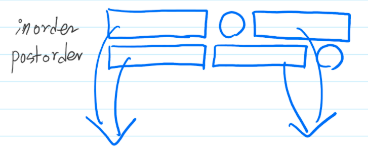




> Question

* Given inorder and postorder pring preorder traversal

```txt
Input:
3
1 2 3
1 3 2

Output: 2 1 3
```

> Solution






```py
import sys

sys.setrecursionlimit(10000000)

def f(i, l, r):
  if l >= r: return
  idx = pos[A[i]]
  print(A[i], end=' ')
  f(i - (r - idx), l, idx)
  f(i - 1, idx + 1, r)

n = int(input())
B, A = [*map(int, input().split())], [*map(int, input().split())]
pos = [0] * (n + 1)
for i, b in enumerate(B):
  pos[b] = i
f(n - 1, 0, n)
```



