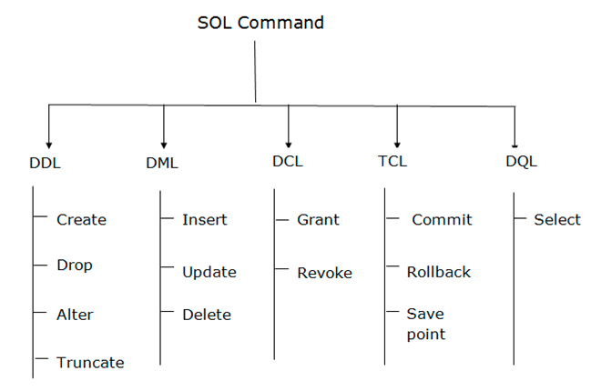
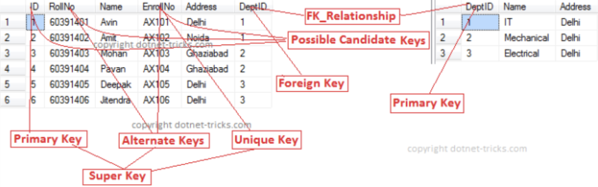

# DQL



* SQL treats what's inside double quotes "" as an identifier (ex: table name, proc name, column name)
* --: single line comment
* /\* multi-line coment \*/

* Language used to access and control RDBMSs
* Set up databases and modify them, as well as accessing them
* MySQL, Oracle, MS SQL Server, SQLite, Postgres, and MariaDB
* SQL are vertically scalable, increasing the horsepower (higher Memory, CPU, etc.) of the hardware
* Joins can be costly
* What does it mean for a query to be declarative?
  * Language specifies what data to obtain

> Terms

* Constraints
  * PRIMARY, FOREIGN, UNIQUE, CHECK, NOT NULL



* Global indexing table: An index table in order to keep track of a given data type that might exist within multiple machines
* Non-prime attribute
  * Attributes which are not part of any candidate key

* Query: correlated: contains a subquery that requires information from a query one level up
* Repeated fields: Optimize repeating duplicate infromation to speed up query

* RDBMS
  * ACID(Atomicity, Consistency, Isolation, Durability) Compliance
  * Declarative query languages → No need to tell how to extract | join
  * software package designed to define, manipulate, retrieve, manage data in a database
  * Solve data redundancy | inconsistency | difficulty in accessing | Integrity | atomicity of updates
  * Concurrent access by users | Security | Provide meaning-based view of data | Support operations on data
  * consistent data without massive growth that would require more servers
  * useful for rapid development as it doesn’t need to be prepped ahead of time

* Null
  * Null Check # A is null, A is not null
  * Arithmetic operations involving any null return null
  * Comparisons involving null return unknown new truth value
  * Aggregate will ignore null values
  * Null is treated like any other value in group-by

```sql
SELECT name FROM employee WHERE salary <= 100 OR salary > 100   -- ignore name with null salary
SELECT count(*) FROM customer   -- Count total number of customers
       count(credit)            -- Count number of customers who have credit
```




* execute(String sql): return whether statement has returned a ResultSet object
* executeQuery(String sql): java.sql.ResultSet object which contains the data returned by the query
* executeUpdate(String sql): int value which represents the number of rows affected by the query

```java
int size=0;
while (rset.next()) {
    size++;
}

public static void main(String[] args) throws SQLException, ClassNotFoundException {
  // Load PostgreSQL driver
  Class.forName("org.postgresql.Driver");
  // Connect to the local database
  Connection con = DriverManager.getConnection("jdbc:postgresql://localhost:5432/pa2", id, pw);

  Statement stmt = con.createStatement();
  stmt.executeUpdate("DROP TABLE influence");
  stmt.executeUpdate("CREATE TABLE influence as SELECT DISTINCT d1.cname as \"from\", d2.cname as \"to\" FROM transfer t\
    JOIN depositor d1 ON t.src = d1.ano JOIN depositor d2 ON t.tgt = d2.ano;");
  stmt.executeUpdate("CREATE TABLE delta as SELECT DISTINCT d1.cname as \"from\", d2.cname as \"to\" FROM transfer t\
    JOIN depositor d1 ON t.src = d1.ano JOIN depositor d2 ON t.tgt = d2.ano;");

  stmt.executeUpdate("DROP VIEW G");

  // Close the result set, statement, and the connection
  rset.close();
  stmt.close();
  con.close();
}

con.setAutoCommit(false);     # Commit all changes at once
con.commit();
con.setAutoCommit(true);
```




```js
// 1. replacement from string
const { QueryTypes } = require('sequelize');
await sequelize.query(
  'SELECT * FROM projects WHERE status = ?', { replacements: ['active'], type: QueryTypes.SELECT }
);

// 2. replacement from map
await sequelize.query(
  'SELECT * FROM projects WHERE status =:status', { replacements: { status: 'active' }, type: QueryTypes.SELECT }
);

// 3. Array replacements
await sequelize.query(
  'SELECT * FROM projects WHERE status IN(:status)', { replacements: { status: ['active', 'inactive'] }, \
    type: QueryTypes.SELECT }
);

// 4. nested=true
const { QueryTypes } = require('sequelize');
const records = await sequelize.query('select 1 as `foo.bar.baz`', {
  nest: true,
  type: QueryTypes.SELECT
});
console.log(JSON.stringify(records[0], null, 2)); {
  "foo": { "bar": { "baz": 1 } }
}

const [results, metadata] = await sequelize.query("UPDATE users SET y = 42 WHERE x = 12");
```




> psycopg2

* pip install psycopg2-binary (for mac)
* import psycopg

```py
# Connect to your postgres DB
conn = psycopg.connect("dbname=test user=postgres")
# Open a cursor to perform database operations
cur = conn.cursor()
# Execute a query
cur.execute("SELECT * FROM my_data")
# Retrieve query results
records = cur.fetchall()
```




> Error : Data truncated for column 'authProvider' at row 1

* at the moment your incoming_Cid column defined as CHAR(1) when it should be CHAR(34)
* cast: CONVERT allows more options, such as changing character set with USING

| ID  | VALUE1 | VALUE2 |
| --- | ------ | ------ |
| 1   | 1      | 2      |
| 1   | 2      | 2      |
| 2   | 3      | 4      |
| 2   | 4      | 5      |

| ID  | SUM(VALUE1) | SUM(VALUE2) |
| --- | ----------- | ----------- |
| 1   | 3           | 4           |
| 2   | 7           | 9           |

| ID  | VALUE1 + VALUE2 |
| --- | --------------- |
| 1   | 3               |
| 1   | 4               |
| 2   | 7               |
| 2   | 9               |

| ID  | SUM(VALUE1 + VALUE2) |
| --- | -------------------- |
| 1   | 7                    |
| 2   | 16                   |

```sql
-- 1. SUM vs +
SELECT ID, SUM(VALUE1), SUM(VALUE2) FROM tableName GROUP BY ID
SELECT ID, VALUE1 + VALUE2 FROM TableName
SELECT ID, SUM(VALUE1 + VALUE2) FROM tableName GROUP BY ID

-- 2. CASE and IF
---- SELECT o.OrderId, maximum(o.NegotiatedPrice, o.SuggestedPrice) FROM Order o
SELECT o.OrderId,
  CASE WHEN o.NegotiatedPrice > o.SuggestedPrice THEN o.NegotiatedPrice
     ELSE o.SuggestedPrice
  END
FROM Order o
SELECT IF(500<1000, "YES", "NO");

-- 3. Check existence of tables
select exists(select * from information_schema.tables where table_name='dictionary');
SELECT DISTINCT name AS n   -- Find all unique names
SELECT COUNT(distinct(l.type)) FROM bank.loan l -- Count number of type from loan
```




## Query Select




```py
# 1. Big query
from google.cloud import bigquery

bqclient = bigquery.Client()

# Download query results.
query_string = """
SELECT
CONCAT(
  'https://stackoverflow.com/questions/',
  CAST(id as STRING)) as url,
view_count
FROM `bigquery-public-data.stackoverflow.posts_questions`
WHERE tags like '%google-bigquery%'
ORDER BY view_count DESC
"""

dataframe = (
  bqclient.query(query_string)
  .result()
  .to_dataframe(
      # Optionally, explicitly request to use the BigQuery Storage API.
      # As of google-cloud-bigquery version 1.26.0 and above, the BigQuery Storage API is used by default.
      create_bqstorage_client=True,
  )
)
print(dataframe.head())

bqclient = bigquery.Client()

# Download a table.
table = bigquery.TableReference.from_string(
  "bigquery-public-data.utility_us.country_code_iso"
)
rows = bqclient.list_rows(
  table,
  selected_fields=[
    bigquery.SchemaField("country_name", "STRING"),
    bigquery.SchemaField("fips_code", "STRING"),
  ],
)
dataframe = rows.to_dataframe(
  create_bqstorage_client=True,
)
print(dataframe.head())
```






## Aggregate

* A function that combines multiple values to produce a single new value
  * AVG, COUNT, MAX, MIN, SUM




```js
// Let's assume 3 person objects with an attribute age. 10, 5 40
Project.sum('age').then(sum => {
  // this will return 55
})

Project.sum('age', { where: { age: { [Op.gt]: 5 } } }).then(sum => {
  // will be 50
})
```




```py
len(DistributorRole.objects.all())
```






## SQL Date


```sql
-- 1. sales data from 2013-01-03 to 2013-01-09
SELECT * FROM Product_sales
  WHERE NOT (From_date > @RangeTill OR To_date < @RangeFrom)

-- 2. check range overlap
SELECT * FROM tbl WHERE existing_start BETWEEN $newSTart AND $newEnd OR
                        $newStart BETWEEN existing_start AND existing_end

-- 3. Different formats
---- SQL Server string to date / datetime conversion - datetime string format sql server
---- MSSQL string to datetime conversion - convert char to date - convert varchar to date
---- Subtract 100 from style number (format) for yy instead yyyy (or ccyy with century)
SELECT convert(datetime, 'Oct 23 2012 11:01AM', 100) -- mon dd yyyy hh:mmAM (or PM)
SELECT convert(datetime, 'Oct 23 2012 11:01AM') -- 2012-10-23 11:01:00.000

---- Without century (yy) string date conversion - convert string to datetime function
SELECT convert(datetime, 'Oct 23 12 11:01AM', 0) -- mon dd yy hh:mmAM (or PM)
SELECT convert(datetime, 'Oct 23 12 11:01AM') -- 2012-10-23 11:01:00.000

---- Convert string to datetime sql - convert string to date sql - sql dates format
---- T-SQL convert string to datetime - SQL Server convert string to date
SELECT convert(datetime, '10/23/2016', 101) -- mm/dd/yyyy
SELECT convert(datetime, '2016.10.23', 102) -- yyyy.mm.dd ANSI date with century
SELECT convert(datetime, '23/10/2016', 103) -- dd/mm/yyyy
SELECT convert(datetime, '23.10.2016', 104) -- dd.mm.yyyy
SELECT convert(datetime, '23-10-2016', 105) -- dd-mm-yyyy

---- mon types are nondeterministic conversions, dependent on language setting
SELECT convert(datetime, '23 OCT 2016', 106) -- dd mon yyyy
SELECT convert(datetime, 'Oct 23, 2016', 107) -- mon dd, yyyy

---- 2016-10-23 00:00:00.000
SELECT convert(datetime, '20:10:44', 108) -- hh:mm:ss
```



## Over



## UNION




* bigquery
  * UNION
    * ALL: Combine twos
    * DISTINCT: Only distinct

```sql
-- 1. For each team, return its name and total number of points. (name and points)
CREATE VIEW standings(name, points) AS
  SELECT name, SUM(pts) AS points FROM
  (SELECT aTeam AS name, 3 AS pts FROM matches WHERE ascore > hscore UNION ALL
  SELECT hTeam AS name AS pts FROM matches WHERE hscore > ascore UNION ALL
  SELECT aTeam AS name, 1 AS pts FROM Matches WHERE hScore = aScore UNION ALL
  SELECT hTeam AS name, 1 AS pts FROM Matches WHERE hScore = aScore UNION ALL
  SELECT name, 0 AS points FROM Teams)
  GROUP BY name

-- 2. Find all actors or directors
(SELECT actor AS name FROM movie) UNION (SELECT director AS name FROM movie)

-- 3. Find all actors who are not directors
(SELECT actor AS name FROM movie) EXCEPT( SELECT director AS name FROM movie)
```






## WHERE




```js
// 1. SELECT * FROM post WHERE authorId = 2
Post.findAll({
  where: { authorId: 2 }  // [Op.eq]: 2
});

// 2. SELECT * FROM post WHERE authorId = 12 AND status = 'active';
Post.findAll({
  where: { authorId: 12, status: 'active' }
});

// 3. SELECT file_id FROM table WHERE datediff(curdate(), create_date) > 5;
where: sequelize.where(sequelize.fn('datediff', sequelize.fn("NOW") , sequelize.col('create_date')), {
  [Op.gt] : 5
})

// 4. Operators
const { Op } = require("sequelize");
Post.findAll({
  where: {
    [Op.and]: [{ a: 5 }, { b: 6 }],            // (a = 5) AND (b = 6)
    [Op.or]: [{ a: 5 }, { b: 6 }],             // (a = 5) OR (b = 6)
    someAttribute: {
      [Op.eq]: 3,                     // = 3
      [Op.ne]: 20,                    // != 20
      [Op.gt]: 6,                     // > 6
      [Op.gte]: 6,                    // >= 6
      [Op.lt]: 10,                    // < 10
      [Op.lte]: 10,                   // <= 10
      [Op.between]: [6, 10],          // BETWEEN 6 AND 10
      [Op.notBetween]: [11, 15],      // NOT BETWEEN 11 AND 15

      // Using dialect specific column identifiers (PG in the following example):
      [Op.col]: 'user.organization_id',        // = "user"."organization_id"

      [Op.is]: null,                  // IS NULL
      [Op.in]: [1, 2],                // IN [1, 2]
      id: [1,2,3]                     // Same as using `id: { [Op.in]: [1,2,3] }`
      [Op.all]: sequelize.literal('SELECT 1'), // > ALL (SELECT 1)
      [Op.not]: true,                 // IS NOT TRUE
      [Op.notIn]: [1, 2],             // NOT IN [1, 2]
      [Op.or]: [5, 6],                // (someAttribute = 5) OR (someAttribute = 6)

      [Op.like]: '%hat',              // LIKE '%hat'
      [Op.notLike]: '%hat',           // NOT LIKE '%hat'
      [Op.startsWith]: 'hat',         // LIKE 'hat%'
      [Op.endsWith]: 'hat',           // LIKE '%hat'
      [Op.substring]: 'hat',          // LIKE '%hat%'
      [Op.iLike]: '%hat',             // ILIKE '%hat' (case insensitive) (PG only)
      [Op.notILike]: '%hat',          // NOT ILIKE '%hat'  (PG only)
      [Op.regexp]: '^[h|a|t]',        // REGEXP/~ '^[h|a|t]' (MySQL/PG only)
      [Op.notRegexp]: '^[h|a|t]',     // NOT REGEXP/!~ '^[h|a|t]' (MySQL/PG only)
      [Op.iRegexp]: '^[h|a|t]',       // ~* '^[h|a|t]' (PG only)
      [Op.notIRegexp]: '^[h|a|t]',    // !~* '^[h|a|t]' (PG only)
      [Op.any]: [2, 3],               // ANY ARRAY[2, 3]::INTEGER (PG only)

      // In Postgres, Op.like/Op.iLike/Op.notLike can be combined to Op.any:
      [Op.like]: { [Op.any]: ['cat', 'hat'] }  // LIKE ANY ARRAY['cat', 'hat']
    }
  }
});
```




* LIKE: % any string, _ any character
* WHERE A and B: where A in (where B)
* EXIST `query`: Check the result of `query` is non-empty

```sql
-- 1. Multiple equality
LEAST(a, b, c, d, e) = GREATEST(a, b, c, d, e)

-- 2. Find theaters showing movies by Bertolucci
SELECT s.theater FROM schedule s, movie m
  WHERE s.title = m.title AND m.director = “Bertolucci”

-- 3. Find 11- 20th row
SELECT name FROM mydb ORDER BY score DESC LIMIT 10,10;

-- 4. Get overlap between (begin <> end) and start <> finish
SELECT SUM(1 + GREATEST( datediff( LEAST(Book.endDate, finishDate), GREATEST(Book.beginDate, startDate)), -1 ))
  FROM Book WHERE Book.roomID = Room.id

-- 5. Customers’ credit rating may decrease after they get a loan.
-- Find (customer, loan) pairs that no longer satisfies minimum credit required by loan (name, no).
SELECT c.name as name, l.no as no FROM bank.customer c, bank.loan l WHERE c.credit < l."minCredit";
```






## GROUP BY

* HAVING: Used with group by
* GROUP BY: Any aggregated term can appear in a HAVING clause
  * Null group-by attributes are treated like any other value




* itertools
  * groupby(`iter`, key=**None**): [ex] [(k, g) for k, g in groupby('AAABB')] → (A, AAA), (B, BB)




```sql
-- 1. daily visit
SELECT date, source.medium, COUNT(DISTINCT(visiterId)) AS visits FROM table, GROUP BY 1, 2 ORDER BY 1 DESC, 2;
```






## Having



## ORDER BY



## JOIN


* Natural [ (FULL | LEFT | RIGHT) OUTER | INNER ] JOIN table\_name ON \_.a = \_.b

> Terms

* Eager Loading: fetching everything at once, since the beginning, with a larger query
* Lazy Loading: technique of fetching the associated data only when you really want it;
* Semijoin: step includes Project, Ship, Reduce
  * increase the efficiency of sending data across multiple machines
* Natural: associated tables have one or more pairs of identically named columns
  * Equivalent to “on c1 and c2” and “using (c1, c2)”
* **Inner**: rows from either table that are unmatched in the other table are not returned
  * The result is NULL from the left side, when there is no match
* Outer: null pad when there is no matching pair




```js
// 1. Inner
/*
SELECT `user`.`id`, `user`.`name`, `Instruments`.`id` AS `Inst.id`, `Instruments`.`name` \
  AS `Inst.name`, `Instruments`.`size` AS `Instr.size`, `Instruments`.`userId` AS `Inst.userId` FROM `users` AS `user`
  INNER JOIN `tools` AS `Inst` ON `user`.`id` = `Inst`.`userId` AND `Inst`.`size` != 'small';
*/
User.findAll({
  include: {
    model: Tool,
    as: 'Instruments'
    where: {
      size: { [Op.ne]: 'small' }
    }
  }
});

// 2. Left Outer
/*
SELECT [...] FROM `users` AS `user`
LEFT OUTER JOIN `tools` AS `Instruments` ON `user`.`id` = `Instruments`.`userId` AND `Instruments`.`size` != 'small';
*/
await User.findAll({
  include: {
    model: Tool,
    as: 'Instruments',
    where: { size: { [Op.ne]: 'small' } },
    required: false
  }
});

// 3. SELECT board.id, COUNT(board_comments.id) AS commentCount FROM board
//    JOIN board_comments ON board.id = board_comments.boardID
BoardModel.findAndCountAll({
  subQuery: false,
  attributes: [[ sequelize.fn("COUNT", sequelize,col('board_comments.id')), 'commentCount']],
  include: [ {model: BoardCommentModel, attributes: [] }]
})
```




```sql
-- 1. (Natural) JOIN
---- Find the director of all movies showing in seoul
SELECT director FROM movie
  NATURAL JOIN schedule WHERE theater = 'seoul'
```






### Left Join




* LEFT OUTER JOIN: only includes records from the parent table

```js
// SELECT parent.id, parend.name, child.id, child.name FROM parent
//   LEFT OUTER JOIN child ON child..parent = parent.id;
Parent.findAll({
  include: [ { model: Child } ]
});
```




* returns all records from the left table, and the matched records from the right table
  * result is NULL from the left side, if there is no match

```sql
-- 1. List customers who took every type of loan (at least one loan from every type) (name)
SELECT c.name as name FROM bank.customer c
  LEFT JOIN bank.borrower b ON c.name = b.cname
  GROUP BY c.name HAVING COUNT(b.cname) = (SELECT COUNT(*) FROM bank.loan);

-- 2. Find for each customer number of taken loans. If no loans, with zero. (name, loanCount).
SELECT c.name as name, COUNT(b.cname) as loanCount FROM bank.customer c
  LEFT JOIN bank.borrower b ON c.name = b.cname
  GROUP BY c.name;
```






### Right Join

* returns all records from the right table, and the matched records from the left table
  * result is NULL from the right side, if there is no match




* right: true




```sql
-- 1. LIST FirstNmae LastName OrderID, leave OrderID blank if not found
SELECT Orders.OrderID, Employees.LastName, Employees.FirstName FROM Orders
  RIGHT JOIN Employees ON Orders.EmployeeID = Employees.EmployeeID
  ORDER BY Orders.OrderID;
```






## NESTED

* Queries are monotonic if DB1 $$ \subseteq $$ DB2 implies Query(DB1) $$ \subseteq $$ Query(DB2)
* Queries involving no negation can be unnested




```js
// 1. Nested: Sequelize help the main (larger query) but you will still have to write that sub-query by yourself
/* SELECT *, (SELECT COUNT(*) FROM reactions AS reaction
              WHERE reaction.postId = post.id AND reaction.type = "Laugh") AS laughReactionsCount
   FROM posts AS post */
Post.findAll({
  attributes: {
    include: [[ sequelize.literal(`( SELECT COUNT(*) FROM reactions AS reaction
                                     WHERE reaction.postId = post.id AND reaction.type = "Laugh")`),
                                     'laughReactionsCount']]
  }
});

/* SELECT * FROM characteristic
    WHERE characteristic_id = 1 and characteristic_id in (
    select characteristic_id from characteristic_variant_val where rel_type = 'variant') */
characteristic_id : {
  $in: [clout.sequelize.literal('select characteristic_id from characteristic_variant_val'))]
}
```




```sql
-- 1. Unnest
---- Find directors of current movies
SELECT director FROM movie WHERE title IN (SELECT title FROM schedule)
SELECT director FROM movie, schedule WHERE movie.title = schedule.title

---- Find actors playing in some movie by Berto
SELECT actor FROM movie WHERE title IN (SELECT title FROM movie WHERE director = 'Berto')
SELECT m1.actor FROM movie m1, movie m2 WHERE m1.title = m2.title AND m2.director = 'berto'

---- Find actors playing in some movie by Berto
SELECT actor FROM movie WHERE title IN (SELECT title FROM movie WHERE director = 'Berto')
SELECT m1.actor FROM movie m1, movie m2 WHERE m1.title = m2.title AND m2.director = 'berto'

-- 2. Other examples
---- Find all movies in which Berto does not act
SELECT title FROM movie WHERE title NOT IN (SELECT title FROM movie WHERE actor = 'berto')

---- Find directors of movies showing in seoul
SELECT m.director FROM movie m, (SELECT title FROM schedule WHERE theater = 'seoul') t
  WHERE m.title = t.title

---- Find theaters showing only movies by Berto
SELECT theater FROM schedule WHERE theater NOT IN
    (SELECT theater FROM schedule NATURAL LEFT OUTER JOIN
      (SELECT title, director FROM movie WHERE director = 'Berto') WHERE director IS NULL)

---- Loans who have a strictly greater number of borrowers than the average number of borrowers over all loans of that type
SELECT l.no FROM bank.loan l JOIN bank.borrower b ON l.no = b.lno
  GROUP BY l.no HAVING COUNT(*) >
    (SELECT COUNT(*) FROM bank.borrower b2 JOIN bank.loan l2 ON b2.lno = l2.no
     GROUP BY l2.type HAVING l2.type = l.type) | (SELECT COUNT(*) FROM bank.loan l2 WHERE l2.type = l.type);

---- Find all movies in which Berto does not act
SELECT title FROM movie WHERE title NOT IN (SELECT title FROM movie WHERE actor = 'berto')

---- Find the names of employees with the maximum salary
SELECT name FROM employee WHERE salary NOT IN
  (SELECT e.salary FROM employee e, employee f WHERE e.salary < f.salary)

---- Find the unique pairs of customers who took the exact same loans
SELECT c1.name as name1, c2.name as name2 FROM bank.customer c1, bank.customer c2
WHERE c1.name < c2.name AND NOT EXISTS
  (SELECT * FROM bank.loan l WHERE
  (SELECT COUNT(*) FROM bank.borrower b WHERE b.cname = c1.name AND b.lno = l.no) !=
  (SELECT COUNT(*) FROM bank.borrower b WHERE b.cname = c2.name AND b.lno = l.no));

---- Find titles of currently playing movies directed by Berto
SELECT s.title FROM schedule s WHERE EXISTS
  (SELECT * FROM movie WHERE movie.title = s.title AND movie.director = 'berto')

---- Find actors playing in every movie by Berto
SELECT a.actor FROM movie a WHERE NOT EXISTS
  (SELECT * FROM movie m WHERE m.director = 'berto' AND NOT EXISTS
  (SELECT * FROM movie t WHERE m.title = title AND t.actor = a.actor))

---- Find directors of currently playing movies.
SELECT director FROM movie WHERE title = ANY (SELECT title FROM schedule)

---- Find the employees with the highest salary
SELECT name FROM employee WHERE salary >= ALL (SELECT salary FROM employee)
```






## WITH

* Exists only in single query




```sql
-- 1. Create a temporary table
WITH berto-movies AS SELECT title FROM movie WHERE director = 'berto'

SELECT m.actor FROM Movie m, berto-movies WHERE berto-movies.title NOT IN
  (SELECT title FROM movies WHERE actor = m.actor)

-- 2. List the loan type(s) with the smallest number of borrowers. (loanType)
SELECT l.no as loanType FROM bank.loan l LEFT JOIN bank.borrower b ON l.no = b.lno
  GROUP BY l.no ORDER BY COUNT(b.lno) LIMIT 1;

-- 3. View
CREATE VIEW Berto-Movies AS SELECT title FROM Movie WHERE director = 'Berto';

---- Return the teams defeated only by the leading teams
CREATE VIEW Leaders (name) AS
  SELECT s.name FROM Standings s
  WHERE NOT EXISTS
  (SELECT * FROM Standings s1 WHERE s.points < s1.points)

SELECT name FROM Teams
  WHERE name NOT IN
    (SELECT t.name FROM Teams t, Matches m
    WHERE t.name = m.aTeam AND m.aScore < m.hScore AND m.hTeam NOT IN Leaders
           OR  t.name = m.hTeam AND m.hScore < m.aScore AND m.aTeam NOT IN Leaders)
```






## Limit




* objects.first(): Get first




## Transaction




```js
// 1. Transaction
const t = await sequelize.transaction();

try {
  // Then, we do some calls passing this transaction as an option:
  const user = await User.create({
    firstName: 'Bart',
    lastName: 'Simpson'
  }, { transaction: t });

  await user.addSibling({
    firstName: 'Lisa',
    lastName: 'Simpson'
  }, { transaction: t });

  // If the execution reaches this line, no errors were thrown. We commit the transaction.
  await t.commit();

} catch (error) {

  // If the execution reaches this line, an error was thrown. We rollback the transaction.
  await t.rollback();
}
```



