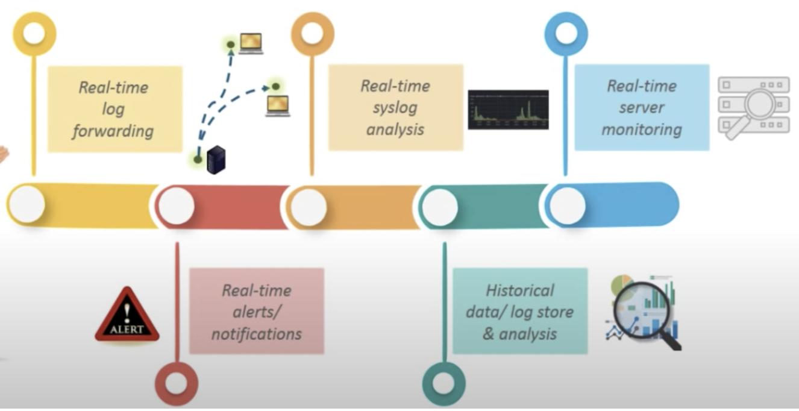
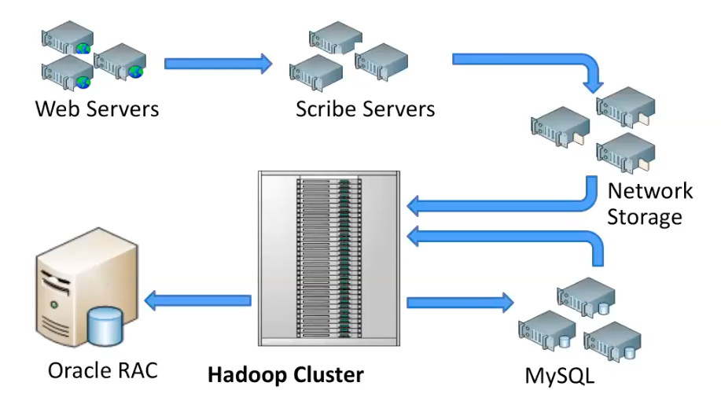
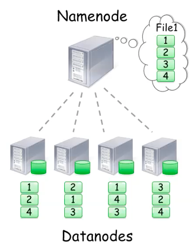
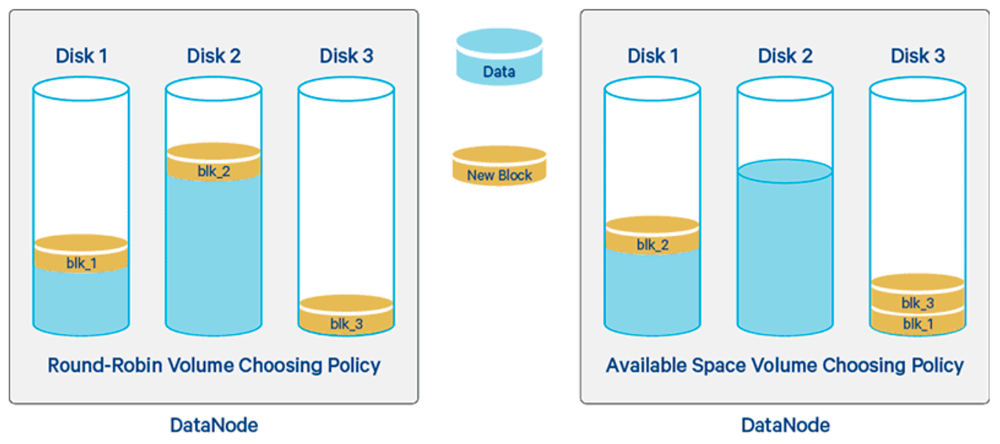

# NoSQL

* horizontally scalable, add servers in NoSQL database infrastructure to handle more traffic
* Flexible Schema: NoSQL support key-value structures which can be added as needed
* Distributed Data: Parallel read, write across multiple servers, incremental growth in cluster
* Replication: saving multiple copies of data single copies of data create bottlenecks (tune)
* Eventual consistency

* Nested: Three recently visited chat
  * [+] Simple, Esay
  * [-] Not scalable
* Subcollections: Create users within chat
  * [+] Size of parent is same
  * [-] Hard to delete subcollection
* Root-level collections
  * [+] N to N relation one for users and another for rooms and messages
  * [-] Getting data that is naturally hierarchical increase complexity

## wide column

* Have column families, which are containers for rows
* Don’t need to know all the columns and row doesn’t have to have the same # of columns
* [+] Best suited for analyzing large datasets
* [ex] Cassandra, HBase


## Graph

* Store data whose relations are best represented in a graph
* Data is saved in graph with nodes (entities), properties (information), lines (connections)
* Neo4J
* solr: distributed indexing, replication, load-balanced querying, automated failover, recovery, centralized config
  * powers the search and navigation features

## Key-Value Stores

* Data is stored in an array of key-value pairs
* key is an attribute name which is linked to a ‘value’
* [+]caching

### Redis

* In-memory key-value database with optional durability
* keys may have internal structure and expiry (captcha images)
* ziplist compacts size of list in memory without changing contents
* more complex for insertion and deletion
* support abstract data structure → str, list, map, set, sorted set, HyperLogLog, bitmap, stream, spatial index
* replication is accomplished through master-slave mode

### Elastic Search

| SQL      | elasticsearch         |
| -------- | --------------------- |
| Database | Index                 |
| Table    | Type                  |
| Row      | Document              |
| Column   | Field                 |
| Schema   | Mapping               |
| Index    | Everything is indexed |
| SQL      | Query DSL             |

> Terms

* Cluster


* Documents: For single customer or order or an event resides in index
* Nodes: Part of the cluster that stores the data with search and index capabilities
  * Node names are lower-case and can have many of them

* Shard, Replica: portion of the index
* Indexes: Collection of similar documents

> Types

* category or partition of index

```text
<REST verb> <Index> <Type> <ID>
```

### Firebase




```js
const functions = require("firebase-functions");
const admin = require("firebase-admin");

admin.initializeApp();
const express = require("express");
const app = express();

app.get("/screams", (req, res) => {
  admin.firestore().collection("spots").get()
    .then(data => {
      let screams = [];
      data.forEach(doc => {
        screams.push(doc.data());
      });
      return res.json(screams);
    })
    .catch(err => console.error(err));
});

app.post("/scream", (req, res) => {
  const newScream = {
    body: req.body.body,
    userHandle: req.body.userHandle,
    createdAt: admin.firestore.Timestamp.fromDate(new Date())
  };

  admin.firestore().collection("spots").add(newScream)
    .then(doc => {
      res.json({
        message: `document ${doc.id} created successfully`
      });
    })
    .catch(err => {
      res.status(500).json({
        error: "something went wrong"
      });
    });
});

exports.api = functions.https.onRequest(app);
```




* Transactions: a set of read and write operations on one or more documents
* Batched Writes: a set of write operations on one or more documents (max 500)
* firestore.Increment(50): if current isn’t numeric value, sets field to the given value
* doc_ref.update({'id': firestore.DELETE_FIELD})  # delete field
* city_ref.update({u'regions': firestore.ArrayRemove([u'east_coast'])})    # delete from array

* Client
  * collection("user"): CollectionReference
  * document("doc"): DocumentReference

* WriteBatch

* CollectionReference
  * db.collection("problem"): get reference
  * list_documents() → Generator[DocRef]: list documents
  * stream()  → Generator[DocSnap]: list streams
  * get(): get all documents in collection
  * delete()

* DocumentReference
  * id: id
  * document("rbtmd1010")
  * get() → DocumentSnapShot(): get_document
  * delete(): delete document
  * update({"kr_name": '황규승'}): update document

* DocumentSnapshot
  * to_dict(): convert to dictioanry

```py
from firebase_admin import credentials, firestore, initialize_app
from collections import defaultdict
from functools import lru_cache
from itertools import islice

# 1. Batch Usage
batch = db.batch() # Write in patch
nyc_ref = db.collection(u'cities').document(u'NYC') # Set the data for NYC
batch.set(nyc_ref, {u'name': u'New York City'})

sf_ref = db.collection(u'cities').document(u'SF')   # Update the population for SF
batch.update(sf_ref, {u'population': 1000000})
den_ref = db.collection(u'cities').document(u'DEN') # Delete DEN
batch.delete(den_ref)
batch.commit()    # Commit the batch

# 2. Firebas class
class FirebaseDB():
  def __init__(self):
    cred = credentials.Certificate(service_account_credential)
    try:
      initialize_app(cred)
    except Exception as e:
      logger.error(e)
      return
    self._db = firestore.client()

  def add(self, collection_id, document, overwrite=True):
    document_id = document.__dict__[collection_id + "_id"]
    document_ref = self._db.collection(collection_id).document(document_id)

    if not overwrite and document_ref.get().exists:
      return False
    document_ref.set(document.__dict__)
    return True

  def delete(self, collection_id, document_id, ignore_missing=True):
    logger.debug(f"delete({collection_id}, {document_id})")

    document_ref = self._db.collection(collection_id).document(document_id)
    if not ignore_missing and not document_ref.get().exists:
      return False
    document_ref.delete()
    return True

  @functools.lru_cache
  def get_all(self, collection_id):
    logger.debug(f"get_all({collection_id})")
    return {doc_ref.id: dict2class(collection_id, doc_ref.to_dict())
            for doc_ref in self._db.collection(collection_id).get()}

  def get(self, collection_id, document_ids):
    document_id2obj = self.get_all(collection_id)
    documents = []
    if not isinstance(document_ids, list):
      document_ids = [document_ids]
    for document_id in document_ids:
      documents.append(document_id2obj[document_id])
    return documents[0] if len(documents) == 1 else documents

remote_db = FirebaseDB()

# 3. update_solved.py
class Team:
  def __init__(self, team_id="", admin_ids=None, member_ids=None):
    self.team_id = team_id
    self.admin_ids = admin_ids or []
    self.member_ids = member_ids or []

  @staticmethod
  @lru_cache
  def show_progress(team_id):
    from ..database import local_db, remote_db
    member_ids = remote_db.get("team", team_id).member_ids
    members = remote_db.get("member", member_ids)
    members.sort(key=lambda member: len(member.solved_problem_ids))
    html = '<div id="search-problem" onchange=toggle_visibility()>'
    html += 'bj_range=<input type="number" class="min_bj_level" value="1">~ \
                      <input type="number" class="max_bj_level" value="10"><br>'

    for i, member in enumerate(reversed(members)):
      html += f'<input id="{member.id}" class="show_member_id" type="checkbox">{member.kr_name} \
        {len(member.solved_problem_ids)} {member.baekjoon_id}</input><br>'
      member.solved_problem_ids = set(member.solved_problem_ids)

    problems = local_db.get_all("problem")
    problems = problems.values()
    cate2problems = defaultdict(list)
    for problem in problems:    # cache headers to problem for effeciency
      if problem.solution_link != "" and problem.problem_id.startswith("BJ"):
        cate2problems[f"{problem.category_id}"].append(problem)
    for category in categories:
      html += f"<h1>{category}</h1>"
      for problem in sorted(cate2problems[f"{category}"], key=lambda problem: problem.level):
        html += f'<table style="table-layout:fixed;">'
        html += f"<tr id='{problem.level}' class='bj_level'>"
        html += f"<td style='width:400px;'>{problem.link}</td>"
        html += f"<td style='width:70px;'>{problem.solution_link}</td>"
        html += " ".join([f"<td> <span id={member.id} class= \
          '{'' if problem.problem_id in member.solved_problem_ids else 'member_id'}' \
          style='display:none;'>{member.kr_name}</span></td>" for member in members])
        html += f"</tr>"
      html += f"</table>"
    html += "</div>"
    return html

for member_ref in db.collection("member").list_documents():
  member = member_ref.get().to_dict()
  member_ref.update({'solved_problem_ids': member["solved"], 'solved': firestore.DELETE_FIELD})
```




### Mongo DB


```sh
systemctl start mongod   # start mongodb
systemctl status mongod  # show mongodb status

/etc/mongod.conf     # configuration
/data/db             # default dbpath
/var/lib/mongo       # data directory
/var/log/mongodb     # log directory

27017                # default port for mongod and mongos instances
27018                # when running with --shardsvr command-line option
27019                # when running with --configsvr command-line option
```

> CLI

* mongod
  * help: Show help
  * --repair: repair
  * show dbs: Print a list of all databases on the server
  * use `db`: Switch current database to `db`
  * db.help(): Show help for database methods
  * --dbpath arg: Directory for datafiles defaults to /data/db
  * db.`collection`.help(): help on collection methods. collection can be non-existing
  * show collections: Print a list of all collections for current database

## DDL




```js
db.dropDatabase()
db.createCollection('users')
```




## DML

* count()
* find()




```js
db.dropDatabase()
db.createCollection('users')

user_cl.count()                       // Count # of drinkers.
user_cl.count(addr: {$exists: true})  // with unique addresses

// db.<collection>.find(<query filter>, <projection>).<cursor modifier>
// SELECT <projection> FROM <collection> WHERE <query filter>
user_cl.find(name: {$ne : null))   // Non null value
user_cl.find().pretty()            // pretty
user_cl.find().sort({title:-1})    // sort by title
user_cl.find(tags.1: "summer")     // 2nd element in tags is "summer"
user_cl.find().forEach(function(d){print(d.id)}) // forEach
user_cl.find({_id:{$gt:24}}, {email:1, _id:0})   // Grab email info for indexes gt 24
user_cl.find(name: {$regex: |^go.*le$|})         // RE: starts with go ends with le
user_cl.find({tags: {$in : ["popular", "smart"] } })    // users tagged as popular or smart
user_cl.find({tags: {$nin : ["popular", "organic"] } }) // not tagged as
user_cl.insert({ name:'sean', rating:5})   // insert sean’s rating
post_cl.remove({ name : 'Ryan' })          // insert post named ryan
user_cl.update({ _id: 1 }, { rating: 4 }, { upsert: true } ); // Add if not present
user_cl.update({ _id: 1 }, { $set: { rating: 4}});            // Only update without erasing
user_cl.update({ _id: 1 }, { $inc : { rating: 10 } })         // Increment
user_cl.update({ _id: 1 }, { $rename : { rating: 'rate'} })   // rename

find({ "key" : { "$exists" : false } })  // find if key doesn’t exists
db.collection.update( {},
  [{ $set: { a: { $concat: [ "$a", "World" ] } } }],
  { multi: true })
update_one({}, {"$set": {"a": 1}}, upsert=F) // update field
update_many({}, {'old' : 'new'})  // rename field "old" to "new" in all documents
cl.create_index([( "_kowiki_id_v0", 1 )],partialFilterExpression = {'_kowiki_id_v0' : {'$exists': True }}

# aggregate
db.COL.update_many({}, [{ "$set": { '_id': { '$concat': [ "COL", "$_id" ] } } }])
db.zipcodes.aggregate( [  // Average population by state
   { $group: { _id: { state: "$state", city: "$city" }, pop: { $sum: "$pop" } } },
   { $group: { _id: "$_id.state", avgCityPop: { $avg: "$pop" } } }
] )
db.zipcodes.aggregate( [  // States with Populations above 10 Million
   { $group: { _id: "$state", totalPop: { $sum: "$pop" } } },
   { $match: { totalPop: { $gte: 10*1000*1000 } } }
] )

// compound
db.collection.createIndex( { <field1>: <type>, <field2>: <type2>, ... } )
cl.updateMany({}, {$rename: {'orig: "new"}} : rename entire field name

// 2. Text
db.stores.createIndex( { name: "text", description: "text" } )
// tokenize the search string using whitespace and most punctuation as delimiters
cl.find({ $text:{ $search: "java -coffee" }})    # Exclude query
```




> pymongo

* Namespace is the concatenation of the database name and collection name
* MongoDB does not support foreign key constraints
* not support default multi-document ACID transactions atomic operation on a single document
* indexes are stored in RAM
* Can’t use index Regex or negation operators ($nin, $not). Arithmetic operators ($mod). $where

* pymongo.Client
  * list_database_names(): show all database
  * drop_database(name_or_database): drop database

* pymongo.Database
  * drop_collection(collection_name): remove matching document
  * list_collections_names(): show all collections
  * db[collection_name] || db.collection_name: get collection

* pymongo.Collection
  * count_documents({}): counts documents
  * create_index(keys): create index on keys
  * delete_one(): drop one document
  * insert_one(): insert one document
  * insert_many()
  * rename(new_name): rename this collection

* operator
  * "$eq": equal to a specified value
  * "$gt": greater than a specified value
  * "$gte": greater than or equal to a specified value
  * "$lt": less than a specified value
  * "$lte": less than or equal to a specified value
  * "$ne": not equal to a specified value
  * "$exists": exists in documents
  * "$in": any of the values specified in an array
  * "$nin": none of the values specified in an array
  * "$or": Joins query clauses with a logical OR
  * "$not": Inverts the effect of a query expression
  * "$nor": Joins query clauses with a logical NOR
  * '{ "$and": [ {"sex": "male"}, {"age": "26"}]}': Joins query clauses with a logical AND
  * "{'$regex':'^File'}"




### Spark

* Driver Program creates Resilient distributed datasets (RDDs)
* Low-latency for small micro-batch size
* Batch and stream processing using disk or memory storage
* SparkSQL, Spark streaming, MLlib, GraphX

> Commands

* lazy evaluation → transformations are not executed until the action stage
* Narrow: processing logic depends only on data, residing in the partition → no data shuffling necessary
* Wide: transformation that requires data shuffling across node partitions

> Function

* collect(): copy all elements to the driver
* take(n): copy first n elements
* reduce(func): aggregate elements with func
* saveAsTextFile(filename): Save to local file or HDFS

* Narrow Transformation
  * coalesce(): reduce number of partitions
  * filter(func): keep only elements where function is true
  * flatMap(func): map then aggregate
  * map(func): apply function to each element of RDD

* Wide Transformation
  * groupbykey
  * reducebykey

* MLlib

* GraphX
  * Uses property graph model → both nodes and edges can have attributes and values
  * triplet view → logically joins vortex and edge properties




```py
import pyspark
from operator import add
from pyspark.mllib.stat import Statistics

# 1. Reduce
sc = pyspark.SparkContext.getOrCreate()
data = sc.parallelize (["scala", "hadoop", "spark", "akka", "spark vs hadoop", "pyspark", "pyspark and spark"])
print(data.count())
print("data.collect()")
filtered = data.filter(lambda x: 'spark' in x).collect()
print(filtered)
print(data.reduce(add))
file = sc.textFile('00_keywords.py')
print(f"{file.count()}")
print(f"{file.take(3)}")
print(f"{file.filter(lambda s: 'print' in s.lower()).count()}")
spark = pyspark.sql.SparkSession(sc)
files = sc.wholeTextFiles('.')
pprint(f"{files.count()}")
df = files.toDF(['name', 'data'])
print(f"{df.select('name').toPandas().head()}")
spark.read.csv('competition_vision/mnist/data/mnist_train.csv').toPandas()
spark.read.load('competition_vision/mnist/data/mnist_train.csv').head()

# 2. MLlib
dataMatrix = sc.parallelize([[1,2,3],[4,5,6], [7,8,9],[10, 11, 12]])
summary = Statistics.colStats(dataMatrix)

from pyspark.mllib.clustering import KMeans, KMeansModel
import numpy as np
data = sc.textFile("data.txt")
parsedData = data.map(lambda line: np.array([float(x) for x in line.split(' ')]))
clusters = Kmeans.train(parsedData, k=3)
```




### Splunk

* Real-time log forwarding | syslog analysis | server monitoring | alerts, notification



* command

```sh
# return the average population of the counties in Georgia
source="census.csv" CTYNAME != "Georgia" STNAME="Georgia" | stats mean(CENSUS2010POP)

# state with the most counties
source="census.csv" | stats count by STNAME | sort count desc
```

## Hadoop


* Open-source data storage framework that store and process large data sets in parallel and distributed fashion
* Scalability commodity hardware for data storage, availability commodity hardware for distributed processing
* JVMs do not share state, processes differ between Hadoop 1.0 and 2.0
* Hadoop cluster
* Default chunk size, the size of each piece of a file is 64 megabytes
* hadoop fs -copyFromLocal words.txt
* copy into hadoop
* One replica on local node, Second / third replica on a remoate rack, Additional replicas are randomly placed
  * Clients read from nearest replica, would like to make this policy pluggable
* vs HBase: HBase is NoSQL, hadoop uses an alternative file system (HDFS)
* [+] Long term availability of data, future anticipated data growth
* [+] Many platforms over single data store (facilitate shared environment)
* [+] High volume, variety, behavioral data → batch process, health care
* [+] Pre-built hadoop images → quick prototyping, deploying, and validating of projects
* [-] Small data processing, Task level parallelism, Random data access
* [-] Advanced algorithms (highly coupled data processing algorithm)
* [-] Replacement to your infrastructure (may not be suitable solution for business case)
* [-] Machine learning → HDFS Bottleneck | Mapreduce Computation | No interactive shell | Java
* [-] Line of Business → usually transactional and not a good fit (X - use relational database)
* [ex] commercial distribution: Cloudera, Hortonworks, MapR
* [ex] Open source: apache
* [ex] public cloud: Iaas(VM, docker), PaaS(AWS, HDinsight), some commercial available

> Challedges

1. Chaep nodes fails, especially if you have many
    * Build fault tolerance into system
1. Commodity network = low bandwidth
    * Push computation to the data
1. Programming distributed systems is hard
    * Data parallel programming models (users write map & reduce functions, system distributes work and handles faults)
    * Use CRC32 checksum to validate data

> Question

* Three layers of ecosystem?
  * Data Management and Storage
  * Data Integration and Processing
  * Coordination and Workflow Management

> Terms

* Checkpointing: process of combining edit logs with FsImage, happens periodically (default: 1 hour)

* Cluster: designed specifically for storing and analyzing huge unstructured data in distributed computing environment
  * Such clusters run Hadoop's open source distributed processing software on low-cost commodity computers
  * 40 nodes/rack, 1-4000 nodes in cluster
  * 1 Gbps bandwidth within rack, 8 Gbps out of rack
  
  

* DataNode: Serves read / write requests of data / meta-data to clients
  * Slave daemons, Stores actual data
  * Facilitates pipelining of data (forwards data to other specified DataNodes)
  * Block server: stores data in local file system (ext3), meta-data of a block (CRC)
  * Block report: periodically sends a report of an existing blocks to NameNode

* editLog: only contain the most recent changes
  * reside in the RAM of the machine

* fsImage: contain all the details of all the changes

* NameNode: Maintains and manages DataNodes, one per cluster
  * records metadata (data blocks info, location of blocks stored, the size of files, permissions, hierarchy) in memory
  * No demand paging of meta-data
  

* Rebalancer: \% disk full on DataNodes should be similar
  * Usually run when new DataNodes are added
  * Cluster is online when Rebalancer is active
  * throttled to avoid network congestion
  

* Secondary NameNode: Allows faster Failover as it prevents edit logs from getting too huge
  * Takes over the responsibility of checkpointing, therefore, making NameNode more available

* fs
  * hadoop fs -`command_name`
  * copyFromLocal `fname`
  * copyToLocal `fname`

* jar
  * wordcount `ins` `out`
  * hadoop jar |usr|jars|hadoop-examples.jar wordcount

* Yarn: Flexible scheduling and resource management
  * Allows various applications to run on the same Hadoop cluster

> HDFS (Hadoop distributed file system)


* Maintains three copies of every block
* Single namespace for entire cluster, metadata (file names, block, locations)
* Files are append-only split into 128mb blocks
* Block replicated across several datanodes
* Optimized for large files (10k nodes, 100m files, 10PB), batch processings, sequential reads
  * Data locations exposed so that computations can move to where data resides
  * provides very high aggregate bandwidth
* Assumes commodity hardware: files are replicated to handle hardware failure
  * Detect failures and recovers from them
* User space, runs on heterogeneous OS

> Hive

* Hadoop subproject in SQL manner when files are insufficient, need tables, schemas, partitions, indices
* Need a multi petabyte warehous for an open data format (RDBMS)

### Mapreduce


* Large data processing API designed for scalability and fault-tolerance
  * Retry on another node: OK for a map because no dependencies, for reduce because map outputs are on disk
  * If same task fails repeatedly, fail job or ignore that input block
* Pluggable user code runs in generic framwork
* Dependent tasks, interactive analysis, Native support for Java only
* High-latency, allow parallel & distributed processing using disk storage
  * Launch second copy of task if task is slow then kill when finishes first
* Map-Reduce consists of three main steps: Mapping, Shuffling and Reducing
* Map: Apply same operation to each member of collection
  * minimize network usage by saving outputs to local disk before serving them to reducers
  * allows recovery if a reducer crashses, hvaing more reducers than nodes
* Reduce: collecting things that have same 'key'
* [+] Hides complexities of parallel programming  → search engine page ranking and topic mapping
* [-] frequently changing data → slow, as it reads entire input data
* [ex] Index construction G search, Article clustering for G News, Machine translation, FB Spam detection
* [ex] Log processing, web search indexing, ad-hoc queries

> Design pattern

* wc, cat \*, grep, sort, unique, cat > file, input, map, shuffle, reduce, output

```py
def mapper(line):
  for word in line.split():
    output(word, 1)

def reducer(key, values):
  output(key, sum(values))
```
