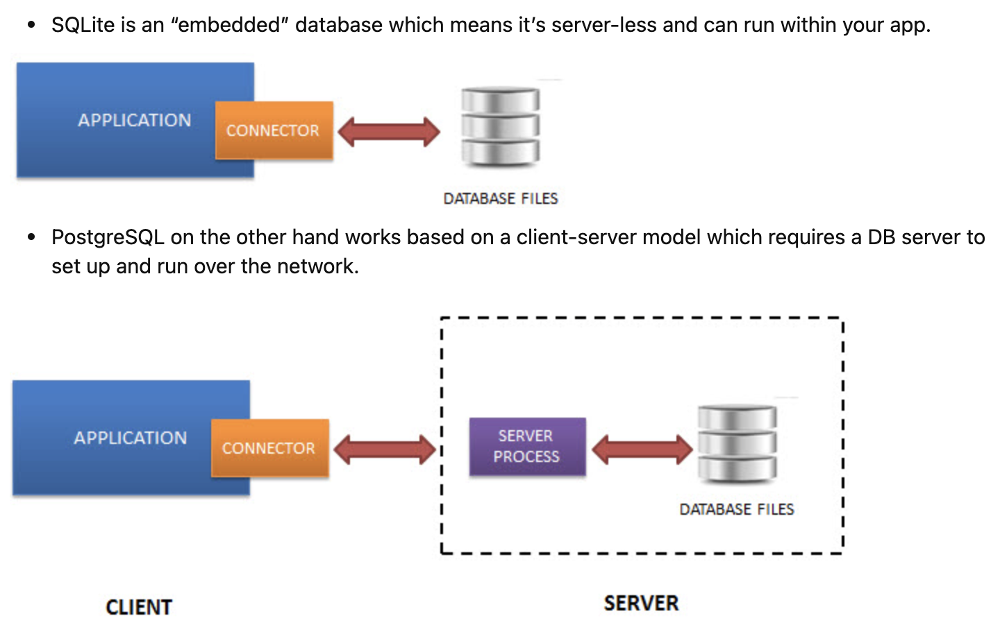

# Query

| Serverless (Postgres)                                   | Server SQL (MySQL, Postgres)                          |
| ------------------------------------------------------- | ----------------------------------------------------- |
| Small apps that don’t require expansion                 | Complexity with ease, functionality                   |
| Apps need to read or write files to disk directly (ioT) | Data integrity and reliability is highly concerned    |
| Developing and even testing                             | Custom Procedures, extensible to run the complex task |

* sqllite
  * [+] very fast due to ultra-lightweight, esay setup, administration, and required resource
  * [-] no authentication system. The database file itself can be updated/read by anyone.
  

## User




* createdb `user`: create db named `user`
* ALTER
  * USER `librarian` WITH `SUPERUSER`

> Error

* psql: FATAL: database "root" does not exist
  * psql assumes you want to access a database with the same name as your user name
  * psql postgres -> \du -> find a `name` -> psql -U `name`




### Role

* SHOW DATABASES / SCHEMAS;




* postgres
  * REASSIGN
    * OWNED BY old_role TO new_role




## Postgres

* need semicolon, use single quote for string
* yum install postgres-server
* psql mydb < `PATH`

* GRANT
  * ALL ON ALL TABLES IN SCHEMA public to dbuser;
  * ALL ON ALL SEQUENCES IN SCHEMA public to dbuser;
  * ALL ON ALL FUNCTIONS IN SCHEMA public to dbuser;

> Error : Got an error creating the test database: permission denied to create database

* ALTER ROLE user1 WITH SUPERUSER;
* must be superuser to alter superusers
  * sudo -u postgres psql




* shell CLI
  * \d: list tables, views, sequences such as a column, type, modifiers of columns
  * \df: list available functions in the current database
  * \dg: list roles
  * \dn: list all schemas of the currently connected database
  * \dt: list all tables in the current database, you use \dt command
  * \du: display users
  * \l: list all databases in the current PostgreSQL database server
  * \q: exit
  * \connect template1: connect to db

```sql
-- 1. Check Existence of table
SELECT EXISTS (SELECT * from information_schema.tables where table_name='entity_keyphrases');
SELECT * from information_schema.tables where table_schema = public;
SELECT * FROM pg_tables ORDER BY tableowner;  -- Default Tables

-- 2. Show running query
SELECT pid, client_addr, usename, datname, state, query FROM pg_stat_activity;
SELECT pg_cancel_backend(pid)        # Stop certain query
pg_terminate_backend(pid)             # terminates entire process | database connection

-- 3. Kill all idle queries
SELECT pg_terminate_backend(pid) FROM pg_stat_activity WHERE state in ('idle', 'idle in transaction');
```




### SQLite Python

* connect(`db_path`): connect to file_db path

* Connection: SQLite database connection object
  * close(): close the connection
  * commit(): commit the current transaction
  * execute(): Executes a SQL statement

* Cursor: SQLite database cursor class
  * fetchall(): Fetches all rows from the resultset
  * fetchone(): Fetches one row from the resultset




```py
import sqlite3
import json
import pandas as pd

# 1. singleton class to deal with db
class DBConnection:
  instance = None

  def __new__(cls, *args, **kwargs):
    if cls.instance is None:
      cls.instance = super().__new__(DBConnection)
      return cls.instance
    return cls.instance

  def __init__(self, db_name='you-db-name'):
    self.name = db_name
    # connect takes url, dbname, user-id, password
    self.conn = self.connect(db_name)
    self.cursor = self.conn.cursor()

  def connect(self):
  try:
    return sqlite3.connect(self.name)
  except sqlite3.Error as e:
    pass

  def __del__(self):
    self.cursor.close()
    self.conn.close()

conn = sqlite3.connect('data/sample.db') # sqlite3.connect(":memory:")
c = conn.cursor()

# 2. CRUD
c.execute("DROP TABLE students")
c.execute("CREATE TABLE IF NOT EXISTS students (id object PRIMARY KEY, date text)")
c.execute("INSERT INTO students(date) VALUES ('2006-01-05')")

c.execute("CREATE INDEX idx_id ON students(id)")
for row in c.execute('SELECT * FROM students ORDER BY date'):
  print(row)
dic = {'new' : [1, 2, 4], 'date' : '2006-02-22', 'raw' : 'afd, (),'}
for key in dic.keys():
  try:
    c.execute(f"ALTER TABLE students ADD COLUMN {key}")
  except:
    pass

c.execute(f"INSERT INTO students({', '.join(dic.keys())}) \
  VALUES ({', '.join('?' * len(dic.keys()))})", tuple(flatten(e) for e in dic.values()))

conn.commit()

# 3. Dataframe
def db2dicts(db_path):
  db = bsddb3.btopen(db_path, 'r')
  for id in db:
    try:
      dic = json.loads(db[id])
      assert isinstance(dic, dict)
    except:
      dic = {'raw': db[id].decode('utf-8')}
    yield({'_' + k: v for k, v in dic.items()})

def json2server(db_path, sqlite_path=None):
  conn = sqlite3.connect(sqlite_path)
  try:
    conn.execute(f"DROP TABLE {cate}")
  except:
    pass

  conn.execute(f"CREATE TABLE IF NOT EXISTS {cate} (_id object PRIMARY KEY)")

  for dic in db2dicts(db_path):
    columns = set(e[1] for e in conn.execute(f"PRAGMA table_info('{cate}')").fetchall())
  for key in dic.keys():
    if key not in columns:
      conn.execute(f"ALTER TABLE {cate} ADD COLUMN {key}")
      columns.add(key)
  try:
    conn.execute(f"INSERT INTO {cate}({', '.join(dic.keys())}) VALUES ({', '.join('?' * len(dic.keys()))})",
      tuple(repr(e) for e in dic.values()))
  except:
    logger.warn("invalid" + str(sys.exc_info()[0]))

  conn.commit()

def query2df(sqlite_path, query):
  print("\n", query)
  conn = sqlite3.connect(sqlite_path)
  cursor = conn.execute(query)
  return pd.DataFrame(data=cursor.fetchall(), columns=[c[0] for c in cursor.description])

def flatten(obj):
  if isinstance(obj, str):
    return "'" + obj + "'"
  else:
    return "'" + repr(obj) + "'"

display(query2df('data/sample.db', "PRAGMA index_list('students')"))
display(query2df('data/sample.db', "PRAGMA table_info('students')"))
with pd.option_context('display.max_rows', None, 'display.max_columns', None):  # more options can be specified also
  display(query2df('data/sample.db', "SELECT name as table_name \
    FROM sqlite_master WHERE type ='table' AND name NOT LIKE 'sqlite_%';"))
```




## DML




* Mongo
  * count()
  * find()

```js
// 1. MongoDB
db.dropDatabase()
db.createCollection('users')

user_cl.count()                       // Count # of drinkers.
user_cl.count(addr: {$exists: true})  // with unique addresses

// db.<collection>.find(<query filter>, <projection>).<cursor modifier>
// SELECT <projection> FROM <collection> WHERE <query filter>
user_cl.find(name: {$ne : null))   // Non null value
user_cl.find().pretty()            // pretty
user_cl.find().sort({title:-1})    // sort by title
user_cl.find(tags.1: "summer")     // 2nd element in tags is "summer"
user_cl.find().forEach(function(d){print(d.id)}) // forEach
user_cl.find({_id:{$gt:24}}, {email:1, _id:0})   // Grab email info for indexes gt 24
user_cl.find(name: {$regex: |^go.*le$|})         // RE: starts with go ends with le
user_cl.find({tags: {$in : ["popular", "smart"] } })    // users tagged as popular or smart
user_cl.find({tags: {$nin : ["popular", "organic"] } }) // not tagged as
user_cl.insert({ name:'sean', rating:5})   // insert sean’s rating
post_cl.remove({ name : 'Ryan' })          // insert post named ryan
user_cl.update({ _id: 1 }, { rating: 4 }, { upsert: true } ); // Add if not present
user_cl.update({ _id: 1 }, { $set: { rating: 4}});            // Only update without erasing
user_cl.update({ _id: 1 }, { $inc : { rating: 10 } })         // Increment
user_cl.update({ _id: 1 }, { $rename : { rating: 'rate'} })   // rename

find({ "key" : { "$exists" : false } })  // find if key doesn’t exists
db.collection.update( {},
  [{ $set: { a: { $concat: [ "$a", "World" ] } } }],
  { multi: true })
update_one({}, {"$set": {"a": 1}}, upsert=F) // update field
update_many({}, {'old' : 'new'})  // rename field "old" to "new" in all documents
cl.create_index([( "_kowiki_id_v0", 1 )],partialFilterExpression = {'_kowiki_id_v0' : {'$exists': True }}

# aggregate
db.COL.update_many({}, [{ "$set": { '_id': { '$concat': [ "COL", "$_id" ] } } }])
db.zipcodes.aggregate( [  // Average population by state
   { $group: { _id: { state: "$state", city: "$city" }, pop: { $sum: "$pop" } } },
   { $group: { _id: "$_id.state", avgCityPop: { $avg: "$pop" } } }
] )
db.zipcodes.aggregate( [  // States with Populations above 10 Million
   { $group: { _id: "$state", totalPop: { $sum: "$pop" } } },
   { $match: { totalPop: { $gte: 10*1000*1000 } } }
] )

// compound
db.collection.createIndex( { <field1>: <type>, <field2>: <type2>, ... } )
cl.updateMany({}, {$rename: {'orig: "new"}} : rename entire field name

// 2. Text
db.stores.createIndex( { name: "text", description: "text" } )
// tokenize the search string using whitespace and most punctuation as delimiters
cl.find({ $text:{ $search: "java -coffee" }})    # Exclude query
```




* pymongo
  * Namespace is the concatenation of the database name and collection name
  * MongoDB does not support foreign key constraints
  * not support default multi-document ACID transactions atomic operation on a single document
  * indexes are stored in RAM
  * Can’t use index Regex or negation operators ($nin, $not). Arithmetic operators ($mod). $where

  * pymongo.Client
    * list_database_names(): show all database
    * drop_database(name_or_database): drop database

  * pymongo.Database
    * drop_collection(collection_name): remove matching document
    * list_collections_names(): show all collections
    * db[collection_name] || db.collection_name: get collection

  * pymongo.Collection
    * count_documents({}): counts documents
    * create_index(keys): create index on keys
    * delete_one(): drop one document
    * insert_one(): insert one document
    * insert_many()
    * rename(new_name): rename this collection

  * operator
    * "$eq": equal to a specified value
    * "$gt": greater than a specified value
    * "$gte": greater than or equal to a specified value
    * "$lt": less than a specified value
    * "$lte": less than or equal to a specified value
    * "$ne": not equal to a specified value
    * "$exists": exists in documents
    * "$in": any of the values specified in an array
    * "$nin": none of the values specified in an array
    * "$or": Joins query clauses with a logical OR
    * "$not": Inverts the effect of a query expression
    * "$nor": Joins query clauses with a logical NOR
    * '{ "$and": [ {"sex": "male"}, {"age": "26"}]}': Joins query clauses with a logical AND
    * "{'$regex':'^File'}"




### Query Delete

* To delete all the rows in a table, use TRUNCATE TABLE. TRUNCATE TABLE is faster than DELETE

* TABLE `table_name`: Clear Table
* FROM `table`: Delete everything from table
  * WHERE markdown_id='': Delete where string is empty




```js
// 1. Delete
// Delete everyone named "Jane"
await User.destroy({
  where: { firstName: "Jane" }
});

// DELETE FROM post WHERE status = "inactive"
Post.destroy({
  where: {
    status: 'inactive'
  }
});
```




```sql
-- 1. Delete all
TRUNCATE TABLE table_name;
DELETE * FROM table_name;

-- 2. Delete every movie that is not currently playing
DELETE FROM movie WHERE title NOT IN (SELECT title FROM schedule)
```




### SQL INSERT




* Big query
  * Column names are optional if the target table is not an ingestion-time partitioned table
  * Duplicate names are not allowed in the list of target columns

```sql
INSERT INTO loan (no, type, minCredit) VALUES
  ('jumbo mortgage', 'student', 1),
  ('b', 'y', 2),
  ('c', 'z', 3);
```




### SQL Update




```js
// 1. Update
//// Change everyone without a last name to "Doe"
await User.update({ lastName: "Doe" }, {
  where: { lastName: null }
});

//// UPDATE post SET updatedAt = null WHERE deletedAt NOT NULL;
Post.update({
  updatedAt: null,
}, {
  where :{
    deletedAt: { [Op.ne]: null }
  }
})

//// Toggle boolean
{
  where: { id },
  params: { finish: Sequelize.literal("NOT finish") },
}
```




```sql
-- 1. change all 'berto' entries to 'bertolucci'
UPDATE movie SET director='bertolucci' WHERE director='berto';

-- 2. Increase all salary in toys dept by 10%
UPDATE employee SET salary = 1.1 * salary
WHERE dept = 'toys'

-- 3. Change type of all “jumbo” loans to “student” and type of all original “student” loans to “jumbo”.
UPDATE bank.loan SET type =
  CASE type
    WHEN 'jumbo' THEN 'student'
    WHEN 'student' THEN 'jumbo'
  END
WHERE type = 'jumbo' OR type = 'student';
```




## DCL

* commands are used to grant and take back authority from any database user




```sql
-- 1. give user access privileges to a database
GRANT SELECT, UPDATE ON MY_TABLE TO SOME_USER, ANOTHER_USER;

-- 2. take back permissions from the user
REVOKE SELECT, UPDATE ON MY_TABLE FROM USER1, USER2;
```




## DDL

* changes the structure of the table like creating a table, deleting a table, altering a table, etc
* All the command of DDL are auto-committed that means it permanently save all the changes in the database




```js
// 1. getter.js
const User = sequelize.define('user', {
  // wanted to see every username in uppercase, even though they are not necessarily uppercase in the database itself
  username: {
    type: DataTypes.STRING,
    get() {
      const rawValue = this.getDataValue(username);
      return rawValue ? rawValue.toUpperCase() : null;
    }
  }
});

// 2. setter.js
const User = sequelize.define('user', {
  username: DataTypes.STRING,
  password: {
    type: DataTypes.STRING,
    set(value) {
      this.setDataValue('password', hash(value));
    }
  }
});

// 3. Virtual Field
const { DataTypes } = require("sequelize");

const User = sequelize.define('user', {
  firstName: DataTypes.TEXT,
  lastName: DataTypes.TEXT,
  fullName: {
    type: DataTypes.VIRTUAL,
    get() {
      return `${this.firstName} ${this.lastName}`;
    },
    set(value) {
      throw new Error('Do not try to set the `fullName` value!');
    }
  }
});

// 4. Update column
/* ALTER TABLE "public"."Person" DROP COLUMN "petName"; */
queryInterface.removeColumn('Person', 'petName', { /* query options */ });

/* ALTER TABLE `Person` CHANGE `foo` `foo` FLOAT NOT NULL DEFAULT 3.14; */
queryInterface.changeColumn('Person', 'foo', {
  type: DataTypes.FLOAT,
  defaultValue: 3.14,
  allowNull: false
});
```




```js
db.dropDatabase()
db.createCollection('users')
```






### ALTER

* TABLE `table_name` DROP column `COLUMN_NAME`: remove column from table




```sql
-- 1. ALTERING TABLE
ALTER TABLE table_name ADD column_name d_type DEFAULT 3;  -- Add Column
ALTER TABLE table_name RENAME TO new_table_name;          -- Change table name
ALTER TABLE PERSON ADD primary key (persionId,Pname,PMID) -- Add primary key
ALTER ROLE user1 WITH SUPERUSER
```




### CREATE




```sql
-- 1. Create Database
Create database
CREATE DATABASE name
    [ [ WITH ] [ OWNER [=] user_name ]
           [ TEMPLATE [=] template ]
           [ ENCODING [=] encoding ]
           [ LC_COLLATE [=] lc_collate ]
           [ LC_CTYPE [=] lc_ctype ]
           [ TABLESPACE [=] tablespace ]
           [ CONNECTION LIMIT [=] connlimit ] ]

INSERT INTO table_name (column1, column2, column3, ...)
VALUES (value1, value2, value3, ...);

INSERT INTO movie VALUES ("kim", "monster", 2016) -- Insert into table
INSERT INTO movie(title) VALUES ("Harry Potter")  -- Insert with null values
INSERT INTO r SELECT ... FROM ... WHERE           -- Result of query for insertion

-- 2. Create tables
CREATE TABLE DEPT
( DNAME VARCHAR(10) NOT NULL,
DNUMBER INTEGER NOT NULL,
MGRSSN CHAR(9),
MGRSTARTDATE CHAR(9),
PRIMARY KEY (DNUMBER),
UNIQUE (DNAME),
FOREIGN KEY (MGRSSN) REFERENCES EMP ) ;

CREATE TABLE customer (
  name varchar(255) primary key,
  credit integer
);

CREATE TABLE loan (
  no varchar(255) primary key,
  type varchar(255),
  minCredit integer
);

CREATE TABLE borrower (
  cname varchar(255) primary key,
  lno varchar(255),
  due date,
  FOREIGN KEY (cname) REFERENCES customer(name),
  FOREIGN KEY (lno) REFERENCES loan(no)
);

INSERT INTO customer (name, credit) VALUES
  ('sean', 1),
  ('tom', 2),
  ('jason', 3);

INSERT INTO loan (no, type, minCredit) VALUES
  ('jumbo mortgage', 'student', 1),
  ('b', 'y', 2),
  ('c', 'z', 3);

INSERT INTO borrower (cname, lno, due) VALUES
  ('sean', 'jumbo mortgage', '1-1-1'),
  ('tom', 'jumbo mortgage', '2-2-2'),
  ('jason', 'c', '3-3-3');

-- 3. Create Index
CREATE INDEX index_name ON table_name (column_name);
CREATE INDEX index_name ON table_name (column1, column2, ...);
```




* FORMAT_TIMESTAMP("%F", timestamp, "America/Los_Angeles") AS purchase_date

```sql
CREATE OR REPLACE TABLE
```




### Drop

* DATABASE `api`: drop database
* TABLE `table`: drop table
* USER `ryan`: drop user




```sql
-- ALL databases where the role owns anything or has any privileges
DROP OWNED BY ryan;
```




> Error : near "DROP": syntax error

* SQLite does not fully support ALTER TABLE statements. You can only rename table, or add columns




## Injection

* 2012, Linkedin leaked 6m user's data, yahoo, Nvidia, Adobe exposed hundred thousands of passwords
* [ex]
  UPDATE users SET first_name="' + first_name: first_name='" WHERE id=1001; <- "Robert’); DROP TABLE students;–”
  \<input type="hidden" name="permissions" value="{'admin':'true'}" \/\>

1. sanitize input
    * Client-side JavaScript is NOT a solution for validating data as it can be modified
    * [ex] parameter binding, ORM
      escaping: html-escape, shell-escape
1. Turn off mass assignment completely: [ex] strict mode in mongoose
1. Whitelist / Blacklist fields that are safe to be mass assigned
1. Typecasting




```js
// 1. MySQL Parameter binding
var mysql = require('mysql');
var connection = mysql.createConnection({
  host     : 'localhost',
  user     : 'me',
  password : 'secret',
  database : 'my_db'
});

connection.connect();

connection.query(
  'UPDATE users SET first_name = ? WHERE id = ?',
  [req.body.first_name, 1001],
  function(err, result) {
  //...
});

// 2. Whitelist for mongoose
router.post("/add", (req, res) => {
  var whitelist = ["first_name", "last_name", "id"];
  var data = {};

  for (var property in req.body) {
    if (
      req.body.hasOwnProperty(property) &&
      whitelist.indexOf(property) !== -1
    ) {
      data[property] = req.body[property];
    } else {
      console.log("Extra attributes dropped") // this is just for demo
    }
  }
  const newStudent = new Student(data);

  newStudent
    .save()
    .then((student) => res.json(student))
    .catch((err) => res.status(500).json(err));
});

// 3. Typecasting
var id = 1001;
var first_name = req.body.first_name;

connection.query(
  'UPDATE users SET first_name = ? WHERE id = ?',
  [first_name, Number(id)],
  function(err, result) {
    //...
  }
);
```




## Stored Procedure

* [+] Prevent SQL injection
* [-] Stored procedures are difficult to test.
* [-] move logic to another system outside of the application ([ex] hard to track in Version control)
* [-] limit the number of people on your team capable of modifying the logic




```py
from django.db import connection

# 1. Stored procedure in django
cursor = connection.cursor()
ret = cursor.callproc("MY_UTIL.LOG_MESSAGE", (control_in, message_in))
cursor.close()
```



