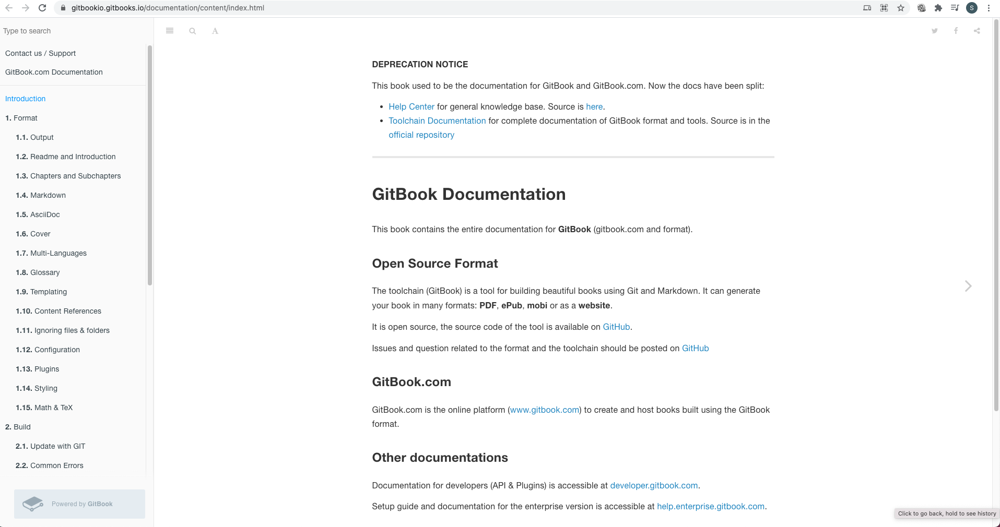

# Digression

This repository is for transferring knowledge and save snippets with unified syntax

Any comments, contributions are welcome.

## Blog Convention

1. Break if current tags are more than 1~20 ([ex] list (*) -> Angle bracket (>) -> h3 -> h2 -> file -> repo -> file)
1. Use hyphen (-) for embed and file name (gitbook generates hypen when url encodes)
1. Always follow linting rules with pre-commit
1. Problem language is ordered alphabetically ([ex] c -> cpp -> java -> python -> shell)
1. Using [include_file](https://github.com/SeanHwangG/include_file) syntax
1. Put Reference in corresponding header so that others can also see additional contents

### Block Quote

* \>: only used for general tags
  * Error
  * Question
  * Solution
  * Terms
  * Reference: Enclosed with angular bracket

### Tags

* Only following will be used in title \{\% tab title='' \%\}

* These are groups into the same \{\% tabs %}
  * Language: C, cmake, C++, html (jinja), java, javascript, python, shell, sql, sv, vim
  * Module: flask, django, spring, react
  * Database: postgres, mongodb, sqlite, bigquery
  * Site: baekjoon, codechef, codeforce, hackerrank, kattis, leetcode
  * Problem: BJ_*, CC_*, CF_*, HR_*, KT_*, LC_*
  * Tool: git, vscode, mac, linux, window, jenkins, docker, dockercompose, github, gitlab

## Blog




```sh
yarn add gatsby react react-dom react-helmet gatsby-plugin-mdx @mdx-js/mdx @mdj-js/react gatsby-source-filesystem
```




### Gitbook

<https://{username}.gitbook.io/>

* [Official Documentation](https://docs.gitbook.com/)
* [Feature Request Page](https://gitbook.canny.io/feature-requests)
* [+] Free hosting, easy setup, push github automatically updates
* [+] Markdown header based text search, hyperlink, images ([page images](tool/vscode.md#util))
* [+] Full markdown, latext math equation support
* [-] Dynamic contents (API Support)

* [+] Built in feature (Google analytics, **jauth**, **full space search**)
  * bold are premium
* [+] Change of UI Collaborate with non developer app.gitbook.com web ui
* [-] Customizing, extension is not supported

1. Create a space
    
2. Select branch (main) -> Write content on gitbook
    
3. Wait for import content -> Select main (Set as main variant)
    

```sh
https://app.gitbook.com/{username}/spaces
integration on left tab -> github

# Add Summary
https://github.com/GitbookIO/gitbook/blob/master/docs/SUMMARY.md

# Contents
https://github.com/GitbookIO/gitbook/tree/master/docs
```

> Reference

<https://docs.gitbook.com/>

### Legacy Gitbook

> Legacy version



* [Example](https://gitbookio.gitbooks.io/documentation/content/index.html)
* [+] Flexibilty with extensions
* [-] Difficult for non-developer

> CLI

* ls: Show version installed
* serve: Run locally
* update: Update version
* install: Install required plugins

* demo / document: [https://gitbookio.gitbooks.io/documentation/content/](https://gitbookio.gitbooks.io/documentation/content/)

```sh
# Setup PC
git --version               # git version 2.17.1
node --version
npm --version

npm install -g gulp         # provides a way to sequence commands that execute steps in local Operating System
gulp --version              # 2.3.0
npm install -g gitbook-cli  # gitbook-cli

# Main Homepage
git pull [username].github.io
echo "<h1> Main </h1>" > index.html
git

# Setup per repository
git clone https://github.com/rebeccapeltz/gitbook-publishable-template.git
mv gitbook-publishable-template/* .
echo "{}" > book.json
grep -qxF '_book' .gitignore || echo '._book' >> .gitignore
grep -qxF 'node_modules' .gitignore || echo '._book' >> .gitignore
rm -rf gitbook-publishable-template
echo "Successfully Setup"

# Publish to Github pages
# alias gbp="gitbook install && gitbook build && rm -rf docs && mkdir -p docs && cp -R _book/* docs \
# git clean -fx node_modules && git clean -fx _book && git add -A && git commit --amend --no-edit && git push --force"
gitbook install && gitbook build
rm -rf docs
mkdir -p docs
cp -R _book/* docs

git clean -fx node_modules
git clean -fx _book

git add -A && git commit --amend --no-edit && git push --force
```

> TypeError: cb.apply is not a function inside graceful-fs

```sh
cd /usr/local/lib/node_modules/gitbook-cli/node_modules/npm/node_modules/
npm install graceful-fs@4.2.0 --save
```

> TypeError: Cannot read property 'pipesCount' of undefined

* npm install gitbook-cli@2.1.2 --global

> Wrong codeblock output

* Codeblock (```) must has new line before starting
* sub list must be preceded by at least 4 space
