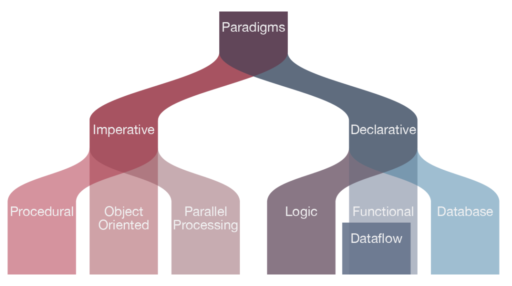
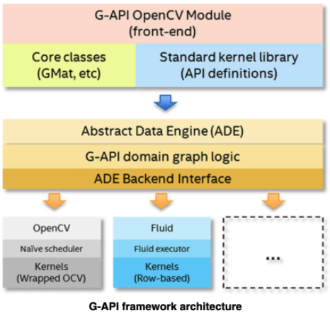
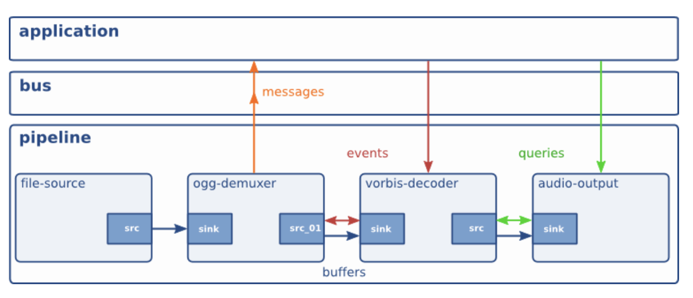
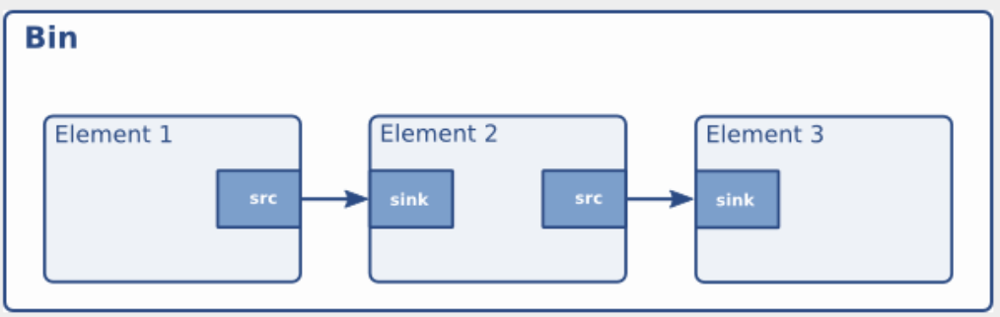
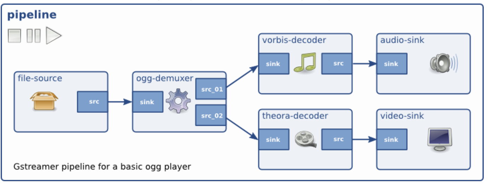

# Language

* Read Merge request, Follow code histroy



> Terms

* Backus–Naur Form: notation technique for context-free grammars, often used to describe the syntax of languages
  * name    ::=  lc_letter (lc_letter | "_")*
  * lc_letter::=  "a"..."z"
  * \<digit>::= "0" | "1" | "2" | "3" | "4" | "5" | "6" | "7" | "8" | "9"

* Functional
  * [+] Immutability → frees us from having to deal with state change
  * [+] separating functions and data → data passed as arguments, instead of self keyword as in OOP
  * [+] first-class functions → treat functions as variable, use higher-order function to maintain SRP

* Declarative: What ([ex] X is the sum of all the numbers in the list, divided by the length of the list)
* Imperatives: How ([ex] Set x equal to zero, add the every number in list to x, divide x by length of the list)
* Object Oriented
* Procedural

* Lexical analysis
  * x = a + b;
  * [(identifier, x), (operator, =), (identifier, a), (operator, +), (identifier, b), (separator, ;)]

* Currying: translating evaluation of function that takes multiple arguments into evaluating a sequence of functions

* Mixin: only exist in multiple-inheritance languages → not in java c#
  * provide a lot of optional features for a class
  * use one particular feature in a lot of different classes

* Duck Typing: don't need a type in order to invoke an existing method on an object

* Partial application: process of fixing a number of arguments to a function, producing another function of smaller arity

* Modularity: concept of making multiple modules then combining them to form a complete system

* Exception: Separating Error-Handling Code from “Regular” Code
  * A method writer can choose to handle certain exceptions and delegate others to the caller
  * An exception that occurs in a function can be handled anywhere in the function call stack

* Heisenbug: disappears or alters its behavior when an attempt to isolate it is made




* C with class Bjarne Stroustrup developed
* Version
  * C++98: firht standard
  * C++11: lambdas, auto type deduction, list initialization, smart pointers, move semantics
  * C++14

> Terms

* Translation unit: ultimate input to a C or C++ compiler from which an object file is generated
  * In casual usage it is sometimes referred to as a compilation unit

* Module: header that is also a translation unit
  * compiled separately and only once
  * plugins or optional components that user may choose to be loaded or not

> Reference

<https://modoocode.com/134>




* Created by Guido van Rossum
* object-oriented language (represented by objects or relations between objects), dynamic typing
* [+] Community. (Don’t reinvent the wheel: github.com/nuno-faria/tetris-ai)
* [+] Resource (Machine learning, Web scraping)
* [+] Easy (shorter code)
* [-] Scope confusion → inner scope can see not modify the outer scope
* [-] untyped → slow
* [-] Python wasn’t made with mobile in mind → javascript, android studio, Swift C
* [Reference 1](https://wikidocs.net/book/536)
* [Reference 2](https://docs.python.org/3/)

> Terms

* Expression: If you can print it, or assign it to a variable, it’s an expression
  * Atoms is the most basic element of expressions → identifiers, literals, forms enclosed in parentheses

* Module: a file containing Python definitions and statements
  * file name is the module name with the suffix .py
  * each module is only imported once per interpreter session
  * when module changes, restart interpreter – or use importlib.reload(),
  * multifile module
    * module to reference each other using \_\_init__.py

* Package: structuring Python’s module namespace by using “dotted module names”
  * special module that helps organize modules, provide naming hierarchy (directories on a file system)
  * All packages are modules
  * Create isolated Python environments

* Statement: If you can’t print it, or assign it to a variable, it’s a statement

* Identifier: unlimited in length. Case is significant

* GIL: None python created thread doesn’t have thread state structure
  * PyGILState_Ensure() / PyGILState_Release()  # create thread data structure and free
* Wheels: the new standard of Python distribution and are intended to replace eggs
  * [+] Faster installation for pure Python and native C extension packages
  * [+] Avoids arbitrary code execution for installation. (Avoids setup.py)
  * [+] Installation of a C extension does not require a compiler on Linux, Windows or macOS
  * [+] Allows better caching for testing and continuous integration
  * [+] Creates .pyc files as part of installation to ensure they match the Python interpreter used
  * [+] More consistent installs across platforms and machines

```py
def fetch_data_real():    # lengthy operation
def mock_fetch_data():    # mocked version
fetch_data = fetch_data_real if ENVIRONMENT == 'prod' else fetch_data_mock

functions = [ squared, double, minus_one, math.sqrt ]
for func in functions:
num = func(num)
```




## CLI




```cpp
#include <gflags/gflags.h>

#include <iostream>

using namespace std;

DEFINE_bool(debug, true, "print debug info");
// DEFINE_string(languages, "english,french,german", "comma-separated list of languages to offer in the 'lang' menu");

int main() { cout << FLAGS_debug; }
```




* argparse.ArgumentParser(): create parser
  * add_help=False
  * prefix_chars='+/'
  * add_argument(): add arguments
    * [ex] '-i', '--input'
    * action: [ex] store_const, store_true, store_false, append_const
    * choices: [ex] ['rock', 'paper', 'scissors']
    * nargs='+': Accepts multiple argument(python arg.py 1234 2345)
    * nargs='?': At most one argument or default value will be consumed from the command line if possible
    * nargs=argparse.REMAINDER: parse all leftover
    * required=False: whether this argument is needed
    * type=str
  * parse_args()
  * parse_known_args(): Only parse predefined options

```py
import fire
import argparse
import pathlib

# 1. Argparse
args.myArg is not None # check argument

def get_parser():
  parser = argparse.ArgumentParser()
  parser.add_argument('count', type=int)
  parser.add_argument('distance', type=float)
  parser.add_argument('street', type=ascii)
  parser.add_argument('code_point', type=ord)
  parser.add_argument('source_file', type=open)
  parser.add_argument('dest_file', type=argparse.FileType('w', encoding='latin-1'))
  parser.add_argument('datapath', type=pathlib.Path)
  args = parser.parse_args()
  return args

# 2. Fire
class ParseClass:
  def __init__(self, offset):
    self.offset = 3

  # python fire_class.py ParseClass add 10 20 --offset=0
  def add(self, x, y):
    return self.offset + x + y

  def add_list(self, li):
    return sum(li)

if __name__ == "__main__":
  fire.Fire(ParseClass)

# python fire_class.py add --x 1 --y 2
# python fire_class.py add_list "[1,2,6,54]"
```




* unset -f: remove declared function
* Defining a function
  1. foo() { ... ;}
  2. function foo() { ... ;}
* getopt: don't use getopts or old getopt
  * -o: [ex] Vh command argument1 -V argument2 -h (--Vh command argument1 -V argument2 -h)

```sh
# 1. keep input key
valid=true
while [ $valid ]; do
  echo "press q to quit"
  read key
  if [[ $key = "q" ]] || [[ $key = "Q" ]]; then
    break
  fi
done

# 2. Input with shift params
while [[ $# -gt 0 ]]; do
  key="$1"
  case "$key" in
    -s|--source-dir)
    source_dir=$(realpath $2)
    shift
    shift ;;
    -r|--resource-dir)
    resource_dir=$(realpath $2)
    shift
    shift ;;
    -m|--mode)
    mode="$2"
    shift
    shift ;;
    *)
  esac
done

# 3. regex
case "$(uname -s)" in
  Linux*)   machine=Linux;;
  Darwin*)  machine=Mac;;
  CYGWIN*)  machine=Cygwin;;
  MINGW*)   machine=MinGw;;
  *)        machine="UNKNOWN:${unameOut}"
esac
echo ${machine}
```




## Clipboard




* linux
  * xclip

* mac
  * pbcopy

```sh
sudo apt install xclip
cat a | xclip / pbcopy  # copy to clipboard
```




> Paste Image

* sudo apt-get update
* sudo apt-get install -y xclip

```json
{
  "pasteImage.defaultName": "YMMDD_HHmmss",
  "pasteImage.path": "${currentFileDir}/images",
}
```




## Convention




* filename all lowercase
* functions, variables a lowercase + camel case
* classes, structs, and typedefsStart  a capital letter + camelcase




* Class variable
* Instance variable
  * public class -> protected -> private
* Constructors
* Methods order: main -> static -> methods -> standard -> getters / setters
  * methods: public that call other class methods appear before private that call no other methods
  * standard methods: toString, equals and hashcode next
  * getters and setters have a special place reserved right at the bottom of the class




* Import: a blank line group import
  * Standard library | third party | Local application/library specific

* Variable Naming
  * _single_leading: from M import * doesn’t import these objects
  * single_trailing_: avoid conflicts with Python keyword (ex. class_, id_)
  * CONSTANT_VAR: all capital letters with underscores separating words
  * ClassName: capwords
  * function_name, var_name

* @classmethod vs @staticmethod
  * cls for the first argument to class methods used for constructor overloading
  * staticmethod can have no parameters at all

> django

* docs.djangoproject.com/en/1.11/internals/contributing/writing-code/coding-style/
* admin.py: admin file defines admin interface see / edit
* app.py: controls settings specific to this app
* migration/
  * holds files to migrate DB when schema changes

* models.py: python objects, providing data layer to construct DB schema and queries

* Path converter
  * str: Matches any non-empty string, excluding the path separator, '/'
  * int: Matches zero or any positive integer
  * slug: Matches any slug string consisting of ASCII letters or numbers, plus the hyphen and underscore characters
  * uuid: Matches a formatted UUID
  * path: Matches any non-empty string, including '/', allows to match against a complete URL path, as with str
* tests.py
  * writing unit tests for the functionality of this app

* views.py
  * request handler, which handles HTTP requests and response defines logic, control flow

* urls.py: url routing specific to this app
  * path(path, view, template): first patching → no match 404

* General python related
  * stlib import -> django import -> third-party -> own apps
  * Use relative imports (from app.models -> from .models)
  * Use underscores over dashes in url pattern name

| Code                             | Type              | Usage                                                         |
| -------------------------------- | ----------------- | ------------------------------------------------------------- |
| from core.views import FoodMixin | absolute import   | when importing from outside the current app                   |
| from .models import WaffleCone   | explicit relative | when importing from another, module in the current app (Best) |
| from models import WaffleCone    | implicit relative | when importing from another module in the current app (Bad)   |

* Model
  * Set up identical database with deployment server, might fail on strongly typed database
  * Do not use sqlite with production -> Concurrency issue, migrating data
  * the app’s name should be a plural version of the app’s main model, source control migraiton code
  * Use Meta.fields instead of Meta.exclude -> know exactly what fields we are exposing

| Model Style      | Pros                                                         | Cons                                |
| ---------------- | ------------------------------------------------------------ | ----------------------------------- |
| No model inherit | easiest to understand                                        | duplicated fields across models     |
| ABC              | saves typing, no overhead of joins from multi inheritance    | Can't use parent class in isolation |
| Multi inherit    | query parent / child model, get child from parent object     | query overhead                      |
| Proxy models     | allows have an alias of model with different python behavior | can't change the model's field      |

* Migration
  * As soon as a new app or model is created, create the initial django.db.migrations for that new model
  * If the number of migrations becomes unwieldy, use squashmigrations to bring them to heel
  * Backup data before running migration
  * Before deployment, check that you can rollback migrations

```py
if foo is not None:     # Wrong: if not foo is None:
def f(x): return 2*x    # Wrong: f = lambda x: 2*x
if greeting:            # Wrong: if greeting == True:

# R1732: Consider using 'with' for resource-allocating operations (consider-using-with)
### file_handle = open("some_file.txt", "r")
with open("some_file.txt", "r") as file_handle:

# C0103: Constant name "return_code" doesn't conform to UPPER_CASE naming style (invalid-name)
### var outside a function
VAR

# Consider using a generator instead
### tuple([int(num) for num in nums]
tuple(int(num) for num in nums)
```







* image defined by your Dockerfile should generate containers that are as ephemeral as possible
* Sort multi-line arguments
* Always combine RUN apt-get update with apt-get install




### Directory




> Django

* Directory

| File or Directory | Purpose                                                                                     |
| ----------------- | ------------------------------------------------------------------------------------------- |
| media             | development only, user-generated static media assets (or host on seperate media servers)    |
| static            | Non user generated static media assets - css, js, images (or host on seperate media server) |
| templates         | site-wide django templates                                                                  |
| profiles          | app for managing and displaying user profiles                                               |

* App

| file          | Purpose                              |
| ------------- | ------------------------------------ |
| behaviors.py  | option for locating model mixins     |
| constants.py  | app-level settings                   |
| decorators.py | app decorators                       |
| factories.py  | place our test data factories        |
| utils.py      | helper function extracted from views |
| signals.py    | providing custom signals             |




## Memory management




* low memory address as chart goes down
* Heap: Large free pool of memory
  * Must allocate and deallocate
* Stack: local variables declared inside a function lives until terminates
  * size of stack-frame is calculated when compiling


```cpp
#include <stdio.h>
int global = 3;
int main() {
  int i;
  char *str = "Hello";
  char arr[2] = "Hi";
  printf("global : %p \n", &global);  // 0x3e2300
  printf("i : %p \n", &i);            // 0x7fff9ebe5740
  printf("str : %p \n", str);         // 0x2339c0 → literal
  printf("arr : %p \n", arr);         // 0x7fff9ebe5750
}
```




## Module Deployment




* Module: one file that only relies on the standard library
* sdist: compressed archives (.tar.gz) containing one or more packages or modules




## Environment




```js
process.env.GATSBY_ALGOLIA_APP_ID
```




* path: a list of strings that determines the interpreter’s search path for modules

```py
# 1. Append to PYTHONPATH
sys.path.insert(0, "/home/myname/pythonfiles")
```




```sh
grep -r -- "-n"        # using '--' declare '-n' is not an option

# 1. Optional Argument
ARG1=${1:-foo}
ARG2=${2:-bar}

echo "$ARG1"
echo "$ARG2"

# 2. Check envrionment is set
if [[ -z $REPO_PATH ]]; then
  echo "REPO_PATH not set"
  exit 1
fi
```




### Dotenv




> dotenv

* pip install python-dotenv
* load_dotenv(dotenv_path=PATH.ENV)




### Virtual Env




> npm

* install everything in package.json
* npx: CLI tool whose purpose is to make it easy to install and manage dependencies hosted in the npm registry
* brew install npm
* npx
  * create-react-app `name`: don’t have to download create-react-app
* npm
  * nodemon: update refresh backend
  * init: create package.json
  * audit fix: Scan project install any compatible updates to vulnerable dependencies
    * --force: including breaking changes
  * run rename: change project name
  * install
    * -D: install for dev dependency

> Yarn

* package manager that doubles down as project manager
* stores dependencies locally, and fetches from the disk during a yarn add

* yarn
  * install
    * --force: refetches all packages, even ones that were previously installed
    * --network-timeout `ms`: [ex] 1000: 1s

```sh
# 1. NPM create react app
npx create-react-app my-app
cd my-app
npm start

# 2. Create react app
yarn create react-app my-app
yarn start  # To start the project simply run below commands
yarn build  # To build projects
yarn eject  # eject the project with below command
```




> conda

* [Cheat sheet](https://docs.conda.io/projects/conda/en/4.6.0/_downloads/52a95608c49671267e40c689e0bc00ca/conda-cheatsheet.pdf)
* -V: show conda version
* env list: get all environments (* is activated)
* list: show installed packages
* list --revision: history of each change to current environment
* info: get all the current environment details
* search PACKAGE_NAME: use conda to search for a package
* create --clone py35 name py35-2: make copy of an environment
* source /Users/sean/anaconda3/bin/activate: Activate conda
* rm -rf ~/.condarc ~/.conda ~/.continuum: Uninstall conda
* create --name py35 python=3.5: Create new environment py35 install Python 3.5
* create --clone py35 --name py35-2: Make exact copy of an environment
* source activate py35: activate environment
* deactivate: Exit from conda
* update conda: update version
* install -y -c `anaconda` bsddb: Install (change `owner` from anaconda.org)

> venv (recommended)

* If repository name is changes change VIRTUAL_ENV in bin/activate
* Prefered as it is official

> pip

* config [debug, edit, get, list, set, unset]
* --version: print version of the pip
* install
  * -e `path/url`: Install project in editable mode ([ex] setuptools "develop mode") from local path or a VCS url

> pipreqs

* Auto generate requirements.txt file for any project based on imports

* --use-local: Use ONLY local package info instead of querying PyPI
* --pypi-server `url`   Use custom PyPi server
* --proxy `url`: Use Proxy, parameter will be passed to requests library. or environments parameter in your terminal:
* --debug: Print debug information
* --ignore `dirs`: Ignore extra directories
* --encoding `charset`  Use encoding parameter for file open
* --savepath `file`: Save the list of requirements in the given file
* --print: Output the list of requirements in the standard output
* --force: Overwrite existing requirements.txt
* --diff `file`: Compare modules in requirements.txt to project imports.
* --clean `file`: Clean up requirements.txt by removing modules that are not imported in project.
* --no-pin: Omit version of output packages.

```sh
# 1. Setup
sudo apt install python-setuptools
sudo apt-get install python3-pip  # Linux
sudo easy_install pip  # Window
brew install pip  # Mac

# 2. uninstall all files
pip freeze | xargs pip uninstall -y

# 3. Install all packages
pip install -r requirements.txt  # in requirements.txt
pip install install .  # pyproject.toml

# 4. setup new environment
python -m venv env      # Create env/ folder in current directory
source env/bin/activate # Activate environmetn
pip install -r requirements.txt # download modules to env/ folder

# 5. Remove environment
deactivate  # exit from environment
rm -rf env  # delete environment
```

> Failing command: ['/home/float/test/t/bin/python3.6', '-Im', 'ensurepip', '--upgrade', '--default-pip']

* sudo apt install python3.9-venv




## Internalization

* internationalization: Preparing the software for localization. Usually done by developers.
* localization: Writing the translations and local formats. Usually done by translators




* i18




* django
* ngettext(`singular`, `plural`, `n_objects`)

* cli
  * django-admin compilemessages: Compiles .po files to .mo files for use with builtin gettext support
    * --ignore=cache
  * django-admin makemessages: Runs over entire source tree of current directory and pulls out all strings marked for translation
    * -e: [ex] html, txt
    * -l: [ex] de

```py
from django.utils.translation import ugettext_lazy as _
LANGUAGES = [('ko', _('Korean')),
  ('en', _('English')),
]

# views.py
from django.http import HttpResponse
from django.utils.translation import gettext as _

# 1. translation
def my_view(request):
  output = _("Welcome to my site.")
  return HttpResponse(output)

# 2. Pluralization
from django.http import HttpResponse
from django.utils.translation import ngettext

def hello_world(request, count):
  page = ngettext('there is %(count)d object', 'there are %(count)d objects', count,) % { 'count': count, }
  return HttpResponse(page)
```




## Package




* Ant: doesn't impose any coding conventions or project structures → write all the commands by themselves
  * build XML build files that are hard to maintain

* Maven
  * project management tool that is based on POM (project object model)
  * used for projects build, dependency and documentation
  * provide guidelines and support migration to new features
  * separate code from resources and test
  

* Pom
  

* Archetypes: project template using Maven
  * Manages builds, dependencies + versions / documentation
  * artifactId: Physical file name that contains all of the compiled Java code
  * groupId: Organization who makes this application
  * version: version
  * packaging: built into a jar
  * parent: inherit most elements, except for artifactId, name, prerequisites
  * profiles: allow override configuration and provide default behavior for common tasks
  * repositories: point to Maven repositories for artifacts
  * plugin repositories: point to the plugins used by Maven itself

```sh
setx JAVA_HOME "C:\Program Files\Java\jdk1.8.0_231"
mvn clean package      # Remove issues with other maven operation
```




### Dependency

* Must not relies on implicit existence of system-wide packages ([ex] curl must be vendered together)
* Bundler: [ex] python pip, c autoconf
* Isolation: [ex] python venv, c static linking




* npm audit: address issues that do not require attention
  * --force: address all issues possible including breaking changes




```sh
# requirements.txt
# for comment
-r base.txt  # extend from other
```




### Publish




> disutil

* MANIFEST.in
  * text files that contain a series of “commands” in a Distutils-defined format

* setup()
  * **url**: the home page of your project. (can be PyPI package page)
  * **name**: the name of the package
  * **author**: your full name
  * **version**: the version number of the package
  * **author_email**: your email address
  * description:  one-line summary of the project
  * long_description: multi-line string in reStructuredText format. (PyPI converts to html and displays in package page)
  * classifiers: a list of specially-formatted strings
  [ex]
    Programming Language :: Python
    License :: OSI Approved :: BSD License
    Operating System :: OS Independent
    Development Status :: 5 - Production/Stable
    Environment :: Web Environment
    Framework :: Django
    Intended Audience :: Developers
    Topic :: Internet :: WWW/HTTP
    Topic :: Internet :: WWW/HTTP :: Dynamic Content
    Topic :: Internet :: WWW/HTTP :: WSGI
    Topic :: Software Development :: Libraries :: Python Modules

1. Generating distribution archives
    * python3 -m pip install --upgrade build
    * python3 -m build

2. Uploading the distribution archives
    * python3 -m pip install --upgrade twine
    * python3 -m twine upload --repository testpypi dist/*

```py
import pkg_resources
from subprocess import call
packages = [dist.project_name for dist in pkg_resources.working_set]
call("pip3 install --upgrade " + ' '.join(packages), shell=True)
```






## Path




> pathlib


* Path
  * Class method
    * cwd(): current working directory
    * home()
  * parents
    * MODEL_ROOT = Path(\_\_file__).resolve().parents[2] / 'models'
  * chmod(0o444)
  * name -> str: [ex] 'my/setup.py.zip' -> 'setup.py.zip'
  * stem -> str: [ex] setup
  * suffix -> str: [ex] .py
  * suffixes -> list: [ex] ['.py', '.zip']
  * as_posix()
  * as_uri(): win → linux / uri
  * rglob(pattern): eqiuvalent to glob() with “**/” added in front
  * glob(`*.py`) -> Generator[PosixPath]: get all matched files
  * match(`patterns`): `patterns`
  * resolve(strict=False) -> PosixPath:: make absolute
  * relative_to(`path`): path relative to `path`
  * stat(): information about this path (st_size, st_mtime)
  * is_dir(): Check if directory
  * is_file(): check if file
  * is_absolute() / is_relative_to(*other)
  * rmdir(): remove directory (must be empty)
  * mkdir(mode=0o777, parents=F, exist_ok=F)
  * read_bytes()
  * read_text(encoding=None): Return decoded contents
  * write_text(data, encoding=None, errors=None)




### Taskbar




```cpp
// 1. Progress bar
cout << "ABC\n" << '\b' << "D" << endl;
float progress = 0.0;
while (progress < 1.0) {
  int barWidth = 70;

  cout << "[";
  int pos = barWidth * progress;
  for (int i = 0; i < barWidth; ++i) {
    if (i < pos)
      cout << "=";
    else if (i == pos)
      cout << ">";
    else
      cout << " ";
  }
  cout << "] " << int(progress * 100.0) << " %\r";
  cout.flush();

  progress += 0.16;
}
```




```js
<!DOCTYPE html>
<html>
<style>
  #myProgress {
    width: 100%;
    background-color: #ddd;
  }

  #myBar {
    width: 10%;
    height: 30px;
    background-color: #4CAF50;
    text-align: center;
    line-height: 30px;
    color: white;
  }
</style>

<body>
  <h1>JavaScript Progress Bar</h1>

  <div id="myProgress">
    <div id="myBar">10%</div>
  </div>

  <br>
  <button onclick="move()">Click Me</button>

  <script>
    var i = 0;
    function move() {
      if (i == 0) {
        i = 1;
        var elem = document.getElementById("myBar");
        var width = 10;
        var id = setInterval(frame, 10);
        function frame() {
          if (width >= 100) {
            clearInterval(id);
            i = 0;
          } else {
            width++;
            elem.style.width = width + "%";
            elem.innerHTML = width + "%";
          }
        }
      }
    }
  </script>

</body>

</html>
```




> tqdm

```py
from tqdm import tqdm_notebook as tqdm

text = ""
bar = tqdm(total=4)
for i, char in enumerate(["a", "b", "c", "d"]):
  time.sleep(0.5)
  bar.update(1)

for i in tqdm.tqdm(range(10000)):
  time.sleep(0.5)
```




## Run





> Question: Why learn this process?

* Optimizing program performance
  * is a switch statement always more efficient than a sequence of if-else statements?
  * How much overhead is incurred by a function call?
  * Is a while loop more efficient than a for loop?
  * Are pointer references more efficient than array indexes?
  * Why does our loop run so much faster if we sum into a local variable instead of an argument that is passed by reference?
  * How can a function run faster when we simply rearrange the parentheses in an arithmetic expression?

* Understanding link-time errors
  * what does it mean when the linker reports that it cannot resolve a reference?
  * What is the difference between a static variable and a global variable?
  * What happens if you define two global variables in different C files with the same name?
  * What is the difference between a static library and a dynamic library?
  * Why does it matter what order we list libraries on the command line?
  * why do some linker-related errors not appear until run time?

* Avoiding security holes
  * Buffer overflow vulnerabilities have accounted for many of the security holes in network and Internet servers
  * few programmers understand the need to carefully restrict the quantity and forms of data they accept from untrusted sources
  * understand consequences of way data and control info are stored on program stack




> CLI

* [Online Editor - leetcode](https://leetcode.com/playground/new/empty)
* [Online Editor - codechef](https://leetcode.com/playground/new/empty)

* python a.py
  * -c `command`: Execute python code in `command` (; for line delimiter)
  * -m `module-name`: Search sys.path for `module-name` / execute as the \_\_main__ module
  * -u: Force stdin, stdout and stderr to be totally unbuffered (= set PYTHONUNBUFFERED to non zero)
  * -O / -OO: removes assert statements / assert statements + \_\_doc__ strings

> Interactive

* Ipython
  * ipython3 -i file_name.py







> code runner

* Shortcut to run different codes


```json
"code-runner.ignoreSelection": true,       // don't create tempCodeRunnerFile
"code-runner.saveAllFilesBeforeRun": true,
"code-runner.runInTerminal": true,
// Competitive programming
"code-runner.executorMapByGlob": {
  "z.py": "cat z.txt | python3 z.py",
  "z.cpp": "g++ --std=c++11 z.cpp && cat z.txt | ./a.out",
},
```




### Interactive




> Juypter

* jupyter notebook .: Open
* python3 -m notebook
* from IPython.display import display: print in nicer form
* _ih[-5:]: code of the 5 most recently run cells
* from IPython.core.debugger import set_trace
* c: continue until the next breakpoint
* n: next line of code (→ shows current position)
* q: quits

> shortcut

* ctrl + enter: Run cell
* shift + enter: Run cell and move
* alt + enter: Create cell below
* dd: Delete current cell
* command + shift + C: command palette

> magic

* %load_ext autoreload
* %autoreload 2: Reload modules (except %aimport) automatically
* %debug: Run pdb
* %reset_selective <regular_expression>
* %reset -f
* %who: List all variable
* %whos: Some extra information about each variable
* %matplotlib: Set up matplotlib to work interactively
* %%time: Information about a single run of the code
* %%bash: Run bash script (bash, HTML, latex, markdown)
* %%writefile name: Write the contents of the cell to a fill




### Preprocess

* `#include <stdio.h>` read stdio.h and insert directyl to program text -> creates `.i` file
* copy constructor / assignment operator / destructor / default constructor (when no other constructor)

### Compile

* Preprossess: Include header, expand Macro (default source.suffix.gch)
* Compilation: assembly code (default source.s;)
* Assemble: generate machine code (default source.o;)
* Linking: .o / .obj (+ .lib / .a / static library) → .exe (default a.out)

* ELF (Executable and linkable file)
  * use objdump and nm in terminal
  * Headers tells which (shared lib, exe, *.o file) and give location of the section / program headers
  

### Assemble

* assembler translates hello.s into machine language instructions
* packages them in a form aka relocatable object program, and stores the result in the object file hello.o

### Link

* A more complete description is available in the GCC
* create executable that is ready to be loaded into memory and executed by the system

* added by the linking process
* starts with lib followed by name

* Library
  

* static library: set of routines, external functions and variables which are resolved in a caller at compile-time
  * copied into a target application by a compiler, linker, or binder
  * produce an object file and a stand-alone executable

```cpp
// g++ -shared -o librandom.so random.cpp
// g++ main.cpp -lrandom -L.
// ./a.out

// main.cpp
#include <iostream>
#include "random.h"

int main() { std::cout << get_random_number(); }

// random.cpp
#include "random.h"
int get_random_number(void) { return 4; }

// random.h
int get_random_number();
```

* Dynamic Linrary: Linking postponed until execution time → useful for libraries
  * stub replaces itself with address of routine, and executes routine
  * Window → .dll, Apple → dylib (Framework), Unix → so


## Util

> algorithm

* template \<class T, class Compare\>

* InputIterator find(InputIterator first, InputIterator last, const T& val);
* bool is_sorted(): Check if sorted with given comparater
  * ForwardIterator first, ForwardIterator last
  * Compare comp
* ForwardIt find_if(): Returns It to first element in range [first, last) that satisfies policy
  * ForwardIt first, ForwardIt last: ranges to search from
  * ExecutionPolicy&& policy




```cpp
#include <algorithm>
#include <vector>

using namepsace std;

// 1. filter divisor
copy_if(vec.begin(), vec.end(), back_inserter(new), [div](int x) { return (x % div) == 0; });
str2.erase(remove_if(str2.begin(), str2.end(), [](unsigned char x){return std::isspace(x);})

// 2. fill
void fill (ForwardIterator first, ForwardIterator last, const T& val)
char flags[26][80];
fill(&flags[0][0], &flags[0][0] + sizeof(flags) / sizeof(flags[0][0]), 0 );      // fill 2d array
```




> numeric

* adjacent_difference(): Compute adjacent difference of range
* gcd(`a`, `b`) / lcm(`a`, `b`): compute gcd / lcm between two numbers (c++17)
* inner_product(): Compute cumulative inner product of range
* partial_sum(): Compute partial sums of range
* iota(ForwardIt first, ForwardIt last, T value): Store increasing sequence

> utility

* swap()
* make_pair()
* forward()
* move_if_noexcept()
* decival()

* types
  * pair
  * piecewise_construct_t

* namespace
  * rel_ops

> functional




```cpp
#include <functional>
using namespace std;

struct Foo {
  Foo(int num) : num_(num) {}
  void print_add(int i) const { std::cout << num_+i << '\n'; }
  int num_;
};

void print_num(int i) {
  std::cout << i << '\n';
}

struct PrintNum {
  void operator()(int i) const {
    std::cout << i << '\n';
  }
};

// store a free function
std::function<void(int)> f_display = print_num;
f_display(-9);

// store a lambda
std::function<void()> f_display_42 = []() { print_num(42); };
f_display_42();

// store the result of a call to std::bind
std::function<void()> f_display_31337 = std::bind(print_num, 31337);
f_display_31337();

// store a call to a member function
std::function<void(const Foo&, int)> f_add_display = &Foo::print_add;
const Foo foo(314159);
f_add_display(foo, 1);
f_add_display(314159, 1);

// store a call to a data member accessor
std::function<int(Foo const&)> f_num = &Foo::num_;
std::cout << "num_: " << f_num(foo) << '\n';

// store a call to a member function and object
using std::placeholders::_1;
std::function<void(int)> f_add_display2 = std::bind( &Foo::print_add, foo, _1 );
f_add_display2(2);

// store a call to a member function and object ptr
std::function<void(int)> f_add_display3 = std::bind( &Foo::print_add, &foo, _1 );
f_add_display3(3);

// store a call to a function object
std::function<void(int)> f_display_obj = PrintNum();
f_display_obj(18);
```




> variant




```cpp
#include <iostream>
#include <memory>
#include <variant>

using namespace std;

class A {
 public:
  void a() { cout << "I am A" << endl; }
};

class B {
 public:
  void b() { cout << "I am B" << endl; }
};

variant<A, B> GetDataFromDB(bool is_a) {
  if (is_a)
    return A();
  return B();
}

int main() {
  auto v = GetDataFromDB(true);

  cout << v.index() << endl;  // 0
  get<A>(v).a();              // I am A  // same as get<0>(v).a()
}
```




> gnome

* g_print("%s", ...);
  * print

* g_strdup_printf("%s", line): Similar to C sprintf() function but safer
  * calculates the maximum space required and allocates memory to hold the result
  * returned string should be freed with g_free() when no longer needed, guaranteed to be non-NULL

## OpenGL

* Cross-language and cross-platform, open Graphics Library
* Render 3D graphics efficiently
* Extension Wrangler Library
* High-quality color images composed of geometric and image primitives
* Window / Operating system independent

> Terms

* Shader
  * shaders are small programs that rest on the GPU
  * These programs are run for each specific section of the graphics pipeline
  * In a basic sense, shaders are nothing more than programs transforming inputs to outputs
  * Shaders are also isolated programs in that they're not allowed to communicate with each other
  * the only communication they have is via their inputs and outputs

* GLU: part of OpenGL that supports more complex shapesL

* Keyboard
  * glfwGetKey( GLFW_KEY_RIGHT ) == GLFW_PRESS

### gapi



* Data objects do not hold actual data, only capture dependencies
* Operations consume and produce data objects

* cv::Mat: cv::GMat / cv::GMatDesc
* vector\<Obj\>: cv::GArray / cv::GArrayDesc
* G_API_NET(Class, API, Tag)
* G_API_OP(Class, Function, Name)
* G_TYPED_KERNEL

## glm

* OpenGL Mathematics
* A header only C++ math library
* Follow the OpenGL Shading Language (GLSL) specifications

* glm::vec3,glm::vec4, glm::mat3, glm::mat4: Vector / point / matrix (vector of vector)
* glm::vec3 a(1, 2, 3): A vector [1, 2, 3]
* glm::mat3 b(5): A 3x3 diagonal matrix diag(5)

> Methods

* detail::tvec3\<valType> glm::cross(): Returns the cross product of x and y
  * detail::tvec3\<valType> const &x, y: x and y are Floating-point scalar types

* genType::value_type glm::dot()
  * genType const &x, y: x and y are Floating-point vector types

* glm::length(): Returns the length of x, i.e., sqrt(x * x)
  * genType const &x

* glm::normalize(): Returns a vector in the same direction as x but with length of 1
  * genType const &x

* glm::translate(): Builds a translation 4 * 4 matrix created from 3 scalars
  * T x, T y, T z

* glm::scale()
  * glm::mat4 matrix
  * glm::vec3 scale_vector:  specifies the scale vector to the given each axis of the given vector

* glm::rotate()
  * glm::mat4 matrix
  * GLfloat angle: angle in radians,
  * glm::vec3 rotation_axis): specifies the axis to rotate around)

* void glBindTexture(): bind a named texture to a texturing target
  * GLenum target: ex) GL_TEXTURE_1D, GL_TEXTURE_2D
  * GLuint texture

* void glAttachShader(): Attaches a shader object to a program object
  * GLuint program
  * GLuint shader

* void glDetachShader(): Detaches a shader object from a program object to which it is attached
  * GLuint program,
  * GLuint shader

* glGetError(): location of error and clear the error flags
* gluErrorString(): parse the error message




```cpp
// 1. Draw Triangle
glBegin(GL_TRIANGLES);
glVertex2f(-0.5f, -0.5f);
glVertex2f(0.0f, 0.5f);
glVertex2f(0.5f, -0.5f);
glEnd();
```




### glfw

* Graphics Library Framework
* C++ library that handles creating windows and interacting with the windows
* Provide an OpenGL context such that we can draw in the window

* void glDrawArrays()
  * GLenum mode: GL_POINTS, GL_LINE_STRIP, GL_LINES, GL_TRIANGLES
  * GLint first: starting index in the enabled arrays
  * GLsizei count

* void glDrawElements()
  * GLenum mode: GL_POINTS, GL_LINE_STRIP, GL_LINES, GL_TRIANGLES
  * GLsizei count: Specifies the number of elements to be rendered
  * GLenum type: GL_UNSIGNED_BYTE, SHORT, INT
  * const GLvoid * indices: A pointer to the location where the indices are stored.

* glEnableVertexAttribArray(GLuint index);
  * void glGenBuffers()
  * GLsizei n: Specifies the number of buffer object names to be generated
  * GLuint * buffers: An array in which the generated buffer object names stored

* GLint glGetUniformLocation()
  * GLuint program: Specifies the program object to be queried
  * const GLchar *name: String containing the name of the queried uniform variable

* glLinkProgram(program);

* void glUniformMatrix4fv(): set values of a uniform variable for the current program object
  * GLint location
  * GLsizei count
  * GLboolean transpose
  * const GLfloat *value

* glValidateProgram(program);

* glVertexAttribPointer(): Define an array of generic vertex attribute data
  * GLuint index: Should be same as location in shader file
  * GLint size
  * GLenum type
  * GLboolean normalized: if normalization to 0 to 1 is needed
  * GLsizei stride: amount of bytes in each vertex (sizeof(struct))
  * const GLvoid * pointer: offset of each component within vertex

* void glTextureParameteri()
  * GLuint texture
  * GLenum pname
  * GLint param




```cpp
blBindBuffer(GL_ARRAY_BUFFER, VBO);  // bind buffer to VAO
// 1. Populate data in VBO
blBufferData(GL_ARRAY_BUFFER, sizeof(glm::vec3) * points.size(), points.data(), GL_STATIC_DRAW);
glEnableVertexAttribArray(0);      // Create channel between VBO and shader
glVertexAttribPointer(0, 3, GL_FLOAT, GL_FALSE, 3 * sizeof(GLfloat), 0);

glGenBuffers(1, &EBO);           // Generate EBO
blBindBuffer(GL_ELEMENT_ARRAY_BUFFER, EBO);   // Bind buffer
glBufferData(GL_ELEMENT_ARRAY_BUFFER, sizeof(glm::ivec3) * indices.size(), indices.data(), GL_STATIC_DRAW);

// 2. COLOR
GLuint colorbuffer;
glGenBuffers(1, &colorbuffer);
glBindBuffer(GL_ARRAY_BUFFER, colorbuffer);
glBufferData(GL_ARRAY_BUFFER, sizeof(g_color_buffer_data), g_color_buffer_data, GL_STATIC_DRAW);
```




### sfml

* Consists system, window, graphics, network and audio
* g++ a.cpp -o a -lsfml-graphics -lsfml-window -lsfml-system
* using namespace sf;

* Event
  * Closed
  * LostFocus
  * GainedFocus
  * KeyPressed / TextEntered
  * Resized
  * MouseEntered / MouseLeft / MouseButtonPressed / MouseButtonReleased / MouseMoved

* Texture
  * create(200, 200): create 200x200 Empty image
  * loadFromFile("path_to_images", IntRect(10, 10, 32, 32)): 32x32 rectangle that starts at (10, 10)
  * setPosition(sf::Vector2f(10.f, 50.f));: absolute position
  * move(Vector2f(5.f, 10.f));: offset relative to the current position
  * sprite.setRotation(90.f);: absolute angle
  * sprite.rotate(15.f);: offset relative to the current angle
  * sprite.setScale(Vector2f(0.5f, 2.f));: absolute scale factor
  * sprite.scale(Vector2f(1.5f, 3.f));: factor relative to the current scale

* context
  * setRepeated([bool]): texture to be repeatedly tiled within a single sprite
  * setSmooth([bool]): makes pixel boundaries less visible
  * rotate(15.f);: offset relative to the current angle

* RenderWindow
  * create(VideoMode(w, h), "txt!");: create window size (w, h) with text
  * close() / isOpen(): is opened
  * clear() / draw(): display()  clear and draw sprite
  * pollEvent(event)

* Sprite
  * setRotation(90.f);: absolute angle
  * setTexture(texture): set texture
  * setPosition(x, y): set position
  * setColor(Color([R], [G], [B], [transparency]));

* Texture
  * loadFromFile(fn): load texture image
  * setString("t") / setCharacterSize(10): set string / size
  * setOrigin(x, y) / setPosition(x, y);: set position of text

* Text
  * setFillColor(Color::White);




```cpp
// 1. keyboard
if (event.type == Event::TextEntered) {
  if (event.text.unicode < 128)
    cout << "ASCII character typed: " << static_cast<char>(event.text.unicode) << endl;
}

if (event.type == sf::Event::KeyPressed) {
  if (event.key.code == sf::Keyboard::Escape) {
    cout << "the escape key was pressed" << endl;
    cout << "control:" << event.key.control << endl;
    cout << "alt:" << event.key.alt << endl;
    cout << "shift:" << event.key.shift << endl;
  }
}

// 2. Mouse
Vector2i pos = Mouse::getPosition(app);            // get current position

if (event.type == sf::Event::MouseButtonPressed) {
  if (event.mouseButton.button == sf::Mouse::Right) {
    cout << "the right button was pressed" << endl;
    cout << "mouse x: " << event.mouseButton.x << endl;
    cout << "mouse y: " << event.mouseButton.y << endl;
  }
}
```




## Gstreamer


* [https://gstreamer.freedesktop.org/documentation/tutorials/basic/hello-world.html?gi-language=c](https://gstreamer.freedesktop.org/documentation/tutorials/basic/hello-world.html?gi-language=c)
* framework for creating multitype streaming media application for video, audio
* used to build media player supporting a variety of formats
* [+] pluggable components can be mixed into arbitrary pipelines, full-fledged video or audio editing app

* protocol handling: file, http, rtsp
* sources: alsa, v4l2
* formats: avi, mp4, ogg
* codecs: mp3, mpeg4, vorbis
* filters: converters, mixers, effects
* sinks: alsa, xvideo, tcp / udp

> Setup

* sudo apt-get install gtk+-3.0
* sudo apt-get install libgstreamer-plugins-base1.0
* sudo brew install gtk+-3.0 (mac)

* gcc file_name.c -o file_name `pkg-config --cflags --libs gstreamer-video-1.0 gtk+-3.0 gstreamer-1.0`

> Terms

* pad
  * elements input and output, where you can connect other elements
  * viewed as plug or port on the element (restrict the type of data)

* bin: container for a collection of elements, mostly control a bin as if it were an element

* pipeline: a top-level bin provides a bus for application and manages synchronization for its children

* communication
  * buffer: objects for passing streaming data between elements
  * events: objects sent between elements which can travel upstream / downstream
  * messages: objects posted by elements on pipeline’s message bus
  * query: allow application to request information
  

* Plugin
  * gst-plugins-base: exemplary set of elements
  * gst-plugins-good: set of good-quality plug-ins under LGPL
  * gst-plugins-ugly: set of good-quality plug-ins that might pose distribution problems
  * gst-plugins-bad: set of plug-ins that need more quality
  * gst-libav: set of plug-ins that wrap libav for decoding and encoding

> CLI

* gst-inspect-1.0
  * plugin_name: inspect plugin_name

* gst-launch-1.0
  * -e, --eos-on-shutdown     # Force EOS on sources before shutting the pipeline down
  * export GST_DEBUG=5            # enable log
  * export GST_DEBUG=gvatracker:5 # enable log for specific

* src: do not accept data, only generate data (reading from disk or from a sound card)

* videotestsrc
  * pattern: smpte (0) / snow (1) / colors (24) – Colors
  * framerate=1/5

* filesrc: Read data from a file in the local file system

* multifilesrc: Reads buffers from sequentially named files
  * to use with an image decoder, use “caps” property or a capsfilter to force to caps containing a framerate

> Filter

* GstPad queue(GstPad)
  * specified by GstQueue:max-size-buffers, GstQueue:max-size-bytes GstQueue:max-size-time properties
  * Any attempt to push more buffers into queue will block pushing thread until more space becomes available

* h264parse: Parses H.264 streams

* timeoverlay: overlays the buffer timestamps of a video stream on top of itself

* pngdec: Decodes png images
  * If there is no framerate set on sink caps, it sends EOS after the first picture
  * src: video/x-raw
  * format (RGBA, RGB, ARGB64, GRAY8, GRAY16_BE), width,height
  * framerate

* sink: image/png

* vaapi264dec: decodes from H264 bitstreams to surfaces suitable for vaapisink or vaapipostproc elements
  * use installed VA-API back-end

* videoconvert: Convert video frames between a great variety of video formats

* video/x-raw

> Sink

* endpoints in a media pipeline (Disk writing, soundcard playback, and video output)

* fakesink: location=test.avi: save to video

* multifilesink
  * location=img%d.png
  * max-files: Max files to keep on disk. old files start to be deleted to make room for new ones

> No such element or plugin 'gvatracker'

* echo $GST_PLUGIN_PATH
* gst-inspect-1.0 gvatracker

> ERROR: from element /GstPipeline:pipeline0/GstH264Parse:h264parse0: Failed to parse stream

* gst-launch-1.0 -e multifilesrc location=/home/root/mot17/train/MOT17-02-SDP/yuv_raws/frame%d.yuv index=1 ! \
  h264parse ! vaapih264dec  !  fakesink sync=false

> WARNING: erroneous pipeline: could not link multifilesrc0 to videoconvert0

* gst-launch-1.0 -e multifilesrc location="/home/root/mot17/train/MOT17-02-SDP/yuv_raws/frame%d.yuv" \
  caps="image/yuv,framerate=(fraction)12/1" index=1  ! videoconvert ! fakesink sync=false

> ERROR: from element /GstPipeline:pipeline0/GstMultiFileSrc:multifilesrc0: Internal data stream error.
  Additional debug info:
  ../gstreamer-1.16.0/libs/gst/base/gstbasesrc.c(3072): gst_base_src_loop (): /GstPipeline:pipeline0/GstMultiFileSrc:multifilesrc0:
  streaming stopped, reason not-negotiated (-4)
  ERROR: pipeline doesn't want to preroll.

* Wrong multifilesrc location

```text
gst-launch-1.0 -e multifilesrc location=frame%d.yuv index=1  ! gvatracker profile=true !  fakesink sync=false
```

* GstBus: object responsible for delivering GstMessage packets in a first-in first-out way from streaming threads to application
  * marshall the messages between different threads
  * Get a message from a bus whose type matches message type mask types, waiting up to the specified timeout
  * discarding any messages that do not match the mask provided
  * with timeout 0, behaves like gst_bus_pop_filtered
  * with timeout GST_CLOCK_TIME_NONE, block until a matching message was posted on the bus

```text
GObject
    ╰──GInitiallyUnowned
        ╰──GstObject
            ╰──GstBus
```

* GstMessage _gst_bus_timed_pop_filtered()
  * GstBus_ bus,
  * GstClockTime timeout,
  * GstMessageType types)

* GstMap
  * gst_buffer_map(buffer)

* GstBin
  * gst_bin_get_by_name (GstBin _bin, const gchar_ name)
    * Gets the element with the given name from a bin recursing into child bins
    * Returns NULL if no element with the given name is found in the bin
    * MT safe. Caller owns returned reference
  * gst_bin_add_many (GST_BIN (pipeline), source, filter, sink, NULL);
  * gst_object_unref(gst_element)
  * g_warning ("Failed to link elements!");
  

* GstBuffer: Basic unit of data transfer in GStreamer
  * contain timing and offset along with other arbitrary metadata associated with GstMemory blocks that buffer contains
  * GstBuffer gst_buffer_new(): Creates a newly allocated buffer without any data
  * gstbuffer_make_writable(GstBuffer buffer): Returns a writable copy of buf, if source buffer is already writable
    * this will simply return the same buffer

* GstElement: abstract base class needed to construct an element that can be used in a GStreamer pipeline
  * contains GList of GstPad structures for all their input (sink) and output (source) pads

> State

* **GST_STATE_NULL**: No resources are allocated in this state, so, transitioning to it will free all resources
  * The element must be in this state when its refcount reaches 0 and it is freed

* GST_STATE_READY: element has allocated all of its global resources, that is, resources that can be kept within streams
  * You can think about opening devices, allocating buffers and so on
  * However, the stream is not opened in this state, so the stream positions is automatically zero
  * If stream was previously opened, it should be closed in READY, and position, properties and such should be reset

* GST_STATE_PAUSED: element has opened the stream, but is not actively processing it
  * element is allowed to modify a stream's position
  * read and process data and such to prepare for playback as soon as state is changed to PLAYING
  * it is not allowed to play the data which would make the clock run
  * PAUSED is the same as PLAYING but without a running clock
  * Elements going into the PAUSED state should prepare themselves for moving over to PLAYING state as soon as possible
  * Video or audio outputs would
  * Also, video sinks can already play the first frame since this does not affect the clock yet)
  * Autopluggers could use this same state transition to already plug together a pipeline
  * Most other elements, such as codecs or filters, do not need to explicitly do anything in this state, however
  * [ex] wait for data to arrive and queue it so they can play it right after the state change

* GST_STATE_PLAYING: element does exactly the same as in the PAUSED state, except that the clock now runs

* GstElement _gst_parse_launch (const gchar_ pipeline_description, GError ** error)
  * gst_element_link_many (source, filter, sink, NULL)
* gst_element_factory_make (factory_name, element_name)
  * name of the element is something you can use later on to look up the element in a bin
* gst_object_unref ()
  * unref, decrease reference count by 1
* gst_element_factory_find(factory, GST_ELEMENT_METADATA_KLASS)
* gst_element_factory_get_metadata()
* gst_element_get_name() / gst_element_set_name()

* gst_element_add_pad() / gst_element_remove_pad()
* gst_element_iterate_pads()
* gst_element_set_state ()
* gst_element_sync_state_with_parent ()

* GstPipeline
  
  * chain of elements create pipeline, links are allowed when two pads are compatibles
  * element has one specific function (reading data from file, decoding data)
  * gst_pipeline_new ("my-pipeline");
    * create new pipeline

* GstPad
  * _gst_element_get_static_pad(): Retrieves pad from element by name, only retrieves already-existing (static) pads
    * GstElement_ element, const gchar * name
  * gst_pad_get_parent(): retrieve GstElement that owns the pad
  * GstParse()

```cpp
GObject
    ╰──GInitiallyUnowned
        ╰──GstObject
            ╰──GstPad
                ╰──GstProxyPad

#define GST_PARSE_ERROR gst_parse_error_quark ()   // get an error quark of parse subsystem
#define GST_TYPE_PARSE_CONTEXT (gst_parse_context_get_type())
```

* GstProbe: callback that can be attached to a pad
  * run in the pipeline's streaming thread context
  * one should usually avoid calling GUI-related functions from within a probe callback
  * nor try to change the state of the pipeline

* Dataprobe: Data probes notify you when there is data passing on a pad
  * GST_PAD_PROBE_TYPE_BUFFER
    * A buffer is pushed or pulled
  * gulong gst_pad_add_probe(GstPad * pad,
    * GstPadProbeType mask,
    * GstPadProbeCallback callback,
    * gpointer user_data,
    * GDestroyNotify destroy_data)
  * Be notified of different states of pads. callback is called for every state that matches mask
  * gst_pad_remove_probe()
    * remove callback

## Make

* Search GNUmakefile -> makefile -> Makefile
* Runs in a seperate shell

> Terms

```make
target … : prerequisites …
  recipe
```

* target: usually name of a file generated by a program | name of action to carry out
* prerequisite: file that is used as input to create the target
* recipe: an action that make carries out
  * @:: do nothing

* include `../Makefile`: include other makefile
* kits: project-agnostic and configuration-agnostic information about how to build code
  * [ex] compilers, vscode installation, toolchain file

* variant: compile option
  * Debug: disables optimizations and includes debug info
  * Release: Includes optimizations but no debug info
  * MinRelSize: Optimizes for size. No debug info
  * RelWithDebInfo: Optimizes for speed and includes debug info

* .PHONY: implicit rule search is skipped for .PHONY targets
* .PRECIOUS: Don’t get deleted even if it is an intermediate file
* .SILENT: make will not print recipe used to remake those files before executing them

> CLI

* <> c=hello: make with passing parameter which can be accessed $(c)
* all: convention (put all at top of the file)
* -f File: Reads FILE as the makefile
* -h: Displays the list of make
* -s: silent error
* -j $(proc): Set to number of core

```sh
# 1. Simple makefile file Structure
# ├── 00_macro.cpp
# ├── 01_primitives.cpp
# ├── 02_pointer.cpp
# ├── bin
# │   ├── 00_macro
# │   ├── 01_primitives
# │   ├── 02_pointer
# ├── common
# │   ├── common.hpp
# │   └── logger.hpp
# ├── data
# │   ├── fstream.txt
# │   └── thread.txt
# └── obj
#   ├── 00_macro.o
#   ├── 01_primitives.o
#   └── 02_pointer.o
# .
# ├── Makefile

SRC_DIR=.
OBJ_DIR=./obj
BIN_DIR=./bin

SRCS := $(wildcard $(SRC_DIR)/*.cpp)
BINS := $(SRCS:$(SRC_DIR)/%.cpp=$(BIN_DIR)/%)
OBJS := $(SRCS:$(SRC_DIR)/%.cpp=$(OBJ_DIR/%.o))

CXX=g++
CXXFLAGS= -std=c++2a -Wall -o=bin
LDFLAGS=

all: $(BINS)         # if no .DEFAULT it runs first target
  @:

run: $(BIN_DIR)/$(basename $(filter-out run,$(MAKECMDGOALS)))
  @$(BIN_DIR)/$(basename $(filter-out $@,$(MAKECMDGOALS)))

$(OBJ_DIR)/%.o: $(SRC_DIR)/%.cpp | $(OBJ_DIR)
  $(CXX) $(CXXFLAGS) -c -o $@ $<

$(BIN_DIR)/%: $(OBJ_DIR)/%.o | $(BIN_DIR)
  $(CXX) $(CXXFLAGS) -o $@ $< $(LDFLAGS)

$(BIN_DIR) $(OBJ_DIR):
  mkdir -p $@

.PHONY:     all run clean     # even if all run clean filename exists
.PRECIOUS:  $(OBJ_DIR)/%.o    # keep intermediate files

clean:
  rm -r $(BIN_DIR) $(OBJ_DIR)

# 2. cpp using PKG_CONFIG
export PKG_CONFIG_PATH="/usr/local/lib/pkgconfig"

$ g++ filename.cpp $(pkg-config --cflags --libs opencv)

CXX ?= g++
CXXFLAGS += -c -Wall $(shell pkg-config --cflags opencv)
LDFLAGS += $(shell pkg-config --libs --static opencv)
all: opencv_example
opencv_example: example.o; $(CXX) $< -o $@ $(LDFLAGS)
%.o: %.cpp; $(CXX) $< -o $@ $(CXXFLAGS)
clean: ; rm -f example.o opencv_example
```

## Cmake




* CXX=clang++ cmake ..: pick compiler only once

* cmake
  * --help: help
  * --config Debug: (ex. Release, RelWithDebInfo, MinSizeRel)
  * --build build: equivalent to make
  * -D var:type=val: manipulate cache values
  * -U 'help*': remove variable from cache
  * -G "Unix Makefiles": Omitting will choose default generator
  * -j N: parallel builds on N cores
  * -S .: specify source directory
  * -t: pick a target
  * -U: remove variables from cache
  * -v: verbose
  * --trace: print every line of CMake run
  * --trace-source="fname": print in file
  * -B: build from source dir
  * -L: List option in human readable
  * -LH: Human Readable

```sh
# 1. opencv.sh
cmake -B build -DCMAKE_BUILD_TYPE=RELEASE \
  -DCMAKE_INSTALL_PREFIX=../install \
  -DBUILD_EXAMPLES=ON \
  -DOPENCV_GENERATE_PKGCONFIG=ON \
  -DBUILD_DOCS=ON \
  -DOPENCV_EXTRA_MODULES_PATH=../opencv_contrib/modules \
  -DBUILD_EXAMPLES=ON
```

> CMake Error: Error processing

* -C option is for preloading cache
* -D for defining some var value
* cmake -CMAKE_TOOLCHAIN_FILE=/home/swt/work/Toolchain-ts7800-arm.cmake .

> CMake was unable to find a build program coressponding to "Unix Makefiles". CMAKE_MAKE_PROGRAM is not set.

* You probably need to select a different build tool
  * check toolchain file location

> file INSTALL cannot copy file

* " ~/build/x86_64/Release/lib/libname.so.1.0.1" to "/usr/local/lib/libname.so.1.0.1"

```cmake
# update cache
CMAKE_INSTALL_PREFIX:PATH=/usr/local

# when cmake
-CMAKE_INSTALL_PREFIX:PATH=/usr/local
```

> libopencv_dnn.so.4.5.1: undefined reference to `ngraph:

* check target_link_libraries

> ~/gcc/aarch64-ese-linux/real-ld: warning: libinference_engine.so, needed by ~/opencv/lib/libopencv_gapi.so.4.5.1, not found
  (try using -rpath or -rpath-link)

* Add Linker flag

```cmake
set (CMAKE_EXE_LINKER_FLAGS  "${CMAKE_EXE_LINKER_FLAGS} -Wl,-rpath,/opt/openvino/deployment_tools/ngraph/lib")
```

> Reference

<https://www.youtube.com/watch?v=wP4cwAtU-g8>




## CMake File

* CMakeCache.txt: store information for reuse on subsequent runs

> CMakeList.txt

* input to the CMake build system for building software packages
* describes how to build the code and where to install it to dependency
* 3.2 support reasonably all new, OS requires even newer
* CMAKE uses spaces as delimiter → put double quotes

* dependency
  * Generator: [(ex] Unix Makefiles, Ninja, Xcode)
  * in-source-build: store binary and src files in the same (DISCOURAGED → V.C.)
  * public dependency: A uses B in its interface (ex. A func has a param of a type in B)
  * private dependency: A uses B in its own internal implementation
  * interface dependency: A uses B

* lower case for function, Upper case is for variables → case insensitive




```sh
# 1. Download
RUN CMAKE_INSTALLER=cmake-3.10.3.tar.gz \
    && wget https://cmake.org/files/v3.10/${CMAKE_INSTALLER} \
    && tar xvfz ${CMAKE_INSTALLER} \
    && cd ${CMAKE_INSTALLER%.tar.gz} \
    && source scl_source enable devtoolset-7 \
    && ./bootstrap --parallel=`nproc` \
    && make -j `nproc` install \
    && cd .. \
    && rm -rf ${CMAKE_INSTALLER} ${CMAKE_INSTALLER%.tar.gz}

# 2. Simple cpp
├── CMakeLists.txt
cmake_minimum_required(VERSION 3.0)
project(same_folder)                            # Root CMAKE must have, set PROJECT_VERSION, PROJECT_NAME
add_definitions("-Wall -std=c++14")             # g++ -D option
add_executable(main main.cpp test.cpp)
├── main.cpp
├── test.cpp
└── test.h

# 3. splitted into src / include dir + external
.
├── CMakeLists.txt
cmake_minimum_required(VERSION 3.0.0)
project(tictactoe)
find_package( OpenCV REQUIRED )         # CMAKE_PREFIX_PATH=~/github/opencv/build
file(GLOB SOURCES "src/*.cpp")
add_executable(tictactoe ${SOURCES})
include_directories(include)
set(LIBS ${OpenCV_LIBS})
target_link_libraries( tictactoe ${LIBS} )
├── include
│   ├── board.h
│   ├── model.h
│   └── tictactoe.h
└── src
  ├── board.cpp
  ├── main.cpp
  ├── model.cpp
  └── tictactoe.cpp

# 4. Add resources
.
├── CMakeLists.txt
cmake_minimum_required(VERSION 3.0)
project(example_project)

# 5. target definitions #########################################################
add_executable(example ${sources} ${data})
target_compile_options(example PUBLIC -std=c++1y -Wall -Wfloat-conversion)
target_include_directories(example PUBLIC src/main) # to include files relative to root of src directory with a <> pair
file(COPY ${data} DESTINATION resources) # copies resource files in build directory, to work with paths relative to executable

# dependencies ###############################################################
find_package(Boost 1.36.0 COMPONENTS filesystem system REQUIRED)
target_link_libraries(example PUBLIC ${Boost_LIBRARIES})

# testing ####################################################################
find_package(GTest)
if(GTEST_FOUND)
  add_executable(unit_tests ${sources_test} ${sources})
  # prevent collision with main. better by not adding source with main to testing target
  target_compile_definitions(unit_tests PUBLIC UNIT_TESTS)
  set_target_properties(example PROPERTIES ENABLE_EXPORTS on)

  # use executable as link library, and inherit linker options / library dependencies from it, by adding as dependency.
  target_link_libraries(unit_tests PUBLIC
  ${GTEST_BOTH_LIBRARIES} example)
  target_include_directories(unit_tests PUBLIC
  ${GTEST_INCLUDE_DIRS}) # doesn't do anything on linux

endif()

# 6. library
├── CMakeLists.txt
cmake_minimum_required(VERSION 3.0)
project(libarary)                               # shared (dynamic), Linking postponed until execution time (useful for libraries)
add_library(test SHARED test.hpp test.cpp)      # ldd main prints @rpath/libtest.dylib if SHARED  (static default)
add_executable(main main.cpp)
target_link_libraries(main test)
├── main.cpp
├── test.cpp
└── test.hpp

# 7. packaging ##################################################################
# all install commands get same destination. this allows us to use paths relative to executable.
install(TARGETS example DESTINATION example_destination)
# repeat of file copy instruction that copies resources in build dir, but here put in package.
install(DIRECTORY resources DESTINATION example_destination)

set(CPACK_PACKAGE_NAME "MyExample")
set(CPACK_PACKAGE_VERSION "1.0.0")
set(CPACK_MONOLITHIC_INSTALL 1) # save program into one complete piece
include(CPack)                  # This must be last
├── LICENSE
├── README.md
├── resources
│   └── resource1
└── src
  ├── main
  │   ├── main.cpp
  │   └── main.h
  └── test
    └── test.cpp

# 8. Hello subdirectory
.
├── CMakeLists.txt
cmake_minimum_required(VERSION 3.0)
project(test)
add_subdirectory(test)
add_executable(main main.cpp)
target_link_libraries(main test)
├── errors.cpp
├── main.cpp
└── test
  ├── CMakeLists.txt
cmake_minimum_required(VERSION 3.0)
add_library(test STATIC test.cpp)       # STATIC, SHARED, or MODULE may be given to specify type of library to be created
  ├── test.cpp
  └── test.h

# 9. subdirectory 2
├── CMakeLists.txt
cmake_minimum_required(VERSION 3.0)
project(hello)
add_subdirectory(test)
add_subdirectory(main)                    # order is important
├── main
│   ├── CMakeLists.txt
add_executable(hello_main main.cpp)
target_link_libraries(hello_main hello_test)
│   └── main.cpp                          # #include <hello/test.hpp>
└── test
  ├── CMakeLists.txt
add_library(hello_test hello/test.cpp hello/test.hpp)
target_include_directories(hello_test PUBLIC "${CMAKE_CURRENT_SOURCE_DIR}")
target_compile_definitions(hello_test PUBLIC MODE=4)     # PUBLIC - all targets, INTERFACE - except cur, PRIVATE - only cur
  └── hello
    ├── test.cpp
    └── test.hpp
```




## Interpreters

* Cpython: Default and most widely used python interpreter written in C and Python
  * uses GIL for thread-safe operation
  * each thread owns PyThreadState  and only thread created it can acquire GIL

* Jython: as a scripting language for Java applications
  * tests for Java libraries | create applications using the Java class libraries

* Pypy: faster than CPython because PyPy is a just-in-time compiler while CPython is an interpreter
  * easier to modify the interpreter

* \_\_pycache\_\_: caches the compiled version of each module in the \_\_pycache__
  * directory to put  bytecode which interpreter compiled
  * PYTHONDONTWRITEBYTECODE to any non blank string to disable bytecode
  * .pyc files is the speed with which they are loaded

* \_\_init\_\_.py: \_\_init__.py code defines a list named \_\_all__ (default None)
  * taken to be list of module names that should be imported when from package import *

### Packaging

* PYTHONPATH: env variable which to add additional directories where python will look for modules and packages
* Namespace: mapping from names to objects → most are currently implemented as Python dictionaries

```sh
parent/
  __init__.py
  one/
    __init__.py
  two/
    __init__.py
```

* importing parent.one will implicitly execute parent/\_\_init__.py and parent/one/\_\_init__.py
* subsequent imports of parent.two will execute parent/\_\_init__.py and parent/two/\_\_init__.py
* composite of various portions, where each portion contributes a subpackage to the parent package
* \_\_path\_\_ attribute: custom iterable type which automatically perform a new search for portions
* Potions: set of files in a single directory (possibly stored in a zip file) that contribute to a namespace package

* from `module` import *
  * imports all names except those beginning with an underscore
  * bad since it introduces an unknown set of names into interpreter, hiding some important things

* import foo.bar.baz
  * first tries to import foo, then foo.bar, and finally foo.bar.baz

* python3 -m reader: run package / library module (__main__)

* if \_\_name\_\_ == "\_\_main\_\_":
  * module’s name (as a string) is available as the value of the global variable \_\_name\_\_
  * convenient UI to module, or for testing purposes

* simple configuration file (ex: a list of directories to search for C header files or libraries)
* installers can override some of what you put in setup.py by editing setup.cfg

```py
# 1. Basic module
""" a.py """
print(1)
if __name__ == "__main__":
  print(2)

""" b.py """
import a
python b.py             # prints 1
```

> contextlib

```py
import contextlib

with contextlib.suppress(Exception):
  raise RuntimeError('Bad stuff happened.')
```

```sh
# pyproject.toml
[build-system]
requires = [
  "setuptools>=42",
  "wheel"
]
build-backend = "setuptools.build_meta"
```

* getattr()
* dir(): returns list of the attributes and methods of any object
* help()
* all(it): True if all elements of the iterable are true
* any(it): True if any element of the iterable is true
* eval(): parses expression passed in and runs python expression within
* id(obj): print address of object
* import(name, globals, locals, fromlist=(), level=0): invoked by the import statement
* type(obj): isinstance() checks if given object is an instance of the subclass
* vars(obj): returns the \_\_dict__ attribute of the given object
* locals(): a in locals() to check if variable exists
* globals()
* compile(source, fn, mod)
* enumerate(it, start=0): for i, (k, v) in enumerate({1:'a', 2:'b'}.items())
* isinstance(obj, class): if object is instance | subclass of classinfo class

* iter(object, sentinel)
  * iterator object for the given object
  * iteritems are deprecated
* filter(func, iterable)
* type(int): print type

* reduce(func, iterable, start=1)
  * (from functools lib)
* setattr(object, name, value)
* sum(`iterable`): sum of all `iterable`

* `iterable`.sort(): Sorts iterable in place
* zip(*it): aggregates multiple it in a tuple




> zsh: command not found: pipreqs

* When running a module as cli
* export `PATH="/Users/<my-username>/Library/Python/<python-edition>/bin:$PATH"`

> python command not found

* `/usr/local/opt/python@3.8/bin:$PATH`

> platform

* processor(): (real) processor name, e.g. 'amdk6'
* python_implementation(): Get one of 'thon’, ‘Irothon’, ‘Jython’, Py’
* python_version(): python version as string 'major.minor.patchlevel
* system(): system/OS name, such as 'Linux', 'Darwin', 'Java', 'Windows'

> functool

* reduce(lambda a,b: a if a > b else b, [1,5,3]): get maximum
* lru_cache(maxsize=32): decorator
  * Cannot be used with generator
* cache_clear() / cache_info(): clear / print cache info for decorated function

> operator

* lt / le / eq / ne / ge / gt(a, b): comparators
* itemgetter

> textwrap

* dedent(multiline_string): start with correct indentation in the source

> typing

* Type[CustomClass]: class CustomClass itself (or a subtype)
* Dict[str, int]
* List
* Set

> contextlib




```py
import contextlib

with contextlib.suppress(Exception):
  raise RuntimeError('Bad stuff happened.')
```




> sysconfig

* get_paths(): dictionary of key-paths
* get_config_var()

> importlib

* reload(module): previously imported module
* find_loader(name, path=None): sys.modules[name].__loader__ is returned
* import_module(name, package=None)

> io

* StringIO()

> math

* ceil(x): smallest integer greater than or equal to x, If x is not float, use x.__ceil__(), which should return int
* comb(n, k): number of ways to choose k items from n items without repetition and without order
* radians(`degree`): convert degree to radian

### Collections

* Search and insert
  * O(N) due to insert
  * bisect.insort(a, x, lo=0, hi=len(a))

> defaultdict

* subclass of dict
* vs setdefault: When look up a missing key, do you want an empty list, or a KeyError

> namedtuple




```py
NamedTupleCard = namedtuple('NamedTupleCard', ['rank', 'suit'])
Person = namedtuple('Person', ['first_initial', 'last_name']
ace_of_spades = NamedTupleCard('A', 'Spades')
ace_of_spades == Person('A', 'Spades')    # True
```




> pickle

* dump(obj, file)
* load(file)

## OS




> os

* python3 -c 'import sys; print(64 if sys.maxsize > 2 ** 32 else 32)')

* close(fd): Close file descriptor fd
* ctermid(): filename corresponding to the controlling terminal of the process
* chdir(path): change directory
* execv(`path`, `argv`): execute an executable path with arguments, replacing current process
* execl(`file`, `*args`): execute the executable file with argument list args, replacing the current process
* getlogin(): name of the user logged in on the controlling terminal of the process
* rename(`old`, `new`): rename
* system(command): Execute the command (a string) in a subshell
* times(): current global process times
* rmdir(path, *, dir_fd=None): Remove directory path
* mkdir(path, mode=0o777, exists_ok=True): Create a directory named path
* os.path.exists('/usr/local/bin/'): check if path exists

* os.path
  * basename: data/item.csv → item.csv
  * isabs(): check if absolute path
  * abspath(path): Get absolute path
  * isfile(fn) / isdir(dn): Check file / directory exists

* os.sys
  * argv: List of command line arguments passed to a Python script
  * builtin_module_names: names of all modules that are compiled into this Python interpreter
  * byteorder: big vs little endian
  * executable: absolute path of the executable binary for the Python interpreter
  * flags
  * path: All path that is being search by python
  * version_info: assert sys.version_info[0]==3 and assert sys.version_info[1] >= 5
  * exit([arg])
  * cd()

> sys

* provides access to some variables used or maintained by interpreter and to functions that interact strongly with interpreter

* platform: show platform information
* setswitchinterval(): set time slice
* read(): sys.stdin Read all input at once
* write(): sys.stderr
* getsitepackages(): see sitepackages
* ps1 / ps2: used for interactive mode string







* urllib
  * Request
    * urllib2.Request("www.example.com")
    * add_header('Referer', 'http://www.python.org/')
    * urlopen(url): string / Request object.  For HTTP, returns http.client.HTTPResponse object
  * parse
    * unquote(str): decode urlencoded bytes
  * HTTPResponse
    * content = resp.read()

```py
# 1. Download Coco dataset
import sys, getopt
import fire
import json
import requests

def download_factory(all = False, *, coco2014 = None, coco2017 = None):
  if all or coco2014:
    url = "http://images.cocodataset.org/annotations/annotations_trainval2014.zip"
    download(url)

  if all or coco2017:
    url = "http://images.cocodataset.org/annotations/annotations_trainval2017.zip"
    download(url)

def download(url):
  response = requests.get(url, stream=True)
  total_bytes = int(response.headers.get('content-length', 0))
  with open('test.dat', 'wb') as file:
    with tqdm(total=total_bytes / (32*1024.0), unit='B', unit_scale=True, unit_divisor=1024) as pbar:
      for data in response.iter_content(1024):
        pbar.update(len(data))
        file.write(data)
```




* requests
  * json(): convert back to

* eb
  * pip install awsebcli
  * eb cli
    * creat `https://github.com/SeanHwangG/note`
    * init: Create new application

* cgi: dynamically generating web pages that respond to user input

* algolia
  * full-text search
  * client
    * SearchClient.create('key', 'cred'): create client
  * index
    * client.init_index('page'): create index
    * clear_objects(): remove all objects
    * save_objects()

### jinja

* string
  * capfirst
  * \{\{ var | default(5) }}: 5 if not set
  * \{\{ var | isnan }}
  * \{\{ var | log }}
  * \{\{ var | pow(2) }}
  * \{\{ var | root }}
  * \{\{ var | ipaddr }}: check if var is ipaddr
  * \{\{ var | ipv6 }}: check if
  * \: reverse string
  * \{\{ "C style" | comment('c') }}

* load
  * \{\% load A %}
  * \{\% A 'images/logo.png' %}
  * \{\% extends "base.html" %}: substitute A block in base.html

* list
  * {{ value|last }}: last element

* set
  * \{\{ list1 | unique }}: To get a unique set from a list:
  * \{\{ list1 | union(list2) }}: To get a union of two lists
  * \{\{ list1 | intersect(list2) }}: unique list of all items in both
  * \{\{ list1 | difference(list2) }}: items in 1 that don’t exist in 2
  * \{\{ list1 | symmetric_difference(list2) }}: list1 - list2

* : in django

[bayes_recsys.ipynb](https://gist.github.com/SeanHwangG/b91b282540c3eec4b3cfd91c0a8d2d68)
[Iris_decision_tree.ipynb](https://gist.github.com/SeanHwangG/aa0514cab9d7c383d9e92fb5e673034d)
[boost_titanic.ipynb](https://gist.github.com/SeanHwangG/f940014736119f5859109de0f16695bd)

## opencv

* height, width, channel, BGR color
* OpenCV time: frame decoding + time to render the bounding boxes, labels, and to display the results

* Version
  * 2009 Opencv 2.0: convert to c++, mat class
  * 2011 Opencv 2.3: import cv2
  * 2015 Opencv 3.0: GPU(T-API)
  * 2017 Opencv 3.3: DNN

* opencv: core, widely used (highgui, imgproc ...)
* opencv_contirb: brand new, non-free, HW dependency (datasets, cnn_3dobj …)




* OpenCV
  * compile command: g++ 00_video.cpp `pkg-config --cflags --libs opencv4`

* Mat
  * CV_64FC1 is simple grayscale image
  * C: number of channels in the matrix

* moveWindow(wn, x, y): only works if WINDOW_NORMAL, ignore header
* imshow(filename, img) → None: if int32 // 255, if float * 255, create namedWindow()
* setWindowProperty("slides")
* namedWindow(wn, WINDOW_AUTOSIZE): WINDOW_NORMAL (video → window)
* destroyWindow(wn) / destroyAllWindows(): Destroy window
* waitKey(delay=None) → -1 | ord(key'): 27 (ESC), 13(ENTER), 9(TAB), ← (123), delay=-1 ∞
* WND_PROP_FULLSCREEN, WINDOW_FULLSCREEN: Full size

|        | C1  | C2  | C3  | C4  | C(5) | C(6) | C(7) | C(8) |
| ------ | --- | --- | --- | --- | ---- | ---- | ---- | ---- |
| CV_8U  | 0   | 8   | 16  | 24  | 32   | 40   | 48   | 56   |
| CV_8S  | 1   | 9   | 17  | 25  | 33   | 41   | 49   | 57   |
| CV_16U | 2   | 10  | 18  | 26  | 34   | 42   | 50   | 58   |
| CV_16S | 3   | 11  | 19  | 27  | 35   | 43   | 51   | 59   |
| CV_32S | 4   | 12  | 20  | 28  | 36   | 44   | 52   | 60   |
| CV_32F | 5   | 13  | 21  | 29  | 37   | 45   | 53   | 61   |
| CV_64F | 6   | 14  | 22  | 30  | 38   | 46   | 54   | 62   |

* Mat(Size size, int type): Size can be int rows, int cols
* Mat(Size size, int type, const Scalar& s): initialize each matrix element with
* Mat::eye(4, 4, CV_64F);
* Mat::ones(2, 2, CV_32F);
* Mat::zeros(3,3, CV_8UC1);
* format(R, Formatter::FMT): print in format in cout << (FMT_PYTHON / FMT_CSV)
* rows: cols               // show n rows, cols
* type(): show type

```cpp
#include <iostream>
#include <map>

#include "opencv2/highgui/highgui.hpp"
#include "opencv2/imgproc/imgproc.hpp"

using namespace std;
using namespace cv;

int main() {
  Mat img(Size(2, 3), CV_64FC1);  // Greyscale image
  img.setTo(cv::Scalar(100.0));   // fill all with 255
  img.at<double>(1, 1) = 255.5;
  Mat row = img.row(1);  // [100, 255]

  double min, max;
  Point min_loc, max_loc;
  minMaxLoc(img, &min, &max, &min_loc, &max_loc);
  cout << max_loc;  // [1, 1]

  cout << img.reshape(img.rows * img.cols, 1);  // [6, 1]

  struct ComparePoints {
      bool operator () (const cv::Point& a, const cv::Point& b) const {
          return (a.x < b.x) || (a.x == b.x && a.y < b.y);
      }
  };
  map<cv::Point, int, ComparePoints> point2count;
  point2count[min_loc]++;
}
```




* isOpened() → bool
* open()
* get()
* CAP_FRAME_WIDTH  / HEIGHT
* CAP_PROP_FPS / FRAME_COUNT: Frame per count
* CAP_PROP_POS_MSEC / EXPOSURE: current milisecond
* set() / read()
* grab() / retrieve()/ release()
* VideoCapture(fname, apiPreference) → retval




> dnn

* size: output image size (default 0, 0)
* mean: subtract from input image (default 0, 0, 0)
* retval): numpy.ndarray. shape=(N,C,H,W). dtype=numpy.float32
* readNet(model, config, framework: trained weight, network, cv2.dnn_Net
* blobFromImage(image, scalefactor=1.0: multiply to image (default 1)
* NMSBoxes(boxes, confidences, confThreshold, nmsThreshold)

### Pandas




* Panel Data library

* concat(axis=0): if contains at least one DataFrame, return df
* read_json(typ=’frame’)
* unique(values): Uniques are returned in order of appearance
* display.max_rows | columns
* display.max_colwidth

* DataFrame: Dataframe is multiple series that share the same index
  * DataFrame(data=None)
  * axes: list representing the axes of the DataFrame
  * columns, index: column|row labels of the DataFrame
  * dtypes: types of columns in the DataFrame
  * shape: tuple representing dimensionality of DataFrame
  * values: Numpy representation of the DataFrame

* DataFrame access
  * [colname]: return Series corresponding to colname
  * describe(): quick statistic
  * duplicated([col], keep=First): Mark duplicates as True except for first
  * head(n): first n rows
  * iloc(r_index): select a single row or list of row (starting from 0)
  * isin(values): True at a location if all the labels match
  * isna(df1): boolean mask where values are nan
  * iterrows(): iter(idx, row_sr), ignore dtypes across rows
  * itertuples(): iter(row_df)
  * iloc(row): return Series
  * isin(lists): filter only in lists
  * loc(r_name): select a single row or list of rows
  * tail(n): last n rows
  * value_counts()
  

* DataFrame Modify
  * append(other): Append column and return new dataframe
  * apply(axis=0}: Apply function to each columnl or row(axis=1)
  * drop('row', axis=0, inplace=True): Remove row (axis=0), col (axis=1)
  * dropna(how='any'): Drop any rows that have missing data
  * drop_duplicates(subsets):
  * fillna(value=None): Fill missing data with value
  * insert(loc, column, value): Insert column in DataFrame at specified location
  * reset_index(drop=False): Convert index to column
  * sort_values(by='col'): Sort dataframe by 'col' column
  * to_numpy(): Axes labels will be removed
  * rename(index=None, columns=None, inplace=F): Alter axes labels
  * set_axis(labels, axis=0, inplace=False): Assign desired index to given axis
  * to_csv(index=True) / to_sql(name, conn): Save as csv / sql file

```py
options.display.float_format = '{:,100f}'.format
read_csv()

# Example
dp.loc[‘tom’] == dp.iloc[0]
dp.loc[[‘tom’, ‘nick’], [‘score’]]
df[(df['score'] > 70) & (df['age'] < 20)] # multiple condition
df.rename(index={0: "x", 1: "y", 2: "z"}) # rename index
df.rename(columns={"A": "a", "B": "c"})   # rename columns
df.groupby('age').max()

# preprocess
data['clean'] = data['text'].apply(lambda x: "".join([ch for ch in x if ch not in string.punctuation]))
data['tokens'] = data['clean'].apply(lambda x: re.split('\W+', x))
data['stops'] = data['tokens'].apply(lambda x: [w for w in x if w not in stopwords])
ps = nltk.PorterStemmer()
data['stem'] = data['stops'].apply(lambda x: [ps.stem(w) for w in x])

# display side
import pandas as pd

def display_side(*args):
  from IPython.display import display_html
  html_str = ''
  for df in args:
    if isinstance(df, pd.Series):
      df = pd.DataFrame(df)
    if not isinstance(df, pd.DataFrame):
      html_str += df.render(index= False)
    else:
      html_str += df.to_html(index= False)
  display_html(html_str.replace('table', 'table style="display:inline"'), raw=True)

display_side(pd.DataFrame([1,2,3]), pd.DataFrame([2,3,4]))
```




* Series: built on top of a numpy array and have a named index
  * arithmetic converts to float

* Series Acesss
  * head(n): first n rows
  * to_list(): return list ignoring all index
  * tail(n): last n rows

* Series Function
  * T: Return the transpose, which is by definition self
  * array: The ExtensionArray of the data backing this Series or Index
  * at: Access a single value for a row/column label pair
  * attrs: Dictionary of global attributes on this object
  * axes: Return a list of the row axis labels
  * dtype: Return the dtype object of the underlying data
  * hasnans: Return if I have any nans; enables various perf speedups
  * iat: Access a single value for a row/column pair by integer position
  * iloc: Purely integer-location based indexing for selection by position
  * index: The index (axis labels) of the Series
  * is_monotonic_decreasing(): Return boolean if values in the object are monotonic_decreasing
  * is_monotonic_increasing(): Return boolean if values in the object are monotonic_increasing
  * isna(self): Detect missing values
  * is_unique: Return boolean if values in the object are unique
  * loc: Access a group of rows and columns by label(s) or a boolean array
  * nbytes: Return the number of bytes in the underlying data
  * ndim: Number of dimensions of the underlying data, by definition 1
  * shape: Return a tuple of the shape of the underlying data
  * size: Return the number of elements in the underlying data
  * values: Return Series as ndarray of ndarray-like depending on the dtype

* Series Modify
  * apply(func): apply function in every element
  * get(key, default=N)
  * mean(axis=N, skipna=N, level=N, numeric_only=N)

## Flask

* [Flask](https://www.youtube.com/watch?v=Z1RJmh_OqeA)
* [Flask + https](https://blog.miguelgrinberg.com/post/running-your-flask-application-over-https)
* [Flask + Firebase](https://medium.com/firebase-developers/hosting-flask-servers-on-firebase-from-scratch-c97cfb204579)
* [Flask + Google login](https://realpython.com/flask-google-login/)
* [Flask + Firestore](https://medium.com/google-cloud/building-a-flask-python-crud-api-with-cloud-firestore-firebase-and-deploying-on-cloud-run-29a10c502877)

* application context
  * keeps track of the application-level data during a request, CLI command

```sh
# 1. Dockerfile
# Structure
# flask-fire (root dir)
# ├── server
# | ├── src
# |    └── app.py
# |    └── templates
# |       └── index.html
# | ├── Dockerfile
# ├── static
# |  └── style.css
# ├── firebase.json
# ├── .firebaserc
FROM python
COPY . /app
WORKDIR /app
RUN pip install flask
EXPOSE 5000
CMD ["python", "app.py"]

# docker build -t flask-test .
# docker run -d -p 5000:5000 flask-test
```

```py
# 1. app.py
from flask import Flask
app = Flask(__name__)

@app.route("/")
def hello():
  return "Hello Docker!"

if __name__ == '__main__':
  app.run(debug=True, host='0.0.0.0')

# 2. Global jinja
global jinja accessible by {{ stage }}
@app.context_processor
def inject_stage_and_region():
  return dict(stage="alpha", region="NA")
```




* CLI
  * flask run --cert adhoc: run in https
  * FLASK_APP: app.py
  * FLASK_ENV: development
