# HDL

* combinational system
  * no memory
  * ex: BCD, ALU, mux, demux, boolean function

* Sequential System: constant clock signal
  * flipflops and latches for memory

> Terms

* ASIC: Rigid, implement only one code
* FPGA: Flexible
* HDLs (Hardware Description Languages): Computer languages that describe digital circuits, not programs to be executed
  * simulator may interpret the hardware, synthesis tool may implement the design in an FPGA or ASIC
  * Concurrent
  * [ex] verilog, VHDL

## Gate level

* (structural): Only contains wires and gates
* All connections are explicitly described
* The building blocks are single logic devices

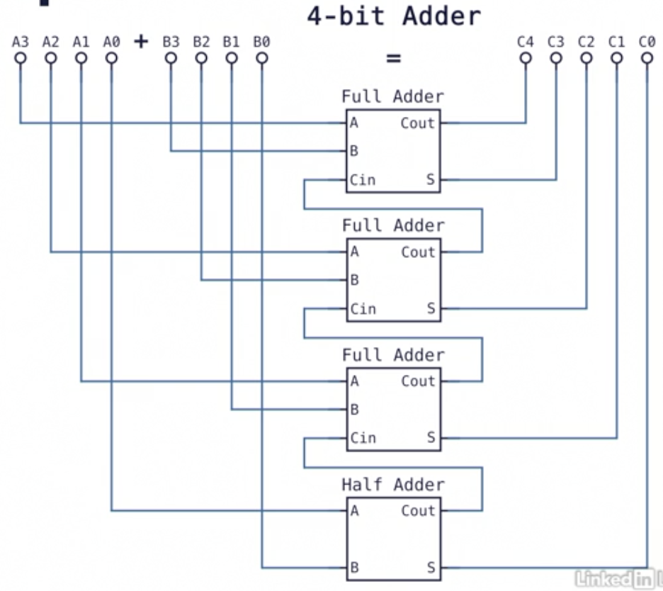

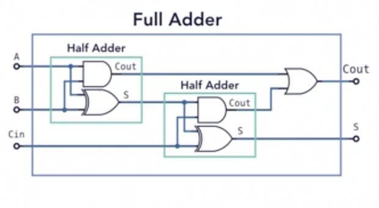

## RTL (Register-transfer level)

* higher-level semantics than gates
* Most widely used level of abstractions

## Behavior level

* useful for simulation
* not always synthesizeable

## ModelSim

* Change Radix

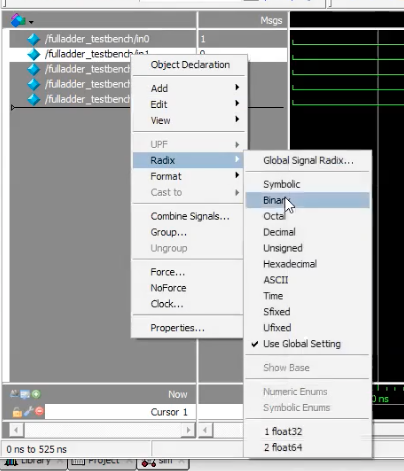

> Run

1. RTL Simulation
  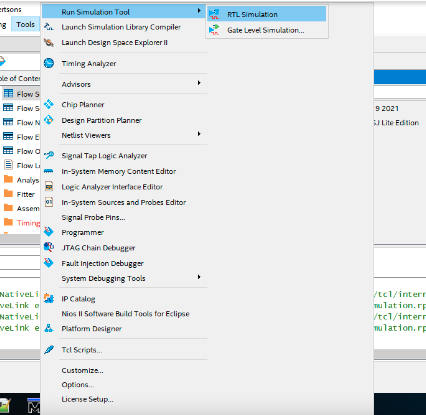
1. Compile
  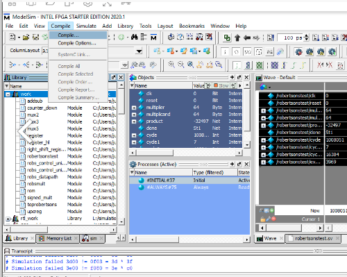
1. Select files
  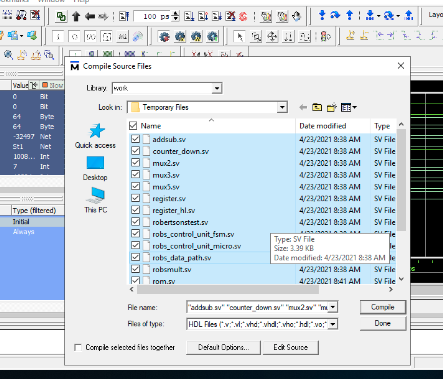
1. Click main test file
  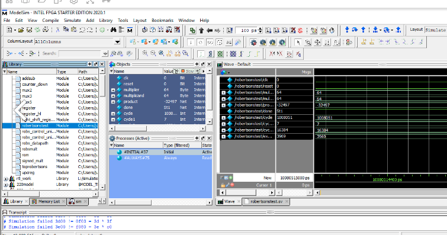
1. Add Wave
  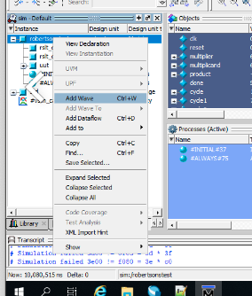
1. Run all
  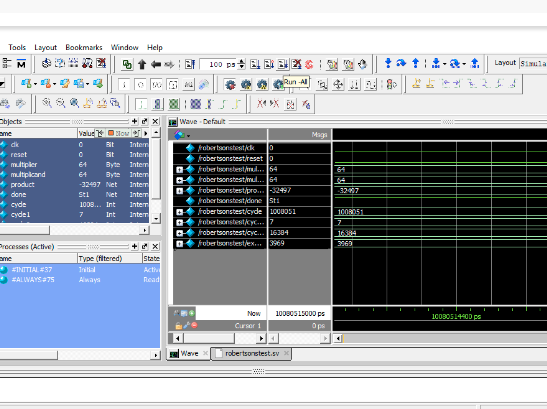

### Project

* mpf file

> Error

* unable to compile. ... file not found
  * project -> remove from project

> Create project

1. Select file
  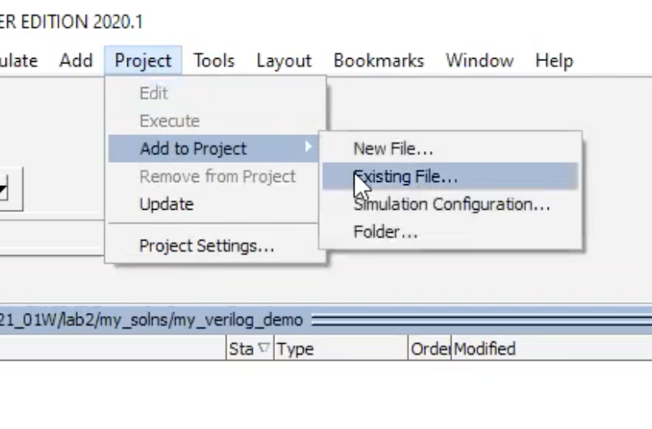
1. Compile
1. Simulate Start Sim
  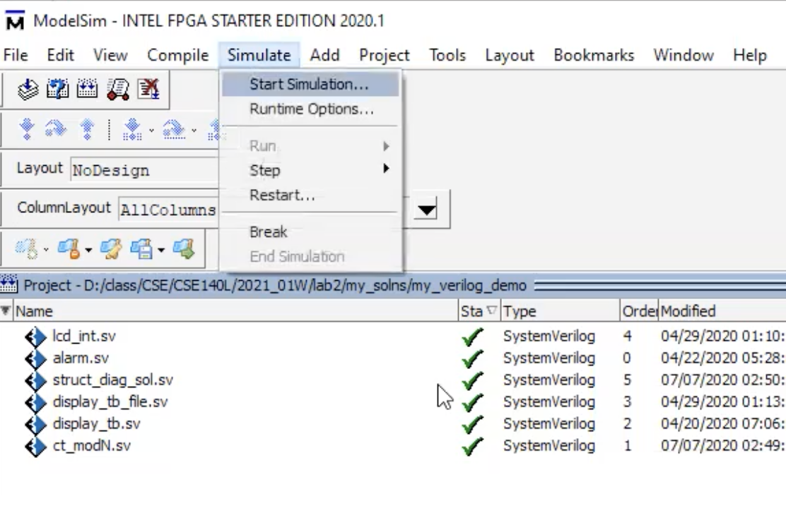

## Quartus

> Howto : Create Project

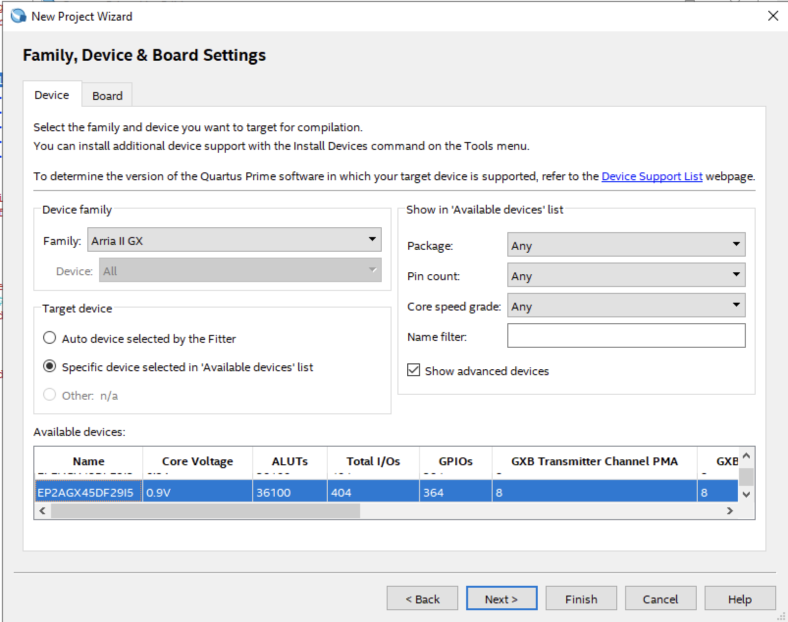

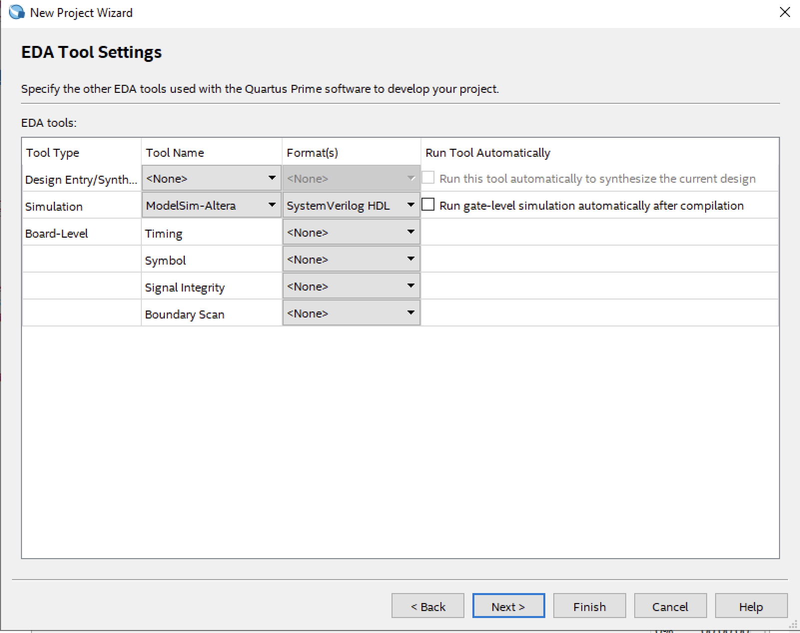

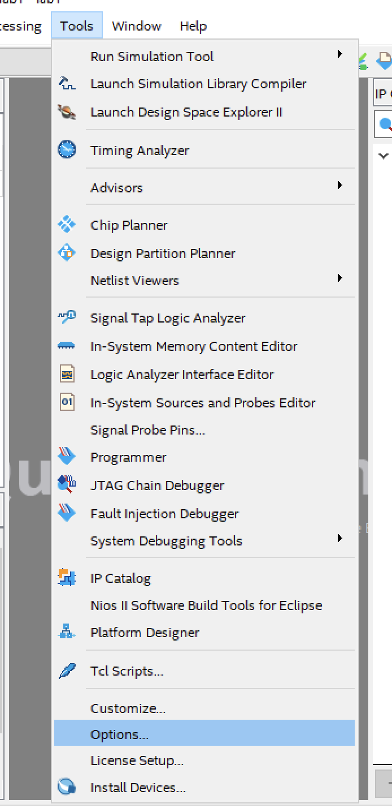

> Error

* Error (12007): Top-level design entity "lab1" is undefined
  * project name must be same as `module_name` in .v file
