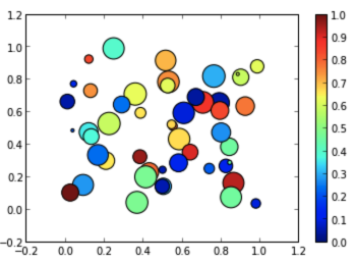
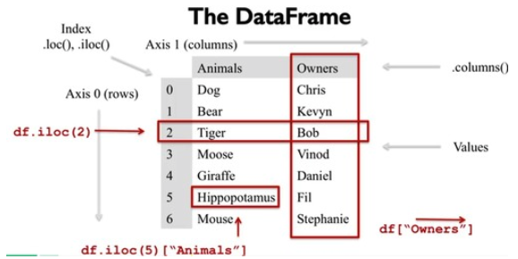

# Python

* Created by Guido van Rossum
* object-oriented language (represented by objects or relations between objects), dynamic typing
* [+] Community. (Don’t reinvent the wheel: github.com/nuno-faria/tetris-ai)
* [+] Resource (Machine learning, Web scraping)
* [+] Easy (shorter code)
* [-] Scope confusion → inner scope can see not modify the outer scope
* [-] untyped → slow
* [-] Python wasn’t made with mobile in mind → javascript, android studio, Swift C
* [Reference 1](https://wikidocs.net/book/536)
* [Reference 2](https://docs.python.org/3/)

> Terms

* Expression: If you can print it, or assign it to a variable, it’s an expression
  * Atoms is the most basic element of expressions → identifiers, literals, forms enclosed in parentheses

* Module: a file containing Python definitions and statements
  * file name is the module name with the suffix .py
  * each module is only imported once per interpreter session
  * when module changes, restart interpreter – or use importlib.reload(),
  * multifile module
    * module to reference each other using \_\_init__.py

* Package: structuring Python’s module namespace by using “dotted module names”
  * special module that helps organize modules, provide naming hierarchy (directories on a file system)
  * All packages are modules
  * Create isolated Python environments

* Statement: If you can’t print it, or assign it to a variable, it’s a statement

* Identifier: unlimited in length. Case is significant

* GIL: None python created thread doesn’t have thread state structure
  * PyGILState_Ensure() / PyGILState_Release()  # create thread data structure and free
* Wheels: the new standard of Python distribution and are intended to replace eggs
  * [+] Faster installation for pure Python and native C extension packages
  * [+] Avoids arbitrary code execution for installation. (Avoids setup.py)
  * [+] Installation of a C extension does not require a compiler on Linux, Windows or macOS
  * [+] Allows better caching for testing and continuous integration
  * [+] Creates .pyc files as part of installation to ensure they match the Python interpreter used
  * [+] More consistent installs across platforms and machines

## Interpreters

* Cpython: Default and most widely used python interpreter written in C and Python
  * uses GIL for thread-safe operation
  * each thread owns PyThreadState  and only thread created it can acquire GIL

* Jython: as a scripting language for Java applications
  * tests for Java libraries | create applications using the Java class libraries

* Pypy: faster than CPython because PyPy is a just-in-time compiler while CPython is an interpreter
  * easier to modify the interpreter

* \_\_pycache\_\_: caches the compiled version of each module in the \_\_pycache__
  * directory to put  bytecode which interpreter compiled
  * PYTHONDONTWRITEBYTECODE to any non blank string to disable bytecode
  * .pyc files is the speed with which they are loaded

* \_\_init\_\_.py: \_\_init__.py code defines a list named \_\_all__ (default None)
  * taken to be list of module names that should be imported when from package import *

### Packaging

* PYTHONPATH: env variable which to add additional directories where python will look for modules and packages
* Namespace: mapping from names to objects → most are currently implemented as Python dictionaries

```sh
parent/
  __init__.py
  one/
    __init__.py
  two/
    __init__.py
```

* importing parent.one will implicitly execute parent/\_\_init__.py and parent/one/\_\_init__.py
* subsequent imports of parent.two will execute parent/\_\_init__.py and parent/two/\_\_init__.py
* composite of various portions, where each portion contributes a subpackage to the parent package
* \_\_path\_\_ attribute: custom iterable type which automatically perform a new search for portions
* Potions: set of files in a single directory (possibly stored in a zip file) that contribute to a namespace package

* from `module` import *
  * imports all names except those beginning with an underscore
  * bad since it introduces an unknown set of names into interpreter, hiding some important things

* import foo.bar.baz
  * first tries to import foo, then foo.bar, and finally foo.bar.baz

* python3 -m reader: run package / library module (__main__)

* if \_\_name\_\_ == "\_\_main\_\_":
  * module’s name (as a string) is available as the value of the global variable \_\_name\_\_
  * convenient UI to module, or for testing purposes

* simple configuration file (ex: a list of directories to search for C header files or libraries)
* installers can override some of what you put in setup.py by editing setup.cfg

```py
# 1. Basic module
""" a.py """
print(1)
if __name__ == "__main__":
  print(2)

""" b.py """
import a
python b.py             # prints 1
```

> contextlib

```py
import contextlib

with contextlib.suppress(Exception):
  raise RuntimeError('Bad stuff happened.')
```

```sh
# pyproject.toml
[build-system]
requires = [
  "setuptools>=42",
  "wheel"
]
build-backend = "setuptools.build_meta"
```

## Builtins

* getattr()
* dir(): returns list of the attributes and methods of any object
* help()
* all(it): True if all elements of the iterable are true
* any(it): True if any element of the iterable is true
* eval(): parses expression passed in and runs python expression within
* id(obj): print address of object
* import(name, globals, locals, fromlist=(), level=0): invoked by the import statement
* type(obj): isinstance() checks if given object is an instance of the subclass
* vars(obj): returns the \_\_dict__ attribute of the given object
* locals(): a in locals() to check if variable exists
* globals()
* compile(source, fn, mod)
* enumerate(it, start=0): for i, (k, v) in enumerate({1:'a', 2:'b'}.items())
* isinstance(obj, class): if object is instance | subclass of classinfo class

* iter(object, sentinel)
  * iterator object for the given object
  * iteritems are deprecated
* filter(func, iterable)
* type(int): print type

* reduce(func, iterable, start=1)
  * (from functools lib)
* setattr(object, name, value)
* sum(`iterable`): sum of all `iterable`

* `iterable`.sort(): Sorts iterable in place
* zip(*it): aggregates multiple it in a tuple




> zsh: command not found: pipreqs

* When running a module as cli
* export `PATH="/Users/<my-username>/Library/Python/<python-edition>/bin:$PATH"`

> python command not found

* `/usr/local/opt/python@3.8/bin:$PATH`

> copy




```py
a = [1,2]
b = copy.copy(a) # equivalent to [e for e in a], a[:]

# deepcopy()     preserve the graphical structure of the original compound data
a = [1,2]
b = [a,a]        # there's only 1 object a
c = copy.deepcopy(b)

c[0] is a        # return False, a new object a' is created
c[0] is c[1]     # return True, c is [a',a'] not [a',a'module.md']
```




> platform

* processor(): (real) processor name, e.g. 'amdk6'
* python_implementation(): Get one of 'thon’, ‘Irothon’, ‘Jython’, Py’
* python_version(): python version as string 'major.minor.patchlevel
* system(): system/OS name, such as 'Linux', 'Darwin', 'Java', 'Windows'

> functool

* reduce(lambda a,b: a if a > b else b, [1,5,3]): get maximum
* lru_cache(maxsize=32): decorator
  * Cannot be used with generator
* cache_clear() / cache_info(): clear / print cache info for decorated function

> operator

* lt / le / eq / ne / ge / gt(a, b): comparators
* itemgetter

> textwrap

* dedent(multiline_string): start with correct indentation in the source

> typing

* Type[CustomClass]: class CustomClass itself (or a subtype)
* Dict[str, int]
* List
* Set

> contextlib




```py
import contextlib

with contextlib.suppress(Exception):
  raise RuntimeError('Bad stuff happened.')
```




### Path

> shutil

| Function    | Copies metadata | Copies permissions | Uses file object | Dest can be dir |
| ----------- | --------------- | ------------------ | ---------------- | --------------- |
| copy        | No              | Yes                | No               | Yes             |
| copyfile    | No              | No                 | No               | No              |
| copy2       | Yes             | Yes                | No               | Yes             |
| copyfileobj | No              | No                 | Yes              | No              |

* copyfile(src)
* copy2(src)
  * dst: can be a directory, then basename of src is used for creating new file
  * it preserves the mtime and atime in the file metadata

```py
import pathlib
import shutil

# 1. Copy file
my_file = pathlib.Path('/etc/hosts')
to_file = pathlib.Path('/tmp/foo')

shutil.copy(str(my_file), str(to_file))  # For older Python.
shutil.copy(my_file, to_file)  # For newer Python.

# 2. subtract in glob
files = glob.glob('files_path/[!_]*')
set(glob("*")) - set(glob("eph*"))
```

> sysconfig

* get_paths(): dictionary of key-paths
* get_config_var()

### Package

> pkg_resources

```py
import pkg_resources
from subprocess import call
packages = [dist.project_name for dist in pkg_resources.working_set]
call("pip3 install --upgrade " + ' '.join(packages), shell=True)
```

> disutil

* MANIFEST.in
  * text files that contain a series of “commands” in a Distutils-defined format

* setup()
  * **url**: the home page of your project. (can be PyPI package page)
  * **name**: the name of the package
  * **author**: your full name
  * **version**: the version number of the package
  * **author_email**: your email address
  * description:  one-line summary of the project
  * long_description: multi-line string in reStructuredText format. (PyPI converts to html and displays in package page)
  * classifiers: a list of specially-formatted strings
  [ex]
    Programming Language :: Python
    License :: OSI Approved :: BSD License
    Operating System :: OS Independent
    Development Status :: 5 - Production/Stable
    Environment :: Web Environment
    Framework :: Django
    Intended Audience :: Developers
    Topic :: Internet :: WWW/HTTP
    Topic :: Internet :: WWW/HTTP :: Dynamic Content
    Topic :: Internet :: WWW/HTTP :: WSGI
    Topic :: Software Development :: Libraries :: Python Modules




> importlib

* reload(module): previously imported module
* find_loader(name, path=None): sys.modules[name].__loader__ is returned
* import_module(name, package=None)

> io

* StringIO()

> math

* ceil(x): smallest integer greater than or equal to x, If x is not float, use x.__ceil__(), which should return int
* comb(n, k): number of ways to choose k items from n items without repetition and without order
* radians(`degree`): convert degree to radian

### Collections

* Search and insert
  * O(N) due to insert
  * bisect.insort(a, x, lo=0, hi=len(a))

> defaultdict

* subclass of dict
* vs setdefault: When look up a missing key, do you want an empty list, or a KeyError

> namedtuple




```py
NamedTupleCard = namedtuple('NamedTupleCard', ['rank', 'suit'])
Person = namedtuple('Person', ['first_initial', 'last_name']
ace_of_spades = NamedTupleCard('A', 'Spades')
ace_of_spades == Person('A', 'Spades')    # True
```




> pickle

* dump(obj, file)
* load(file)

## OS




> os

* python3 -c 'import sys; print(64 if sys.maxsize > 2 ** 32 else 32)')

* close(fd): Close file descriptor fd
* ctermid(): filename corresponding to the controlling terminal of the process
* chdir(path): change directory
* execv(`path`, `argv`): execute an executable path with arguments, replacing current process
* execl(`file`, `*args`): execute the executable file with argument list args, replacing the current process
* fork(): an operation whereby a process creates a copy of itself. usually a system call, implemented in the kernel
* getcwd(): current working directory
* getuid(): current process’s real user id
* getpid(): current process id
* getlogin(): name of the user logged in on the controlling terminal of the process
* listdir(path='.'): List containing the names of the entries in the directory given by path
* rename('old,'new): rename
* system(command): Execute the command (a string) in a subshell
* times(): current global process times
* rmdir(path, *, dir_fd=None): Remove directory path
* mkdir(path, mode=0o777, exists_ok=True): Create a directory named path
* os.path.exists('/usr/local/bin/'): check if path exists

* os.path
  * basename: data/item.csv → item.csv
  * isabs(): check if absolute path
  * abspath(path): Get absolute path
  * isfile(fn) / isdir(dn): Check file / directory exists

* os.sys
  * argv: List of command line arguments passed to a Python script
  * builtin_module_names: names of all modules that are compiled into this Python interpreter
  * byteorder: big vs little endian
  * executable: absolute path of the executable binary for the Python interpreter
  * flags
  * path: All path that is being search by python
  * version_info: assert sys.version_info[0]==3 and assert sys.version_info[1] >= 5
  * exit([arg])
  * cd()

```py
# 1. recursively calculate size
import os

def get_recur_size(path='.'):
  total = 0
  if os.path.isfile(path):
    return os.path.getsize(path)
  else:
    return sum(get_recur_size(fn) for fn in os.scandir(path))
  return total

def human(size):
  for u in ['B', 'KB', 'MB', 'GB']:
    if size < 1024 :
      return f"{size:.1f} {u}"
    size /= 1024
  return f"{size:.1f} {'TB'}"

print(f"In {os.path.abspath('.')} \t {human(get_recur_size())}")
for fn in sorted(os.listdir('.'), key = get_recur_size, reverse=True):
  print(f"{fn} \t {human(get_recur_size('./' + fn))}")
```




> sys

* provides access to some variables used or maintained by interpreter and to functions that interact strongly with interpreter

* platform: show platform information
* setswitchinterval(): set time slice
* read(): sys.stdin Read all input at once
* write(): sys.stderr
* getsitepackages(): see sitepackages
* ps1 / ps2: used for interactive mode string




### Process

> concurrent.futures

* as_completed(fs, timeout=None): returns an iterator over the Future instances
* ProcessPoolExecutor(initializer=init_globals, initargs=(counter,))
* submit(fn): returns Future object
* shutdown(wait=True): free using resources when currently pending futures are done executing
* cancel()
* cancelled()
* running()
* done()
* result(): returns the value returned by the call

> shlex

* split(command_line): split command line into list

> Multiprocessing

* new process has \_\_mp_main\_\_
* used for CPU intensive tasks

* cpu_count(): total number of cpu
* join(): Wait worker processes to exit, must call close|terminate()
* imap / map(func, iterable[, chunksize]): use imap to lower memory usage for long iterables
* starmap(func, iterable[, chunksize]): [(1,2), (3, 4)] ⇒ [func(1,2), func(3,4)]

* RawArray
  * Raw cannot be synchronized
  * from multiprocessing.sharedctypes import Value, Array

> subprocess

* run(["ls", "-l"]): simplified Popen, execute and wait
  * capture_output=True
  * text=True

* Popen(args): Execute a child program in a new process
  * stdout=subprocess.PIPE
  * stderr=subprocess.PIPE
  * universal_newlines=False: input/output is accepted as bytes, not Unicode
  * attributes
    * returncode
  * methods
    * communicate() -> Tuple(byte, byte): returns stdout and sterr of output
    * poll(): update return code
    * wait(): Wait for child process to terminate

```py
import os
import subprocess
import time
from collections import deque

def ls():
  commands = "ls -a"

  process = subprocess.Popen(commands.split(), stdout=subprocess.PIPE)
  out, err = process.communicate()

  print(out)
  print(err)

def top():
  cpu_usages = [1]
  while True:
    process = subprocess.Popen("ps -a -o %cpu,%mem,cmd".split(), stdout=subprocess.PIPE)
    out, _ = process.communicate()
    try:
      cpu_usages.append(int([line.split()[0] for line in out.decode('utf-8').split('\n') if "_type_" in line][0]))
      print(cpu_usages)
      time.sleep(0.1)
    except Exception as e:
      return sum(cpu_usages) / len(cpu_usages)

def cpu_usage():
  p = subprocess.Popen(['/usr/bin/time'] + ["ls"], stdout=open(os.devnull, 'wb', 0), stderr=subprocess.PIPE)
  with p.stderr:
    q = deque(iter(p.stderr.readline, b''), maxlen=2)
    rc = p.wait()
  return b''.join(q).decode().strip()
```

> urllib

* Request
  * urllib2.Request("www.example.com")
  * add_header('Referer', 'http://www.python.org/')
  * urlopen(url): string / Request object.  For HTTP, returns http.client.HTTPResponse object

* parse
  * unquote(str): decode urlencoded bytes

* HTTPResponse
  * content = resp.read()




```py
# 1. Download Coco dataset
import sys, getopt
import fire
import json
import requests

def download_factory(all = False, *, coco2014 = None, coco2017 = None):
  if all or coco2014:
    url = "http://images.cocodataset.org/annotations/annotations_trainval2014.zip"
    download(url)

  if all or coco2017:
    url = "http://images.cocodataset.org/annotations/annotations_trainval2017.zip"
    download(url)

def download(url):
  response = requests.get(url, stream=True)
  total_bytes = int(response.headers.get('content-length', 0))
  with open('test.dat', 'wb') as file:
    with tqdm(total=total_bytes / (32*1024.0), unit='B', unit_scale=True, unit_divisor=1024) as pbar:
      for data in response.iter_content(1024):
        pbar.update(len(data))
        file.write(data)
```




> requests

* json(): convert back to

> eb

* pip install awsebcli
* eb cli
  * creat `https://github.com/SeanHwangG/note`
  * init: Create new application

> cgi

* dynamically generating web pages that respond to user input

> algolia

* full-text search

* client
  * SearchClient.create('key', 'cred'): create client

* index
  * client.init_index('page'): create index
  * clear_objects(): remove all objects
  * save_objects()

### jinja

* string
  * capfirst
  * \{\{ var | default(5) }}: 5 if not set
  * \{\{ var | isnan }}
  * \{\{ var | log }}
  * \{\{ var | pow(2) }}
  * \{\{ var | root }}
  * \{\{ var | ipaddr }}: check if var is ipaddr
  * \{\{ var | ipv6 }}: check if
  * \: reverse string
  * \{\{ "C style" | comment('c') }}

* load
  * \{\% load A %}
  * \{\% A 'images/logo.png' %}
  * \{\% extends "base.html" %}: substitute A block in base.html

* list
  * {{ value|last }}: last element

* set
  * \{\{ list1 | unique }}: To get a unique set from a list:
  * \{\{ list1 | union(list2) }}: To get a union of two lists
  * \{\{ list1 | intersect(list2) }}: unique list of all items in both
  * \{\{ list1 | difference(list2) }}: items in 1 that don’t exist in 2
  * \{\{ list1 | symmetric_difference(list2) }}: list1 - list2

* : in django

### Crawling

> bs4

* from bs4 import BeautifulSoup

* name: tagname
* text, attrs: inside text, attribute object
* next / previous_elements: next / previous tags generator
* next / previous_siblings: next sibling tags generator
* original_encoding

* bs4.element.Tag
  * string
  * text
  * clear(): removes the contents of a tag:
  * decompose(): remove tag
  * extract(): hide element
  * find_all(tag, href=None, limit=None) → [Tags]: find all matching tags
  * find("span"): find tags inside
  * get_text():
  * insert(pos, tag): insert tag to position
  * insert_before() / after(): immediately before
  * prettify()
  * wrap(soup.new_tag("b")): wrap around new tags
  * new_button = soup.new_tag('a')
  * new_button.attrs["onclick"] = "toggle()"
  * new_button.append('This is a new button!')

> selenium

* WebElement
  * tag_name
  * text
  * parent
  * find_element_by_css_selector()
    * .id,.name: get multiple selctor
  * get_property(`property`): get property of tag (ex: href)

> Error DevToolsActivePort file doesn't exist

* chrome_options.add_argument("--single-process")

[bayes_recsys.ipynb](https://gist.github.com/SeanHwangG/b91b282540c3eec4b3cfd91c0a8d2d68)
[Iris_decision_tree.ipynb](https://gist.github.com/SeanHwangG/aa0514cab9d7c383d9e92fb5e673034d)
[boost_titanic.ipynb](https://gist.github.com/SeanHwangG/f940014736119f5859109de0f16695bd)

## opencv

* sudo apt-get install python3-opencv
* pip install opencv-python
* height, width, channel, BGR color
* OpenCV time: frame decoding + time to render the bounding boxes, labels, and to display the results

> Version

* 2009 Opencv 2.0: convert to c++, mat class
* 2011 Opencv 2.3: import cv2
* 2015 Opencv 3.0: GPU(T-API)
* 2017 Opencv 3.3: DNN

* opencv: core, widely used (highgui, imgproc ...)
* opencv_contirb: brand new, non-free, HW dependency (datasets, cnn_3dobj …)

> GUI

* moveWindow(wn, x, y): only works if WINDOW_NORMAL, ignore header
* imshow(filename, img) → None: if int32 // 255, if float * 255, create namedWindow()
* setWindowProperty("slides")
* namedWindow(wn, WINDOW_AUTOSIZE): WINDOW_NORMAL (video → window)
* destroyWindow(wn) / destroyAllWindows(): Destroy window
* waitKey(delay=None) → -1 | ord(key'): 27 (ESC), 13(ENTER), 9(TAB), ← (123), delay=-1 ∞
* WND_PROP_FULLSCREEN, WINDOW_FULLSCREEN: Full size




> OpenCV

* compile command: g++ 00_video.cpp `pkg-config --cflags --libs opencv4`

* Mat
  * CV_64FC1 is simple grayscale image
  * C: number of channels in the matrix

|        | C1  | C2  | C3  | C4  | C(5) | C(6) | C(7) | C(8) |
| ------ | --- | --- | --- | --- | ---- | ---- | ---- | ---- |
| CV_8U  | 0   | 8   | 16  | 24  | 32   | 40   | 48   | 56   |
| CV_8S  | 1   | 9   | 17  | 25  | 33   | 41   | 49   | 57   |
| CV_16U | 2   | 10  | 18  | 26  | 34   | 42   | 50   | 58   |
| CV_16S | 3   | 11  | 19  | 27  | 35   | 43   | 51   | 59   |
| CV_32S | 4   | 12  | 20  | 28  | 36   | 44   | 52   | 60   |
| CV_32F | 5   | 13  | 21  | 29  | 37   | 45   | 53   | 61   |
| CV_64F | 6   | 14  | 22  | 30  | 38   | 46   | 54   | 62   |

* Mat(Size size, int type): Size can be int rows, int cols
* Mat(Size size, int type, const Scalar& s): initialize each matrix element with
* Mat::eye(4, 4, CV_64F);
* Mat::ones(2, 2, CV_32F);
* Mat::zeros(3,3, CV_8UC1);
* format(R, Formatter::FMT): print in format in cout << (FMT_PYTHON / FMT_CSV)
* rows: cols               // show n rows, cols
* type(): show type

```cpp
#include <iostream>
#include <map>

#include "opencv2/highgui/highgui.hpp"
#include "opencv2/imgproc/imgproc.hpp"

using namespace std;
using namespace cv;

int main() {
  Mat img(Size(2, 3), CV_64FC1);  // Greyscale image
  img.setTo(cv::Scalar(100.0));   // fill all with 255
  img.at<double>(1, 1) = 255.5;
  Mat row = img.row(1);  // [100, 255]

  double min, max;
  Point min_loc, max_loc;
  minMaxLoc(img, &min, &max, &min_loc, &max_loc);
  cout << max_loc;  // [1, 1]

  cout << img.reshape(img.rows * img.cols, 1);  // [6, 1]

  struct ComparePoints {
      bool operator () (const cv::Point& a, const cv::Point& b) const {
          return (a.x < b.x) || (a.x == b.x && a.y < b.y);
      }
  };
  map<cv::Point, int, ComparePoints> point2count;
  point2count[min_loc]++;
}
```




* isOpened() → bool
* open()
* get()
* CAP_FRAME_WIDTH  / HEIGHT
* CAP_PROP_FPS / FRAME_COUNT: Frame per count
* CAP_PROP_POS_MSEC / EXPOSURE: current milisecond
* set() / read()
* grab() / retrieve()/ release()
* VideoCapture(fname, apiPreference) → retval




> dnn

* size: output image size (default 0, 0)
* mean: subtract from input image (default 0, 0, 0)
* retval): numpy.ndarray. shape=(N,C,H,W). dtype=numpy.float32
* readNet(model, config, framework: trained weight, network, cv2.dnn_Net
* blobFromImage(image, scalefactor=1.0: multiply to image (default 1)
* NMSBoxes(boxes, confidences, confThreshold, nmsThreshold)

## Plot






```py
import matplotlib.pyplot as plt
import numpy as np
import pandas as pd

fig, axs = plt.subplots(2, 3)
axs[0, 0].set_title('1 : scatter')
axs[0, 0].plot([1, 2, 3, 4], [1, 4, 9, 16], 'ro')

axs[0, 1].set_title('2 : line')
axs[0, 1].plot([1, 2, 3, 4], [1, 4, 9, 16])

axs[0, 2].set_title('3 : heatmap')
axs[0, 2].imshow(np.random.random((16, 16)), cmap='hot', interpolation='nearest')

axs[1, 0].set_title('4 : bar')
axs[1, 0].bar(['A', 'B', 'C'], [1, 5, 3])

axs[1, 1].set_title('5 : curve')
axs[1, 1].plot(np.linspace(0, 2 * np.pi, 400), np.sin(np.linspace(0, 2 * np.pi, 400) ** 2))

X, Y = np.meshgrid(np.arange(-5,6,1), np.arange(-5,6,1))
u, v = X|5, -Y|5
axs[1, 2].quiver(X,Y,u,v)

plt.show()

for ax in axs.flat:
  ax.set(xlabel='x-label', ylabel='y-label')

# Hide x labels and tick labels for top plots and y ticks for right plots.
for ax in axs.flat:
  ax.label_outer()
```


```py
# Color types
from cv2 import cv2
import matplotlib.pyplot as plt

fig, axs = plt.subplots(1, 5)

dog_np = cv2.cvtColor(cv2.imread('data/dog.jpg'), cv2.COLOR_BGR2RGB)
axs[0].imshow(dog_np)
axs[0].axis('off')

axs[1].imshow(cv2.imread('data/dog.jpg', cv2.IMREAD_GRAYSCALE))
axs[1].axis('off')

axs[2].imshow(cv2.resize(dog_np,(300, 600)))
axs[2].axis('off')

axs[3].imshow(cv2.resize(dog_np, (0,0), dog_np, 1, 0.5))
axs[3].axis('off')

axs[4].imshow(cv2.flip(dog_np, -1))
axs[4].axis('off')

cv2.imwrite("data/dog_np.jpg", dog_np)
```




### Pandas

* Panel Data library

* concat(axis=0): if contains at least one DataFrame, return df
* read_json(typ=’frame’)
* unique(values): Uniques are returned in order of appearance
* display.max_rows | columns
* display.max_colwidth

> DataFrame

* Dataframe is multiple series that share the same index
* DataFrame(data=None)
* axes: list representing the axes of the DataFrame
* columns, index: column|row labels of the DataFrame
* dtypes: types of columns in the DataFrame
* shape: tuple representing dimensionality of DataFrame
* values: Numpy representation of the DataFrame

> access

* [colname]: return Series corresponding to colname
* describe(): quick statistic
* duplicated([col], keep=First): Mark duplicates as True except for first
* head(n): first n rows
* iloc(r_index): select a single row or list of row (starting from 0)
* isin(values): True at a location if all the labels match
* isna(df1): boolean mask where values are nan
* iterrows(): iter(idx, row_sr), ignore dtypes across rows
* itertuples(): iter(row_df)
* iloc(row): return Series
* isin(lists): filter only in lists
* loc(r_name): select a single row or list of rows
* tail(n): last n rows
* value_counts()



> Modify

* append(other): Append column and return new dataframe
* apply(axis=0}: Apply function to each columnl or row(axis=1)
* drop('row', axis=0, inplace=True): Remove row (axis=0), col (axis=1)
* dropna(how='any'): Drop any rows that have missing data
* drop_duplicates(subsets):
* fillna(value=None): Fill missing data with value
* insert(loc, column, value): Insert column in DataFrame at specified location
* reset_index(drop=False): Convert index to column
* sort_values(by='col'): Sort dataframe by 'col' column
* to_numpy(): Axes labels will be removed
* rename(index=None, columns=None, inplace=F): Alter axes labels
* set_axis(labels, axis=0, inplace=False): Assign desired index to given axis
* to_csv(index=True) / to_sql(name, conn): Save as csv / sql file




```py
options.display.float_format = '{:,100f}'.format
read_csv()

# Example
dp.loc[‘tom’] == dp.iloc[0]
dp.loc[[‘tom’, ‘nick’], [‘score’]]
df[(df['score'] > 70) & (df['age'] < 20)] # multiple condition
df.rename(index={0: "x", 1: "y", 2: "z"}) # rename index
df.rename(columns={"A": "a", "B": "c"})   # rename columns
df.groupby('age').max()

# preprocess
data['clean'] = data['text'].apply(lambda x: "".join([ch for ch in x if ch not in string.punctuation]))
data['tokens'] = data['clean'].apply(lambda x: re.split('\W+', x))
data['stops'] = data['tokens'].apply(lambda x: [w for w in x if w not in stopwords])
ps = nltk.PorterStemmer()
data['stem'] = data['stops'].apply(lambda x: [ps.stem(w) for w in x])

# display side
import pandas as pd

def display_side(*args):
  from IPython.display import display_html
  html_str = ''
  for df in args:
    if isinstance(df, pd.Series):
      df = pd.DataFrame(df)
    if not isinstance(df, pd.DataFrame):
      html_str += df.render(index= False)
    else:
      html_str += df.to_html(index= False)
  display_html(html_str.replace('table', 'table style="display:inline"'), raw=True)

display_side(pd.DataFrame([1,2,3]), pd.DataFrame([2,3,4]))
```




> Series

* built on top of a numpy array and have a named index
* arithmetic converts to float

* Acesss
  * head(n): first n rows
  * to_list(): return list ignoring all index
  * tail(n): last n rows

* Function
  * T: Return the transpose, which is by definition self
  * array: The ExtensionArray of the data backing this Series or Index
  * at: Access a single value for a row/column label pair
  * attrs: Dictionary of global attributes on this object
  * axes: Return a list of the row axis labels
  * dtype: Return the dtype object of the underlying data
  * hasnans: Return if I have any nans; enables various perf speedups
  * iat: Access a single value for a row/column pair by integer position
  * iloc: Purely integer-location based indexing for selection by position
  * index: The index (axis labels) of the Series
  * is_monotonic_decreasing(): Return boolean if values in the object are monotonic_decreasing
  * is_monotonic_increasing(): Return boolean if values in the object are monotonic_increasing
  * isna(self): Detect missing values
  * is_unique: Return boolean if values in the object are unique
  * loc: Access a group of rows and columns by label(s) or a boolean array
  * nbytes: Return the number of bytes in the underlying data
  * ndim: Number of dimensions of the underlying data, by definition 1
  * shape: Return a tuple of the shape of the underlying data
  * size: Return the number of elements in the underlying data
  * values: Return Series as ndarray of ndarray-like depending on the dtype

* Modify
  * apply(func): apply function in every element
  * get(key, default=N)
  * mean(axis=N, skipna=N, level=N, numeric_only=N)

## Flask

* [Flask](https://www.youtube.com/watch?v=Z1RJmh_OqeA)
* [Flask + https](https://blog.miguelgrinberg.com/post/running-your-flask-application-over-https)
* [Flask + Firebase](https://medium.com/firebase-developers/hosting-flask-servers-on-firebase-from-scratch-c97cfb204579)
* [Flask + Google login](https://realpython.com/flask-google-login/)
* [Flask + Firestore](https://medium.com/google-cloud/building-a-flask-python-crud-api-with-cloud-firestore-firebase-and-deploying-on-cloud-run-29a10c502877)

* application context
  * keeps track of the application-level data during a request, CLI command

```sh
# 1. Dockerfile
# Structure
# flask-fire (root dir)
# ├── server
# | ├── src
# |    └── app.py
# |    └── templates
# |       └── index.html
# | ├── Dockerfile
# ├── static
# |  └── style.css
# ├── firebase.json
# ├── .firebaserc
FROM python
COPY . /app
WORKDIR /app
RUN pip install flask
EXPOSE 5000
CMD ["python", "app.py"]

# docker build -t flask-test .
# docker run -d -p 5000:5000 flask-test
```

```py
# 1. app.py
from flask import Flask
app = Flask(__name__)

@app.route("/")
def hello():
  return "Hello Docker!"

if __name__ == '__main__':
  app.run(debug=True, host='0.0.0.0')

# 2. Global jinja
global jinja accessible by {{ stage }}
@app.context_processor
def inject_stage_and_region():
  return dict(stage="alpha", region="NA")
```




* CLI
  * flask run --cert adhoc: run in https
  * FLASK_APP: app.py
  * FLASK_ENV: development

## Modules

> flask_login




```py
from flask_login import UserMixin
from selenium.webdriver.support.ui import WebDriverWait
from selenium.webdriver.support import expected_conditions as EC
from selenium.webdriver.common.by import By
from selenium import webdriver
from collections import defaultdict
from concurrent.futures import ThreadPoolExecutor, as_completed
from itertools import islice
from ..common import get_chrome_driver, PATH, logger
import json
import re
import os
import time

class Member(UserMixin):
  def __init__(self, member_id, baekjoon_id, team_id, en_name, kr_name="", solved_problem_ids=None, is_admin=False, id=""):
    self.id = member_id  # for flask_login mixin
    self.member_id = member_id
    self.baekjoon_id = baekjoon_id
    self.team_id = team_id
    self.en_name = en_name
    self.kr_name = kr_name
    self.solved_problem_ids = set(solved_problem_ids) if solved_problem_ids else set()
    self.is_admin = is_admin

  def __repr__(self):
    return f"{self.id}"

  @staticmethod
  def update_baekjoon_solved(member):
    from ..database import remote_db
    driver = get_chrome_driver()
    try:
      driver.get(f"https://www.acmicpc.net/user/{member.baekjoon_id}")
      WebDriverWait(driver, 10).until(EC.presence_of_element_located((By.CLASS_NAME, 'panel-body')))
      member.solved_problem_ids = list(f'BJ_{prob_id}' for prob_id in driver.find_element_by_class_name('panel-body').text.split())
      remote_db.add("member", member)
      return True
    except Exception as e:
      logger.warning(f"{e}")
      logger.warning(f"{member}")
      return False
    finally:
      driver.quit()

  @staticmethod
  def update_all_baekjoon_solved(members, limit=10000):
    logger.debug(f"update_all_baekjoon_solved({members})")

    with ThreadPoolExecutor() as ex:
      futures = [ex.submit(Member.update_baekjoon_solved, member) for member in islice(members, limit)]
      return all(future.result() for future in as_completed(futures))
```




> flask_wtf

* LoginManager
* current_user
* login_required
* login_user
* logout_user
* flask_debugtoolbar

* app.config['SECRET_KEY'] = '\<replace with a secret key>'
* toolbar = DebugToolbarExtension(app)
