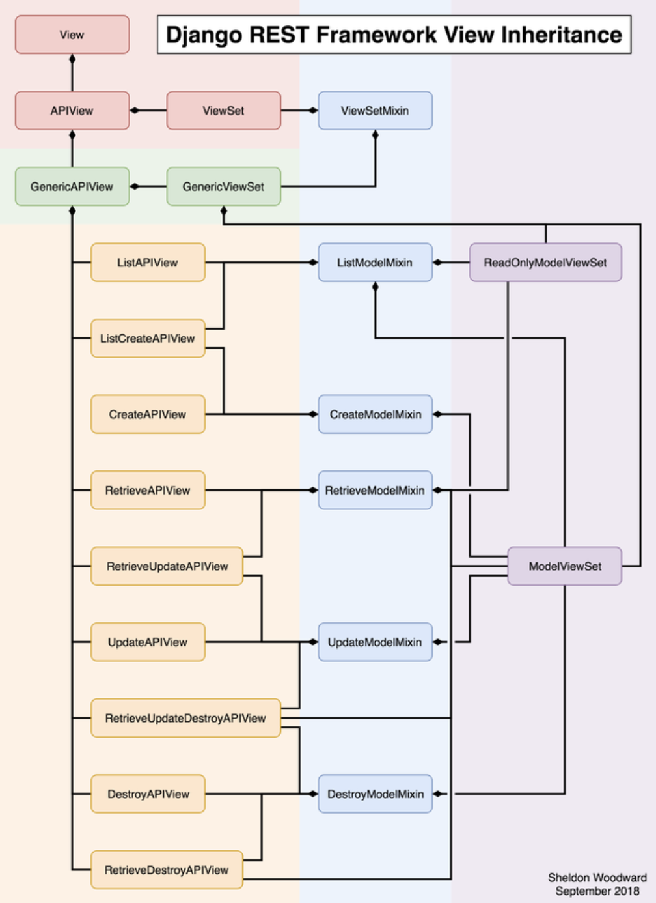

# Django


* Model-view-controller
* URL patterns to decide which view to pass the request to for handling
* project can contain multiple apps
* automatically reloads Python code for each request as needed

> Terms

* app
  * Web application that does something
  * a Weblog system, a database of public records or a small poll app

* project
  * a collection of configuration and apps for a particular website

> cookie-cutter

* [Deploy django on EC2 using docker](https://benjlindsay.com/posts/deploying-a-cookiecutter-django-site-on-aws)

* --replay: use information entered previously (~/.cookiecutter_replay/cookiecutter-django.json)

```sh
pip install cookiecutter
cookiecutter https://github.com/pydanny/cookiecutter-django
```

> Reference

* Two Scoops of Django

> AppRegistryNotReady: Apps aren't loaded yet

* adding an app in INSTALLED_APPS in the settings.py file but you do not have that app installed in your computer

> TypeError: can't compare offset-naive and offset-aware datetimes

* datetime.datetime.now() -> timezone.now() (from django.utils import timezone)

> django.template.exceptions.TemplateDoesNotExist: home.html

* Update INSTALLED_APPS from settings.py

> Unable to configure handler 'console'

* formatters -> formatter in LOGGING config

> Manager isn't available; User has been swapped for 'pet.Person'

* from django.contrib.auth.models import User -> from user.models import User

> makemigrations does nothing

* migrate each app at a time

> django.db.migrations.exceptions.InconsistentMigrationHistory: Migration hitcount.0001_initial is applied
before its dependency base.0001_initial on database 'default'.

* rm */migrations/* && rm db.sqlite3 and migrate again

> HINT: The 'USERNAME_FIELD' is currently set to 'email', you should remove 'email' from the 'REQUIRED_FIELDS

* REQUIRED_FIELDS cannot contain the USERNAME_FIELD

> django.core.exceptions.ImproperlyConfigured: Cannot import `app`. Check that `project.module.ModuleConfig.name` is correct

* name = `module` -> name = `project.module` (in apps.py)

## Docker

```yml
# local.yml
version: '3'

volumes:
  local_postgres_data: {}
  local_postgres_data_backups: {}

services:
  django:
    build:
      context: .
      dockerfile: ./compose/local/django/Dockerfile
    image: classroom_local_django
    container_name: django
    depends_on:
      - postgres
    volumes:
      - .:/app:z
    env_file:
      - ./.envs/.local/.django
      - ./.envs/.local/.postgres
    ports:
      - "8000:8000"
    command: /start

  postgres:
    build:
      context: .
      dockerfile: ./compose/production/postgres/Dockerfile
    image: classroom_production_postgres
    container_name: postgres
    volumes:
      - local_postgres_data:/var/lib/postgresql/data:Z
      - local_postgres_data_backups:/backups:z
    env_file:
      - ./.envs/.local/.postgres

  docs:
    image: classroom_local_docs
    container_name: docs
    build:
      context: .
      dockerfile: ./compose/local/docs/Dockerfile
    env_file:
      - ./.envs/.local/.django
    volumes:
      - ./docs:/docs:z
      - ./config:/app/config:z
      - ./classroom:/app/classroom:z
    ports:
      - "7000:7000"
    command: /start-docs

# deploy.yml
version: '3'

volumes:
  production_postgres_data: {}
  production_postgres_data_backups: {}
  production_traefik: {}

services:
  django:
    build:
      context: .
      dockerfile: ./compose/production/django/Dockerfile
    image: classroom_production_django
    depends_on:
      - postgres
      - redis
    env_file:
      - ./.envs/.production/.django
      - ./.envs/.production/.postgres
    command: /start

  postgres:
    build:
      context: .
      dockerfile: ./compose/production/postgres/Dockerfile
    image: classroom_production_postgres
    volumes:
      - production_postgres_data:/var/lib/postgresql/data:Z
      - production_postgres_data_backups:/backups:z
    env_file:
      - ./.envs/.production/.postgres

  traefik:
    build:
      context: .
      dockerfile: ./compose/production/traefik/Dockerfile
    image: classroom_production_traefik
    depends_on:
      - django
    volumes:
      - production_traefik:/etc/traefik/acme:z
    ports:
      - "0.0.0.0:80:80"
      - "0.0.0.0:443:443"

  redis:
    image: redis:5.0

  awscli:
    build:
      context: .
      dockerfile: ./compose/production/aws/Dockerfile
    env_file:
      - ./.envs/.production/.django
    volumes:
      - production_postgres_data_backups:/backups:z
```

## Setup

* admin.py: admin file defines admin interface see / edit

* app.py: controls settings specific to this app
* migration/
  * holds files to migrate DB when schema changes

* models.py: python objects, providing data layer to construct DB schema and queries

* Path converter
  * str: Matches any non-empty string, excluding the path separator, '/'
  * int: Matches zero or any positive integer
  * slug: Matches any slug string consisting of ASCII letters or numbers, plus the hyphen and underscore characters
  * uuid: Matches a formatted UUID
  * path: Matches any non-empty string, including '/', allows to match against a complete URL path, as with str

* tests.py
  * writing unit tests for the functionality of this app

* views.py
  * request handler, which handles HTTP requests and response defines logic, control flow

> urls.py

* url routing specific to this app
* path(path, view, template)            # first patching → no match 404

* include()
  * include other URL patterns
  * admin.site.urls is the only exception to this

* path()
  * route: string that contains a URL pattern
  * view, and two optional: kwargs, and name

### Templates

* Request context to pass variable in tempates

> Function

* | truncatewords:`num`: trunctate words

* \_\_count: get length of queryset
  * more efficient than |length

## import django

> django

* django.setup(): Setup django outside of django module
* get_version(): Show version

> forms

* disabled: disabled HTML attribute so that it won’t be editable by users

* has_changed(): determine if the field value has changed from the initial value

## apps

* Django contains a registry of installed applications that stores configuration and provides introspection
  * registry is called apps and it’s available in django.apps
* maintains a list of available models.

> apps

* get_app_config(`model`)
* get_model(`app_label`, `model_name`, `require_ready`=True): Returns Model with `app_label` and `model_name`
  * Raises LookupError if no such application or model exists

```py
from django.apps import apps

print(apps.get_app_config('admin').verbose_name)

# 1. Avoid circular import
model = apps.get_model('app_name', 'ModelName')
```

### auth

* admin
  * UserAdmin
* get_user_model(): attempt to retrieve the model class at the moment your app is imported the first time
* models
  * AbstractUser: Replace auth User with custom
    * USERNAME_FIELD: overwrite user (ex: email)
    * REQUIRED_FIELDS: required using createsuperuser (ex: ['date_of_birth'])
    * EMAIL_FIELD: A string describing the name of the email field on the User model
* User
  * check_password(raw_password): Returns True if the given raw string is the correct password for the user
  * set_password(raw_password): taking care of the password hashing
  * get_all_permissions(obj=None): Returns a set of permission strings that the user has, both through group and user permissions
* models.AnonymousUser: a class that implements django.contrib.auth.models.User interface, with these differences:
* mixins
  * LoginRequiredMixin

```py
# 1. Replace with custom User in settings.py
AUTH_USER_MODEL = 'YourAppName.YourClassName'

# 2. Remove default field in AbstractUser
first_name = None
last_name = None

# 3. Create Superuser
admin_emails = os.environ.get("DJANGO_ADMIN_EMAILS").split(",")
admin_pws = os.environ.get("DJANGO_ADMIN_PASSWORDS").split(",")

for admin_email, admin_pw in zip(admin_emails, admin_pws):
  if not User.objects.filter(email=admin_email).exists():
    user = User(email=admin_email, is_staff=True, is_superuser=True, is_active=True)
    user.set_password(admin_pw)
    user.save()
    logging.info("Created : %s", user)
  else:
    logging.info("User already Exists")
```

### fields

* GenericForeinKey

```py
from django.contrib.contenttypes.fields import GenericForeignKey
from django.contrib.contenttypes.models import ContentType

class FlexCategory(models.Model):
  name = models.SlugField()
  content_type = models.ForeignKey(ContentType, on_delete=models.CASCADE)
  object_id = models.PositiveIntegerField()
  content_object = GenericForeignKey('content_type', 'object_id')


class Hero(models.Model):
  name = models.CharField(max_length=100)
  flex_category = GenericRelation(FlexCategory, related_query_name='flex_category')

class Villain(models.Model):
  name = models.CharField(max_length=100)
  flex_category = GenericRelation(FlexCategory, related_query_name='flex_category')
```

### messages

* Display message on top of django websites

* success()

```html

  
    <div class="alert-{{message.tags}}">
      {{message}}
    </div>
  

```

## db

* reset_queries(): reset saved queries
* connection
  * queries: list of queries

> transaction

* non_atomic_requests(using=None)

```py
from pprint import pprint
from django.db import connections
from django.db import DatabaseError, transaction

# 1. Print previous query
pprint([e['sql'] for e in connections['default'].queries])
print(connection.settings_dict['NAME'])

# 2. Transaction
try:
  with transaction.atomic():
    parent = Parent(name = "my name")
    parent.save()

    child = Child(number=3, parent=parent)
    child.save()
except DatabaseError:
  # Handle the case where an error prevented the operation

@transaction.atomic
def viewfunc(request):
    # This code executes inside a transaction.
    do_stuff()
```

### db.field

> Common Field

* unique=True
* Null=False
* Blank=False
* Default=None
* help_text=None
* primary_key=False

> Field

* AutoField(): Autoincremented integer field
* BooleanField()
* CharField(max_length=255, choices): single line view
* DecimalField()
* DateTimeField()
* DurationField()
* EmailField()
* ForeignKey(`cls`): id of record in another table
  * `to`: can be a string to escape circular dependency
  * on_delete: specify action when key is deleted
    * CASCADE: object referenced by a ForeignKey is deleted, the object containing also deleted
    * PROTECT: throw error if ForeignKey is deleted
    * SET_DEFAULT: change to default only if default exists
* GenericIPAddressField()
* ImageField(): stores the path from `MEDIA_ROOT`
* IntegerField(): blank is equivalent to 0
* ManyToManyField(`Table`)
* NullBooleanField():
* SlugField(max_length=50): short label for something, containing only letters, numbers, underscores or hyphens
  * allow_unicode: default False
* SmallAutoField: an AutoField, but only allows values under a certain (database-dependent) limit. Values from 1 to 32767
* TextField(): Multi line view
* TimeField()
  * auto_now=False
  * auto_now_add=False
* URLField(max_length=200): vaidated by URLValidator
* UUIDField(): good alternative to AutoField for primary_key
  * stores in a uuid datatype used on PostgreSQL, otherwise in a char(32)

* transaction: decorator
  * .non_atomic_requests
  * create(), bulk_create(), get_or_create(), update() generally use transactions

```py
# 1. Optional ForeignKey
blank=True, null=True
```

> migrations

* CreateModel
* AddField

> Q

* ~Q(): not
* Q(first_name__startswith='R')|Q(last_name__startswith='D'): or using Q

```py
# 1. Q objects
from django.db.models import Q
from promos.models import Promo

Q(question__startswith='What')
Q(pub_date=date(2005, 5, 2)) | Q(pub_date=date(2005, 5, 6))

def fun_function(name=None):
  results = Promo.objects.active()
  results = results.filter(Q(name__startswith=name) |
                           Q(description__icontains=name)
  results = results.exclude(status='melted')
  results = results.select_related('flavors')
  return results
```

### db.models

* TimeStampedModel: auto create created at, modified at
* TextChoices

* Model: superclass of every models
  * Meta: subclass of Model
    * abstract=`True`: make class as abtract
    * db_table = `prefix`: set prefix for table name (ex: `prefix`_tablename)
    * unique_together: composite key (deprecated in favor of UniqueConstraints)
* models.base.ModelBase
  * all(): get all database
    * Avg / Min / Max / Sum()
  * create() -> object: creating an objectsand savie in one step
  * exclude()
  * filter(): filter by database
    * `field`__range=(`min`, `max`): filter by range
    * `model_name`__`column`: filter by forien key
    * `first_name`__startwith: start with
    * `user_id`__in=`Subquery()`: subqury
  * full_clean(): Model.clean_fields(), Model.clean(), Model.validate_unique()
  * clean_fields(): Raise ValidationError
    * exclude=`field`: set `field` to exclude ([ex] **None**)
  * validate_unique(): Raise ValidationError if not unique
  * get(): get one from database
  * get_or_create() -> Tuple(object, created): created object, boolean specifying whether a new object was created
    * defaults: dictionary to update field (other is to find)
  * order_by(`*args`): sort by `args`
    * \- to reverse the order
    * "?": for random
    * first(): get first after order_by
  * update_or_create() -> Tuple(object, created): created object, boolean specifying whether a new object was created

* functions
  * Lower(): (ex: order_by(Lower('name')), annotate(l_name=Lower('name')).order_by('l_name').values_list('name', flat=True))
    * `fieldname`

* F(): represents the value of a model field or annotated column

> Model methods

* model methods should act on a particular model instance vs Manager methods are intended to do “table-wide” things

* save(): override to customize saving behavior
  * auto-incremented value will be calculated and saved as an attribute on your object the first time
  1. Emit a pre-save signal. The pre_save signal is sent, allowing any functions listening for that signal to do something
  1. Preprocess the data. Each field’s pre_save() method is called to perform any automated data modification that’s needed
      * [ex] the date/time fields override pre_save() to implement auto_now_add and auto_now
  1. Prepare the data for the database
      * Each field’s get_db_prep_save() is asked to provide its current value in a data type that can be written to database
  1. Insert the data into the database : prepared data is composed into an SQL statement for insertion into the database
  1. Emit a post-save signal. The post_save signal is sent, allowing any functions listening for that signal to do something

* \_\_str__(): string representation of any object in admin page
* get_absolute_url(): Django how to calculate the URL for an object

* Model.from_db(): used to customize model instance creation when loading from the database
  * `db`: argument contains the database alias for the database the model is loaded from
  * field_names, values

```py
from .models import Book, User

# 1. CRUD
Book.objects.filter(title="A") | Book.objects.filter(title="B") # or
Book.objects.filter(title="A", title="B")                       # and
Book.objects.exclude(title="A")                                 # Not
User.objects.filter(membership__team_id="prake")                # Join

user.email="helsinki@gmail.com"
user.save()

""" get_or_create() """
try:
  obj = User.objects.get(first_name='John', last_name='Lennon')
except User.DoesNotExist:
  obj = User(first_name='John', last_name='Lennon', birthday=date(1940, 10, 9))
  obj.save()

""" update_or_create() """
defaults = {'first_name': 'Bob'}
try:
  obj = User.objects.get(first_name='John', last_name='Lennon')
  for key, value in defaults.items():
    setattr(obj, key, value)
  obj.save()
except User.DoesNotExist:
  new_values = {'first_name': 'John', 'last_name': 'Lennon'}
  new_values.update(defaults)
  obj = User(**new_values)
  obj.save()

""" Bulk update"""
objs = [
  Entry.objects.create(headline='Entry 1'),
  Entry.objects.create(headline='Entry 2'),
]
objs[0].headline = 'This is entry 1'
objs[1].headline = 'This is entry 2'
Entry.objects.bulk_update(objs, ['headline'])

# 2. Order choice models
from django.db import models
class IceCreamOrder(models.Model):
  FLAVOR_CHOCOLATE = 'ch'
  FLAVOR_VANILLA = 'vn'
  FLAVOR_STRAWBERRY = 'st'
  FLAVOR_CHUNKY_MUNKY = 'cm'
  FLAVOR_CHOICES = (
  (FLAVOR_CHOCOLATE, 'Chocolate'),
  (FLAVOR_VANILLA, 'Vanilla'),
  (FLAVOR_STRAWBERRY, 'Strawberry'),
  (FLAVOR_CHUNKY_MUNKY, 'Chunky Munky')
  flavor = models.CharField(max_length=2, choices=FLAVOR_CHOICES)

# 3. From Json
os.environ["DJANGO_SETTINGS_MODULE"] = "classroom.settings"
django.setup()

baekjoon = Site.objects.get(name="baekjoon")
with open("data/user.ignore", "r") as f:
  user_dics = json.load(f)
  team = Team.objects.create(name="prake")
  Site.objects.create(name="baekjoon")
  for user_dic in user_dics:
    user = User.objects.create(email=user_dic["email"], name=user_dic["name"])
    Membership.objects.create(user=user, team=team)
    Account.objects.create(user=user, site=baekjoon, name=user_dic["bj"])

# 4. Image Model
class Model(model.Model):
  _image=models.ImageField(upload_to='folder')
  thumb=models.ImageField(upload_to='folder')
  description=models.CharField()

  def set_image(self, val):
    self._image = val
    self._image_changed = True # Enusure image is not resized when description changes

    # Or put whole logic in here
    small = rescale_image(self.image,width=100,height=100)
    self.image_small=SimpleUploadedFile(name,small_pic)

  def get_image(self):
    return self._image

  image = property(get_image, set_image)

  # this is not needed if small_image is created at set_image
  def save(self, *args, **kwargs):
    if getattr(self, '_image_changed', True):
      small=rescale_image(self.image,width=100,height=100)
      self.image_small=SimpleUploadedFile(name,small_pic)
    super(Model, self).save(*args, **kwargs)

# 5. Singleton Object
class Origin(models.Model):
  name = models.CharField(max_length=100)
  def save(self, *args, **kwargs):
    if self.__class__.objects.count():
      self.pk = self.__class__.objects.first().pk
    super().save(*args, **kwargs)

from django.db.models import DEFERRED

# 6. Default implementation of from_db() (subject to change and could be replaced with super()).
@classmethod
def from_db(cls, db, field_names, values):
  if len(values) != len(cls._meta.concrete_fields):
    values = list(values)
    values.reverse()
    values = [values.pop() if f.attname in field_names else DEFERRED for f in cls._meta.concrete_fields]
  instance = cls(*values)
  instance._state.adding = False
  instance._state.db = db
  # customization to store the original field values on the instance
  instance._loaded_values = dict(zip(field_names, values))
  return instance
```

### db.models.function

* Use functions provided by the underlying database as annotations, aggregations, or filters
* Functions are also expressions, so they can be used and combined with other expressions like aggregate functions

```py
from django.db.models import Value
from django.db.models.functions import Concat

# 1. Function
class Person(models.Model):
  first_name = models.CharField(max_length=50)
  last_name = models.CharField(max_length=50)

  @property
  @admin.display(ordering=Concat('first_name', Value(' '), 'last_name'))
  def full_name(self):
    return self.first_name + ' ' + self.last_name
```

### db.models.manager

> Manager

* Interface through which database query operations are provided to Django models
* If no managers are declared on a model / parents, automatically creates the objects manager
* Can have multiple managers on the same mode

* get_queryset(): return a QuerySet with the properties you require

```py
from django.db import models
from django.db.models.functions import Coalesce
MultipleObjectMixin
# 1. Query annotation
class PollManager(models.Manager):
  def with_counts(self):
    return self.annotate(num_responses=Coalesce(models.Count("response"), 0))

class OpinionPoll(models.Model):
  question = models.CharField(max_length=200)
  objects = PollManager()

class Response(models.Model):
  poll = models.ForeignKey(OpinionPoll, on_delete=models.CASCADE)
```

### db.models.query

* avoid writing common queries all over our codebase and instead referring them using an easier to remember abstraction

> QuerySet : (ex: user.objects.all() returns queryset)

* query: SQL equivalent
* annotate(): write to db
* bulk_create(`objs`): inserts the provided list of objects into the database in an efficient manner
  * ignore_conflicts=True: database ignore failure to insert any rows that fail constraints ([ex] duplicate unique values)
* bulk_update(`objs`, `fields`): save the changes, so more efficient than iterating through list of models and save()
  * model’s save() method will not be called
* count(): count number of element
* delete(): truncate all element
* exists(): Returns if the QuerySet contains any results
* union(): get union of two querysets
* values('title'): fetch only particular field
* values_list('title'): fetch only particular field as list
  * flat=True: return without tuple

> FieldLookup : i- is case insensitive

* exact / iexact
* contains / icontains
* in
* gt / gte / lt / lte: compare values
* startswith
* istartswith
* endswith
* iendswith
* range
* date
* year
* iso_year
* month
* day
* week
* week_day
* iso_week_day
* quarter
* time
* hour
* minute
* second
* isnull
* regex
* iregex

```py
# 1. User.manager.doctors.with_specialization('Dermatology')
from django.db.models.query import QuerySet
class ProfileQuerySet(QuerySet):
  def doctors(self):
    return self.filter(user_type="Doctor", user__is_active=True)

  def with_specializations(self, specialization):
    return self.filter(specializations=specialization)

  def users(self):
    return self.filter(user_type="Customer", user__is_active=True)

ProfileManager = ProfileQuerySet.as_manager
class Profile(models.Model):
  manager = ProfileManager()

# 2. Delete that doesn't have a foriegn key
for problem in Problem.objects.filter():
  if not hasattr(problem, "embed"):
    problem.delete()
```

## dispatch

* receiver

```py
from django.db.models.signals import pre_save
from django.dispatch import receiver

@receiver(pre_save, sender=Hero, dispatch_uid="update_hero_count")
def update_hero_count(sender, **kwargs):
  hero = kwargs['instance']
  if hero.pk:
    Category.objects.filter(pk=hero.category_id).update(hero_count=F('hero_count')+1)

@receiver(pre_save, sender=Villain, dispatch_uid="update_villain_count")
def update_villain_count(sender, **kwargs):
  villain = kwargs['instance']
  if villain.pk:
    Category.objects.filter(pk=villain.category_id).update(villain_count=F('villain_count')+1)
```

## forms

* model_to_dict

> django-crispy-forms

* pip install django-crispy-forms

## http

* HttpRequest()
* HttpResponse()
  * content: raw bytes
* HttpResponseNotFound()

```py
from django.shortcuts import render
from django.http import HttpResponse

def index(request):
  return HttpResponse("Hello World!")

# 1. Single paramter
def show_age(request, age):
  return HttpResponse(f"I am {age} years old.")
```

## midleware

* common.CommonMiddleware
* cache.UpdateCacheMiddleware
* cache.FetchFromCacheMiddleware

## shortcuts

* get_object_or_404(): prefer over get, only use in views
* render()
  * request, `context`

## templates

> defaultfilters

* stringfilter

```py
from django import template
from django.template.defaultfilters import stringfilter

import markdown as md

register = template.Library()


@register.filter()
@stringfilter
def markdown(value):
  return md.markdown(value, extensions=['markdown.extensions.fenced_code'])
```

## view


* Placed at PROJECT/urls.py
* Should contain as little logic as possible, mostly just a pointer to each of your apps specific URLConf’s
* A view function, or view for short, is simply a Python function that takes a Web request and returns a Web response
* Each view function is responsible for returning an HttpResponse object

> generic

* View
* CreateView
  * form_valid(self, form): custom logic for valid form
  * form_invalid(self, form): custom logic for invalid form
* DeleteView
* RedirectedView
* UpdateView
* ListView
* TemplateView
* base.ContextMixin
  * allow_empty: specifying whether to display the page if no objects are available
  * model: model that this view will display data for
  * queryset: A QuerySet that represents the objects, If provided, the value of queryset supersedes value provided for model
  * paginate_by: An integer specifying how many objects should be displayed per page
  * get_queryset(): Get the list of items for this view
  * get_ordering(): a string (or iterable of strings) that defines the ordering that will be applied to the queryset

```py
from django.contrib.auth.mixins import LoginRequiredMixin
from django.views.generic import CreateView, UpdateView, TemplateView
from .models import Flavor

# 1. Simple Create Update view
class TitleSearchMixin:
  def get_queryset(self):
    # Fetch the queryset from the parent's get_queryset
    queryset = super(TitleSearchMixin, self).get_queryset()
    # Get the q GET parameter
    q = self.request.GET.get('q')
    if q:
      # return a filtered queryset
      return queryset.filter(title__icontains=q)
      # No q is specified so we return queryset
    return queryset

class FlavorCreateView(LoginRequiredMixin, CreateView):
  model = Flavor
  fields = ['title', 'slug', 'scoops_remaining']

class FlavorUpdateView(LoginRequiredMixin, UpdateView):
  model = Flavor
  fields = ['title', 'slug', 'scoops_remaining']

class FlavorListView(TitleSearchMixin, ListView):
  model = Flavor

# 2. Template view for html
class FreshFruitMixin:
  def get_context_data(self, **kwargs):
    context = super(FreshFruitMixin, self).get_context_data(**kwargs)
    context["has_fresh_fruit"] = True
    return context

class FruityFlavorView(FreshFruitMixin, TemplateView):
  template_name = "fruity_flavor.html"
```

> urls

* path("path", views.home)
  * name: [optional] "index"
* resolve('/')

## utils

* timezone
  * now(): return current time

> html

* format_html(): print html tag as is
* list_per_page = `int`: set number of rows to display
* list_display: column list
* list_editable: editable dropdown
  * must be present in list_display
* list_filter: filter on right
* ordering: default ordering
* search_fields: search field on top

```py
from django.utils.html import format_html

class LawyerAdmin(admin.ModelAdmin):
  list_display = ['show_firm_url', ...]

  def show_firm_url(self, obj):
    return format_html("<a href='{url}'>{url}</a>", url=obj.firm_url)

  show_firm_url.short_description = "Firm URL"
```

> text

* slugify: make readable url for readability and SEO

```py
from django.utils.text import slugify
class Article(models.Model):
  headline = models.CharField(max_length=100)
  slug = models.SlugField(unique=True)

  def save(self, *args, **kwargs):
    self.slug = slugify(self.headline)
    super(Article, self).save(*args, **kwargs)


"""
u1 = User.objects.get(id=1)
from datetime import date
a1 = Article.objects.create(headline="todays market", pub_date=date(2018, 3, 6), reporter=u1)
a1.save() # automatically create
a1.slug # 'todays-market'
"""
```

### functional

* cached_property: decorator for caching

```py
from django.utils.functional import cached_property

class Person(models.Model):
  @cached_property
  def friends(self):
```

## Django admin

* Only allowing admin docs access via HTTPS
* Limiting admin docs access based on IP
* Equivalent to python manage.py

> CLI

* startproject `pollster`
  * `conf` .: start project in current directory and move all seetings to `conf`
* startapp `polls`

* changepassword `username`: Allows changing a user’s password
* check: Checks the entire django project for potential problems
* clearsessions: Can be run as a cron job or directly to clean out expired sessions
* collectstatic
  * --noinput: Do NOT prompt the user for input of any kind
* createcachetable: Creates the tables needed to use the SQL cache backend
* createsuperuser: Create django admin user
* dbshell: Run db shell (psql) to debug database
* diffsetting: see changes from default settings
* dumpdata `app`.`db`: print data creation file
  * --indent=2: pretty print
  * --natural-foreign: use natural_key() model method to serialize any foreign key and many-to-many relationship
  * --natural-primary: Omits the primary key in the serialized data of this object since it can be calculated during deserialization
* flush
* list_model_info: Lists out all the fields and methods for models in installed apps
* loaddata
* makemigrations: Generate migration files for later use
  * When update models.py
* makemessages: Runs over the entire source tree of the current directory and pulls out all strings marked for translation
* migrate: Sync DB with models (create, remove | field change)
  * `app` zero: flush just one app
  * --database=`users`: Set specific database
  * --run-syncdb: create tables for apps without migrations (migrations framework is sometimes slow on with large models)
  * --fake: to mark migrations as having been applied or unapplied, but w/o running SQL to change your database schema
* reset_db: resets the database, undo migrations (DROP DATABASE and CREATE DATABASE)
* sendtestemail: Sends a test email to the email addresses specified as arguments
* showmigrations: Show if migrated
* squashmigrations `appname` `squashfrom` `squashto`: merge multiple migration files
* runserver
  * port: starts server on internal IP at port
  * 0:8080: Listen all public port
* startapp `app`: create new `app`
* shell: interactive mode
* sqlflush: returns SQL statements to return all tables in the database to the state they were in just after they were installed
* syncdata: similar to loaddata but also deletes
* test: run all test
  * --keepdb: save all db to speed up testing
* version: display the current django version

> Error

* django.db.utils.IntegrityError: Problem installing fixture '/Users/sean/github/classroom/a.json':
  Could not load contenttypes.ContentType(pk=1): UNIQUE constraint failed: django_content_type.app_label, django_content_type.model
  * --natural-primary

* no such table: allauth_emailaddress
  * python manage.py migrate --run-syncdb

```sh
# 1. First app
python3 -m venv env && source env/bin/activate
export DJANGO_SETTINGS_MODULE="classroom.settings"
pip install django
alias da="django-admin"
da startporject trade
da startappp startapp user
da createsuperuser sean
da runserver
nohup python manage.py runserver &  # run server on background

# 2. Restart app from beginning
rm -rf app/migrations
python manage.py makemigrations app # dbshell
python manage.py migrate app        # drop table gitbook_repository;

# 3. Unapply migration
python manage.py migrate app zero --fake  # for the first migration
python manage.py migrate app prev_version

# 4. migrate to postgres
django-admin dumpdata --natural-primary --exclude allauth > a.json
django-admin loaddata a.json

# 5. Clean up migration files
python manage.py makemigrations
python manage.py showmigrations
python manage.py migrate --fake app zero
find . -path "*/migrations/*.py" -not -name "__init__.py" -delete  # remove all migrations
python manage.py makemigrations
python manage.py migrate --fake-initial
```

## Custom command

* create custom django management command

> management

* call_command()
  * verbosity
  * interactive

```py
from cProfile import Profile
from django.core.management import call_command
from django.core.management.base import BaseCommand

# 1. Custom command
parser.add_argument('poll_ids', nargs='+', type=int) # positional argument
parser.add_argument('--delete', action='store_true') # Named (optional) arguments

call_command('collectstatic', verbosity=3, interactive=False)
call_command('custom', 12, karg="1", verbosity=3, interactive=False)

# 2. profile / logging option
class ProfileEnabledBaseCommand(BaseCommand):
  """Enable profiling a command with --profile. Requires child class to define _handle instead of handle.
     See also https://gist.github.com/tclancy/4236077 """
  def add_arguments(self, parser):
    parser.add_argument('--profile', action='store_true', default=False)
    parser.add_argument('--profile', action='store_true', default=False)

  def handle(self, *args, **options):
    logging.getLogger().setLevel(args["log_level"])
    if options.get('profile', False):
      profiler = Profile()
      profiler.runcall(self._handle, *args, **options)
      profiler.print_stats()
    else:
      self._handle(*args, **options)
```

## django_extensions

* pip install django_extensions
* pip install pygraphviz (pydotplus for mac)
* brew install graphviz

> django-admin

* show_urls: Show available urls
* validate_templates
* shell_plus: Autoloads model classes
* runserver_plus
* graph_models `models`: Create model diagram
  * -a: include all models
  * -o `path.png`: create result in `path.png`
  * -g: group by models

> db.models

* TimeStampedModel: extends instead of Model




```py
INSTALLED_APPS = (
  ...
  'django_extensions',
  ...
)
```




## admin page

> django_filters

* pip install djangorestframework
* 'django-filter' in INSTALLED_APPS
* rest_framework.DjangoFilterBackend

```py
# api_views.py
from rest_framework.generics import ListAPIView
from django_filters.rest_framework import DjangoFilterBackend

from user.serializers import UserSerializer
from user.models import User


class UserList(ListAPIView):
  queryset = User.objects.all()
  serializer_class = UserSerializer
  filter_backends = (DjangoFilterBackend,)
  filter_fields = ("team_id")
```

## contrib.admin

> admin

* register(`Team`): decorator for registering Admin class


* ModelAdmin: Admin class for dealing with customizing the interface
  * [view_page]
  * actions: A list of actions to make available on the change list page
  * empty_value_display = `-`: overrides the default display value for record’s fields that are empty
  * search_fields
  * list_display
  * list_filter
  * [edit_page]
  * classes: list or tuple containing extra CSS classes to apply to the fieldset
  * exclude: if given, be a list of field names to exclude
  * fields: fields to be displayed
  * fieldsets: control the layout of admin “add” and “change”
  * filter_horizontal / vertical: better display for ManyToManyField


* SimpleListFilter
  * title: displayed in the right sidebar
  * paramter_name: Parameter for the filter that will be used in the URL query
  * template: html template for custom filter
  * lookups(self, request, model_admin): [(url query, human_readable name), ..]
  * queryset(self, request, queryset)

```py
from django.contrib import admin
from .models import Author
from django.contrib.admin import SimpleListFilter

# 1. Simple admin
@admin.register(IceCreamBar)
class IceCreamBarModelAdmin(admin.ModelAdmin):
  list_display = ('name', 'shell', 'filling')
  readonly_fields = ('show_url',)
  def show_url(self, instance):
    url = reverse('ice_cream_bar_detail', kwargs={'pk': instance.pk})
    response = format_html("""<a href="{0}">{0}</a>""", url)
    return response
  show_url.short_description = 'Ice Cream Bar URL' # Displays HTML tags
  show_url.allow_tags = True # Never set allow_tags to True against user submitted data!!!

# 2. Custom filter
class CountryFilter(SimpleListFilter):
  title = 'country' # or use _('country') for translated title
  parameter_name = 'country'

  def lookups(self, request, model_admin):
    countries = set([c.country for c in model_admin.model.objects.all()])
    return [(c.id, c.name) for c in countries] + [('AFRICA', 'AFRICA - ALL')]

  def queryset(self, request, queryset):
    if self.value() == 'AFRICA':
      return queryset.filter(country__continent='Africa')
    if self.value():
      return queryset.filter(country__id__exact=self.value())

class CityAdmin(ModelAdmin):
  list_filter = (CountryFilter,)
```

## rest_framework

* Authentication policies include packages for OAuth1 and OAuth2
* Great Serialization supports both ORM and non-ORM data sources
* pip install djangorestframework

```py
# 1. Settings.py
INSTALLED_APPS = [
  ...
  'rest_framework',
  ...
]

REST_FRAMEWORK = {
  'DEFAULT_PERMISSION_CLASSES': [
    'rest_framework.permissions.AllowAny',
  ]
}
```

```py
from rest_framework import serializers
from rest_framework import JSONRender

from .models import Hero

# 1. Serializer
class HeroSerializer(serializers.HyperlinkedModelSerializer):
  class Meta:
    model = Hero
    fields = ('name', 'alias') # "__all__"
    # exclude = []

# 2. pagenation
class ProductsPagination(LimitOffsetPagination):
  default_limit = 10
  max_limit = 100
class ProductList(ListAPIView):
  pagination_class = ProductsPagination
```

```py
# 1. Test.py
from rest_framework.test import APIRequestFactory
factory = APIRequestFactory()
request = factory.post('/notes/', {'title': 'new idea'})

from django.urls import reverse
from rest_framework import status
from rest_framework.test import APITestCase
from myproject.apps.core.models import Account

class AccountTests(APITestCase):
  def test_create_account(self):
    """ Ensure we can create a new account object. """
    url = reverse('account-list')
    data = {'name': 'DabApps'}
    response = self.client.post(url, data, format='json')
    self.assertEqual(response.status_code, status.HTTP_201_CREATED)
    self.assertEqual(Account.objects.count(), 1)
    self.assertEqual(Account.objects.get().name, 'DabApps')
```




## Authentication

```py
from .models import Article
from .serializers import ArticleSerializer
from rest_framework import generics
from rest_framework import mixins
from rest_framework.authentication import SessionAuthentication,TokenAuthentication, BasicAuthentication
from rest_framework.permissions import IsAuthenticated

class GenericAPIView(generics.GenericAPIView, mixins.ListModelMixin, mixins.CreateModelMixin,
                    mixins.UpdateModelMixin, mixins.RetrieveModelMixin, mixins.DestroyModelMixin):
  serializer_class = ArticleSerializer
  queryset = Article.objects.all()
  lookup_field = 'id'

  authentication_classes = [SessionAuthentication, BasicAuthentication]
  #authentication_classes = [TokenAuthentication]
  permission_classes = [IsAuthenticated]

  def get(self, request, id = None):
    if id:
      return self.retrieve(request)
    else:
      return self.list(request)

  def post(self, request):
    return self.create(request)

  def put(self, request, id=None):
    return self.update(request, id)

  def delete(self, request, id):
    return self.destroy(request, id)
```

## generics

* CreateAPIView
* ListAPIView
* RetrieveUpdateDestroyAPIView
* UpdateAPIView



```py
from rest_framework import generics

# 1. View
class TaskUpdateView(generics.UpdateAPIView):
  lookup_field = "id"
  serializer_class = TaskSerializer

  def get_queryset(self):
    return Task.objects.filter(
      project__id=self.kwargs["project_id"], id=self.kwargs["id"],)

class ListTask(generics.ListCreateAPIView):
  queryset = models.Todo.objects.all()
  serializer_class = TodoSerializer

urlpatterns = [
  url(r"^project/(?P<project_id>[^/]+)/task/(?P<id>[^/]+)$",
      TaskUpdateView.as_view(), name="project-task-update",),
]
```

## renderers

* JSONRenderer
  * render(`serializer`.data)
* LimitOffsetPagination

```py
# urls.py
from django.urls import path, include
from .views import ArticleViewSet
from rest_framework.routers import DefaultRouter

router = DefaultRouter()
router.register('article', ArticleViewSet, basename='article')

urlpatterns = [
  path('viewset/', include(router.urls))
]
```

### Nest

* [drf-nested-routers](https://github.com/alanjds/drf-nested-routers)
* pip install drf-nested-routers

> Method

* register
  * basename: need to explicitly set the basename argument when registering the viewset with get_queryset()

```py
# /domain/ <- Domains list
# /domain/{pk}/ <- One domain, from {pk}
# /domain/{domain_pk}/nameservers/ <- Nameservers of domain from {domain_pk}
# /domain/{domain_pk}/nameservers/{pk} <- Specific nameserver from {pk}, of domain from {domain_pk}

# urls.py
from rest_framework_nested import routers
from views import DomainViewSet, NameserverViewSet
(...)

router = routers.SimpleRouter()
router.register(r'domains', DomainViewSet)

domains_router = routers.NestedSimpleRouter(router, r'domains', lookup='domain')
domains_router.register(r'nameservers', NameserverViewSet, basename='domain-nameservers')

# 'basename' is optional. Needed only if the same viewset is registered more than once
# Official DRF docs on this option: http://www.django-rest-framework.org/api-guide/routers/
urlpatterns = patterns('',
  url(r'^', include(router.urls)),
  url(r'^', include(domains_router.urls)),
)

# views.py
## For Django' ORM-based resources ##
class NameserverViewSet(viewsets.ModelViewSet):
  def get_queryset(self):
    return Nameserver.objects.filter(domain=self.kwargs['domain_pk'])

## OR: non-ORM resources ##
class NameserverViewSet(viewsets.ViewSet):
  def list(self, request, domain_pk=None):
    nameservers = self.queryset.filter(domain=domain_pk)
    (...)
    return Response([...])

  def retrieve(self, request, pk=None, domain_pk=None):
    nameservers = self.queryset.get(pk=pk, domain=domain_pk)
    (...)
    return Response(serializer.data)
```

## serializer

* Any database schema change may invalidate the serialized data


* BaseSerializer: easily support alternative serialization and deserialization styles
  * \__cls__(`instance`): Serialize `instance`
    * many=True: create multiple data
  * errors: Returns any errors during validation
  * data: the outgoing primitive representation
  * validated_data: the validated incoming data
  * is_valid(): Deserializes and validates incoming data
    * raise_exception=True: throw serializers.ValidationError when validation errors
  * save(): Persists the validated data into an object instance

* Serializer: allow querysets / model instances to be converted to native Python data easily rendered into JSON, XML
  * [-] must redefine all the fields

* HyperlinkedModelSerializer: uses hyperlinks to represent relationships, rather primary keys

* ListSerializer: provides the behavior for serializing and validating multiple objects at once
  * many=True when instantiating serializer

* ModelSerializer: automatically create a Serializer class with fields that correspond to the Model fields
  * Meta
    * depth = `depth`: nested serialization up to `depth`
    * extra_kwargs = `{'password': {'write_only': True}}`
    * fields = [`*fields`]: Only serilize `*fields` for all fields use \__all__
    * read_only_fields
    * model=`model`: set to `model` class




```py
from rest_framework import serializers
from rest_framework import serializers

# 1. Basic serializer
class CommentSerializer(serializers.Serializer):
  email = serializers.EmailField()
  content = serializers.CharField(max_length=200)
  created = serializers.DateTimeField()
  def create(self, validated_data):
    return Comment.objects.create(**validated_data)

  def update(self, instance, validated_data):
    instance.email = validated_data.get('email', instance.email)
    instance.content = validated_data.get('content', instance.content)
    instance.created = validated_data.get('created', instance.created)
    instance.save()
    return instance

serializer = CommentSerializer(comment)       # json serializer.data
json = JSONRenderer().render(serializer.data) # binary string

# 2. List Serializer
class BookListSerializer(serializers.ListSerializer):
  def create(self, validated_data):
    books = [Book(**item) for item in validated_data]
    return Book.objects.bulk_create(books)

class BookSerializer(serializers.Serializer):
  class Meta:
    list_serializer_class = BookListSerializer

# Create a model serializer
class GeeksSerializer(serializers.ModelSerializer):
  # specify model and fields
  class Meta:
    model = Book
    fields = ('title', 'description')

```




## swagger

* pip install -U drf-yasg

```py
# settings.py
INSTALLED_APPS = [
   ...
   'django.contrib.staticfiles',  # required for serving swagger ui's css/js files
   'drf_yasg',
   ...
]
```

## parsers

* JSONParser
  * parse(`io_stream`): convery back to json

## DRF utils

* swagger_auto_schema
  * request_body
  * responses
  * deprecated

## views

* [Reference](https://www.youtube.com/watch?v=B38aDwUpcFc)
* ModelViewSet: built-in implement basic actions as list, retrieve, create, update or destroy
* GenericViewSet: doesn't provide any implementations of basic actions




```py
from .models import Article
from .serializers import ArticleSerializer
from rest_framework.views import APIView
from rest_framework.response import Response
from rest_framework.decorators import api_view
from rest_framework import status

# 1. Function based view
@csrf_exempt
def article_list(request):
  if request.method == 'GET':
    articles = Article.objects.all()
    serializer = ArticleSerializer(articles, many=True)
    return JsonResponse(serializer.data, safe=False)

  elif request.method == 'POST':
    data = JSONParser().parse(request)
    serializer = ArticleSerializer(data=data)
    if serializer.is_valid():
      serializer.save()
      return JsonResponse(serializer.data, status=201)
    return JsonResponse(serializer.errors, status=400)

@csrf_exempt
def article_detail(request, pk):
  try:
    article = Article.objects.get(pk=pk)
  except Article.DoesNotExist:
    return HttpResponse(status=404)

  if request.method == 'GET':
    serializer = ArticleSerializer(article)
    return JsonResponse(serializer.data)

  elif request.method == 'PUT':
    data = JSONParser().parse(request)
    serializer = ArticleSerializer(article, data=data)
    if serializer.is_valid():
      serializer.save()
      return JsonResponse(serializer.data)
    return JsonResponse(serializer.errors, status=400)

  elif request.method == 'DELETE':
    article.delete()
    return HttpResponse(status=204)

# 2. View using @api_view
@api_view(['GET', 'POST'])
def article_list(request):
  if request.method == 'GET':
    articles = Article.objects.all()
    serializer = ArticleSerializer(articles, many=True)
    return Response(serializer.data)
  elif request.method == 'POST':
    serializer = ArticleSerializer(data=request.data)
    if serializer.is_valid():
      serializer.save()
      return Response(serializer.data, status=status.HTTP_201_CREATED)
    return Response(serializer.errors, status=status.HTTP_400_BAD_REQUEST)

@api_view(['GET', 'PUT', 'DELETE'])
def article_detail(request, pk):
  try:
    article = Article.objects.get(pk=pk)
  except Article.DoesNotExist:
    return Response(status=status.HTTP_404_NOT_FOUND)

  if request.method == 'GET':
    serializer = ArticleSerializer(article)
    return Response(serializer.data)
  elif request.method == 'PUT':
    serializer = ArticleSerializer(article, data=request.data)
    if serializer.is_valid():
      serializer.save()
      return Response(serializer.data)
    return Response(serializer.errors, status=status.HTTP_400_BAD_REQUEST)

  elif request.method == 'DELETE':
    article.delete()
    return Response(status=status.HTTP_204_NO_CONTENT)
```




```py
from django.contrib import admin
from django.urls import path, include

urlpatterns = [
  path('admin/', admin.site.urls),
  path('', include('api_basic.urls'))
]
```




### Class

```py
# 1. Class based view
### views.py
class ArticleAPIView(APIView):
  def get(self, request):
    articles = Article.objects.all()
    serializer = ArticleSerializer(articles, many=True)
    return Response(serializer.data)

  def post(self, request):
    serializer = ArticleSerializer(data=request.data)
    if serializer.is_valid():
      serializer.save()
      return Response(serializer.data, status=status.HTTP_201_CREATED)
    return Response(serializer.errors, status=status.HTTP_400_BAD_REQUEST)

class ArticleDetails(APIView):
  def get_object(self, id):
    try:
      return Article.objects.get(id=id)
    except Article.DoesNotExist:
      return Response(status=status.HTTP_404_NOT_FOUND)

  def get(self, request, id):
    article = self.get_object(id)
    serializer = ArticleSerializer(article)
    return Response(serializer.data)

  def put(self, request,id):
    article = self.get_object(id)
    serializer = ArticleSerializer(article, data=request.data)
    if serializer.is_valid():
      serializer.save()
      return Response(serializer.data)
    return Response(serializer.errors, status=status.HTTP_400_BAD_REQUEST)

  def delete(self, request, id):
    article = self.get_object(id)
    article.delete()
    return Response(status=status.HTTP_204_NO_CONTENT)

### urls.py
from django.urls import path
from .views import ArticleAPIView, ArticleDetails

urlpatterns = [
  path('article/', ArticleAPIView.as_view()),
  path('detail/<int:id>/', ArticleDetails.as_view()),
]
```

### Mixin




```py
from .models import Article
from .serializers import ArticleSerializer
from rest_framework import generics
from rest_framework import mixins

class GenericAPIView(generics.GenericAPIView, mixins.ListModelMixin, mixins.CreateModelMixin,
                    mixins.UpdateModelMixin, mixins.RetrieveModelMixin, mixins.DestroyModelMixin):
  serializer_class = ArticleSerializer
  queryset = Article.objects.all()
  lookup_field = 'id'

  def get(self, request, id = None):
    if id:
      return self.retrieve(request)
    else:
      return self.list(request)

  def post(self, request):
    return self.create(request)

  def put(self, request, id=None):
    return self.update(request, id)

  def delete(self, request, id):
    return self.destroy(request, id)
```




```py
from django.urls import path
from .views import GenericAPIView

urlpatterns = [
  path('generic/article/<int:id>/', GenericAPIView.as_view()),
]
```



