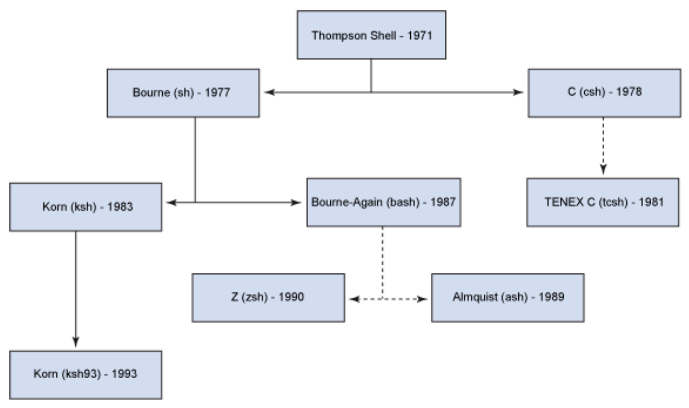
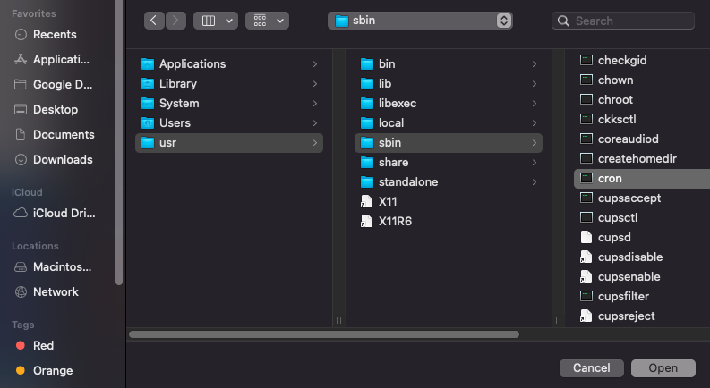

# Shell



* Environment is set at login and are valid for the duration of the session

> Terms

* Shell: a program which processes commands and returns output, like bash in Linux
* Terminal: program that run a shell

| Application             | sh  | csh | ksh | bash | tcsh |
| ----------------------- | --- | --- | --- | ---- | ---- |
| Job control             | N   | Y   | Y   | Y    | Y    |
| Alias                   | N   | Y   | Y   | Y    | Y    |
| I/O redirection         | Y   | N   | Y   | Y    | N    |
| Command history         | N   | Y   | Y   | Y    | Y    |
| Command line editing    | N   | N   | Y   | Y    | Y    |
| vi Command Line editing | N   | N   | Y   | Y    | Y    |
| Underlying Syntax       | sh  | csh | ksh | sh   | csh  |

* bash (born again shell)
  * -c string: commands are read from string. Arguments after string are assigned to positional parameters, from $0

* csh (c shell)

* zsh
  * Recursive path expansion → For example “/u/lo/b” expands to “/usr/local/bin”
  * Spelling correction and approximate completion: will fix minor mistake typing a directory name
  * Plugin and theme support: ZSH includes many different plugin frameworks

> Distribution

* Linux
  * Developed originally by Bell Laboratorie
  * Kernel interacts with computer hardwares to allow software / hardware to exchange information
  * Tries to make the distribution more user-friendly with more convenient features
  * Four categories based on original distribution - Arch, Debian, Red Hat, and Slackware

* WSL: compatibility layer for running Linux binary executables natively on Windows 10

* Red Hat: CentOS, Fedora, and Red Hat Enterprise Linux are derived

* BSD
  * Linux: MacOS

* Ubuntu: Desktop based Linux distribution

* window
  * Win+R shell:startup \(current user\) shell:common \(all user\)
  * systeminfo: checks 32, 64 bitness
  * new-alias vi notepad: use vi to replace notepad

* type: like cat in linux




```text
C:\>echo hi > a.txt
C:\>echo bye > b.txt
C:\>type a.txt b.txt > c.txt
C:\>type c.txt
```




> Broken pipe

* IP changed or server can't guarantee security

> Connection to _ closed by remote host

* Administrator Disconnect

> getcwd() failed: No such file or directory

* execute a command from a path that doesn't exists (deleted by other terminal)

> The System is going down for reboot NOW!

* Remote server shuts down

> Unable to fetch some archives, maybe run apt-get update or try with --fix-missing?

* -> run apt update
* apt install tftp

> Problem with update-manager: No module named 'apt_pkg' in Ubuntu 13.10, having installed Python 3.4 on /usr/local/lib

* sudo apt-get install --reinstall python3-apt

> device or resource busy (when rm file)

* lsof +D /path and kill
* umount /path

> ~ doesn't give correct value

* Tilda must be first character of word and not quoted

> Pseudo-terminal will not be allocated because stdin is note a terminal

* ssh -tt

> You have a new mail

* /var/mail/$USER or /var/spool/mail/$USER
* django cronjob has failed

> Reference

<https://mug896.github.io/bash-shell/>

## Shortcut

* CTRL+A/E: move to beginning end of line
* CTRL+B: moves backward one character
* CTRL+C: halts the current command
* CTRL+D: deletes one character backward or logs out of current session, similar to exit
* CTRL+F: moves forward one character
* CTRL+G: aborts the current editing command and ring the terminal bell
* CTRL+H: deletes one character under cursor (same as DELETE)
* CTRL+J: same as RETURN
* CTRL+L: clears screen and redisplay the line
* CTRL+M: same as RETURN
* CTRL+N: next line in command history
* CTRL+O: same as RETURN, then displays next line in history file
* CTRL+P: previous line in command history
* CTRL+R: searches backward
* CTRL+S: searches forward
* CTRL+T: transposes two characters
* CTRL+UK: kills forward / backward from point to the beginning of line
* CTRL+V: makes the next character typed verbatim
* CTRL+W: kills the word behind the cursor
* CTRL+X: lists the possible filename completions of the current word
* CTRL+Y: retrieves (yank) last item killed
* CTRL+Z: stops the current command, resume with fg in the foreground or bg in the background

* ALT+BF: moves backward / forward one word (opt <-> mac)
* ALT+D: deletes next word
* ALT+H: deletes one character backward
* ALT+T: transposes two words
* ALT+.: pastes last word from the last command. Pressing it repeatedly traverses through command history
* ALT+U: capitalizes every character from the current cursor position to the end of the word
* ALT+L: uncapitalizes every character from the current cursor position to the end of the word
* ALT+C: capitalizes the letter under the cursor. The cursor then moves to the end of the word
* ALT+R: reverts any changes to a command you’ve pulled from your history if you’ve edited it

* command + t: Create new tab
* command + (shift) + d: Split terminal
* ctrl + (shift) + tab: Navigate tabs




* Settings -> Device -> Keyboard

* Alt+Prt Scrn: take a screenshot of a window.
* Shift+Prt Scrn: take a screenshot of an area you select
* Alt + `: switch between same app
* fn + window + arrow: next screen




* Control + Command + Q: Lock screen




### event designators

* !n: n th command
* !! !-n: previous command / nth previous command
* ^old^new: change old from previous command to new (only one)
* !#:n / $: nth / last word in current command
* !!:gs/string1/string2: change old from previous command to new (multiple)

### Shebang

* \#! used in the first line of the script allowing text file to be read as executable




```sh
#!/bin/sh -                         # - prevents file argument not interpreted as argument for sh
#!/usr/bin/env python               # env search for PATH when executing
#!/usr/bin/env -S gawk -v AA=100 -f # -S allow shebang to use multiple options
```




## Setup

* \#!/bin/bash -e: set which shell to run
* /etc/skel/.bashrc: reset rc files to original

* /lib/systemd/system

| Run level | Mode       |
| --------- | ---------- |
| 0         | Power off  |
| 1         | Rescue     |
| 2         | Multi-User |
| 3         | Multi-User |
| 4         | Multi-User |
| 5         | Graphical  |
| 6         | Reboot     |

* [Reference](https://neoprogrammer.tistory.com/6)

1. Install Linux ubunutu ISO file
1. [Set up USB using rufus](https://rufus.ie/)
1. Try Ubuntu without Installing
1. 

> CLI

* dconf
  * reset -f `path`

* dscl (mac)
  * sudo scutil --set HostName mac: Change host Display name gyuseung@mac
  * read /Groups/admin GroupMembership: Reading the membership of the admin group:
  * append /Groups/admin GroupMembership usershortname: Adding a user
  * delete /Groups/admin GroupMembership usershortname: Removing a user: (from the group not the system)

* getent: get entries from Name Service Switch libraries
  * group: show all groups (also show groups obtained through LDAP or Yellow Pages)

* shopt `zsh`: shell builtin command to set and unset (remove) various Bash shell options
  * -s: Set options
    * dotglob nullglob: also glob hidden file
    * extglob: allows bang
    * globstar: allow glob-operator (\*\*) to be recursive (ex: \*\*/\*.py)
  * -q: Suppresses normal output

* setxkbmap
  * -option: remove all options ([ex] caps:escae: swap capslock with esc)

* ubuntu-drivers
  * devices: show drivers




* [Korean Settings](https://gabii.tistory.com/entry/Ubuntu-1804-LTS-%ED%95%9C%EA%B8%80-%EC%84%A4%EC%B9%98-%EB%B0%8F-%EC%84%A4%EC%A0%95)

```sh
# 1. Password / install
sudo apt-get update && sudo apt-get install -y vim git docker python3.7 wget
passwd
kill -HIP $PPID

# 2. Keyboard & Language
dconf write /org/gnome/desktop/input-sources/xkb-options "['caps:escape']"  # switch caps-lock esc
dconf reset -f /  # set up to default

# 3. bluetooth
sudo apt-get install bluez*

# 4. toggle sidebar (settings -> dock -> auto-hide the dock)
sudo apt-get install gnome-session-fallback
```




```sh
# 1. Install packages
# brew install binutils   # readelf equivalent 'export PATH="/usr/local/opt/binutils/bin:$PATH"' >> ~/.zshrc
defaults write -g ApplePressAndHoldEnabled -bool false  # disable accentuate
defaults write com.google.chrome IncognitoModeAvailability -integer 1z  # disable incognito mode
defaults write com.apple.finder AppleShowAllFiles TRUE : Show hidden folder on Mac
```




### File

* .profile: run when bash is invoked as an interactive login shell, or as non-interactive shell with the --login option
  * Anything that should be available only to login shells should be here
  * Looks for /etc/profile -> ~/.bash_profile -> ~/.bash_login -> ~/.profile
  * Can ignore --noprofile option
  * ~/.bash_profile: should be super-simple and just load .profile and .bashrc
  * ~/.profile: stuff NOT specifically related to bash, such as environment variables (PATH and friends)

* .rc: Shorthand of run commands
  * ~/.bashrc: anything want at an interactive CLI (Command prompt, EDITOR variable, bash aliases)
  * Can ignore --norc option
  * Login shell: can use logout commandlien




```sh
# 1. Check
if [ -f .env ]; then export $(cat .env | sed 's/#.*//g' | xargs) fi

# 2. ~/.bashrc
case $- in # Only ofr interactive Shell
  *i*) ;;
    *) return;;
esac

HISTCONTROL=ignoreboth
shopt -s histappend # append to history file, don't overwrite it
HISTSIZE=1000       # set history size
HISTFILESIZE=1000   # set history file size

cdl() {
  cd"$@";
  ls -al;
}
mkcdir () {
  mkdir -p -- "$1" && cd -P -- "$1"
}
parse_git_branch() {
  git branch 2> /dev/null | sed -e '/^[^*]/d' -e 's/* \(.*\)/ (\1)/'
}
export PS1="\u@\h \W\[\033[32m\]\$(parse_git_branch)\[\033[00m\] $ "   # show branch in shell
export PS4='+(${BASH_SOURCE}:${LINENO}): ${FUNCNAME[0]:+${FUNCNAME[0]}(): }'
export VISUAL=vim
export EDITOR="$VISUAL"
alias ..='cd ..'
alias so="source ~/.bashrc"
alias fn="find . -name "
alias fr="find . -regex "
alias ipe='ipconfig getifaddr en0'
alias ipi='curl ipinfo.io/ip'
alias ll="ls -la"
alias mount='mount |column -t'
alias ports='netstat -tulanp'  # TCP / UDP
alias sshhosts="sed -n 's/^\s*Host\s+(.*)\s*/\1/ip' ~/.ssh/config"
alias speed='speedtest-cli --server 2406 --simple'
alias untar='tar -zxvf '
alias psm='ps aux | sort -nr -k 4 | head -3'
alias psm10='ps aux | sort -nr -k 4 | head -10'
alias psc='ps aux | sort -nr -k 3 | head -3'
alias psc10='ps aux | sort -nr -k 3 | head -10'
alias du1="du -hs * | sort -h"
alias du2="du -h -d 2 | sort -h"
alias g="git "
alias d="docker "
alias dc="docker compose"
alias ag="ag --hidden -U"

### C
source ~/github/opencv/build/setup_vars.sh
# CXXFLAGS += -c -Wall $(shell pkg-config --cflags opencv4) LDFLAGS += $(shell pkg-config --libs --static opencv4)
export PKG_CONFIG_PATH="/usr/local/lib/pkgconfig"
export CMAKE_PREFIX_PATH=~/github/opencv/build    # PATH searched by CMake FIND_XXX()
export CPPFLAGS="-I/usr/local/opt/libffi/include"
export LDFLAGS="-L/usr/local/opt/libffi/lib"
```




```sh
alias ldd="otool -L"
alias xclip="pbcopy"
alias xargs="gxargs"
```




### Alias

* disabled in non-interactive shell, child process
* enabled in subshell
* set shortcut to command
* \aliased_command: temporaily disable aliased command using backslash
* alias untar='tar -zxvf '

* alias
* declare: set variabele values and attributes, make pipeline fails if error
  * -f `foo`: Show all defined functions named `foo`

* unalias `cmd`: remove alias for `cmd`

* type `cmd`: print out what `cmd` the alias will run

### Boot

* grub: GRand Unified Bootloader

* update-grub

* /etc/init.d: The directory containing System V init scripts
* /etc/default/grub: [ex] GRUB_CMDLINE_LINUX_DEFAULT="quiet splash nouveau.modeset=0"




* service: run a System V init script
* systemctl: control systemd system and service manager

```sh
service --status-all | grep +
```




* launchd: system wide and per-suer daemon/agent manager
* launchctl: Interfaces with launchd




### Kernel




* used to override default kernel parameter values, only a small number of parameters is predefined

* sysctl: modify kernel parameters at runtime
  * -a: Display all values currently available
  * -p: load in sysctl settings from file epecified ([ex] **/etc/sysctl.conf**)

```sh
# /etc/sysctl.conf
```

> ENOSPC: System limit for number of file watchers reached

* fs.inotify.max_user_watches=524288 | sudo tee -a /etc/sysctl.conf




### User

> Terms

* root: aka superuser, administrator, admin or supervisor who can do everything
  * Unix-like systems, for example, the user with a user identifier (UID) of zero
* Owner: the assigned owner of the file or directory
* Group: members of the group that owns the file or directory
* Other: all other users that owns the file or the directory

* History from file
  * /var/log/secure: Red Hat
  * /var/log/auth.log: Debian

> CLI

* chmod: change mod
  * -R: change files and directories recursively

* chown: change owner
  * -R `whoami` `/usr/local`: change user / group ID for file hierarchies
  * user:group filename: transfer filename to user, group

* groups: display all groups
  * user: list of all groups a user belongs to (first group is primary)

* id: print real and effective user and group IDs
  * -u: print only effective user ID

* usermod
  * -a: Add the user to the supplementary group
  * -g: List of supplementary groups which the user is also a member of
  * -l new old: change username

* restart: restart computer

* last: check login history
  * -15: all logged user
  * `user`: history of `user`
  * pts/2: terminal conncted

* lastlog: reports user's last login information from /var/log/last/log

* lastb: check user's bad login history

* w: Show who is logged on and what they are doing

* who: show who is logged on

* su: switch user
  * `user`: Change to `user`
  * -c `cmd`: Pass single `cmd` to user

* passwd: change password of current user
  * `user`: change password for other `user`
  * -d: delete password
  * -e: make passwd expired
  * -l: locking account
  * -u: unlocking account

* adduser: non-interactive, and not distro-specific (preferred)
* useradd: native binary compiled with the system
  * -m: create the home directory

* userdel
  * -r: removes files in the user's home directory along with the home directory itself

```sh
# 1. Add group
sudo usermod -aG docker ${USER}

# 2. OS Info
cat /etc/os-release

# 3. List User and Groups
cut -d: -f1 /etc/passwd
cut -d: -f1 /etc/group | sort

# 4. Add User
vi /etc/default/useradd
HOME=/home/sean
useradd vivek
passwd sean
finger sean
```

### Super user

* sudo: run in previleged mode
  * -g `group`: Run with primary group set to `group` instead of specified by target user's password database entry

* visudo: edit sudoer file, locks the sudoers file against simultaneous edits
  * add to sudo group
  * usermod -aG sudo id

```sh
# 1. /etc/sudoers
Defaults:chris timestamp_timeout=20  # in minute, negative for infinite timeout
Defaults:ravi      !authenticate     # Totally disable
root  ALL=(ALL)   ALL                # Do not prompt password

# 2. Dockerfile
local result=1
which sudo 2>&1 1>/dev/null
[ $? -eq 0 ] && result=0        # 0 - ok/ 1 - nok
sudo -Hiu $user env | grep $var # grep other person’s env

Add user (default id: 1000)
ARG USER_ID=1002

RUN useradd -ms /bin/bash ${USER_NAME} && usermod -aG wheel ${USER_NAME} \
  && echo "${USER_NAME} ALL=(ALL) NOPASSWD: ALL" > /etc/sudoers.d/${USER_NAME} \
  && echo 'Defaults env_keep = "http_proxy https_proxy"' >> /etc/sudoers.d/${USER_NAME}
```

> Error sudo: command not found

* apt install sudo

## Process Command

* exec
  * `shell`: redefine the current shell to `shell`
  * `cmd` `args`: run `cmd` name remaining as arguments
    * if `cmd` doesn't exists, exits on error

* pgrep: find or signal processes by name

* fuser: show which processes are using a specified computer file, file system, or Unix socket
  * -v -n tcp 80: check what processes are using a network port:

* ltrace: intercepts library calls and system calls made by your application to C libraries such as glibc
  * analyze the performance of libraries when they are used by applications

* strace: intercepts system calls make by glibc and other libraries directly into Linux Kernel
  * uses ptrace to inspect system calls by the process and how long each took
  * -f

* ps
  * <>: PPID PID PGID SID TTY TPGID STAT UID TIME COMMAND
  * a: show processes for all users
  * u: display the process's user/owner
  * x: show processes not attached to a terminal
  * -e: show the environment after the command
  * -f: ASCII art process hierarchy
  * -L pid: Prints all thread used by pid
  * -o thcount= pid: Total thread in pid

* sleep: default is seconds, m, h, d

* top: show cpu usage (use htop)
  * current time | uptime | users sessions logged in | average load on the system (1, 5, 15 min)
  * Processes totals (73 total) | running | sleeping | stopped | waiting to be stop from parent
  * user | system | priority nice |  I/O operations | hardware interrupts | software interrupts | hypervisor
  * PID: PID of the process(4522)
  * USER: The user that is the owner of the process (root)
  * PR: priority of the process (15)
  * NI: The “NICE” value of the process (0)
  * VIRT: virtual memory used by the process (132m)
  * RES: physical memory used from the process (14m)
  * SHR: shared memory of the process (3204)
  * S: S=sleep R=running Z=zombie D=uninterruptible sleep, IO (S)
  * %: percentage of CPU used by this process (0.3)
  * %: RAM used by the process (0.7)
  * TIME: total time of activity of this process (0:17.75)
  * COMMAND: name of the process (bb_monitor.pl)
  * -o key: Order process display by sorting on key in descending order
  * -n nprocs: Only display up to nprocs processes
  * -user user: Only display processes owned by user
  * k: Kill Process (PID and signal-9)
  * c: display full command
  * u: Specify process of user
  * shift + t: Sort by longest uptime
  * shift + m: Sort by largest memory usage
  * shift + p: Sort by largest CPU usages
  * space: refresh

* vm_stat (mac): show Mach virtual memory statistics

```sh
# 1. Thread
cat /proc/sys/kernel/threads-max # possible thread count
ps ax -L --no-headers | wc -l    # currently running thread count
ps -o thcount= 19783             # number of thread used by process

# 2. ps
ps axjf           # display the process tree on Linux
ps aux | grep apt # see all downloading files
ps ax -L --no-headers | wc -l           # Total thread now
ps /proc/sys/kernel/threads-max         # Total possible thread
ps ax -o pid,nlwp,cmd  | sort -nr -k2,2 # Ordered by number of threads
```

### cron

* [Check cron syntax](https://crontab.guru/)
* sudo service cron reload: CentOS7
* sudo /etc/init.d/crond reload: CentOS with cPanel
* Setup 

> Command

* cron: daemon to execute scheduled commands

* crontab
  * -l: list all cron
  * -e: open cron file

```sh
# ┌────────────── second (optional)
# │ ┌──────────── minute
# │ │ ┌────────── hour
# │ │ │ ┌──────── day of month
# │ │ │ │ ┌────── month
# │ │ │ │ │ ┌──── day of week
# │ │ │ │ │ │
# │ │ │ │ │ │
# * * * * * *

0 * * * *           # Every hour
*/10 * * * * *      # Every ten seconds.
0 0 6,19 * * *      # 6:00 AM and 7:00 PM every day.
0 0/30 8-10 * * *   # 8:00, 8:30, 9:00, 9:30, 10:00 and 10:30 every day.
```




> django-crontab

* pip install django-crontab
* Doesn't work on window

* Put 'django_crontab' in settings.py

> django-admin crontab cli

* add
* remove
* show
* run `job_hash`: test crontab (put hash returned by add)




```sh
@overnight @hourly @midnight @daily
pipeline {
  agent any
  parameters {
    string(name: 'Greeting', defaultValue: 'Hello', description: 'How should I greet the world?')
  }
  stages {
    stage('Example') {
      steps {
        echo "${params.Greeting} World!"
      }
    }
  }
}
```




* on
  * schedule
    * cron: [ex] "0 17 \* \* \*"




## Util Command

* htop: visualize memory usage in top

### Multiplexing

* tmux: Terminal multiplexer
  * new -s: create session with name
  * ls: list all sessions
  * kill-session -t 0: kill with session name 0
  * attach-session -t 0: attach with session name 0
  * C-b d: Detach from session
  * C-b [: Scroll Up and down
  * C-b PgUp

* code: open file in vscode
  * -n: Create a new window
  * -r .: Open current directory in most recently used window
  * -diff f1 f2: Open diff editor

### Media

* pdfseparate: brew install poppler
  * -f `int`: first page to extract (inclusive)
  * -l `int`: last page to extract (inclusive)
  * -v: print copyright and version info
  * -h: print usage information

* convert
  * `*.jpg` `output.pdf`: convert jpg to pdf
  * `a.pdf` -flatten output-%02d.jpg: convert pdf to jpg
  * -quality 100
  * -density 200
  * -colorspace sRGB

* imagemagick: displaying, converting, and editing raster image and vector image file
  * brew install imagemagick
  * --with-fontconfig --with-ghostscript --with-openjpeg --with-webp

* ffmpeg
  * -i video.mp4 2>&1 | grep Duration: get duration of video

```sh
import png:- | xclip -selection clipboard -t image/png  # screenshot goes to clipboard
```

### Help

* apropos `description`: search the whatis database for strings

* compgen: Not avaiable in zsh
  * -c: lis all available command you can run
  * -k: list all the keywords you could run

* man: format and display the on-line manual pages
  * 1 `printf`: printf in user commands
  * -k man `'^printf'`: search for sections in man page

| Section | contents                                |
| ------- | --------------------------------------- |
| 1       | User Commands                           |
| 2       | System Calls                            |
| 3       | C Library Functions                     |
| 3n      | network functions                       |
| 4       | Devices and Special Files               |
| 5       | File Formats and Conventions            |
| 6       | Games et. al.                           |
| 7       | Miscellanea                             |
| 8       | System Administration tools and Daemons |
| 9       | Kernel routines                         |

* whatis `command`: search the whatis database for complete words

### Terminal

* clear: clear terminal

* chsh
  * -s /bin/bash user: change user’s shell to bash

* env (printenv): Print all local variables

* export: a new shell is spawned to run the script
  * & pass environment values to a child process
  * export LC_ALL=C: Change shell language to english
  * export name=sean: Set name variable to sean
  * /etc/environment: sets variable system wide for every user on boot
  * /etc/bash.bashrc: executed if the bash shell is opened
  * ~/.`shell_name`rc: to make it run when start an interactive shell
  * ~/.`shell_name`profile: to make when log in

* locale: print enabled language
  * -e: any trap on ERR is inherited by shell functions (bash -e)
  * -o `pipefail`: return value of a pipeline is value of last (rightmost) command to exit

* locale-gen : en_US.UTF-8: Create UTF-8

* set: change shell options, set positional parameters, display names and values of shell variables
  * use - to set and + to unset (ex. set -e)
  * Set | unset values of shell options and positional parameters
  * -a: automatically export all variables
  * -P: If set, follow symbolic links when executing commands

* source: run command in current shell (useful for setting env variable)
  * When script run (with ./myscript.sh), it creates own process context (a new process environment)

* stty: change and print terminal line settings
  * -g, --save: print all current settings in a stty-readable form

* unset: remove exported variable

* lsb_release: LSB (Linux Standard Base) and distribution-specific information on the CLI
  * -a: Display all information
  * [ex]

    LSB Version : core-4.1-amd64:core-4.1-noarch
    Distributor ID: : CentOS
    Description: [ex] CentOS Linux release 7.7.1908 (Core)
    Release: [ex] 7.7.1908
    Codename: [ex] Core

* uname: Print operating system name
  * -a: Behave as though all of the options -mnrsv were specified
  * -m: machine hardware name
  * -n: nodename (name that system is known by to communication network)
  * -p: machine processor architecture name
  * -r / s / v: operating system release / name / version
* screen (consider tmux)

```sh
# 1. os name check
if command -v lsb_release >/dev/null 2>&1; then
  OS_NAME=$(lsb_release -i -s)
fi

case "$(uname -s)" in
  Darwin)
    export ARCHDIR=$PWD/mips-mac/bin
    ;;
  Linux)
    export ARCHDIR=$PWD/mips-x86.linux-xgcc/
    ;;
esac

# 2. Load env
if [ -f .env ]; then
  export $(cat .env | sed 's/#.*//g' | xargs)
fi

can_escalate_privileges()  # by default (e.g. on Linux) user can do so
{
  local result=0
  if [ "$(uname)" = "FreeBSD" ]; then
    if ! groups $USER | grep wheel 2>&1 1>/dev/null; then
      result=1
    fi
  fi
  return $result
}

system_cpu=`uname -m`
```

## File Command

> Terms

* Ubuntu
  * /bin: Executables needed in single user mode and to bring system up or repair
  * /etc: System related configuration file (local static file to control program operation)
  * /sbin: holds commands needed to boot the system for sudo user
  * /issue: Check Linux Version
  * /etc/paths: look for commands
  * /etc/hosts: Static table lookup for hostnames
  * /etc/init.d: start/stop scripts used to control daemon while system is running boot
  * /etc/services: Internet network service list
  * /opt: Install unbundled packages, each in its own subdirectory
  * /proc: interface to kernel data structures
  * /proc/pid: exe a copy of the binary image of the running process
  * /proc/sys: Info about system, allows system admin  to enable, disable kernel features
  * /usr: Files under it are shareable between OS instances
  * /usr/local: Install files built by administrator (make), not managed by system packager
  * /var: Variable data files (spool dir | files, administrative, log, transient | temp files)

* mac
  * /boot: /System/Library/Kernels
  * /home: /Users
  * /root: /var/root

> CLI

* chattr
  * `+ / -`: Adds / removes attribute to existing attribute of files
  * =: Keep the existing attributes that the files have
  * i: immutable

* basename
* dirname

| orig         | dir      | bas  |
| ------------ | -------- | ---- |
| /usr/lib/log | /usr/lib | /log |
| /usr/        | /        | usr  |
| usr          | .        | usr  |
| /            | /        | /    |

* lsattr: lists the file attributes on a second extended file system
* stat: displays the size and other stats of a file/directory or a filesystem
* patch: apply a diff file to an original
* locate: fast but less accurate
* whereis: locate the binary, source, and manual page files for a command

* which: returns the pathnames of the files which would be executed in the current environment

* ls: lists contents in the directory
  * -a: show hidden file
  * -d: list directories as plain files
  * -h: human readable
  * -i: Lists IP sockets
  * -l: file mod, # links, owner, group, bytes, modified path
  * -R: recursively
  * -S / t: by size, date
  * -1 "$PWD/"*: get all absolute path

* pwd: print current working directory

* pushd: saves the cwd in memory

* popd: change directory that was most recently stored by pushd

* dirs: display the list of currently remembered directories
  * -p: Causes dirs to print the directory stack with one entry per line

* cd: change directory
  * `dir`: [ex] -: last directory, .. : parent directory, ~: home directory, "dir with_space": directory with space
  * -L: Follow symbolic links (default)
  * -P: Follow physical directory
  * $(dirname a/b/file.cpp): cd into file's located folder

* readlink
  * -f: show full path

```sh
# 1. check if file is binary
if [ -f "$filename" -a "$(file -b --mime-encoding "$filename")" = binary ]; then
  echo It\'s a binary file
fi
```




```sh
brew install coreutils
alias readlink=greadlink
```




### Disk

* df: disk free, report file system disk space usage
  * -a: file system's complete disk usage even if the Available field is 0
  * -h: human readable format

* du, disk usage
  * [-H | -L | -P] [-a | -s | -d depth] [-c] [-h | -k | -m | -g] [-x] [-I mask] [file ...]
  * -a: all files and folders
  * -s: display only a total for each argument
  * -d: max-depth
  * -h: human readable
  * -h -d1

* fdisk: show disk size along with disk partitioning info
  * -l: List partition tables for specified devices and exit

* dmidecode (DMI / SMBIOS table decoder)
  * sudo dmidecode | egrep "Socket Designation: Proc|((Thread|Core) Count)"

* ulimit
  * -c unlimited: dump core to current directory

* sysctl: Read and set values in /etc/sysctl.conf (kernel parameters)
  * sysctl kernel.core_pattern: get segfault location
  * sysctl -a | grep machdep.cpu / swap: show cpu / swap info in mac

* lsblk: lists information about all or the specified block devices

* getconf: retrieve standard configuration variables

* systemd: system daemon

* systemctl: Control the systemd system and service manager
  * disable Unit
  * removes all symlinks to the unit files backing the specified units from the unit configuration directory
  * undoes any changes made by enable or link
  * get-default: get default target
  * list-units --type target: get all target (--all to print unactivated)
  * set-default name.target: change default target
  * isolate graphical.target: change target without reboot
  * enable: hook specified unit into relevant places → start on boot
  * list-units PATTERN: List units that systemd currently has in memory
  * list-sockets PATTERN: List socket units currently in memory
  * start PATTERN: Start (activate) one or more units specified on the command line
  * disable deviceservie:
  * status / / ssh: check status of root mount / ssh

* quota: display disk usage and limits
  * -g: Print group quotas for the group of which the user is a member

```sh
# 1. du
du  * -hs * | sort -h # order by size
du -a | cut -d/ -f2 | sort | uniq -c | sort -nr # count # of files each dir : -a | cut -d/ -f2 | sort | uniq -c | sort -nr

# 2. Change max number of watcher
echo fs.inotify.max_user_watches=524288 | sudo tee -a /etc/sysctl.conf && sudo sysctl -p
```

## Installer

* curl: providing a library and command-line tool for transferring data using various network protocols
  * -L: (HTTP) If requested page has moved to a different location use that
  * -P, --ftp-port address: (FTP) Reverses default listener roles when connecting with FTP
  * -q / -s / -i: Quite /Silent (no progress, error) / Include the HTTP-header in output
  * -m --max-time: maximum time in seconds
  * -o file / -O: Write output to file / local file named like the remote file we get
  * -X `type`: request `type` ([ex] POST)
  * -H `header`: header ([ex] 'Content-Type: app/json')
  * -d `data`: [ex] '{"id": "tom", "age": "7"}'

* rqm (Redhat Package Manager): manipulates specifically packages it is asked to manipulate
  * needs to know the exact location of .rqm package

* ant: Java installer

* dpkg: used to install, remove, and provide information about .deb
  * --ad-architecture: package can be installed without using --force-architecture
  * -s `package`: report status of `package`

* wget
  * -P: /path/to/folder
  * --spider: behave as a Web spider, just check that website are there
  * --ask-password: secure safe
  * --http-user / http-passwd: Specify username user and password on an HTTP (not safe)

* update-alternatives
  * maintain symbolic links determining default commands
  * --config: name
  * --install /usr/bin/python3 python3 /usr/bin/python3.8 2: set python3.8 with priority 2

```sh
# 1. curl
curl -s https://raw.githubusercontent.com/sivel/speedtest-cli/master/speedtest.py | python -
error() {
  print_error $@
  exit 1
}

curl -m 2 www.google.com &> /dev/null || error "Failed to access external"

# 2. Install multiple files
PKGS=(
  libusbx-devel
  gtk2
  gstreamer1
)
yum install -y ${PKGS[@]}
```

### Linux

* add-apt-repository: ([ex] ppa:deadsnakes/ppa)

* apt: native Ubuntu system-wide package manager (apt-get is one of apt parts → mostly can be ignored)
  * packages are usually updated for each separate Ubuntu release
  * used with the Debian family distributions and handles deb software packages
  * autoremove: remove installed dependencies with applications and are no longer used by anything else on the system
  * update: update apt
  * upgrade: upgrade packages
  * full-upgrade: if needed previously installed packages are removed to make the upgrade happen
  * list --installed: List installed packages
  * /var/lib/apt/lists: Storage area for state information for each package resource
  * /var/lib/apt/lists/partial/: Storage area for state information in transit
  * install
    * -y `package`: accept all while downloading

* apt-show: explain repository ([ex] software-properties-common)

> Waiting for cache lock: Could not get lock /var/lib/dpkg/lock-frontend” while installing applications in Ubuntu

```sh
sudo lsof /var/lib/dpkg/lock
### COMMAND PID USER FD TYPE DEVICE SIZE/OFF NODE NAME
### xxxxxx 5383 root 7aC REG 6,3 0 210001 /var/lib/dpkg/lock-frontend

sudo kill -9 5383  # Kill the process
sudo rm /var/lib/dpkg/lock  # Remove/Delete the lock file
sudo rm /var/cache/apt/archives/lock  # Remove the lock from the cache folder
sudo dpkg --configure -a  # Check and correct the interrupted dpkg process if any (So we do no end up with broken packages)
```

> Package 'python3.7' has no installation candidate

```sh
apt update
apt install python3 python3-pip software-properties-common
add-apt-repository ppa:deadsnakes/ppa
apt install python3.7
```




* choco install `package` ([ex] python)
* [Install](https://chocolatey.org/docs/installation)
* Debian: open source community, stability and security
* freeze and scrutinize all packages → packages can be a little old
* Linux Mint, Ubuntu, Elementary OS, and Kali Linux




* packages compiled to version-specific subdirectories → multiple versions can be in machine
* Homebrew is a 3rd party addition – on both macOS and Ubuntu
* cask is extension to brew that allows management of graphical applications through Cask project

> CLI

* casks
* cleanup: run occasionally to avoid running out of disk
* install adoptopenjdk8: 9, 10, 11
  * --cask
* link: creates symlinks to installations you performed
  * --overwrite: overwrite existing symlink
* list: list all available formula
* services
  * start postgres
  * stop postgres
* tap adoptopenjdk/openjdk: install old java
* uninstall `formula`: Uninstall formula




### yum

* usually used with the RHEL family OS's and handles RPM software packages

* /etc/yum.conf: configuration file and related utilities
* /etc/yum.repos.d/: options
* install `package`: [ex] git
* remove `package`
* autoremove `package`: remove unneeded dependencies
* list: list all packages




* !, %, .,:, @, {, }

```sh
# ls
echo `ls` wolrd     # print inside

# shift.sh a b c d
echo "Total arguments passed are: $#"
echo "The arguments are: $*"      # $* is used to show the command line arguments
echo "The First Argument is: $1"  # a

echo "The First Argument After Shift 2 is: $1"  # c
shift
echo "The First Argument After Shift is: $1"    # d
```




## Expansion

> Arithmetics

* $(( )): $(( 1 + 2 )) ..

> brace

* echo a{d,c,b}e: ade ace abe
* mkdir /usr/local/{old,new}: create multiple
* *(patternlist): matches zero or more occurrences of the given patterns
* +(patternlist): matches one or more occurrences of the given patterns
* ?(patternlist): matches zero or one occurrence of the given patterns
* @(patternlist): matches exactly one of the given patterns
* !(patternlist): matches anything except one of the given patterns

> Tilde

* ~ is expanded ONLY if it is the first character of a word AND it is unquoted
* ~-: old pwd
* ~-/+ n: same as dirs -/+ n
* -fred: home directory of the user fred

> Parameter

* ${array[i]}: displays array's value for this index. If no index is supplied, array element 0 is assumed
* ${#array[i]}: to find out the length of any element in the array
* ${#array[@]}: to find out how many values there are in the array

* ${`var`:-word}: if `var` exists and isn't null, return its value; otherwise return word
* ${`var`:word}: if `var` exists and isn't null, return its value; otherwise return word
* ${`var`:=word}: if `var` exists and isn't null, return its value; otherwise set it word and then return its value
* ${`var`:?message}: if `var` exists and isn't null, return its value
  * otherwise print `var`, followed by message and abort current command or script
* ${`var`:+word}: if `var` exists and isn't null, return word; otherwise return null
* ${`var`:offset:length}: performs substring expansion
  * returns the substring of $`var` starting at offset and up to length characters

* ${`var`#`pat`}: if `pat` matches beginning of the `var`, delete shortest / loogest(##) part that matches and return rest
* ${`var`%`pat`}: if `pat` matches end of `var`, delete shortest / longest(%%) part that matches and return rest
* ${`var`/`pat`/string}: longest match to `pat` in `var` is replaced by string. Only first match is replaced
* ${`var`//`pat`/string}: longest match to `pat` in `var` is replaced by string. All matches are replaced




```sh
# 1. Parameter expansion
echo "${PATH//:/$'\n'}"
```




## Awk

* awk: (Aho, Weinberger & Kernighan)

* gsub(regexp, replacement [, targ]): Global replacement of string
* FS: File separator
* OFS: Output file separator
* NF: The number of fields in the current input record
* NR: The total number of input records seen so far
* -F: Specify the input field separator
* '_[$0]++' *.csv: Find duplicate line
* '{print}' input.txt: Prints every line of data from the specified file
* '/PAT1/,/PAT2/' file: Lines between inclusive

```sh
awk '{print NR,$0}' input.txt             # NR prints line number, $0 prints entire string
awk '/abc/ {print}' input.txt             # Prints every line containing abc
awk 'NR==n {print $0}' input.txt          # Prints n th line
awk -F 'pattern' 'NF{print NF-1}' b4      # Count number of pattern in each line
awk '/ptn/ {c++} END {print c}' input.txt           # Count pattern in the string
awk '{ t = $1; $1 = $2; $2 = t; print; }' file      # Swap first two column
awk '/PAT1/{flag=1; next} /PAT2/{flag=0} flag' file # lines between exclude PAT1, PAT2
```



## Cut

* cut out selected portions of each line

> CLI

* -d: use as separater (-f1) to grep index
* -c n-: remove first n - 1 chatacter
* -d -f1 /etc/passwd: Get all user I can use




```sh
rev | cut -c -5 | rev # Grep last 5 charcter
cut -f -1 -d "/"  # remove filename
```






## Paste



## Grep

* grep: global regular expression print
  * key * \c
  * -A num: how many lines after the match
  * -B num: how many lines before the match
  * -c `pattern`: How many patterns appear on file
  * -C `num`: how many lines `num` before, after the match
  * -E `epattern`: as an extended regular expression [ex] =+, ab*
  * -h: remove file name
  * -i: Case-insensitive search
  * -l / L: Lists the files which do / do not include the search term
  * -n: Show matching line numbers
  * -v: Reversing the meaning of a grep search
  * -o: Output only matched substrings
  * -r: Recursively search subdirectories listed
  * -rL "print" .: all files without print
  * -w: specifying word boundary

* fgrep: file pattern searcher

* egrep: extended grep
  * '19|20|25' calendar: grep multiple patterns

```sh
# 1. grep example
grep -c "^##" *.md       # Count number of heading on markdown
grep "patern1\|pattern2" # multiple pattern
grep -rnw '/path/to/somewhere/' -e 'pattern'  # Search on file (use ag)
grep -rL "\[\/\/\]" * | cut -d\/ -f-2 | uniq -c | sort # Count number of markdowns that doesn't contain comments
grep -how "images/.*.png" *.md | xargs -I{} mv "../theory/math/{}" images/ # move files
```



## shuf

* -n: number of lines

## Sed

* stream editor for filtering and transforming text
* invalid command code
* for OS use empty argument -i ''

> CLI

* s/: Replace
* /p: print
* -n: suppress line echoed to stdout after commands
* -i.bak: In place
  * backup is requiremnt in BST (blank for no backup ' ')

```sh
sed 's/.$//'              # remove last character
sed '0,/pattern/ d' file  # remove first line if pattern
sed '/^#[^!]/d' `file`    # remove all comments except shebang
sed "s/hello/hi/" file    # Replace hello to hi in file.txt
sed -n  :nclude/p;q file  # (p)rints all cpp files, then (q)uits
sed -i '1d' file          # delete first line
sed -i ':BJ/d' file       # delete first line if match
sed -i '1s :h1\n/' file   # append to beginning of file

# 4. Replace file in-place
sed -i 's/PasswordAuthentication no/PasswordAuthentication yes/g' /etc/ssh/sshd_config;
```



## Seq



### comm




```sh
# 1. See union contents in file1, 2
comm -12 < (cat file1 | sort) < (cat file2 | sort)
```




## Tee

* read from standard input and write to standard output and files

* -a: Append output to files rather than overwriting


## Tr

> CLI

* -d: search and delete any character or string from a text
* -s: compress same adjacent character output to single token
* `a-z` `A-Z`: prints in capital letters

```sh
# 1. tr
tr ':' '\n' <<< $PATH  # Print path in one line
```



## Uniq

* uniq: report or filter out repeated lines in a file
  * -c: show counting
  * -d: only print duplicate files
  * -u: Only print uniq line



## wc

* -l: Counter number of lines
* tr -cd ',' | wc              : Count specific character

```sh
# 1. find
find . ! -empty -type f -exec md5usm {} + | sort | uniq -d # Print all duplciate files (md5 in mac)
fgrep "*" *     # List all files with aesterisk

# 2. Count
find . -name '*.py' -type f | xargs wc -l | sort # Counte number of line for each python files
du -a | cut -d/ -f2 | sort | uniq -c | sort -nr  # the number of files in each directory
```

## Xargs

* -E: (for mac)
* -0: Change xargs to expect NUL
* -t: prints command that will be executed to terminal

```sh
# 1. read .env
eval $(grep -v -e '^#' .env | xargs -I {} echo export \'{}\')

# 2. Preserve whitespaces
echo ' A     B' xargs -I {} echo "{}"

# 3. Run all video
find . -regex ".*mp4" -print0 | xargs -0 -L 1 python3 scripts.py open_video
seq 10 | xargs ls "video{}.mp4" | xargs -0 -L 1 python3 scripts.py open_video

# 4. xargs
find . -name "to_move*" | xargs -I{} mv {} ./class/book/images/ # find and move
ls problem/*/ | grep -v ":" | xargs -I {} sh -c "ag "filter/{}.md" > /dev/null || echo {}" # Xargs multiple command
git log --diff-filter=D --summary | grep images | cut -b 20- | xargs -I {} git checkout HEAD^ {}  # Restore all removed files
```
