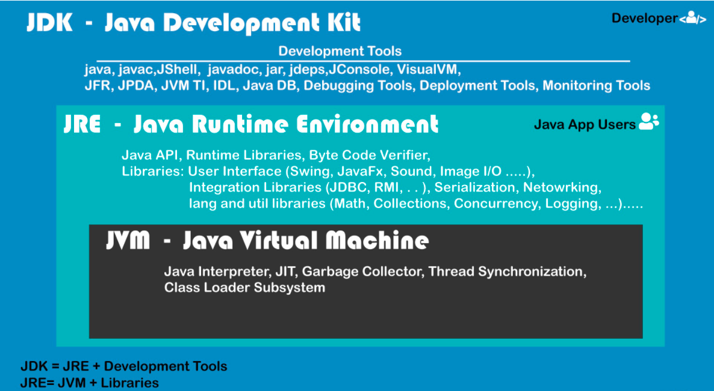
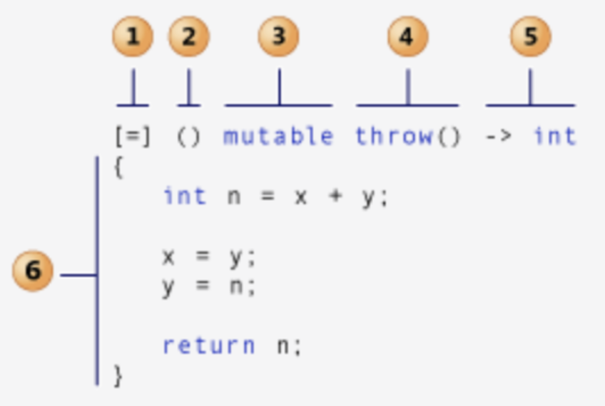
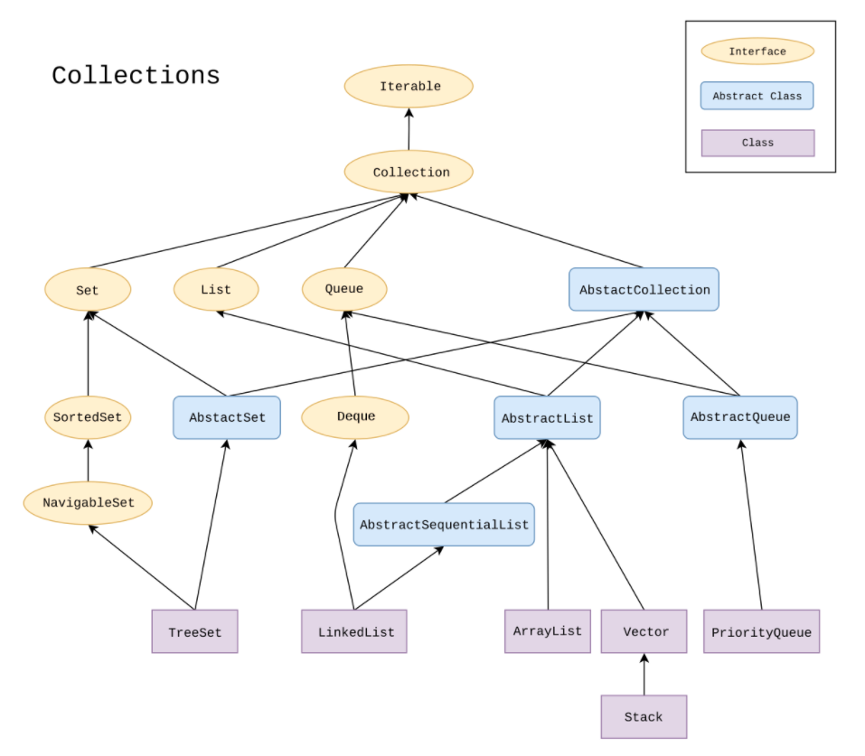
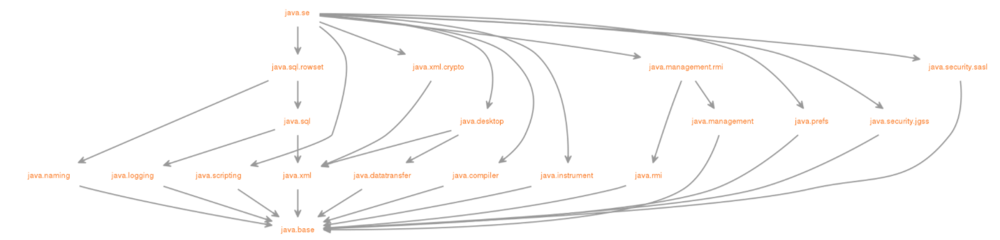
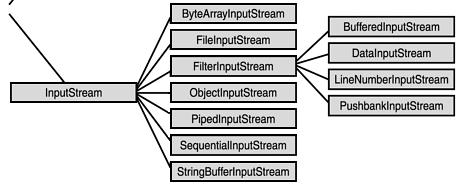
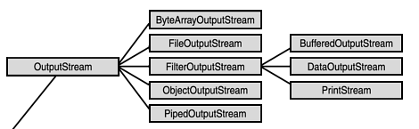

# Syntax

* syntax is set of rules defined by computer language




* [+] C was closely tied with the Unix operating system
  * C was developed from the beginning as the system programming language for Unix
  * Most Unix kernel (the core part of the operating system), and its supporting tools and libraries, were in C
* [+] C is a small, simple language
  * design was controlled by a single person
  * clean, consistent design with little baggage
  * K&R book describes the complete language and standard library, with examples and exercises, in 261 pages
* [-] C pointers are a common source of confusion and programming errors
* [-] C also lacks explicit support for useful abstractions such as classes, objects, and exceptions
  * C++, Java




* Compile-time: only know the type of reference
* Run time: only know the type of object

```java
-Xmx4G  // Configure more memory
```

> Terms



* JDK (Java Developer Kit): core component with executables and binaries required to compile, debug and execute a Java Program
* JRE (Java Runtime Environment): JVM and java binaries and other classes to execute any program successfully
* JVM (Java Virtual Machine): converting Byte code to the machine specific code → platform independence

> java.util.ConcurrentModificationException

* Modifying in for each loop

> Local variable `name` defined in an enclosing scope must be final or effectively final

* Make local variable `name` a class member
* Define another final variable and use instead



* All JavaScript values, except primitives, are objects
* Don’t Declare Number, String, Boolean Objects → slows down execution speed
* typeof() returns data types
* Objects are mutable: They are addressed by reference, not by value

```js
// 1. Loosely typed
var x = 5 + "7";    // x.valueOf() is 57,  typeof x is a string
var x = "5" + 7;    // x.valueOf() is 57,  typeof x is a string
var x = 5 - "x";    // x.valueOf() is NaN, typeof x is a number
```




* Muttable: list, set, dict are mutable

> EOFError: EOF when reading a line

* readline tries to read more line (Check if stdin leetcode)

> NameError: name 'prin' is not defined

* try to use a variable or a function name that is not valid
* prin(1) -> print(1)

> SyntaxError: unexpected EOF while parsing

* print(1 -> print(1)

> SyntaxError: non-default argument follows default argumentjedi

* def foo(score=25, name): -> def foo(name, score=25):

> AttributeError: 'builtin_function_or_method' object has no attribute 'split'

* a = input.split()

> IndentationError: expected an indented block

* for must be indented by some space

```py
for i in range(3):
print(1)
```

> TypeError 'float' object cannot be interpreted as an integer

* range function takes int
* range(11 / 2)

> TypeError 'int' object is not iterable

* min(1) -> min function takes iterable

> UnboundLocalError: local variable 's' referenced before assignment

* variable can't be both local and global inside a function

```py
def f():
  # global s    # Solution
  print(s)      # Error
  s = "I love London!"
  print(s)

s = "I love Paris!"
f()
```

> AttributeError: <'classmethod' or 'staticmethod'>,  object has no attribute '\_\_name__'

* apply classmethod and staticmethod last when using multiple decorators

```py
class My_class(object):
  @classmethod
  @print_function_name
class GameObject(Enemy):
  pass
```




## Keyword

* Cannot be used as identifier
* Lists of keywords in python




* break: terminates the loop containing it
* continue: skip the rest of the code inside a loop for the current iteration only
* pass: null operation → placeholder when a statement is required syntactically

```py
1. Pass example
sequence = {'p', 'a', 's', 's'}
for val in sequence:
  pass

def function(args):
  pass

class Example:
  pass

# 2. break else loop
for item in container:
  if search_something(item):
    process(item)
    break
else:    # else executes after the loop completes normally
  not_found_in_container()
```




## Comment

* Best comment in no comment, self documenting code with better structure




```cpp
// 1. single line
/* 2. multi
line */
```




```js
// 1. single line
/* 2. multi
line */
```




```py
# 1. single line comment
"""
2. multiline comment
"""
```




```sv
// single-line comment
/*
multi-line comment
*/
```




## Const




* compile time constraint / self documenting, compile optimization, can put in ROM (embedded)
* cannot modify anything that exists outside of the const function
* const applies to the thing left of it. If there is nothing on the left then it applies to the right of it
* pointers / references to that data must be as restrictive of how they allow data to be changed

> Term

* constexpr: can be used unless goto / try (after C++ 20) / uninitialized, non-literal variable / non constexpr function
  * if constexpr should be boolean (true → else won’t compile, vice versa)
  * rhs of constexpr must be number
* mutable: Can be changed in const function → useful for cache

```cpp
#include <iostream>
using namespace std;
struct X {
  X& ref() { return *this; }
};

// 1. Const examples
const int * p = &f;           // data is const, pointer is not
int * const p = &f;           // data is not, pointer is const
const int * const p = &f;     // data is const, pointer is const
const int i = 9;
const_cast<int&>(i) = 6;      // cast away const
int j;
static_cast<const int &>(j) = 7; // set data into const
void setName(const string& name) // const parameters
const string& getName() {}       // const return value
void getName() const {}     // cannot change member variable (only call const function)
void getName() {}           // non const object call this function

// 2. constexpr
// Error
int a;
constexpr int b = a;

// constexpr function
constexpr int Factorial(int n) {
  int total = 1;
  for (int i = 1; i <= n; i++)
    total *= i;
  return total;
}

// can be used in template
template <int N>
struct A {
  int operator()() { return N; }
};

int main() {
  constexpr int size = 3;
  int arr[size];
  constexpr int N = 10;
  A<N> a;
  cout << a() << std::endl;        # 10
  constexpr int number = 3;
  enum B { x = number, y, z };
  cout << B::x << std::endl;        # 3
}

// 3. Const Errors
// non-const lvalue reference to type 'X'
// -> X().ref()
X& x = X();

int a = 5;
// error: const' qualifier may not be applied to a reference
// int &const ref1 = a;

const int &ref2 = a;  // valid
// error: cannot assign to variable 'ref2' with const-qualified type 'const int &'
// -> const cannot be modified
// ref2 = 7;

const int b = 6;
// error: binding reference of type 'int' to value of type 'const int' drops 'const' qualifier
// -> cannot create non const pointed by  const pointer
// int &ref = b;

int c = 1, e = 2;
int const *d = &c;
d = &e;
// error: read-only variable is not assignable
// -> cannot modify const pointed int
// *d = 3;
cout << *d;

int const f = 5;
int *ptr = (int *)&f;
*ptr = 10;
cout << f;  // depends on compiler

// 4. Mutable
class A {
  mutable int data_;

 public:
  A(int data) : data_(data) {}
  void DoSomething(int x) const {
    data_ = x;
  }

  void PrintData() const { std::cout << "data: " << data_ << std::endl; }
};

int main() {
  A a(10);
  a.DoSomething(3);
}
```




```py
from typing import Final

VERSION: Final = "1.0.0"
```




> const

* cannot change constant primitive, but can change the properties of constant objects
* Redeclaring an existing const variable, in the same scope is not allowed

```js
const x = 2;      // Allowed
const x = 3;      // Not allowed
{
  const x = 2;    // Allowed
}
```




### Volatile




* volatile: remove compiler optimization

```cpp
#include <stdio.h>
typedef struct SENSOR {
  int sensor_flag;    // if detected 1
  int data;
} SENSOR;

int main() {
  volatile SENSOR *sensor;
  while (!(sensor->sensor_flag)) {}
  printf("Data : %d \n", sensor->data);
}
```




## Enum

* Used when representing fixed set of constants. less error-prone than string, with IDE Support




```cpp
// 1. enum class
enum Color { red, green, blue };
enum class CarColor { red, blue, black };         // strongly typed enum can share variable name

enum class BattleCondition { red, yellow, green };
auto currentLight = BattleCondition::green;
const auto shieldLevel = [&]() {  // reference scoping
  switch (currentLight) {
    case BattleCondition::green:
      return 30;
    case BattleCondition::yellow:
      return 50;
    case BattleCondition::red:
    default:
      return 100;
  }
}();

std::cout << "current shield " << shieldLevel << std::endl;
```




```java
// 1. Simple enum
public enum Day {
  SUNDAY, MONDAY, TUESDAY, WEDNESDAY, THURSDAY, FRIDAY, SATURDAY
}

// 2. Enum class
public enum Planet {
  MERCURY (3.303e+23, 2.4397e6),
  VENUS   (4.869e+24, 6.0518e6),
  EARTH   (5.976e+24, 6.37814e6),
  MARS    (6.421e+23, 3.3972e6),
  JUPITER (1.9e+27,   7.1492e7),
  SATURN  (5.688e+26, 6.0268e7),
  URANUS  (8.686e+25, 2.5559e7),
  NEPTUNE (1.024e+26, 2.4746e7);

  private final double mass;   // in kilograms
  private final double radius; // in meters
  Planet(double mass, double radius) {
    this.mass = mass;
    this.radius = radius;
  }
  private double mass() { return mass; }
  private double radius() { return radius; }

  // universal gravitational constant  (m3 kg-1 s-2)
  public static final double G = 6.67300E-11;

  double surfaceGravity() {
    return G * mass / (radius * radius);
  }
  double surfaceWeight(double otherMass) {
    return otherMass * surfaceGravity();
  }
  public static void main(String[] args) {
    if (args.length != 1) {
      System.err.println("Usage: java Planet <earth_weight>");
      System.exit(-1);
    }
    double earthWeight = Double.parseDouble(args[0]);
    double mass = earthWeight/EARTH.surfaceGravity();
    for (Planet p : Planet.values())
      System.out.printf("Your weight on %s is %f%n", p, p.surfaceWeight(mass));
  }
}
```




```py
from enum import Enum

class Shape(Enum):
  BIG = 1
  MEDIUM = 2
  SMALL = 3

class Animal:
  SHAPE = Shape

class Lion(Animal):
  def introduce(self):
    return self.SHAPE
lion = Lion()
print(lion.introduce())
```




* Autoincrement value

```sv
// 1. simple traffic light enum
typedef enum logic[1:0] {red, yello, green} colors;
```




## Error




> strict mode

* 'use strict';
* eliminates some JavaScript silent errors by changing them to throw errors
* attempting to assigning a value to an undeclared variable throws an error
* Prevents accidental globals

```js
// 1. use strict
x = 3.14;       // Reference error
delete x;       // Syntax error
function x(p1, p2) {};

console.trace();        // print stack trace when error
```




## Macro




* inline: checks types unlike macro
  * small, commonly functions, overhead of func call is more than time needed to actually execute function’s code
  * This overhead occurs for small functions because execution time of small function is less than switching time

```cpp
#include <iostream>
using namespace std;
#define square(x) x * x                   // square(3 + 3) → 15
inline int square(int a){return a * a; }  // square(3 + 3) → 36

cout << "square of 3 is: " << square(3) << "\n";  // Output: square of 3 is: 9
```

> macro

* processed by the preprocessor
* \_\_LINE__: line number of current source line (a decimal constant)
* \_\_FILE__: presumed name of the source file (a character string literal)
* \_\_DATE__: date of translation of the source file (Dec  4 2020)
* \_\_TIME\_\_: time of translation of the source file ("19:43:50")
* \_\_STDC\_\_: Whether \_\_STDC__ is predefined

```cpp
// 1. Macro function
#ifndef NUMBER
#define NUMBER 2
#define MAX(x, y) (((x) > (y)) ? (x) : (y))
#endif
cout << MAX(NUMBER, 5) << endl;

#define Print(var) cout << #var << ": " << var;
Print(ab);  // ab: 3

#define ConcatName(x, y) x##y
int ConcatName(a, b) = 3;

#define DEBUG 1        // For debug D( cout << "only in debug";)
#if DEBUG
#define D(x) x
#else
#define D(x)
#endif

// 2. Header guard
#ifndef BST_HPP        // define macro if not
#define BST_HPP
#endif
#pragma once           // equivalent

#undef                 // unset defined variable

// 3. Check distro
#if defined(__APPLE__)
  cout << "APPLE" << endl;
#elif defined(__linux__)
  cout << "LINUX" << endl;
#elif defined(_WIN32)
  cout << "WINDOW" << endl;
#endif
```




## Function

* Pure Function: Don't attempt to change inputs, same outputs for same input
* Impure function: modify contents of argument




* Function introduce new variable scope, whereas macros do not

> builtins

* include_directories(): compiler -I option
* add_definitions( -Dmy_define=value ): compiler -D option
* add_compile_options( -g -Wall )
* link_directories(my_lib_dir your_lib_dir ...): linker -L option
* link_libraries(mine): linker -l option
* archive_output_directory: static lib path
* library_output_directroy: library path
* runtime_output_directory: executable path
* add_executable(exec_name main.c): multiple same exec_name fail
* add_dependency(target dependency)
* add_library(name STATIC / SHARED): Create library ( libname.a / )
* target_link_libraries(target PRIVATE item1): target requires item1 (allow intellisence)

* add_subdirectory(): Include new variable scope
* include(module): Use same variable scope

* set_property()
  * (${target} PROPERTY FOO VALUE): DIRECTORY, GLOBAL

* get_property
  * ( RECIEVE_NAME ${target} PROPERTY FOO )

* set(`variable` `value` [[CACHE `type`] | PARENT_SCOPE])
  * if CACHE is set: if `variable` exists ignore variable, otherwise set cache
  * type is used by CMake GUI (FILEPATH, PATH, STRING, BOOL, INTERNAL)
  * PARENT_SCOPE cannot be combined with CACHE

```sh
$(function arguments)
$(SRCS:$(SRC_DIR)/%.cpp=$(BIN_DIR)/%)

$(info $$var : [${var}])  # echo
filter-out        # removes some elements from a list ($(filter-out $@,$(MAKECMDGOALS)))
MAKECMDGOALS      # list of "targets" spelled out on the command line
notdir            # only extract file name
$(OBJECTS:.o=.d)  # replace .o to .d
```




* function is called with a missing argument, the value of the missing argument is set to undefined

```js
// 1. Impure function Example
function withdraw(account, amount) {
  account.total -= amount;
}

// 2. map 6 returns new object
var elements = ['Hydrogen', 'Helium', 'Lithium',];
elements.map(function(element) {  return element.length;});        // [8, 6, 7]
elements.map((element) => {  return element.length;});
elements.map(element => element.length);
```




* Functions by default return None, and can return any dataype

* args (*) unpacks the sequence|collection into positional arguments
* kwargs (**) does the same, only using a dictionary and thus named arguments

* [Replace parameter with method](https://refactoring.guru/replace-parameter-with-explicit-methods)
  * [+] Improves code readability
  * [-] Don't need it if a method is rarely changed and new variants aren’t added inside it

```py
# 1. Replace parameter with method
def output(self, type):
  if name == "banner"
    # Print the banner.
    # ...
  if name == "info"
    # Print the info.
    # ...
def outputBanner(self):
  # Print the banner.
  # ...

def outputInfo(self):
  # Print the info.
  # ...

# 2. Argument, Arbitrary Length
def sum(a, b, c, d):
  return a + b + c + d

def sum(*values, **options):
  s = 0
  for i in values:
    s = s + i
  if "neg" in options and options["neg"]:
    s = -s
  return s

s = sum(1, 2, 3)            # returns 6
s = sum(1, 2, 3, neg=True)  # returns -6
s = sum(1, 2, 3, neg=False) # returns 6

# 3. Positional : / and * in argument
def f(a=2, /):
  pass

f(a=1)   # Error, positional only argument

def f(a, /):
  pass

f()       # Error, argument required
f(a=1)    # Error, positional only argument

def f(*, a=1):
  pass

f(1)      # Error, keyword only arguments

def f(a): # Positional and keyword
  pass

f()       # Error, argument required

# 4. Show all builtins
print(__builtins__.__dict__)  # show builtins

for attr in dir("AB"):       # show methods
  print(getattr("AB", attr)) # attr() to run

help("AB")        # run interactive help system

# help(cls)
for method in [method for method in dir(match) if not method.startswith('_')]:
  try:
    print(f"\t {method} : {getattr(match, method)()}")
  except:
    pass

```




* local: only define variable within scope
* return: only serves as exit value referenced with $?
* \{\}; Create context makes entire script as one
* (): Create context but ran in subshell
* $FUNCNAME: Reference function name

```sh
# 1. Return in function
f1() { expr $1 + $2 ;}
f2() { date "+%Y" ;}
f3() { echo "hello $1" ;}

$ AA=$(f1 1 2)
$ echo $AA
3

$ AA=`f2`
$ echo $AA
2015

$ AA=$(f3 world)
$ echo $AA
hello world

# 2. Arugment / Default Arugment
function e {
  echo number of arguments: $#
  echo $1
}
e Hello

echo_and_run() { echo "\$ $*" ; "$@" ; }
FOO="${VARIABLE:-default}"
```

> script.sh: line 100: syntax error: unexpected end of file

* close do done / if fi / case esac / { } / ( )?

> Unexpected end of file while looking for matching ...

* double-quote pairs, single-quote pairs (also $'string'!)
* missing a closing } with parameter expansion syntax

> Too many arguments

* likely forgot to quote a variable expansion somewhere

> syntax error near unexpected token `('

* have an alias defined with the same name as the function
* Alias expansion happens before the real language interpretion, so expanded and makes your function definition invalid




```sql
CREATE TEMP FUNCTION DATE_FORMAT(x STRING) AS (CAST(CONCAT(SUBSTR(x, 0, 4), '-', SUBSTR(x, 5, 2), '5', SUBSTR(x, 7)) AS DATE));
```




* fwrite(`filename`, `str`): write `str` to `filename`
* fdisplay(`filename`, `str`): write `str` to `filename` with new line






### Lambda






* capture clause / lambda-introducer
* parameter list / lambda declarator Optional
* mutable specification Optional
* exception-specification Optional
* trailing-return-type Optional
* lambda body
  * [&]: captured by reference
  * [=]: captured by value

```cpp
// If capture clause includes capture-default &, then no identifier can have the form & identifier
struct S { void f(int i); };
void S::f(int i) {
  [&, i]{};          // OK
  [&, &i]{};         // ERROR: i preceded by & when & is the default
  [=, this]{};       // ERROR: this when = is the default
  [=, *this]{ };     // OK: captures this by value. See below.
  [i, i]{};          // ERROR: i repeated
}

// returns same result for same argument values and it has no side effects like modifying an argument
g = lambda x: x*x*x    // print(g(7))

vector<int> vecVals = GenerateRandVec(10, 1, 50);
int x = 1;
auto valueLambda = [=]() { cout << x << endl; };
auto refLambda = [&]() { cout << x << endl; };

x = 13;

valueLambda();     // 1
refLambda();       // 13

// lambda function
#include <iostream>
using namespace std;

int main() {
  auto change = [&](int &num, int to) { num = to; };
  auto change_2 = [&](int &num) { change(num, 2); };
  int a = 1;
  change_2(a);
  cout << a << endl;
}
```




* in Java 8

* IntSupplier: functional interface and can be used as the assignment target for a lambda expression or method reference

```java
// 1. Print using lambda
(p1, p2) -> System.out.println("Multiple parameters: " + p1 + ", " + p2);
ArrayList<Integer> arrL = new ArrayList<Integer>({1, 2, 3, 4});
arrL.forEach(n -> System.out.println(n));
arrL.forEach(n -> { if (n%2 == 0) System.out.println(n); });
import java.util.function.IntSupplier;
import java.util.stream.IntStream;

// 2. Generate fibonnaci from IntSupplier
public static void main(String[] args) {
  IntSupplier fib = new IntSupplier() {
    private int previous = 0;
    private int current = 1;

    public int getAsInt() {
      int nextValue = this.previous + this.current;
      this.previous = this.current;
      this.current = nextValue;
      return this.previous;
    }
  };
  IntStream.generate(fib).limit(10).forEach(System.out::println);
}
// 1 1 2 3 5 8 13
```




```js
hello = () => "Hello World!";   // works if only has one statement
```




```py
# 1. Lambday that does nothing def do_nothing(*args): pass
lambda *args: None
```




### Parameter




```py
# 1. Do not reuse parameter
""" BAD """
def discount(inputVal, quantity):
  if quantity > 50:
    inputVal -= 2

""" GOOD """
def discount(inputVal, quantity):
  result = inputVal
  if quantity > 50:
    result -= 2

# 2. Default args
def add_to(num, target=[]):
  target.append(num)
  return target
add_to(1)  ⇒ [1]
add_to(2)  ⇒ [1, 2]

def f():
  city = "Hamburg"
  def g():
    global city
    city = "Geneva"
  print("Before calling g: " + city)
  print("Calling g now:")
  g()
  print("After calling g: " + city)

f()
print("Value of city in main: " + city)
```




### Closure

* the function we return still has access to the internal scope of the function that returned it




```js
// 1. Basic tag closure
function html_tag(tag) {
  function wrap_text(msg) {
    console.log('<' + tag + '>' + msg + '</' + tag + '>')
  }
  return wrap_text
}

print_h1 = html_tag(‘h1’)
print_h1(‘sean’)

// 2. Private variable using closure
var makeCounter = function() {
  var privateCounter = 0;
  function changeBy(val) { privateCounter += val; }
  return {
    increment: function() { changeBy(1); },
    decrement: function() { changeBy(-1); },
    value: function() { return privateCounter; }
  }
};

var counter1 = makeCounter();
var counter2 = makeCounter();

alert(counter1.value());  // 0.

counter1.increment();
counter1.increment();
alert(counter1.value()); // 2.

counter1.decrement();
alert(counter1.value()); // 1.
alert(counter2.value()); // 0.
```




* Python’s closures are late binding

```py
# 1. Closure
def outer_func(msg):
  def inner_func():
    print('Hi' + msg)
  return inner_func()

my_func = outer_func(‘Sean’)
my_func()  # Hi Sean

# 2. Late binding
def create_multipliers():
  return [lambda x : i * x for i in range(5)]

for multiplier in create_multipliers():
  print(multiplier(2), end=" ")    # 8 8 8 8 8

def create_multipliers():
  return [lambda x, i = i : i * x for i in range(5)]  # Solution
```




### Overload




```js
function len(x: any[] | string) {
  return x.length;
}

len(""); // OK
len([0]); // OK
len(Math.random() > 0.5 ? "hello" : [0]);
```




## Input




> System

* standard input / output, error output streams, utility method for copying a portion of an array
* access to externally defined properties and environment variables, a means of loading files and libraries

* void arraycopy(): copies `srcPos` to `length` an `src` array, to `destPos` of `dest` array
  * Object `src`, int `srcPos`, Object `dest`, int `destPos`, int `length`
* void exit(int status): terminates the currently running Java Virtual Machine
* void gc(): runs the garbage collector
* static String getProperty(String key): gets the system property indicated by the specified key
* void setProperties(Properties props): sets the system properties to the Properties argument



> Scanner

* Scanner​(`source`): can be File, InputStream, Readable, String, Path

* boolean hasNext(): Returns true if this scanner has another token in its input
  * String / Pattern = `pattern`: matches the pattern constructed from the specified string
* String next(): Finds and returns the next complete token from this scanner
* nextInt() / nextLong() / nextShort() / nextBoolean() / nextBigInteger()
  * int radix: with optional radix
* void close(): Closes this scanner
* Pattern delimiter(): Returns the Pattern this Scanner is currently using to match delimiters

> se

* Define the API of the Java SE platform (since version 9)






* open(`f`): open file
  * mode='r': file open mode
    * \+: both read and write
    * a / w: append / create a new file if it does not exist
    * b: binary mode
    * r: read
    * t: text mode (default mode)
    * x: open for exclusive creation, failing if the file already exists

* map(func, iterable)
  * returns a generator, print('\n'.join(map('syntax.mdnsyntax.py'.join, grid)))
  * Must be casted (to save memory)

* input() -> str: read one line as string
* print(`objs`, ...)
  * (Before 3.6) '{1} {0}'.format('one', 'two')
  * set=' ': seperator to put between `obj`
  * end='\n': seperator to put after print
  * f"{0.35:.3%}": 35.000% (Percent)
  * f"{1000000:,}": 1,000,000 (comma separator)
  * f"{3.1415:.2f}": 3.14 (decimal places)
  * f'{3.1415:+.2f}': +3.14 (decimal places + sign)
  * f"{0!r / s / a}": repr() str()  ascii() on the argument firs
  * f"{1000000000:.2e}": 1.00e+09 (Exponent notation)
  * f"{5:0 > / < / ^ 2d}": xxxx5 (left / right / center padding)

```py
import sys

# 1. inputs
str = input()         # string
num = int(input())    # single integer
num = float(input())  # single float
a, b = map(int, input().split())  # two integers
li = list(map(int, input().split()))  # list of ints

# 2. Fast IO (when TC > 50000)
import sys
input = sys.stdin.readline
# input = lambda : sys.stdin.readline().rsplit()
# input = lambda : __import__('sys').stdin.readline().rsplit()

# 3. Read entire file
files = sys.stdin.read()
for line in files.split("\n"):
  print(line)
```






* BufferedReader
  * String readLine()



* static T sqrt(T a): return square root value
* static T floorMod(T x, T y): floor modulus of the arguments




## Print




> ios

* ios::sync_with_stdio(`bool`): whether to sync with stdio
  * If false do not mix with printf

> iostream

* Increase type safety, reduce errors, allow extensibility
* Inheritable: mechanism is built from real classes such as std::ostream

* istream& getline(istream&& is, string& str, char delim): Get line
* ignore(streamsize n = 1, int delim = EOF);: Discards from input sequence until n characters or delim
* peek(): Peek next character
* read(): Read block of data
* readsome(): Read data available in buffer
* putback(): Put character back
* unget(): Unget character
* \r: move cursor at the start of the line
* \b: move cursor before last character
* void prints() { cout << "ABC\n" << '\b' << "D" << endl; }

```cpp
// cout with only endl                     1461.310252 ms
// cout with only '\n'                      343.080217 ms
// printf with only '\n'                     90.295948 ms
// cout with string constant and endl      1892.975381 ms
// cout with string constant and '\n'       416.123446 ms
// printf with string constant and '\n'     472.073070 ms
// cout with some stuff and endl           3496.489748 ms
// cout with some stuff and '\n'           2638.272046 ms
// printf with some stuff and '\n'         2520.318314 ms

#include <stdio.h>
#include <iostream>
#include <ctime>

using namespace std;

class TimedSection {
  char const *d_name;
  timespec d_start;
  public:
    TimedSection(char const *name): d_name(name) {
      clock_gettime(CLOCK_REALTIME, &d_start);
    }
    ~TimedSection() {
      timespec end;
      clock_gettime(CLOCK_REALTIME, &end);
      double duration = 1e3 * (end.tv_sec - d_start.tv_sec) + 1e-6 * (end.tv_nsec - d_start.tv_nsec);
      cerr << d_name << '\t' << fixed << duration << " ms\n";
    }
};

int main() {
  const int iters = 10000000;
  char const *text = "01234567890123456789"; {
    TimedSection s("cout with only endl");
    for (int i = 0; i < iters; ++i) cout << endl;
  }
  { TimedSection s("cout with only '\\n'");
    for (int i = 0; i < iters; ++i) cout << '\n'; }
  { TimedSection s("printf with only '\\n'");
    for (int i = 0; i < iters; ++i) printf("\n"); }
  { TimedSection s("cout with string constant and endl");
    for (int i = 0; i < iters; ++i) cout << "01234567890123456789" << endl; }
  { TimedSection s("cout with string constant and '\\n'");
    for (int i = 0; i < iters; ++i) cout << "01234567890123456789\n"; }
  { TimedSection s("printf with string constant and '\\n'");
    for (int i = 0; i < iters; ++i) printf("01234567890123456789\n"); }
  { TimedSection s("cout with some stuff and endl");
    for (int i = 0; i < iters; ++i) cout << text << "01234567890123456789" << i << endl; }
  { TimedSection s("cout with some stuff and '\\n'");
    for (int i = 0; i < iters; ++i) cout << text << "01234567890123456789" << i << '\n'; }
  { TimedSection s("printf with some stuff and '\\n'");
    for (int i = 0; i < iters; ++i) printf("%s01234567890123456789%i\n", text, i); }
}
```




* console
  * log
  * table: print in table format

```js
console.log();
process.stdout.write():  // without newline
console.table([])       // print in table foramt
console.log(JSON.stringify(data))   // print in nice format

process.stdout.write("Download" + data.length + "%\r"); // overwrite line
```




```py
# 1. Print usages
print("Hello World")
print(12352, end="")        # no newline after print
print(12352, 1235, sep="")  # no space between comma

# 2. Escape
print("\" \' \\")    # Double Quote / single quote / backslash
print("\n \r \t")    # New Line / Carriage Return / Tab
```




```py
# 1. suppress print
import sys
sys.stdout = open(os.devnull, 'w')
print('Hello')        # will be ignored
sys.stdout = sys.__stdout__
```




* echo `msg`: Print `msg` to stdout






### Multiline




```sh
# 1. print multiline
sql=$(cat <<EOF
SELECT foo, bar FROM db
WHERE foo='baz'
EOF
)
```




```py
print("""line1
line2""")
```






### Format






* printf(): Write formatted data to stdout
  * %c %s: character string
  * %hd %d %ld %lld: short, int, long, long long
  * %f %lf: float, double
  * %e: Scientific notation (mantissa/exponent), lowercase
  * %x: hexadecimal
  * %+5d: show every sign
  * %(+)-5d: show only negative sign (blank in place of plus)
  * %3d: minimum width of three spaces // minus: left-justified
  * %03d: zero fill
  * %.1f: Print one position after the decimal
  * %p: pointer address
  * %%: write % to the stream

```c
#include <stdio.h>

// 1. printf
printf ("Characters: %c %c \n", 'a', 65);
printf ("Width trick: %*d \n", 5, 10);
printf ("%s \n", "A string");
printf(R"a(|\ :_/=\\__|)a"); // escape all

// 2. sprintf()
int main () {
  char buffer [100];
  int cx;

  cx = snprintf ( buffer, 100, "The half of %d is %d", 60, 60/2 );

  if (cx>=0 && cx<100)      // check returned value
    snprintf ( buffer+cx, 100-cx, ", and the half of that is %d.", 60/2/2 );

  puts (buffer);

  return 0;
}
```




```cmake
if(NOT WIN32)
  string(ASCII 27 Esc)
  set(ColourReset "${Esc}[m")
  set(ColourBold  "${Esc}[1m")
  set(Red         "${Esc}[31m")
  set(Green       "${Esc}[32m")
  set(Yellow      "${Esc}[33m")
  set(Blue        "${Esc}[34m")
  set(Magenta     "${Esc}[35m")
  set(Cyan        "${Esc}[36m")
  set(White       "${Esc}[37m")
  set(BoldRed     "${Esc}[1;31m")
  set(BoldGreen   "${Esc}[1;32m")
  set(BoldYellow  "${Esc}[1;33m")
  set(BoldBlue    "${Esc}[1;34m")
  set(BoldMagenta "${Esc}[1;35m")
  set(BoldCyan    "${Esc}[1;36m")
  set(BoldWhite   "${Esc}[1;37m")
endif()

message("This is normal")
message("${Red}This is Red${ColourReset}")
message("${Green}This is Green${ColourReset}")
message("${Yellow}This is Yellow${ColourReset}")
message("${Blue}This is Blue${ColourReset}")
message("${Magenta}This is Magenta${ColourReset}")
message("${Cyan}This is Cyan${ColourReset}")
message("${White}This is White${ColourReset}")
message("${BoldRed}This is BoldRed${ColourReset}")
message("${BoldGreen}This is BoldGreen${ColourReset}")
message("${BoldYellow}This is BoldYellow${ColourReset}")
message("${BoldBlue}This is BoldBlue${ColourReset}")
message("${BoldMagenta}This is BoldMagenta${ColourReset}")
message("${BoldCyan}This is BoldCyan${ColourReset}")
message("${BoldWhite}This is BoldWhite\n\n${ColourReset}")
```




> iomanip

* setw
* setfill

```cpp

using namespace std;

// 1. temporarily
const char separator    = ' ';
const int nameWidth     = 6;
const int numWidth      = 8;

cout << left << setw(nameWidth) << setfill(separator) << "Bob";
cout << left << setw(nameWidth) << setfill(separator) << "Doe";
cout << left << setw(numWidth) << setfill(separator) << 10.96;
cout << left << setw(numWidth) << setfill(separator) << 7.61;
cout << endl;
cin.get();

// 2. Template function
template<typename T> void printElement(T t, const int& width) {
  cout << left << setw(width) << setfill(separator) << t;
}

printElement("Bob", nameWidth);
printElement("Doe", nameWidth);
printElement(10.96, numWidth);
printElement(17.61, numWidth);
cout << endl;

// 3. Change decimal precision
double x = 7.40200133400;
cout << setprecision(51) << x << "\n";
```




```js
name = “sean”
`hi ${name}`    // hi sean
```




```py
# 1. color print
class bcolors:
  HEADER = '\033[95m'
  OKBLUE = '\033[94m'
  OKCYAN = '\033[96m'
  OKGREEN = '\033[92m'
  WARNING = '\033[93m'
  FAIL = '\033[91m'
  ENDC = '\033[0m'
  BOLD = '\033[1m'
  UNDERLINE = '\033[4m'

print(f"{bcolors.WARNING}Warning: No active frommets remain. Continue?{bcolors.ENDC}")
```




* column: columnate lists

```sh
# 1. Print table
{
  echo -e "PATH_A \t ${PATH_A}"
  echo -e "PATH_B \t ${PATH_B}"
  echo -e "PATH_C \t ${PATH_C}"
} | column -s $'\t' -t
```






### Format Number




```cpp
printf ("floats: %4.2f %+.0e %E \n", 3.1416, 3.1416, 3.1416);
printf ("Decimals: %d %ld\n", 1977, 650000L);
printf ("Preceding with blanks: %10d \n", 1977);
printf ("Preceding with zeros: %010d \n", 1977);
printf ("Some different radices: %d %x %o %#x %#o \n", 100, 100, 100, 100, 100);
```






### Color




```cpp
// 1. Color class
cout << "\033[1;31mbold red text\033[0m\n";

#include <iostream>
#include <ostream>

using namespace std;

namespace Color {
  enum Code {
    FG_RED      = 31,
    FG_GREEN    = 32,
    FG_BLUE     = 34,
    FG_DEFAULT  = 39,
    BG_RED      = 41,
    BG_GREEN    = 42,
    BG_BLUE     = 44,
    BG_DEFAULT  = 49
  };
  class Modifier {
    Code code;
  public:
    Modifier(Code pCode) : code(pCode) {}
    friend ostream&
    operator<<(ostream& os, const Modifier& mod) {
      return os << "\033[" << mod.code << "m";
    }
  };
}

int main() {
  Color::Modifier red(Color::FG_RED);
  Color::Modifier def(Color::FG_DEFAULT);
  cout << "This ->" << red << "word" << def << "<- is red." << endl;
}

```




```sh
# 1. Color live log output
log -f | ccze -A

# 2. Print color (option -e is mandatory, it enable interpretation of backslash escapes)
# Reset
Color_Off='\033[0m' # Text Reset

# Regular Colors
Black='\033[0;30m'  # Black
Red='\033[0;31m'    # Red
Green='\033[0;32m'  # Green
Yellow='\033[0;33m' # Yellow
Blue='\033[0;34m'   # Blue
Purple='\033[0;35m' # Purple
Cyan='\033[0;36m'   # Cyan
White='\033[0;97m'  # White

# Additional colors
LGrey='\033[0;37m'  # Ligth Gray
DGrey='\033[0;90m'  # Dark Gray
LRed='\033[0;91m'   # Ligth Red
LGreen='\033[0;92m' # Ligth Green
LYellow='\033[0;93m'# Ligth Yellow
LBlue='\033[0;94m'  # Ligth Blue
LPurple='\033[0;95m'# Light Purple
LCyan='\033[0;96m'  # Ligth Cyan

# Bold
BBlack='\033[1;30m' # Black
BRed='\033[1;31m'   # Red
BGreen='\033[1;32m' # Green
BYellow='\033[1;33m'# Yellow
BBlue='\033[1;34m'  # Blue
BPurple='\033[1;35m'# Purple
BCyan='\033[1;36m'  # Cyan
BWhite='\033[1;37m' # White

# Underline
UBlack='\033[4;30m' # Black
URed='\033[4;31m'   # Red
UGreen='\033[4;32m' # Green
UYellow='\033[4;33m'# Yellow
UBlue='\033[4;34m'  # Blue
UPurple='\033[4;35m'# Purple
UCyan='\033[4;36m'  # Cyan
UWhite='\033[4;37m' # White

# Background
On_Black='\033[40m' # Black
On_Red='\033[41m'   # Red
On_Green='\033[42m' # Green
On_Yellow='\033[43m'# Yellow
On_Blue='\033[44m'  # Blue
On_Purple='\033[45m'# Purple
On_Cyan='\033[46m'  # Cyan
On_White='\033[47m' # White

echo -e "${Green}This is GREEN text${Color_Off} and normal text"
echo -e "${Red}${On_White}This is Red test on White background${Color_Off}"

SET_FG="tput setab"
SET_BG="tput setaf"
COLOR_RED=1
COLOR_BLACK=0
COLOR_YELLOW=3
print_error() {
  echo -e "$($SET_BG $COLOR_RED)$($SET_FG $COLOR_BLACK)$@$($RESET)"
}

print_info() {
  echo -e "$($SET_BG $COLOR_BLACK)$($SET_FG $COLOR_YELLOW)$@$($RESET)"
}
```



