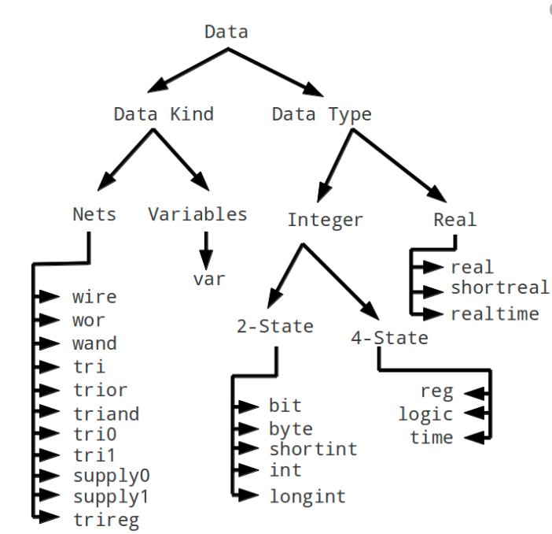
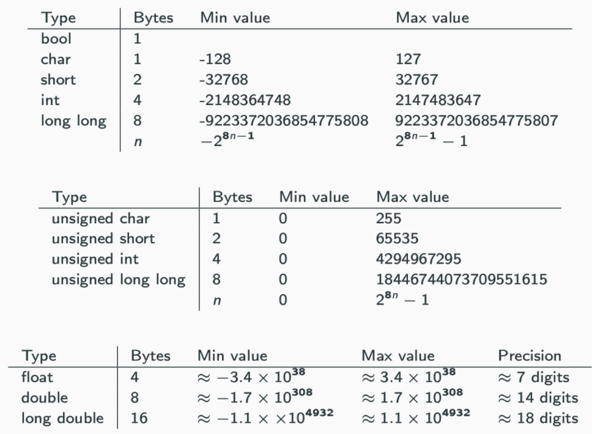

# Variable





* Case sensitive
* uninitialized = empty string

* $@: first target
* $^: all dependency
* $<: first dependency
* $(basename $@): remove extension
* $(ARGS): argument passed in
* $?: names of the changed dependents
* $(@F): equivalent to $(notdir $@). '$@' = dir/foo.o → $(@F) = foo.o
* ${} or $(): referencing variable
* ?=: only sets variables if they have not yet been set
* %.o: wildcard
* x = dude: declare variablruns / ignore set if exists

```sh
# unset(VAR)

# message(STATUS "arg = ${arg}")
WARNING, FATAL_ERROR

# Global
add_custom_command()
find_package ( openCV REQUIRED )  # set _FOUND True, REQUIRED will throw error if not
cmake --help-module-list          # see available files
pkg-config --list-all             # see available files

# Bool           # ON OFF
$ENV{PATH}       # only effects currently running instances

# String         # set(multiLine [-[ [[ -n "$USER"]] ]-] )
string(FIND abdab ab idx)                # idx will be set to 0 (REVERSE will be 3)
string(REGEX MATCHALL "[ad]" m abdab)    # m will be a;d;a
string(REGEX replace "[ad]" "X" m abdab) # m will be XbXXb

# list
Lists                 # set(var a b c) set(var a;b;c;)
message( "$var" )     # print with ; delimeter
```




* [Extract Variable](https://refactoring.guru/extract-variable)
  * [+] Readable
  * [-] Performance when evaludating function

```py
# 1. Extract variable
""" BAD """
def renderBanner(self):
  if (self.platform.toUpperCase().indexOf("MAC") > -1) and \
    (self.browser.toUpperCase().indexOf("IE") > -1) and \
    self.wasInitialized() and (self.resize > 0):

""" GOOD """
def renderBanner(self):
  isMacOs = self.platform.toUpperCase().indexOf("MAC") > -1
  isIE = self.browser.toUpperCase().indexOf("IE") > -1
  wasResized = self.resize > 0

  if isMacOs and isIE and self.wasInitialized() and wasResized:
    # do something
```






* qword: 8 byte




* Meta char: can be used without space
  * (): create subshell
  * ;: two commands in a line

```sh
""" 1. Optional Argument """
ARG1=${1:-foo}
ARG2=${2:-bar}

echo "$ARG1"
echo "$ARG2"
```






* Net: represents a physical connection between structural entities, such as between gates or between modules
  * continuously driven
* unsigned by default

| Logic | Description                                      |
| ----- | ------------------------------------------------ |
| 0     | logic ‘0’ or false condition                     |
| 1     | logic ‘1’ or true condition                      |
| z     | high impedance state (used for tri-state buffer) |
| x     | don’t care or unknown value                      |

> Terms

* Register: Can be assigned values, hold values until next assigneent
  * drive wires

* Flip-Flop: building blocks of sequential designs made of gates
  * synchronous or asynchronous, may be triggered by lavel (latch) or edge (register)
  * Several types: SR, D, JK, T

* Nets
  * wire: 1-bit input and output ports and signals
  * cannot uses always_comb




## Variable Builtin




* CMAKE_BUILD_TYPE: [ex] Debug, RelWithDebInfo




* ros
  * ROS_PACKAGE_PATH




* Special parameter
  * $: Escape to variable
  * $-: option flags enabled in current shell using set
  * $\_: previous last parameter or command if none (mkdir -p foo/bar/zoo && cp myfile $_)
  * $#: Number of arguments supplied to a script
  * $n: arguments with which a script was invoked ($1)
  * $0: name of the shell or / current script
  * $@: All the arguments are individually double quoted
  * $!: Process number of the   last background command (using * or |)

* Special Variable: cannot be overwritten
  * BASH: Expands to the full file name used to invoke this instance of bash
  * UID / EUID: numeric real / effective user id of the current user
  * GROUPS: array containing list of groups of which the current user is a member
  * LANG: setting for all that are not directly set by a LC_* variable
  * LANGUAGE: set LC_MESSAGES to a multi-valued value
  * LC_ALL: Takes precedence over all LC_*, LANG, LANGUAGE
  * LC_NUMERIC: Determines locale category for numeric formatting
  * LC_TIME: determines the locale category used for data and time formatting
  * RANDOM: Each time referenced, expands to a random integer 0 ~ 32767
  * PS4: denotes the value is the prompt printed before the command line

* Substitution
  * process substitution: allows a process’s input or output to be referred to using a filename
    * <(list): input
    * \>(list): output
  * ${ }
    * variable  $AA, ${AA}, ${AA:-5}, ${AA%.*} ..
  * $( ): Modern way of backtick, enable nested ([ex] $( echo "1.3 + 2.5" | bc ))
  * Backtick: ([ex] echo `time`: escape command)




* pg_database
  * database
  * current_catalog
  * information_schema.tables: All table
  * pg_stat_activity: History







* github
  * $VARIABLE_NAME
  * $Env:VARIABLE_NAME
    * variable is read from the shell
  * ${{ env.VARIABLE_NAME }}
    * variable is read from the workflow (can be used for other flow configuration)
    * cannot use environment defined in same step

  * GITHUB_ACTION: The unique identifier of the action
  * GITHUB_ACTOR: [ex] seanhwangg
  * GITHUB_EVENT_PATH: Path to a file that contains event payload
  * GITHUB_REPOSITORY: repository owner and repo name ([ex] seanhwangg/hello_world)
  * GITHUB_RUN_ID: unique number for each run within a repository, which doesn't change when re-run workflow
  * GITHUB_SHA: commit SHA that triggered the workflow ([ex] ffac537e6cbbf934b08745a378932722df287a5d3)
    * SHA12: ${GITHUB_SHA::12}
  * GITHUB_WORKSPACE
  * GITHUB_TOKEN: automatically creates a secret to use in your workflow
    * You can use the GITHUB_TOKEN to authenticate in a workflow run
  * RUNNER_OS: [ex] Linux, Windows, macOS

  * repository: owner and repository name ([ex] seanhwangg/hello_world)
  * repository_owner: repository owner's name ([ex] seanhwangg)

  ```yml
  jobs:
    example-jobs:
      steps:
        - name: PSQL
          run: node client.js
          env:
            POSTGRES_HOST: postgres
            POSTGRES_PORT: 5432
  ```

* gitlab
  * CI_PROJECT_NAME: name of repository
  * CI_COMMIT_REF_NAME: name of branch




* ${env:`PATH`}: get `PATH` from environment
* ${workspaceFolder}: workspace forder path
* ${default}: default value
* ${file}: current opened file (ex: /home/your-username/your-project/folder/file.ext)
* ${fileBasename} - file.ext
* ${fileBasenameNoExtension} - file
* ${fileDirname}: /home/your-username/your-project/folder
* ${relativeFile}: folder/file.ext
* ${workspaceFolderBasename}: your-project
* ${pathSeparator}: / on macOS or linux, \\ on Windows




## Type






* explicit: Prevent implicit conversion when compilers try to resolve the parameters to a function
* sizeof
* typeinfo
* typedef: limited to giving symbolic names to types only
  * interpretation is performed by the compiler
* type_traits
* auto

```cpp
#include <iostream>
#include <typeinfo>
#include <type_traits>

using namespace std;

// 1. show type
template <typename T>
void show_value(T t) {
  if constexpr (is_pointer<T>::value) { // std::is_pointer_t<T>
    cout << "Pointer " << *t << endl;
  } else {
    cout << "Not Pointer " << t << endl;
  }
}

int x = 3;
show_value(x);

int *p = &x;
show_value(p);

float a = 3.5;
int b = static_cast<int>(a);
b = 3;
const volatile int *bp = &b;
cout << "bp " << typeid(bp).name() << endl;  // bp PVKi
int *cp = const_cast<int *>(bp);
*cp = 'A';
cout << "cp " << typeid(cp).name() << endl;  // cp Pi

// 2. determine type from initializer
auto gamma = {1, 2, 3};  // initializer_list<int>
auto delta = vector<int>{1, 2, 3};
cout << (vector<int>)gamma << "\n";
cout << delta << "\n\n";

// 3. declytype
/* Doesn’t preserve const / convert array to pointer */
int i = 4;
auto j = i;         // int j = i;

int arr[10];
auto arr2 = arr;    // int* arr2 = arr;
decltype(arr) arr3; // int arr3[10];

/* typeid */
typedef decltype(1) myint;
cout << typeid(myint).name();     # i
myint a = 5;
cout << a;

/* return_type */
template <typename T, typename U>
auto add(T t, U u) -> decltype(t + u) {
  return t + u;
}

/* doesn't run in runtime */
struct A {
  int f() { return 0; }
};
decltype(A().f()) ret_val;

// 4. Explicit
class String {
public:
  String(int n);         // allocate n bytes to the String object
  String(const char *p); // initializes object with char *p
};

String mystring = 'x';     // It is not possible if string(int n) was explicit

// 5. Typedef
int add(int a, int b) { return a + b; }
typedef int CAL_TYPE;
typedef int (*Padd)(int, int);
typedef int Arrays[10];

typedef struct Books {
  char title[50];
  int book_id;
} Book;

CAL_TYPE a = 10;
Arrays arr = {1, 2, 3};
Padd ptr = add;
cout << a << endl;       // 10
cout << arr[2] << endl;  // 3
cout << ptr(3, 5);       // 8

Books b;
return 0;
```




* declare: specifies a type to an already existing variable, not declaring a new one
* // @ts-nocheck: file level ignore on top of the file
* // @ts-ignore: single line next to line
* Sequelize
  * STRING: VARCHAR(255)
  * STRING(1234): VARCHAR(1234)
  * STRING.BINARY: VARCHAR BINARY
  * TEXT: TEXT
  * TEXT('tiny'): TINYTEXT
  * CITEXT: CITEXT      PostgreSQL and SQLite only
  * INTEGER: INTEGER
  * BIGINT: BIGINT
  * BIGINT(11): BIGINT(11)
  * FLOAT: FLOAT
  * FLOAT(11): FLOAT(11)
  * FLOAT(11,: FLOAT(11,10)
  * REAL: REAL        PostgreSQL only
  * REAL(11): REAL(11)    PostgreSQL only
  * REAL(11,: REAL(11,12) PostgreSQL only
  * DOUBLE: DOUBLE
  * DOUBLE(11): DOUBLE(11)
  * DOUBLE(11,: DOUBLE(11,10)
  * DECIMAL: DECIMAL
  * DECIMAL(10,: DECIMAL(10,2)
  * DATE: DATETIME for mysql / sqlite, TIMESTAMP WITH TIME ZONE for postgres
  * DATE(6): DATETIME(6) for mysql 5.6.4+. Fractional seconds support with up to 6 digits of precision
  * DATEONLY: DATE without time
  * BOOLEAN: TINYINT(1)
  * ENUM('value: An ENUM with allowed values value 1 and value 2')
  * ARRAY(Sequelize.TEXT): Defines an array. PostgreSQL only
  * ARRAY(Sequelize.ENUM): Defines an array of ENUM. PostgreSQL only
  * JSON: JSON column. PostgreSQL, SQLite and MySQL only
  * JSONB: JSONB column. PostgreSQL only
  * BLOB: BLOB (bytea for PostgreSQL)
  * BLOB('tiny'): TINYBLOB (bytea for PostgreSQL. Other options are medium and long)
  * UUID: UUID datatype for PostgreSQL and SQLite, CHAR(36) BINARY for MySQL
    ultValue: Sequelize.UUIDV1 or Sequelize.UUIDV4 to make sequelize generate the ids automatically
  * CIDR: CIDR datatype for PostgreSQL
  * INET: INET datatype for PostgreSQL
  * MACADDR: MACADDR datatype for PostgreSQL
  * RANGE(Sequelize.INTEGER): Defines int4range range. PostgreSQL only
  * RANGE(Sequelize.BIGINT): Defined int8range range. PostgreSQL only
  * RANGE(Sequelize.DATE): Defines tstzrange range. PostgreSQL only
  * RANGE(Sequelize.DATEONLY): Defines daterange range. PostgreSQL only
  * RANGE(Sequelize.DECIMAL): Defines numrange range. PostgreSQL only
  * ARRAY(Sequelize.RANGE(Sequelize.DATE))  Defines array of tstzrange ranges. PostgreSQL only
  * GEOMETRY: Spatial column.  PostgreSQL (with PostGIS), MySQL only
  * GEOMETRY('POINT'): Spatial column with geometry type. PostgreSQL (with PostGIS), MySQL only
  * GEOMETRY('POINT',: Spatial column with geometry type + SRID. PostgreSQL (with PostGIS), MySQL only

* jquery: variable starts with $
  * $('#id');
  * $('.classname')
  * $('element:hidden/visible'): Matches all elements that are hidden / visible
  * $('#container').children(':visible');: Get visible children

```js
// 1. Caveat
/* Identical Types */
class Car {
  drive() { // hit the gas
  }
}
class Golfer {
  drive() { // hit the ball far
  }
}
let w: Car = new Golfer(); // a. No error

/* Extraneous Types */
class Empty {}
function fn(arg: Empty) {
  // do something?
}
fn({ k: 10 }); // No error

/* Implied string */
let helloWorld = "Hello World";

// 2. Define types
/* Interface */
interface User {
  name: string;
  id: number;
}
type WindowStates = "open" | "closed" | "minimized";  // enum like
function wrapInArray(obj: string | string[]) {  // optional types in function
  if (typeof obj === "string") {
    return [obj];
  } else {
    return obj;
  }
}

/* Rest Parameters */
function multiply(n: number, ...m: number[]) {
  return m.map((x) => n * x);
}
const a = multiply(10, 1, 2, 3, 4);

/* Parameter destructuring */
function sum({ a, b, c }: { a: number; b: number; c: number }) {
  console.log(a + b + c);
}

type ABC = { a: number; b: number; c: number };
function sum({ a, b, c }: ABC)
```






* [Documnetation](https://mypy.readthedocs.io/)

* builtin types (int, float, bool, str, bytes, list, set)

* graphene
  * Boolean()
    * name: [ex] 'is_staff': to use camelcase
  * String()
  * DateTime()

* typing
  * Type[CustomClass]: class CustomClass itself (or a subtype)
  * Dict[str, int]
  * List
  * Set

* django
  * BooleanField()
  * IntegerField(): blank is equivalent to 0
  * DecimalField()
  * DateTimeField()

```py
import itertools
import argparse
from tqdm import tqdm
from math import ceil, sqrt
from typing import List, Dict, Set, Optional, Tuple, Union
from collections import defaultdict, Counter

# 1. Simple example
## > 3.6 : how you declare the type of a variable type
age: int = 1

## < Python 3.5 use a type comment instead
age = 1  # type: int

## You don't need to initialize a variable to annotate it
a: int  # Ok (no value at runtime until assigned)

## The latter is useful in conditional branches
child: bool

## > 3.9 : For collections, the type of the collection item is in brackets
x: list[int] = [1]
x: set[int] = {6, 7}

## < 3.8 : the name of the collection type is capitalized, and the type is imported from 'typing'
x: List[int] = [1]
x: Set[int] = {6, 7}

# 2. Class example
class Point:
  def __init__(self, x: int, y: int):
    self.x = x
    self.y = y

  def __repr__(self):
    return f"Point({self.x}, {self.y})"

  def distance_from(self, other: "Point") -> int:
    return ceil(sqrt((self.x - other.x) ** 2 + (self.y - other.y) ** 2))

class Obj:
  def __init__(self, id: int):
    self._id = id

  def __repr__(self):
    return f"{self.__class__.__name__} {self._id}"

  @property
  def id(self):
    return self._id

class Product(Obj):
  def __init__(self, id: int, weight: int):
    super().__init__(id)
    self._weight = weight

  @property
  def weight(self):
    return self._weight

class PositionObj(Obj):
  def __init__(self, id: int, position: Point):
    super().__init__(id)
    self._position = position

  def __repr__(self):
    return f"{self.__class__.__name__} {self._id} at {self._position}"

  @property
  def position(self):
    return self._position

  def distance_from(self, _other: "PositionObj") -> int:
    return self._position.distance_from(_other.position)

  def find_nearest_object(self, _others: List["PositionObj"]) -> Tuple["PositionObj", int]:
    nearest = _others[0]
    distance = self.distance_from(nearest)
    for other in _others[1:]:
      d = self.distance_from(other)
      if d < distance:
        nearest, distance = other, d
    return nearest, distance

class ProductHolder(PositionObj):
  def __init__(self, *args, **kwargs):
    super().__init__(*args, **kwargs)
    self._products: Dict[Product, int] = {}

  @property
  def products(self):
    return self._products

  def add_products(self, products: Dict[Product, int]):
    for product, quantity in products.items():
      if product in self._products:
        self._products[product] += quantity
      else:
        self._products[product] = quantity

  def remove_products(self, products: Dict[Product, int]):
    for product, quantity in products.items():
      self._products[product] -= quantity
      if self._products[product] == 0:
        self._products.pop(product)

  @property
  def product_weight(self):
    return sum(p.weight * q for p, q in self._products.items())

  def remove_all_products(self):
    self._products = {}
```




* doesn’t have data types → used as string in string operation / int in int operation




## Null




* !!: returns true if object is null, undefined, or empty string

```js
// 1. Optional Chaining
let x = foo === null || foo === undefined ? undefined : foo.bar.baz(); /* BAD */
let x = foo?.bar.baz() /* BETTER */

// 2. Ensures boolean
temp != null ? true: false  /* BAD */
!!temp  /* BETTER */
```




```py
# 1. Optional ForeignKey
blank=True, null=True
```




* NULL = NULL: evaluates to NULL ([ex] Given you don't know age of A, B, how do you know if they are the same age?)




## Cast




* static_cast
  * convert pointer / reference from one type to a related type (down / up cast)
  * \<int> // Equivalent to (int)

* const_cast: only works on pointer / reference (same)
  * cast away constness of the object

* reinterpret_cast: reinterpret bits of the object pointed
  * doesn’t check if pointer type and data pointed by pointer is same or not. (down)
  * requires 2 types to be polymorphic (have virtual function)

```cpp
data_type *var_name = reinterpret_cast<data_type *>(pointer_variable);

template<typename T>
void show_binrep(const T& a) {
    const char* beg = reinterpret_cast<const char*>(&a);
    const char* end = beg + sizeof(a);
    while(beg != end)
        cout << bitset<8>(*beg++) << '  ';
    cout << '\n';
}
```




* $unsigned

```sv
// 1. Counter module and test
module counter (input clk, input rstn, output reg[3:0] out);
  always @ (posedge clk) begin // triggered at the rising edge of clk (0->1),
    if (! rstn)
      out <= 0;
    else
      out <= out + 1; // If reset is 1, then the design should be allowed to count up, so increment the counter
  end
endmodule

module tb_counter;
  reg clk;                     // Declare an internal TB variable called clk to drive clock to the design
  reg rstn;                    // Declare an internal TB variable called rstn to drive active low reset to design
  wire [3:0] out;              // Declare a wire to connect to design output

  // Instantiate counter design and connect with Testbench variables
  counter c0 (.clk (clk), .rstn (rstn), .out (out));

 always #5 clk = ~clk; // flip its value every 5ns -> time period = 10ns -> freq = 100 MHz

  initial begin // forms the stimulus of the testbench
    clk <= 0; // Initialize testbench variables to 0 at start of simulation
    rstn <= 0;

    #20   rstn <= 1; // Drive rest of the stimulus, reset is asserted in between
    #80   rstn <= 0;
    #50   rstn <= 1;

    #20 $finish; // Finish the stimulus after 200ns
  end
endmodule
```




## Generic




* Compile time polymorphism
* Compiler creates a new instance of a template function for every data type (Every instance has its own copy of static variable)
* Non-type parameters must be const
* template specialization can be done by template <>

```cpp
// 1. single arg
template<typename Data>
class Node {
  public:
    Data const data;
    Node(const Data & d) : data(d) {}
};

// 2. multi_arg
emplate <typename T>
T summer(T v) {
  return v;
}

template <typename T, typename... Args>
T summer(T first, Args... args) {
  return first + summer(args...);
}

template <typename T>
T *summer(T *v) {
  return v;
}

// 3. data structure prints
template <typename T>
ostream &operator<<(ostream &out, const vector<T> &v) {
  if (!v.empty()) {
    out << '[';
    std::copy(v.begin(), v.end(), ostream_iterator<T>(out, ", "));
    out << "\b\b]";
  }
  return out;
}

template <typename T>
ostream &operator<<(std::ostream &out, const vector<std::vector<T>> &G) {
  out << "[";
  for (int i = 0; i < G.size(); i++) {
    out << G[i];
    if (i != G.size() - 1)
      out << "\n";
  }
  out << "]";
  return out;
}

template <typename A, typename B>
ostream& operator <<(ostream& out, const pair<A, B>& a) {
  out << "(" << a.first << "," << a.second << ")";
  return out;
}

template <typename T, size_t N>
ostream& operator <<(ostream& out, const array<T, N>& a) {
  out << "["; bool first = true;
  for (auto& v : a) { out << (first ? "" : ", "); out << v; first = 0;} out << "]";
  return out;
}

template <typename T>
ostream& operator <<(ostream& out, const vector<T>& a) {
  out << "["; bool first = true;
  for (auto v : a) { out << (first ? "" : ", "); out << v; first = 0;} out << "]";
  return out;
}

template <typename T, class Cmp>
ostream& operator <<(ostream& out, const set<T, Cmp>& a) {
  out << "{"; bool first = true;
  for (auto& v : a) { out << (first ? "" : ", "); out << v; first = 0;} out << "}";
  return out;
}

template <typename U, typename T, class Cmp>
ostream& operator <<(ostream& out, const map<U, T, Cmp>& a) {
  out << "{"; bool first = true;
  for (auto& p : a) { out << (first ? "" : ", "); out << p.first << ":" << p.second; first = 0;} out << "}";
  return out;
}

// 4. Recursive
template <typename T>
T summer(T v) {
  return v;
}

template <typename T, typename... Args>
T summer(T first, Args... args) {
  return first + summer(args...);
}

template <typename T>
T *summer(T *v) {
  return v;
}
template <int N>
struct Factorial {
  static const int result = N * Factorial<N - 1>::result;
};

template <>
struct Factorial<1> {
  static const int result = 1;
};

int main() {
  cout << summer(1, 2, 13) << endl;       // 16
  cout << summer((void *)0x123) << endl;  // 0x123
  cout << Factorial<6>::result << endl;   // 720
  return 0;
}
```




## Pointer




* prefix p, 0 if not defined
* variable that stores an address location → faster when working with array
* provide functions access to large blocks of data

```cpp
#include <iostream>

using namespace std;

// 1. Pointer Basic
int num = 240;
int *p_num = nullptr;                  // can't assign to address of double
cout << "before \t" << p_num << "\n";  // before  0x0
p_num = &num;
cout << "after \t" << p_num << "\n";  // after 0x7ffee6412588

char const *p_char = "ABC";
// char A ABC 0x1097f0f52
// char B BC 0x1097f0f53
// char C C 0x1097f0f54
for (int i = 0; i < 3; i++)
  cout << "char \t" << p_char[i] << "\t" << (p_char + i) << "\t" << (void *)(p_char + i) << "\n\n";

const int a = 1;
const int *p_a = &a;  // pointer to const int type
// (*p_a)++; WRONG
p_a++;

int b = 10;
int *const p_b = &b;  // const pointer to int
// p_b++; WRONG
(*p_b)++;
```




### Smart




> memory

* use smart pointer unique, shared, weak using
  * Shared Pointer: Reference count
  * Unique pointer: automatically freed → cannot copy

```cpp
#include <iostream>
#include <vector>
#include <memory>
#include <vector>

using namespace std;

class A : public enable_shared_from_this<A> {
  int *data;

 public:
  A() {
    data = new int[100];
    cout << "Acquired" << endl;
  }

  ~A() {
    cout << "Release" << endl;
    delete[] data;
  }

  shared_ptr<A> get_shared_ptr() { return shared_from_this(); }  // shared_ptr<A>(this); fail
};

// 1. Shared ptr
vector<shared_ptr<A>> vec;
vec.push_back(shared_ptr<A>(new A()));  // Acquired
vec.push_back(shared_ptr<A>(vec[0]));
vec.push_back(vec[1]->get_shared_ptr());

cout << vec[0].use_count() << "\n";  // 3
vec.erase(vec.begin());
cout << vec[0].use_count() << "\n";  // 2
vec.erase(vec.begin());
cout << vec[0].use_count() << "\n";  // 1
vec.erase(vec.begin());              // Release

// 2. Unique Pointer std::unique_ptr<Entity> entity = std::make_shared<Entity>();
void func_with_unique(Data *ptr) { // unique_ptr<Data>& wrong!
  ptr->some();
}

int main() {
  unique_ptr<Data> pa(new Data());  // Acquired (same as auto pa = make_unique<Data>();)
  cout << "[pa]";                   // [pa]
  pa->some();                       // Pointer

  unique_ptr<Data> pb = move(pa);  // pa is now dangling pointer
  cout << "[pb]";                  // [pb]
  pb->some();                      // Pointer
  func_with_unique(pb.get());      // Pointer
  // Release
}
```




### Pimple

* [+] Binary interface is independent of private fields. changes doesn’t break dependent code
* [+] Compilation time drops because only the implementation file needs to be rebuilt
* [+] Hide certain internal details such as implementation techniques
* [-] increase in memory usage due to more memory allocation critical in embedded software
* [-] maintenance is complex due to additional class in order to use pimpl, additional pointer indirection
* [-] Hidden implementation cannot be inherited, although a class PImpl can

> Term

* Incomplete Type: When implementation of struct, unm, union, class are unknown
* Complete Type: Everything else




> Error

* Variable has incomplete type 'Person'

```cpp
// Wrong: Forward declaration without pointer
#include <stdio.h>

struct Person; // Fix 1. User Forward Implementation: struct Person{};

int main() {
  Person p;    // Fix 2. Pointer: Person* p;
}
```




## Reference




* return value is extended only when accepted as const reference

```cpp
#include <iostream>
using namespace std;

// [WRONG] Do not return reference of local variable → dangling reference
int& function() {
  int a = 2;
  return a;
}

// Reference to function
int function() {
  int a = 5;
  return a;
}

int main() {
  const int& c = function();
}

// reference to function with array
int &func1(int &a) { return a; }
int func2(int b) { return b; }
int main() {
  const int &ref = 3;

  int x = ref;
  int &y = x;
  int &z = y;

  cout << "x, y, z \t" << x << " " << y << " " << z << endl;    // x, y, z  3 3 3
  y = 2;
  cout << "x, y, z \t" << x << " " << y << " " << z << endl;    // x, y, z  2 2 2
  z = 3;
  cout << "x, y, z \t" << x << " " << y << " " << z << "\n\n";  // x, y, z  3 3 3

  int arr[3][2] = {{1, 2}, {3, 4}, {5, 6}};
  int(&ref_arr)[3][2] = arr;
  ref_arr[0][0] = 9;
  cout << arr[0] << " " << ref_arr[0] << "\n";        // 0x7ffee4d4c570  0x7ffee4d4c570
  cout << arr[0][0] << " " << ref_arr[0][0] << "\n";  // 9       9

  int a = 3;
  func1(a) = 4;
  cout << func1(a) << "\t" << &func1(a) << endl;  // 4       0x7ffee4d4c544

  a = func2(2);
  cout << func1(a) << "\t" << &func1(a) << endl;  // 2       0x7ffee4d4c544
}

// reference to function
void main() {
  auto change = [&](int &num, int to) { num = 3; };

  auto change_2 = [&](int &num) { change(num, 2); };
  int a = 1;
  change_2((a));
  cout << a << endl;
}
```




## Number




> size_t

* basic unsigned integer → depends on system
* improve code's portability and efficiency → indexing containers should use

> long

* 0LL for constant
* right shift checks whether the data is signed or not




* automatic cast: [ex] float → double / byte → short → int → long

```java
// 1. int to byte array
public static void bytesFromInt(byte[] array, int offset, int value) {
  array[offset + 0] = (byte) ((value >> 0) & 0xFF);
  array[offset + 1] = (byte) ((value >> 8) & 0xFF);
  array[offset + 2] = (byte) ((value >> 16) & 0xFF);
  array[offset + 3] = (byte) ((value >> 24) & 0xFF);
}

// 2. sizeof
cout << sizeof(bool) << endl;        // 1
cout << typeid(true).name() << endl; // b

cout << sizeof(char) << endl;        // 1
cout << typeid('a').name() << endl;  // c

cout << sizeof(int) << endl;       // 4
cout << typeid(1).name() << endl;  // i

cout << sizeof(float) << endl;       // 4
cout << typeid(1.5f).name() << endl; // f

cout << sizeof(long) << endl;       // 8
cout << typeid(1l).name() << endl;  // l

cout << sizeof(long long) << endl;   // 8
cout << typeid(1ll).name() << endl;  // x

cout << sizeof(double) << endl;      // 8
cout << typeid(1.5).name() << endl;  // d

cout << sizeof(long double) << endl; // 16

bool *p_bool;
cout << sizeof(p_bool) << endl;  // 8
```




> Number

* EPSILON
* MAX_SAFE_INTEGER
* MAX_VALUE
* MIN_SAFE_INTEGER
* MIN_VALUE          // the smallest positive numeric value
* NEGATIVE_INFINITY
* NaN
* POSITIVE_INFINITY
* prototype

* isFinite()
* isInteger()
* isNaN()
* isSafeInteger()
* parseFloat()
* parseInt((radix))
* toString((radix))
* Number((6.688689).toFixed(1));  // 6.7




* float, bool, str, tuple, complex, frozenset, unicode
* change address when operates
* never explicitly destroyed
  * when they become unreachable they may be garbage-collected
* complex: 5 + 3j
* str: "A"
  * int("123"): convert str to int
* isinstance(entry, dict) # check for type
* str(123): convert int to str

> int

* is_integer()
* bin(`num`) -> str: Convert an integer number to a binary string prefixed with 0b

> float

* 1.5, -0.0, float('Inf')
* as_integer_ratio() -> Tuple(int, int): return a pair of integers whose ratio is exactly equal
* fromhex(s)
* hex() -> str




* `N`'`b` `value`: `N` size of bits, `B` base, `value` value ([ex] 27 = decimal)
* Numbers get truncted if more bits are specified ([ex] 4'd1_500 = 12 in decimal)
* Numbers filled with 0 if more less are specified ([ex] 8'b1000 = 8 in binary)
* default is one bit wide
* \_ can appear between withtout affecting values ([ex] 32'd6_23 = 623 in decimal)
* decimal by default ([ex] 3'b000 = for binary, 4'b1100 = 12 in binary)
* reg: 2-bit input and output ports and signals
  * [1:0] a = 2'b01;: number = 1, size = 2 bit
  * [2:0] a = -3'b1;: unsigned number= -1 (in 2's comp), size = 3 bit

* integer: size 32 by default

* logic: internal signals

```v
// 1. Number
4'shf   // 15

// 2. logic
module fulladder(input logic a, b, cin, output logic s, cout);
  logic p, g;
  assign p = a ^ b;
  assign g = a & b;
  assign s = p ^ cin;
  assign cout = g | (p & cin);
endmodule
```




### Char




> Char

* isdigit / isalpha / isalnum(‘1’)
* islower(‘A’)
* scanf("%c", &c);



