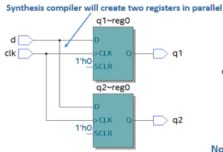
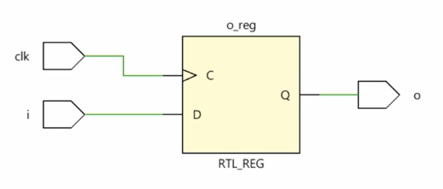
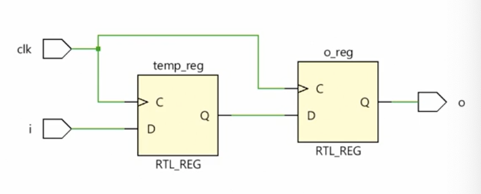
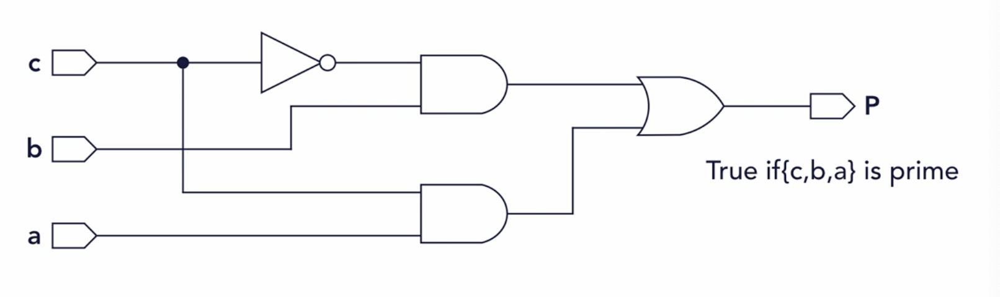
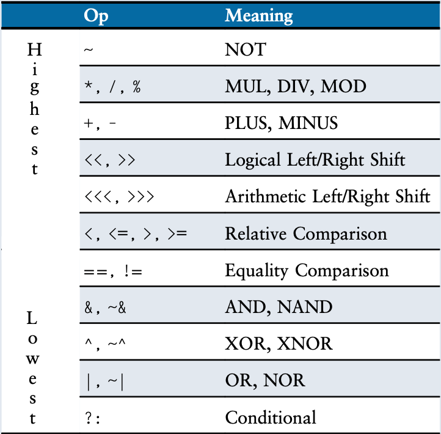
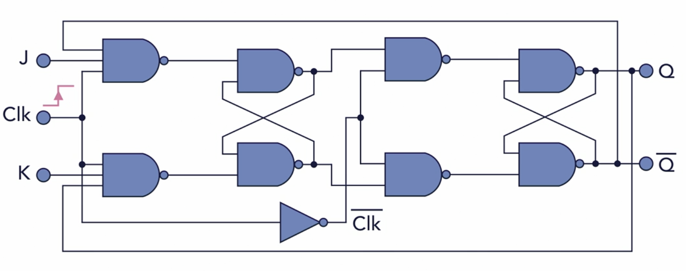

# Verilog

| Verilog                             | Systemverilog                                              |
| ----------------------------------- | ---------------------------------------------------------- |
| hardware description language (HDL) | Combination of HDL and Hardware Verification Language(HVL) |
| hierarchy of modules                | based on classes                                           |
| Supports Structured paradigm        | structured, OOP                                            |

* Standardized as IEEE 1364
  * verilog 95, 2001 (new features), 2005
  * SystemVerilog: superset of Verilog
* free formatiting: spaces can be added freely
* [Install on mac](https://medium.com/macoclock/running-verilog-code-on-linux-mac-3b06ddcccc55)
* iverilog -o hello hello.v
* vvp hello

* begin / end: when if, always block are multiline
* localparam: constants in verilog

* Initial block: is not synthesizable and cannot be converted into a hardware schematic with digital elements

## Assignment

* =: blocking assignment, used in combinational logic
  

* <=: assign using temp, used in sequential logic

* always_comb (assign): continuously evaluating
* always / always_ff: only changes when variable in @, changes
  * always use <=




```v
// 1. synchronous_reset_d-ff.v
module dff_sync_reset (
  input wire data, clk, reset,
  output reg q
);

always_ff @ (posedge clk)
if (~reset)
  q <= 1*b0;
else
  q <= data;
end module

// 2. shift using <=
module shift_reg(input clk, reset, a, output logic d):

logic b, c;
always_ff @(posedge clk)
  if (reset) begin
    b <= 0;
    c <= 0;
    d <= 0;
  end
  else begin
    b <= a;
    c <= b;
    d <= c;
end

end module
```








```v
// Blocking vs non blocking assignment
module assignments(input i, input clk, output reg o);
  reg temp;
  always @ (posedge clk) begin
    temp = i; // <=
    o = temp; // <=
  end
end module
```



```v
// Gate Implementation
module is_prime_gates(input c, b, a output P);
  wire w1, w2, w3;
  not(w1, c);
  and(w2, w1, b);
  and(w3, a, c);
  or(P, w2, w3);
endmodule

// Boolean Implemenation
module is_prime_gates(input c, b, a output P);
  assign P = (c & a) | (~c & b);
endmodule

// Procedural Implemenation
module is_prime_gates(input c, b, a output P);
  wire [2:0] cba;
  always @ (cba)
    if (cba == 3'd2 || cba == 3'd3 || cba == 3'd5 || cba == 3'd7)
      P = 1'b1;
    else:
      P = 1'b0;
endmodule
```

```v
// assign
// smaller -> larger
logic signed[3:0] a = 1010; // -6 signed-two's comp (-8 ~ 7)
logic signed[7:0] b;
assign b = a;               // 0'b11110101 if both signed we sign extend

logic [3:0] c = 1010;       // 10 unsigned by default (0 ~ 15)
logic [7:0] d;
assign d = c;               // b = 8'b00001010; zero extend 4 to 8

// truncate
logic [3:0] e;
assign e = b;               // e = 4'b1010 {{4{a[3]}},a[3:0]};

assign d = a;               // 0000_1010 = 10 (Not recommended)
```




## module




* declare an instance and its port connections
* `module(a, b)`: port connection by parameters
* `module(.a(a), .b(b))`: arguments (orders can be changed)


```v
// 2:1 mux
module mux_assign { input wire din_0, ind_1, sel, output wire mux_out }
assign mux_out = (sel)? din_1: din_0;
endmodule

// 4:1 mux
module mux4(input logic [3:0] d0, d1, d2, d3,
            input logic [1:0] s,
            output logic [3:0] y);
assign y=s[1] ? (s[0] ? d3 : d2) : (s[0] ? d1 : d0);
endmodule

// half_adder
module half_adder(input A, input B, input S, output Cout);
  and(Cout, A, B);
  xor(S, A, B);
endmodule

// full_adder
module full_adder(input A, input B, input Cin, output S, output Cout);
  wire P, G, H;
  half_adder ha1(A, B, P, G);   // by parameters
  half_adder ha2(.A(P), .B(Cin), .S(S), .Cout(H)); // by arguments

  or (Cout, G, H);
endmodule
```




## Operation



> arithmetic

| symbol | description                            |
| ------ | -------------------------------------- |
| +      | add                                    |
| -      | subtract                               |
| *      | multiply                               |
| /      | divide may not synthesize              |
| %      | modulus (remainder) may not synthesize |
| **     | power may not synthesize               |
| &&     | and                                    |
| \|\|   | or                                     |
| {}     | concatenate binary or replicate        |

> bitwise

| symbol | description      |
| ------ | ---------------- |
| ~      | bitwise negation |
| &      | bitwise and      |




```v
module ALU(input [3:0] a, input [3:0] b, input [1:0] op, output reg [7:0] result);
  always @ (*)
    case (op)
      0: result = a + b;
      1: result = a * b;
      2: result = a % b;
      3: result = a & b;
    endcase
endmodule

// Test
module ALU_TB();
  reg [3:0] a;
  reg [3:0] b;
  reg [1:0] op;
  wire [7:0] res;
  ALU DUT_ALU(a, b, op, res);

  initial begin
    $monitor("\n %d %c %d = %d \n", a, (op[1]? (op[0]? "&": "%"): (op[0]? "*": "+")) b, res);
    a = 2; b = 3; op = 0; #10;
    a = 3; b = 4; #10;
  end
```




## Sensitivity

* sensitivity list is an expression that defines when the always block executed

* posedge: trigger a flop at positive (rising) edge of clock
* negedge: triggers on the negative (falling) edge

* assign: doesn't need posedge, negedge, always evaluated
  * only works for one line

* always @ (`event`): indicates that the block will be triggered in `event`
  * (`x`) [statements]: execute always block whenever value of `x` change
  * (posedge clk or negedge rstn): triggered at the positive edge of clk or negative edge of rstn




```v
// 1. Time
always clk = ~clk;     // results in infinite loop
always #10 clk = ~clk; // clock inversion is done after every 10-time units


// 2. Clock divider
module clock_divider(input clk_in, output reg clk_out, input reset, input [31:0] ratio);
  reg [31:0] counter;

  always @ (posedge clk_in, negedge reset)
    if (reset == 0) begin
      counter <= 32 * d0;
      clk_out = 0;
    end
    else if (counter == ratio - 1) begin
      $display("ratio-1 = counter:%d", counter);
      clk_out <= 0;
      counter <= 32'd0;
    end
    elif if (counter == ratio / 2 = 1) begin
      $display("ratio/2 - 1 = counter:%d", counter);
      clk_out <= 1;
      counter <= counter+1;
    end
    else
      counter <= counter+1;

module clock_divider_TB();
  reg clk_fast, reset;
  wire clk_slow;

  always #5 clk_fast = ~clk_fast;

  clock_divider DUT_divider(clk_fast, clk_slow, reset, 32'd100_000);

  initial begin
    clk_fast=0; reset=0; #999_996;
    reset=1;
    #10_000_000;
    $stop;
  end
```






```v
module JK(input J, input K, input clk, output reg Q, output QN);
  assign QN = ~Q;
  always @ (negedge clk)
    case ({J, K})
      2'b00 : Q <= Q;
      2'b01 : Q <= 0;
      2'b10 : Q <= 1;
      2'b11 : Q <= QN;
    endcase
endmodule
```




## Wires

* Make connetions between elements
* Implement nets (or nodes) driven by signal
* Many not always have a value

* b: binary
* o: octal
* d: decimal
* h: hexadecimal

> Gates

* buffer_type[instance_name](output, input, input, ...);

* nand(`x`, `a`, `b`): compute `a` nand `b` and stores in `x`
* and(`x`, `a`, `b`): compute `a` and `b` and stores in `x`
* or(`x`, `a`, `b`): compute `a` or `b` and stores in `x`
* xor(`x`, `a`, `b`): compute `a` xor `b` and stores in `x`

| symbol | description                           |
| ------ | ------------------------------------- |
| &      | and                                   |
| ^      | xor                                   |
| ~&     | or                                    |
| &~     | nand                                  |
| >>     | right shift                           |
| <<     | left shift                            |
| >>>    | right shift with MSB shifted to right |
| <<<    | same as <<                            |




```v
// Gate Level half adder
and(Cout, a, b);
xor(S, a, b);

// RTL half adder
assign {Cout, S} = a + b;
```




> Buffers

* buffer_type[instance_name](output, ..., output, input);

* buf()
* not(`x`, `a`): negate `a` and stores in `x`

> Tristate

* bufif1 [instance_name](output, input, enable)

## Data


* Net: represents a physical connection between structural entities, such as between gates or between modules
  * continuously driven
* unsigned by default

| Logic | Description                                      |
| ----- | ------------------------------------------------ |
| 0     | logic ‘0’ or false condition                     |
| 1     | logic ‘1’ or true condition                      |
| z     | high impedance state (used for tri-state buffer) |
| x     | don’t care or unknown value                      |

> Terms

* Register
  * Can be assigned values, hold values until next assigneent
  * drive wires

* Flip-Flop
  * building blocks of sequential designs made of gates
  * synchronous or asynchronous, may be triggered by lavel (latch) or edge (register)
  * Several types: SR, D, JK, T

## nets

* wire: 1-bit input and output ports and signals
* cannot uses always_comb
