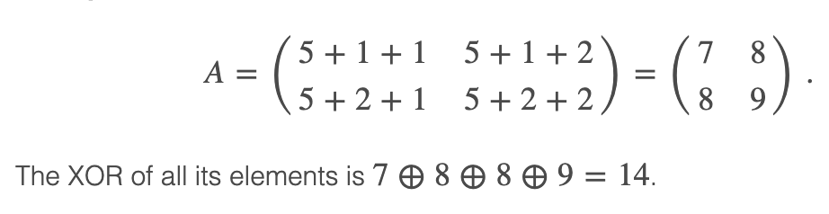




> Question



```txt
Input:
2
2 2 5
2 3 7

Output:
14
5
```




```py
from functools import reduce

def solution(a, b, c):
  xors = []
  count = 0
  for i in range(2, a + b + 1):
    if a >= i - 1 and b >= i - 1:
      count += 1
    elif a < i - 1 and b < i - 1:
      count -= 1
    if count % 2 == 1:
      xors.append(c + i)
  return reduce(lambda x, y: x ^ y, xors)

for _ in range(int(input())):
  a, b, c = map(int, input().split())
  print(solution(a, b, c))
```



