# Artificial Intelligence

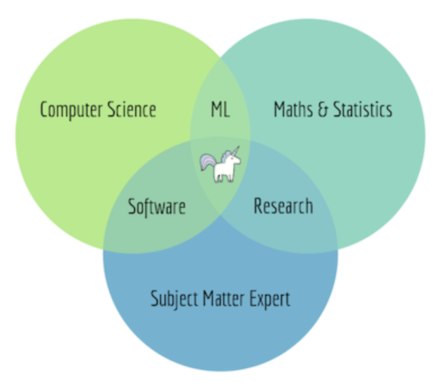

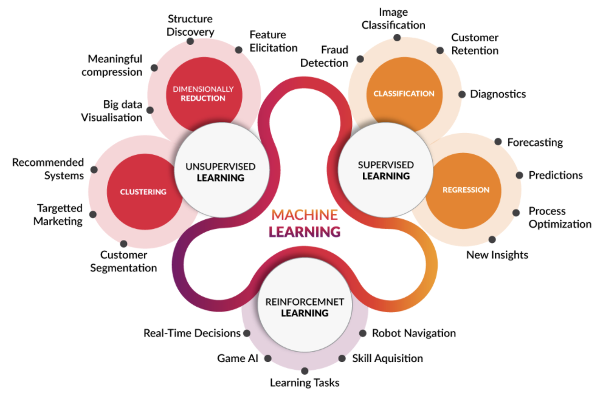

* Arthur Samuel 1959: field of study that gives computers the ability to learn without being explicitly programmed
* E. Tom mitchell, 1998
  * A computer program is said to learn from experience E with respect to some task T and some performance measure P
* UW, 2012: if its performance on T, as measured by P, improves with experience
  * Algorithms that can figure out how to perform important tasks by generalizing from examples
* NVIDIA, 2016: Practice of using algorithms to parse data
  * learn from it, and then make a determination or prediction about something in the world

> Terms

| Term | Meaning                         |
| ---- | ------------------------------- |
| a    | activation value                |
| J    | cost function                   |
| L    | Number of layers in the network |

* Augmentation: scale, translation, rotation

* Bias: difference between average prediction of our model and correct value which we are trying to predict

* End to End
  * [+] Less hand-designing of components needed
  * [-] Face recognition → large data for subproblems (face detection, face classification)
  * [-] Not enough data → excludes potential useful hand-designed components

* Training
  * Static: You can verify the model before applying it in production
  * Dynamic: model stays up to date as new data arrives

* Unsupervised Learning: unlabeled data that algorithm tries to make sense of by extracting features and patterns
  * [ex] market segmentation, organize computing cluster, social network analysis, astronomical data analysis
  * [+] spectral classes do not always correspond to informational classes

* Variance: Model with high variance pays a lot of attention to training data and does not generalize on data

## Engineering

> Terms

* Feature Selection

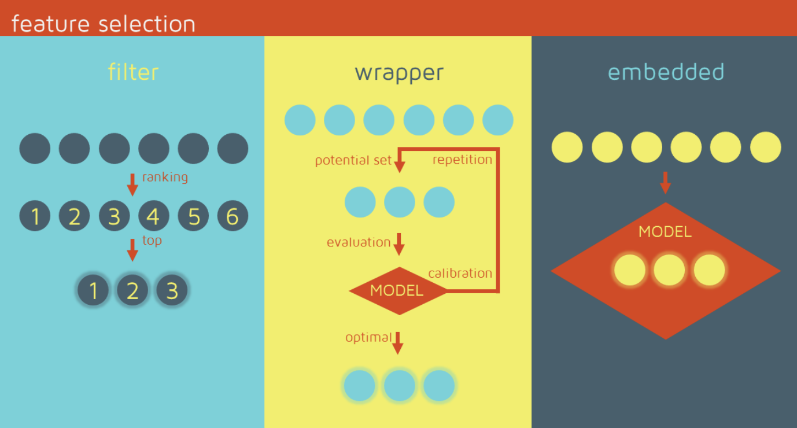

* Negative Sampling
  * train models that generally have several order of magnitudes more negative than positive one

* Feature
  * Some set value -1, NaN: linear, net model can suffer
  * Mean, approximate: weather data

  * make range
    * [ex] power , log transformation

  * Finding: length of text field
    * percentage of characters that are punctuation in the text
    * percentage of character that are capitalize

  * Nominal: One hot encoding → sparse matrix

  * Ordinal: Special categorical feature where sorted in some meaningful order
    * Education (undergraduate, graduate), Grade (A, B, C)
    * Label (sorted) | Frequency | Rank encoding

  * Coordinate: distance from Interesting places from data
    * center of clusters, Aggregated statistics

  * Datetime
    * periodicity | time since row-independent | dependent event | difference between dates

  * Numerical: Non tree-based models depend on scaling
    * Feature generation: fraction part in money (human perception), interval (human vs bot)
    * winsorization to remove outlier

* Offline Learning
  * [+] Make all possible predictions in a batch, using a mapreduce or similar
  * [+] Write to a table, then feed these to a cache|lookup table
  * [-] long tail → can only predict things we know tail
  * [-] update latency likely measured in hours or days

* Online Learning
  * Predict on demand, using a server
  * [+] can predict any new item as it comes
  * [-] monitoring needs are more intensive

* Dynamic Sampling
  * Minlong Lin, 2013

  $$
  P\left(X^{!}\right)=1.0-P\left(\frac{X}{\text { Sum of Candidates }}^{0.7}\right)
  $$





* Large data processing API designed for scalability and fault-tolerance
  * Retry on another node: OK for a map because no dependencies, for reduce because map outputs are on disk
  * If same task fails repeatedly, fail job or ignore that input block
* Pluggable user code runs in generic framwork
* Dependent tasks, interactive analysis, Native support for Java only
* High-latency, allow parallel & distributed processing using disk storage
  * Launch second copy of task if task is slow then kill when finishes first
* Map-Reduce consists of three main steps: Mapping, Shuffling and Reducing
* Map: Apply same operation to each member of collection
  * minimize network usage by saving outputs to local disk before serving them to reducers
  * allows recovery if a reducer crashses, hvaing more reducers than nodes
* Reduce: collecting things that have same 'key'
* [+] Hides complexities of parallel programming  → search engine page ranking and topic mapping
* [-] frequently changing data → slow, as it reads entire input data
* [ex] Index construction G search, Article clustering for G News, Machine translation, FB Spam detection
* [ex] Log processing, web search indexing, ad-hoc queries

* Design pattern
  * wc, cat \*, grep, sort, unique, cat > file, input, map, shuffle, reduce, output

```py
def mapper(line):
  for word in line.split():
    output(word, 1)

def reducer(key, values):
  output(key, sum(values))
```




* Driver Program creates Resilient distributed datasets (RDDs)
* Low-latency for small micro-batch size
* Batch and stream processing using disk or memory storage
* SparkSQL, Spark streaming, MLlib, GraphX

* Commands
  * lazy evaluation → transformations are not executed until the action stage
  * Narrow: processing logic depends only on data, residing in the partition → no data shuffling necessary
  * Wide: transformation that requires data shuffling across node partitions

* Function
  * collect(): copy all elements to the driver
  * take(n): copy first n elements
  * reduce(func): aggregate elements with func
  * saveAsTextFile(filename): Save to local file or HDFS

* Narrow Transformation
  * coalesce(): reduce number of partitions
  * filter(func): keep only elements where function is true
  * flatMap(func): map then aggregate
  * map(func): apply function to each element of RDD

* Wide Transformation
  * groupbykey
  * reducebykey

* MLlib

* GraphX
  * Uses property graph model → both nodes and edges can have attributes and values
  * triplet view → logically joins vortex and edge properties

```py
import pyspark
from operator import add
from pyspark.mllib.stat import Statistics

# 1. Reduce
sc = pyspark.SparkContext.getOrCreate()
data = sc.parallelize (["scala", "hadoop", "spark", "akka", "spark vs hadoop", "pyspark", "pyspark and spark"])
print(data.count())
print("data.collect()")
filtered = data.filter(lambda x: 'spark' in x).collect()
print(filtered)
print(data.reduce(add))
file = sc.textFile('00_keywords.py')
print(f"{file.count()}")
print(f"{file.take(3)}")
print(f"{file.filter(lambda s: 'print' in s.lower()).count()}")
spark = pyspark.sql.SparkSession(sc)
files = sc.wholeTextFiles('.')
pprint(f"{files.count()}")
df = files.toDF(['name', 'data'])
print(f"{df.select('name').toPandas().head()}")
spark.read.csv('competition_vision/mnist/data/mnist_train.csv').toPandas()
spark.read.load('competition_vision/mnist/data/mnist_train.csv').head()

# 2. MLlib
dataMatrix = sc.parallelize([[1,2,3],[4,5,6], [7,8,9],[10, 11, 12]])
summary = Statistics.colStats(dataMatrix)

from pyspark.mllib.clustering import KMeans, KMeansModel
import numpy as np
data = sc.textFile("data.txt")
parsedData = data.map(lambda line: np.array([float(x) for x in line.split(' ')]))
clusters = Kmeans.train(parsedData, k=3)
```




## Feature

### Loss Function

* used to optimize model, will get minimized by the optimizer

> Hinge Loss

* Given (xi, yi), where xi is image and yi is label s=f(xi, W)

$$ L_{i}=\sum_{j \neq y_{i}} \max \left(0, s_{j}-s_{y_{i}}+1\right) $$

### PCA

* Principal component analysis

| Notation                          | Meaning             |
| --------------------------------- | ------------------- |
| $$x_{i}$$                         | Original Point      |
| $$y_{i}=\varphi_{i} \cdot x_{i}$$ | Rotated Point       |
| $$\varphi$$                       | Rotation            |
| $$\varphi_{i}^{T} \varphi_{j}$$   | 1 iff i = j, else 0 |

* Discard K+1 ~ M dimension
  $$x_{i} \simeq \sum_{j=1}^{K} ​φ_{j} y_{j}+\sum_{j=K+1}^{M} φi_{j} b_{j}$$

* MSE of lost information
  $$min_{φ, b} \frac{1}{N} ∑_{y}\|∑_{j=1}^{K} φ_{j} y_{j}+∑_{j=K+1}^{M} φ_{j} b_{j}-∑_{j=1}^{M} φ_{j} y_{j}\|_{2}^{2}$$

* Simplify
  $$min_{φ, b} \frac{1}{N} \sum_{y}\|\sum_{j=k+1}^{M} φ_{j}(y_{j}-b_{j})\|_{2}^{2}$$ |

* Expand in terms of X
  $$min_{φ} \frac{1}{N} \sum_{j=K+1}^{M} φ_{j}(X-\bar{X})(X-\bar{X})^{T} φ_{j}^{T}$$

* Lagrange multiplier
  $$min_{φ} \frac{1}{N} \sum_{j=K+1}^{M} φ_{j} \operatorname{Cov}(X) φ_{j}^{T}-λ_{j}\left(φ_{j} φ_{j}^{T}-1\right)$$

* discovers latent feature
* Ranked in order of their explained variance
* first principal component (PC1) explains the most variance in your dataset

### SVD

* Singular Value Decomposition

$$A=U \Sigma V^{T}$$
$$A^{T} A=\left(V \Sigma^{T} U^{T}\right) U \Sigma V^{T}=V\left(\Sigma^{T} \Sigma\right) V^{T}$$

| Term       | Equation                                                  |
| ---------- | --------------------------------------------------------- |
| $$U$$      | m * m orthonormal matrix                                  |
| $$\Sigma$$ | m * n diagonal matrix                                     |
| $$\sigma$$ | singular values of A $$\gamma_1 >= \gamma_2 >= ... >= 0$$ |
| $$V^{T}$$  | an n × n orthonormal matrix                               |

* Any matrix A (m × n) can be written as the product of three matrices

> t-SNE

* a nonlinear dimensionality reduction technique
* for embedding high-dimensional data for visualization in a low-dimensional space of two or three dimensions

### UV Decomposition

* PCA, SVD not defined for partially observed matrices , doesn't work for huge matrix ⇒ UV
* Used in large sparse matrix where element can be empty (not 0)

## Classification

* supervised learning / categorical
* Output variable in the regression is numerical|continuous
* Useful for sparse high-dimensional data
* Split space into 2 subspaces
* Not work for non-linear transformations of parameters (θ0 + θ12 · X)
  * use Neural network instead

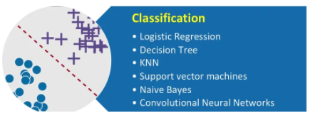

> Terms

* Confusion matrix
  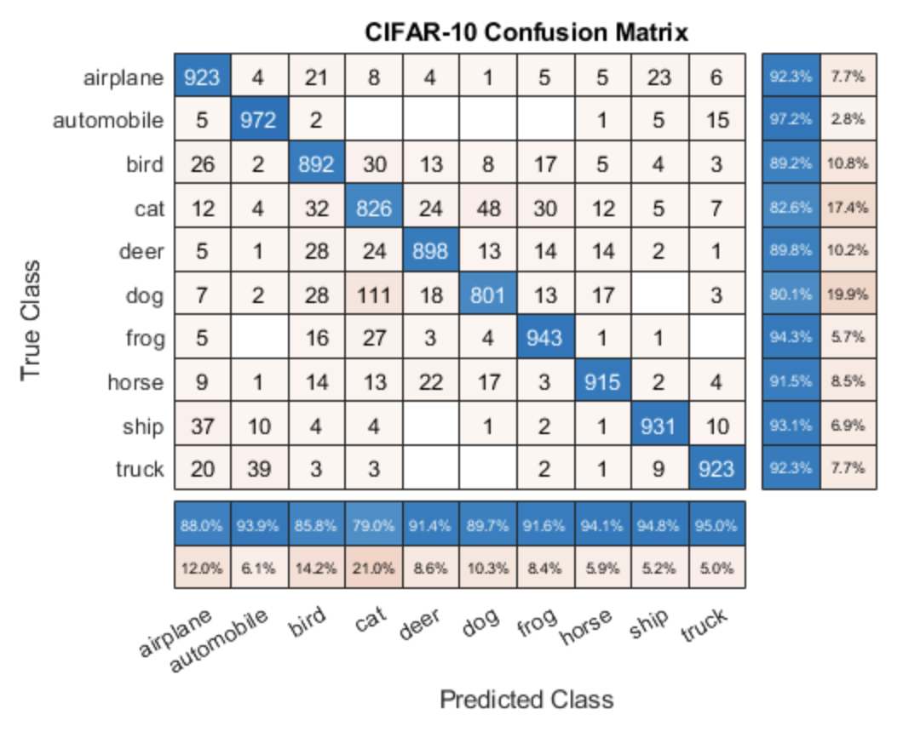

* True Positive
  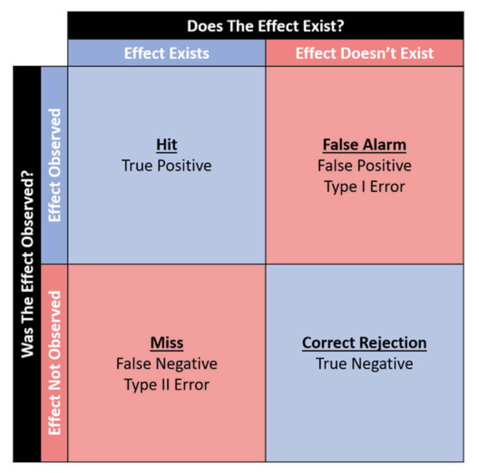

| Equation                            | Meaning                                                                |
| ----------------------------------- | ---------------------------------------------------------------------- |
| $$\frac{T P+T N}{T P+F P+T N+F N}$$ | Accuracy                                                               |
| $$\frac{1}{2}(FPR + FNR)$$          | Balanced Error rate                                                    |
| $$\frac{T P}{T P+F N}$$             | True Positive Rate (Sensitivity, True positive rate, Recall, Hit rate) |
| $$\frac{TN}{FN+FP}$$                | True Negative Weight (Specificity, Selectivity)                        |
| $$\frac{FP}{FP+TN}$$                | False positive rate                                                    |
| $$\frac{FN}{FN+TP}$$                | False negative rate (miss rate)                                        |
| $$\frac{T P}{T P+F P}$$             | Precision                                                              |




```py
TP, FP, TN, FN = [0 for i in range(202)], [0 for i in range(202)], [0 for i in range(202)], [0 for i in range(202)]
classes = []

for p, l in zip(preds, labels):
  if p == l:
    TP[pred] += 1
    for i in range (len(TP)):
      TN[i] += 1
    TN[pred] -= 1
  else:
    FP[pred] += 1
    FN[label] += 1
    for i in range (len(TN)):
      TN[i] += 1
    TN[pred] -= 1
    TN[label] -= 1

for tp, fp, tn, fn in zip(TP, FP, TN, FN):
  accuracy = (tp + tn) / (tp + fp + tn + fn)
  precision if fp + tp == 0 else tp / (fp + tp)
  recall = 0 if tp + fn == 0 else tp / (tp + fn)
  bcr = (precision + recall) / 2
  classes.append({"Class": i, "Precision": precision, "Accuracy": accuracy, "Recall": recall, "BCR": bcr})
```




### Classification Metric

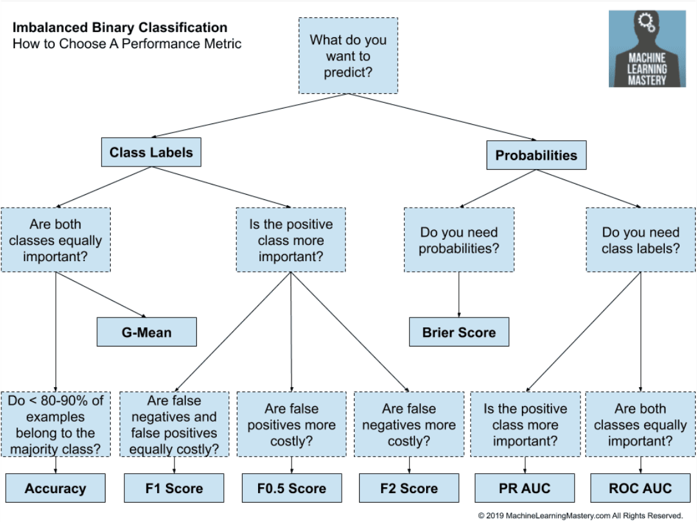

* AP (Area under precision-recall curve)

* F1: gives a larger weight to lower numbers
  * macro-F1 arithmetic mean of our per-class F1-scores
  * weighted-F1, weight each class by the number of samples from that class
  * micro-averaged F1, micro-F1 = micro-precision = micro-recall = accuracy
  $$
  2 \cdot \frac{\text { Prec } \cdot \text { recall }}{\text { Prec }+\text { recall }}=\frac{2 T P}{2 T P+F P+F N}
  $$

* Fb
  * Low beta: precision is more important
  * High beta: recall is more important
  $$
  (1+\beta^{2}) \cdot \frac{\text { prec } \cdot \text { recall }}{\beta^{2} \cdot \text { prec }+\text { recall }}
  $$

* Cosine Similarity
  $$ \frac{A \cdot B}{\|A\|\|B\|} $$

* Cross Entropy
  * used for mutually exclusive classes (male vs female, grayscale vs color)
  * probability distribution of the event over k different events
  $$
  g(z)_{i}=\frac{e^{z_{i}}}{\sum_{j=1}^{K} e^{z_{j}}}
  $$
  $$
  \begin{array}{ll}
  J(W)=-(y \log (\hat{y})+(1-y) \log (1-\hat{y})) & \text { binary } \\
  J(W)=-\frac{1}{N} \sum_{n=1}^{N} y_{n} \log \hat{y}_{n}+(1-y_{n}) \log (1-\hat{y}_{n}) & \text { multi class }
  \end{array}
  $$

* Softmax

* Jaccard
  * [-] Cannot use if the input is binary (ex. Recsys thumbs up vs thumbs down)
  $$
  J \operatorname{accard}\left(U_{i}, U_{j}\right)=\frac{\left|U_{i} \cap U_{j}\right|}{\left|U_{i} \cup U_{j}\right|}
  $$

* Pearson Correlation
  * Subtract by normalized value → Useful for numerical rating
  $$
  \frac{\sum_{j}(r_{i j}-\bar{r}_{i})(r_{k j}-\bar{r}_{k})}{\sqrt{\sum_{j}(r_{i j}-\bar{r}_{i})^{2} \sum_{j}\left(r_{k j}-\bar{r}_{k}\right)^{2}}}
  $$

* Recall (True Positive Rate)
  $$ TPTP + FN $$

* Cosine: Useful for positive | negative feedback
  * independent of vector length → commonly used measure for high-dimensional spaces

* Euclidean: Favor small sets
  $$ \left|U_{i} \backslash U_{j}\right|+\left|U_{i} \backslash U_{j}\right|=\left\|R_{i}-R_{j}\right\| $$




* spatial.distance.cosine(outputs[i], outputs[j]): Cosine similarity
* signal.convolve(I, filter, mode='same'): convolve

```py
import numpy as np
import gzip
import random
import requests
from collections import defaultdict
from scipy.spatial import distance

# 1. Softmax
def softmax(x):
  """ Args    : input value [N, dim]
      Returns : softmax [N, dim] """
  m = np.amax(x, axis=(0, 1))
  ret = np.exp(x - m) / np.sum(np.exp(x - m), axis=1, keepdims=True)
  return ret

# 2. Jaccard
"""
{'marketplace': 'US',
 'customer_id': '45610553',
 'review_id': 'RMDCHWD0Y5OZ9',
 'product_id': 'B00HH62VB6',
 'product_parent': '618218723',
 'product_title': 'AGPtek® 10 Isolated Output 9V 12V 18V Guitar Pedal Board Power Supply Effect Pedals with \
   Isolated Short Cricuit / Overcurrent Protection',
 'product_category': 'Musical Instruments',
 'star_rating': 3,
 'helpful_votes': 0,
 'total_votes': 1,
 'vine': 'N',
 'verified_purchase': 'N',
 'review_headline': 'Three Stars',
 'review_body': 'Works very good, but induces ALOT of noise.',
 'review_date': '2015-08-31'}
"""
def jaccard(s1, s2):
  numer = len(s1 & s2)
  denom = len(s1 | s2)
  return numer / denom

def most_similar(i):
  similarities = []
  users = item2user[i]

  candidate_items = set()
  for u in users:
    candidate_items |= user2item[u]

  for i2 in candidate_items:
    if i == i2: continue
    sim = jaccard(users, item2user[i2])
    similarities.append((sim, i2))
  similarities.sort(reverse=True)
  return similarities[:10]

user2item, item2user = defaultdict(set), defaultdict(set)

item_name = {}
for d in data:
  u, i = d['customer_id'], d['product_id']
  item2user[i].add(u)
  user2item[u].add(i)
  item_name[i] = d['product_title']

display(data[2])
for sim, iid in most_similar(data[2]['product_id']):
  print(f"{item_name[iid][:55]:<60} has {sim:.3f} most similar item")

# 3. Cosine similarity
a = np.array([[0, 0, 0]])
b = np.array([[1, 1, 1], [1, 1, 0], [1, 0, 0]])

distance.cdist(a, b, 'euclidean')  # [[1.73205081 1.41421356 1.]]
np.argmin(distance.cdist(a, b, 'euclidean')[0])  # 2th
distance.pdist(b, 'euclidean')  # [1. 1.41421356 1.]
```




### Multiple

* Triplet Loss

| Notation     | Meaning            |
| ------------ | ------------------ |
| A            | Anchor             |
| P, N         | Positive, Negative |
| $$ \alpha $$ | Margin             |

$$ L(A, P, N)=\max \left(\|f(A)-f(P)\|^{2}-\|f(A)-f(N)\|^{2}+\alpha, 0\right) $$
$$ \frac{\|f(A)-f(p)\|^{2}}{d(A, P)}-\frac{\|f(A)-f(N)\|^{2}}{d(A, N)}+\alpha \leq 0 $$

### Tree Model

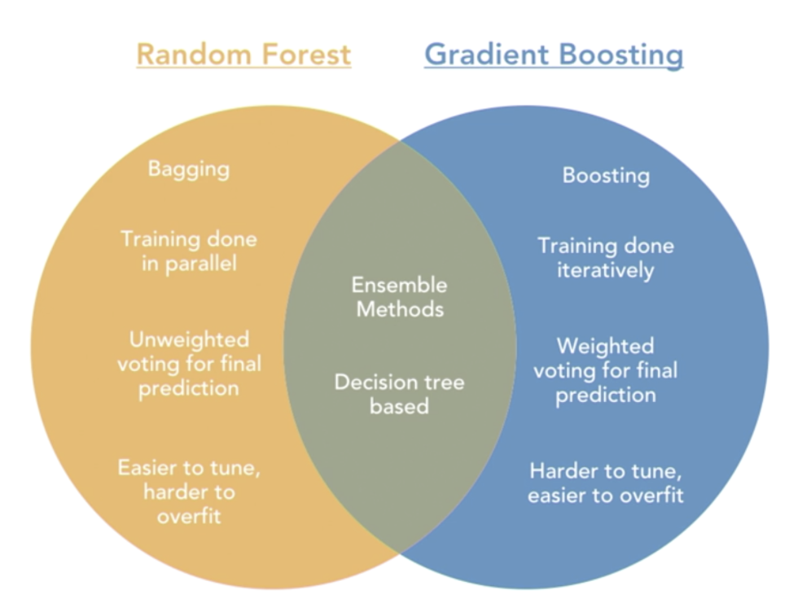

* Useful for tabular data
* avoid overfitting in two ways: to add a stopping criteria, or to use tree pruning

### Random Forest

* each decision tree gets a random sample | columns of the training data to be sent to each tree
  * [+] does not increase generalization error when more trees are added to the model
  * [-] don’t train well on smaller datasets, don't handle large numbers of irrelevant features
  * [-] bad interpretability
  * [-] models requires O(NK) memory storage, (N - # of base, K - # of trees)

## Regression

* Discrete
  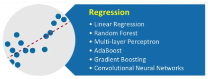

* Logistic regression: based on statistical approaches
  * [+] Dependent variables does not need to be normally distributed, Effective interpretation of results
  * [-] Requires more data to achieve stability, effective mostly on linearly separable

| Term           | Value                              | Meaning                                       |
| -------------- | ---------------------------------- | --------------------------------------------- |
| odds           | $$\frac{p}{1-p}$$                  |                                               |
| logit          | $$\ln \left(\frac{p}{1-p}\right)$$ |                                               |
| $$logit^{-1}$$ | $$\frac{1}{1+e^{-x}}$$             | probability of being in the event occur group |

> Question

* Logistic regression
  $$ S(x)=\frac{1}{1+e^{-x}} $$

  * Likelihood
    $$ L_{θ}(y \mid X)=\prod_{y_{i}=1} p_{θ}(y_{i} \mid X_{i}) \prod_{y_{i}=0}(1-p_{θ}(y_{i} \mid X_{i})) $$
  * Log Likelihood
    $$ \log (L_{θ}(y \mid X))=∑_{y_{i}=1} \log σ(x_{i} \cdot θ)+∑_{y_{i}=0} \log (1-σ(x_{i} \cdot θ)) $$
    $$ ∑_{y_{i}}-\log (1+e^{-x_{i} \cdot θ})+∑_{y_{i}=0}-x_{i} \cdot θ-λ\|θ\|_{2}^{2} $$
  * Derivative of log likelihood
    $$ \frac{\delta l}{\delta θ_{k}}=∑_{i} X_{i k}(1-σ(X_{i} \cdot θ))+∑_{y_{i}=0}-X_{i k}-2 λ θ_{k} $$

### Regression Metric

* Mean absolute error
  $$\frac{\sum_{i=1}^{n}|y_{i}-x_{i}|}{n}$$

* Mean biased error
  $$\frac{\sum_{i=1}^{n} y_{i}-x_{i}}{n}$$

* Mean squared error: Based on the assumption that error is normally distributed
  * If we predict mean value, that is variance
  * coefficient of determination

| Equation                        | Meaning                                          |
| ------------------------------- | ------------------------------------------------ |
| $$\frac{M S E(f)}{V A R(y)}$$   | Fraction of Variance (1 means perfect predictor) |
| $$1-\frac{M S E(f)}{V A R(y)}$$ | Coefficient of determination                     |

* RMSE (Root Means Sequared Error)
  * more useful when large errors are particularly undesirable
  * expects that the all sample data is measured exactly, or observed without error
  * Metric used for netflix prize
  $$ \sqrt{\frac{\sum_{i=1}^{n}\left(y_{i}-\hat{y}_{i}\right)^{2}}{n}} $$

* Total Least Square
  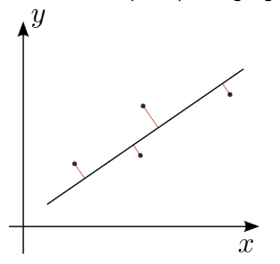
  $$ \frac{1}{2 n} \sum_{x}\|y(x)-\hat{y}(x)\|^{2} $$

### Linear

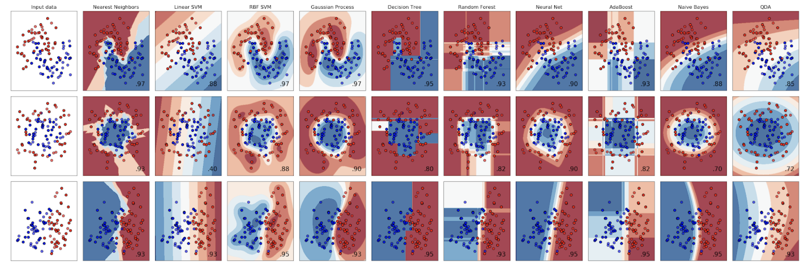

* SVM: based on geometrical properties of the data
  * [+] Risk overfitting is less in SVM, while Logistic regression is vulnerable to overfitting
  * Kernel: mapping the non-linear separable data-set into a higher dimensional to find a separable hyperplane
  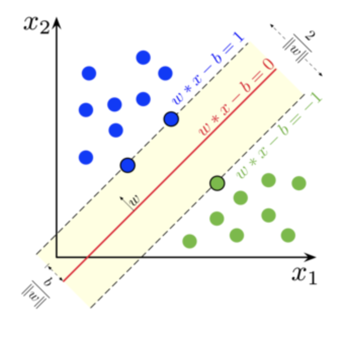

* Optimization function
  $$ \arg \min _{θ, α} \frac{1}{2}\|θ\|_{2}^{2} \text { s.t. } \forall_{i} y_{i}(θ \cdot X_{i}-α) \geq 1 $$

* Decision rule
  $$ w \cdot u+b \geq 0, \text { then }+ $$

* KNN (K nearest neighbors): transformed into a fast indexing structure such as a Ball Tree or KD Tree

* Linear Discriminant Analysis: Maximizes the separability between classes
  * maximize distance between means | minimize variation within each category
  * LD1 accounts for the most variation between categories

* Principal Component Analysis
  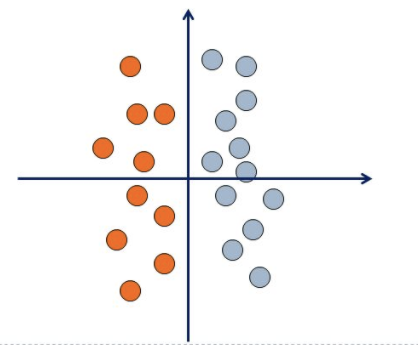

[MNIST_KNN_PCA_CNN.ipynb](https://gist.github.com/SeanHwangG/13714cbe18c3a379397dc35c52da9cbe)



### Polynomial




```py
# 1. Polyfit and draw
x = [0, 2000]
f = np.poly1d(np.polyfit([2, 7], [3, 5], 1))
plt.plot(x, f(x), '-')

data = [d for d in data if 'user|ageInSeconds' in d and d['user|ageInSeconds'] < 60*60*24*365*100]
X = [[1, d['user|ageInSeconds'], d['beer|ABV']] for d in data] # two feature
X = [[1, d['beer|ABV'], d['beer|ABV'] ** 2] for d in data]     # polynomial
y = [d['review|overall'] for d in data]
theta, residuals, rank, s = np.linalg.lstsq(X, y)
```






## Clustering

| Notation  | Meaning                                                      |
| --------- | ------------------------------------------------------------ |
| cut(c, c) | number of edges that separate c from the rest of the network |

* Four types of clustering methods are 1) Exclusive 2) Agglomerative 3) Overlapping 4) Probabilistic

* KNN
  * [+] No assumptions about the distribution or shape of different classes
  * [+] Effective with large training set
  * [-] Time consuming, No insight into the domain, dependent highly on the distance measure used

* Hierarchical Clustering: Iteratively merge closest points which constructs dendrogram
  * Useful for geographic location
  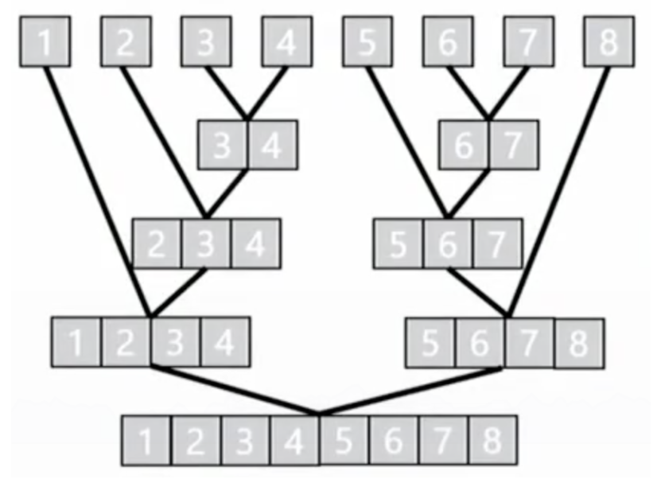

### K-mean

* Soft K-means
  * replace hard memberships to each cluster by a proportional membership to each cluster
  $$C_{k}=\frac{\sum_{i} \delta\left(y_{i}=k\right) X_{i}}{\sum_{i} \delta\left(y_{i}=k\right)}$$

* K-median: replace mean with median to minimize 1-norm distance
  $$ y_{i}=\min_{C, y} \sum_{i}\left\|X_{i}-C_{y i}\right\|_{2}^{2} $$

* Normalized cut
  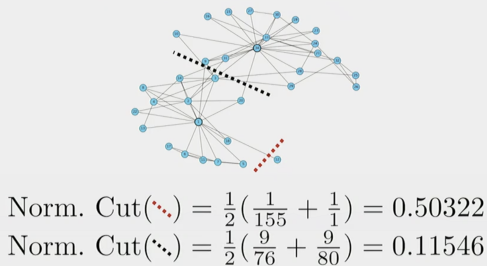
  $$\frac{1}{|C|} \sum_{c \in C} \frac{\operatorname{cut}(c, \bar{c})}{d e g r e e s \operatorname{in} c}$$

* Ratio Cut
  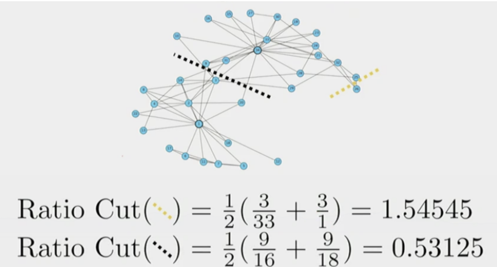
  $$\frac{1}{|C|} \sum_{c \in C} \frac{\operatorname{cut}(c, \bar{c})}{|c|}$$

## Ensemble

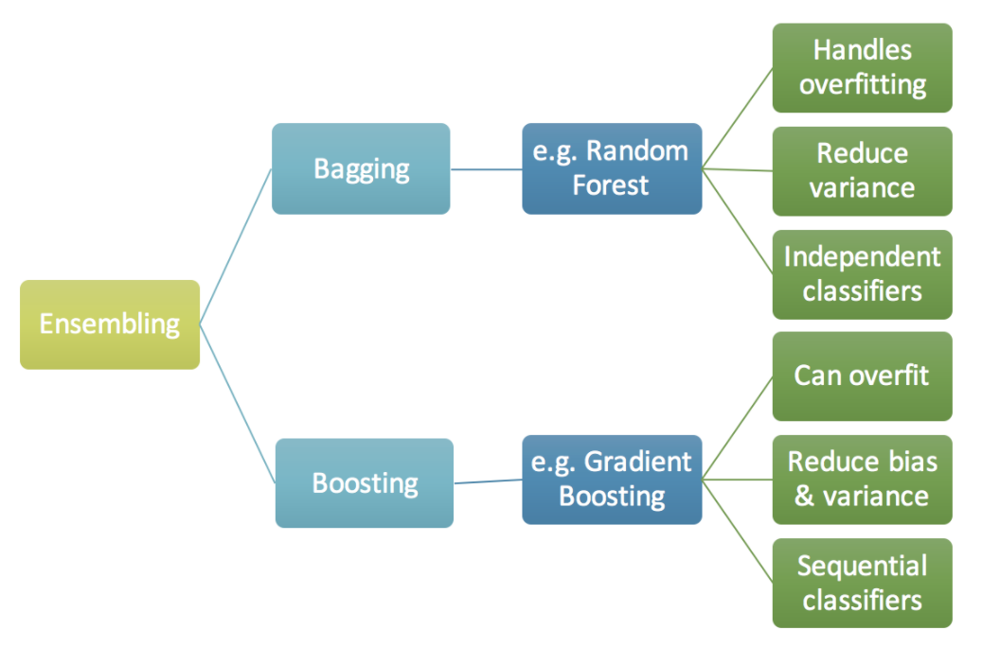


* technique that creates multiple models and then combines them to produce better results

* Bagging: combine them using some model averaging techniques (e.g. weighted average, majority vote)
  * [ex] Random Forest models

* Boosting: takes less time|iterations to reach close to actual predictions
  * [ex] Adaptive Gradient Boosting: machine learning meta-algorithm formulated by Yoav Freund and Robert Schapire

* Cascading: reject if any of the classifier doesn’t match

### Extra Tree

* Split of each selected feature is random → less computationally expensive than a random forest
* Extra Trees show low variance

### Gradient Boosting Decision Tree

* ensemble that takes an iteratively combine weak learners to create a strong learner
* focus on mistakes of prior iterations
* [+] powerful, accepts various inputs, used for classification / regression, outputs feature importance
* [-] longer to train, likely to overfit, difficult to tune
* Overfit
  * max_depth (7), subsample, colsample_bytree, colsample_bylevel, eta, num_rounds
* Under fit
  * min_child_weight (0, 5, 15, 500), lambda alpha

## Regularization

* adding information in order to solve an ill-posed problem or to prevent overfitting

> Term

* Ridge regression: estimating coefficients of multiple-regression models where independent variables are highly correlated
  * large alpha = smaller slope = less sensitive to training data, usually found with cross validation
  * [+] When there are more parameter than data points
  * [+] Prevents over fitting, Trades variance for bias (with co-linearity)
  * [-] Hyperparameter alpha, low model interpretability, increase bias
  $$ ∑_{i=1}^{M}(y_{i}-\hat{y}_{i})^{2}=∑_{i=1}^{M}(y_{i}-∑_{j=0}^{p} w_{j} \times x_{i j})^{2}+λ ∑_{j=0}^{p} w_{j}^{2} $$

* LASSO regression: regularization technique, variable selection + regularization to enhance accuracy, interpretability
  * [+] Select features, by shrinking co-efficient towards zero, Avoids over fitting
  * [-] Prediction performance is worse than Ridge regression
  * [-] Selected features will be highly biased, for different boot strapped data, the feature selected can be very different
  $$ \operatorname{cost}(w)=1 /(2 * n) \sum_{i=1}^{i=n}(y_{i}-\hat{y}_{i})^{2}+∑ \sum_{j=1}^{j=D}|w_{j}| $$
