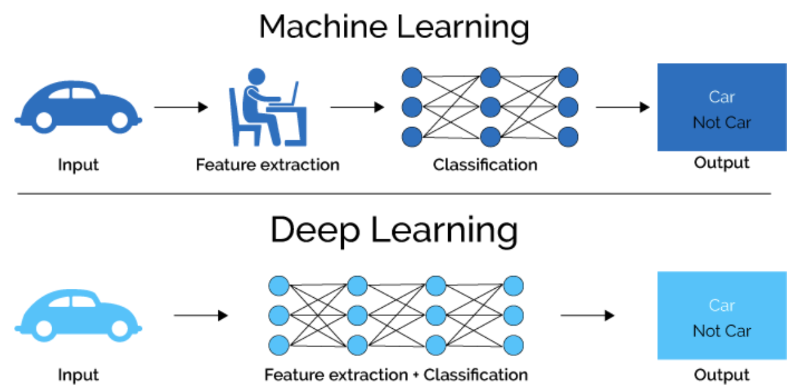
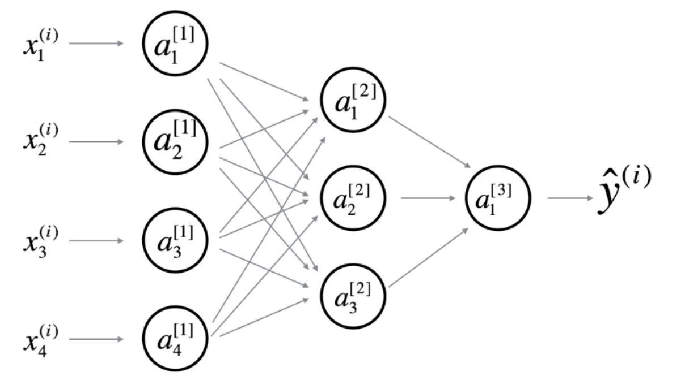
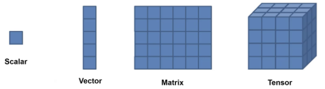
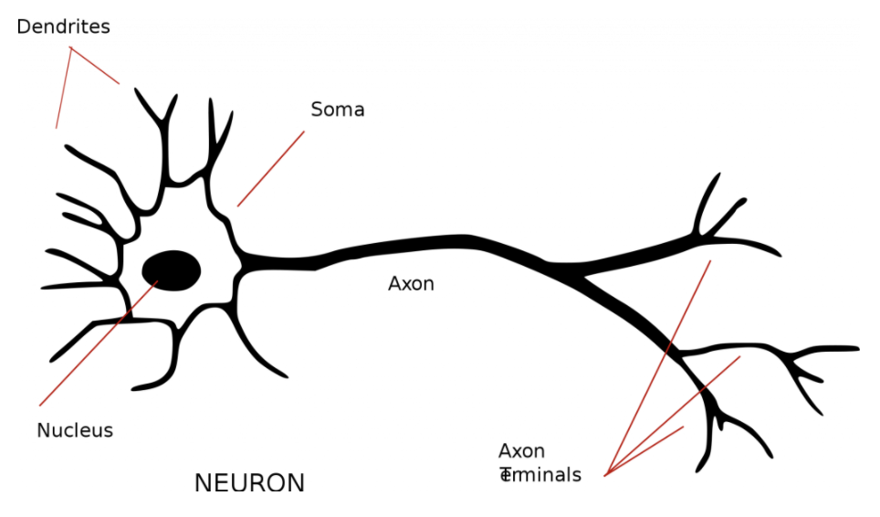
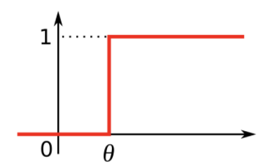
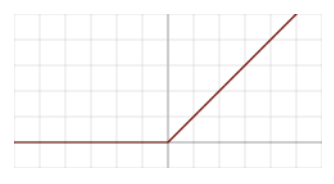
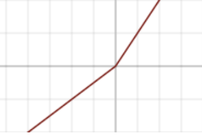
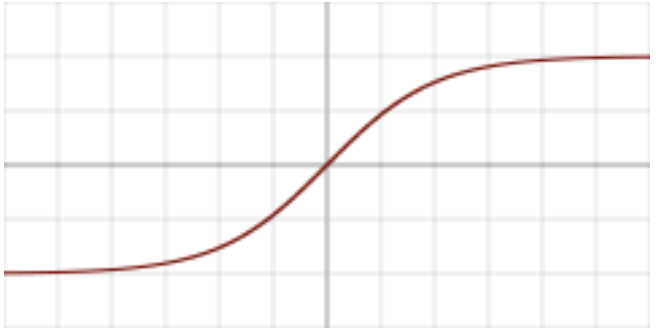

# Deep Learning



* Neural networks become deep neural networks if it contains two or more hidden layers
* Zhou, Boris proved Neural Network can approximate any convex continuous function

* If a model has low loss in the training data but poor on test, what should you do?
  * implement L2 regularization on the weights
  * decrease the number of hidden units in the model

* Overfitting: network is learning features in the train data not useful in generalizing predictions to the holdout set

* Which activation functions for the hidden units might cause vanishing gradients?
  * Tanh, sigmoid (Not relu)

* Why should bias be added?
  * Without b the line always goes through the origin (0, 0) and you may get a poorer fit. When x = 0

> Terms



| Terms                                                    | Meaning                                                    |
| -------------------------------------------------------- | ---------------------------------------------------------- |
| $$b^{[l]}$$                                              | # Bias vector in $$I^{th}$$ Layer                          |
| $$g^{[l]}$$                                              | $$I^{th}$$ layer activation function                       |
| $$h(x)$$                                                 | hypothesis                                                 |
| $$m$$                                                    | Number of examples in datasets                             |
| $$n_{x} / n_{y}$$                                        | input / output size                                        |
| $$n_{h}^{[l]}$$                                          | number of hidden units of $$I^{th}$$ layer                 |
| $$W^{[l]}$$                                              | Weight matrix in $$I^{th}$$ layer                          |
| $$x \mid X$$                                             | input / input matrix ($$n_x$$, m)                          |
| $$x^{(i)}$$                                              | $$i^{th}$$ example represented as column of ($$n_x$$, 1) |
| $$\hat{y}$$                                              | predicted output vector                                    |
| $$Y$$                                                    | label matrix ($$n_y$$, m)                                  |
| $$z$$                                                    | weighted sum input                                         |
| $$a=\sum_{j=0}^{d} w_{j} x_{j}=w^{T} x$$                 | Weighted Sum Output                                        |
| $$\delta_{j}^{p}=\frac{\delta J^{P}}{\delta a_{j}^{p}}$$ | Delta                                                      |
| $$L=\prod_{n=1}^{N} P\left(X^{n}\right)$$                | Likelihood                                                 |
| $$-\ln L=-\ln \prod_{n=1}^{N} P\left(X^{n}\right)$$      | Error                                                      |

> Terms

* Auto-encoder
  * denoise auto-encoder to make robust
  * learn efficient data encodings in an unsupervised manner

* Epoch: one forward pass and one backward pass of all the training examples

* Batch: number of training examples in one forward/backward pass. higher batch size needs more memory space

* Iteration: Number of passes each pass using number of examples

* Normalization: inputs and each hidden unit throughout the network, on a per-unit basis, over each minibatch

* Fine-tuning: process in which the parameters of a trained model must be adjusted very precisely
  * to validate that model taking into account a small data set that does not belong to the train set

* Inception: CNN uses convolutions kernels of multiple sizes as well as pooling within one layer

* Internal representation (Rumelhart, 87)
  

* Graph Neural Netwrok (GNN)
  






* [Transfer](https://gist.github.com/SeanHwangG/f16bbb0beba182251d2b6c147a5c7b9a)
* [Backward](https://gist.github.com/SeanHwangG/cfd2ff68f7f2e5b086cde701b35f8e18)

* vector is 1d tensor
* module: Base class for all neural network modules. models should also subclass this class
* parameter: A kind of Tensor that is to be considered a module parameter
* tensor: multi-dimensional matrix containing elements of a single data type
* Variable
  * Variable class wraps a tensor, and allows automatic gradient computation on the tensor

```py
# save | load only the model parameters
torch.save(the_model.state_dict(), PATH)
the_model = TheModelClass(*args, **kwargs)
the_model.load_state_dict(torch.load(PATH))

# Save | load entire model
torch.save(the_model, PATH)
the_model = torch.load(PATH)

# Tensors
matrix-like data structures for deep learning libraries and efficient computation
Graphical Processing Units (GPUs) are especially effective at calculating operations between tensors

arr = np.array([1, 2, 3, 4, 5]) # shallow copy
torch.from_numpy(arr)           # share same memory as numpy
torch.as_tensor(arr)

torch.tensor(arr)               # deep copy + same dtype
torch.Tensor(arr)               # FloatTensor

torch.empty(4,2)                # zeros, ones, (_like)
torch.arange(1, 10)             # linspace

x.view(2, 5)                    # share same memory

# Random
torch.manual_seed(42)
torch.rand(2, 3)                # randn, randint
torch = torch.type(torch.int32) # change dtype

# operation
torch.add(a, b) | a + b
a.add_(b)                # in-place
a.mul(b)                 # element wise operation
a.dot(b)                 # dot product
torch.mm(a, b) | a @ b   # matrix multiplication

x.norm()
x.numel()

# loss
CrossEntropyLoss()
L1Loss(reduction='mean')        # measures MAE between each element in input xx and target yy
MSELoss(reduction='mean')        # squared L2 norm
```




## Activation Function

* non-linear, differentiable
* multi-class situation vs binary situation
* One hot encoding

* non-exclusive vs mutually exclusive
  * sum of all probabilities will be equal to one

* dendrites: input
* soma: summation function
* axon: activation function



* Linear
  

$$
g(a) = a
$$

* no matter how many layers it had, it will behave just like a single-layer perceptron

* Perception
  

$$ g(z)=1(z \geq \theta), 0 $$

* Relu
  * good performance especially when dealing with vanishing gradient
  

$$
g(z)=max(0,z) \\
g'(z)=1 (z>0), 0
$$

* Leaky Relu
  

$$
g(z)=x<0 ? 0.01 x: x \\
g^{\prime}(z)=x<0 ? 0.01: 1
$$

* Sigmoid: binary classification
  * used for multiple non-exclusive classes (beach, night, boat)

$$
g(z)=\frac{1}{1+e^{-x}} \\
g^{\prime}(z)=\sigma(z)(1-\sigma(z))
$$

* TanH
  

$$
g(x)=\tanh (x) \\
g^{\prime}(x)=\frac{e^{x}-e^{-x}}{e^{x}+e^{-x}}
$$

## Gradient Descent

* Delta Rule Derivation

$$ \Delta w_{ij}^p = \eta \delta_j^p a_i^p%0 $$

$$
\delta_{j}^{p}=\frac{\partial J^{p}}{\partial a_{j}^{p}}=\sum_{k} \frac{\partial J^{p}}
{\partial a_{k}^{p}} \frac{\partial a_{k}^{p}}{\partial a_{j}^{p}}=\sum_{k} \delta_{k}^{p} w_{j k}
$$

* Deep Learning Derivation

$$\frac{\partial E}{\partial a_{j}}=\sum_{k} \frac{\partial E}{\partial a_{k}} \frac{\partial a_{k}}{\partial a_{j}}$$

$$
=-\sum_{k} \delta_{k} \frac{\partial a_{k}}{\partial z_{j}} \frac{\partial z_{j}}{\partial a_{j}}
$$

$$
=-\frac{\partial z_{j}}{\partial a_{j}} \sum_{k} \delta_{k} \sum_{i} \frac{\partial w_{i k} z_{i}}{\partial z_{j}}
$$

$$
=-g^{\prime}\left(a_{j}\right) \sum_{k} \delta_{k} w_{j k}
$$

* Adaptive learning rate: Increase local gain if the gradient for that weight doesn't change the sign
  * Limit the gains to lie in some reasonable range
  * Use full batch learning or big mini-batches

* Momentum: magnitudes of the gradients can be different for different layers, especially if small initial weights
  * Standard: compute gradient at current location, then takes jump in the direction of the updated accumulated gradient
  * Nesterov: jump in direction of previously accumulated gradient, then measure gradient and make corrections

* L1 Normalization
  $$ L 1(W)=\sum_{k} \sum_{l}\left|W_{k, l}\right| $$

* L2 Normalization
  $$ L 2(W)=\sum_{k} \sum_{l} W_{k, l}^{2} $$

## Training

> Tips

* Analyze data: look for class imbalance, misclassified labels, duplicate data
  * spatial position matter
* Visualize features: Feature maps need to be uncorrelated and have high variance
  * Hidden units are sparse across samples and across features
  
* Start with simple baseline: Fix random seed → stable
  * Simplify - turn off data augmentation
  * Add significant digits to your eval, verify loss @ init
  * human baseline → annotate label and prediction
  * Overfit one batch to see if you can achieve 0 loss
  * Measure error on both training and validation set
  * use backprop to chart dependencies
* Overfit: Pick a known model
  * Adam is safe → try with 3e-4
* Regularize: Get more data. Data augmentation
  * Pretrain data
  * Decrease batch size
  * Dropout, weight decay, early stop
  * Try a larger model → early stopped performance of larger often be better

## RNN

### Space

* Auto regressive model
  * Linear model
  * Predict the next term in a sequence from a fixed number of previous terms using delay taps
  

* Feed-Forward neural network
  * generalized autoregressive models by using one or more layers of non-linear hidden units
  * Transformer networks use identical networks over every location in the input (up to 256 locations)
  * The networks then interact via attention mechanisms
  

### State

* Jordan network
  

* One time step back

* Elman network
  



### LSTM


* preserve data for a long time in the activities of an RNN, use a circuit that implements an memory cell
* A linear unit that has a self-link with a weight of 1 will maintain its state
* Information is stored in the cell by activating its write gate
* Information is retrieved by activating its read gate
* We can backpropagate through this circuit because logistic units have nice derivatives




## Style Transfer

* [Gatys, 2015](https://arxiv.org/abs/1508.06576)

* Style matrix

$$ G_{k k^{\prime}}^{[l]}=\sum_{i=1}^{n_{H}} \sum_{j=1}^{n_{W}} a_{i j k}^{[l]} \cdot a_{i j k^{\prime}}^{[l]} $$

* Initialize G randomly and keep minimize above cost function
* Style cost function

$$ J(G)=\alpha \cdot J_{\text {content }}(C, G)+\beta \cdot J_{\text {style }}(S, G) $$
$$ J_{s t y l e}^{[l]}(S, G)=\frac{1}{(2 n_{H}^{[l]} n_{W}^{[l]}
n_C^{[l]})^{2}} \sum_{k} \sum_{k^{\prime}}(G_{k k^{\prime}}^{[l](S)}-G_{k k^{\prime}}^{[l](G)})^{2} $$

* Content Cost function

$$ J_{\text {content }}(C, G)=\frac{1}{2}\|a^{[l](c)}-a^{[l](G)}\|^{2} $$
