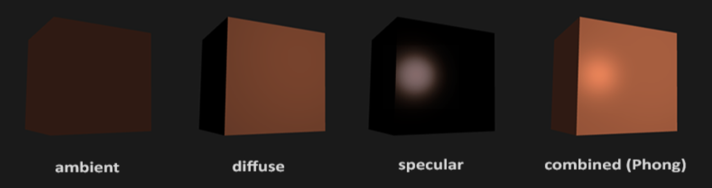

# Graphics

> Terms

* Interactive
  * Produces images within milliseconds
  * Using specialized hardware, graphic processing units
  * Standardized APIs (OpenGL, DriectX, Vulkan)
  * Tries to be as photorealistic as possible
  * Hard shadows, only single bounce of light
  * Used in games, technical design

> Rendering

* Synthesis of a 2D image from a 3D scene description
* 2D image is an array of pixels
* Algorithm interprets data structures that represent scene in terms of geometric primitives, textures, and lights
* Objective / Interactive

> Shadow

* hard shadow is generated by point source while soft shadow generated by extended source
* Stereo
  * shape from shading (single image, known direction, known BRDF)
  * Photometric stereo (single viewpoint, multiple images under different lighting)
* Multi-view stereo
  * Multiple images, dynamic scene, multiple viewpoints, fixed lighting, correspondence hard

## Light

| Equation        | Type                  | Property                                                |
| --------------- | --------------------- | ------------------------------------------------------- |
| $$ k*(p-v)^2 $$ | Quadratic attenuation | Most computationally expensive, most physically correct |
| $$ k*(p-v) $$   | Linear attenuation    | Less expensive, less accurate                           |
| $$ k $$         | Constant attenuation  | Fastest computation, least accurate                     |

* Sources - point, distant point, strip, area
* all the light leaving a point is due to that arriving at that point
* surfaces don't fluoresce (scorpions, detergents)
* surfaces don't emit light

* reflected: mirror
* transmitted: skin, glass
* scattered: milk
* absorbed: travel along the surface and leave at some other point

> Terms

* angle of incidence
* [ex] cos(0°) =  1.00 (100% of maximum brightness), cos(5°) =  0.98 ( 98% of maximum brightness)

* BRDF (Bidirectional reflectance distribution function)
  * Given light direction, viewing direction, how much light is reflected to viewers
* Global Illumination: Multiple bounces of light / Computationally expensive
  * Slow but realistic
* Local Illumination: Only one bounce of light between light source and viewer
  * Fast, but inaccurate
* Per-Triangle shading: Evaluate shading once per triangle, based on normal vector / Faceted appearance
* Gouraud shading: Interpolates vertex colors across triangles
* Per Pixel shading  Phong Interpolation: Rasterizer interpolates normals across triangles and evaluated at each pixel

* Phong
  * $$ c=\sum_{i} c_{l i}\left(k_{d}\left(L_{i} \cdot n\right)+k_{s}(R \cdot e)^{p}+k_{a}\right) $$
  
  * Ambient: Stop the unlit, back sides of objects from being pure black
    * $$ k_{a} c_{a} $$: $$ c_a $$ ambient light color  Ambient reflection coefficient $$ k_a $$
  * Diffuse: Ideal diffuse material reflects light equally in all directions, View-independent
    * $$ c_{l} k_{d}(n \cdot L) $$: n unit surface normal, L unit light direction
    * [ex] Matte, not shiny materials, Paper, Unfinished wood, Unpolished stone
  * specular: specular component is what makes an object look shiny or dull
    * $$ c_{s}=k_{s} c_{l}(R \cdot e)^{p} $$: R reflected

* Photorealistic
  * Physically-based simulation of light, camera Shadows, global illumination, multiple bounces of light
  * Slow, used in movies, animation

* Shading: Shading compute interaction of light with surfaces
  * Requires simulation of physics
  * Global illumination
  * multiple bounces of light
  * computationally expensive, minutes per image.
  * Used in movies, architectural design.
  * Appearance = Material Definition + Light Source

* Interactive application: No physics-based simulation Simplified models
  * Reproduce perceptually most important effects
  * Local illumination - only one bounce of light between the light source and viewer

* Local illumination: gives material its color
  * Light can be reflected by mirror wall, metals
  * Model reflection of light at surfaces.
* Bidirectional reflectance distribution function (BRDF): How much light is reflected toward the viewer
  * Given light direction, viewing direction, For any pair of light / viewing direction




* void WINAPI glMaterialfv():  material parameters for the lighting model
  * GLenum face: [ex] GL_BACK, GL_FRONT, GL_BACK
  * GLenum pname: [ex] GL_AMBIENT, GL_SPECULAR, GL_DIFFUSE
  * const GLfloat *params




## Culling

> Term

* Painter Algorihm: Paint from back to front, Need to sort geometry according to depth
  * May need to split triangles if they intersect. Intuitive, but slow, still used today to render translucent geometry
* Z-buffer
  1. Create a z-buffer with as many entries as pixels in the render window
  1. Initialize z-buffer with farthest z value
  1. During rasterization, compare stored value to new value
  1. Update pixel only if new value is smaller

## Graphic Mapping

> Example

* Anti Aliasing
  * Pixel may cover a large area on triangle in camera space
  * Corresponds to many texels in texture space
  * Need to compute average.

* Anisotropic filtering
  * Method of enhancing the image quality of textures on surfaces that are at oblique viewing angles
  * Different degrees or ratios of anisotropic filtering can be applied
  * The degree refers to the maximum ratio of anisotropy supported by the filtering process.
  * For example, 4:1 anisotropic filtering supports presampled textures up to four times wider than tall

* Capturing environment maps
  * Environment map = surround panoramic image
  * Creating 360 degrees panoramic images

* Cube-maps: More even texel sample density causes less distortion, allowing for lower resolution maps
  * Easier to dynamically generate cube maps for real-time simulated reflections.
  * Cube map look-up
  * Given: light direction(x, y, z)
  * Largest coordinate component determines cube map face
  * Dividing by magnitude of largest component yields coordinates within face

* Large Triangles: Often sufficient for simple geometry. Fast
  * Per vertex colors look boring and computer-generated
  * Map textures onto surface polygons
  * Same triangle count, much more realistic appearance.

* Mip-Maps: MIP stands for multum in parvo = "much in little"
  * Averaging over texels is expensive
  * Many texels as objects get smaller. Large memory access and computation cost
  * Precompute filtered (averaged) texture
  * Practical solution to aliasing problem
  * Before rendering precompute and store down scaled versions of textures
  * Reduce resolution by factors of two successively.
  * Width and height of the texture should be powers of two (non-power of two supported since OpenGL 2.0)
  * Interpolate texture coordinates of each pixel as without mipmapping.
  * Compute approximate size of pixel in texture space.
  * Look up color in nearest mipmap.
  * [+] Fast and simple. Available in OpenGL, implemented in GPUs. Reasonable quality
  * [+] Increases memory cost by 1/3, Use high quality filtering (averaging) scheme

* Make scene with light arrives from all directions: Store omni-directional illumination as images
  * Each pixel corresponds to light from a certain direction
  * sky boxes make for great environment maps

* Simplifying Assumption: Assume light captured by environment map is emitted from infinitely far away
  * Environment map consists of directional light sources
  * Value of environment map is defined for each direction, independent of position in scene

* Texture mapping: Map locations in texture to locations on 3D geometry
  * Texture coordinate space - texture pixels (texels) have texture coordinates (s, t)
  * Bottom left corner is (0,0) Top right is (1, 1)
  * Store 2D texture coordinates s, t with each triangle vertex
  * Each point on the triangle gets color from its corresponding point in texture.
