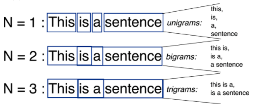
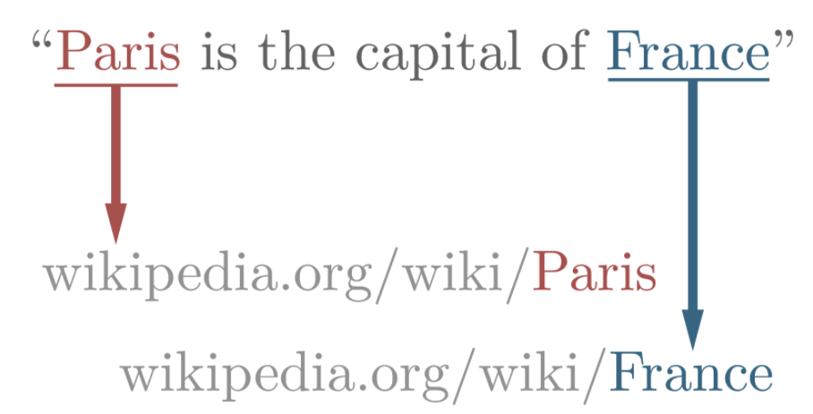

# NLP

* Automated way to understand or analyze natural languages and extract required information by applying ML Algorithms
* Used in Semantic Analysis, Automatic summarization, Text classification, Question answering

> Terms

* Dependency Parsing (Syntactic Parsing): task of recognizing a sentence and assigning a syntactic structure to it
* Knowledge base: words of interest are mapped from input text to corresponding unique entities in target knowledge base
* Hypernym: Is a Relation | a word of less specific meaning
  * chiroptophobia and phobia
  * opera and music


* Hyponym: Subclass of
  * If X is a hyponym of Y, and Y is a hyponym of Z, then X is a hyponym of Z
  * pigeon, eagle and seagull are hyponyms of bird

* LSI (Latent Semantic Indexing / Latent semantic analysis): mathematical method developed to increase the accuracy of retrieving
  * find hidden relation between words by producing concepts related to terms of a sentence to improve information understanding
  * technique used for the purpose is called Singular value decomposition, useful for working on small sets of a static document

* LDA: Latent Dirichlet Allocation

* Meronym: Part of
  * a 'tire' is part of a 'car': Part meronym
  * a 'wheel' is made from 'rubber'"​: Substance (stuff) meronym
  * a 'car' is a member of a 'traffic jam': Member meronym

* POS tagging
  * PoS Tagger is a piece of software that reads a text in some language and assigns PoS to each word
  * make more complex categories than those defined as basic PoS (ex noun-plural)

* Pragmatic Analysis: deals with outside word knowledge, which means knowledge that is external to the documents|queries
  * Pragmatic analysis that focuses on what was described is reinterpreted by what is actually meant
  * derive various aspects of language that require real-world knowledge

* Lemmatization: do the things properly with the use of vocabulary and morphological analysis of words
  * lemmatizing is more accurate as it uses more informed analysis to create groups of words
  * democracy, democratic, democratization → democracy
  * saw → s

* Pragmatic analysis: Can be defined as the words which have multiple interpretations
  * Pragmatic Analysis is part of the process of extracting information from text

* Stemming: faster as it simply chops off the end of a word using heuristics
  * democracy, democratic, democratization → democr
  * saw → see | saw (meaning)

* Synonym: Similar words

* Syntactic analysis: proper ordering of words
  * a sentence may be interpreted in more than one way due to ambiguous sentence structure

* Tokenization: Methods of dividing the text into various tokens. (in the form of the word)




> nltk

* PorterStemmer: stem('grows')
* WordNetLemmatizer: lemmatize('geese'))
* corpus: stopwords.words('english'): stopwords

> torchtext

* Fields: Specify how preprocessing should be done
  * vocab.stoi: str2index information
  * build_vocab()

* Dataset: load data
  * fields: information of dataset
  * vars(trainset[0]): get inside content

* BucketIterator: batching and padding

```py
# 1. synonyms
poses = {'n':'noun', 'v':'verb', 's','adj (s)', 'a':'adj', 'r', 'adv'}
for synset in corpus.wordnet.synsets('good'):
  print(f'{poses[synset.pos()]} {', '.join([l.name() for l in synset.lemmas()])}')

# 2. hypernyms
panda = corpus.wordnet.synset('panda.n.01')
hyper = lambda s: s.hypernyms()
list(pandas.closure(hyper)
```




## Embedding

| Notation  | Term                |
| --------- | ------------------- |
| $$ u_w $$ | Context word        |
| $$ v_w $$ | Center word         |
| $$ b_i $$ | Biases of i         |
| $$ X $$   | Co-occurence matrix |

> Term

* Intrinsic evaluation: Fast to compute
  * Evaluation on a specific / intermediate subtask
  * Dataset: wordsim353

* Extrinsic evaluation: Evaluation on a real task
  * can take a long time to compute accuracy
  * Unclear if the subsystem is the problem or its interaction or other subsystems

* Perplexity: measurement of how well a probability model predicts a sample
  * often possible to achieve lower perplexity on more specialized corpora, as they are more predictable

* One-hot vector
  * Distributed representations (Hinton, 1986)
  * [-] hotel and model are orthogonal

* Producing high-dimensional semantic spaces from lexical co-occurrence (Lund, 96)
  * [+] Fast Training / Efficient usage of statistics
  * [-] Primarily used to capture word similarity
  * [-] Disproportionate importance given to large counts

* Improved Method for Deriving Word Meaning from Lexical Co-Occurrence (Rohde, 04)
  * [+] Add threshold, manual tuning for distant word

* word2vec(Continuous Bag of Words (CBOW)) predict center word from context words
  * Efficient Estimation of Word Representations in Vector Space (Mikolov, 2013)
  * can be trained with a specific corpus to find pseudo-algebraic operations between words
  * mimics human logic, focusing on word senses and connections between real-world entities
  * [+] Generate improved performance, capture complex patterns
  * [-] Scales with corpus size / Inefficient usage of statistics
  * [-] Can't compute accurate word similarity
  * [-] Miss nuance (proficient, good), new meanings of words (ninja)
  * [-] Same vector for synonyms

| Equation                                                                                         | Meaning           |
| ------------------------------------------------------------------------------------------------ | ----------------- |
| $$P(o \mid c)=\frac{\exp (u_{o}^{T} \cdot v_{c})}{\sum_{w=1}^{v} \exp (u_{w}^{T} \cdot v_{c})}$$ |                   |
| $$\frac{\delta}{\delta v_{c}} J(\theta)=u_{0}-\sum_{x=1}^{v} p(x \mid c) \cdot u_{x}$$           | Used Chain Rule   |
| $$J_{n e g}(o, v_{c}, U)=-\log (σ(u_{o}^{T} v_{c}))-\sum_{k=1}^{K} \log (σ(-u_{k}^{T} v_{c}))$$  | Negative Sampling |

* Prediction function
  $$ P(o \mid c)=\frac{\exp (u_{o}^{T} v_{c})}{\sum_{w \in V} \exp (u_{w}^{T} v_{c})} $$

* Likelihood
  $$ L(\theta)=\prod_{t=1}^{T} \prod_{m \leq j \leq m} P\left(w_{t+j} \mid w_{t} ; \theta\right) $$

* Objective
  $$ J(\theta)=-\frac{1}{T} \log L(\theta) $$

* Distributed Representations of Words and Phrases and their Compositionality (Mikolov, 2013)
  * Skip-grams (SG) predict context words given center words

* BERT
  * [-] CLS is not semantically meaningful
  * [-] Poly-encoder has too large computational overhead
  * [-] Score function is not symmetric (a,b ↔  b,a)

* GloVe
  * Global Vectors for Word Representation (Pennington, 14)
  * local statistics (local context information of words) + global statistics (word co-occurrence) for vector
  * training only on the nonzero elements in a word-word co occurrence matrix
  * [+] Fast training, scalable to huge corpora
  * [+] good performance with small corpus and small vectors
  * Derivation
    * Log-bilinear model
      $$w_{i} \cdot w_{j}=\log P(i \mid j)$$
    * Vector difference
      $$w_{x} \cdot(w_{a}-w_{b})=\log \frac{P(x \mid a)}{P(x \mid b)}$$
    * Loss function
      $$\sum_{i, j=1}^{V} f(X_{i j})(w_{i}^{T} \bar{w}_{j}+b_{i}+\bar{b}_{j}-\log X_{ij})^{2}$$




```py
# 1. Sentence similarity
import pandas as pd
from sklearn.feature_extraction.text import CountVectorizer, TfidfVectorizer
train = ['call you tonight', 'Call me a cab', 'Please call me... PLEASE!']

count_vect = CountVectorizer()
ngram_vect = CountVectorizer(ngram_range=(2,2))
tfidf_vect = TfidfVectorizer()

count_vect.fit(train)
tfidf_vect.fit(train)
ngram_vect.fit(train)

print(f"unigram get_feature_names \t {count_vect.get_feature_names()}")
# unigram get_feature_names ['cab', 'call', 'me', 'please', 'tonight', 'you']
# bigram get_feature_names   ['call me', 'call you', 'me cab', 'me please', 'please call', 'you tonight']
print(f"bigram get_feature_names \t {ngram_vect.get_feature_names()}")

count_dtm = count_vect.transform(train)
ngram_dtm = ngram_vect.transform(train)
tfidf_dtm = tfidf_vect.transform(train)

# one row per document and one column per token
print(pd.DataFrame(count_dtm.toarray(), columns=count_vect.get_feature_names()))
print(pd.DataFrame(ngram_dtm.toarray(), columns=ngram_vect.get_feature_names()))
print(pd.DataFrame(tfidf_dtm.toarray(), columns=tfidf_vect.get_feature_names()))
"""
| cab | call | me  | please | tonight | you |
| --- | ---- | --- | ------ | ------- | --- |
| 0   | 1    | 0   | 0      | 1       | 1   |
| 1   | 1    | 1   | 0      | 0       | 0   |
| 0   | 1    | 1   | 2      | 0       | 0   |

| call me | call you | me cab | me please | please call | you tonight |
| ------- | -------- | ------ | --------- | ----------- | ----------- |
| 0       | 1        | 0      | 0         | 0           | 1           |
| 1       | 0        | 1      | 0         | 0           | 0           |
| 1       | 0        | 0      | 1         | 1           | 0           |

| cab   | call  | me       | please | tonight | you   |
| ----- | ----- | -------- | ------ | ------- | ----- |
| 0.000 | 0.385 | 0.000000 | 0.000  | 0.652   | 0.652 |
| 0.720 | 0.425 | 0.547832 | 0.000  | 0.000   | 0.000 |
| 0.000 | 0.266 | 0.342620 | 0.901  | 0.000   | 0.000 |
"""
```






### Ngram

* A mathematical theory of communication (Shannon, 1948)
* understand context within sentence → hang out
* [-] a very large vector → meaning of each value in the vector is known
* [-] disregarding grammar and even word order





### TFIDF

* Term Frequency: How often a word occurs in a document
* Inverse Document Frequency: How often a word occurs in an entire set of documents
* Weight higher the more a word appears in doc and not in corpus

| Notation       | Meaning                     |
| -------------- | --------------------------- |
| N              | total # of documents        |
| $$tf_{i . j}$$ | $ of times i occurs in j    |
| $$d f_{i}$$    | $ of documents containing i |

$$ w_{i, j}=tf_{i . j} \times \log \left(\frac{N}{df_{i}}\right) $$



## NLU

* Natural Language Understanding

### Named entity disambiguation

* Challenges
  * Name variations (New York, NY, neuyork)
  * Ambiguity (Paris Hilton vs Paris in France)
  * Absence (Domain specific knowledge base)
  * Scalability (Chatbot, Search)
  * Evolving Information (Recent news articles in which there are mentions)
  * Multiple Languages (Support queries performed in multiple languages)
* ambiguity of entity names tends to be much higher (e.g., mentions of common last | first name-only)
* Word sense disambiguation: mapping con- tent words to a predefined inventory of word senses



> Terms

* Context: All words in the input text except stopwords and entity ([ex] Wiki article, Yago)
* Entity: Disambiguated thing
  * Words of interest, ([ex] names of persons, locations and companies)
* Mention: Not disambiguated thing    (ex. Stanford NER)

> Context (Milne08)

* cosine similarity, weighted Jaccard distance, KL divergence
* [+] work well for long, clean input texts such as predicting the link target of Wikipedia anchor text
* [-] similarity have been developed for common nouns and verbs (Thater 10) / short text
* [-] IU played guitar in Paris. (Paris might be a guitarist, but IU ↔ Paris not relation)
* Inlink share

$$
M W(e, f)=1-\frac{\log (\max \{|I_{e}|,|I_{f}|\})-\log (|I_{e} \cap I_{f}|)}{\log (N)-\log (\min \{|I_{e}|,|I_{f}|\})}
$$

> Collective assignment (Kulkarni 09)

* coherence of the resulting entities, in the sense of semantic relatedness
* [-] Manchester and Barcelona that takes place in Madrid

> Robust NED (Hoffart, 12)

* Density: # total weight of subgraph edges / minimum weighted degree in sub-graph
* Coherence: Entity-Entity (ex. # inlinks Wikipedia articles share)
* Prior: Mention-Entity (ex. Number of inlinks)
* Similarity: Context-Entity (ex. CosSim)
* simplest heuristics for name resolution is to choose the most prominent entity for a given name
* (ex) place with the most inhabitants or largest area / largest number of incoming links in Wikipedia
* [-] Non popular entities will never be identified

* Coherence

$$ u(E, T)=2 \cdot \frac{H(E)+H(T)-H(E, T)}{H(E)+H(T)} $$

* Entropy

$$ H(X)=-\sum_{x \in X} p(x) \log p(x) $$

* Phrase overlap

$$
P O(p, q)=\frac{\sum_{w \in \eta \cap q} \min \{γ_{e}(w), γ_{f}(w)\}}{\sum_{w \in p \cup q} \max \{γ_{e}(w), γ_{f}(w)\}}
$$

* Phrase overlap with Norm

$$ \operatorname{KORE}(e, f)=\frac{\sum_{p \in P_{e}, q \in P_{f}} P O(p, q)^{2} \cdot \min \{\phi_{e}(p), \phi_{f}(q)\}}
{\sum_{p \in P_{e}} \phi_{e}(p)+\sum_{q \in P_{f}} \phi_{f}(q)} $$

* Locality-sensitive hashing
  * Bucketize all highly similar keyphrases
  * Group entities together that have sufficiently high overlap in terms of keyphrase bucket identifiers

> KORE (Nguyen, 2014)

* KORELSH-G , a reasonably fast approximation of KORE which has nearly the same quality as KORE

> Zeroshot (Logeswaran, 19)

* End to end entity linking
