# Plot

> Reference

<https://en.wikipedia.org/wiki/Comparison_of_video_container_formats>




* pandas: Panel Data library
* concat(axis=0): if contains at least one DataFrame, return df
* read_json(typ=’frame’)
* unique(values): Uniques are returned in order of appearance
* display.max_rows | columns
* display.max_colwidth

* pandas.DataFrame: Dataframe is multiple series that share the same index
  * DataFrame(data=None)
  * axes: list representing the axes of the DataFrame
  * columns, index: column|row labels of the DataFrame
  * dtypes: types of columns in the DataFrame
  * shape: tuple representing dimensionality of DataFrame
  * values: Numpy representation of the DataFrame

  * access
    * [colname]: return Series corresponding to colname
    * describe(): quick statistic
    * duplicated([col], keep=First): Mark duplicates as True except for first
    * head(n): first n rows
    * iloc(r_index): select a single row or list of row (starting from 0)
    * isin(values): True at a location if all the labels match
    * isna(df1): boolean mask where values are nan
    * iterrows(): iter(idx, row_sr), ignore dtypes across rows
    * itertuples(): iter(row_df)
    * iloc(row): return Series
    * isin(lists): filter only in lists
    * loc(r_name): select a single row or list of rows
    * tail(n): last n rows
    * value_counts()
    

  * Modify
    * append(other): Append column and return new dataframe
    * apply(axis=0}: Apply function to each columnl or row(axis=1)
    * drop('row', axis=0, inplace=True): Remove row (axis=0), col (axis=1)
    * dropna(how='any'): Drop any rows that have missing data
    * drop_duplicates(subsets):
    * fillna(value=None): Fill missing data with value
    * insert(loc, column, value): Insert column in DataFrame at specified location
    * reset_index(drop=False): Convert index to column
    * sort_values(by='col'): Sort dataframe by 'col' column
    * to_numpy(): Axes labels will be removed
    * rename(index=None, columns=None, inplace=F): Alter axes labels
    * set_axis(labels, axis=0, inplace=False): Assign desired index to given axis
    * to_csv(index=True) / to_sql(name, conn): Save as csv / sql file

* Series: built on top of a numpy array and have a named index
  * arithmetic converts to float

  * Acesss
    * head(n): first n rows
    * to_list(): return list ignoring all index
    * tail(n): last n rows

  * Function
    * T: Return the transpose, which is by definition self
    * array: The ExtensionArray of the data backing this Series or Index
    * at: Access a single value for a row/column label pair
    * attrs: Dictionary of global attributes on this object
    * axes: Return a list of the row axis labels
    * dtype: Return the dtype object of the underlying data
    * hasnans: Return if I have any nans; enables various perf speedups
    * iat: Access a single value for a row/column pair by integer position
    * iloc: Purely integer-location based indexing for selection by position
    * index: The index (axis labels) of the Series
    * is_monotonic_decreasing(): Return boolean if values in the object are monotonic_decreasing
    * is_monotonic_increasing(): Return boolean if values in the object are monotonic_increasing
    * isna(self): Detect missing values
    * is_unique: Return boolean if values in the object are unique
    * loc: Access a group of rows and columns by label(s) or a boolean array
    * nbytes: Return the number of bytes in the underlying data
    * ndim: Number of dimensions of the underlying data, by definition 1
    * shape: Return a tuple of the shape of the underlying data
    * size: Return the number of elements in the underlying data
    * values: Return Series as ndarray of ndarray-like depending on the dtype

  * Modify
    * apply(func): apply function in every element
    * get(key, default=N)
    * mean(axis=N, skipna=N, level=N, numeric_only=N)

```py
options.display.float_format = '{:,100f}'.format
read_csv()

# Example
dp.loc[‘tom’] == dp.iloc[0]
dp.loc[[‘tom’, ‘nick’], [‘score’]]
df[(df['score'] > 70) & (df['age'] < 20)] # multiple condition
df.rename(index={0: "x", 1: "y", 2: "z"}) # rename index
df.rename(columns={"A": "a", "B": "c"})   # rename columns
df.groupby('age').max()

# preprocess
data['clean'] = data['text'].apply(lambda x: "".join([ch for ch in x if ch not in string.punctuation]))
data['tokens'] = data['clean'].apply(lambda x: re.split('\W+', x))
data['stops'] = data['tokens'].apply(lambda x: [w for w in x if w not in stopwords])
ps = nltk.PorterStemmer()
data['stem'] = data['stops'].apply(lambda x: [ps.stem(w) for w in x])

# display side
import pandas as pd

def display_side(*args):
  from IPython.display import display_html
  html_str = ''
  for df in args:
    if isinstance(df, pd.Series):
      df = pd.DataFrame(df)
    if not isinstance(df, pd.DataFrame):
      html_str += df.render(index= False)
    else:
      html_str += df.to_html(index= False)
  display_html(html_str.replace('table', 'table style="display:inline"'), raw=True)

display_side(pd.DataFrame([1,2,3]), pd.DataFrame([2,3,4]))
```




## Bar Graph




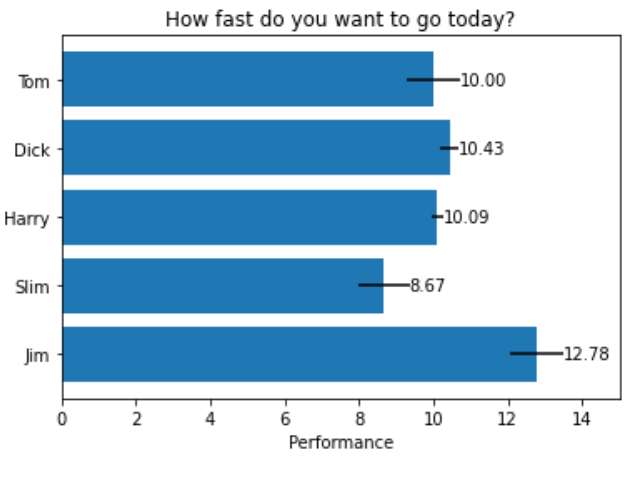
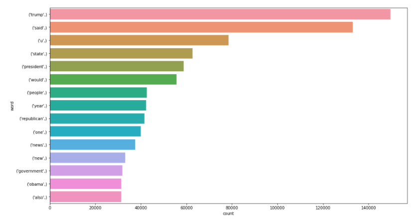

```py
import matplotlib.pyplot as plt
import numpy as np

# 1. Mathplot
np.random.seed(19680801)

people = ('Tom', 'Dick', 'Harry', 'Slim', 'Jim')
y_pos = np.arange(len(people))
performance = 3 + 10 * np.random.rand(len(people))
error = np.random.rand(len(people))

fig, ax = plt.subplots()

hbars = ax.barh(y_pos, performance, xerr=error, align='center')
ax.set_yticks(y_pos)
ax.set_yticklabels(people)
ax.invert_yaxis()
ax.set_xlabel('Performance')
ax.set_title('How fast do you want to go today?')

ax.bar_label(hbars, fmt='%.2f')
ax.set_xlim(right=15)

plt.show()

# 2. draw n gram
def draw_n_gram(string,i):
  n_gram = (pd.Series(nltk.ngrams(string, i)).value_counts())[:15]
  n_gram_df=pd.DataFrame(n_gram)
  n_gram_df = n_gram_df.reset_index()
  n_gram_df = n_gram_df.rename(columns={"index": "word", 0: "count"})
  print(n_gram_df.head())
  plt.figure(figsize = (16,9))
  return sns.barplot(x='count',y='word', data=n_gram_df)
```




* colab.to/r
* hist()
  * breaks: x-axis width

```r
library(ggplot2)

# 1. Plot
(mis <- read.csv("MIS_mid_data.csv")) # read csv

ages <- mis$age
hist(ages, breaks=10)
```




### Vertical Bar




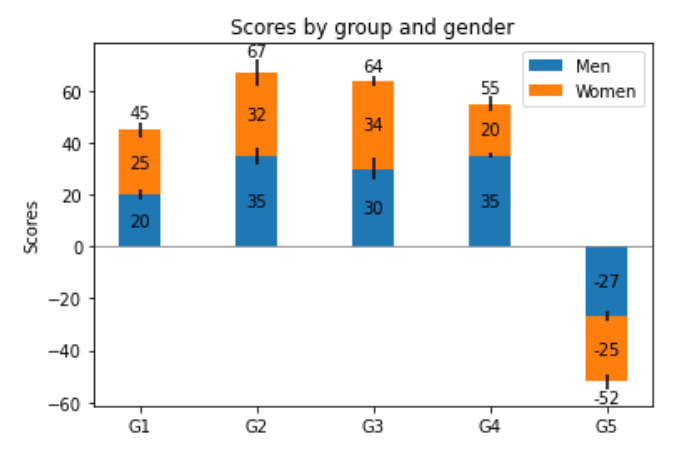

> Seaborn

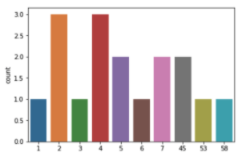

* seaborn.countplot(`Y_train`): [ex] [1,2,3,4,5,6,7,5,7,4,58,45,2,4,53,45,2]

```py
# 1. plt.md
fig, ax = plt.subplots()

p1 = ax.bar(ind, menMeans, width, yerr=menStd, label='Men')
p2 = ax.bar(ind, womenMeans, width, bottom=menMeans, yerr=womenStd, label='Women')

ax.axhline(0, color='grey', linewidth=0.8)
ax.set_ylabel('Scores')
ax.set_title('Scores by group and gender')
ax.set_xticks(ind)
ax.set_xticklabels(('G1', 'G2', 'G3', 'G4', 'G5'))
ax.legend()

ax.bar_label(p1, label_type='center')
ax.bar_label(p2, label_type='center')
ax.bar_label(p2)

plt.show()
```




## Line




* ros
  * rosrun rqt_plot rqt_plot
  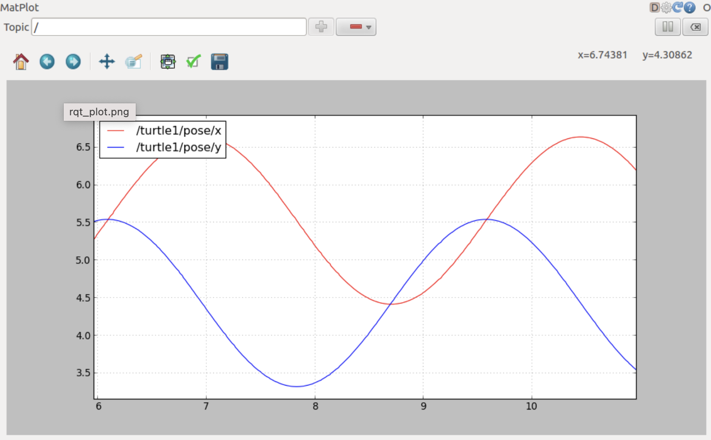




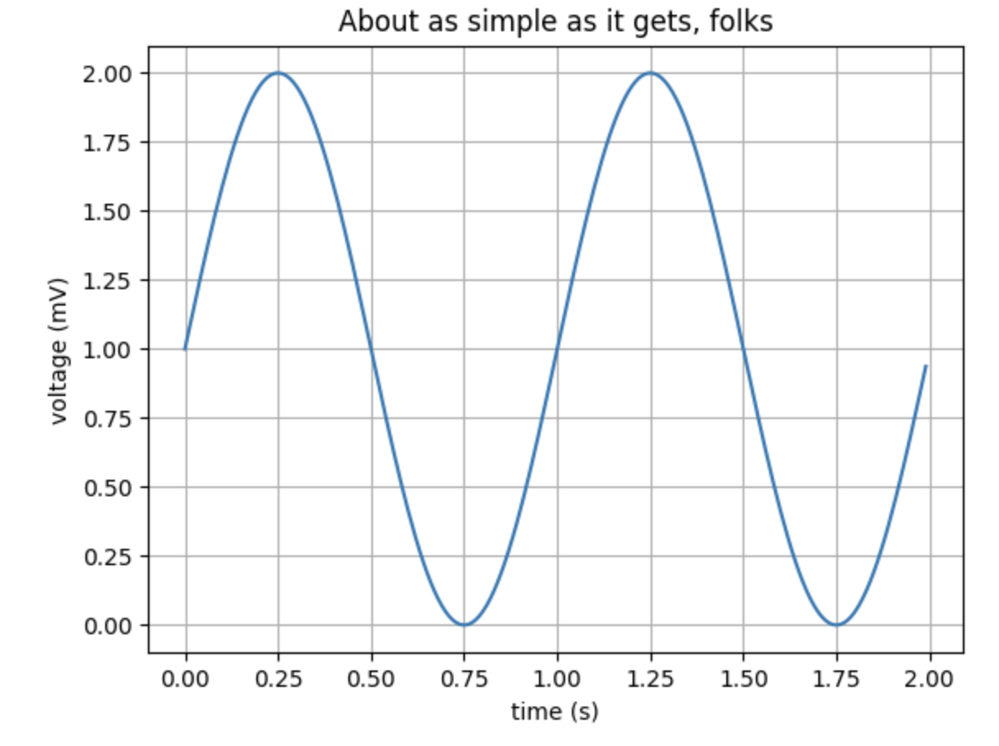
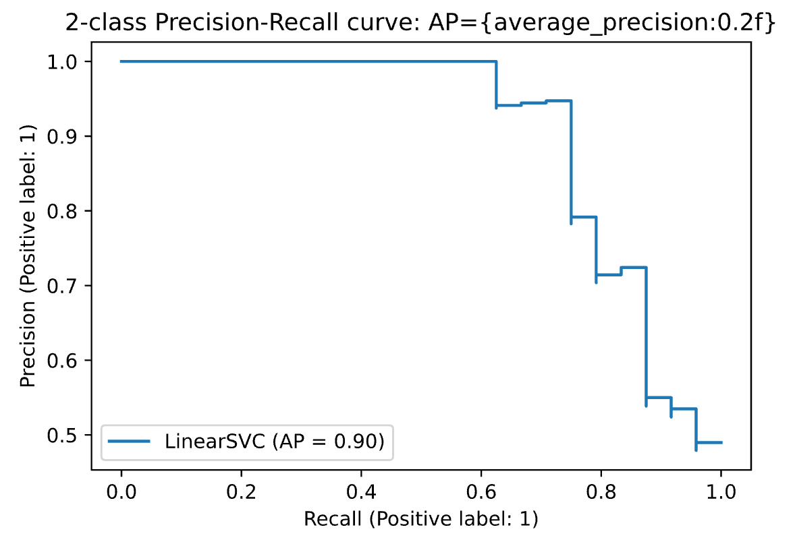

```py
import matplotlib.pyplot as plt
import numpy as np
from sklearn import svm, datasets
from sklearn.model_selection import train_test_split
from sklearn.metrics import precision_recall_curve, plot_precision_recall_curve

# 1. Line
t = np.arange(0.0, 2.0, 0.01)
s = 1 + np.sin(2 * np.pi * t)

fig, ax = plt.subplots()
ax.plot(t, s)

ax.set(xlabel='time (s)', ylabel='voltage (mV)', title='About as simple as it gets, folks')
ax.grid()

fig.savefig("test.png")
plt.show()

# 2. ROC
iris = datasets.load_iris()
X, y = iris.data, iris.target

n_samples, n_features = X.shape # Add noisy feature
X = np.c_[X, random_state.randn(n_samples, 200 * n_features)]

""" Limit to the two first classes, and split into training and test """
X_train, X_test, y_train, y_test = train_test_split(X[y < 2], y[y < 2], test_size=.5)

classifier = svm.LinearSVC(random_state=random_state)
classifier.fit(X_train, y_train)
y_score = classifier.decision_function(X_test)

disp = plot_precision_recall_curve(classifier, X_test, y_test)
disp.ax_.set_title(f'2-class Precision-Recall curve: ' 'AP={average_precision:0.2f}')
```




### Surface




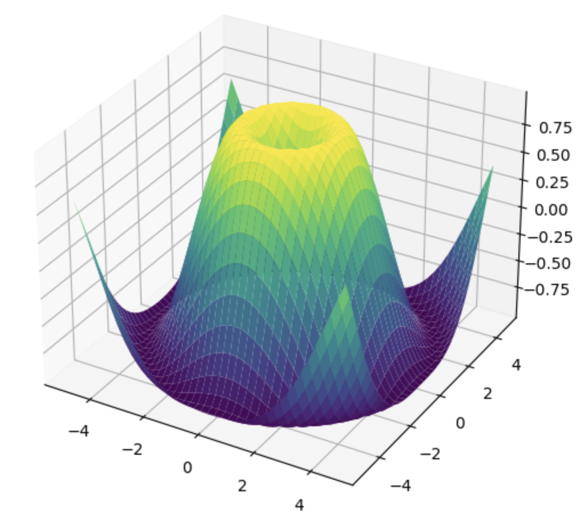

```py
import numpy as np
import matplotlib.pyplot as plt
from matplotlib import cm
from mpl_toolkits.mplot3d import Axes3D

X = np.arange(-5, 5, 0.25)
Y = np.arange(-5, 5, 0.25)
X, Y = np.meshgrid(X, Y)
R = np.sqrt(X**2 + Y**2)
Z = np.sin(R)

fig = plt.figure()
ax = Axes3D(fig, auto_add_to_figure=False)
fig.add_axes(ax)
ax.plot_surface(X, Y, Z, rstride=1, cstride=1, cmap=cm.viridis)

plt.show()
```




## Pie




```py
import numpy as np
import matplotlib.pyplot as plt

fig, ax = plt.subplots(figsize=(6, 3), subplot_kw=dict(aspect="equal"))

data = [375, 75, 250, 300]
ingredients = ["flour", "sugar", "butter", "berries"]

def func(pct, allvals):
  absolute = int(round(pct/100.*np.sum(allvals)))
  return f"{pct:.1f}%\n({absolute:d} g)"


wedges, texts, autotexts = ax.pie(data, autopct=lambda pct: func(pct, data), textprops=dict(color="w"))

ax.legend(wedges, ingredients, title="Ingredients", loc="center left", bbox_to_anchor=(1, 0, 0.5, 1))

plt.setp(autotexts, size=8, weight="bold")

ax.set_title("Matplotlib bakery: A pie")

plt.show()
```




### Heatmap




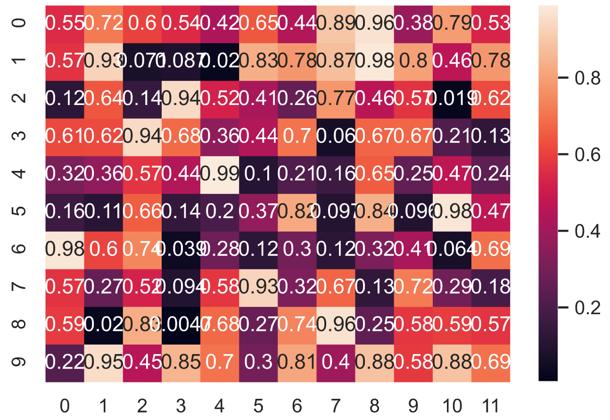
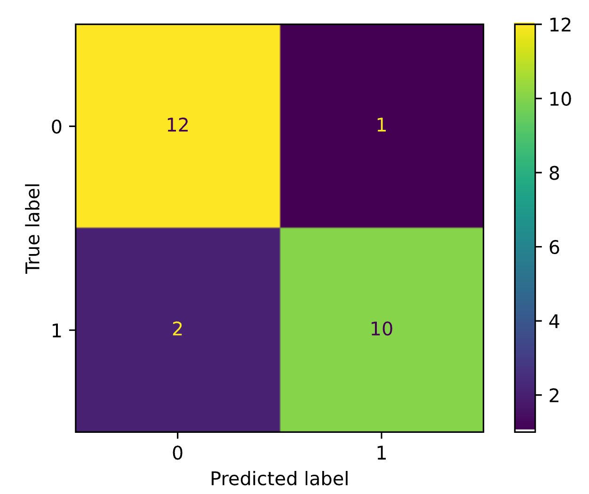

```py
import numpy as np
import seaborn as sns
import matplotlib.pyplot as plt
from sklearn.datasets import make_classification
from sklearn.metrics import plot_confusion_matrix
from sklearn.model_selection import train_test_split
from sklearn.svm import SVC

np.random.seed(0)
sns.set_theme()

# 1. heatmap
uniform_data = np.random.rand(10, 12)
ax = sns.heatmap(uniform_data, annot=True)

# 2. Confusion matrix
X, y = make_classification(random_state=0)
X_train, X_test, y_train, y_test = train_test_split(X, y, random_state=0)
clf = SVC(random_state=0)
clf.fit(X_train, y_train)
SVC(random_state=0)
plot_confusion_matrix(clf, X_test, y_test)
plt.show()
```




## Scatter




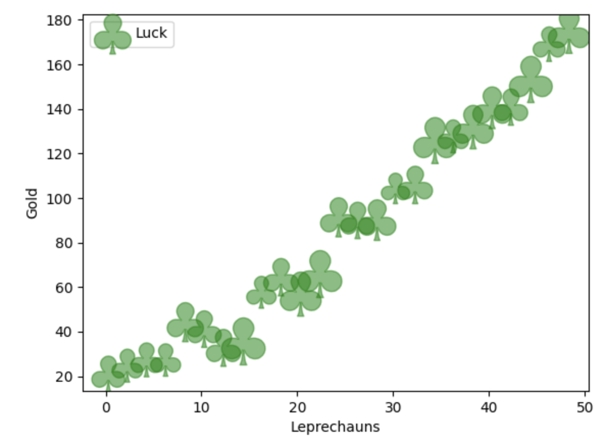

```py
import matplotlib.pyplot as plt
import numpy as np

# Fixing random state for reproducibility
np.random.seed(19680801)


x = np.arange(0.0, 50.0, 2.0)
y = x ** 1.3 + np.random.rand(*x.shape) * 30.0
s = np.random.rand(*x.shape) * 800 + 500

plt.scatter(x, y, s, c="g", alpha=0.5, marker=r'$\clubsuit$', label="Luck")
plt.xlabel("Leprechauns")
plt.ylabel("Gold")
plt.legend(loc='upper left')
plt.show()
```



