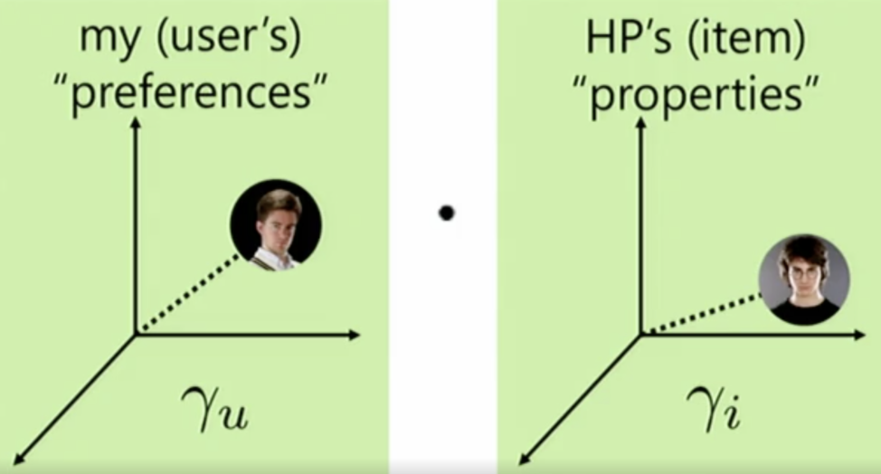

# Recommender System

* Information retrieval
* static content base → invect time in indexing content
* dynamic information need → queries presented in real time
* common approach TFIDF → rank documents by term overlap

* Implicit data: purchase | video viewing | click data
* explicit data: star reviews
* candidate generation | filtering | ranking # What are components of Top-N recommender
* Because people have to search for them.    # Why are older movies rated higher?

> Terms

* Context Aware
  * User may have different preferences under different contexts
  * Users, items, context and user-item interaction data
  * [+] Incorporating more information and fitting the real-world cases better
  * [-] Data availability and sparsity issue

* Session Based
  * User preference changes along with the corresponding session context
  * [+] Considering the user preference evolution, which fits the real-world cases better
  * [-] Ignoring user’s general and long-term preference

> Metrics

* AB Test
  * Ultimate metric

* Churn
  * How quickly does new user behavior influence your recommendations?

* DCG (Discounted Cumulative Gain)
  * NDCG means Normalized Discounted Cumulative Gain
  * penalize lower rank

$$ DCG_{k}=\sum_{r=1}^{k} \frac{rel_{r}}{\log (r+1)}A $$

* Responsiveness: How often do recommendations change?

* Coverage
  * % of <user, item> pairs that can be predicted
  * balance between coverage and accuracy

* Diversity
  * avg similarity between recommendation pairs

* Hit rate
  * hits show users something they found interesting enough to watch on their own already

$$ \frac{hits}{users} $$

* Mean Average Precision

$$ \frac{1}{k} \sum_{i=1}^{k} P_{i}=\frac{1}{k} \sum_{r=1}^{k} r e l_{r} \log \frac{k}{r} $$

* Novelt: mean popularity rank of recommended items
  * how popular the items that you are recommending
  * more obscure items that may lead to serendipitous discovery from the users

* Ranking: Used in ranking algorithm
  * discontinuous and thus non-differentiable

> Terms

| notaion            | meaning                           |
| ------------------ | --------------------------------- |
| $$\Omega_{j}$$     | set of all users who rated item j |
| $$r_{i j}$$        | rating user i gave item j         |
| $$R_{N \times M}$$ | user-item rating matrix           |

## One-class recommendation

* maximize difference in predictions between positive and negative items

| equation                                                                               | meaning                      |
| -------------------------------------------------------------------------------------- | ---------------------------- |
| $$\max \ln \sigma(γ_{u} ⋅ γ_{i}-γ_{u} ⋅ γ_{j})$$                                       | User who likes i, dislikes j |
| $$\sum_{u, i, j}-\ln (1+e^{γ_{u} ⋅ γ_{i}-γ_{u} ⋅ γ_{j}})$$                             | Objective                    |
| $$-\frac{(γ_{jk}-γ_{ik}) e^{γ_{u}⋅γ_{j}-γ_{u}⋅γ_{i}}}{1+e^{γ_{u} γ_{j}-γ_{u} γ_{i}}}$$ | $$\frac{δ obj}{δ γ_{uk}}$$   |

## Latent Factor

| Notation      | Meaning                                         |
| ------------- | ----------------------------------------------- |
| $$\beta_{u}$$ | Does this user give higher ratings than average |
| $$I_{u}$$     | List of items rated by u                        |
| $$U_{i}$$     | List of users who rated i                       |

* Multiple solutions by permuting $γ_u, γ_i$
* [+] as we add data, latent-factor model automatically discover any useful dimensions
* [-] Cannot use with small datasets → Fix i, u alternatively

## Collaborative Filtering

> Item | User Vector

* Doesn’t have personalized recommendation

| Term        | Meaning                                            |
| ----------- | -------------------------------------------------- |
| $$\alpha$$  | average                                            |
| $$\beta_i$$ | Does this item receive higher ratings than average |

* Objective

$$ \arg \min _{α, β} \sum_{i, u}(α+β_{i}+β_{u}-R_{u, i})^{2}+λ[\sum_{i} β_{i}^{2}+\sum_{u} β_{u}^{2}] $$

> Item-item

* Good amount of information of items’ own features, rather than using users’ interactions and feedbacks
* Genre, year, director, actor, textual content of articles extracted by applying NLP

> User-User

* Select top X similar users, take weighted average of ratings from X users with similarities as weights
* Explicit Rating → a rate given by a user to an item on a sliding scale
* Implicit Rating → indirect users preference, such as page views, clicks, purchase records
* [-] If one user purchases one item, this changes ranking of every other item that was purchased
* [-] No use for new users and new items
* [-] Won't necessarily encourage diverse results
