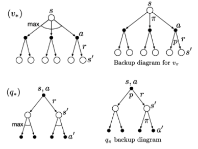
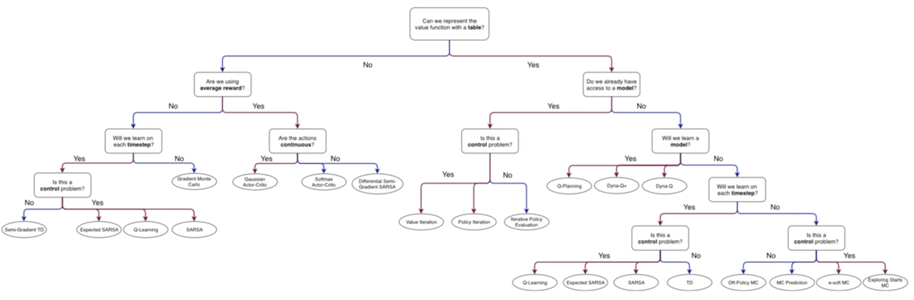
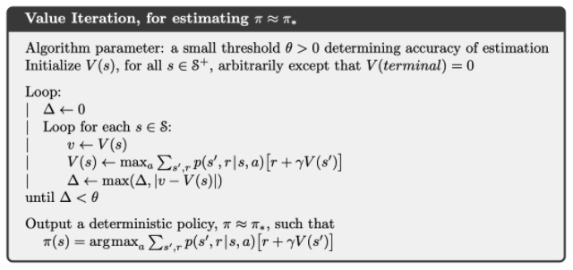

# Vision

* Extracting descriptions of the world from pictures or sequences of pictures
* ambiguous Interpretations: Changing viewpoint, moving light source, deforming the shape
* forward (graphics) well-posed, inverse (vision)
* Should computer vision follow from our understanding of human vision?

* How to solve
  * craft a solution using established methods and tailor them
  * build a math/physical model of the problem and implement algorithms with provably correct properties
  * gather image data, label it, and use machine learning to provide the solution

> Terms

* Throughput: count / second
* Non maximal suppression


```text
while select bounding box with some threshold
  discard any remaining box with IoU >= 0.5 with the box output in previous step
```

* background substitution: subtract from previous frame

* Noise: Impulsive noise randomly pick a pixel and randomly set to a value
  * saturated version is called salt and pepper noise
  * Median filters - completely discard the spike, linear filter always responds to all aspects
  * Quantization effects - often called noise although it is not statistical
  * Unanticipated image structures - also often called noise although it is a real repeatable signal

* Eight point algorithm
  * Set $$ E_33 $$ to 0 and use 8 points to calculate $$ E_11 $$, $$ E_32 $$

$$
[u, v, 1]\left[\begin{array}{ccc}
E_{11} & E_{12} & E_{13} \\
E_{21} & E_{22} & E_{23} \\
E_{31} & E_{32} & E_{33}
\end{array}\right]\left[\begin{array}{c}
u^{\prime} \\
v^{\prime} \\
1
\end{array}\right]=0
$$

* Perspective
  * distant objects appear smaller than nearer objects
  * lines parallel in nature meet at the point at infinity
  * Most realistic because it’s the same way as photographic lenses and the human eye works
  * 1/2/3-point, based on the orientation of the projection plane towards the axes of the depicted object


* Projective geometry
  * provides an elegant means for handling these different situations in a unified way

* Point at Infinity
  * Where w is 0, with homogeneous coordinates

* Projective plane
  * = Euclidean plane ∪ Line at Infinity

> Autmonomous vehicle

* Driving task
  * Perceiving the environment
  * Planning how to reach from point A to B
* Controlling the vehicle
  * Operational Design Domain / Environmental
  * Time of day

* Lateral Control steering
* Longitudinal control braking accelerating
* Object and Event Detection and Response detection, reaction
* Inertial measurement unit
  * Measures a vehicle’s three linear acceleration and rotational rate components

* Level of automation
  * 1: Assistance either, but not both longitudinal control or lateral (e.g. cruise, lane keeping)
  * 2: Both longitudinal control and lateral
  * 3: Includes automated object and event detection and response. Alert in case of failure
  * 4: Can handle emergencies autonomously
  * 5: Unlimited ODD

* Perception
  * Static objects
  * Dynamic objects
  * Ego localization

* Planning
  * Predictive: Make predictions about other vehicles and how they are moving
  * Rule based: Take into account the current state of ego and other objects and give decisions
  * Long term: How to navigate from NY to LA?
  * Short Term: Can I change my lane to lane right? Can I pass this intersection and join the left road?
  * Immediate: Accelerate, brake

## Features

* Harris: large difference with nearby pixel

* Good Features to Track: sorted by value, suppress non-max

* FAST: use nearby 16 pixels, fast than above two

* Feature Pyramid
  

* Anchor: object is assigned to grid cell that contains object's midpoint, anchor box for grid cell with highest IoU
  
  

* CNN: Pixel depend on nearby pixels(locality): small receptive fields
  * Statistics of visual inputs are invariant across image: replicate receptive fields across images
  * Objects don't change based on location: translation invariance, spatial pooling
  * Objects are made of parts: get larger in the net
  * convolutional layer of replicated feature maps
  * Depth allows features of features to be learned which tend to get more abstract in deeper layers
  * Deeper networks are better as long as they allow the gradient to pass backwards easily
  * Reuse a pre-trained network and then add a softmax for categorization or logistic units for tagging
  $$
  W_{\text {out }}=\text { floor }(\frac{W_{\text {in }}+2 \times \text { padding }-\text { dilation } \times(k-1)-1}{\text{stride}})+1
  $$

* Mixture of Gaussian (improved adaptive gaussian mixture model for background subtraction, 2004)
  * Moving average
  * Save memory
    * $$ \alpha $$ weight for current frame (0.01)
  $$ B(x, y, t)=\alpha \cdot I(x, y, t)+(1-\alpha) \cdot B(x, y, t-1) $$

* viola-jones algorithm (Paul Viola and Michael Jones, 2001)
  * trained to detect a variety of object classes, it was motivated primarily by the problem of face detection
  * [+] robust: high detection rate (true-positive rate) & low false-positive rate always
  * [+] Real time: For practical applications at least 2 frames per second must be processed
  * Face detection only (not recognition) - The goal is to distinguish faces from non-faces

```text
Haar Feature Selection (eye, nose)
Creating an Integral Image
Adaboost Training
Cascading Classifiers
```

* haar-like features (Rapid Object Detection using a Boosted Cascade of Simple Features, 2001)
  * edge features, line features, four-rectangle features
  * uses integral of image and adaboost (Cascade of Classifiers) for faster computation

* integral: integral image enables you to rapidly calculate summations over image subregions
  




```cpp
#include "opencv2/gapi.hpp"
#include "opencv2/gapi/core.hpp"
#include "opencv2/gapi/imgproc.hpp"
#include "opencv2/highgui.hpp"
#include "opencv2/videoio.hpp"

using namespace std;

int main(int argc, char* argv[]) {
  /* without compile
  cv::VideoCapture cap;
  CV_Assert(cap.isOpened());
  // BODY OF COMP
  cv::GComputation ac(in_frame, out_frame);
  cv::Mat input_frame;
  cv::Mat output_frame;
  CV_Assert(cap.read(input_frame));
  do {
    ac.apply(input_frame, output_frame);
    cv::imshow("output", output_frame);
  } while (cap.read(input_frame) && cv::waitKey(30) < 0);
  */
  cv::VideoCapture cap("/Users/sean/github/LEARN_C/opencv/data/complex_scene_01.mp4");
  cv::GComputation comp([]() {
    cv::GMat in_frame;
    cv::GMat vga = cv::gapi::resize(in_frame, cv::Size(), 0.5, 0.5);
    cv::GMat gray = cv::gapi::BGR2Gray(vga);
    cv::GMat blurred = cv::gapi::blur(gray, cv::Size(5, 5));
    cv::GMat edges = cv::gapi::Canny(blurred, 32, 128, 3);
    cv::GMat b, g, r;
    tie(b, g, r) = cv::gapi::split3(vga);
    cv::GMat out_frame = cv::gapi::merge3(b, g | edges, r);
    return cv::GComputation(cv::GIn(in_frame), cv::GOut(out_frame));
  });
  int width = static_cast<int>(cap.get(cv::CAP_PROP_FRAME_WIDTH));
  int height = static_cast<int>(cap.get(cv::CAP_PROP_FRAME_HEIGHT));
  cv::Mat in_frame(height, width, CV_8UC3);  // dimension required for compile
  cv::Mat blur_frame;
  auto exec = comp.compile(cv::descr_of(in_frame));
  CV_Assert(cap.read(in_frame));
  do {
    exec(cv::gin(in_frame), cv::gout(blur_frame));
    cv::imshow("output", blur_frame);
  } while (cap.read(in_frame) && cv::waitKey(30) < 0);
  return 0;
}
```




## Epipolar


* Baseline: line connecting two center of projection O and O'
* Epipoles (e, e'): Two intersection points of baseline with image planes
* Epipolar plane: Any plain that contains the baseline
* Epipolar lines: Pair of lines from intersection of an epipolar plane with two image plane

## Colors


* gray: 0 Black - 255 White
  * 1Byte → unsigned char in c++, numpy.uint8 in python

* HSL, HSV

* YUV 4:2:0: requires 4×8+8+8=48 bits per 4 pixels, so its depth is 12 bits per pixel
  * I420 is by far the most common format in VLC

* NV12: commonly found as the native format from various machine vision, and other, video cameras
  * another variant where colour information is stored at a lower resolution than the intensity data
  * intensity (Y) data is stored as 8 bit samples, and colour (Cr, Cb) information as 2x2 subsampled image, known as 4:2:0

* I420: identical to YV12 except that the U and V plane order is reversed

## Object Classification

* [Coco](https://gist.github.com/50e1deaec61bbd28b60bb96cb10ab74d)
  * 80 labels (people, bicycles, cars and trucks, airplanes, stop signs and fire hydrants, animals, kitchens)
  * object detection, segmentation



## Eye

* 1604 Kepler eye as an optical instrument, which image is inverted on retina
* 1625 Scheiner experimented by this idea

* Color is precieved differently by
  * previously seen color
  * neighborhood colors
  * state of mind

* Camera vs Eye
  

| Camera        | Human              |
| ------------- | ------------------ |
| curved retina | wide range of view |
| hard lense    | soft lense         |


| rods                   | cones           |
| ---------------------- | --------------- |
| night (a lot of light) | day             |
| many                   | few             |
| one                    | three(color)    |
| low resolution         | high resolution |

## Recognition

* pose estimation / recognition / segmentation
* feature extraction → classification
* Challnges
  * pose variability (direction, color, shadow), lighting, occlusion
  * within-class variability (articulated, deformable, different shapes and patterns)


* Photometric stereo: Multiple images, static scene, fixed viewpoint, multiple lighting conditions, correspondence trivial

### Pattern matching




```cpp
#include <stdio.h>

#include <iostream>
#include <string>

#include "opencv2/highgui/highgui.hpp"
#include "opencv2/imgproc/imgproc.hpp"

using namespace std;
using namespace cv;

Mat img, templ, result;
string ORIG_WINDOW_NAME = "Source Image", RESULT_WINDOW_NAME = "Result window";

int match_method;
int max_Trackbar = 5;

void MatchingMethod(int, void *);

int main() {
  img = imread("/Users/sean/github/LEARN_C/opencv/data/mario.png", 1);
  templ = imread("/Users/sean/github/LEARN_C/opencv/data/coin.png", 1);

  namedWindow(ORIG_WINDOW_NAME, WINDOW_AUTOSIZE);
  namedWindow(RESULT_WINDOW_NAME, WINDOW_AUTOSIZE);

  string trackbar_label =
      "Method: \n 0: SQDIFF \n 1: SQDIFF NORM \n 2: TM CCORR \n 3: TM CCORR NORM \n 4: TM COEFF \n 5: TM COEFF NORM";
  createTrackbar(trackbar_label, ORIG_WINDOW_NAME, &match_method, max_Trackbar, MatchingMethod);

  MatchingMethod(0, 0);

  waitKey(0);
  return 0;
}

void MatchingMethod(int, void *) {
  Mat orig;
  img.copyTo(orig);

  result.create(img.cols - templ.cols + 1, img.rows - templ.rows + 1, CV_32FC1);

  matchTemplate(img, templ, result, match_method);
  normalize(result, result, 0, 1, NORM_MINMAX, -1, Mat());

  double minVal, maxVal;
  Point minLoc, maxLoc, matchLoc;

  minMaxLoc(result, &minVal, &maxVal, &minLoc, &maxLoc, Mat());

  if (match_method == TM_SQDIFF || match_method == TM_SQDIFF_NORMED)
    matchLoc = minLoc;
  else
    matchLoc = maxLoc;

  rectangle(orig, matchLoc, Point(matchLoc.x + templ.cols, matchLoc.y + templ.rows), Scalar::all(0), 2, 8, 0);
  rectangle(result, matchLoc, Point(matchLoc.x + templ.cols, matchLoc.y + templ.rows), Scalar::all(0), 2, 8, 0);

  imshow(ORIG_WINDOW_NAME, orig);
  imshow(RESULT_WINDOW_NAME, result);

  return;
}
```




### Tracking

| Term                                                          | Meaning                                |
| ------------------------------------------------------------- | -------------------------------------- |
| $$ \varphi(t) $$                                              | Finite number of parameters            |
| $$ \hat\varphi(t) $$                                          | Dynamic                                |
| $$ \varphi_p(t + 1) $$                                        | Estimate using parameters and dynamics |
| $$ \varphi_{c}(t+1)=f\left(\varphi_{p}(t+1), M(t+1)\right) $$ | Correction update the state            |

* [MOT](https://motchallenge.net/results/MOT17)

> SFM

* Given two or more images or video without any information on camera position/motions as input
* estimate camera motion and 3D structure of a scene
* Discrete motion (wide baseline)
* Continuous (Infinitesimal) motion usually from video

* 2 \* M \* N measurements
* 3 * N unknowns for points
* (M - 1) * 6 unknowns for cameras
  * Affix world coordinate system to location of first camera frame
  * 3 rotation, 3 translation
* Can only recover structure and motion up to scale factor (one fewer unknown)
* (M - 1) \* 6 + e \* N - 1 ≤ 2 \* M \* N (M = 2, N = 5 or M = 3, N = 4)




```cpp
#include <opencv2/core/ocl.hpp>
#include <opencv2/opencv.hpp>
#include <opencv2/tracking.hpp>

using namespace cv;
using namespace std;

#define SSTR(x) (ostringstream() << std::dec << x).str()

int main(int argc, char **argv) {
  string trackerTypes[8] = {"BOOSTING",   "MIL",    "KCF",   "TLD",
                            "MEDIANFLOW", "GOTURN", "MOSSE", "CSRT"};  // tracker types in 3.4.1
  string trackerType = trackerTypes[2];
  Ptr<Tracker> tracker;

  if (trackerType == "BOOSTING") tracker = TrackerBoosting::create();
  if (trackerType == "MIL") tracker = TrackerMIL::create();
  if (trackerType == "KCF") tracker = TrackerKCF::create();
  if (trackerType == "TLD") tracker = TrackerTLD::create();
  if (trackerType == "MEDIANFLOW") tracker = TrackerMedianFlow::create();
  if (trackerType == "GOTURN") tracker = TrackerGOTURN::create();
  if (trackerType == "MOSSE") tracker = TrackerMOSSE::create();
  if (trackerType == "CSRT") tracker = TrackerCSRT::create();
  VideoCapture video(0);

  if (!video.isOpened()) {
    cout << "Could not read video file" << endl;
    return 1;
  }

  Mat frame;
  bool ok = video.read(frame);

  Rect2d bbox(500, 100, 300, 320);

  // Uncomment the line below to select a different bounding box
  // bbox = selectROI(frame, false);
  rectangle(frame, bbox, Scalar(255, 0, 0), 2, 1);

  imshow("Tracking", frame);
  tracker->init(frame, bbox);

  while (video.read(frame)) {
    double timer = (double)getTickCount();
    bool ok = tracker->update(frame, bbox);
    float fps = getTickFrequency() / ((double)getTickCount() - timer);
    if (ok)
      rectangle(frame, bbox, Scalar(255, 0, 0), 2, 1);
    else
      putText(frame, "Tracking failure detected", Point(100, 80), FONT_HERSHEY_SIMPLEX, 0.75, Scalar(0, 0, 255), 2);

    putText(frame, trackerType + " Tracker", Point(100, 20), FONT_HERSHEY_SIMPLEX, 0.75, Scalar(50, 170, 50), 2);
    putText(frame, "FPS : " + SSTR(fps), Point(100, 50), FONT_HERSHEY_SIMPLEX, 0.75, Scalar(50, 170, 50), 2);
    imshow("Tracking", frame);

    int k = waitKey(1);
    if (k == 27) break;
  }
}
```




```py
import cv2
import sys

(major_ver, minor_ver, subminor_ver) = (cv2.__version__).split('.')

tracker_types = ['BOOSTING', 'MIL', 'KCF', 'TLD', 'MEDIANFLOW', 'GOTURN', 'MOSSE', 'CSRT']
tracker_type = tracker_types[2]

if tracker_type == 'BOOSTING':
  tracker = cv2.TrackerBoosting_create()
if tracker_type == 'MIL':
  tracker = cv2.TrackerMIL_create()
if tracker_type == 'KCF':
  tracker = cv2.TrackerKCF_create()
if tracker_type == 'TLD':
  tracker = cv2.TrackerTLD_create()
if tracker_type == 'MEDIANFLOW':
  tracker = cv2.TrackerMedianFlow_create()
if tracker_type == 'GOTURN':
  tracker = cv2.TrackerGOTURN_create()
if tracker_type == 'MOSSE':
  tracker = cv2.TrackerMOSSE_create()
if tracker_type == "CSRT":
  tracker = cv2.TrackerCSRT_create()

video = cv2.VideoCapture(0)
if not video.isOpened():
  print("Could not open video")
  sys.exit()

ok, frame = video.read()
if not ok:
  print('Cannot read video file')
  sys.exit()

# Define an initial bounding box
bbox = cv2.selectROI(frame, False)
ok = tracker.init(frame, bbox)  # Initialize tracker with first frame and bounding box

while True:
  ok, frame = video.read()
  if not ok:
    break

  timer = cv2.getTickCount()
  ok, bbox = tracker.update(frame)
  fps = cv2.getTickFrequency() / (cv2.getTickCount() - timer)
  if ok:
    p1 = (int(bbox[0]), int(bbox[1]))
    p2 = (int(bbox[0] + bbox[2]), int(bbox[1] + bbox[3]))
    cv2.rectangle(frame, p1, p2, (255, 0, 0), 2, 1)
  else:  # Tracking failure
    cv2.putText(frame, "Tracking failure detected", (100, 80), cv2.FONT_HERSHEY_SIMPLEX, 0.75, (0, 0, 255), 2)

  cv2.putText(frame, tracker_type + " Tracker", (100, 20), cv2.FONT_HERSHEY_SIMPLEX, 0.75, (50, 170, 50), 2)
  cv2.putText(frame, "FPS : " + str(int(fps)), (100, 50), cv2.FONT_HERSHEY_SIMPLEX, 0.75, (50, 170, 50), 2)
  cv2.imshow("Tracking", frame)
  k = cv2.waitKey(1) & 0xff
  if k == 27:
    break
```




## Processing

### Filtering


* The most common filters are linear filters and the process of applying a linear filter is called convolution
* For convolution kernel is flipped over both axis unlike correlation
* Any linear, shift-invariant operator can be represented as a convolution

* Enhance images: Denoise, resize, increase contrast
* Extract information from images: Texture, edges, distinctive points, etc
* Detect pattern: template matching

* Blur
  

* Sharpen
  

* CNN: Convolutional Neural Networks Weights of the CNN are learned
  * Can be extended to RGB, Volumetric data such as MRI, CT

> Question: Smoothing an image with an average filter and then convolving with a derivative filter will give better results
  than first convolving with a derivative filter and then smoothing with an average filter

* False. Convolution is commutative, so it will give the same result




```cpp
#include <chrono>
#include <iostream>

#include "opencv2/highgui/highgui.hpp"
#include "opencv2/imgproc/imgproc.hpp"

using namespace cv;
using namespace std;
using namespace std::chrono;

// 1. Blur in parrallel
class ParallelProcess : public cv::ParallelLoopBody {
 private:
  cv::Mat img;
  cv::Mat &retVal;
  int size;
  int n_thread;

 public:
  ParallelProcess(cv::Mat inputImgage, cv::Mat &outImage, int size, int n_thread)
      : img(inputImgage), retVal(outImage), size(size), n_thread(n_thread) {}

  virtual void operator()(const cv::Range &range) const {
    for (int i = range.start; i < range.end; i++) {
      cv::Mat in(img, cv::Rect(0, (img.rows / n_thread) * i, img.cols, img.rows / n_thread));
      cv::Mat out(retVal, cv::Rect(0, (retVal.rows / n_thread) * i, retVal.cols, retVal.rows / n_thread));

      cv::medianBlur(in, out, size);
    }
  }
};

int main() {
  VideoCapture cap(0);

  cv::Mat img, out;

  for (int n_thead = 1; n_thead < 100; n_thead++) {
    auto start1 = high_resolution_clock::now();
    for (int i = 0; i < 1000; i++) {
      cap.read(img);
      out = cv::Mat::zeros(img.size(), CV_8UC3);

      cv::parallel_for_(cv::Range(0, 8), Parallel_process(img, out, 31, 10));

      cv::imshow("blur", out);
      cv::waitKey(1);
    }
    auto stop1 = high_resolution_clock::now();
    auto duration1 = duration_cast<microseconds>(stop1 - start1);
    cout << "TBB Time: " << duration1.count() / 1000 << "ms" << endl;
  }

  return 0;
}
```




```py
from collections import deque
from multiprocessing.pool import ThreadPool

import cv2

VIDEO_PATH = "/Users/sean/github/data/video"

def process_frame(frame):
  frame = cv2.medianBlur(frame, 19)
  return frame

cap = cv2.VideoCapture(f"{VIDEO_PATH}/sd_sample_03.mp4")
thread_num = cv2.getNumberOfCPUs()
pool = ThreadPool(processes=thread_num)
pending_task = deque()

while True:
  while len(pending_task) > 0 and pending_task[0].ready():
    res = pending_task.popleft().get()
    cv2.imshow('threaded video', res)

  if len(pending_task) < thread_num:
    frame_got, frame = cap.read()
    if frame_got:
      task = pool.apply_async(process_frame, (frame.copy(),))
      pending_task.append(task)

  if cv2.waitKey(1) == 27 or not frame_got:
    break

cv2.destroyAllWindows()
```




## Segmentation


* process of dividing an image into connected regions st pixels within a region share certain characteristics
* Boundaries or edges divide segmented regions
* Single short multibox detector: 74.3 mAP, 59 FPS

> Term

* tessellation: aka tiling of flat surface is covering of plane using 1+ tiles, with no overlaps and no gaps
  

> Solution

* Faster R-CNN: 73.2 mAP, 7 FPS
* Darknet: 19 convolutional layers and 5 maxpooling layers
* Tiny Yolo: 23.7mAP, 244FPS

### YOLO


* v1
  * 74.3mAP, 59FPS
  * 49 objects / Relatively high localization error

* v2
  * Classification and prediction in a single framework
  * Batch Normalization
  * classifier network at 224×224, Increase in image size 448*448
  * divides into 13 * 13 grid cells → finegrand feature
  * Multi-scale training
  * Anchor boxes

* Yolo v3 (J Redmon, 2018)
  * 0 normalized 416 (320, 608) RGB input → [(507, 85), (2028, 85), (8112, 85)]

> mask-RCNN (Mask R-CNN, He 2017)

* Faster R-CNN + FCN





```cpp
// 1. Yolo
// terminate called after throwing an instance of 'std::logic_error'
//   what():  Computation's output protocol doesn't match actual arguments!
// Aborted (core dumped)
// -> output format doesn't match in exec
cv::GComputation comp([ot]() {
  cv::GMat in_frame;
  cv::GMat detections = cv::gapi::infer<custom::Objects>(in_frame);
  cv::GArray<pz::DetectedObject> detected_objects = custom::Yolov2PostProc::on(detections, in_frame, in_is_tiny);
  cv::GArray<vas::ot::Object> tracked_objects = custom::vas_ot::on(ot, in_frame, detected_objects);
  cv::GMat out_frame = cv::gapi::copy(in_frame);
  return cv::GComputation(cv::GIn(in_frame, in_is_tiny), cv::GOut(out_frame, tracked_objects));
});
auto exec = comp.compile(cv::descr_of(in_frame), cv::descr_of(is_tiny), cv::compile_args(kernels, networks));
exec(cv::gin(in_frame), cv::gout(out_frame));

// what():  OpenCV(4.3.0-openvino-2020.3.0) ~/intel/openvino/opencv/include/opencv2/gapi/garray.hpp:227:
// error: (-215:Assertion failed) sizeof(T) == m_ref->m_elemSize in function 'check'
// -> output format doesn't match
cv::GComputation comp([ot]() {
  cv::GMat in_frame;
  cv::GArray<vas::ot::Object> tracked_objects = custom::vas_ot::on(ot, in_frame, detected_objects);
  return cv::GComputation(cv::GIn(in_frame, in_is_tiny), cv::GOut(out_frame, tracked_objects));
});
auto exec = comp.compile(cv::descr_of(in_frame), cv::descr_of(is_tiny), cv::compile_args(kernels, networks));
std::vector<int> ints;
exec(cv::gin(in_frame), cv::gout(out_frame, ints));

// terminate called after throwing an instance of 'std::logic_error'
//  what():  Computation output 2 is not a result of any operation
// Aborted (core dumped)
// -> output foramt doesn't match
```




### Voroni Diagram

* partition of a plane into regions close to each of a given set of objects


## Streaming

> Lossy count algorithm

* Identify elements in a data stream whose frequency count exceed a threshold (ranking)

* Step 1: Divide incoming data stream into buckets of width  w = 1 / e, where e is mentioned by user as error bound
  * along with minimum support threshold = σ
* Step 2: Increment the frequency count of each item according to the new bucket values
  * After each bucket, decrement all counters by 1
* Step 3: Repeat – Update counters and after each bucket, decrement all counters by 1

## Upsampling



## Reinforcement Learning

> Terms

* Tasks

```sh
Episodic Tasks    # Interaction breaks into episodes, which end with a terminal state.
Continuing Tasks  # Interaction goes on continually without terminal state.
```

* Policy
  * Target: One we are learning
  * Behavior: One we are choosing action from

* Generalized policy iteration (GPI)
  * interaction between policy-evaluation and policy improvement

* Planning
  * any process that takes input model, and improves a policy

* Backup Diagram

| Notation  | Term                                                                         |
| --------- | ---------------------------------------------------------------------------- |
| K         | Number of actions                                                            |
| t         | Discrete time step                                                           |
| qk(a)     | Expected value of action a                                                   |
| Qt(a)     | Estimate at time t of q*(a)                                                  |
| πt(a)     | Probability of selecting action a at time t                                  |
| ρt        | importance sampling ratio for time t                                         |
| δt        | TD Error at time t Rt+1 γV(St+1) - V(St)                                     |
| d         | dimensionality—the number of components of w                                 |
| v̂(s, w)   | approximate value of state s given weight vector w (Σwixi(s), or neural net) |
| b(a \| s) | Behavior policy used to select actions while learning about target policy π  |



### RL Model



* Actor critic

```text
Input:
  Differentiable policy parameterization π(a | s, θ)
  Differentiable state-value function parameterization v̂(s, w)
Initialize:
  R̄ ∈ R to 0
  State-value weights w ∈ Rd and policy parameter θ ∈ Rd (e.g. to 0)
  Algorithm parameters: αw > 0, αθ > 0, αR̄ > 0
  S ∈ S
Loop:
  A ~ π( · | S, θ)
  Take action A, observe S’, R
  δ ← R - R̄ + v̂(S’, w) - v̂(S, w)
  R̄ ← R̄ + αR̄δ
  w ← w + αw δ ∇ v̂(S, w)
  θ ← θ + αθ δ ∇ln π(A | S, θ)
  S ← S’
```

* Dyna

```text
# Q+
Initialize:
  Q(s, a) and Model(s, a) for all s 2 S and a 2 A(s)
Loop forever:
  S ← current (nonterminal) state
  A ← e-greedy(S, Q)
  Take action A: observe resultant reward, R, and state, S'
  Q(S, A) ← Q(S, A) + α [R + γ maxaQ(S', a) - Q(S, A)]
  Model(S, A) ← R, S'
  Loop repeat n times:
    S ← random previously observed state
    A ← random action previously taken in S
    R, S' ← Model(S, A)
    Q(S, A) ← Q(S, A) + α[(R + κτ0.5) + R + γ maxaQ(S', a) - Q(S, A)]
```

* Monte Carlo

```text
# e-soft
Input : a policy π to be evaluated, ε > 0
Initialize:
  π ← an arbitrary ε-soft policy
  Q(s, a) ∈ R (arbitrarily) for all s ∈ S, a ∈ A(s)
  Returns(s, a) ← an empty list, for all s ∈ S, a ∈ A(s).
Loop:
  Generate an episode from S0, A0, following π : S0, A0, R1, …, ST-1, AT-1, RT
  G ← 0
  Loop for each step of episode, t = T - 1, T - 2, ..., 0:
    G ← γG + Rt+1
    Append G to Returns(St, At)
    Q(St, At) ← average(Returns(St, At))
    A* ← argmaxa Q(St, a)
    For all a ∈ A(St):


# Exploring start
Initialize:
  π(s) ∈ A(s)  (arbitrarily), for all s ∈ S.
  Q(s, a) ∈ R (arbitrarily), for all s ∈ S, a ∈ A(s).
  Returns(s, a) ← an empty list, for all s ∈ S, a ∈ A(s).
Loop:
  Choose S0 ∈ S, A0 ∈ A(S0) randomly s.t. all pairs have probability > 0
  Generate an episode from S0, A0, following π : S0, A0, R1, …, ST-1, AT-1, RT
    G ← return that follows the first occurence of s, a
    Append G to Returns(s, a)
    Q(s, a) ← average(Returns(s, a))
    For each s in the episode:
      π(s) ← argmaxa Q(s, a)

# Off-policy
Input:
  an arbitrary target policy π
Initialize, for all s ∈ S, a ∈ A(s):
  Q(s, a) ← arbitrary
  C(s, a) ← 0
Repeat:
  b ← any policy with coverage of π
  Generate an episode using b:
  S0, A0, R1, …, ST - 1, AT - 1, RT, ST
  G ← 0
  W ← 1
  For t = T - 1, T - 2, … down to 0:
    G ← γG + Rt+1
    C(St, At) ← C(St, At) + W
    Q(St, At) ← Q(St, At) + W | C(St, At) [G - Q(St, At)]
    W ← W π(At|St) | b(At|St)
    If W = 0 then exit For loop

# Prediction
Initialize:
  π ← policy to be evaluated
  V ← an arbitrary state-value function
  Returns(s) ← an empty list, for all s ∈ S
Repeat forever:
  Generate an episode using π
  For each state s appearing in the episode:
    G ← the return that follows the first occurrence of s
    Append G to Returns(s)
    V (s) ← average(Returns(s))
```

* Value Iteration



* Policy Iteration


* SARSA

```text
# Differential Semi-G
Initialize state S, and action A
Loop for each step:
  Take action A, observe R, S’
  Choose A’ as a function of q̂(S’, ·, w) (e.g. ε-greedy)
  δ ← R - R̄+ q̂(S’, A’, w) - q̂(S, A, w)
  R̄ ← R̄ + β δ
  w ← w + αδ ∇q̂(S, A, w)
  S ← S’
  A ← A’

# Expected
Loop for each episode:
  Initialize S
  Choose A from S using policy derived from Q (e.g. ε-greedy)
  Loop for each step of episode:
    Take action A, observe R, S’
    Choose A’ from S’ using policy derived Q (e.g. ε-greedy)
    Q(S, A) ← Q(S, A) + α[R + γQ(S’, A’) - Q(S, A)]
    Q(S, A) ← Q(S, A) + α[R + γΣaπ(a | St+1)Q(St+1, a) - Q(St, At)]
    S ← S’; A ← A’;
  until S is terminal
```

* Q Learning

```text
Initialize:
  Q(s, a) = random, for all s ∈ S, a ∈ A(s)
  Q(terminal, *) = 0
Loop:
  Initialize S
  Loop for each step of episode:
    Choose A from S using policy derived from Q (e.g. e-greedy)
    Take action A, observe R, S'
    Q(S, A) ← Q(S, A) + α [R + γ maxa Q(S', a) - Q(S, A)]
    S ← S'
  until S is terminal
```

* Q planning

```text
Loop:
  Select a state, S ∈ S, and an action, a ∈ A(s) at random
  Send s, a to a sample model, and obtain a sample next reward, R, and a sample next state, S'
  Apply one-step tabular Q-learning to S, A, R, S'
    Q(S, A) ← Q(S, A) + α[ R + γmaxaQ(S', a) - Q(S, A)]
```

* TD0

```text
Input:
  policy π to be evaluated, step size α
Initialize:
  V(s), for all s ∈ S+, arbitrarily except that V(terminal) = 0
Loop for each episode:
  Initialize S
  Loop for each step of episode:
    A ← action given by π for S
    Take action A, observer R, S'
    V(S) ← V(S) + α[R + γV(s') - V(S)]
    S ← S'
  until S is terminal

# Semi-Gradient
Loop for each episode:
  Initialize S
  Loop for each step of episode:
    Choose A ~ π(*|S)
    Take action A, observe R, S'
    w ← w + α[R + γ v̂(S', w) - v̂(S, w)] Δv̂(S, w)
    S ← S'
until S is terminal
```
