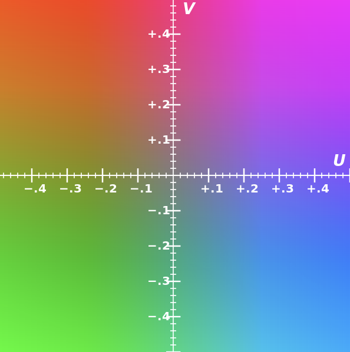
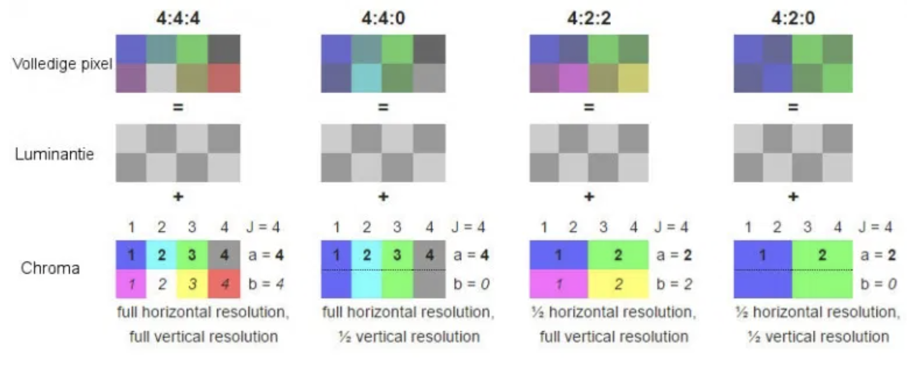

# Vision

* Extracting descriptions of the world from pictures or sequences of pictures
* ambiguous Interpretations: Changing viewpoint, moving light source, deforming the shape
* forward (graphics) well-posed, inverse (vision)
* Should computer vision follow from our understanding of human vision?

> Terms

* Calibration: With P1, ..., Pn with known 3D position and pixel coordinates q1, ..., qn, find K and $$ { }_{w}^{c} T $$

* Throughput: count / second
* Non maximal suppression
  

* Background substitution: subtract from previous frame

* Noise: Impulsive noise randomly pick a pixel and randomly set to a value
  * saturated version is called salt and pepper noise
  * Median filters - completely discard the spike, linear filter always responds to all aspects
  * Quantization effects - often called noise although it is not statistical
  * Unanticipated image structures - also often called noise although it is a real repeatable signal

* Eight point algorithm
  * Set $$ E_33 $$ to 0 and use 8 points to calculate $$ E_11 $$, $$ E_32 $$

  $$
  [u, v, 1]\left[\begin{array}{ccc}
  E_{11} & E_{12} & E_{13} \\
  E_{21} & E_{22} & E_{23} \\
  E_{31} & E_{32} & E_{33}
  \end{array}\right]\left[\begin{array}{c}
  u^{\prime} \\
  v^{\prime} \\
  1
  \end{array}\right]=0
  $$

* Perspective: distant objects appear smaller than nearer objects
  * lines parallel in nature meet at the point at infinity
  * Most realistic because it’s the same way as photographic lenses and the human eye works
  * 1/2/3-point, based on the orientation of the projection plane towards the axes of the depicted object
  

* Projective geometry: provides an elegant means for handling these different situations in a unified way

* Point at Infinity: Where w is 0, with homogeneous coordinates

* Projective plane
  * = Euclidean plane ∪ Line at Infinity

* OpenCV: height, width, channel, BGR color
  * time: frame decoding + time to render the bounding boxes, labels, and to display the results
  * Version
    * 2009 Opencv 2.0: convert to c++, mat class
    * 2011 Opencv 2.3: import cv2
    * 2015 Opencv 3.0: GPU(T-API)
    * 2017 Opencv 3.3: DNN
  * opencv: core, widely used (highgui, imgproc ...)
  * opencv_contirb: brand new, non-free, HW dependency (datasets, cnn_3dobj …)

> Example

* How to solve
  * craft a solution using established methods and tailor them
  * build a math/physical model of the problem and implement algorithms with provably correct properties
  * gather image data, label it, and use machine learning to provide the solution




* OpenCV
  * compile command: g++ 00_video.cpp `pkg-config --cflags --libs opencv4`
  * moveWindow(wn, x, y): only works if WINDOW_NORMAL, ignore header
  * imshow(filename, img) → None: if int32 // 255, if float * 255, create namedWindow()
  * setWindowProperty("slides")
  * namedWindow(wn, WINDOW_AUTOSIZE): WINDOW_NORMAL (video → window)
  * destroyWindow(wn) / destroyAllWindows(): Destroy window
  * waitKey(delay=None) → -1 | ord(key'): 27 (ESC), 13(ENTER), 9(TAB), ← (123), delay=-1 ∞
  * WND_PROP_FULLSCREEN, WINDOW_FULLSCREEN: Full size

```cpp
#include <iostream>
#include <map>

#include "opencv2/highgui/highgui.hpp"
#include "opencv2/imgproc/imgproc.hpp"

using namespace std;
using namespace cv;

int main() {
  Mat img(Size(2, 3), CV_64FC1);  // Greyscale image
  img.setTo(cv::Scalar(100.0));   // fill all with 255
  img.at<double>(1, 1) = 255.5;
  Mat row = img.row(1);  // [100, 255]

  double min, max;
  Point min_loc, max_loc;
  minMaxLoc(img, &min, &max, &min_loc, &max_loc);
  cout << max_loc;  // [1, 1]

  cout << img.reshape(img.rows * img.cols, 1);  // [6, 1]

  struct ComparePoints {
      bool operator () (const cv::Point& a, const cv::Point& b) const {
          return (a.x < b.x) || (a.x == b.x && a.y < b.y);
      }
  };
  map<cv::Point, int, ComparePoints> point2count;
  point2count[min_loc]++;
}
```




* OpenCV
  * isOpened() → bool
  * open()
  * get()
  * CAP_FRAME_WIDTH  / HEIGHT
  * CAP_PROP_FPS / FRAME_COUNT: Frame per count
  * CAP_PROP_POS_MSEC / EXPOSURE: current milisecond
  * set() / read()
  * grab() / retrieve()/ release()
  * VideoCapture(fname, apiPreference) → retval

```py
# 1. Non maximal supression
while select bounding box with some threshold
  discard any remaining box with IoU >= 0.5 with the box output in previous step
```











## Autmonomous vehicle

* Driving task: Perceiving the environment, Planning how to reach from point A to B
* Controlling the vehicle: Operational Design Domain / Environmental, Time of day

* Lateral Control steering
* Longitudinal control braking accelerating
* Object and Event Detection and Response detection, reaction
* Inertial measurement unit
  * Measures a vehicle’s three linear acceleration and rotational rate components

* Level of automation
    1. Assistance either, but not both longitudinal control or lateral (e.g. cruise, lane keeping)
    2. Both longitudinal control and lateral
    3. Includes automated object and event detection and response. Alert in case of failure
    4. Can handle emergencies autonomously
    5. Unlimited ODD

* Perception
  * Static objects
  * Dynamic objects
  * Ego localization

* Planning
  * Predictive: Make predictions about other vehicles and how they are moving
  * Rule based: Take into account the current state of ego and other objects and give decisions
  * Long term: How to navigate from NY to LA?
  * Short Term: Can I change my lane to lane right? Can I pass this intersection and join the left road?
  * Immediate: Accelerate, brake

## Visual Feature

* Harris: large difference with nearby pixel
* Good Features to Track: sorted by value, suppress non-max
* FAST: use nearby 16 pixels, fast than above two
* SIFT: Shi-Tomasi Corner Detector takes (Gaussian std, window size, threshold)
  * [+] Translation, scale, rotation-invariant
  * [-] strong illumination changes, Large out-of-plane rotations
  * [-] non-rigid deformations or articulations semantic correspondence
  * [ex] Panorama, stitching, 3D reconstruct, motion track, object recognition, DB indexing retrieval, robot navigation

* Feature Pyramid
  

* Anchor: object is assigned to grid cell that contains object's midpoint, anchor box for grid cell with highest IoU
  
  

* CNN: Pixel depend on nearby pixels(locality): small receptive fields
  * Statistics of visual inputs are invariant across image: replicate receptive fields across images
  * Objects don't change based on location: translation invariance, spatial pooling
  * Objects are made of parts: get larger in the net
  * convolutional layer of replicated feature maps
  * Depth allows features of features to be learned which tend to get more abstract in deeper layers
  * Deeper networks are better as long as they allow the gradient to pass backwards easily
  * Reuse a pre-trained network and then add a softmax for categorization or logistic units for tagging
  $$
  W_{\text {out }}=\text { floor }(\frac{W_{\text {in }}+2 \times \text { padding }-\text { dilation } \times(k-1)-1}{\text{stride}})+1
  $$

* Mixture of Gaussian (improved adaptive gaussian mixture model for background subtraction, 2004)
  * Moving average
  * Save memory
    * $$ \alpha $$ weight for current frame (0.01)
  $$ B(x, y, t)=\alpha \cdot I(x, y, t)+(1-\alpha) \cdot B(x, y, t-1) $$

* viola-jones algorithm (Paul Viola and Michael Jones, 2001)
  * trained to detect a variety of object classes, it was motivated primarily by the problem of face detection
  * [+] robust: high detection rate (true-positive rate) & low false-positive rate always
  * [+] Real time: For practical applications at least 2 frames per second must be processed
  * Face detection only (not recognition) - The goal is to distinguish faces from non-faces

* haar-like features (Rapid Object Detection using a Boosted Cascade of Simple Features, 2001)
  * edge features, line features, four-rectangle features
  * uses integral of image and adaboost (Cascade of Classifiers) for faster computation
  1. Haar Feature Selection (eye, nose)
  1. Creating an Integral Image
  1. Adaboost Training
  1. Cascading Classifiers

* integral: integral image enables you to rapidly calculate summations over image subregions
  




```cpp
#include "opencv2/gapi.hpp"
#include "opencv2/gapi/core.hpp"
#include "opencv2/gapi/imgproc.hpp"
#include "opencv2/highgui.hpp"
#include "opencv2/videoio.hpp"

using namespace std;

int main(int argc, char* argv[]) {
  /* without compile
  cv::VideoCapture cap;
  CV_Assert(cap.isOpened());
  // BODY OF COMP
  cv::GComputation ac(in_frame, out_frame);
  cv::Mat input_frame;
  cv::Mat output_frame;
  CV_Assert(cap.read(input_frame));
  do {
    ac.apply(input_frame, output_frame);
    cv::imshow("output", output_frame);
  } while (cap.read(input_frame) && cv::waitKey(30) < 0);
  */
  cv::VideoCapture cap("/Users/sean/github/LEARN_C/opencv/data/complex_scene_01.mp4");
  cv::GComputation comp([]() {
    cv::GMat in_frame;
    cv::GMat vga = cv::gapi::resize(in_frame, cv::Size(), 0.5, 0.5);
    cv::GMat gray = cv::gapi::BGR2Gray(vga);
    cv::GMat blurred = cv::gapi::blur(gray, cv::Size(5, 5));
    cv::GMat edges = cv::gapi::Canny(blurred, 32, 128, 3);
    cv::GMat b, g, r;
    tie(b, g, r) = cv::gapi::split3(vga);
    cv::GMat out_frame = cv::gapi::merge3(b, g | edges, r);
    return cv::GComputation(cv::GIn(in_frame), cv::GOut(out_frame));
  });
  int width = static_cast<int>(cap.get(cv::CAP_PROP_FRAME_WIDTH));
  int height = static_cast<int>(cap.get(cv::CAP_PROP_FRAME_HEIGHT));
  cv::Mat in_frame(height, width, CV_8UC3);  // dimension required for compile
  cv::Mat blur_frame;
  auto exec = comp.compile(cv::descr_of(in_frame));
  CV_Assert(cap.read(in_frame));
  do {
    exec(cv::gin(in_frame), cv::gout(blur_frame));
    cv::imshow("output", blur_frame);
  } while (cap.read(in_frame) && cv::waitKey(30) < 0);
  return 0;
}
```




### Coresspondence

> Question

* ambiguity (2-1 matching), multiple interpretation
* Half occluded image
  
* Window shape
  

* What does random dot stereogram tell us about the human visual system
  * Human visual feature doesn't do traditional feature based matching but dense area matching to identify objects
* Rank, census, Sum of Absolute difference, zero mean SAD

> Term

* Feature-based: process each image monocularly to detect image features (corners or SIFT)
* Area-based: Directly compare image regions between the two images
* Normalized cross correlation
  * $$ \overline{W_{i}}=\frac{1}{n} ∑_{x, y} W_{i} $$
  * $$ \quad \sigma_{W_{i}}=\sqrt{\frac{1}{n} ∑_{x, y}(W_{i}-\overline{W_{i}})^{2}} $$
  * $$ \frac{\sum_{x, y}(W_{1}(x, y)-\bar{W}_{1})(W_{2}(x, y)-\bar{W}_{2})}{δW_{1} \cdot δW_{2}} $$
* Sum of squared distance
  * $$ \sum_{x=y}|W_{1}(x, y)-W_{2}(x, y)|^{2} $$




```py
# O(nrows, * ncols * disparities * winx * winy)
for i in range(1, nrows):
  for j in range(1, ncols):
    best(i, j) = -1
    for k in range(min_disparity, max_disparity):
      c = Match_Metric(I1, (i, j), I2(i, j + k), winsize)
      if c > best(i, j):
        best(i, j) = c
        disparities(i, j) = k
```




## Epipolar


* Baseline: line connecting two center of projection O and O'
* Epipoles (e, e'): Two intersection points of baseline with image planes
* Epipolar plane: Any plain that contains the baseline
* Epipolar lines: Pair of lines from intersection of an epipolar plane with two image plane

## Color Encoding


* gray: 0 Black - 255 White
  * 1Byte → unsigned char in c++, numpy.uint8 in python

* HSL, HSV

* YUV: Y'=luma component, U=blue projection, V=red projection
  * YCbCr: Cb=Chrominance blue, Cr=Chrominance red
  * YPbPr: difference between blue and luma (B − Y), difference between red and luma (R − Y)
  
  * y: brightness

* Chromatic subsampling: in `J`:`a`:`b` format
  
  * `J`: how many pixel wide is the reference block for our sampling
  * `a`: How many top row get chroma sample
  * `b`: Bottom row get chroma sample
    * 4:2:0: requires 4×8+8+8=48 bits per 4 pixels, so its depth is 12 bits per pixel

* NV12: commonly found as the native format from various machine vision, and other, video cameras
  * another variant where colour information is stored at a lower resolution than the intensity data
  * intensity (Y) data is stored as 8 bit samples, and colour (Cr, Cb) information as 2x2 subsampled image, known as 4:2:0

* I420: Identical to YV12 except that the U and V plane order is reversed
  * most common format in VLC

## Image




* Images
  * copy() → np.ndarray
  * cvtColor(img, type)
    * type: COLOR_BGR2RGB, COLOR_BGR2GRAY)
  * imread(filename, parames)     np.ndarray: (IMREAD_COLOR/GRAYSCALE/UNCHANGED (PNG)
  * imwrite(fn, img, params = N) → if Success: [IMWRITE_JPEG_QUALITY, 90] compression rate of 90
  * CV_8U / S: np.uint8 /  np.int8
  * CV_16U / S / F: np.uint16 / np.int16 /  np.float16
  * CV_8UC1 / CV_8UC3: np.uint8, shape (h, w) (Grey scale video) / (h, w, 3) (Color scale video)
  * rectangle(img,(38,0),(51,12),(0,255,0),3)
    * image, top_left, bottom_right, color, thickness
  * sobel(src, ddepth, dx, dy, ksize): first, second, third, or mixed image derivatives
  * cv.blur(src, ksize, dst, anchor, borderType): blurs image using box filter

* mathplot
  * 0 is black 1 is white
  * Matplotlib only supports PNG images
  * float32 and uint8 (only float32 greyscale)
  * axis('off'): Remove axis
  * imshow(img, cmap) → None        # Display Image ('gray')
  * fig.colorbar(im, ax=ax)


```py
import matplotlib.pyplot as plt
import numpy as np
import pandas as pd
import cv2
import fire
import math
import glob
import itertools

""" 1. Multiple images """
fig, axs = plt.subplots(2, 3)
axs[0, 0].set_title('1 : scatter')
axs[0, 0].plot([1, 2, 3, 4], [1, 4, 9, 16], 'ro')

axs[0, 1].set_title('2 : line')
axs[0, 1].plot([1, 2, 3, 4], [1, 4, 9, 16])

axs[0, 2].set_title('3 : heatmap')
axs[0, 2].imshow(np.random.random((16, 16)), cmap='hot', interpolation='nearest')

axs[1, 0].set_title('4 : bar')
axs[1, 0].bar(['A', 'B', 'C'], [1, 5, 3])

axs[1, 1].set_title('5 : curve')
axs[1, 1].plot(np.linspace(0, 2 * np.pi, 400), np.sin(np.linspace(0, 2 * np.pi, 400) ** 2))

X, Y = np.meshgrid(np.arange(-5,6,1), np.arange(-5,6,1))
u, v = X|5, -Y|5
axs[1, 2].quiver(X,Y,u,v)

plt.show()

for ax in axs.flat:
  ax.set(xlabel='x-label', ylabel='y-label')

# Hide x labels and tick labels for top plots and y ticks for right plots.
for ax in axs.flat:
  ax.label_outer()

# Color types
from cv2 import cv2
import matplotlib.pyplot as plt

fig, axs = plt.subplots(1, 5)

dog_np = cv2.cvtColor(cv2.imread('data/dog.jpg'), cv2.COLOR_BGR2RGB)
axs[0].imshow(dog_np)
axs[0].axis('off')

axs[1].imshow(cv2.imread('data/dog.jpg', cv2.IMREAD_GRAYSCALE))
axs[1].axis('off')

axs[2].imshow(cv2.resize(dog_np,(300, 600)))
axs[2].axis('off')

axs[3].imshow(cv2.resize(dog_np, (0,0), dog_np, 1, 0.5))
axs[3].axis('off')

axs[4].imshow(cv2.flip(dog_np, -1))
axs[4].axis('off')

cv2.imwrite("data/dog_np.jpg", dog_np)

""" 2. Slide Show """
def slide_show():
  img = np.zeros((255, 255, 3))
  cv2.line(img, (0, 0), (255, 255), (0, 0, 255), 10)
  cv2.rectangle(img, (10, 10), (50, 50), 5)
  cv2.circle(img, (100, 100), 10, (1, 255, 1), -1)
  cv2.putText(img, 'OpenCv', (10, 200), cv2.FONT_HERSHEY_COMPLEX, 1, (0, 255, 255), 10, cv2.LINE_AA)

  imgs = [img] + [cv2.imread(f) for f in glob.glob('data/*.jpg')]

  # cv2.setWindowProperty("slides", cv2.WND_PROP_FULLSCREEN, cv2.WINDOW_FULLSCREEN)
  i, mx = 0, len(imgs)
  while True:
    cv2.imshow("slides", imgs[i])
    try:
      for (p, c) in zip(cv2.split(imgs[i]), ['b', 'g', 'r']):
        hist = cv2.calcHist([p], [0], None, [256], [0, 256])
        plt.plot(hist, color=c)
    except:
      pass
    key = cv2.waitKey(-1)
    if key == 123:
      i = (i + mx - 1) % mx
    elif key == 124:
      i = (i + 1) % mx
    elif key == ord('b'):
      imgs[i] = cv2.add(imgs[i], (50, 50, 50, 0))
    elif key == ord('d'):
      imgs[i] = cv2.add(imgs[i], (-50, -50, -50, 0))
    elif key == ord('q'):
      break

def combine():
  messi = cv2.imread('data/combine/messi.jpg')
  b, g, r = cv2.split(messi)
  messi = cv2.merge((r, g, b))
  ball = messi[290:340, 340:390]
  messi[0:50, 0:50] = ball

  logo = cv2.imread('data/combine/logo.png')
  logo = cv2.resize(logo, (messi.shape[1], messi.shape[0]))
  combined = cv2.addWeighted(messi, .9, logo, .1, 2)

  plane_bg = cv2.imread('data/combine/airplane.bmp')
  mask = cv2.imread('data/combine/mask_plane.bmp')
  field = cv2.imread('data/combine/field.bmp')
  plane = cv2.copyTo(plane_bg, mask)
  field[mask > 0] = plane_bg[mask > 0]

  imgs = [messi, logo, combined, plane, field]

  i, mx = 0, len(imgs)
  while True:
    cv2.imshow("slides", imgs[i])
    key = cv2.waitKey(-1)
    if key == 123:
      i = (i + mx - 1) % mx
    elif key == 124:
      i = (i + 1) % mx
    elif key == ord('q'):
      break
```




## Object Classification

* [Coco](https://gist.github.com/50e1deaec61bbd28b60bb96cb10ab74d)
  * 80 labels (people, bicycles, cars and trucks, airplanes, stop signs and fire hydrants, animals, kitchens)
  * object detection, segmentation



## Eye

* 1604 Kepler eye as an optical instrument, which image is inverted on retina
* 1625 Scheiner experimented by this idea

* Color is precieved differently by
  * previously seen color
  * neighborhood colors
  * state of mind

* Camera vs Eye
  

| Camera        | Human              |
| ------------- | ------------------ |
| curved retina | wide range of view |
| hard lense    | soft lense         |


| rods                   | cones           |
| ---------------------- | --------------- |
| night (a lot of light) | day             |
| many                   | few             |
| one                    | three(color)    |
| low resolution         | high resolution |

## Object Recognition

* pose estimation / recognition / segmentation
* feature extraction → classification
* Challnges
  * pose variability (direction, color, shadow), lighting, occlusion
  * within-class variability (articulated, deformable, different shapes and patterns)


* Photometric stereo: Multiple images, static scene, fixed viewpoint, multiple lighting conditions, correspondence trivial








> Reference

<https://medium.com/zenofai/real-time-face-identification-on-live-camera-feed-using-amazon-rekognition-video-and-kinesis-video-52b0a59e8a9>

### Pattern matching




```cpp
#include <stdio.h>

#include <iostream>
#include <string>

#include "opencv2/highgui/highgui.hpp"
#include "opencv2/imgproc/imgproc.hpp"

using namespace std;
using namespace cv;

Mat img, templ, result;
string ORIG_WINDOW_NAME = "Source Image", RESULT_WINDOW_NAME = "Result window";

int match_method;
int max_Trackbar = 5;

void MatchingMethod(int, void *);

int main() {
  img = imread("/Users/sean/github/LEARN_C/opencv/data/mario.png", 1);
  templ = imread("/Users/sean/github/LEARN_C/opencv/data/coin.png", 1);

  namedWindow(ORIG_WINDOW_NAME, WINDOW_AUTOSIZE);
  namedWindow(RESULT_WINDOW_NAME, WINDOW_AUTOSIZE);

  string trackbar_label =
      "Method: \n 0: SQDIFF \n 1: SQDIFF NORM \n 2: TM CCORR \n 3: TM CCORR NORM \n 4: TM COEFF \n 5: TM COEFF NORM";
  createTrackbar(trackbar_label, ORIG_WINDOW_NAME, &match_method, max_Trackbar, MatchingMethod);

  MatchingMethod(0, 0);

  waitKey(0);
  return 0;
}

void MatchingMethod(int, void *) {
  Mat orig;
  img.copyTo(orig);

  result.create(img.cols - templ.cols + 1, img.rows - templ.rows + 1, CV_32FC1);

  matchTemplate(img, templ, result, match_method);
  normalize(result, result, 0, 1, NORM_MINMAX, -1, Mat());

  double minVal, maxVal;
  Point minLoc, maxLoc, matchLoc;

  minMaxLoc(result, &minVal, &maxVal, &minLoc, &maxLoc, Mat());

  if (match_method == TM_SQDIFF || match_method == TM_SQDIFF_NORMED)
    matchLoc = minLoc;
  else
    matchLoc = maxLoc;

  rectangle(orig, matchLoc, Point(matchLoc.x + templ.cols, matchLoc.y + templ.rows), Scalar::all(0), 2, 8, 0);
  rectangle(result, matchLoc, Point(matchLoc.x + templ.cols, matchLoc.y + templ.rows), Scalar::all(0), 2, 8, 0);

  imshow(ORIG_WINDOW_NAME, orig);
  imshow(RESULT_WINDOW_NAME, result);

  return;
}
```




## Pixel

* Single point in an image that can contain more than one color component
* Have max 4 components (ARGB, LMNO: LMN is RGB)
* Naming convention: [ex] YCbCr709_422_8 = 8 bit per component YCbCr 4:2:2 using ITU-R BT.709
  * Components & Location: [ex] RGB, YCbCr
  * \# bits: of each component
  * signed: [ex] u / s
  * Packing: [ex] empty (unpacked), p (packed), g (grouped), c, a
  * Interface-specific

> Term

* Color Filter Array (CFA)
* Bayer: Specific type of color filter array using 2x2 tile with 1 red, 2 green, 1 blue components
* Cluster: group of monochrome pixels combined together and treated as a multi-component pixel

> Reference

<emva.org/wp-content/uploads/GenlCam_PFNC_1_1_01.pdf>

## Processing

* Gaussian Smoothing
  $$ G_{\sigma}=\frac{1}{2 \pi \sigma^{2}} e^{-\frac{\left(x^{2}+y^{2}\right)}{2 \sigma^{2}}} $$

### Filtering


* The most common filters are linear filters and the process of applying a linear filter is called convolution
* For convolution kernel is flipped over both axis unlike correlation
* Any linear, shift-invariant operator can be represented as a convolution

* Enhance images: Denoise, resize, increase contrast
* Extract information from images: Texture, edges, distinctive points, etc
* Detect pattern: template matching

* Blur
  

* Sharpen
  

* CNN: Convolutional Neural Networks Weights of the CNN are learned
  * Can be extended to RGB, Volumetric data such as MRI, CT

> Question

* Smoothing an image with an average filter and then convolving with a derivative filter will give better results
  than first convolving with a derivative filter and then smoothing with an average filter
  * False. Convolution is commutative, so it will give the same result




```cpp
#include <chrono>
#include <iostream>

#include "opencv2/highgui/highgui.hpp"
#include "opencv2/imgproc/imgproc.hpp"

using namespace cv;
using namespace std;
using namespace std::chrono;

// 1. Blur in parrallel
class ParallelProcess : public cv::ParallelLoopBody {
 private:
  cv::Mat img;
  cv::Mat &retVal;
  int size;
  int n_thread;

 public:
  ParallelProcess(cv::Mat inputImgage, cv::Mat &outImage, int size, int n_thread)
      : img(inputImgage), retVal(outImage), size(size), n_thread(n_thread) {}

  virtual void operator()(const cv::Range &range) const {
    for (int i = range.start; i < range.end; i++) {
      cv::Mat in(img, cv::Rect(0, (img.rows / n_thread) * i, img.cols, img.rows / n_thread));
      cv::Mat out(retVal, cv::Rect(0, (retVal.rows / n_thread) * i, retVal.cols, retVal.rows / n_thread));

      cv::medianBlur(in, out, size);
    }
  }
};

int main() {
  VideoCapture cap(0);

  cv::Mat img, out;

  for (int n_thead = 1; n_thead < 100; n_thead++) {
    auto start1 = high_resolution_clock::now();
    for (int i = 0; i < 1000; i++) {
      cap.read(img);
      out = cv::Mat::zeros(img.size(), CV_8UC3);

      cv::parallel_for_(cv::Range(0, 8), Parallel_process(img, out, 31, 10));

      cv::imshow("blur", out);
      cv::waitKey(1);
    }
    auto stop1 = high_resolution_clock::now();
    auto duration1 = duration_cast<microseconds>(stop1 - start1);
    cout << "TBB Time: " << duration1.count() / 1000 << "ms" << endl;
  }

  return 0;
}
```




```py
from collections import deque
from multiprocessing.pool import ThreadPool

import cv2

VIDEO_PATH = "/Users/sean/github/data/video"

def process_frame(frame):
  frame = cv2.medianBlur(frame, 19)
  return frame

cap = cv2.VideoCapture(f"{VIDEO_PATH}/sd_sample_03.mp4")
thread_num = cv2.getNumberOfCPUs()
pool = ThreadPool(processes=thread_num)
pending_task = deque()

while True:
  while len(pending_task) > 0 and pending_task[0].ready():
    res = pending_task.popleft().get()
    cv2.imshow('threaded video', res)

  if len(pending_task) < thread_num:
    frame_got, frame = cap.read()
    if frame_got:
      task = pool.apply_async(process_frame, (frame.copy(),))
      pending_task.append(task)

  if cv2.waitKey(1) == 27 or not frame_got:
    break

cv2.destroyAllWindows()
```




### Rectification

* Called perspective projection or homography
* the mapping from a plane to a plane is given by a linear transformation of homogeneous coordinates
* A homography maps a square to an arbitrary quadrilateral
* You cannot rectify if epipoles are inside of the picture
* If one camera can see other camera, it is not possible

$$
\left[\begin{array}{c}
x^{\prime} \\
y^{\prime} \\
1
\end{array}\right] \sim\left[\begin{array}{lll}
h_{11} & h_{12} & h_{13} \\
h_{21} & h_{22} & h_{23} \\
h_{31} & h_{32} & h_{33}
\end{array}\right]\left[\begin{array}{l}
x \\
y \\
1
\end{array}\right]
$$

$$
\begin{aligned}
x^{\prime} &=\frac{h_{11} x+h_{12} y+h_{13}}{h_{31} x+h_{32} y+h_{33}} \\
y^{\prime} &=\frac{h_{21} x+h_{22} y+h_{23}}{h_{31} x+h_{32} y+h_{33}}
\end{aligned}
$$

> Example

* Enforcing 8 DOF
  1. Make $$ h_{33} $$ to 1
  1. $$ h_{11}^{2}+h_{12}^{2}+h_{13}^{2}+h_{21}^{2}+h_{22}^{2}+h_{23}^{2}+h_{31}^{2}+h_{32}^{2}+h_{33}^{2}=1 $$

* What is the biggest benefit of image rectification for stereo matching?
  * All epipolar lines are perfectly horizontal.

* Where are the epipoles in the rectified image?
  * At point of infinity

* Every stereo pair of images can be rectified
  * If the epipole resides within the image, you cannot rectify

## Segmentation


* process of dividing an image into connected regions st pixels within a region share certain characteristics
* Boundaries or edges divide segmented regions
* Single short multibox detector: 74.3 mAP, 59 FPS

> Term

* tessellation: aka tiling of flat surface is covering of plane using 1+ tiles, with no overlaps and no gaps
  
* Voroni Diagram: partition of a plane into regions close to each of a given set of objects
  

> Solution

* Faster R-CNN: 73.2 mAP, 7 FPS
* Darknet: 19 convolutional layers and 5 maxpooling layers
* Tiny Yolo: 23.7mAP, 244FPS

### YOLO


* v1
  * 74.3mAP, 59FPS
  * 49 objects / Relatively high localization error

* v2: Classification and prediction in a single framework
  * Batch Normalization, Multi-scale training
  * classifier network at 224×224, Increase in image size 448*448
  * divides into 13 * 13 grid cells → finegrand feature
  * Anchor boxes

* Yolo v3 (J Redmon, 2018)
  * 0 normalized 416 (320, 608) RGB input → [(507, 85), (2028, 85), (8112, 85)]

* mask-RCNN (Mask R-CNN, He 2017): Faster R-CNN + FCN





```cpp
// 1. Yolo
// terminate called after throwing an instance of 'std::logic_error'
//   what():  Computation's output protocol doesn't match actual arguments!
// Aborted (core dumped)
// -> output format doesn't match in exec
cv::GComputation comp([ot]() {
  cv::GMat in_frame;
  cv::GMat detections = cv::gapi::infer<custom::Objects>(in_frame);
  cv::GArray<pz::DetectedObject> detected_objects = custom::Yolov2PostProc::on(detections, in_frame, in_is_tiny);
  cv::GArray<vas::ot::Object> tracked_objects = custom::vas_ot::on(ot, in_frame, detected_objects);
  cv::GMat out_frame = cv::gapi::copy(in_frame);
  return cv::GComputation(cv::GIn(in_frame, in_is_tiny), cv::GOut(out_frame, tracked_objects));
});
auto exec = comp.compile(cv::descr_of(in_frame), cv::descr_of(is_tiny), cv::compile_args(kernels, networks));
exec(cv::gin(in_frame), cv::gout(out_frame));

// what():  OpenCV(4.3.0-openvino-2020.3.0) ~/intel/openvino/opencv/include/opencv2/gapi/garray.hpp:227:
// error: (-215:Assertion failed) sizeof(T) == m_ref->m_elemSize in function 'check'
// -> output format doesn't match
cv::GComputation comp([ot]() {
  cv::GMat in_frame;
  cv::GArray<vas::ot::Object> tracked_objects = custom::vas_ot::on(ot, in_frame, detected_objects);
  return cv::GComputation(cv::GIn(in_frame, in_is_tiny), cv::GOut(out_frame, tracked_objects));
});
auto exec = comp.compile(cv::descr_of(in_frame), cv::descr_of(is_tiny), cv::compile_args(kernels, networks));
std::vector<int> ints;
exec(cv::gin(in_frame), cv::gout(out_frame, ints));

// terminate called after throwing an instance of 'std::logic_error'
//  what():  Computation output 2 is not a result of any operation
// Aborted (core dumped)
// -> output foramt doesn't match
```




## Stereo

* extraction of 3D information from digital images, such as those obtained by a CCD camera

> Term

* 1-D Epipolar Search: Arbitrary images of same scene may be rectified based on epipolar geometry
  * s.t. stereo matches lie along one-dimensional scanlines
  * This reduces computational complexity and also reduces the likelihood of false matches

* Monotonic Ordering: Points along an epipolar scanline appear in the same order in both stereo images
  * assuming that all objects in the scene are approximately the same distance from the cameras

* Image Brightness Constancy: Assuming Lambertian surfaces, brightness of corresponding points in stereo images are same

* Match Uniqueness: For every point in one stereo image, there is at most one corresponding point in the other image
* Disparity Continuity: Disparities vary smoothly (disparity gradient is small) over most of the image
  * This assumption is violated at object boundaries
* Disparity Limit: search space may be reduced significantly by limiting the disparity range
  * reducing both computational complexity and the likelihood of false matches
* Fronto-Parallel Surfaces: implicit assumption made by area-based matching is that objects have front-parallel surfaces
  * depth is constant within the region of local support). This assumption is violated by sloping and creased surfaces
* Feature Similarity: Corresponding features must be similar (edges must have roughly the same length and orientation)
* Structural Grouping: Corresponding feature groupings and their connectivity must be consistent

## Upsampling


