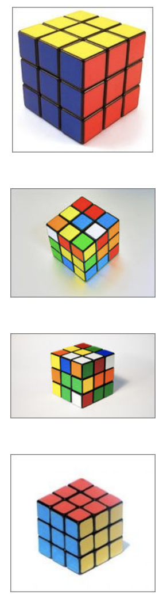




> Question

* identify whether all the visible sides have been 'solved'



```txt
Output: solved
```




```py
from scipy import spatial
from scipy import ndimage
import numpy as np
import scipy as sp
from sklearn.feature_extraction.image import grid_to_graph
from sklearn.cluster import AgglomerativeClustering

data = []
while True:
  try:
    data.append([x.split(',') for x in input().split()])
  except:
    break
img = np.array(data, dtype=np.uint8)

scaled = img[::4, ::4]
gray = 0.299 * scaled[:,:, 0] + 0.587 * scaled[:,:,1] + 0.114 * scaled[:,:,2]

edges = ndimage.filters.uniform_filter(gray, (4, 4))
edges = ndimage.filters.prewitt(gray)
edges = np.where(edges>120, 1, 0)

h, w = edges.shape
edge_points = [[j, i] for i in range(h) for j in range(w) if edges[i, j]]

points = np.asarray(edge_points)
hull = sp.spatial.ConvexHull(points)
contour = np.zeros(edges.shape)

def draw_line(data, p0, p1):
  y0, y1 = p0
  x0, x1 = p1
  length = int(np.hypot(x1-x0, y1-y0))
  x, y = np.linspace(x0, x1, length), np.linspace(y0, y1, length)
  data[x.astype(np.int), y.astype(np.int)] = 1
  return data

for i in range(len(hull.simplices)):
  simplex = hull.simplices[i]
  contour = draw_line(contour, points[simplex,0], points[simplex,1])

filled = np.zeros(edges.shape)

for i in range(h):
  mask = 0
  for j in range(w):
    if contour[i, j] == 1 and contour[i, j-1] == 0:
      mask = (mask + 1) % 2
    filled[i, j] += mask

shadowed = filled[..., np.newaxis]
shadowed = np.concatenate((shadowed, shadowed, shadowed), axis=2)
shadowed = scaled + shadowed*45

max_img = ndimage.filters.maximum_filter(shadowed, (5, 5, 1))
max_img = ndimage.filters.uniform_filter(max_img, (4, 4, 1))

X = max_img.reshape((-1, 3))
x, y, z = max_img.shape

connectivity = grid_to_graph(n_x=x, n_y=y)
n_clusters = 4
ward = AgglomerativeClustering(n_clusters=n_clusters, connectivity=connectivity, linkage='ward').fit(X)

label = np.reshape(ward.labels_, (x,y))

centers = []

for i in range(n_clusters):
  if i != label[0,0]:
    cluster = np.where(label==i, 1, 0)
    centers.append(ndimage.measurements.center_of_mass(cluster))

def distance(centr1, centr2):
  x1, y1 = centr1
  x2, y2 = centr2
  return np.sqrt((x1-x2)**2 + (y1-y2)**2)

dist01 = distance(centers[0], centers[1])
dist12 = distance(centers[1], centers[2])
dist23 = distance(centers[0], centers[2])

mindist = 0.8 * (dist01 + dist23 + dist12) / 3
maxdist = 1.2 * (dist01 + dist23 + dist12) / 3

if all([dist01>mindist, dist12>mindist, dist23>mindist, dist01<maxdist, dist12<maxdist, dist23<maxdist]):
  print('solved')
else:
  print('unsolved')
```



