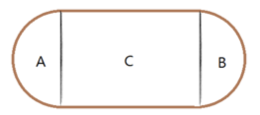




> Question



* Given width and height of rectangle, print perimeter

```txt
Input:
13
8

Output: 76.265472
```




```py
import math
a, b = int(input()), int(input())
print(a * 2 + 2 * b * math.pi)
```



