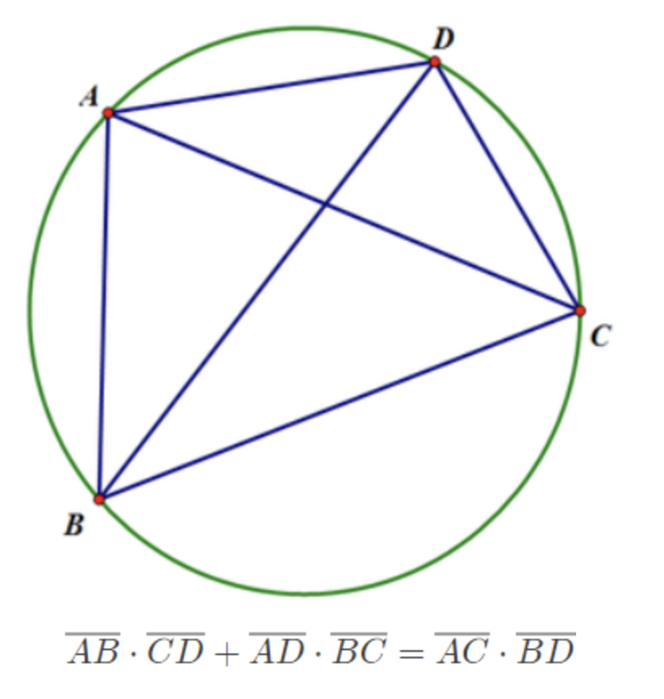




> Question



* Find length of last segment in a circle inscribed quadrangle

```txt
Input: 2 1 1
Output: 1
```




```py
a, b, c = map(int, input().split())

ans = -1
for i in range(1, a):
  if (b * c + i * a) ** 2 == (a ** 2 - b ** 2) * (a ** 2 - c ** 2):
    ans = i
print(ans)
```



