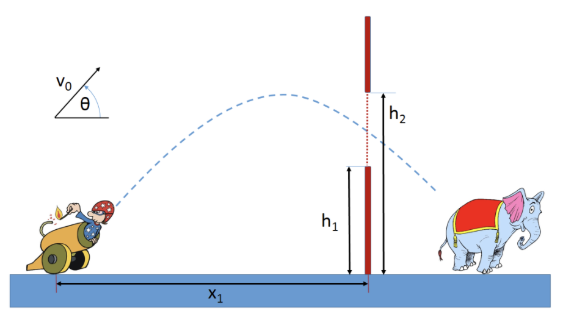




> Question



* check whether cannon safely pass with safe margin 1m

```txt
Input:
25.0 100.0
190.0 57.5
4
125.0 67.5
75.0 125.0
45.0 72.5
185.0 102.5

Output: 19.984901
```




```py
import math
n_shot = int(input())
for _ in range(n_shot):
    v, theta, x, h1, h2 = map(float, input().split())

    hit_t = x / (v * math.cos(theta / 180 * math.pi))
    hit_y = v * hit_t * math.sin(theta / 180 * math.pi) - 9.8/2 * hit_t ** 2

    if h1 + 1 <= hit_y <= h2 - 1:
        print('Safe')
    else:
        print('Not Safe')
```



