# Linear Algebra

> Terms

* Essential matrix (E)
  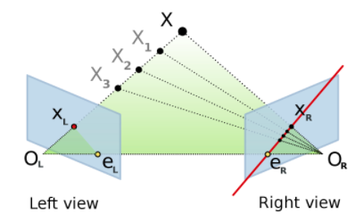
  * 3 x 3 matrix (maps point to line)
  * 5 DOF (3 dof for rotation, 3 dof for translation. Up to a scale, so 1 dof is removed)

* Fundametal matrix (F)

* Determinant
  $$
  |A|=\left|\begin{array}{lll}
  a & b & c \\
  d & e & f \\
  g & h & i
  \end{array}\right|=a\left|\begin{array}{cc}
  e & f \\
  h & i
  \end{array}\right|-b\left|\begin{array}{ll}
  d & f \\
  g & i
  \end{array}\right|+c\left|\begin{array}{ll}
  d & e \\
  g & h
  \end{array}\right|
  $$

* EigenValue
  * x: eigenvector
  $$ Ax = λx $$
  $$ (A - λI) * x = 0 $$

* Nullspace
  $$ N=\left\{x \in R^{n} \mid A x=0\right\} $$

* Nullity: dimension of its nullspace
* Orthonormal: Square matrix is orthonormal (also called unitary) if its columns are orthonormal vectors
  * rotation matrix is an orthonormal matrix with determinant = 1
  * Also possible for an orthonormal matrix to have determinant = -1
  * This is rotation plus a flip (reflection)
  * A matrix A is orthonormal iff
  $$
  \mathrm{A}^{-1}=\mathrm{A}^{\top} \\
  \mathrm{AA}^{\top}=\mathrm{A}^{\top} \mathrm{A}=\mathrm{I}
  $$

* Principal point: Where principal axis and image plane meets

* Rank: Dimension of column space

* Skew Symmetric: matrix S is skew symmetric iff S = -S^T
  * The determinant of a skew symmetric matrix is 0

* Trace: Sum of diagonal elements. If it is non-square, undefined

> Example

* Find Nullity
  $$
  \left[\begin{array}{ccccc}
  1 & 1 & 0 & 7 & -2 \\
  0 & 0 & 1 & -2 & 2
  \end{array}\right]\left[\begin{array}{c}
  x_{1} \\ x_{2} \\ x_{3} \\ x_{4} \\ x_{5}
  \end{array}\right]=\left[\begin{array}{c}
  -1 \\ 1 \\ 0 \\ 0 \\ 0
  \end{array}\right]+x_{4}\left[\begin{array}{c}
  -7 \\ 0 \\ 2 \\ 1 \\ 0
  \end{array}\right]+x_{5}\left[\begin{array}{c}
  2 \\ 0 \\ -2 \\ 0 \\ 1
  \end{array}\right]
  $$

## Vector

* Projection
  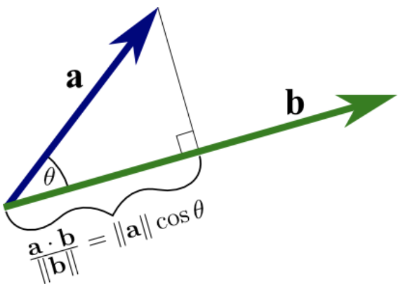
  $$
  c=\frac{x \cdot v}{v \cdot v}=\frac{x \cdot v}{\|v\|^{2}} \\
  (λ-c v) \cdot v=0
  $$
  $$ \operatorname{Proj}_{L}(a+b)=\operatorname{Proj}_{L}(a)+\operatorname{Proj}_{L}(b) $$

* Dot product: Less than 90 degrees ⇒ positive
  $$ a \cdot b=\sum a_{i} b_{i}=|a \| b| \cos \theta $$

* Cross Product
  $$ a \times b=\sum a_{i} b_{i}=|a \| b| \sin \theta $$
  * Area of parallelogram ab
  * Right Hand Rule
  * 0 if parallel
  * angle between two vector
  $$ \theta=\cos ^{-1}\left(\frac{\mathbf{a} \cdot \mathbf{b}}{|\mathbf{a}||\mathbf{b}|}\right) $$

* Unit vector: [ex] (1, 1, 1)
  $$ \frac{v}{\|v\|} $$

* Transformation
  * To transform v by E == E * v

## Matrix

> Terms

* Camera: Mapping from a point in homogenous world coordinates $${}^wp$$ to homogenous pixel coordinates q
* Fundamental: relates corresponding points in stereo images
  * [+] Do not require to calibrate the camera (intrinsic parameter)
  * epipole eL in homogeneous coord is Eigenvector of FT corresponding to zero eigenvalue
  * epipole eR in homogeneous coord is Eigenvector of F corresponding to zero eigenvalue
  $$ x ^{\prime \top} F x =0 $$
  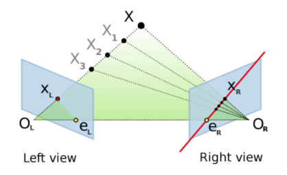
* Intrinsic parameter: written as `k` ([ex] focal length and lens distortion)
* Singular
  * a square (n × n) matrix that meets any / all of these conditions
  * columns are linearly dependent
  * rows are linearly dependent
  * determinant = 0
  * matrix is not invertible
  * matrix is not full rank (i.e., rank < n)

* OpenCV

  |        | C1  | C2  | C3  | C4  | C(5) | C(6) | C(7) | C(8) |
  | ------ | --- | --- | --- | --- | ---- | ---- | ---- | ---- |
  | CV_8U  | 0   | 8   | 16  | 24  | 32   | 40   | 48   | 56   |
  | CV_8S  | 1   | 9   | 17  | 25  | 33   | 41   | 49   | 57   |
  | CV_16U | 2   | 10  | 18  | 26  | 34   | 42   | 50   | 58   |
  | CV_16S | 3   | 11  | 19  | 27  | 35   | 43   | 51   | 59   |
  | CV_32S | 4   | 12  | 20  | 28  | 36   | 44   | 52   | 60   |
  | CV_32F | 5   | 13  | 21  | 29  | 37   | 45   | 53   | 61   |
  | CV_64F | 6   | 14  | 22  | 30  | 38   | 46   | 54   | 62   |

> Question

* Derivation of fundamental matrix

$$
\begin{array}{l}
X_{L}^{T} E X_{R}=0 \\
\rightarrow\left(K_{1}^{-1} q\right)^{T} E\left(K_{2}^{-1} q^{\prime}\right) \\
\rightarrow q^{T}\left(\left(K_{1}^{-1}\right)^{T} E K_{2}^{-1}\right) q^{\prime} \\
\rightarrow q^{T} F q^{\prime}
\end{array}
$$




* Mat

* cv
  * Mat(Size size, int type): Size can be int rows, int cols
  * Mat(Size size, int type, const Scalar& s): initialize each matrix element with
  * Mat::eye(4, 4, CV_64F);
  * Mat::ones(2, 2, CV_32F);
  * Mat::zeros(3,3, CV_8UC1);

* cv.Mat
  * CV_64FC1 is simple grayscale image
  * C: number of channels in the matrix
  * format(R, Formatter::FMT): print in format in cout << (FMT_PYTHON / FMT_CSV)
  * rows: cols               // show n rows, cols
  * type(): show type
  * typeToString()




* numpy
  * arange(): same to range
  * empty_like(`mat`): same dimension empty array
  * full((3,3), True, dtype=bool): 3*3 true
  * linspace(1, 2, 5): (5, 1) [1, 1.25, 1.5, 1.75, 2]
  * ones()
    * ([2, 3]): 2x3 array of zeros
  * repeat(a, n, axis): Repeat a, n times (same shape as a, except along given axis)
  * zeros()
  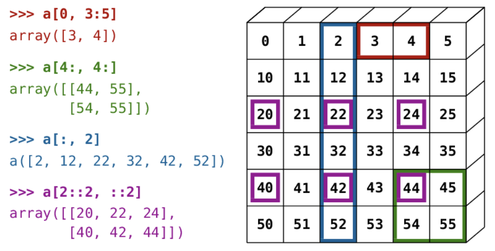
  * array2string(x, precision=2, separator=',', suppress_small=True): [0.  ,1.24,2.  ]
  * array2string(x, formatter={'float_kind':lambda x: "%.2f" % x}): [0.00 1.24 2.00]
  * a.dot(b): cannot use scalars. matrices are broadcast together as if matrices were elements
  * a.multiply(b): Element-wise multiplication
  * invert(x)
  * lexsort((b,a))                     # Sort by a, then by b → array([2, 0, 4, 6, 5, 3, 1])
  * log(): elementwise log
  * logical_not(x)
  * logical_and|or|xor(x1, x2)
  * mean(a): sum of all array elements
  * np.flip(temp, axis = 1): flip horizontally
  * power(): elementwise power
  * round(): round matrix
  * split(ary, sections): Split an array into n+1 sections (if sections is int, equal size)
  * sum(a): sum of all array elements
    * axis=0: for each column
    * axis=1: for each row
  * unravel_index()
  * where(a < 3, a, 10*a): array([0, 1, 2, 3, 4, 5]) -> array([ 0,  1,  2, 30, 40])
  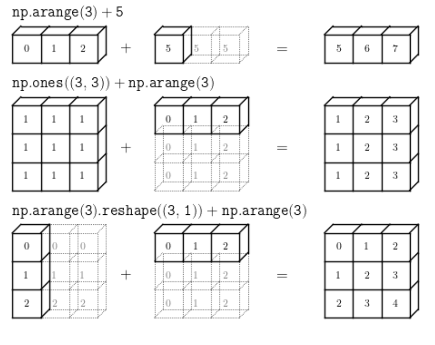
  * arraysplit()
    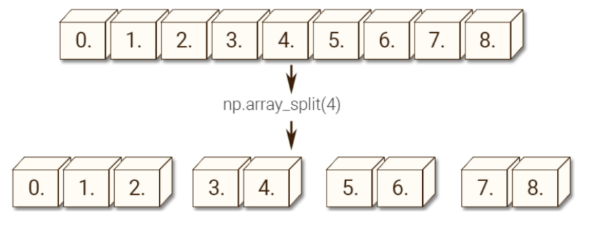
  * meshgrid()
    

* numpy
  * load('data.npy')
  * loadtxt("file_name", dtype=np.float32)
  * save('data.npy', num_arr)

* numpy
  * a[a[:,1].argsort()]: Sort array by first column
  * np.argpartition(`a`, -4)[-4:]: get unsorted top 4 from `a`
  * arr[(-arr).argsort()[:4]]: get sorted top 4
  * z = np.maximum(0, z): Relu using numpy
  * dot(a, b): if both scalars, 1D arrays then a scalar is returned; otherwise an array is returned
  * eig(np.diag((1, 2, 3))): get eigenvalue
  * lstsq(a, b): a = (M, N), b= (M,) or (M, K), returns x, sum residuals, rank, singular
  * norm(a)

```py
# 1. Shape
a = np.random.rand(10,11,12,2,3)
b = np.random.rand(10,11,12,3,4)
print(a.dot(b).shape) # (10, 11, 12, 2, 10, 11, 12, 4)
print((a @ b).shape)  # (10, 11, 12, 2, 4)

to_homog = lambda p: p[:-1] / p[-1]  # Homogeneous to euclidean
np.exp(x) / np.sum(np.exp(x), axis=1, keepdims=True) # softmax

# 2. gaussian_filter
def gaussian2d(filter_size=7, sig=1.0):
  """ Creates 2D Gaussian kernel with side length `filter_size` and a sigma of `sig`. """
  ax = np.arange(-filter_size // 2 + 1., filter_size // 2 + 1.)
  xx, yy = np.meshgrid(ax, ax)
  kernel = np.exp(-0.5 * (np.square(xx) + np.square(yy)) / np.square(sig))
  return kernel / np.sum(kernel)
```

* array()
  * ([[1], [2]]): 2d arry
* eye(): n * n identity matrix

> Question

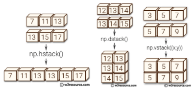

* Stack a and b are both (3, 2)
  * np.stack((a, b)): (2, 3, 2)
  * np.array((a, b))
  * np.vstack((a, b)): (6, 2)
  * np.hstack((a, b)): (3, 4)
  * np.dstack((a, b)): (3, 2, 2) = np.concatenate(a[..., None], b[..., None]), axis=2)






### Matrix Operations

* Not commutative, associative, Distributive, Identity property

> Term

* Inverse: if any row is linear combination of others, it is not invertible
  $$ (M P Q)^{-1}=Q^{-1} P^{-1} M^{-1} $$




* numpy
  * \* n: scalar multiplication
  * \/ n: scalar division
  * a @ b: Equivalent to a.matmul(b)
  * a + b: element wise sum
  * a - b: element wise difference
  * a * b: element wise product
  * a / b: element wise division




### Sparse




* scipy.sparse
  * csgraph.connected_components(M)
  * [+] CSR fast arithmetic operations (CSR + CSR, CSR * CSR), row slicing, matrix vector products
  * [-] CSR slow column slicing (than CSC), changes to sparsity structure (than LIL| DOK)
  * nnz: Number of stored values
  * bsr_matrix(arg1[, shape, dtype, copy, blocksize]): Block Sparse Row matrix
  * coo_matrix(arg1[, shape, dtype, copy]): Coordinate format
  * csc_matrix(arg1[, shape, dtype, copy]): Compressed Sparse Column matrix
  * csr_matrix(arg1[, shape, dtype, copy]): Compressed Sparse Row matrix
  * dia_matrix(arg1[, shape, dtype, copy]): Sparse matrix with DIAgonal storage
  * dok_matrix(arg1[, shape, dtype, copy]): Dictionary Of Keys based sparse matrix
  * lil_matrix(arg1[, shape, dtype, copy]): Row-based list of lists sparse matrix
  * getrow(i): copy (1 x n) CSR matrix
  * get_shape(): get shape of a matrix
  * nonzero(): tuple of arrays (row,col)
  * getnnz([axis]): stored values, including explicit zeros
  * multiply(other): Pointwise multiplication by another matrix
  * power(n[, dtype]): Element-wise power
  * todense([, order, out]): Return a dense matrix representation of this matrix




### Transformation

> Term

* Affine: $[A]_{2 \times 3}$
  * any transformation that preserves collinearity
  * 6DOF
  * Combination of linear transformations, and translations
  * Origin does not necessarily map to origin
  * Lines map to lines
  * Parallel lines remain parallel
  * Ratios are preserved
  * Closed under composition

* Projective: $[\hat{H}]_{2 \times 3}$
  * 8DOF
  * Origin does not necessarily map to origin
  * Lines map to lines
  * Closed under composition
  * Parallel lines do not necessarily remain parallel
  * Ratios are not preserved
  * Models change of basis

* Rigid $[R \mid t]_{2 \times 3}$
  * 3 Degree of freedom

* Similarity $[s R \mid t]_{2 \times 3}$
  * 4 Degree of freedom

* Translation: [ex] $$ { }^{ a } t _{ b } $$: translation of the a origin wrt camera b
  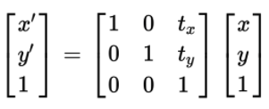

* Orbit: Translate -> Rotation
* Rotation
  * Counterclockwise
  * RTR = I
  * det(R) = 1
  * 2D: SO2 / 3D: SO3
  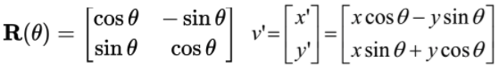
  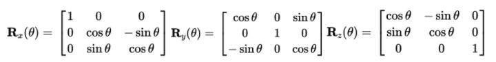

* Spin: Translate to origin -> Rotate -> Translate Back
  $$ p^{\prime}=T^{-1} R T p $$

> Example

* Translate 4x4 matrices by (3, -1, 4)
  $$
  \left(\begin{array}{lllc}
  1 & 0 & 0 & 3 \\
  0 & 1 & 0 & -1 \\
  0 & 0 & 1 & 4 \\
  0 & 0 & 0 & 0
  \end{array}\right)
  $$

## Coordinate System

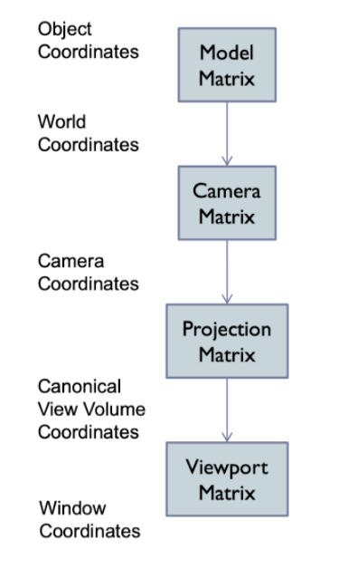


| symbol            | name                       | Description                                                         |
| ----------------- | -------------------------- | ------------------------------------------------------------------- |
| C                 | Camera Matrix              | World -> Pixel                                                      |
| E                 | Essential Matrix           |                                                                     |
| F                 | Fundametal Matrix          |                                                                     |
| π                 | Projection matrix          | Camera -> Firm                                                      |
| K                 | Intrinsic matrix           | Camera -> Pixel (3, 3)                                              |
| $${ }_{a}^{b} R$$ | Rotation Matrix            | wrt camera b                                                        |
| $${ }_{c}^{w} T$$ | Extrinsic parameter        | World → Camera                                                      |
| $$\alpha$$        | aspect ratio               | 1 unless pixels are not square                                      |
| $$(C_x, C_y)$$    | principal point            | (0, 0) unless optical axis not intersect projection plane at origin |
| d                 | Look at point              |                                                                     |
| e                 | Center point of projection |                                                                     |
| f                 | Focal length               | in units of pixels when world coordiantes in mm                     |
| S                 | skew                       | 0 unless pixels are shaped like rhombi / parallelograms             |
| u                 | camera up vectro           |

> Perspective Projection

* Given 3D points in camera coordinates, determine corresponding image coordinates
* Transforming 3D points into 2D is called Projection
* Most common for computer graphics
* Simplified model of the human eye, or camera lens (pinhole camera)
* Things farther away appear to be smaller
* Discovery attributed to Filippo Brunelleschi in the early 1400's
* Project along rays that converge in center of projection
* express using homogeneous coordinates and 4x4 matrices as follows
* Using projection matrix, homogeneous division seems more complicated than multiplying all by -d/z
* Handle different types of projections in a unified way
* Define arbitrary view volumes


> Object coordinate

* Often origin is in geometric center, on the base, or in a corner of the object
* Transformation from object to world coordinate is given by model matrix

* To Camera

$$\mathrm{P}_{\mathrm{C}}=\mathrm{C}^{-1} \mathrm{MP}_{\mathrm{o}}$$

> World Coordinate (${ }^{w} p$)

* If there is a ground, usually x / y is horizontal and z points up
* Otherwise, x / y is often screen plane, z points out of the screen

* to camera
  * multiply by extrinsic parameter

$$\left[\begin{array}{cc}{ }^{C} \mathcal{R} & { }^{C} O_{W} \\ 0^{T} & 1\end{array}\right]$$

### Camera coordinate

$$ { }^cp $$

* Origin defines center of projection of camera
* x-y plane is parallel to image plane
* z-axis is perpendicular to image plane


* To world coordinate

$$ \boldsymbol{C}=\left[\begin{array}{cccc}\boldsymbol{x}_{C} & \boldsymbol{y}_{C} & \mathbf{z}_{C} & \boldsymbol{e} \\
0 & 0 & 0 & 1\end{array}\right] $$

* To film coordinate

$$ \left[\begin{array}{cccc}f / s_{x} & 0 & o_{x} & 0 \\ 0 & f / s_{y} & o_{y} & 0 \\ 0 & 0 & 1 & 0\end{array}\right] $$

* To Pixel: Multiply by intrinsic parameter (K)

$$\left[\begin{array}{ccc}f & s & c_{x} \\ 0 & \alpha f & c_{y} \\ 0 & 0 & 1\end{array}\right]$$

* To Canonical View Volume
  * Projection matrix

### Canonical View Volume Coordinate

* 3D volume seen by camera
* Projection matrix that user defined view volume transforms into canonical view volume [-1,1]x[-1,1]x[-1,1]
* Multiplying corner vertices of view volume by projection matrix
* and performing homogeneous divide yields corners of canonical view volume
* Perspective and orthographic projection are treated the same way
* Canonical view volume is the last state in which coordinates are in 3D
* Last stage in which coordinates are in 3D
* Only things that end up inside the canonical volume can appear in the window
* Parallel sides and unit dimensions make many operations easier
  * Clipping – decide what is in the window
  * Rasterization - decide which pixels are covered
  * Hidden surface removal - decide what is in front
  * Shading - decide what color things are


* to image coordinate
  * Viewport transformation

* Perspective view volume
  * Convert the view-frustum to the simple symmetric projection frustum
  * Transform the simple frustum to the canonical view frustum

* Pixel / Calibrated coordinate
  * in 2D

### Cylindrical

* z: height
* r: radius from the z-axis
* θ: angle its projection on the xy-plane makes with respect to the horizontal axis

### Cartesians

| notation | meaning                                     |
| -------- | ------------------------------------------- |
| x        | coordinate representing horizontal position |
| y        | coordinate representing vertical position   |

* To Polar

$$x_{p}=r \cos (\theta)$$
$$y_{p}=r \sin (\theta)$$

### Polar

| notation       | meaning                                                   |
| -------------- | --------------------------------------------------------- |
| $$\mathrm{r}$$ | Distance from the origin                                  |
| $$\theta$$     | angle measured counter-clockwise from the positive x-axis |

* To Cartesians

$$r=\sqrt{x_{p}^{2}+y_{p}^{2}}$$

$$\theta =\tan ^{-1}\left(y_{p} \mid x_{p}\right)$$

### Spherical

* ρ: distance from the origin
* θ: the angle its projection on the xy-plane makes with respect to the horizontal axis
* φ: the angle that it makes with respect to the z-axis

### Coordinate Compression


