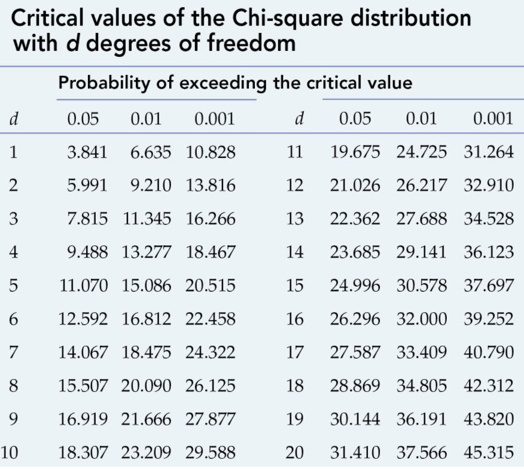
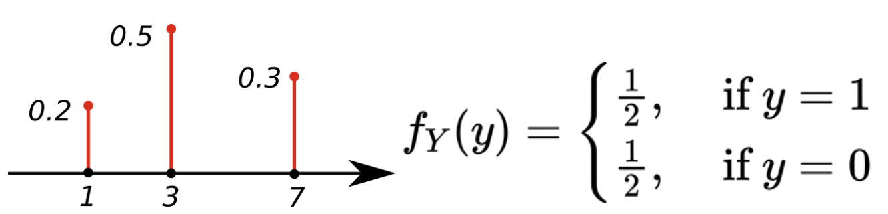
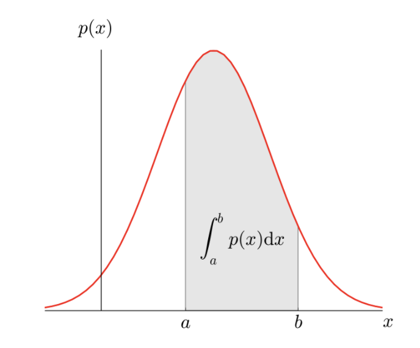
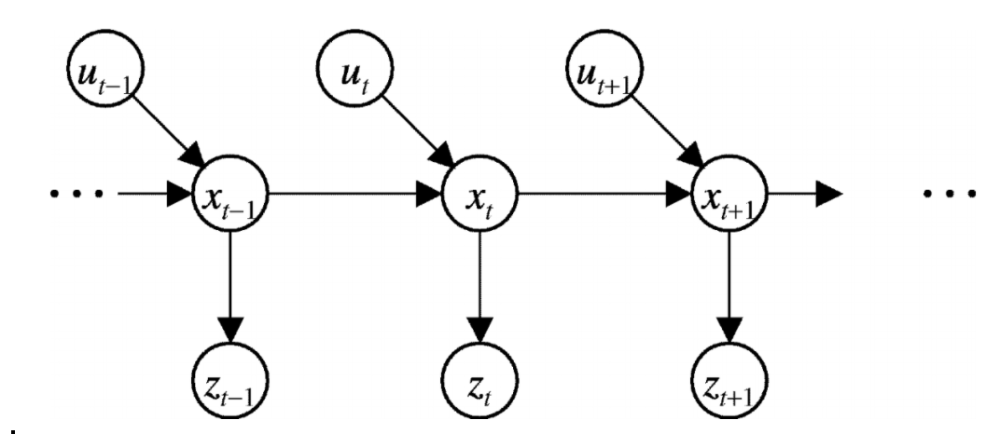
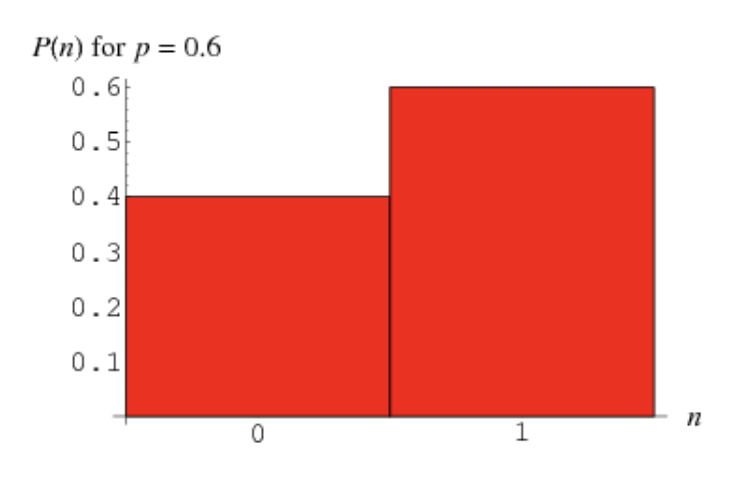
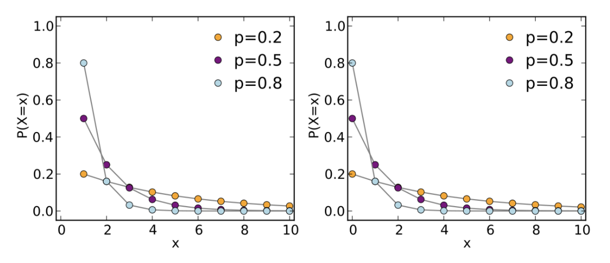
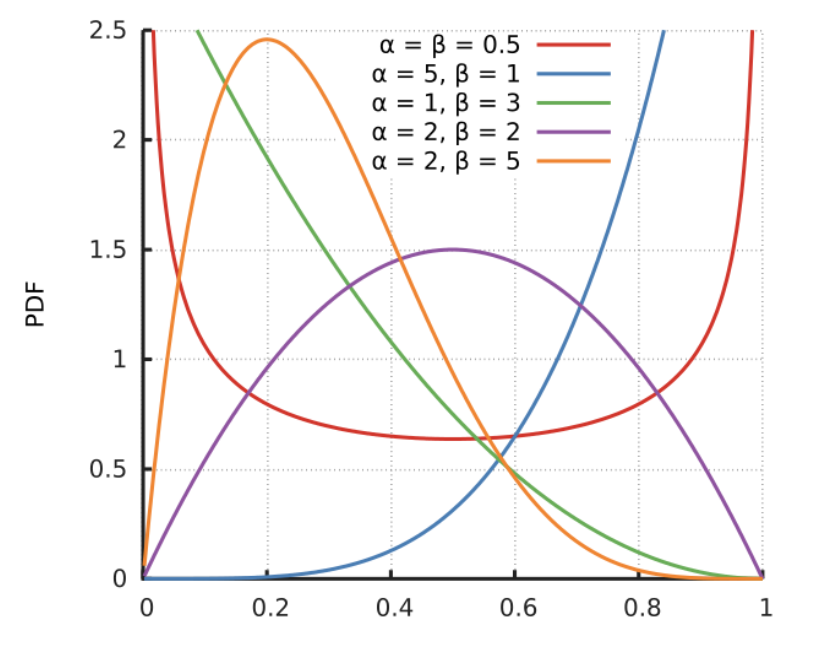
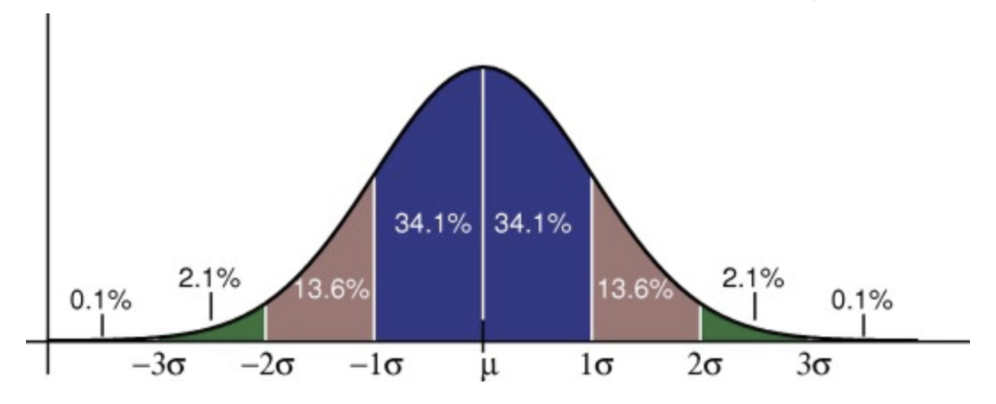
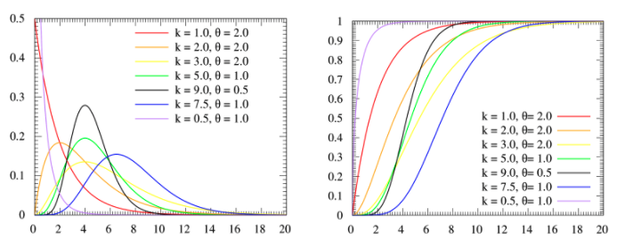

# Statistic

> Term

* Entropy: Uniform probability yields maximum uncertainty and therefore maximum entropy
  * $$ H(X)=E[I(X)]=E[-\log (P(X))] $$
  * Shannon entropy
    $$ H=-\sum_{i=1}^{n} p\left(x_{i}\right) \log _{2} p\left(x_{i}\right) $$
  * Conditional Entropy
    $$ H(X \mid Y)=-\sum_{i, j} p(x_{i}, y_{i}) \log \frac{p(x_{i}, y_{i})}{p(y_{i})} $$
* Information Gain: Root node in decision tree maximize information gain
  * Decrease in entropy after a dataset is split on an attribute
  $$ I G=H(\text { parent })-\sum_{i} p\left(\text { child }_{i}\right) \cdot H\left(\text { child }_{i}\right) $$



## Counting

* How many ways can 10 balls be selected if twice as many red balls as blue balls must be selected?
  * 3

> Example

* Case Analysis: How many ways can 10 balls be selected if at most one red ball is selected?
  * If at most one red ball is selected, then either 1 red ball is selected or 0 red balls are selected
  * Since these two possibilities are distinct, the sum rule applies with no overcounting adjustment
  * In either case, we have two categories, blue and green, and either 9 or 10 choices of those type of balls

  $$
  \left(\begin{array}{c}
  9+2-1 \\
  9
  \end{array}\right)+\left(\begin{array}{c}
  10+2-1 \\
  10
  \end{array}\right)=\left(\begin{array}{c}
  10 \\
  9
  \end{array}\right)+\left(\begin{array}{c}
  11 \\
  10
  \end{array}\right)=10+11=21
  $$

* Complement
  * How many different phone numbers are there that begin with (858)-353- and contain at least one zero?
    * 104 – 94 = 10000 – 6561 = 3439
  * How many 4-digit campus telephone numbers have one or more repeated digits?
    * 104 - 10 \* 9 \* 8 \* 7
  * number of arrangements of the letters of BANANA such that no two N's appear in adjacent positions?
    * 40
  * A subset of {1,2, …,12} is said to be selfish if it contains its size as an element
    How many subsets have the property that both the subset and its complement is selfish?
    * 772

* Stars and bars
  * Suppose we are playing a game where we can place 5 indistinguishable knights into 3 different castles
    How many combinations do we have?
    * C(7, 2)
  * Consider equation a + b + c + d = 10 where a, b, c, d are non-negative integers
    How many solutions does this equation have?
    * C(13, 3)
  * How many different orders for six hot dogs are possible if there are three varieties of hot dogs?
    * C(8, 2)
  * Find the number of non-negative integer solutions of 3x + y + z = 24
    * 117

* Inclusion | Exclusion
  * Among 30 students, 14 are girls, and 22 are right-handed. Minimum number of right-handed girls?
    * 6
  * How many of the integers 1, 2, . . . 10000 are divisible by 2, 3, or 7?
    * 7143
  * Six people are in a line. # arrangements s.t. no three consecutive are in increasing order of height, from front to back
    * 349



## Binomial Coefficient

$$
n C k=C_{k}^{n}=\frac{n !}{k !(n-k) !}
$$




* comb(n, k): number of ways to choose k items from n items without repetition and without order






## Combination

* Choose Without ordering




* itertools
  * combinations(`iter`, r): [ex] ('ABCD', 2) → AB AC AD BC BD CD








### Combination Duplicate



## Factorial



## Permutation

$$
P_{k}^{n}=\frac{n !}{(n-k) !}
$$

> Example

* How many different rearrangements are there of the letters in the word BUBBLE?
  * 6! | 3!




* itertools
  * permutations(`iter`): [ex] (range(3)) → 012 021 102 120 201 210




* shuf: generate random permutations
  * -n: number of lines






## Series

* arithmetic series
  $$ a_{n}=a_{1}+(n-1) d $$
  * Sum
    $$ \frac{n\left(a_{1}+a_{n}\right)}{2} $$

* geometric series
  $$ \sum_{k=0}^{\infty} a r^{k} $$
  * Sum
    * n: number of terms
    $$ S_{n}=\frac{a\left(r^{n}-1\right)}{r-1} $$



### Fibonacci



## Probability

* Theorem of total probability

$$ p(x)=\sum_{y} p(x \mid y) $$
$$ p(y) \quad p(x)=\int p(x \mid y) p(y) d y $$

> Terms

* Chi square test
  * data must be random, raw, mutually exclusive, drawn from independent variables / large enough sample
  * Expected: $$E_{i}$$
  * Observed: $$O_{i}$$

$$ x_{c}^{2}=\sum \frac{\left(O_{i}-E_{i}\right)^{2}}{E_{i}} $$

* Event
  * subset of possible outcomes denoted as E

$$ P(E)=\sum_{s \in E} p(s) $$

* Likelihood
  * Trying to find optimal value for the mean or standard deviation for a distribution given measurements

* Monte Carlo
  * Car hidden behind one of three doors. Goats hidden behind the other two
    The player gets to choose a door. Host opens another door, revealing a goat
  * Players can choose whether to swap choices with other closed doors or stay with the original choice
  * Should player change

* Probability Mass Function: Discrete
  

* Probability distribution function: Continuous
  

* Sample space
  * (finite or countable) set of possible outcomes, denoted as S

> Random variable

* Descrete: described informally as a variable whose values depend on outcomes of a random phenomenon
  * Year that a random student was born
* Continous: Mass of a random animal selected at the new orleans zoo



### Conditional probability

* $$ P(x | y) $$

* Joint probabilitiy
  $$ p(x, y) $$

* independent
  $$ {p}({x}, {y})={p}({x}) {p}({y}) $$

* dependent
  $$ {p}({x}, {y})={p}({x} \mid {y}) {p}({y}) $$

> Example

* The probability that two siblings are girls if one knows the oldest is a girl | one of them is a girl
  $$ \frac{1}{2} * \frac{1}{3} $$

{% include '.conditional-probability.prob'}

### Variance

* measures how far a set of (random) numbers are spread out from their average value

$$ \operatorname{var}(X)=E\left[(X-E[X])^{2}\right]=E\left[X^{2}\right]-E[X]^{2} $$

* Covariance
  * Positive | negative value indicates a increasing | decreasing linear relationship
  * Population covariance (Excel) formula has denominator N instead of sample covariance with n -1

$$ cov(X, Y) = E[(X-E[X])(Y-E[Y])]=E[X Y]-E[X] E[Y] $$
$$ cov(X, X) = var(X) $$

### Bayes Theory

* Assume that features are linearly independent
* Posterior
  p(label ∣ features)= $$ \frac{p(\text { label }) ⋅ p(\text { features } ∣ \text { label })}{p(\text { features })} $$

| Term         | Symbol                                      |
| ------------ | ------------------------------------------- |
| Prior        | $$p(label)$$                                |
| Evidence     | $$p(features)$$                             |
| Likelyhood   | $$p(features \mid label)$$                  |
| Sensor Model | $$P(z \mid x)$$                             |
| Action Model | $$P\left(x_{t} \mid u_{t}, x_{t-1}\right)$$ |

> Term

* Belief $$\operatorname{Bel}\left(x_{t}\right)$$
  $$ P(x_{t} ∣ u_{1}, z_{1}, \ldots, u_{t}, z_{t}) $$
* Bayes
  $$η P(z_{t} ∣ x_{t}, u_{1}, z_{1}, \ldots, z_{t-1}, u_{t}) P(x_{t} ∣ u_{1}, z_{1}, \ldots, z_{t-1}, u_{t})$$
* Sensor Independence
  $$η P(z_{t} ∣ x_{t}) P(x_{t} ∣ u_{1}, z_{1}, \ldots, z_{t-1}, u_{t}, x_{t-1})$$
* Total Probability
  $$η P(z_{t} ∣ x_{t}) ∫ P(X_{t} ∣ u_{1}, z_{2}, … u_{t-1}, x_{t-1}) ⋅ P(X_{t-1} ∣ u_{1}, z_{2}, …, u_{t-1}) d x_{t-1}$$
* Markvian
  $$η P(z_{t} ∣ x_{t}) ∫ P(X_{t} ∣ u_{t-1}, x_{t-1}) ⋅ P(X_{t-1} ∣ u_{1}, z_{2}, \ldots, u_{t-1}) d x_{t-1}$$
* Definition of Belief
  $$η P(z_{t} ∣ x_{t}) ∫ P(X_{t} ∣ u_{t-1}, x_{t-1}) ⋅ \operatorname{Bel}(X_{t-1}) d x_{t-1}$$

### Estimation

* Assume a joint distribution

| Equation                     | Meaning |
| ---------------------------- | ------- |
| $$P(D, \theta)$$             |
| $$D=(x_{1}, \ldots, x_{n})$$ | Data    |

* Maximum Likelihood
  $$\theta\_{MLE}=\arg \max _{\theta} P(D \mid \theta)$$
  * [-] Often Overfit

* Maximize Posteriori
  * [+] Easy to compute and interpretable
  * [+] Regularization effect, shrinkage →  Avoid Overfitting
  * [-] Point estimate → No representation of uncertainty in θ
  * [-] Not invariant under reparameterization
  * [-] Must assume prior on θ

$$\theta_{MAP}=\arg \max_{\theta} P(\theta \mid D)$$



### Expectation

$$ E(X)=\sum_{s \in S} P(s) X(s)=\sum_{r \in X(S)} P(X=r) r $$

* Linearity
  $$ E\left(X_{1}+\ldots+X_{n}\right)=E\left(X_{1}\right)+\ldots+E\left(X_{n}\right) $$

> Question

* What is the expected value of the number of pips showing on a die after it is rolled once?
  $$ (1 + 2 + 3 + 4 + 5 + 6) ∗ \frac{1}{6} = 3.5 $$

* I play solitary and have a probability p of winning. Let X be the number of games until I win a game
  * Let A be the probability of winning a game in a first try

$$ E(X)=P(A) E(X \mid A)+P\left(A^{c}\right) E\left(X \mid A^{c}\right) $$
$$ =p(1)+(1-p)(1+E(X)) $$

## Distribution

> Terms

* KL Divergence (relative entropy)
  * measure of how one probability distribution is different from a second → 0 if identical

* Bernoulli: a performance of an experiment with two possible outcomes
  * [ex] Record how many coins land heads up and how many land tails up
* Uniform
  




* np.random
  * geometric(`p`, [size]): Draw samples from the geometric distribution
  * uniform(`lo`, `hi`, [size]): [ex] (3, 5, (2, 2)): array([[4.45674274, 3.33339518], [4.34067332, 4.60336929]])




### Binomial Distribution

* probability of k successive in n independent Bernoulli trials, given success is p
* p: binomial probability
* n: total event
* k: desired event

$$ (nCk)  p^k (1 - p)^(n-k) $$

> Example

* A coin is tossed 10 times. What is the probability of getting exactly 6 heads?
  * 10𝐶6 ∗ 0.56 * 0.54 = 0.205078125



### Geometric Distribution

* the number of failures before the first success



### Beta

$$ \frac{x^{\alpha-1}(1-x)^{\beta-1}}{B(\alpha, \beta)} $$




* numpy.random.beta(`a`, `b`, [size]): Draw samples from a Beta distribution




### Gaussian

* type of continuous probability distribution for a real-valued random variable
* Expect most of the measurements to be close to mean and symmetrical
* mean: μ
* PDF
  $$ \frac{1}{\sqrt{2 π \sigma^{2}}} e^{-\frac{(x-u)^{2}}{2 \sigma^{2}}} $$

* Gamma
  * k: shape parameter
  * θ: scale parameter
  * PDF
  $$ \frac{1}{\Gamma(k) \theta^{k}} x^{k-1} e^{-x / \theta} $$

* Poisson: Events occur independently
  * Approximation is good if p ≤ 0.1 and λ = np ≤ 5
  * lambda = n*p: mean
  * n: number of times an event occurs in an interval
  

> There are an average of 20 calls per hour.
  What is the probability that there are exactly 18 calls in 1 hour?

$$ \frac{20^{18} \cdot e^{-20}}{18 !} $$




* numpy.random
  * noraml(`local`, `scale`, `size`): (3, 3, (2,2)): array([[5.00687005, 6.0482864 ], [4.77496526, 5.86039373]])






### Multivariate normal distribution



### Central limit theorem


