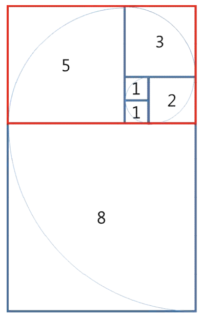




> Question



* Find perimeter of rectangle with n square

> Sample

```txt
Input: 5
Output: 26
```




```py
a, b = 4, 6
n = int(input())
if n == 1:
  b = a
else:
  for i in range(n - 2) :
    a, b = b, a + b
print(b)
```



