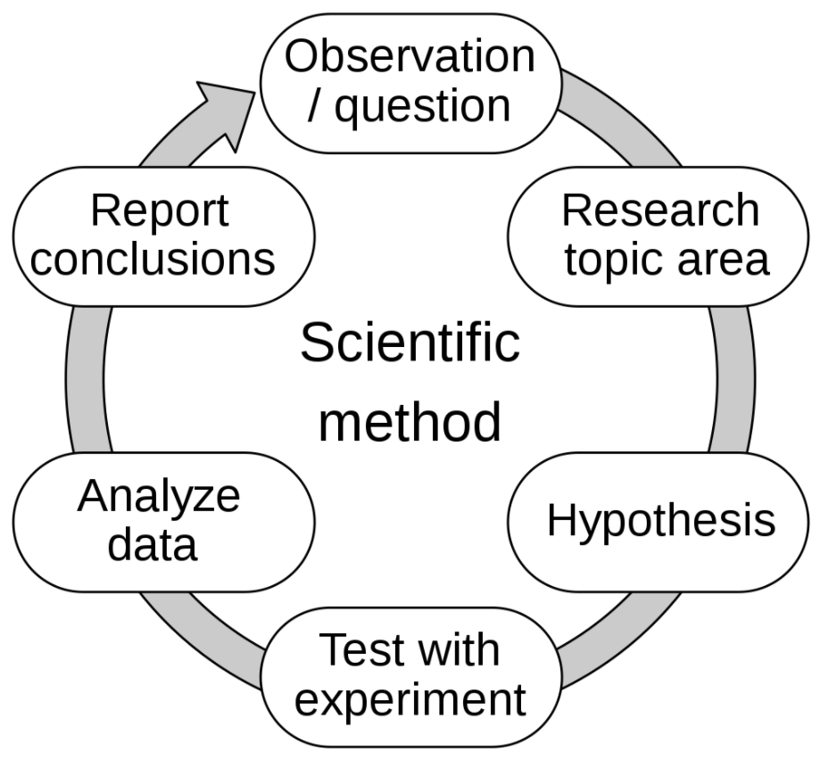

# Science

* systematic enterprise that builds, organizes knowledge in form of testable explanations and predictions about universe

> Term

## Engineering

* study of algorithmic processes, computational machines and computation itself

* Mechanical: design and manufacture of physical or mechanical systems
  * [ex] power and energy systems, aerospace/aircraft products, weapon systems, transportation products, engines
    compressors, powertrains, kinematic chains, vacuum technology, vibration isolation equipment, manufacturing, robotics
    turbines, audio equipments, and mechatronics
* Chemical: application of physics, chemistry, biology, engineering principles to carry chemical processes on commercial
  * [ex] manufacture of commodity chemicals, specialty chemicals, petroleum refining, microfabrication
    fermentation, biomolecule production
* Civil: design and construction of public and private works
  * traditionally broken into structural engineering, environmental engineering, and surveying
  * [ex] infrastructure (airports, roads, railways, water supply, and treatment), bridges, tunnels, dams, and buildings
* Electrical: design, study, and manufacture of various electrical and electronic systems
  * [ex] broadcast engineering, electrical circuits, generators, motors, electromagnetic/electromechanical devices
    electronic devices, electronic circuits, optical fibers, optoelectronic devices, computer systems, telecommunications
    instrumentation, control systems, electronics
