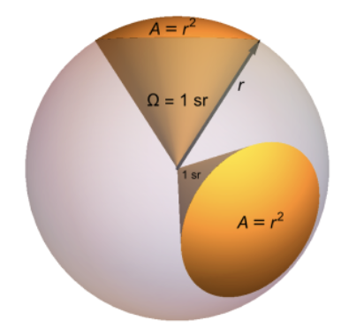
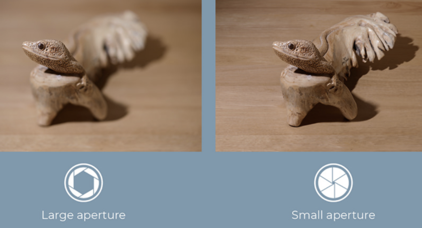
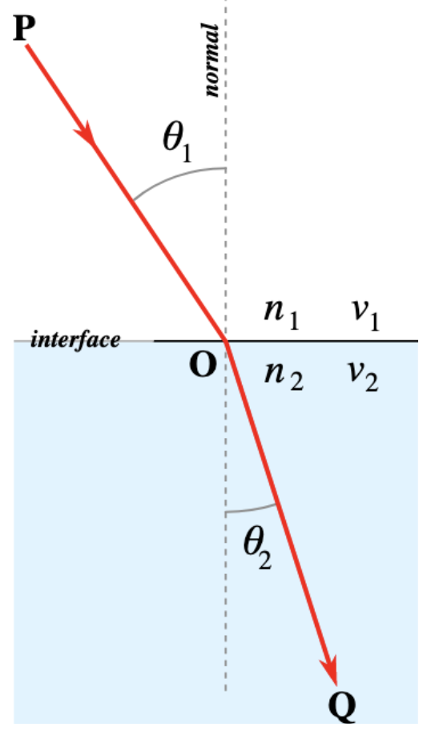
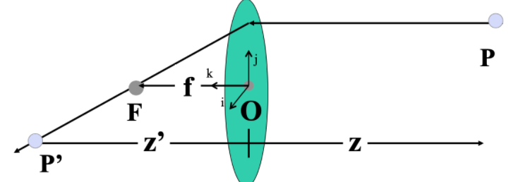
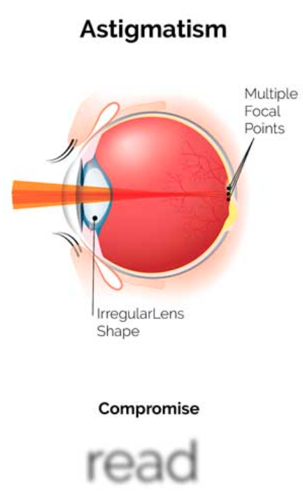
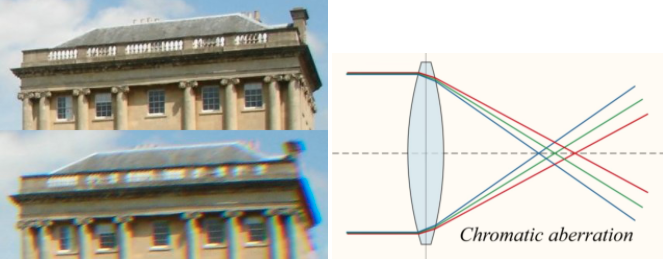
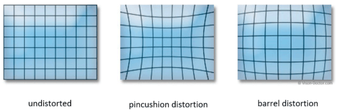
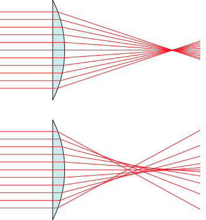
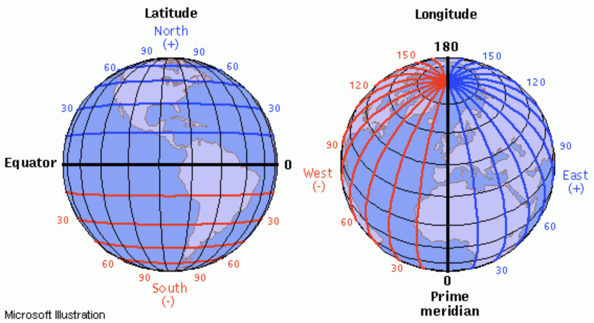
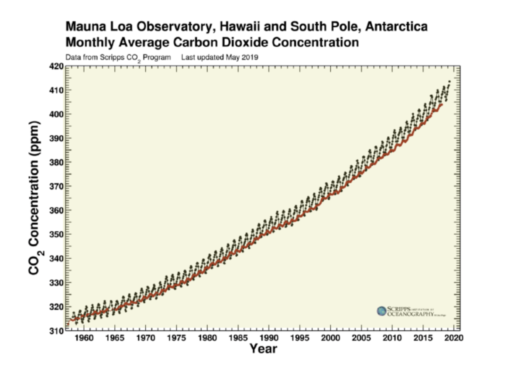

# Physics

## Mechanics

> Units

| Term      | Equation                                                                                       |
| --------- | ---------------------------------------------------------------------------------------------- |
| Joules    | $$ W=Fd $$                                                                                     |
| Steradian | $$ \Omega=\frac{A}{r^{2}} \mathrm{sr}=\frac{2 π h}{r} \mathrm{sr} $$                           |
| watt      | $$ 1 W=1 \frac{J}{s}=1 \frac{\mathrm{N} \cdot \mathrm{m}}{s}=1 \frac{kg \cdot m^{2}}{s^{3}} $$ |

## Electric

> Terms

* Diode: junction between p-type and n-type silicon
* Capacitance: more capacitance means circuit will be slower and require more energe to operate
* Current: Flow of particle (arrow shows positive charge flowing)
  * Passive sign convention ⇒ element receives power, current from positive to negative
* Power
  * When current flows in the direction of a voltage difference, the element receives powers, p > 0
  * When current flows in the opposite direction of the voltage difference, element supplies powers, p < 0
* Voltage:Pressure difference
  * The energy required to move a unit positive charge from  - to +. Voltage Across
  * Node voltage = voltage difference to ground

| Term                | Equation                                                                                |
| ------------------- | --------------------------------------------------------------------------------------- |
| Alternating current | $$ \triangleq $$                                                                        |
| Capacitance         | $$ C = \frac{Q}{V} $$                                                                   |
| charge of photon    | $$ e=-1.602e-19C $$                                                                     |
| current             | $$ 1 \mathrm{~A}=1 \mathrm{C} / \mathrm{s} $$                                           |
| resistivity         | $$ p $$                                                                                 |
| power               | $$ p\triangleq \frac{d w}{d t}=\frac{d w}{d q} \cdot \frac{d q}{d t}=v_{a b} \cdot i $$ |
| registance          | $$ R=\frac{p}{A} $$                                                                     |
| voltage             | $$ V=I \cdot R=J / C $$                                                                 |
| Watt                | $$ 1 \mathrm{~W}=1 \frac{\mathrm{V}^{2}}{\Omega}=1 \mathrm{~A}^{2} \cdot \Omega $$      |

> Conservation of charge Law

$$ q \triangleq \int_{t 0}^{t} i d \tau $$

> Kirchoff's Current Law

$$\sum_{i n} I=\sum_{o u t}^{\alpha} I$$

> Kirchoff's Voltage Law

$$\sum_{u p} \Delta V=\sum_{\text {down }} \Delta V$$

> Ohm's law

$$V=I \cdot R$$

## Optics

> Terms

* Aperture

> Snells Law

$$ n_{1} \sin \theta_{1}=n_{2} \sin \theta_{2} $$

### Lens

### Aberration

> Astigmatism

* different focal length for inclined rays

> Chromatic

* cannot be completely corrected by wearing sunglasses with colored lenses

> Coma

* point off the axis depicted as comet shaped blob

> Distortion

* pincushion: tele-photo
* barrel: wide-angle

> Spherical

* rays parallel to the axis do not converge to a single point
* outer portions of the lens has a smaller effective focal length

> Vignetting

## Astronomy

> Terms

* Albedo: measured by observing how much sunlight reflected off
* Latitude
* Longitude

