# Robotic

> Terms

* Task: Navigation, coverage, localization, mapping
* Given: Degrees of freedom, Geometry of obstacles, Robot dynamics

> Type

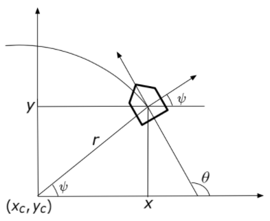

## Control

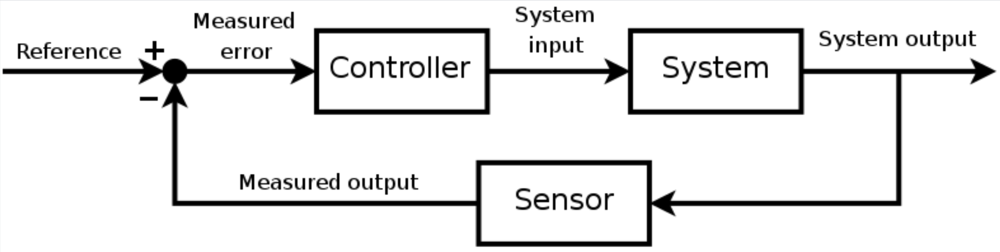

* deals with control of dynamical systems in engineered processes and machines
* develop model or algorithm governing app of system inputs to drive system to a desired state
* while minimizing any delay, overshoot, steady-state error and ensuring a level of control stability; with aim of optimality

> Term

* PV: controlled process variable, which Robot compares it with SP
* SP: Set Point reference or set point, diff between actual and desired value of process variable
* SP-PV error: aka error signal, applied as feedback to generate control action to bring PV to same value as SP
* open loop: control action from controller is independent of PV
  * [ex] cruise control, central heating boiler controlled only by a timer
* Lyapunov functions: scalar functions that may be used to prove stability of an equilibrium of an ODE

## Sensor

| Type    | Meaning                                                   |
| ------- | --------------------------------------------------------- |
| Passive | measure environment energy entering the sensor            |
| Active  | emit energy into the environment and measure the reaction |

* Digital Cameras: Photons hit a detector the detector becomes charged the charge is read out as brightness

* CCD (charge-coupled device): High sensitivity/power
  * Cannot be individually addressed
  * Blooming

* CMOS (Complementary metal–oxide–semiconductor): Lower sensitivity/power
  * Can be individually addressed
  * Simple to fabricate (cheap)
  * The vast majority of camera

### Proprioceptive

* measure values internal to the robot (motor speed, robot arm joint angles, battery)

* Accelerometer: device that measures all external forces acting upon it
  * Modern accelerometers are MEMS deflection measured via capacitive or piezoelectric effects
* Compass: absolute encoders and incremental encoders
* Encoder: absolute encoders and incremental encoders

* IMU: (Inertia measurement unit) uses gyroscopes and accelerometers to estimate the relative pos, ori, vel, accel

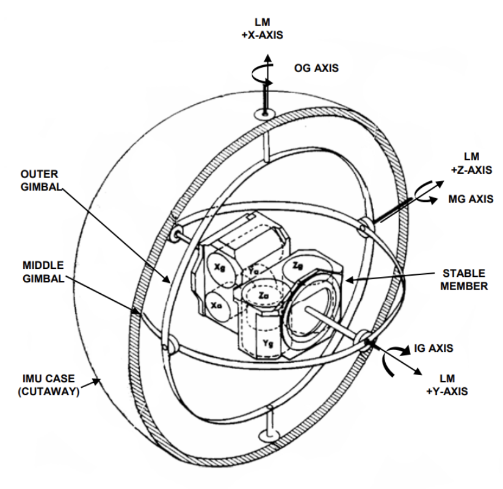

* Gyroscope: heading sensor that preserves its orientation relative to a fixed reference frame
  * Provides an absolute measurement for heading of a robot
  * mechanical and optical gyroscope

### Exteroceptive

* acquire information about the environment (distance measurements, light intensity)

* IR sensors: linear camera
* Laser rangefinders: emits a laser beam to detect the distance to an object
* Satellite-based sensors / GPS: These are a type of beacon which are signalling devices with precise known positions
* Sonar: emits an ultrasonic wave to measure the time of flight from the robot location to an obstacle
* Structured light
  * structured light using CCDs and CMOS
  * a light is emitted and the reflection is captured by the CCDs and CMOS
* Tactile: detect objects in the environment upon contacting them
* Visual: single monocular, stereo camera, 360 cameras
  * features are detected in the image with filtering algorithms applied on the image signal

| Stage                                                     | Buffering                              | Latency (1080p) |
| --------------------------------------------------------- | -------------------------------------- | --------------- |
| Capture Post-proc    (Bayer Filter, chroma resampling)    | few lines (eg. 8)                      | < 0.5ms         |
| Video Compression (Motion Jpeg, MPEG, H.264, single-pass) | 8 lines, 1000s pixels encoder piepline | 0.25ms          |
| Network Processing (RTP / UDP / IP encapsualtion)         | A few Kbytes                           | < 0.01ms        |
| Decoder Stream Buffer                                     | From number of frames more than 30     | 16-1 ms         |
| Decompression (Motion Jpeg, MPEG, H.264, single-pass)     | 8 lines, 1000s pixels encoder piepline | 0.25ms          |
| Display Pre-proc (Scaling, Chroma Resampling)             | Few lines (e.g. 8)                     | < 0.5ms         |

> RANSAC (Random Sample Consensus)

* estimating parameters of models in the presence of outlier data points

```text
repeat n times:
  select two points at random
  determine line equation from two points count number of points that are within distance τ from line
  (called support of line which is # of inliers)
  line with the greatest support wins
```

## Motion planning

* the ability for an agent to compute its own motions in order to achieve high-level goals

> Terms

* Feasibility: Finds a plan that achieves the goal
* Optimality: Finds a plan that achieves the goal and maximizes performance
* Computational: complexity do memory/running time “scale well” with the size of the problem
* Completeness: complete, resolution complete, probabilistically complete

* Kinematic Solution
  * Compute the sequence of translation/rotations that achieve this
  * Come up with another one that respects the mechanical limitations of the robot
* Dynamic Solution
  * Compute controls (e.g. thrusts) that make the robot follow the path
  * must pay attention to velocity control

> Reference

<https://github.com/brean/python-pathfinding>

### Bug Algorithm

| Sensor / Capability         | Bug 0 | Bug 1  | Bug 2 |
| --------------------------- | ----- | ------ | ----- |
| direction to goal           | yes   | yes    | yes   |
| distance to goal            | no    | yes    | yes   |
| memory                      | no    | yes    | yes   |
| linear odometer             | no    | option | yes   |
| angular odometer or compass | no    | yes    | yes   |

* Environment
  * Has a finite number of obstacles
  * Intersecting a line with obstacles returns a finite number of points
  * W is bounded, W ⊂ Br(0), Br(0) = {x ∈ W | d(x, 0) < r}

* Robot
  * It is a point with perfect positioning (no motion error)
  * Knows direction to goal, can measure distance between itself and goal
  * Does not know anything about obstacles (#, location, shape ...)
  * Can move in a straight line towards goal and follow obstacle boundaries

> Bug 0

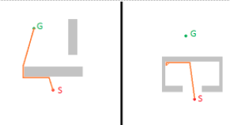

> Bug 1

* Add some memory to remember how close you got to the goal
* each point is represented by a distance and direction wrt goal with linear odometry
* record distance dc, dcc and choose the shortest
  * Exhaustive search algorithm

* Jordan Curve Theorem
  * Every non-self-intersecting continuous curve divides the plane into two connected parts
  * One is bounded (the inside), the other is unbounded (the outside). The curve is the boundary of both parts

* Performance
  * exhaustive search by examining all possible leave points before committing to the optimal choice
  * Lower Bound: D
  * Upper Bound: D + ⅔ * Σperimeter(Oi)

> Bug 2

* distance between robot and goal is a monotonically decreasing function of time, when the robot is away from any obstacles
* Greedy algorithm that takes the first closer available leave point without performance guarantee
* Lower Bound: D
* Upper Bound: D + Σci perimeter(Oi) / 2
  * ci = # intersections of start-goal line with boundary of Oi

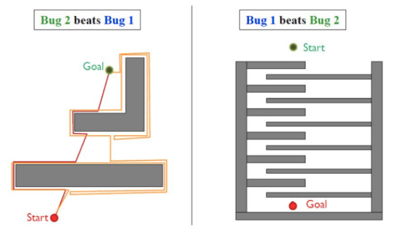

```py
# 1. Bug 0
while not goal:
  move_toward_goal()
  if hit obstacle:
    while not able_to_move_toward_goal:
      follow_obstacle_boundary()

# 2. Bug 1
while not at goal :
  move towards the goal
  if hit an obstacle:
    circumnavigate it (move to left / right)
    While circumnavigating, store minimum distance from obstacle to goal
    follow boundary back to boundary point with minimum distance to goal

# 3. Bug 2
while not at goal :
  move towards the goal (along the start-goal line)
  if hit an obstacle :
    follow obstacle’s boundary (turn direction is irrelevant)
    until you encounter start-goal line again closer to the goal and are able to move towards the goal
```

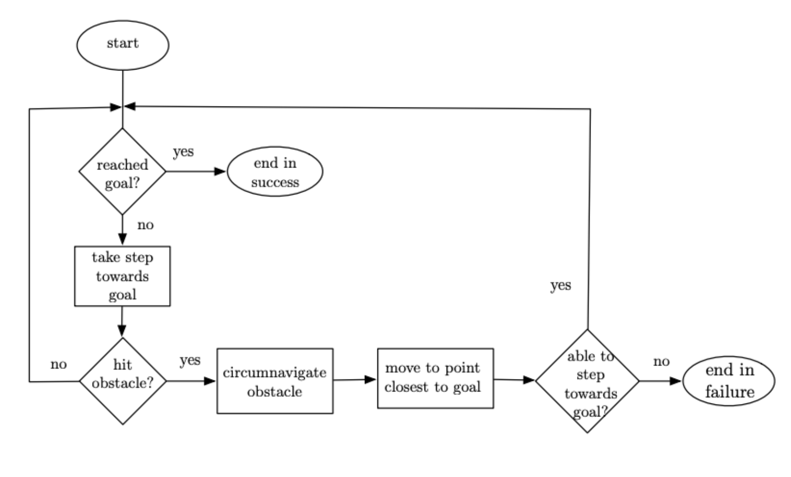

### A Star

* [-] storage of the search graph starts to become impractical at high dimensions
* cost = d(s,c) + h(c) (function h is heustic)




### RRT

* algorithm designed to efficiently search nonconvex, high-dimensional spaces by randomly building a space-filling tree
* constructed from randomly samples from search space and is biased to grow towards large unsearched areas of the problem

> Term

* RRT *: records distance each vertex has traveled relative to its parent vertex, adds is the rewiring of the tree
* RRT\* FND: extension of RRT\* for dynamic environments
* RRT-Blossom: RRT planner for highly constrained environments




```py
# 1. RRT
def RRT(G, Qgoal):  # Graph containing edges and vertices, initialized as empty
  Counter = 0 //keeps track of iterations
  lim = n //number of iterations algorithm should run for
  while counter < lim:
    Xnew  = RandomPosition()
    if IsInObstacle(Xnew) == True:
      continue
    Xnearest = Nearest(G(V,E),Xnew)  # find nearest vertex
    Link = Chain(Xnew,Xnearest)
    G.append(Link)
    if Xnew in Qgoal:
      return G
  return G

# 2. RRT*
def RRT_plus(G(V,E)):  # Graph containing edges and vertices
  Rad = r
  for itr in range(n):
    Xnew = RandomPosition()
    if Obstacle(Xnew):  try again
    Xnearest = Nearest(G(V, E), Xnew)
    Cost(Xnew) = Distance(Xnew, Xnearest)
    Xbest, Xneighbors = findNeighbors(G(V, E), Xnew, Rad)
    Link = Chain(Xnew,Xbest)
    for x’ in Xneighbors
      if Cost(Xnew) + Distance(Xnew,x’) < Cost(x’):
        Cost(x’) = Cost(Xnew)+Distance(Xnew,x’)
        Parent(x’) = Xnew
        G += {Xnew,x’}
    G += Link
  return G
```




## Config space

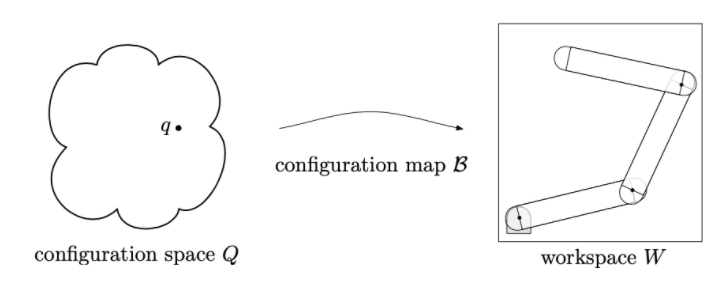

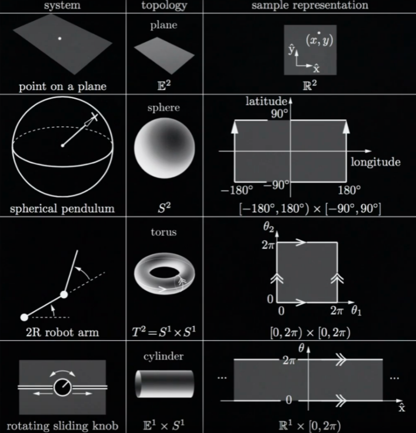

### Collision

* A broad phase: Simple bounding boxes of robot parts are defined to avoid expensive computations
  * Then one check if these boxes overlap

* A narrow phase: Individual pair of bodies are carefully checked for collision: through hierarchical, or incremental methods

% tabs %}


```py
# 1. get intersect
import numpy as np
def get_intersect(a1, a2, b1, b2):
  """
  Returns the point of intersection of the lines passing through a2,a1 and b2,b1.
  a1: [x, y] a point on the first line
  a2: [x, y] another point on the first line
  b1: [x, y] a point on the second line
  b2: [x, y] another point on the second line
  """
  s = np.vstack([a1,a2,b1,b2])        # s for stacked
  h = np.hstack((s, np.ones((4, 1)))) # h for homogeneous
  l1 = np.cross(h[0], h[1])  # get first line
  l2 = np.cross(h[2], h[3])  # get second line
  x, y, z = np.cross(l1, l2) # point of intersection
  if z == 0:                 # lines are parallel
    return (float('inf'), float('inf'))
  return (x/z, y/z)
print(get_intersect((0, 0), (1, 1), (1, 0), (0, 1)))
print(get_intersect((0, 0), (1, 1), (1, 1), (2, 2)))

# 2. Halton sequence
### Input: length of the sequence N ∈ N and prime number p ∈ N
### Output: an array S with the first N samples of the Halton sequence generated by p
Halton_sequence:
  for each i from 1 to N:
    initialize itmp = i, and f = 1 / p
    while itmp > 0:
      compute the quotient q and the remainder r of the division itmp/p
      S(i) = S(i) + fr
      itmp = f / p
  return S

# 3. Shooting raw
### Args: A point q and a non-convex polygon P with n sides s1, …, sn
### Returns: Whether inside or outside
def shooting_ray_algorithm() -> bool:
  Choose an arbitrary direction, define a ray R extending from q in the chosen direction
  intersections = 0
  for i from 1 to n:
    if segment si intersect ray R:
      intersections = intersections + 1
  if intersection is odd:
    return inside
  return outside
```






## SLAM

* Simultaneous localization and mapping
  $$ P(m_{t+1}, x_{t+1} \mid o_{1: t+1}, u_{1: t}) $$
* [ex] particle filter, extended Kalman filter, Covariance intersection, GraphSLAM
* self driving cars simplify mapping problem, by making extensive use of highly detailed map data collected in advance

> Question

1. Localization errors accumulate, causing substantial deviation from actual values
1. Localization fails and the position on the map is lost ([ex] discontinuous position estimates)
1. High computational cost for image processing, point cloud processing, and optimization

> Term

* Acoustic: extension of common SLAM problem, where environments are represented by 3D position of sound sources, termed
* Collaborative: combines images from multiple robots or users to generate 3D maps
* Loop closure: problem of recognizing previously-visited location and updating beliefs accordingly

### Kalman Filter

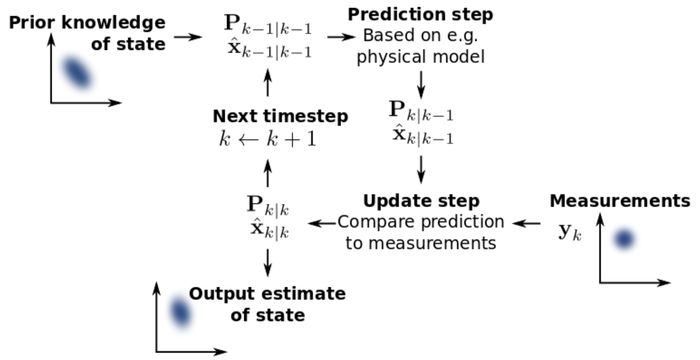

* linear quadratic estimation (LQE) algorithm that uses series of measurements observed over time with noise, inaccuracies
* produces estimates of unknown variables that tend to be more accurate than those based on single measurement alone
* by estimating joint probability distribution over variables for each timeframe

> Term

* EKF: extended Kalman filter is nonlinear version which linearizes about estimate of current mean and covariance
  * [ex] standard in theory of nonlinear state estimation, navigation systems and GPS
  * [-] not an optimal estimator
  * [-] If initial estimate of state is wrong, or process is modeled incorrectly, it may quickly diverge, owing to its linearization
  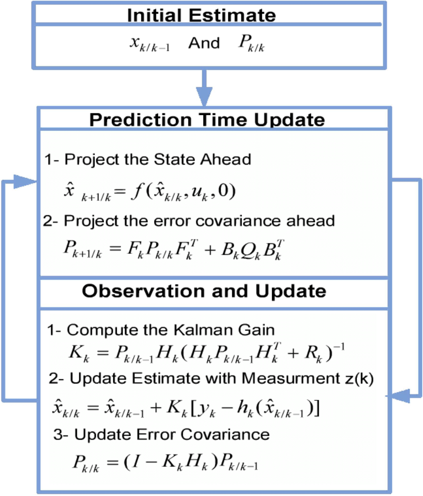

### Localization

* Assumes perfect map
* Computes location relative to map

### Mapping

* Assumes perfectly known position of robot
* Creates a map of the environment

* Deterministic
  * Sense a bit → Plan → Move a bit
  * Bug algorithm, simple algorithms for point robots
  * Roadmaps and planning over graphs for points robot
  * Configuration spaces: planning for more sophisticated robots
  * Free configuration space representations
  * Sampling Based Planning

> Decomposition

* Sweeping trapezoid

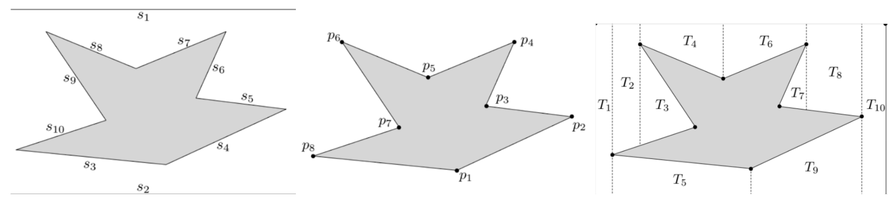

| Type  | Endpoint      | Convexity | Example | # Trapezoid | # Obstacle Segments |
| ----- | ------------- | --------- | ------- | ----------- | ------------------- |
| (i)   | left / left   | Convex    | p6, p8  | 0           | 0                   |
| (ii)  | left / left   | Concave   | p3      | 0           | 0                   |
| (iii) | right / right | Convex    | p2, p4  | 2           | 2                   |
| (iv)  | right / right | Concave   | p7      | 1           | 1                   |
| (v)   | left / right  | Convex    | p1      | 1           | 1                   |
| (vi)  | left / right  | Concave   | p5      | 1           | 2                   |




```py
T = an empty list of trapezoids
sort(vertices of the obstacles and of the workspace, key = left to right)
for each vertex selected in a left-to-right sweeping order:
  extend vertical segments upwards/downwards until they intersect obstacle or workspace boundary
  add to T the new trapezoids, if any, generated by these segments(s)
```




### Probabilistic

* Maintain probabilistic hypotheses about the environment
  * Recursive estimation, histogram filters
  * Probabilistic motion models
  * Sensor measurement models
  * Simple particle filters

> Terms

* Correction: calculating $$ bel $$ from $$ \overline{bel} $$
* environment: low in assembly, high in highway or home
* sensors: range and resolution of a sensor is subject to physical laws
* robots: control noise and wear-and-tear
* models: abstractions of the real world
* computation: Robots are real-time systems, which limits the amount of computation carried out

### Error

$$
p\left(z_{t}^{k} \mid x_{t}, m\right)=\left(\begin{array}{c}
z_{\mathrm{hit}} \\
z_{\mathrm{short}} \\
z_{\max } \\
z_{\mathrm{rand}}
\end{array}\right)^{T} \cdot\left(\begin{array}{c}
p_{\mathrm{hit}}\left(z_{t}^{k} \mid x_{t}, m\right) \\
p_{\text {short }}\left(z_{t}^{k} \mid x_{t}, m\right) \\
p_{\max }\left(z_{t}^{k} \mid x_{t}, m\right) \\
p_{\mathrm{rand}}\left(z_{t}^{k} \mid x_{t}, m\right)
\end{array}\right)
$$

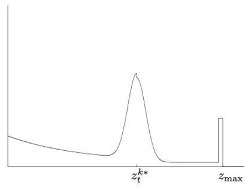

> Failure

* sensing black, light-absorbing objects or when measuring objects in bright light

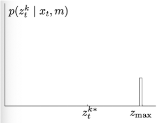

$$
p_{\max }\left(z_{t}^{k} \mid x_{t}, m\right)=I\left(z=z_{\max }\right)=\left\{\begin{array}{ll}
1 & \text { if } z=z_{\max } \\
0 & \text { otherwise }
\end{array}\right.
$$

> Gaussian

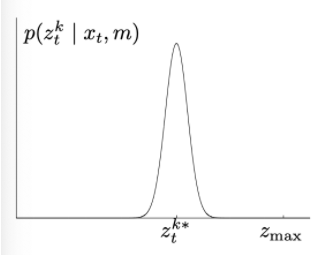

* limited resolution of range sensors, atmospheric effect on the measurement signal

* Measurement probability

$$
p_{\text {hit }}\left(z_{t}^{k} \mid x_{t}, m\right)=\left\{\begin{array}{ll}
\eta \mathcal{N}\left(z_{t}^{k} ; z_{t}^{k *}, σ_{\text{hit }}^{2}\right) & \text { if } 0 \leq z_{t}^{k} \leq z_{max} \\
0 & \text { otherwise }
\end{array}\right.
$$

* Univariate normal distribution

$$
\mathcal{N}(z_{t}^{k} ; z_{t}^{k *}, σ_{hit}^{2})=\frac{1}{\sqrt{2 \pi σ_{hit}^{2}}}
e^{-\frac{1}{2} \frac{(z_{t}^{k}-z_{t}^{k*})^{2}}{σ_{hit}^{2}}}
$$

* Normalizer

$$
\eta=\left(\int_{0}^{z_{\max }} \mathcal{N}\left(z_{t}^{k} ; z_{t}^{k *}, \sigma_{\text {hit }}^{2}\right) d z_{t}^{k}\right)^{-1}
$$

> Rand model

* e subject to cross-talk between different sensors

$$
p_{\text {rand }}\left(z_{t}^{k} \mid x_{t}, m\right)=\left\{\begin{array}{ll}
\frac{1}{z_{\max }} & \text { if } 0 \leq z_{t}^{k}<z_{\max } \\
0 & \text { otherwise }
\end{array}\right.
$$

> Unexpected Objects

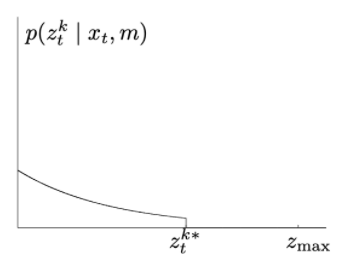

* objects not contained in the map can cause rangefinders to produce surprisingly short ranges

$$
p_{\text {short }}\left(z_{t}^{k} \mid x_{t}, m\right)=\left\{\begin{array}{ll}
\eta \lambda_{\text {short }} e^{-\lambda_{\text {dhott }} z_{t}^{k}} & \text { if } 0 \leq z_{t}^{k} \leq z_{t}^{k *} \\
0 & \text { otherwise }
\end{array}\right.
$$

* Univariate normal dsitribution

$$
\begin{aligned}
\int_{0}^{z_{t}^{k\star}} λ_{short} e^{-λ_{dhont} z_{i}^{k}} d z_{t}^{k} &=-e^{-λ_{short} z_{t}^{k\*}}+e^{-λ_{short} 0} \\
&=1-e^{-\lambda_{shart} z_{t}^{k\*}} \end{aligned}
$$

* Normalizer

$$ \eta=\frac{1}{1-e^{-\lambda_{\text {short }} z_{t}^{k^{k}}}} $$

## ROS


> Command

* roscd: takes you to the default ROS workspace
* roscore: run master node
* rosmsg list
* rosmsg show `n` `t`: show `t` variable in `n` package
* rostopic list: list all the topics
* rostopic echo `n`: echo all changes in topic (rostopic echo turtle1/cmd_vel)
* rostopic pub: publish (rostopic pub /turtle1/cmd_vel geometry_msgs/Twist -- '[2,0,0]' '[0,0,1]')

* rosrun `n`: run package `n` (turtlesim turtle_teleop_key)
* catkin_make: build

* cd ~/catkin_ws/src
* catkin_create_pkg my_package std_msgs roscpp: create new ROS package

* workspace: user directory that will used to create the user ROS packages
  * you have to add setup.bash in the ~/.bashrc file
  * ROS workspace is built using catkin_make command
  * ROS workspace contains three main folders: source, devel, build

* package
  * catkin_create_pkg `p` std_msgs roscpp
  * cd .
  * catkin_make

* publisher: name for the topic to publish
  * type of the message
  * frequency of the topic publication

* Subscriber: name for the topic to listen to
  * type of the messages to be received

## Catkin

> Term

* dry packages: packages that use the deprecated rosbuild build system
* Wet packages: packages that have been updated for use with catkin
* package.xml: define a license of your package in package.xml
  * contains two dependencies: build a package, execute a package

```cpp
find_package(catkin REQUIRED COMPONENTS cpp_common geometry_msgs)
find_package(Log4cxx QUIET)
generate_messages(DEPENDENCIES geometry_msgs)
catkin_package(
  CATKIN_DEPENDS cpp_common geometry_msgs
  DEPENDS Log4cxx
)
add_library(example_lib src/example.cpp)
target_link_libraries(example_lib ${catkin_LIBRARIES} ${LOG4CXX_LIBRARIES})
add_dependencies(example_lib geometry_msgs_gencpp)
```

```py
# setup.py
from distutils.core import setup

setup(
  ...
  requires=['rospy'],
  )
```

## Node


* Each node in ROS should be responsible for a single, module purpose ([ex] controlling, motors, laser range-finder)
* Each node can send and receive data to other nodes via topics, actions, or parameters

> rosnode CLI

* list: list all the running nodes
* info `n`: give details of the node

## Topic

* vital element of the ROS graph that act as a bus for nodes to exchange messages
* publisher-subscriber model allow nodes to subscribe to data streams and get continual updates
* Can be one-to-one, one-to-many, and many-to-many

## Service

* Based on a call-and-response model
* services only provide data when are specifically called by a client

> ros2 service CLI

* list: return a list of all services currently active in the system
  * -t: show types
* type `service`
  * [ex] Empty: service call sends no data when making a request and receives no data when receiving a response

## Ros Action


* communication types intended for long running tasks built on topics and services
* consist of three parts: a goal, feedback, and a result
* functionality is similar to services, except actions are preemptable, can cancel them while executing

> ros2 action CLI

* list: all actions in ROS graph
  * -t: show types
* send_goal `action_name` `action_type` `values`
