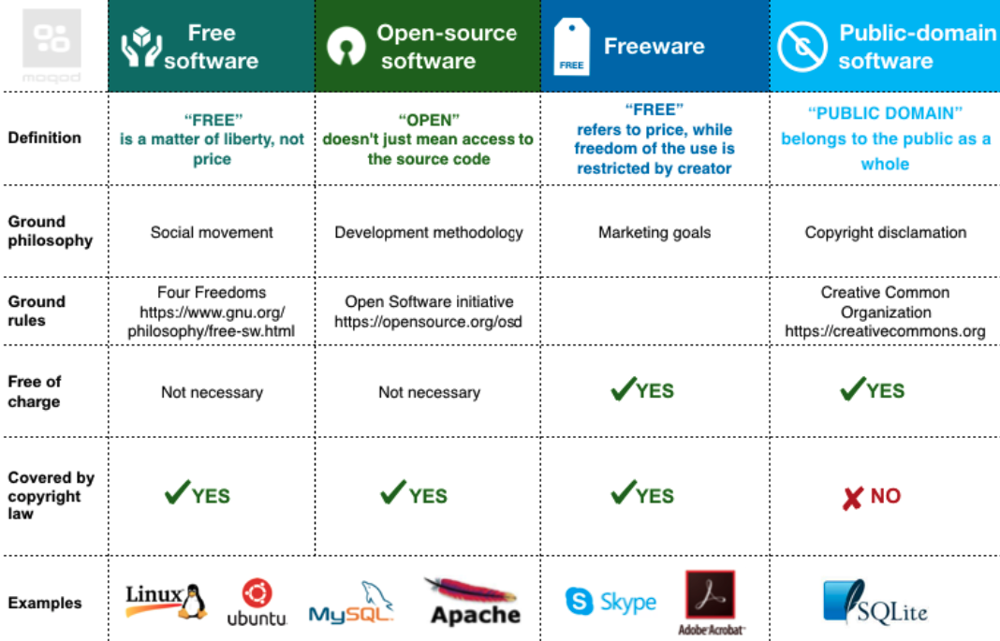
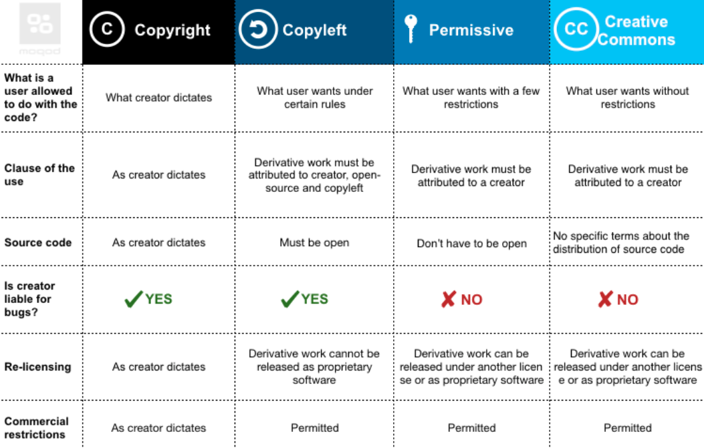
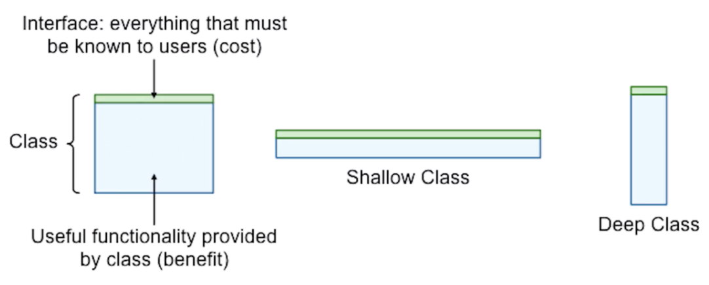
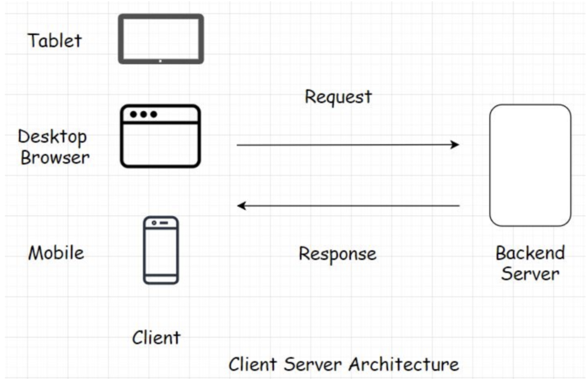
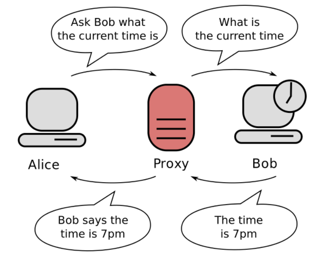
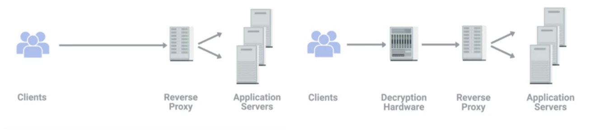

# Software

* collaboration among everyone participating in delivering software

> Terms

* BDD: Business Driven Development
* Feature ownership: point of contact, aware / discuss schedule, responsibility
* Iteration (sprint): Trying to make a large project act like a small one  Default to 20 days
  * How much communication do I need to have with the customer? How much risk?
  * Rapid feedback from the customer to avoid deviating from the customer’s wants on premise
  * all computing resources are accessed and managed by premises

* Process of Reference
* Meeting: Learn progress, status -> Update big board
  * Surface problems that are slowing things downj

* Standup questions
  * What have you accomplished since the last standup?
  * What did you learn that would be valuable for the team to know?
  * What's impeding you?
  * What do you intend to do before the next stand up?

* Milestone: Project get paid after milestone

* Task: risk addressed (unseen technical requirements and risks)
  * inaccurate estimates, no division of labor

* User Story: keep the end goal in mind from the user's perspective
  * prevent things like feature creep and facilitate communication between all stakeholders
  * Describes an observable end-user feature in customer language
  * Can have direct feed-back from the customer
  * Planning poker to decide estimates
  * In BDD, disambiguating user stories using sequence and special cases (multiple scenarios per story)
  * BDD is covered by matching automated story test

> Scenario 1: Favorite a New Route

* Given that the user is on the Save Route screen
* And they are saving a route named “RouteA”
* When the user presses the “Favorite” button
* And then they press the “Save” button
* Then the app should go to the Routes page
* And “RouteA” should be shown as a favorite

* As a person who like to walk
  * Who will benefit from the feature?
* I want to have an accurate measure of the distance I traveled
  * Not a system capability (task)
* So that I can see how far I walk every day
  * Benefit in the world

> Break following user story into two

* As a user I want to message a nearby buddy so that we can meet up.  →
* As an initiator I want to send invitation to a nearby buddy so that we can meet up
* As a user I want to receive messages so that we can meet up

## Tools

* wiki?curid=10015: wiki based
* [compare different stacks](https://stackshare.io/)

> Terms

* BIOS (basic input input system)
  * firmware used to perform hardware initialization during the booting process (power-on startup)
  * provide runtime services for operating systems and programs

* Continuous delivery: Increase productivity (No manual intervention after writing codes)

* Library / Frameworks: predefined set of classes that does similar things

* Time
  * Universal time coordinate: Compromise between english and french abbreviation
  * GMT: Greenwich Mean Time, time zone at UTC + 0.0

* Posix (Portable Operating System Interface)
  * standards specified by IEEE Computer Society for maintaining compatibility between operating systems

* Program Counter (PC): PC points at (contains the address of) some machine-language instruction in main memory

* rpath: designates the run-time search path hard-coded in an executable file or library

* Software development Toolkit

* standalone (freestanding program)
  * no external module, library, program designed to boot with bootstrap procedure of target processor

* Windows Driver Model (wdm)
  * framework for device drivers that was introduced with Windows 98 and Windows 2000 to replace VxD (Windows 95, 3.1)

* Von Neumann model of computing: Fetch, decode, execute

* X Window System: xAuthority file is in ~, stores credentials in cookies used by xauth for authentication of X sessions

## Code Review

* should avoid API discussion: should happend before code is written
* Automated as possible: Linter and CI
* Readability: Type, function and variable name
  * complex code should be commented
  * Important actions should be logged
* Side effect: Function should be as pure as possible
* Limits
  * Null, singular case
  * Unexpected / Large input from user

## Configure




* django.conf.global_settings.py: default values for settings

* urls
  * url(r"regex", where_to_send_requests)
* settings: use variable defined in settings.py

```py
from django.conf import settings
```




## KPI

* (Key Performance Indicator)

* Operational: problem understanding: clarify any uncertainties arount the problem SLA (Service-Level Agreement)
* Tactical: SME (subject matter expert)
  * accurate and repeatable analysis
  * concise documentation / automatic alerting & monitoring for unseen changes
* Strategical: Prioritize and identify important problem that are not actively being worked on product, process, policy
  * evaluate the success of an organization or of a particular activity in which it engages

* CPS (Cost Per Sales): the amount of money paid for every sale generated

* CTR (Click Through Rate): number of clicks that your ad receives divided by the number of times your ad is shown

## Delivery

> Terms

* [Open source](https://naver.github.io/OpenSourceGuide/book/)

* Bill of materials
* CRM (Customer Relationship Management)

* CPM (Cost per Mili): cost an advertiser pays for one thousand views or clicks of an advertisement

* MVP (minimum viable product): technique in which a product is developed with sufficient features for early adopters

* POC (Proof of concept): check before releasing the product
* RCA (Root cause analysis): Find why customer act something
* SKU (stock-keeping unit): a unique identifier for each distinct product and service that can be purchased in business

* Release
  * Canary deploy: rollout new model with small subset of users, then monitor its performance
  * Binary Release: most windows machines do not have a compiler installed
  * Source Release: common in linux. b/c vary in cpu, installed library, kernel, compilers version
  * Blue-Green deploy: two complete deployments with active (rolled out) + idle (test)
  * Maintenance Release: release of a product that does not add new features or content

### Version




```js
// 1. Compare versions
var semver = require('sember');
semver.diff('3.4.5', '4.3.7'); // 'major'
versions = ['1.2.3', '3.4.5']
var max = versions.sort(semver.rcompare)[0]
var min = versions.sort(semver.compare)[0]
```




## License

> Terms





> Examples : License


* Apache
  * [ex] Gitbook

* BSD License
  1. Permission to use, copy, modify, and/or distribute this software for any purpose with or without fee is hereby granted
  2. Redistribution and use in source and binary forms, with or without modification, are permitted provided that redistributions
     * in source code must retain the above copyright notice, this list of conditions and the following disclaimer
     * in binary form must reproduce the above copyright notice,
       this list of conditions and following disclaimer in documentation and/or other materials provided with distribution
  3. Neither organization nor contributors may be used to endorse or promote products derived from this
     w/o specific prior written permission
  4. All advertising materials mentioning features or use of this software must display the following acknowledgement:
     This product includes software developed by the `organization`.

* MIT License: a permissive free software license originating at the MIT in the late 1980s
  * puts only very limited restriction on reuse and has, therefore, high license compatibility
  * compatible with many copyleft licenses, such as the GNU
  * [ex] Ruby on Rails, Nim, Node.js, Lua, jQuery, React, Angular, .NET core

* General Public License: guarantee end users the freedom to run, study, share, and modify the software
  * written by Richard Stallman, founder of the Free Software Foundation



## Architucture


* Increaese design awareness in software community

* Class should be deep
* Add complexity, must restructure when requirement changes
* Abstraction ([-] Java File IO vs [+] Linux File IO)



* Desfine Errors Out of Existence
* Huge source of complexity -> define semantics to eliminate exceptions
* Minimize the number of places where exceptions must be handled (vs return value)
* tcl unset command enclosed with all exception handler
* Window: can't delete file if open vs Linux: delete file and clean up when deleted closed
* Java: substring range exceptions vs Python: not throw exception

* Tactical vs Strategic Programming
* get next feature / bug fix working ASAP / No shortcuts No kludges
* bad design, high complexity, tactical tornadoes
* Startup's deadline / Facebook move quickly


> Types

* Microservice
* independently deployable modules
* [+] tests are also faster / faster, simpler CD
* [+] Each microservice can be independently scaled / robust / security

* single-tier app
* application where user interface, backend business logic & database all reside in same machine
* [-] business has no control over the application, cannot fix buggy code
* [-] vulnerable to being tweaked & reversed engineered

* two tier
* Logical separation of components in an application or a service
* components are the database, backend application server, user interface, messaging, caching



## Security

> Terms

* Mac filtering: only allow for connections from a specific set of MAC addresses belonging to devices you trust

* WEP (Wired equivalent privacy): Web uses 40 bit for encryption keys → cracked in few minutes
  * Wi-Fi Protected Access uses 128 bits for encryption keys
  * WPA2 uses 256 bits for keys
  * Encryption technology that provides a very low level of privacy

### Proxy

* server that acts on behalf of a client in order to access another service
* Not implementation → exist in many layers
* intermediary for requests from clients seeking resources from servers that provide those resources



* Web proxy: Reduce web traffic by caching web data / Deny malign websites → old technologies

* reverse proxy: appear to be a single server to external clients, but actually represents many servers living behind it
* load balancing / decryption



* VPN: Allow for the extension of a private or local network to hosts that might not be on that local network
  * transport payload section to carry encrypted payload that actually contains an entire second set of packets
  * requires strict authentication procedures to ensure they connected to by authorized users


## Setup




* export DJANGO_SETTINGS_MODULE=mysite.settings

```py
# 1. Setup
pip install django
django-admin startproject mysite
# mysite/
#  venv/ <-- HERE
#  manage.py
#  mysite/
#    __init__.py
#    settings.py
#    urls.py
#    asgi.py
#    wsgi.py

django-admin startapp polls
# mysite/
#   ...
#   polls/
#     __init__.py
#     admin.py
#     apps.py
#     migrations/
#       __init__.py
#     models.py
#     tests.py
#     views.py

# 2. Environment
# postgresql://[user[:password]@][netloc][:port][/dbname][?param1=value1&...]
export DATABASE_URL="postgresql://localhost:5432"
export DJANGO_SETTINGS_MODULE="config.settings.local"
```




## Compiler

* cross compiler: when the host and target are different
  * [+] Speed - Target platforms are much slower than hosts,
  * [+] Capability - target platform doesn't have gigabytes of memory and hundreds of gigabytes of disk space




```sh
# 1. Optional Toolchain / Build Type         # Debug Version doesn't do compiler optimization
├── CMakeLists.txt
project("Hello")
cmake_minimum_required(VERSION 3.5)
set(SOURCE_FILES ${CMAKE_CURRENT_SOURCE_DIR}/main.cpp)
set(CMAKE_BUILD_TYPE Debug)                     # cmake -DCMAKE_BUILD_TYPE=Debug
add_executable(Hello ${SOURCE_FILES})
├── main.cpp
└── toolchain
  └── Linux-Clang.cmake
set(CMAKE_CXX_COMPILER "/usr/bin/clang++" CACHE string "clang++ compiler" FORCE)    # cmake -Bbuild -Ctoolchain/Linux-Clang.cmake

```




> Undefined behavior: the result of F() is a dangling reference

```cpp
// 1. undefined_behavior
function<const int&()> F([]{ return 42; });
int x = F();
```

> errors.cpp:1:10: fatal error: 'a' file not found

```cpp
#include <a>
#include <iostream>
```

> error: expected namespace name

```cpp
using namespace sd;
```

```cpp
int main() {
  // unknown type name 'in'
  // in a;

  // error: expression is not assignable
  // int a = 2 = 3;
  int a = 3;
  // error: expected ';' after expression
  // a++
  // a++;

  // error: use of undeclared identifier 'b'
  // b = 3;

  // warning: ivision by zero is undefined [-Wdivision-by-zero]
  // cout << 1 / 0;

  // error : cannot initialize a variable of type 'int' with an lvalue of type 'const char [3]
  // int a = "ff";

  int arr[1];
  arr[0] = 0;
  // error: AddressSanitizer: stack-buffer-overflow on address 0x7ffee07ea414 [-fsanitize=address]
  // std::cout << arr[1];

  // error: cannot delete expression of type 'int'
  // delete arr[0];

  // error: variable 'd' declared with deduced type 'auto' cannot appear in its own initializer
  // auto d = []() { d(); };

  auto e = "ab";
  // error: assigning to 'const char *' from incompatible type 'int
  // e = 3;

  // error: no matching conversion for C-style cast from 'std::__1::string' (aka 'basic_string<char, char_traits<char>,
  //        allocator<char> >') to 'int'
  // -> cannot cast string to int
  // (int) e;

  // error: expected type
  // -> type must be followed by new
  // new 1

  return 0;
  // warning: unused variable 'a' [-Wunused-variable]
  // int a = 2;
}
```




> javac

* -classpath
* -d: Specify where to place generated class files ([ex] `dir`)
* -sourcepath: [ex] ../.
* -g: [ex] ../threads/ThreadedKernel.java
* --version




## Linking

* Process of collecting and combinding various pieces of codes and data into single file
* File can be loaded (copied) by linker to memory and executed
* Can be performed at compile time, load time (by loader), run time (by program)
* By understanding
* Understand language scoping rules
* Exploit shared libraries

> Terms

* Strong symbol: functions and initialized global variables
  * multiple strong symbols with the same name are not allowed
* Weak symbol: uninitialized global variables
  * given multiple weak symbols, choose any of the weak symbols
* Symbol resolution: Object files define and reference symbols
  * each symbol corresponds to a function, a global variable, or a static variable
  * Linker associate each symbol refernce with exactly one symbol deifnition
* Relocation: Compilers and assemblers generate code and data sections that start at address 0
  * Linker relocates these sections by associating a memory location with each symbol definition
  * then modifying all of the references to those symbols so that they point to this memory location
  * blindly performs these relocations using detailed instructions, generated by the assembler, called relocation entries




```c
/* foo3.c */
#include <stdio.h>
void f(void);
int x = 1;
int main {
  f();
  printf("x = %d", x);  // 2 even if the duplicate symbol definitions have different types
  return 0;
}

/* bar3.c */
int x;
  void f() {
  x = 2;
}
```




* \#include \<fn\> preprocessor searches directories pre-designated by the compiler/IDE (std library)
* \#include "fn" preprocessor searches first in the same directory then search path (programmer-defined)
* /usr/lib
* /usr/local/lib: custom library
* Link Error starts with L
* Error when combine object files to create executable

> duplicate symbols found

* Same function declared in multiple files (#once)
* include same header multiple times (Check inline, static, #ifdef)

> unresolved external symbol

* Can’t find function declaration, header include

> Use of deleted function 'std::atomic\<int\>::atomic(const std::atomic\<int\>&)

* Can't assign atomic from int
* Can't directly print atomic, use .load

> ld: symbol(s) not found for architecture x86_64

```cpp
int man () {
```




### Static linking


* Compile time: take a collection of `relocatable object files` and arguments
* consist of various code and data sections, where each section is a contiguous sequence of bytes
* Sections: Instructions, initialized global variables, uninitialized variables
* Window → .lib or Unix → .a
* Bigger binary size, library can be erased

### Dynamic linking




```cpp
// main.cpp
void moo()
void main() {
moo();
}

// moo.h
#inlcude <iostream>
using namespace std;

__declspec(dllexport) void moo() {
cout << "moo" << endl;
}
```




### Object Files

* Relocatable object file: Contains binary code and data in a form
  * combined with other relocatable object files at compile time to create an executable object file

* EOF (executable object files): Contains binary code and data in a form
  * copied directly into memory and executed
  * produced by linkers play key roles in important systems functions
  * such as loading and running programs, virtual memory, paging, and memory mapping

* Shared object file: Can be loaded into memory and linked dynamically, at either load time or run time

* ELF relocatable object file
  * begins with 16-byte sequence that describes the word size and byte ordering of the system
  * information that allows a linker to parse and interpret the object file
  * size of the ELF header, the object file type
  * machine type (x86-64)
  * file offset of the section header table / size and number of entires


* .text: machine code of the compiled program
* .rodata: Read-only data such as the format strings in printf statements, and jump tables for switch statements
* .bss (block started by symbol): Uninitialized global and static C variables
