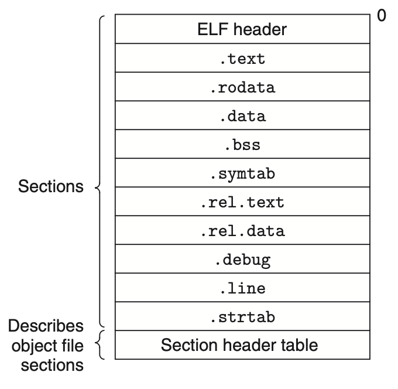

# Software

* collaboration among everyone participating in delivering software

> Terms

* BDD: Business Driven Development

* Process of Reference

* sentinel value: special value in the context of an algorithm which uses its presence as a condition of termination
  * [ex] in a loop or recursive algorithm
* OTA: Over the air programming

> Question

* Break following user story into two
  * Scenario 1: Favorite a New Route
    * Given that the user is on the Save Route screen
    * And they are saving a route named “RouteA”
    * When the user presses the “Favorite” button
    * And then they press the “Save” button
    * Then the app should go to the Routes page
    * And “RouteA” should be shown as a favorite
  * [ex]
  * As a user I want to message a nearby buddy so that we can meet up.  →
  * As an initiator I want to send invitation to a nearby buddy so that we can meet up
  * As a user I want to receive messages so that we can meet up

## Tools

* wiki?curid=10015: wiki based
* [compare different stacks](https://stackshare.io/)

> Terms

* BIOS (basic input input system)
  * firmware used to perform hardware initialization during the booting process (power-on startup)
  * provide runtime services for operating systems and programs

* Continuous delivery: Increase productivity (No manual intervention after writing codes)

* Library / Frameworks: predefined set of classes that does similar things

* Time
  * Universal time coordinate: Compromise between english and french abbreviation
  * GMT: Greenwich Mean Time, time zone at UTC + 0.0

* Posix (Portable Operating System Interface)
  * standards specified by IEEE Computer Society for maintaining compatibility between operating systems

* Program Counter (PC): PC points at (contains the address of) some machine-language instruction in main memory

* rpath: designates the run-time search path hard-coded in an executable file or library

* Software development Toolkit

* standalone (freestanding program)
  * no external module, library, program designed to boot with bootstrap procedure of target processor

* Windows Driver Model (wdm)
  * framework for device drivers that was introduced with Windows 98 and Windows 2000 to replace VxD (Windows 95, 3.1)

* Von Neumann model of computing: Fetch, decode, execute

* X Window System: xAuthority file is in ~, stores credentials in cookies used by xauth for authentication of X sessions

## Configure




* django
  * django.conf.global_settings.py: default values for settings
  * urls
    * url(r"regex", where_to_send_requests)
  * settings: use variable defined in settings.py

```py
from django.conf import settings
```




## KPI

* (Key Performance Indicator)

* Operational: problem understanding: clarify any uncertainties arount the problem SLA (Service-Level Agreement)
* Tactical: SME (subject matter expert)
  * accurate and repeatable analysis
  * concise documentation / automatic alerting & monitoring for unseen changes
* Strategical: Prioritize and identify important problem that are not actively being worked on product, process, policy
  * evaluate the success of an organization or of a particular activity in which it engages

* CPS (Cost Per Sales): the amount of money paid for every sale generated

* CTR (Click Through Rate): number of clicks that your ad receives divided by the number of times your ad is shown

### Version




```js
// 1. Compare versions
var semver = require('sember');
semver.diff('3.4.5', '4.3.7'); // 'major'
versions = ['1.2.3', '3.4.5']
var max = versions.sort(semver.rcompare)[0]
var min = versions.sort(semver.compare)[0]
```




## Setup




* sudo apt-get install python3-opencv
* pip install opencv-python
* django
  * export DJANGO_SETTINGS_MODULE=mysite.settings

```sh
# 1. Setup
sudo apt update
sudo apt install software-properties-common
sudo add-apt-repository ppa:deadsnakes/ppa
sudo apt install python3.9

# 2. Setup
pip install django
django-admin startproject mysite
# mysite/
#  venv/ <-- HERE
#  manage.py
#  mysite/
#    __init__.py
#    settings.py
#    urls.py
#    asgi.py
#    wsgi.py

django-admin startapp polls
# mysite/
#   ...
#   polls/
#     __init__.py
#     admin.py
#     apps.py
#     migrations/
#       __init__.py
#     models.py
#     tests.py
#     views.py

# 3. Environment
# postgresql://[user[:password]@][netloc][:port][/dbname][?param1=value1&...]
export DATABASE_URL="postgresql://localhost:5432"
export DJANGO_SETTINGS_MODULE="config.settings.local"
```




* /lib/systemd/system

| Run level | Mode       |
| --------- | ---------- |
| 0         | Power off  |
| 1         | Rescue     |
| 2         | Multi-User |
| 3         | Multi-User |
| 4         | Multi-User |
| 5         | Graphical  |
| 6         | Reboot     |

* .profile: run when bash is invoked as an interactive login shell, or as non-interactive shell with the --login option
  * Anything that should be available only to login shells should be here
  * Looks for /etc/profile -> ~/.bash_profile -> ~/.bash_login -> ~/.profile
  * Can ignore --noprofile option
  * ~/.bash_profile: should be super-simple and just load .profile and .bashrc
  * ~/.profile: stuff NOT specifically related to bash, such as environment variables (PATH and friends)

* .rc: Shorthand of run commands
  * ~/.bashrc: anything want at an interactive CLI (Command prompt, EDITOR variable, bash aliases)
  * Can ignore --norc option
  * Login shell: can use logout commandlien

```sh
# 1. Check
if [ -f .env ]; then export $(cat .env | sed 's/#.*//g' | xargs) fi

# 2. ~/.bashrc
case $- in # Only ofr interactive Shell
  *i*) ;;
    *) return;;
esac

HISTCONTROL=ignoreboth
shopt -s histappend # append to history file, don't overwrite it
HISTSIZE=1000       # set history size
HISTFILESIZE=1000   # set history file size

cdl() {
  cd"$@";
  ls -al;
}
mkcdir () {
  mkdir -p -- "$1" && cd -P -- "$1"
}
parse_git_branch() {
  git branch 2> /dev/null | sed -e '/^[^*]/d' -e 's/* \(.*\)/ (\1)/'
}
export PS1="\u@\h \W\[\033[32m\]\$(parse_git_branch)\[\033[00m\] $ "   # show branch in shell
export PS4='+(${BASH_SOURCE}:${LINENO}): ${FUNCNAME[0]:+${FUNCNAME[0]}(): }'
export VISUAL=vim
export EDITOR="$VISUAL"
alias ..='cd ..'
alias so="source ~/.bashrc"
alias fn="find . -name "
alias fr="find . -regex "
alias ipe='ipconfig getifaddr en0'
alias ipi='curl ipinfo.io/ip'
alias ll="ls -la"
alias mount='mount |column -t'
alias ports='netstat -tulanp'  # TCP / UDP
alias sshhosts="sed -n 's/^\s*Host\s+(.*)\s*/\1/ip' ~/.ssh/config"
alias speed='speedtest-cli --server 2406 --simple'
alias untar='tar -zxvf '
alias psm='ps aux | sort -nr -k 4 | head -3'
alias psm10='ps aux | sort -nr -k 4 | head -10'
alias psc='ps aux | sort -nr -k 3 | head -3'
alias psc10='ps aux | sort -nr -k 3 | head -10'
alias du1="du -hs * | sort -h"
alias du2="du -h -d 2 | sort -h"
alias g="git "
alias d="docker "
alias dc="docker compose"
alias ag="ag --hidden -U"

### C
source ~/github/opencv/build/setup_vars.sh
# CXXFLAGS += -c -Wall $(shell pkg-config --cflags opencv4) LDFLAGS += $(shell pkg-config --libs --static opencv4)
export PKG_CONFIG_PATH="/usr/local/lib/pkgconfig"
export CMAKE_PREFIX_PATH=~/github/opencv/build    # PATH searched by CMake FIND_XXX()
export CPPFLAGS="-I/usr/local/opt/libffi/include"
export LDFLAGS="-L/usr/local/opt/libffi/lib"
```




```sh
alias ldd="otool -L"
alias xclip="pbcopy"
alias xargs="gxargs"
```




* Mac Postgres
  * brew install postgres
  * brew services start postgresql
  * launchd: system wide and per-suer daemon/agent manager
  * launchctl: Interfaces with launchd







* github.com/settings/tokens: create github token

```sh
# 1. setup ssh for gitlab
ssh-keygen -t ed25519 -c "comment"
vim ~/.ssh/id_ed25519.pub  # Copy public key
# Go to gitlab preference (top right) -> ssh -> add public key
```




## Middleware




* django.middleware: framework of hooks into Django’s request/response processing
  * common.CommonMiddleware
  * cache.UpdateCacheMiddleware
  * cache.FetchFromCacheMiddleware

```py
class SimpleMiddleware:
  def __init__(self, get_response):
    self.get_response = get_response
    # One-time configuration and initialization.

  def __call__(self, request):
    # Code to be executed for each request before the view (and later middleware) are called.
    response = self.get_response(request)

    # Code to be executed for each request/response after the view is called.
    return response
```




### Install




```sh
sudo apt-get install openjdk-8-jdk
```




* Install ubuntu
  1. Install Linux ubunutu ISO file
  1. [Set up USB using rufus](https://rufus.ie/)
  1. Try Ubuntu without Installing
  1. 

* curl: providing a library and command-line tool for transferring data using various network protocols
  * -L: (HTTP) If requested page has moved to a different location use that
  * -P, --ftp-port address: (FTP) Reverses default listener roles when connecting with FTP
  * -q / -s / -i: Quite /Silent (no progress, error) / Include the HTTP-header in output
  * -m --max-time: maximum time in seconds
  * -o file / -O: Write output to file / local file named like the remote file we get
  * -X `type`: request `type` ([ex] POST)
  * -H `header`: header ([ex] 'Content-Type: app/json')
  * -d `data`: [ex] '{"id": "tom", "age": "7"}'

* rqm (Redhat Package Manager): manipulates specifically packages it is asked to manipulate
  * needs to know the exact location of .rqm package

* ant: Java installer

* dpkg: used to install, remove, and provide information about .deb
  * --ad-architecture: package can be installed without using --force-architecture
  * -s `package`: report status of `package`

* wget
  * -P: /path/to/folder
  * --spider: behave as a Web spider, just check that website are there
  * --ask-password: secure safe
  * --http-user / http-passwd: Specify username user and password on an HTTP (not safe)

* update-alternatives
  * maintain symbolic links determining default commands
  * --config: name
  * --install /usr/bin/python3 python3 /usr/bin/python3.8 2: set python3.8 with priority 2

```sh
# 1. curl
curl -s https://raw.githubusercontent.com/sivel/speedtest-cli/master/speedtest.py | python -
error() {
  print_error $@
  exit 1
}

curl -m 2 www.google.com &> /dev/null || error "Failed to access external"

# 2. Install multiple files
PKGS=(
  libusbx-devel
  gtk2
  gstreamer1
)
yum install -y ${PKGS[@]}

# 3. Mac install packages
# brew install binutils   # readelf equivalent 'export PATH="/usr/local/opt/binutils/bin:$PATH"' >> ~/.zshrc
defaults write -g ApplePressAndHoldEnabled -bool false  # disable accentuate
defaults write com.google.chrome IncognitoModeAvailability -integer 1z  # disable incognito mode
defaults write com.apple.finder AppleShowAllFiles TRUE : Show hidden folder on Mac

# 4. Ubuntu
sudo apt-get update && sudo apt-get install -y vim git docker python3.7 wget # Password / install
passwd
kill -HIP $PPID
dconf write /org/gnome/desktop/input-sources/xkb-options "['caps:escape']"  # switch caps-lock esc
dconf reset -f /                             # set up to default
sudo apt-get install bluez*                  # bluetooth
sudo apt-get install gnome-session-fallback  # toggle sidebar (settings -> dock -> auto-hide the dock)
```

> Reference

* [Korean Settings](https://gabii.tistory.com/entry/Ubuntu-1804-LTS-%ED%95%9C%EA%B8%80-%EC%84%A4%EC%B9%98-%EB%B0%8F-%EC%84%A4%EC%A0%95)
* [Reference](https://neoprogrammer.tistory.com/6)







```sh
sudo apt-get update
sudo apt-get install jenkins
```




### Shortcut




* Terminal
  * CTRL+A/E: move to beginning end of line
  * CTRL+B: moves backward one character
  * CTRL+C: halts the current command
  * CTRL+D: deletes one character backward or logs out of current session, similar to exit
  * CTRL+F: moves forward one character
  * CTRL+G: aborts the current editing command and ring the terminal bell
  * CTRL+H: deletes one character under cursor (same as DELETE)
  * CTRL+J: same as RETURN
  * CTRL+L: clears screen and redisplay the line
  * CTRL+M: same as RETURN
  * CTRL+N: next line in command history
  * CTRL+O: same as RETURN, then displays next line in history file
  * CTRL+P: previous line in command history
  * CTRL+R: searches backward
  * CTRL+S: searches forward
  * CTRL+T: transposes two characters
  * CTRL+UK: kills forward / backward from point to the beginning of line
  * CTRL+V: makes the next character typed verbatim
  * CTRL+W: kills the word behind the cursor
  * CTRL+X: lists the possible filename completions of the current word
  * CTRL+Y: retrieves (yank) last item killed
  * CTRL+Z: stops the current command, resume with fg in the foreground or bg in the background
  * ALT+BF: moves backward / forward one word (opt <-> mac)
  * ALT+D: deletes next word
  * ALT+H: deletes one character backward
  * ALT+T: transposes two words
  * ALT+.: pastes last word from the last command. Pressing it repeatedly traverses through command history
  * ALT+U: capitalizes every character from the current cursor position to the end of the word
  * ALT+L: uncapitalizes every character from the current cursor position to the end of the word
  * ALT+C: capitalizes the letter under the cursor. The cursor then moves to the end of the word
  * ALT+R: reverts any changes to a command you’ve pulled from your history if you’ve edited it
  * command + t: Create new tab
  * command + (shift) + d: Split terminal
  * ctrl + (shift) + tab: Navigate tabs

* Event designators
  * !n: n th command
  * !! !-n: previous command / nth previous command
  * ^old^new: change old from previous command to new (only one)
  * !#:n / $: nth / last word in current command
  * !!:gs/string1/string2: change old from previous command to new (multiple)

* Ubuntu
  * Settings -> Device -> Keyboard
  * Alt+Prt Scrn: take a screenshot of a window.
  * Shift+Prt Scrn: take a screenshot of an area you select
  * Alt + `: switch between same app
  * fn + window + arrow: next screen

* Mac
  * Control + Command + Q: Lock screen







* Go to symbol in Editor/workspace

* Edit
  * ⌘ d: edit multiple variables
  * option up / down: move current code up / down
  * ⌃ Space: trigger IntelliSense Suggestions
  * ⇧ ⌥ a: toggle comment

* File
  * Open...

* Navigation
  * ⌘ shift f / h: find / replace words in all files
  * ⌘ shift o: find symbol / move to method (with corresponding language extension)
  * ⌘ shift .: See all methods
  * ⌘ option click: Open Side
  * ⌘ click: Replace / Click again to go back
  * ⌃ (⇧) -: Navigate back (forward)

* Git
  * Reveal Commit in Side Bar
  * Open Changes with Previous / Next Revision

* References
  * Find All References

* Select
  * Multi-line cursor
  * Multi-line cursor
  * expand / shrink select

* Screen
  * ⌘ E: Find given word
  * Move Editor into Next / previous Group
  * ⌘ B: Toggle Sidebar
  * ⌘ k: zenmode
  * ctrl 1: Focus on editor
  * ⌘ K ⌘ /: Fold all block comments
  * ⌘ shift B: Build and debug
  * shift ⌘ M: jump to errors and warnings in the project
  * option ⌘ [: Code folding
  * ⌘ k ⌘ 0 / j: Fold / unfold all codes

* Search
  * Find in Files
  * Replace in Files: Regex Capture group can be referenced using $1…

* Terminal
  * Create New Integrated Terminal
  * Focus on terminal View
  * Focus Previous/Next Pane
  * New terminal
  * Split Terminal
  * Toggle Terminal

* View
  * Focus Next Editor Group
  * Move Editor into Next/Previous Group
  * Toggle Side Bar Visibility




### Update




* apt update




## Compile

* translates the text file hello.i into the text file hello.s like below
  * provides a common output language for different compilers for different high-level languages

```assembly
main:
  subq  $8,     %rsp
  movl  $.LC0,  %edi
  call  puts
  movl  $0,     %eax
  addq  $8,     %rsp
  ret
```

> Term

* cross compiler: when the host and target are different
  * [+] Speed - Target platforms are much slower than hosts,
  * [+] Capability - target platform doesn't have gigabytes of memory and hundreds of gigabytes of disk space




```sh
# 1. Optional Toolchain / Build Type         # Debug Version doesn't do compiler optimization
├── CMakeLists.txt
project("Hello")
cmake_minimum_required(VERSION 3.5)
set(SOURCE_FILES ${CMAKE_CURRENT_SOURCE_DIR}/main.cpp)
set(CMAKE_BUILD_TYPE Debug)                     # cmake -DCMAKE_BUILD_TYPE=Debug
add_executable(Hello ${SOURCE_FILES})
├── main.cpp
└── toolchain
  └── Linux-Clang.cmake
set(CMAKE_CXX_COMPILER "/usr/bin/clang++" CACHE string "clang++ compiler" FORCE)    # cmake -Bbuild -Ctoolchain/Linux-Clang.cmake

```




* GCC
  * .cpp [<.o>]: compile / link files (gcc -xc++ -lstdc++ -shared-libgcc)
  * -c: Compile / assemble the source files, but do not link (create .o)
  * -g: enable gdb
  * -H: Show header includes and nesting depth
  * -I `dir`: Search `dir` for include (headers)
  * -l: link libraries
  * -L: /path contains library files, .a, .so
  * -MD: Create dependency
  * -o `out`: preprocessed C source: stdout
  * -rpath=dir: -Wl,-rpath aaa bbb -> gcc -Wl,aaa -Wl,bbb
    * Add a directory to the runtime library search path
    * used when linking an ELF executable with shared objects (dynamic linker can find the libraries)
    * -rpath arguments are concatenated, passed to runtime linker, which uses them to locate shared objects at runtime
  * -std: [ex] =c++11: 11 version
  * -v: Verbose Mode
  * -Wall / extra: enable all warning / extra warnings
  * -Wfatal-errors: causes compiler to abort compilation on the first error occurred
  * -Wpedantic / unused: warnings demanded by strict ISO C and C++ / unused type definitions
  * /W4: all reasonable warnings
  * -Wl,aaa,bbb: list of tokens as a space-separated list of arguments to the linker (ld aaa bbb)
  * -x: Specify the language of the following input files

> Undefined behavior: the result of F() is a dangling reference

```cpp
// 1. undefined_behavior
function<const int&()> F([]{ return 42; });
int x = F();
```

> errors.cpp:1:10: fatal error: 'a' file not found

```cpp
#include <a>
#include <iostream>
```

> error: expected namespace name

```cpp
using namespace sd;
```

```cpp
int main() {
  // unknown type name 'in'
  // in a;

  // error: expression is not assignable
  // int a = 2 = 3;
  int a = 3;
  // error: expected ';' after expression
  // a++
  // a++;

  // error: use of undeclared identifier 'b'
  // b = 3;

  // warning: ivision by zero is undefined [-Wdivision-by-zero]
  // cout << 1 / 0;

  // error : cannot initialize a variable of type 'int' with an lvalue of type 'const char [3]
  // int a = "ff";

  int arr[1];
  arr[0] = 0;
  // error: AddressSanitizer: stack-buffer-overflow on address 0x7ffee07ea414 [-fsanitize=address]
  // std::cout << arr[1];

  // error: cannot delete expression of type 'int'
  // delete arr[0];

  // error: variable 'd' declared with deduced type 'auto' cannot appear in its own initializer
  // auto d = []() { d(); };

  auto e = "ab";
  // error: assigning to 'const char *' from incompatible type 'int
  // e = 3;

  // error: no matching conversion for C-style cast from 'std::__1::string' (aka 'basic_string<char, char_traits<char>,
  //        allocator<char> >') to 'int'
  // -> cannot cast string to int
  // (int) e;

  // error: expected type
  // -> type must be followed by new
  // new 1

  return 0;
  // warning: unused variable 'a' [-Wunused-variable]
  // int a = 2;
}
```




> javac

* -classpath
* -d: Specify where to place generated class files ([ex] `dir`)
* -sourcepath: [ex] ../.
* -g: [ex] ../threads/ThreadedKernel.java
* --version




## Linking

* Process of collecting and combinding various pieces of codes and data into single file
* File can be loaded (copied) by linker to memory and executed
* Can be performed at compile time, load time (by loader), run time (by program)
* By understanding
* Understand language scoping rules
* Exploit shared libraries

> Terms

* Strong symbol: functions and initialized global variables
  * multiple strong symbols with the same name are not allowed
* Weak symbol: uninitialized global variables
  * given multiple weak symbols, choose any of the weak symbols
* Symbol resolution: Object files define and reference symbols
  * each symbol corresponds to a function, a global variable, or a static variable
  * Linker associate each symbol refernce with exactly one symbol deifnition
* Relocation: Compilers and assemblers generate code and data sections that start at address 0
  * Linker relocates these sections by associating a memory location with each symbol definition
  * then modifying all of the references to those symbols so that they point to this memory location
  * blindly performs these relocations using detailed instructions, generated by the assembler, called relocation entries




```c
/* foo3.c */
#include <stdio.h>
void f(void);
int x = 1;
int main {
  f();
  printf("x = %d", x);  // 2 even if the duplicate symbol definitions have different types
  return 0;
}

/* bar3.c */
int x;
  void f() {
  x = 2;
}
```




* \#include \<fn\> preprocessor searches directories pre-designated by the compiler/IDE (std library)
* \#include "fn" preprocessor searches first in the same directory then search path (programmer-defined)
* /usr/lib
* /usr/local/lib: custom library
* Link Error starts with L
* Error when combine object files to create executable

> duplicate symbols found

* Same function declared in multiple files (#once)
* include same header multiple times (Check inline, static, #ifdef)

> unresolved external symbol

* Can’t find function declaration, header include

> Use of deleted function 'std::atomic\<int\>::atomic(const std::atomic\<int\>&)

* Can't assign atomic from int
* Can't directly print atomic, use .load

> ld: symbol(s) not found for architecture x86_64

```cpp
int man () {
```




### Static linking


* Compile time: take a collection of `relocatable object files` and arguments
* consist of various code and data sections, where each section is a contiguous sequence of bytes
* Sections: Instructions, initialized global variables, uninitialized variables
* Window → .lib or Unix → .a
* Bigger binary size, library can be erased

### Dynamic linking




```cpp
// main.cpp
void moo()
void main() {
moo();
}

// moo.h
#inlcude <iostream>
using namespace std;

__declspec(dllexport) void moo() {
cout << "moo" << endl;
}
```




### Object Files

* Relocatable object file: Contains binary code and data in a form
  * combined with other relocatable object files at compile time to create an executable object file

* EOF (executable object files): Contains binary code and data in a form
  * copied directly into memory and executed
  * produced by linkers play key roles in important systems functions
  * such as loading and running programs, virtual memory, paging, and memory mapping

* Shared object file: Can be loaded into memory and linked dynamically, at either load time or run time

* ELF relocatable object file
  * begins with 16-byte sequence that describes the word size and byte ordering of the system
  * information that allows a linker to parse and interpret the object file
  * size of the ELF header, the object file type
  * machine type (x86-64)
  * file offset of the section header table / size and number of entires



* .text: machine code of the compiled program
* .rodata: Read-only data such as the format strings in printf statements, and jump tables for switch statements
* .bss (block started by symbol): Uninitialized global and static C variables
