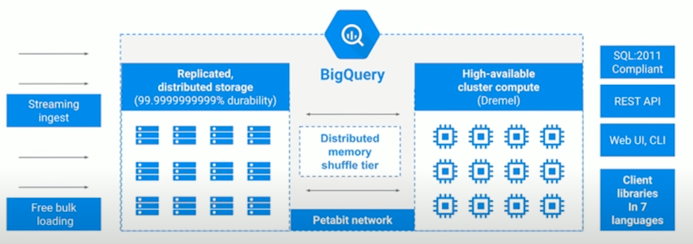
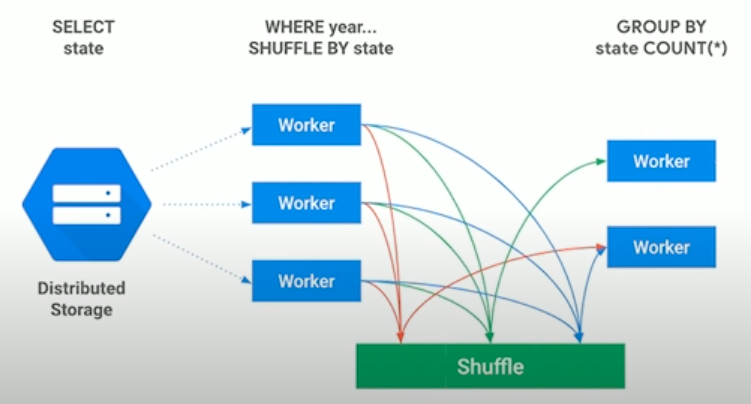
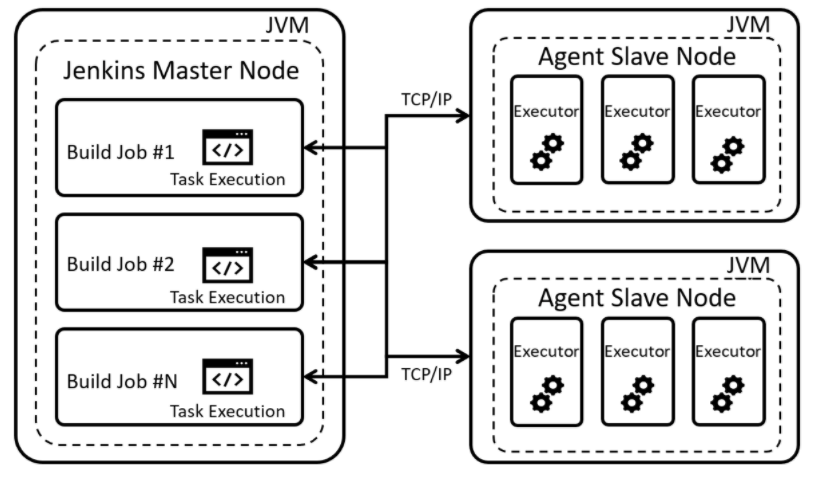

# Architecture

* Increaese design awareness in software community

* Class should be deep: Add complexity, must restructure when requirement changes
  * Abstraction
  [ex]
  [-] Java File IO
  [+] Linux File IO)
  

* Desfine Errors Out of Existence: Huge source of complexity -> define semantics to eliminate exceptions
  * Minimize the number of places where exceptions must be handled (vs return value)
  * tcl unset command enclosed with all exception handler
  * [ex]
  Window: can't delete file if open vs Linux: delete file and clean up when deleted closed
  Java: substring range exceptions vs Python: not throw exception

* Tactical vs Strategic Programming: get next feature / bug fix working ASAP / No shortcuts No kludges
  * bad design, high complexity, tactical tornadoes
  * Startup's deadline / Facebook move quickly
  

> Types

* Microservice: independently deployable modules
  * [+] tests are also faster / faster, simpler CD
  * [+] Each microservice can be independently scaled / robust / security

* single-tier app: application where user interface, backend business logic & database all reside in same machine
  * [-] business has no control over the application, cannot fix buggy code
  * [-] vulnerable to being tweaked & reversed engineered

* two tier: Logical separation of components in an application or a service
  * components are the database, backend application server, user interface, messaging, caching
  




* Django: Model-view-controller
  
  * URL patterns to decide which view to pass the request to for handling
  * project can contain multiple apps
  * automatically reloads Python code for each request as needed







* Storage and compute is independantly scaleable
* Rmote memory shuffle
  * [+] Faster performance for complex queries, join and aggregate more data, better scalability
  * [+] Secure: Data is splitted into data blocks which is compressed, encrypted with different keys
  

* Managed Storage: Tables are stored in optimized columnar format
  * Each table is compressed and encrypted on disk
  * avro -> parquet / orc -> csv -> json -> csv (compressed) -> json (compressed) (gzip data are not splittable)
  * [+] No limit on data injestion
  




* Slave master: asymmetric communication or control where device, process controls 1+ other devices, processes
  * serves as their communication hub
  




> Reference

[GCP Architecture](https://www.youtube.com/watch?v=ZVgt1-LfWW4)
[Design of Computer architecture](https://www.youtube.com/watch?v=bmSAYlu0NcY)

## Monolitic

* single-tiered software app in which UI and data access code are combined into single program from single platform
* app is responsible not just for a particular task, but can perform every step needed to complete a particular function

## SOA

* Service oriented architecture is an architectural style that supports service orientation
* [+] Greater business agility; faster time to market, Improved collaboration between business and IT
* [+] Ability to leverage legacy functionality in new markets

1. It logically represents a repeatable business activity with a specified outcome
2. It is self-contained
3. It is a black box for its consumers, meaning the consumer does not have to be aware of the service's inner workings
4. It may be composed of other services
