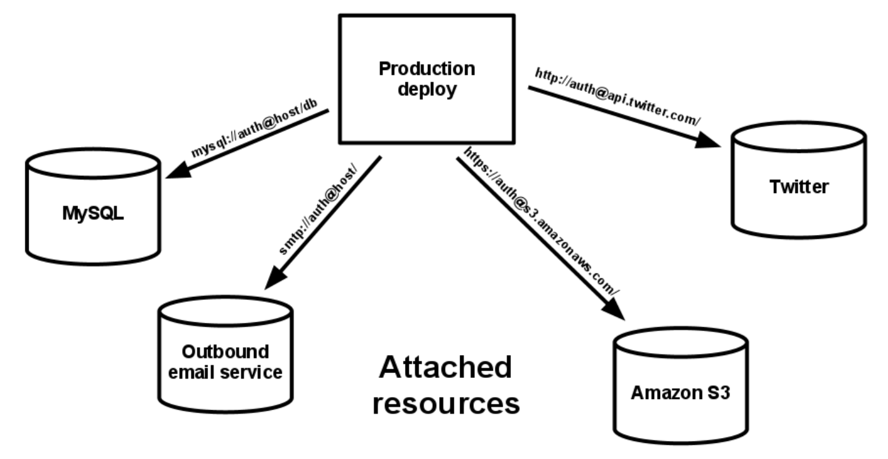
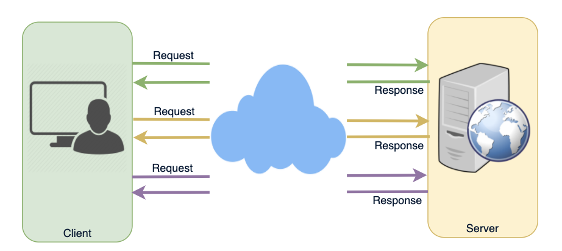
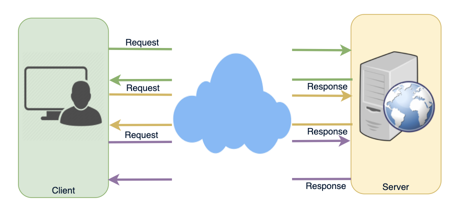
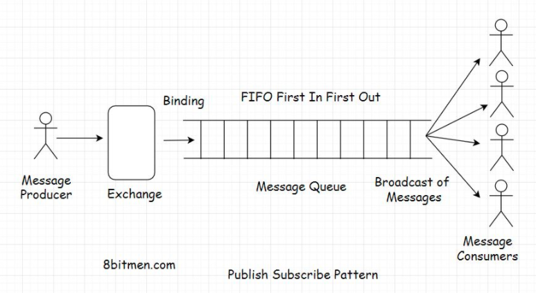

# Backend



* any service the app consumes over the network as part of its normal operation
* No distinction between local and third party service accessed via locator (URL) and credentials in config
* Should be able to swap out a local db with one managed by a third party (Amazon RDS) without any changes to app’s code

> Term

* Datastores: [ex] mysql, couchDB
* SMTP: [ex] Postfix
* Caching system: [ex] Memcahced




* Strogra at 15cent / GB / month

> Type

* Glacier: infrequently accessed but must be kept for a long time
* One Zone-Infrequent Access: cloud backups can be accessible as fast as possible to reduce downtime during the recovery

* ls: list s3 objects and common prefixes under a prefix or all S3 bucky
  * s3://`bucket_name`: List objects and common prefixes under a specified bucket and prefix
* mb s3://`bucket_name`: Create a specific S3 bucket
* mv s3://`bucket_name_1` s3://`bucket_name_2`: Move objects from bucket_name_1 to bucket_name_2
  * --recursive
* rb s3://`bucket_name`: Remove an empty specific S3 bucket by name
* sync `source` `target`: Sync all contents from `source` to a `target` directory
  * copy and update all missing or outdated files or objects between source and target




> Reference

<https://12factor.net/backing-services>

## Ajax



1. The client opens a connection and requests data from the server using regular HTTP.
1. The requested webpage sends requests to the server at regular intervals (e.g., 0.5 seconds).
1. The server calculates the response and sends it back, just like regular HTTP traffic.
1. The client repeats the above three steps periodically to get updates from the server.

* Asynchronous JavaScript and XML
* the request are sent to the server by using XMLHttpRequest objects
* [-] Keep asking the server for any new data -> empty responses, creating HTTP overhead

## GRPC

* [-] schema based, error handling
* [-] Thick client - limited languages - Proxies don’t understand it
* [-] Still young, no native browser support
* [-] Timeouts, circuit breaker just like any RPC (pub/sub rules in this case

### Protocol Buffer

* Language neutral compact message format created by google
* [Crash Course](https://www.youtube.com/watch?v=46O73On0gyI)

> protoc CLI

* --js_out `import_style` `proto_file`: [ex] import_style=commonjs,binary:. employees.proto

```proto
syntax = "proto3";

message Employee {
  int32 id = 1;
  string name = 2;
  float salary = 3;
}

message Employees {
  repeated Employee employees = 1;
}
```




* npm install google-protobuf

```js
const Schema = require("./employees_pb");
const fs = require("fs")
const hussein = new Schema.Employee();
hussein.setId(1001);
hussein.setName("Hussein");
hussein.setSalary(1001);

const ahmed = new Schema.Employee();
ahmed.setId(1002);
ahmed.setName("Ahmed");
ahmed.setSalary(9000);

const rick = new Schema.Employee();
rick.setId(1003);
rick.setName("Rick");
rick.setSalary(5000);

const employees = new Schema.Employees();
employees.addEmployees(hussein);
employees.addEmployees(ahmed);
employees.addEmployees(rick);
const bytes = employees.serializeBinary();
console.log("binary " + bytes)
fs.writeFileSync("employeesbinary", bytes)

const employees2 = Schema.Employees.deserializeBinary(bytes);

console.log(employees2.toString())
```




## Long-polling

1. client makes an initial request using regular HTTP and then waits for a response
1. server delays its response until an update is available or a timeout has occurred
1. When an update is available, the server sends a full response to the client
1. client typically sends a new long-poll request
    * either immediately upon receiving a response or after a pause to allow an acceptable latency period
1. Each Long-Poll request has a timeout. The client has to reconnect periodically after the connection is closed due to timeouts



* When server does not have any data available for the client
* Instead of sending an empty response, the server holds the request and waits until some data becomes available
* Once the data becomes available, a full response is sent to the client
* client then immediately re-request information from server
* so that server will almost always have an available waiting request that it can use to deliver data in response to an event

## Message Queue

* Messaging / Queing system: [ex] RabbitMQ, Beanstalkd

### Pub Sub



* Message queues have exchanges that further push messages to the queues based on exchange type and set rules

### Point to Point

## Open API

* Specification (OAS) defines a standard, language-agnostic interface to RESTful APIs
* allows humans, computers to discover and understand capabilities of service without access to code, documentation
* consumer can understand and interact with remote service with a minimal amount of implementation logic
* brew install openapi-generator (mac)

* openapi-generator CLI
  * help: show help message
  * -i `json`: `json` file from swagger open ([ex] /swagger/?format=openapi)
  * -o `folder`: save generated api in `folder`
  * -g: ([ex] typescript-axios)

## REST

* Representational State Transfer: architectural style for developing web service which exploit ubiquity HTTP protocol
* uses HTTP method to define actions
* client-server, stateless, cache, uniform interface, layered system, code on demand
* Resources

> Terms

* methods: When API functionality naturally maps to one of standard methods, that method should be used in API design
  * List, Get, Create, Update, Delete
  * name should not include prepositions
  * Indicate that new method is being used where field should instead be added to an existing method




* django-reset-framework
  * Authentication policies include packages for OAuth1 and OAuth2
  * Great Serialization supports both ORM and non-ORM data sources
  * pip install djangorestframework

```py
from rest_framework.test import APIRequestFactory
from rest_framework import serializers
from rest_framework import JSONRender

from .models import Hero

# 1. Settings.py
INSTALLED_APPS = [
  ...
  'rest_framework',
  ...
]

REST_FRAMEWORK = {
  'DEFAULT_PERMISSION_CLASSES': [
    'rest_framework.permissions.AllowAny',
  ]
}

# 2. Serializer
class HeroSerializer(serializers.HyperlinkedModelSerializer):
  class Meta:
    model = Hero
    fields = ('name', 'alias') # "__all__"
    # exclude = []

# 3. pagenation
class ProductsPagination(LimitOffsetPagination):
  default_limit = 10
  max_limit = 100
class ProductList(ListAPIView):
  pagination_class = ProductsPagination

# 4. Test
factory = APIRequestFactory()
request = factory.post('/notes/', {'title': 'new idea'})

from django.urls import reverse
from rest_framework import status
from rest_framework.test import APITestCase
from myproject.apps.core.models import Account

class AccountTests(APITestCase):
  def test_create_account(self):
    """ Ensure we can create a new account object. """
    url = reverse('account-list')
    data = {'name': 'DabApps'}
    response = self.client.post(url, data, format='json')
    self.assertEqual(response.status_code, status.HTTP_201_CREATED)
    self.assertEqual(Account.objects.count(), 1)
    self.assertEqual(Account.objects.get().name, 'DabApps')
```




### REST Methods

* GET: fetch data from server
  * can be cached, bookmarked, only used to request data (not modify)
  * remain in the browser history, have max 2048 characters, ASCII characters allowed
  * should never be used when dealing with sensitive data
  * application/x-www-form-urlencoded

* POST: send data to a server to create/update a resource
  * never cached, do not remain in the browser history, cannot be bookmarked
  * no restrictions on data length
  * application/x-www-form-urlencoded or multipart/form-data / multipart encoding for binary data

* PUT: send data to a server to create/update a resource (idempotent to POST)
  * same PUT request multiple times will always produce the same result

* HEAD: almost identical to GET, but without the response body

* DELETE: deletes the specified resource

* PATCH: used in cases where the resource has many fields but you only want to update a few
  * Like with PUT, send a request to myapi/drivers/{id} only send the fields you want to change in request body

* OPTIONS: describes the communication options for the target resource




```js
// 1. Response
/* Send */
GET /index.html HTTP/1.1
Host: www.example.com

/* Back */
HTTP/1.1 200 OK

/* Header */
Content-Type: text/html; charset=UTF-8
Content-Length: 208
```




### Status

* 1** Informational: received and the process is continuing
  * 101 Switching Protocols: asked the server to switch protocols
  * 103 Checkpoint: resumable requests proposal to resume aborted PUT/POST requests

* 2xx: Successful: Message:  Description:
  * 200 OK: OK (standard response for successful HTTP requests)
  * 201 Created: fulfilled, and a new resource is created
  * 202 Accepted: accepted for processing, but the processing has not been completed
  * 203 NoAuth Information: successfully processed, but returning info from another source
  * 204 No Content: successfully processed, no content
  * 205 Reset Content: successfully processed, no content, requires that requester reset view
  * 206 Partial Content: delivering only part of resource due to a range header sent by client

* 3** Redirection: further action must be taken in order to complete the request
  * 300 Multiple Choices: link list. users can select, visit the link. Maximum five addresses
  * 301 Moved Permanently: moved to a new URL
  * 302 Found: moved temporarily to a new URL
  * 303 See Other: page can be found under a different URL
  * 304 Not Modified: Indicates requested page has not been modified since last requested
  * 306 Switch Proxy: No longer used
  * 307 Temporary Redirect: moved temporarily to a new URL
  * 308 Resume Incomplete: resumable requests proposal to resume aborted PUT/POST requests

* 4** Client Error: indicates that requested resource is not available at the web server
  * 400 Bad Request: cannot be fulfilled due to bad syntax
  * 401 Unauthorized: legal request, but authentication has failed or not yet been provided
  * 402 Payment Required: Reserved for future use
  * 403 Forbidden: legal request, but the server is refusing to respond to it
  * 404 Not Found: not be found but may be available again in the future
  * 405 Method Not Allowed: made of a page using a request method not supported by that page
  * 406 Not Acceptable: only generate a response that is not accepted by the client
  * 407 Proxy Auth Required: client must first authenticate itself with the proxy
  * 408 Request Timeout: server timed out waiting for the request
  * 409 Conflict: could not be completed because of a conflict in the request
  * 410 Gone: page is no longer available
  * 411 Length Required: "Content-Length" is not defined. server requires it
  * 412 Precondition Failed: precondition given in request evaluated to false by server
  * 413 Request Entity Large: server will not accept request, because request entity is large
  * 414 Request-URI Too Long: server will not accept request, because URL is too long (GET)
  * 415 Unsupported Media: server will not accept request, because media type is not supported
  * 416 Requested Range Not: asked for a portion of file, but server cannot supply that portion
  * 417 Expectation Failed: server cannot meet the requirements of Expect request-header field

* 5xx: Server Error: processing fails due to some unanticipated incident on the server side
  * 500 Internal Server Error: A generic error, given when no more specific message is suitable
  * 501 Not Implemented: server either doesn’t recognize request method, or lacks ability to fulfill
  * 502 Bad Gateway: gateway server received an invalid response from upstream server
  * 503 Service Unavailable: server is currently unavailable (overloaded or down)
  * 504 Gateway Timeout: gateway server didn’t receive a timely response from upstream server
  * 505 HTTP Version Not: does not support the HTTP protocol version used in the request
  * 511 Network Auth: client needs to authenticate to gain network access

## Server-sent Event

* client establishes a persistent and long-term connection with the server
* [+] when real-time traffic from server to client
* [+] when server is generating data in a loop and will be sending multiple events to the client

## SOAP

* Simple Object Access Protocol is a messaging protocol specification for exchanging structured information
* in implementation of web services in computer networks
* [+] has available to it all facilities of XML, with easy internationalization and extensibility with XML Namespaces
* [-] verbosity of the protocol, slow parsing speed of XML
* [-] lack of a standardized interaction model led to the dominance of services using the HTTP protocol more directly

```txt
POST /InStock HTTP/1.1
Host: www.example.org
Content-Type: application/soap+xml; charset=utf-8
Content-Length: 299
SOAPAction: "http://www.w3.org/2003/05/soap-envelope"

<?xml version="1.0"?>
<soap:Envelope xmlns:soap="http://www.w3.org/2003/05/soap-envelope" xmlns:m="http://www.example.org">
  <soap:Header>
  </soap:Header>
  <soap:Body>
    <m:GetStockPrice>
      <m:StockName>T</m:StockName>
    </m:GetStockPrice>
  </soap:Body>
</soap:Envelope>
```

## Websocket

1. Client requests data from a server using regular HTTP
2. The requested webpage opens a connection to the server
3. The server sends the data to the client whenever there’s new information available

* WebSocket provides Full duplex communication channels over a single TCP connection
* provides a persistent connection between a client and a server that both parties can use to start sending data at any time
