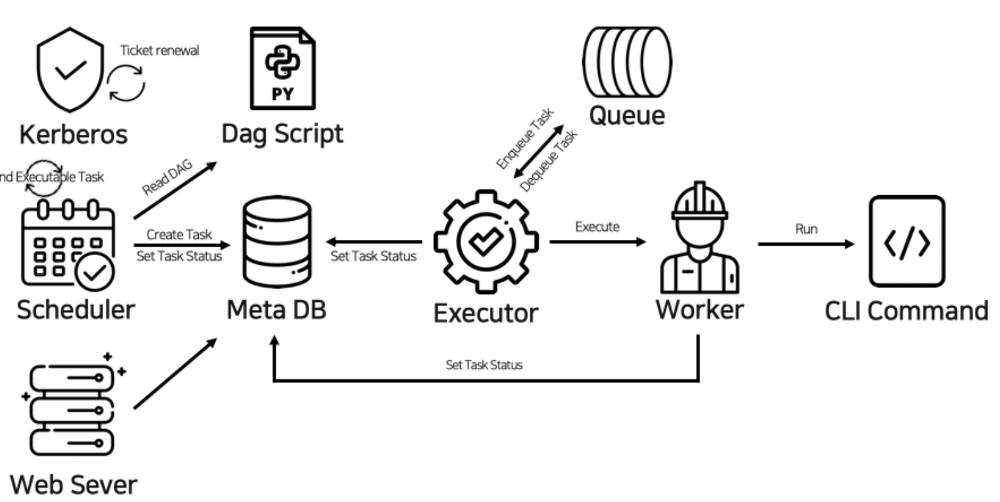
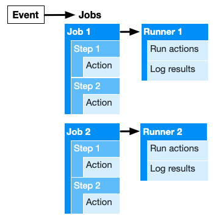
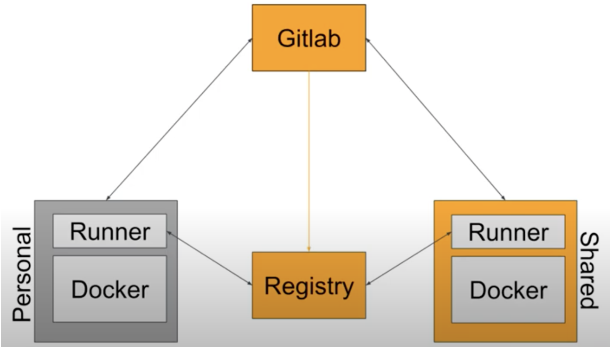
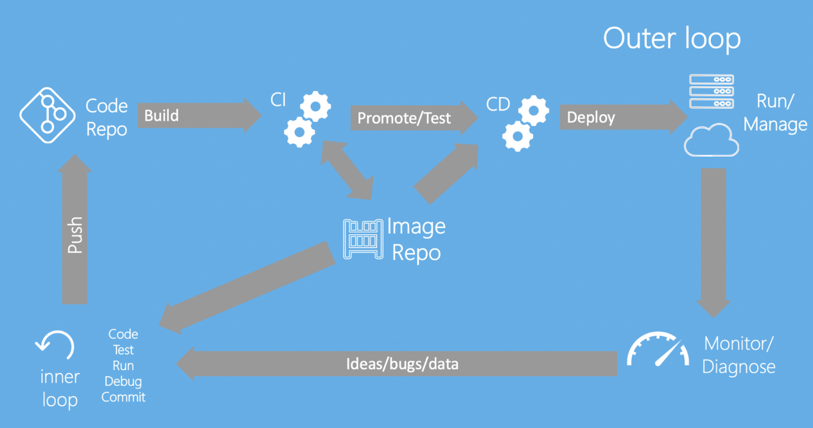
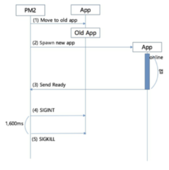

# CI

* [avto-dev/markdown-lint@v1](https://github.com/marketplace/actions/markdown-linting-action)
  * rules: '/lint/rules/changelog.js'
  * config: '/lint/config/changelog.yml'
  * args: './CHANGELOG.md'
  * ignore: './one_file.md ./another_file.md'
* actions/setup-python@v1
  * python-version: "3.x"
* [ad-m/github-push-action@master](https://github.com/marketplace/actions/docker-build-push-action)
  * github_token: Token (save in secretes)
  * branch: branch to push
  * username
    * _json_key for GCP
  * password
    * service account json for GCP
* [GoogleCloudPlatform/github-actions/setup-gcloud@master](https://github.com/google-github-actions/setup-gcloud)
  * enable gcloud cli
* [Setup Java](https://github.com/actions/setup-java)






* failure: retry if failure happens
* monitoring: success or failure status
* dependence: exceution dependenct
* scalability: centralized scheduler between different cron machine

> Terms

* DAG Script: Python script
* Kerberos: ticket renewer for auth (optional)
* MetaDB: Metadata storage
* Scheduler: monitor and control Directed Acyclic Graph
* Webserver: Airflow web UI

> the old setting has been used, but please update your config

* update AIRFLOW_HOME env






* Easy setup, same tool

> Terms

* artifacts: Can only be uploaded by a workflow
  * actions/upload-artifact
* events: a specific activity that triggers a workflow ([ex]: issue, pull request)
* jobs: a set of steps that execute on the same runner
* runners: a server that has the GitHub Actions runner application installed
  * compute resources: one virtual CPU, memory up to 3.75GB, remote network connection
  * local file system: Read, write access, 100GB, /github/home, /github/workspace
  * event payloads
* payload: Different events for triggering workflows
* steps: an individual task that can run commands in a job
* workflows: an automated procedure that you add to your repository ([ex] build, test, package, release, deploy)






> Terms

* token_realm: authentication endpoint, usually GitLab URL. needs to be reachable by the user
* http_secret: random string to sign state that may be stored with client to protect tampering
* internal_key: automatically generated. Contents of key that GitLab uses to sign the tokens
* registry_http_addr: Needs to be reachable by web server (or LB)

* register
  * stage,qa,build,deploy




## CI CLI




* pip install apache-airflow
* version
* webserver
* db init
* scheduler




## Conifguration

* Strict seperation of config from code ([ex] no config constants in code)
* stores config in environment variables
  * [+] easy to change between deploys, little chance of them checked into code repo, language agnostic
* Group config into folder
  * [-] Multiple combinations




* configmap: External configuration of your application
  * Don't put credential
* secret: base64 encoded used to store secret data




## File

* action: standalone commands that are combined into steps to create a job (smallest building block of a workflow)

* events: specific activity that triggers a workflow
* jobs: must have identifier with alphanumeric
  * **`job_id`.runs-on**: . The type of machine to run the job on
  * `job_id`.name: The name of the job displayed on GitHub
  * `job_id`.needs
    * job1 / [job1, job2]: only jobs that must complete successfully before this job will run
    * If a job fails, all jobs that need it are skipped unless a conditional expression that causes the job to continue

* workflow: an automated procedure added to your repository
  * made up of 1+ jobs and can be scheduled or triggered by event

* defaults: A map of default settings that will apply to all jobs in the workflow
  * run: provide default shell and working-directory options for all run steps in a workflow

* name: workflow name GitHub displays on your repository's actions page
  * If omit, sets it to workflow file path relative

* run: run commands in the virtual environment's shell

* secret: stored encrypted environment variable that can't be viewed or edited (up to 100 secrets, 64 KB)
  * can be accessed with `${{ secrets.STAGING_DB_HOST }}`


* steps: working-directory: `./my-app`

* **on** push=[push, pull]: Specify the event that automatically triggers the workflow file
  * Key: webhooks, schedule, pull_request, push
  * Value: paths-ignore: ignore when pushing on following

* uses: identifies an action to use, defines location of that action




```yml
# 1. Hello world
name: CI
on:         # Controls when the action will run.
  push:     # Triggers the workflow on push or pull request events but only for the main branch
    branches: [ main ]
  pull_request:
    branches: [ main ]
  workflow_dispatch:    # Allows you to run this workflow manually from the Actions tab
jobs:                   # workflow run is made up of 1+ jobs that can run sequentially or in parallel
  build:                # This workflow contains a single job called "build"
  runs-on: ubuntu-latest        # type of runner that the job will run on
  steps:                        # represent a sequence of tasks that will be executed as part of job
  - uses: actions/checkout@v2   # Checks-out your repository under $GITHUB_WORKSPACE, so your job can access it
  - name: Run a onescript       # Runs a single command using the runners shell
    run: echo Hello, world!
  - name: Run a multi script    # Runs a set of commands using the runners shell
    run: |
      echo Add other actions to build,
      echo test, and deploy your project.

# 2. Push again
name: Update index.html
on: push
jobs:
  run:
    runs-on: windows-latest
    steps:
    - uses: actions/checkout@v2
    - name: Set up Python
      uses: actions/setup-python@v1
      with:
        python-version: '3.x'
    - name: Install dependencies
      run: |
        dir
        python -m pip install --upgrade pip
        pip install -r requirements.txt
        python update.py
        dir

    - name: Commit files
      id: commit
      run: |
        git config --local user.email "action@github.com"
        git config --local user.name "github-actions"
        git add --all
        if [-z "$(git status --porcelain)"]; then
           echo "::set-output name=push::false"
        else
           git commit -m "Add changes" -a
           echo "::set-output name=push::true"
        fi
      shell: bash
    - name: Push changes
      if: steps.commit.outputs.push == 'true'
      uses: ad-m/github-push-action@master
      with:
         github_token: ${{ secrets.GITHUB_TOKEN }}
```




* .gitlab-ci.yml
  * CI_PIPELINE_SOURCE: push / schedule /web

```yml
# 1. Hello world
stages:
  - build
  - test

build:
  stage: build
  script:
  - echo "Building"
  - mkdir build
  - touch build/info.txt
  artifacts:
  paths:
  - build/

test:
  stage: test
  script:
  - echo "Testind"
  - test -f "build/info.txt"

# 2. Gitlab with Docker
### docker run --rm -it  ubuntu:latest --privileged=true
### [inside docker]
### apt update
### apt install -y apt-transport-https software-properties-common
### apt install curl
### curl -fsSL https://download.docker.com/linux/ubuntu/gpg | apt-key add -
### add-apt-repository "deb [arch=amd64] https://download.docker.com/linux/ubuntu $(lsb_release -cs) stable"
### apt install docker-ce
### docker run -d --name gitlab-runner --restart always
###            -v /srv/gitlab-runner/config:/etc/gitlab-runner
###            -v /var/run/docker.sock:/var/run/docker.sock gitlab/gitlab-runner:latest
image: busybox:latest

before_script:
  - echo "Run an update here or install a build dependency or print out some debugging details"

after_script:
  - echo "do some cleanup here"

build1:
  tags:
    - docker
  stage: build
  script:
    - echo "Do your build here"

test1:
  tags:
    - docker
  stage: test
  script:
    - echo "For example run a test suite"

test2:
  tags:
    - docker
  stage: test
  script:
    - echo "Do another parallel test here"
  only:
  variables:
    - $TEST_LINUX == "true"

deploy1:
  tags:
    - docker
  stage: deploy
  script:
    - echo "Do your deploy here"
```




```py
from datetime import timedelta

# The DAG object; we'll need this to instantiate a DAG
from airflow import DAG

# Operators; we need this to operate!
from airflow.operators.bash import BashOperator
from airflow.utils.dates import days_ago
# These args will get passed on to each operator
# You can override them on a per-task basis during operator initialization
default_args = {
  'owner': 'airflow',
  'depends_on_past': False,
  'email': ['airflow@example.com'],
  'email_on_failure': False,
  'email_on_retry': False,
  'retries': 1,
  'retry_delay': timedelta(minutes=5),
}
dag = DAG(
  'tutorial',
  default_args=default_args,
  description='A simple tutorial DAG',
  schedule_interval=timedelta(days=1),
  start_date=days_ago(2),
  tags=['example'],
)

# t1, t2 and t3 are examples of tasks created by instantiating operators
t1 = BashOperator(
  task_id='print_date',
  bash_command='date',
  dag=dag,
)

t2 = BashOperator(
  task_id='sleep',
  depends_on_past=False,
  bash_command='sleep 5',
  retries=3,
  dag=dag,
)
dag.doc_md = __doc__

t1.doc_md = """\
# Task Documentation
You can document your task using the attributes `doc_md` (markdown),
"""
command = """
"""

t3 = BashOperator(
  task_id='templated',
  depends_on_past=False,
  bash_command=templated_command,
  params={'my_param': 'Parameter I passed in'},
  dag=dag,
)

t1 >> [t2, t3]
```




## Jenkins

> Docker

* [+] reduces deployment into small pieces, horizontally scalable
* [+] same build system, libraries across developer, test, production

* Docker workflow




* 1GB RAM, 10 GB disk → docker community Edition
* stability / extensible / free / visibility using pipelines
* test production like environment quality assurance
* Automate delivery: continuous delivery
* "Archive the artifacts" option in "Post Build Actions" section is specify exact files to archive for build

> Terms

* folder
  * group things together containing jobs views and other folders
  * provides separate namespace, deleting folder delete all contents

* view
  * display jobs that meet a criteria, like a filter

* workspace
  * dedicated directory on the Jenkins server where each job is given and store generated files

* build steps
  * define the actions that Jenkins will take during a build




```js
pipeline {
  agent any
  stages {
    stage('Hello') {
      steps {
        echo 'Hello World'
      }
    }
    stage('Bye') {
      steps {
        echo 'Bye World'
      }
    }
  }
}
```




## Artifact




* output generated at the end of each build exists beyond build step
* stored and stacked in registries
* Authentication is required to upload artifacts




```yml
jobs:
  example-job:
    name: Save output
    steps:
      - shell: bash
        run: |
          expr 1 + 1 > output.log
      - name: Upload output file
        uses: actions/upload-artifact@v2
        with:
          name: output-log-file
          path: output.log
```




## Python




```yml
# 1. Checkc on multiple python versions
name: test

on:
  pull_request:
    branches: ["main"]
  push:
    branches: ["main"]

jobs:
  build:
    runs-on: ubuntu-latest
    strategy:
      matrix:
        python-version: [3.8, 3.9]
    steps:
      - uses: actions/checkout@v2
      - name: Set up Python ${{ matrix.python-version }}
        uses: actions/setup-python@v2
        with:
          python-version: ${{ matrix.python-version }}
      - name: Install dependency
        run: |
          pip install -r requirements.txt

      - name: Install and Run pre-commit
        uses: pre-commit/action@v2.0.3

# 2. Release python package to Pypi
name: Upload Python Package

on:
  release:
    types: [published]

jobs:
  deploy:
    runs-on: ubuntu-latest
    steps:
      - uses: actions/checkout@v2
      - name: Set up Python
        uses: actions/setup-python@v2
        with:
          python-version: '3.x'
      - name: Install dependencies
        run: |
          python -m pip install --upgrade pip
          pip install build
      - name: Build package
        run: python -m build
      - name: Publish package
        uses: pypa/gh-action-pypi-publish@27b31702a0e7fc50959f5ad993c78deac1bdfc29
        with:
          user: __token__
          password: ${{ secrets.PYPI_API_TOKEN }}
```




## Deploy

* Deploy is a running instance of the app all should share same codebase ([ex] dev, staging, production)
* Do not debug in production settings ([ex] match local with production)
  * Add logging history for production server
* Horizontal scaling: stateless and share nothing
  * Any data that needs to persist must be stored in a stateful backing, typically a database
* Deployment tools offer release management tools, e.g. the ability to roll back to a previous release ([ex] Capistrano)
* Every release should always have a immutable, unique release ID
* Minimize run stage steps to minimize app crash cost




* Frontend Service
  * AWS S3 + AWS CloudFront
  * Google Cloud Storage + Google Cloud CDN
  * GitHub Pages + CloudFlare
  * Now
  * Surge
  * Netlify

* Backend
  * AWS Elastic beanstalk or AWS EC2
  * Google App Engine
  * Now
  * Heroku

> pm2

* Unstopable Release






* k8s cluster doesn't manage data persistance

> Terms

* Deployment: for stateless apps, declarative updates for pods and ReplicaSets
  * pause and resume
* StatefullSet: for stateFul apps / database
* volume: data persistance

> Setup

* docker, virtual box
* Mac




> CI




```yml
# 1. Deploy
name: hosting
on:
  push:
    branches: [main]
  schedule:
    - cron: "0 17 * * *"
  workflow_dispatch:
jobs:
  setup-build-deploy:
    name: Setup, Build, and Deploy
    runs-on: ubuntu-latest
    steps:
      - name: Checkout
        uses: actions/checkout@v2
      - uses: google-github-actions/setup-gcloud@master
        with:
          version: "290.0.1"
          project_id: seansdevnote
          service_account_key: ${{ secrets.SERVICE_ACCOUNT_JSON }}
      - name: Authorize Docker push
        run: gcloud auth configure-docker
      - name: create .env file
        uses: SpicyPizza/create-envfile@v1
        with:
          envkey_GIT: ${{ secrets.GIT }}
          envkey_OAUTH: ${{ secrets.OAUTH }}
          envkey_SERVICE_ACCOUNT: ${{ secrets.SERVICE_ACCOUNT }}
      - name: Build
        run: |-
          docker-compose build
          docker-compose push
      - name: Deploy
        run: |-
          gcloud run deploy page \
            --image gcr.io/seansdevnote/page \
            --region us-central1 \
            --platform "managed" \
            --service-account firebase-adminsdk-h70pe@seansdevnote.iam.gserviceaccount.com
```




## Variable




* $VARIABLE_NAME
* $Env:VARIABLE_NAME
  * variable is read from the shell
* ${{ env.VARIABLE_NAME }}
  * variable is read from the workflow (can be used for other flow configuration)
  * cannot use environment defined in same step

* GITHUB_ACTION: The unique identifier of the action
* GITHUB_ACTOR: [ex] seanhwangg
* GITHUB_EVENT_PATH: Path to a file that contains event payload
* GITHUB_REPOSITORY: repository owner and repo name ([ex] seanhwangg/hello_world)
* GITHUB_RUN_ID: unique number for each run within a repository, which doesn't change when re-run workflow
* GITHUB_SHA: commit SHA that triggered the workflow ([ex] ffac537e6cbbf934b08745a378932722df287a5d3)
  * SHA12: ${GITHUB_SHA::12}
* GITHUB_WORKSPACE
* GITHUB_TOKEN: automatically creates a secret to use in your workflow
  * You can use the GITHUB_TOKEN to authenticate in a workflow run
* RUNNER_OS: [ex] Linux, Windows, macOS

* github
  * repository: owner and repository name ([ex] seanhwangg/hello_world)
  * repository_owner: repository owner's name ([ex] seanhwangg)

```yml
jobs:
  example-jobs:
    steps:
      - name: PSQL
        run: node client.js
        env:
          POSTGRES_HOST: postgres
          POSTGRES_PORT: 5432
```




* CI_PROJECT_NAME: name of repository
* CI_COMMIT_REF_NAME: name of branch



