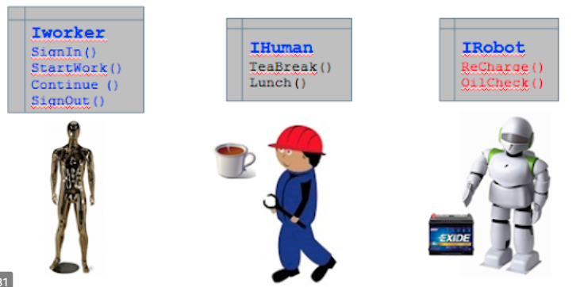
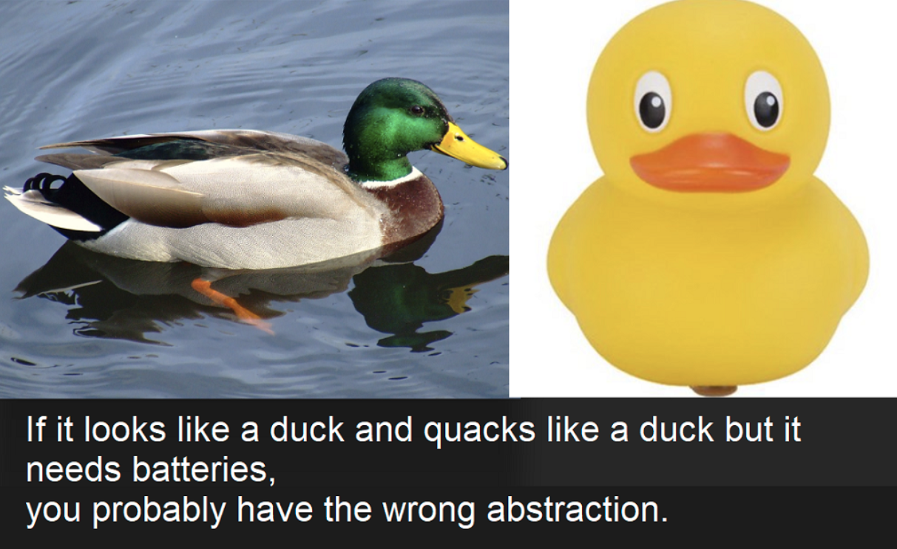
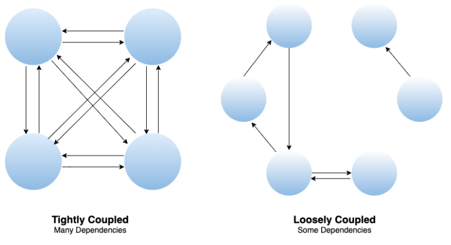
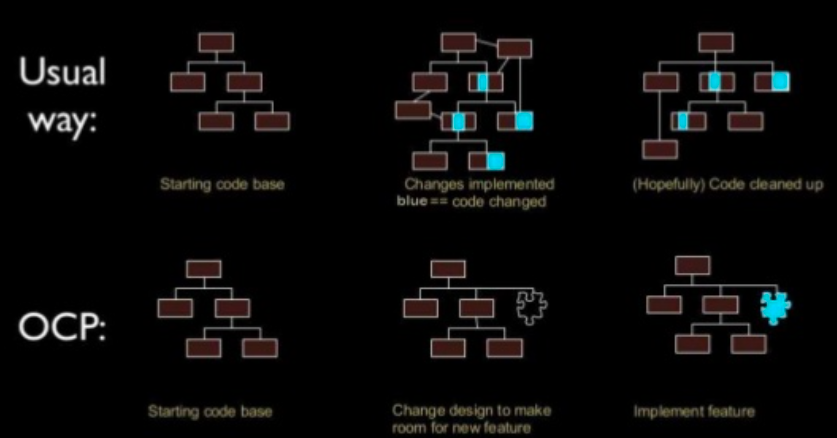
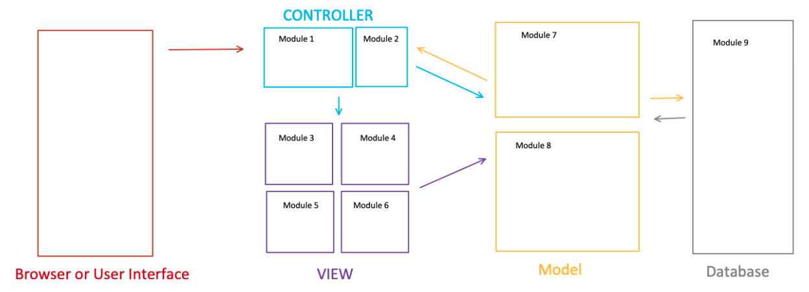

# Principle

> Terms

* SOLID: Single responsibility, Open closed, Liskov substitution, Interface Segregation, Dependency inversion

## Dependency Inversion

* High-level modules should not depend on low-level modules
* Both should depend on abstractions, abstractions should not depend on details
* many unit testing tools rely on inheritance to accomplish mocking





```java
class Toyo { int wheelSize() { … } }  // Car depends on Toyo
class Car {
  Toyo tire;
  Car(int size) { tire= new Toyo(size); }
  int wheelSize() { return tire.size(); }
}
Car car = new Car(18);

interface ITire { int wheelSize(); }  // Car depends on interface
class Tire implements ITire { int wheelSize(){} }
class Car {
  ITire tire;
  Car(int size) { this.tire = new Toyo(size); }
  int wheelSize() { return tire.size(); }
}
Car car = new Car(new Toyo(18));
```




## DRY

* Do not repeat yourself
* reducing repetition of software patterns, replacing it with abstractions or using data normalization to avoid redundancy

## Interface Segregation



* no client should be forced to depend on methods it does not use

## Liskov substitution



* S is a subtype of T, then objects of type T may be replaced with objects of type S (GAPI kernel impl)

## Loose Coupling



* changes should not change other classes for maintainable/extensible code

## Open Closed



* Classes should be open to extension but closed to modification
* Don’t new an object’s fields inside its constructor, pass in via constructor (or setter) instead




```java
Car myCar = new Car(18);           // X
Car myCar = new Car(new Tire(18)); // O

// Provide a setter to change behavior on the fly
interface Itire { ...int size(); … }
class Toyo implements ITire { … int size() { … } … }
class Car {
  ITire tire;                                                // compose interface
  void setTire(ITire tire) { this.tire = tire; } // merely set Tire, not change tire
}
```




## Single responsibility

* When a new type of event is added, only need to add new event class
* Each class should have one responsibility (entity, capability, relationship, computation, etc)
* Easy to violate SRP because objects need to be connected to one another
* Is the class minding its own business?
* For method X, does the method "X itself"?
* For element X, should the class know about X?
* For class C, is change X a "C reason" to change?




```java
class Person {
  public void rainOn(); // X
  public boolean isWet(); // O
  public String getSpouseName(); // X
  public boolean isLeftHanded(); // O
}
```




## Separation of concern



* Program that embodies SoC well is called a modular program
