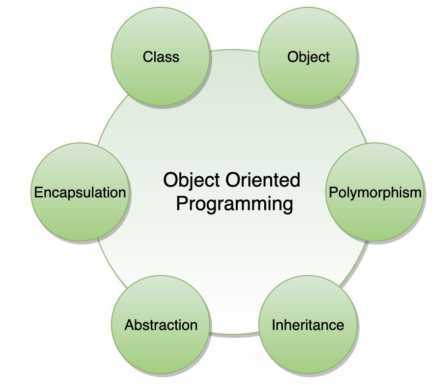
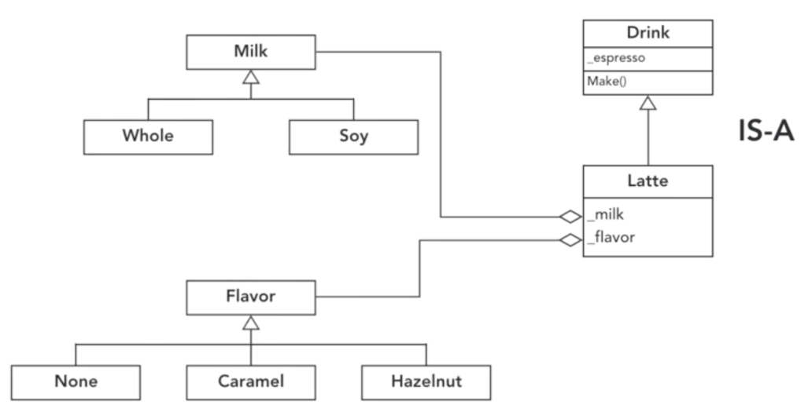
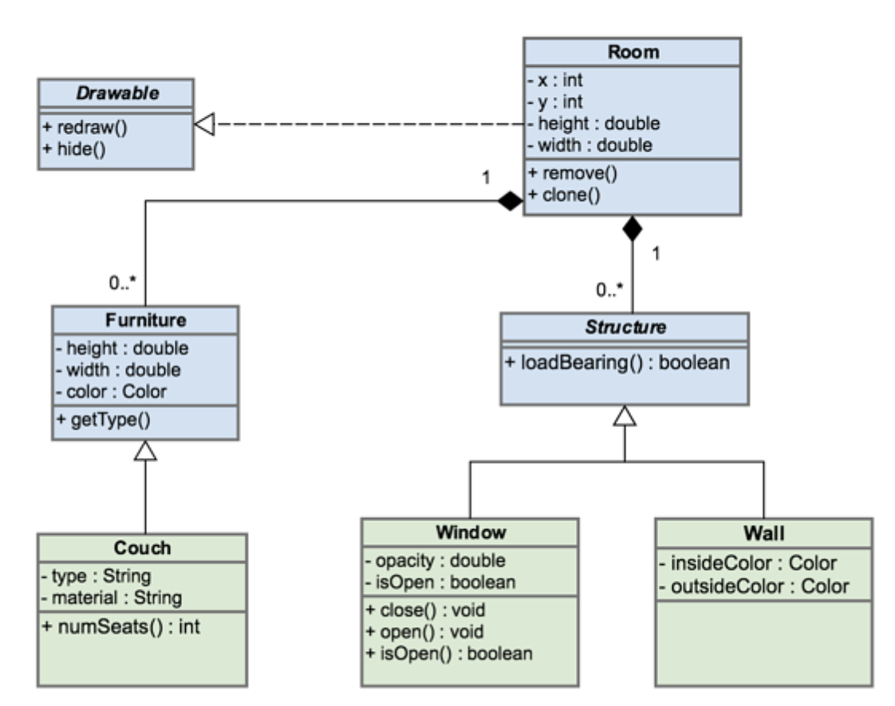
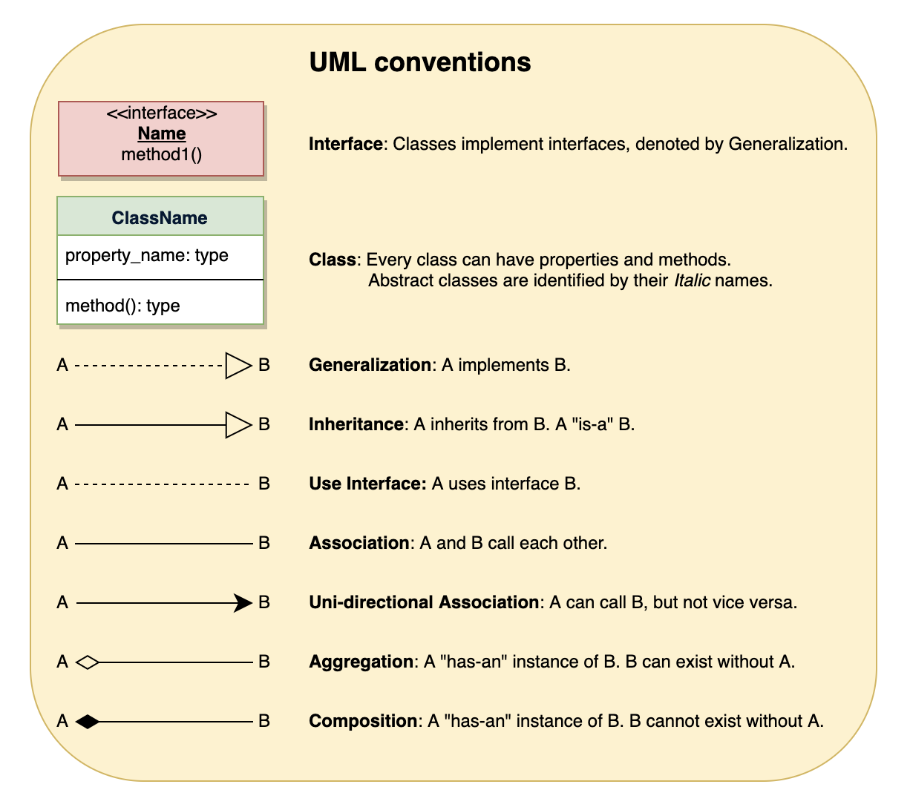
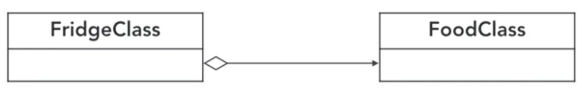
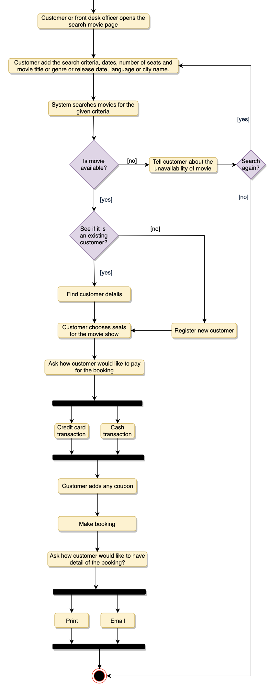
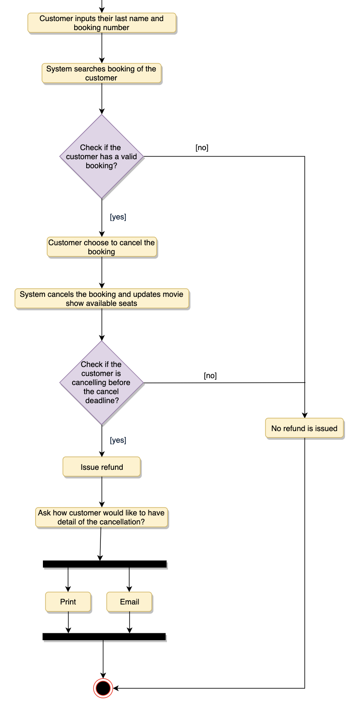

# Design

> Term

* Tech debt: temporarily speed up for new features, but gradually slow your progress
  * business pressure, lack of understanding of consequence of it, lack of tests / documentation / interactions
  * delayed refactoring, long-term simultaneous development, lack of compliance monitoring, incompetence
* Refactor: Seperate commit with new functionality
  * Rule of three (start refactor after 3 similar things), adding new feature of others, fixing a bug, code review

* [Refactoring Guru](https://refactoring.guru/refactoring/techniques/composing-methods)




```py
# 1. Replace temp with Query
""" BAD """
def calculateTotal():
  basePrice = quantity * itemPrice
  if basePrice > 1000:
    return basePrice * 0.95
  else:
    return basePrice * 0.98

class Report:
  def sendReport(self):
    nextDay = Date(self.previousEnd.getYear(), self.previousEnd.getMonth(), self.previousEnd.getDate() + 1)

""" Good """
def calculateTotal():
  if basePrice() > 1000:
    return basePrice() * 0.95
  else:
    return basePrice() * 0.98

def basePrice():
  return quantity * itemPrice

class Report:
  def sendReport(self):
    newStart = self._nextDay(self.previousEnd)

  def _nextDay(self, arg):
    return Date(arg.getYear(), arg.getMonth(), arg.getDate() + 1)

# 2. Split temporary varialbe
""" BAD """
temp = 2 * (height + width)
print(temp)
temp = height * width
print(temp)

""" Good """
perimeter = 2 * (height + width)
print(perimeter)
area = height * width
print(area)

# 3. Shorter codes
""" BAD """
class PizzaDelivery:
  def getRating(self):
    return 2 if self.moreThanFiveLateDeliveries() else 1

  def moreThanFiveLateDeliveries(self):
    return self.numberOfLateDeliveries > 5

""" GOOD """
class PizzaDelivery:
  def getRating(self):
    return 2 if self.numberOfLateDeliveries > 5 else 1
```




## OOP

* Object Oriented Programming
* Consistent terminology / Templates that match problem to solution
* Only relevant in OO languages → not in C

* Order
  1. Identifying the objects in a system;
  2. Defining relationships between objects;
  3. Establishing the interface of each object;
  4. Making a design, which can be converted to executables using OO languages.



> Terms

* Abstraction: process of removing physical, spatial, temporal details in objects to focus attention on details
  * objects talk to each other -> difficult to maintain a large code base
  * abstraction helps by hiding internal implementation details of objects and only revealing operations relevant to other

* Inheritance: Inheritance is the mechanism of creating new classes from existing ones

* Class: Template to create objects to avoid recreating them each time → cookie cutter
  * attributes → properties and state of entity
  * methods → behavior of entity

* Child Class: keeps attributes and methods of its parent
  * overrides / adds new attributes or methods of its own

* Object: Represents (the) noun (person, car, date) that responds to messages (method, things it does to itself)
  * Identity (coffee mug), Attributes (color, size, fullness), Behavior (fill() empty() clean())
  * Opaque so that it cannot be seen (messages are only way)
  * Active relation (collide) must be represented by a separate object like NearbyFriendsTracker

* Method: Programming procedure that can return a value
  * defined as part of a class → only access data known to its object

* Composition
  * Composition over inheritance → save memory (is_hot, is_sugar …)



* Encapsulation: bundling of data with methods that operate on data, or restrict access to some of components
* achieved when each object keeps its state private so that other objects don’t have direct access to its state

* Inheritance: mechanism of creating new classes from existing ones

* Polymorphism: ability of an object to take different forms and thus
  * depending upon context, to respond to same message in different ways
  * Allows child classes to be instantiated and treated as same type as its parent
  * Enables parent class to be manifested into any of its child classes

### UML



* Helps develop quick understanding of software system, hand the system over new team
* breaking complex system into discrete pieces, abstract out concepts of language or tech
* communicate design decisions

> Term

* Aggregation: Implies a relationship where the child can exist independently of the parent
  * [ex] professor ↔ students
  
  

* Association: Represents the ability of one instance to send a message to another instance
  * [ex] student ↔ seat

* Composition
  * It is not a standard UML relationship, but it is still used in various applications
  * whole/part relationship. if composite is deleted, other associated parts are delete
  * Final keyword to represent Composition
  * [ex] visitor center ↔ Lobby, Human ↔ Leg
  * Implement: class implements interface

* Visibility: (public), - (private) # (protected) ~ (package)

* Behavior UML
  * Activity diagram: captures the process flow, used for functional modeling
  * Communication diagram
  * Interaction overview diagram
  * Sequence diagram: tracks the interaction between the objects
  * State diagram
  * Timing diagram
  * Use case diagram: set of actions (use cases) that a system can perform in collaboration with one+ external users of system
  * Actors: An actor is an entity who performs specific actions
  * System boundary: defines the scope and limits of the system
  * describes high-level functional behavior of the system as a user point of view
  * what will the system do / not do

* Structural UML: Class, Object, Component, Composite structure, Profile diagram
  * Deployment, Package




* django_extensions
  * pip install django_extensions (add to INSTALLED_APPS)
  * pip install pygraphviz (pydotplus for mac)
  * brew install graphviz




### Moview Ticket

> Activity Diagram










