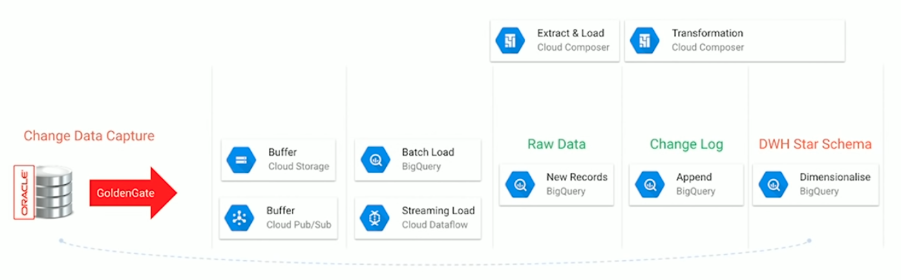

# Architecture

* Increaese design awareness in software community

* Class should be deep: Add complexity, must restructure when requirement changes
  * Abstraction
  [ex]
  [-] Java File IO
  [+] Linux File IO)
  

* Desfine Errors Out of Existence: Huge source of complexity -> define semantics to eliminate exceptions
  * Minimize the number of places where exceptions must be handled (vs return value)
  * tcl unset command enclosed with all exception handler
  * [ex]
  Window: can't delete file if open vs Linux: delete file and clean up when deleted closed
  Java: substring range exceptions vs Python: not throw exception

* Tactical vs Strategic Programming: get next feature / bug fix working ASAP / No shortcuts No kludges
  * bad design, high complexity, tactical tornadoes
  * Startup's deadline / Facebook move quickly
  

> Types

* Microservice: independently deployable modules
  * [+] tests are also faster / faster, simpler CD
  * [+] Each microservice can be independently scaled / robust / security

* Service Oriented Architecture (SOA): architectural style that supports service orientation
  * [+] Greater business agility; faster time to market, Improved collaboration between business and IT
  * [+] Ability to leverage legacy functionality in new markets
  1. It logically represents a repeatable business activity with a specified outcome
  2. It is self-contained
  3. It is a black box for its consumers, meaning the consumer does not have to be aware of the service's inner workings
  4. It may be composed of other services

* single-tier app: application where user interface, backend business logic & database all reside in same machine
  * [-] business has no control over the application, cannot fix buggy code
  * [-] vulnerable to being tweaked & reversed engineered

* Two tier: Logical separation of components in an application or a service
  * components are the database, backend application server, user interface, messaging, caching
  




* Django: Model-view-controller
  
  * URL patterns to decide which view to pass the request to for handling
  * project can contain multiple apps
  * automatically reloads Python code for each request as needed








* Storage and compute is independantly scaleable
* Rmote memory shuffle
  * [+] Faster performance for complex queries, join and aggregate more data, better scalability
  * [+] Secure: Data is splitted into data blocks which is compressed, encrypted with different keys
  

* Managed Storage: Tables are stored in optimized columnar format
  * Each table is compressed and encrypted on disk
  * avro -> parquet / orc -> csv -> json -> csv (compressed) -> json (compressed) (gzip data are not splittable)
  * [+] No limit on data injestion
  






* Slave master: asymmetric communication or control where device, process controls 1+ other devices, processes
  * serves as their communication hub
  




> Reference

[GCP Architecture](https://www.youtube.com/watch?v=ZVgt1-LfWW4)
[Design of Computer architecture](https://www.youtube.com/watch?v=bmSAYlu0NcY)
<https://towardsdatascience.com/10-common-software-architectural-patterns-in-a-nutshell-a0b47a1e9013>

## Client Server

* [+] Good to model a set of services where clients can request them
* [-] Requests are typically handled in seperate threads on the server
* [-] IPC causes overhead as different clients have different representations
* [ex] Online applications such as email, document sharing and banking

> Term

* Server: Provide services to multiple client components
* Client: Request services from the server and the server provides relevant services to those clients

## Layered

* Can be used to structure programs that can be decomposed into groups of subtasks, each at particular level of abstraction
* Each layer provides services to the next higher layer.
* The most commonly found 4 layers of a general information system are as follows
  * Presentation layer (UI layer)
  * Application layer (service layer)
  * Business logic layer (domain layer)
  * Data access layer (persistence layer)
* [+] Lower layer can be used by different higher layers
* [+] Changes can be made with the layer without affecting other
* [+] Standardization easier as we can clearly define levels
* [-] Not universally applicable, certain layer may have to be skipped in certain situation
* [ex] General desktop applications, E commerce web applications

## Master Slave

* Only applied when problem is decomposable
* [+] Execution of service is delegated to different slaves, with different impl
* [-] Slave is isolated without shared state. latency in master-slave communcation can be an issue
* [ex] Jenkins, DB replication: master DB as authoritative source, and slave DB are synchronized to it

> Term

* Master: distributes the work among identical slave components, and computes a final result from the results
* Slave: Compute and return to master

## MVC

* Model view controller
* [+] Makes it easy to have multiple dynamic views of same model at run-time
* [-] Increase complexity, unnecessary updates for user actions
* [ex] Django, Rails


## MVP

* Model view presenter
  * Model: the data (subject)
  * View: a rendering of the data, often a UI
  * Presenter: Mediator that manages the relationships
* Upgrade version of Observer → View may not be just a passive view
* Model and View pre-exists → Can't have view observe model because view doesn't implement Observer interface for subject





```java
/* 1. Data Display */
// Bad has circular dependecy
class Data {
  int data = 0;
  void setData(int d) { data = d; }
}
class Display {
  void show(int v) { print(“val: ” + v); }
}

// Good
interface DataSubject { void register(DataObserver do); }
interface DataObserver { void newData(int d); }
class Data implements DataSubject {
  int data = 0;
  ArrayList<DataObserver> observers;
  void setData(int d) { data = d; notify(d); }
  void register(DataObserver do) { observers.add(do); }
  void notify(int d) { for (DataObserver obs: Observers) obs.newData(d); }
}
class Display {
  void show(int v) { Print("val: " + v); }
}
class DataDispMed implements DataObserver {
  DataSubject ds;
  Display disp;
  DataDispMed(DataSubject ds, Display disp) {
      this.ds = ds;
      this.disp = disp;
      ds.register(this);
  }
  void newData(int d) { disp.show(d); }
}
void main() {
  Data data = new Data();
  Display = new Display();
  DataDispMed ddm = new DataDispMed(data, disp);
  data.setData(5); // print “val: 5”
}

/* 2. Account */
// Bad : Circular dependency
class Acct {
  void withdraw(int a) {
    if (a ≥ bal) bal -= a;
    ui.show(bal);
  }
}
class UI {
  void show(int b) { print(“balance” + b); }
  void withdraw(int a) { acct.withdraw(a); }
}

// Good
interface AcctSubject { void register(AcctObserver do); }
interface AcctObserver { void newbal(int b); }

class Acct implements AcctSubject {
  List<AcctObserver> aos;
  void withdraw(int a) { bal -= a; notify(); }
  void reg(AcctObserver ao) { aos.add(ao); }
  void notify() {
    for (AcctObserver ao : aos) { ao.newbal(bal); }
  }
}

class UI implements AcctObserver {
  Acct acct;
  UI(Acct acct) { this.acct = acct; }
  void show(int b) { print(“balance” + b); }
  void withdraw(int a) { acct.withdraw(a); }
  void newbal(int b) { show(b); }
}

void main() {
  Acct acct = new Acct();
  UI ui = new UI(acct);
  acct.reg(ui);
}

// Best
class AcctUIMediator implements AccountObserver, UIObserver {
  UI ui; Acct acct;
  void newbal(int b) { ui.show(b); }
  void withdraw(int a) { acct.withdraw(a); }
}
interface AcctSubject {
  void register(AcctObserver do);
  void notify();
}
interface AcctObserver { void newbal(int b); }
class Acct implements AcctSubject {
  List<AcctObserver> aos;
  void withdraw(int a) { bal -= a; notify(); }
  void register(AcctObserver ao) { aos.add(ao); }
  void notify() {
    for (AcctObserver ao : aos) { ao.newbal(bal); }
  }
}

interface UISubject { void register(UIObserver do); void notify(); }
interface UIObserver { void show(); }
class UI implements UISubject {
  void show(int b) { print(“balance: “ + b); }
  void withdraw(int a) { notify(a); }
}

void main() {
  Acct acct = new Acct();
  UI ui = new UI();
  AcctUIMed aum = new AcctUIMed(acct, ui);
  acct.register(aum);
  ui.register(aum);
}
```



